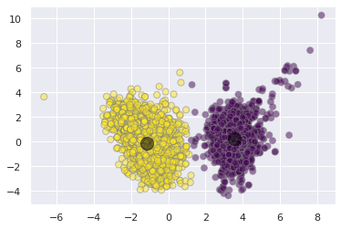
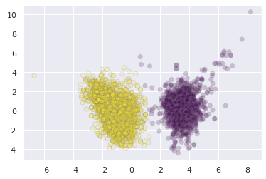
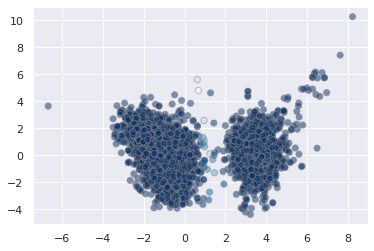
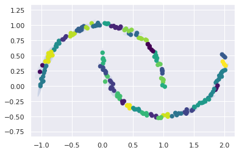

<a href="https://colab.research.google.com/github/wesleybeckner/data_science_foundations/blob/main/notebooks/S5_Unsupervised_Learning.ipynb" target="_parent"></a>

# Data Science Foundations, Session 5: Unsupervised Learning: Clustering and Dimensionality Reduction

**Instructor**: Wesley Beckner

**Contact**: wesleybeckner@gmail.com

---

<br>

In the previous session we began our discussion on feature engineering and ended with a sneak peak into dimensionality reduction. This last topic deserves a whole session on its own because its use case is not limited to feature engineering! It can also be used as a tool for visualization, for noise filtering, and much more. In this session we discuss dimensionality reduction along with other unsupervised learning methods. 

Up until now, the only learning estimators we've looked at were supervised ones: estimators that predict labels based on training data. Here, however, we are interested in uncovering aspects of the data without reference to any known labels. The usefulness for these learners will become immediately apparent when we revist our wine quality models from Course 1, Session 7!

<br>

---

<br>

<a name='top'></a>

<a name='3.0'></a>

## 5.0 Preparing Environment and Importing Data

[back to top](#top)

<a name='x.0.1'></a>

### 5.0.1 Import Packages

[back to top](#top)


```python
import pandas as pd
import numpy as np
import datetime
import matplotlib.pyplot as plt
import plotly.express as px
import random
import scipy.stats
from sklearn.preprocessing import OneHotEncoder
from statsmodels.stats.outliers_influence import variance_inflation_factor
from sklearn.linear_model import LinearRegression
from sklearn.model_selection import train_test_split
from sklearn.metrics import mean_squared_error, r2_score, silhouette_score, calinski_harabasz_score
from sklearn.mixture import GaussianMixture
from sklearn.impute import SimpleImputer
from scipy.spatial.distance import cdist
import seaborn as sns; sns.set()
import copy
```

<a name='x.0.2'></a>

### 5.0.2 Load and Process Dataset

[back to top](#top)


```python
wine = pd.read_csv("https://raw.githubusercontent.com/wesleybeckner/"\
      "ds_for_engineers/main/data/wine_quality/winequalityN.csv")
# infer str cols
str_cols = list(wine.select_dtypes(include='object').columns)

#set target col
target = 'density'

enc = OneHotEncoder()
imp = SimpleImputer()

enc.fit_transform(wine[str_cols])
X_cat = enc.transform(wine[str_cols]).toarray()
X = wine.copy()
[X.pop(i) for i in str_cols]
y = X.pop(target)
X = imp.fit_transform(X)
X_wine = np.hstack([X_cat, X])

cols = [i.split("_")[1] for i in enc.get_feature_names_out()]
cols += list(wine.columns)
cols.remove(target)
[cols.remove(i) for i in str_cols]

scaler = StandardScaler()
X_wine[:,2:] = scaler.fit_transform(X_wine[:,2:])

wine = pd.DataFrame(X_wine, columns=cols)
wine['density'] = y
```

<a name='3.1'></a>

## 5.1 Principal Component Analysis

[back to top](#top)

Principle Component Analysis or PCA is one of the most wide spread implementations of dimensionality reduction. In PCA, we find the principle components, or linear recombinations of the dimensions of the data, that best explain the variance of the data. 

<a name='x.1.1'></a>

### 5.1.1 The Covariance Matrix

[back to top](#top)

In the cell below, we have plotted acidity and density from our familiar wine dataset.


```python
fig, ax = plt.subplots(1, 1, figsize=(5,5))
wine.loc[wine['red'] == 1].plot(x='fixed acidity', 
                                     y='density', 
                                     ax=ax, 
                                     ls='', marker='.')
```


    <AxesSubplot:xlabel='fixed acidity'>


    

    


```python
X = wine.loc[wine['red'] == 1][['fixed acidity', 'density']].values
X[:5]
```


    array([[0.14156636, 0.9978    ],
           [0.45029132, 0.9968    ],
           [0.45029132, 0.997     ],
           [3.07445349, 0.998     ],
           [0.14156636, 0.9978    ]])


The principal components, are actually the eigenvectors of the covariance matrix of the standardized data. 

We will perform this by hand to get an understanding.

First we standardize the data


```python
from sklearn.preprocessing import StandardScaler
X_std = StandardScaler().fit_transform(X) # note I've already done this in 5.0.2
```

Then we compute the covariance matrix. There is a nice demonstration of computing covariance on [stats quest](https://www.youtube.com/watch?v=qtaqvPAeEJY).

The covariance can be expressed as:

$$ cov(X,Y) = \frac{1}{n^2}\sum\sum(x_i - x_j)(y_i - y_j) \;\;\;\;\;\sf eq. 1 $$

Every \\((x_i - x_j)(y_i - y_j)\\) is the area described by the rectangle between points \\(i\\) and \\(j\\), and we if we deem to color positive changes as red and negative ones as blue, we get a picture like the following: 


<p align=center>
</img>
</p>

When we view all the pairwise interactions in aggregate we get a sense of how the areas of rectangles made by each observation influence the covariance:

<p align=center>
</img>
</p>

As a side note, the covariance term is the numerator in the pearsons correlation we covered last week:

$$\rho_{x,y} = \frac{cov(X,Y)}{\sigma_x\sigma_y} \;\;\;\;\;\sf eq. 2 $$

Extrapolating \\(Eq. 1\\) across the entire matrix, \\(X\\) of datapoints:

$$ C = \frac{1}{n-1}(X - \bar{X})^{T} \cdot (X - \bar{X}) \;\;\;\;\;\sf eq. 3 $$

The covariance matrix of our wine data can be obtained from \\(Eq. 3\\):


```python
import numpy as np
mean_vec = np.mean(X_std, axis=0)
cov_mat = (X_std - mean_vec).T.dot((X_std - mean_vec)) / (X_std.shape[0]-1)
print('Covariance matrix \n%s' %cov_mat)
```

    Covariance matrix 
    [[1.00062578 0.66847772]
     [0.66847772 1.00062578]]


### 5.1.2 How Does the Covariance Matrix Relate to the New Coordinate System

1. We desire a new coordinate system that has no covariance between its dimensions (thus each dimension can be sorted by explained variance to isolate key dimensions (i.e. principal components)) 
2. Because the covariance matrix in \\(Eq. 3\\) is a square matrix, we can diagonalize it; the new dimensional space whose covariance matrix is expressed by this diagonolized matrix will have the desired properties explained in point 1 (because everything off the diagonal is zero)
3. The difficult and unintuitive part of PCA is that the vector that produces this transformation to the new coordinate space is given by the eigenvectors of \\(C\\). For those who are interested in investigating further I suggest reading this [answer](https://stats.stackexchange.com/questions/217995/what-is-an-intuitive-explanation-for-how-pca-turns-from-a-geometric-problem-wit) by _amoeba_ and this [answer](https://stats.stackexchange.com/questions/10251/what-is-the-objective-function-of-pca/10256#10256) by _cardinal_. For a more geometric explanation of the principal components checkout the [grandparent, spouse, daughter parable](https://stats.stackexchange.com/questions/2691/making-sense-of-principal-component-analysis-eigenvectors-eigenvalues/140579#140579)

> These arguments coincide with the _Spectral theorem_ explanation of PCA, and you can read more about it in the links provided above

In 5.1.2 I provide a segue into deriving eigenvectors and eigenvalues, feel free to visit these foundational topics, although they are not necessary to reap the value of PCA. 

For this particular set of wine data, we will see that the corresponding diagonalized matrix will look like:
 
$$ \begin{bmatrix} 1.67 & 0 \\ 0 & 0.33 \end{bmatrix} $$

#### 🌭 5.1.2.1 Enrichment: Deriving the Eigenvectors and Eigenvalues

The principal components are found mathematically by determining the eigenvectors of the covariance matrix and sorting them by their egienvalues, i.e. their explained variance. 

There is a mathematical proof [1](https://stats.stackexchange.com/questions/217995/what-is-an-intuitive-explanation-for-how-pca-turns-from-a-geometric-problem-wit), [2](https://stats.stackexchange.com/questions/10251/what-is-the-objective-function-of-pca/10256#10256) for why this works, but we will not cover that here. 

So how do we calculate eigenvalues and their correpsonding eigenvectors? This question is usually posited in the following format:

$$ A \cdot v = \lambda \cdot v \;\;\;\;\;\sf eq. 3 $$

In this equation A is an n-by-n matrix (our covariance matrix in this case), v is a non-zero n-by-1 vector and λ is a scalar (which may be either real or complex).  Any value of λ for which this equation has a solution is known as an eigenvalue of the matrix A.

> In other words v, is an eigenvector of A if there exists a scalar value such that \\(A \cdot v\\) and \\(\lambda \cdot v\\) will yield the same result

In high school or college, we might've solved for these eigenvalues and eigenvectors by hand using simple, integer-bound matrices of A. Here's an example, for this matrix: 

$$ \begin{bmatrix} -6 & 3 \\ 4 & 5\end{bmatrix} $$

an eigenvector is:

$$ \begin{bmatrix} 1 \\ 4 \end{bmatrix} $$

with a corresponding eigenvalue of 6.

Taking the requisite dot products for each side of eq. 3, \\(A v\\) gives us:

$$ \begin{bmatrix} -6 & 3 & \\ 4 & 5 \end{bmatrix} 
\begin{bmatrix} 1 \\ 4 \end{bmatrix} = 
\begin{bmatrix} 6 \\ 24 \end{bmatrix}$$

and \\(\lambda v\\):

$$ 6 \begin{bmatrix} 1 \\ 4 \end{bmatrix}  =
\begin{bmatrix} 6 \\ 24\end{bmatrix} $$

#### 🌭  5.1.2.2: Find the Eigenvalues

The trick that is employed to decompose these equality statements is to multiply the right hand side of eq. 3 by an identity matrix and then subtract this quantity from both sides of the equation. In the case of \\(v\\) being non-zero, this becomes the [determinant](https://www.mathsisfun.com/algebra/matrix-determinant.html):

$$ | A - \lambda I | = 0 $$

In the case of our simple example

$$ \begin{vmatrix}  \begin{bmatrix} -6 & 3  \\ 4 & 5 \end{bmatrix} - \lambda
\begin{bmatrix} 1 & 0 \\ 0 & 1 \end{bmatrix} \end{vmatrix}  = 0$$

simplifies to

$$ \begin{vmatrix}  -6-\lambda & 3  \\ 4 & 5-\lambda  \end{vmatrix}  = 0$$

writing out the determinant

$$ (-6-\lambda)(5-\lambda) - 3 x 4 = 0 $$

gives the quadratic equation

$$ \lambda^2 + \lambda - 42 = 0 $$

and solving for \\(\lambda\\)

$$ \lambda = -7 \space or \space 6 $$


```python
from scipy.optimize import fsolve, leastsq

A = np.array([[-6, 3], [4, 5]])
I = np.array([[1, 0],[0, 1]])

# define the determinant
def det(lamb):
    """
    A: the covariance matrix
    I: the identity matrix
    """
    return (A[0,0] - lamb) * (A[1,1] - lamb) - (A[0,1]*A[1,0])

root = fsolve(det, [-10, 10])
print(np.isclose(det(root), [0.0, 0.0]))
print(root)
```

    [ True  True]
    [-7.  6.]


#### 🌭  5.1.2.3: Find the Eigenvectors

We find the eigenvector for each corresponding eigenvalue one at a time

$$ \begin{bmatrix} -6 & 3 & \\ 4 & 5 \end{bmatrix} 
\begin{bmatrix} x \\ y \end{bmatrix} = 6
\begin{bmatrix} x \\ y \end{bmatrix}$$

multiplying out gives the system of equations

$$ -6x + 3y = 6x $$
$$ 4x + 5y = 6y $$

bringing to the left hand side

$$ -12x + 3y = 0 $$
$$ 4x - 1y = 0 $$

solving for either equation yeilds \\(y = 4x\\) so the eigenvector is

$$ \begin{bmatrix} 1 \\ 4 \end{bmatrix} $$


```python
def eig(vec):
    """
    A: the covariance matrix
    lamb: the eigen value
    """
    
    return [A[0,0]*vec[0] + A[0,1]*vec[1] - lamb*vec[0],
            A[1,0]*vec[0] + A[1,1]*vec[1] - lamb*vec[1]]

lamb = round(root[0])
vector = fsolve(eig, [1, -4])
print(lamb)
print(np.isclose(eig(vector), [0.0, 0.0]))
vector[np.argmax(vector)] = int(round(max(vector)/min(vector)))
vector[np.argmin(vector)] = 1
print(vector)
print()

lamb = round(root[1])
vector = fsolve(eig, [1, 10])
print(lamb)
print(np.isclose(eig(vector), [0.0, 0.0]))
vector[np.argmax(vector)] = int(round(max(vector)/min(vector)))
vector[np.argmin(vector)] = 1
print(vector)
print()
```

    -7
    [ True  True]
    [-3.  1.]
    
    6
    [ True  True]
    [1. 4.]
    


```python
# we can solve for the eigenvalues/vectors of our covariance
# matrix using numpy!
eig_vals, eig_vecs = np.linalg.eig(A)

print('Eigenvectors \n%s' %eig_vecs)
print('\nEigenvalues \n%s' %eig_vals)
```

    Eigenvectors 
    [[-0.9486833  -0.24253563]
     [ 0.31622777 -0.9701425 ]]
    
    Eigenvalues 
    [-7.  6.]


### 5.1.3 Projecting onto the Principal Components

To complete our principal component analysis, we need to project our data onto the eigenvectors of the covariance matrix. We can oobtain the eigenvectors and corresponding eigenvalues using `np` or `scipy`. Here I've completed the task with `np`:


```python
cov_mat = np.cov(X_std.T)

# we can solve for the eigenvalues/vectors of our covariance
# matrix using numpy!
eig_vals, eig_vecs = np.linalg.eig(cov_mat)

print('Eigenvectors \n%s' %eig_vecs)
print('\nEigenvalues \n%s' %eig_vals)
```

    Eigenvectors 
    [[-0.70710678 -0.70710678]
     [ 0.70710678 -0.70710678]]
    
    Eigenvalues 
    [0.33214806 1.6691035 ]


And now we are just going to sort our vectors by their eigenvalues to get the proper order of principal components:


```python
# Make a list of (eigenvalue, eigenvector) tuples
eig_pairs = [(np.abs(eig_vals[i]), eig_vecs[:,i]) for i in range(len(eig_vals))]

# Sort the (eigenvalue, eigenvector) tuples from high to low
eig_pairs.sort(key=lambda x: x[0], reverse=True)

# Visually confirm that the list is correctly sorted by decreasing eigenvalues
print('Eigenvalues in descending order:')
for i in eig_pairs:
    print(i[0])
```

    Eigenvalues in descending order:
    1.669103500110071
    0.3321480643454986


```python
eig_pairs
```


    [(1.669103500110071, array([-0.70710678, -0.70710678])),
     (0.3321480643454986, array([-0.70710678,  0.70710678]))]


For those of us who are familiar with eigenvectors, we should recognize that they are necessarily orthogonal to one another. This is good to know from the PCA point of view, because we wouldn't want the variance along one vector to be explained by another. Let's plot these vectors along with the standardized data:


```python
fig, ax = plt.subplots(1,1,figsize=(7,7))

ax.plot(X_std[:,0],X_std[:,1],ls='',marker='.', alpha=0.5)

for vec, color in zip(range(eig_vecs.shape[0]),['orange', 'green']):

  ax.plot([np.mean(X_std[:,0]),
           (eig_pairs[vec][1][0]+np.mean(X_std[:,0]))*-eig_pairs[vec][0]],
          [np.mean(X_std[:,1]),
           (eig_pairs[vec][1][1]+np.mean(X_std[:,1]))*-eig_pairs[vec][0]],
          color=f'tab:{color}', linewidth=4)
  
  ax.plot([np.mean(X_std[:,0]),
           (eig_pairs[vec][1][0]+np.mean(X_std[:,0]))*eig_pairs[vec][0]],
          [np.mean(X_std[:,1]),
           (eig_pairs[vec][1][1]+np.mean(X_std[:,1]))*eig_pairs[vec][0]],
          color=f'tab:{color}', linewidth=4)
  
ax.set_aspect('equal')
ax.set_ylim(min(X_std[:,1]),max(X_std[:,1]))
ax.set_xlim(min(X_std[:,0]),max(X_std[:,0]))
```


    (-2.138871623907465, 4.356979103463171)


    

    


We indeed see that these vectors are orthogonal. 

Continuing on with our task of projecting the data onto our principal components, in order to project our data onto the PCs I'll need to reshape `eig_pairs`:


```python
matrix_w = np.hstack((eig_pairs[0][1].reshape(2,1),
                      eig_pairs[1][1].reshape(2,1)))

print('Matrix W:\n', matrix_w)
```

    Matrix W:
     [[-0.70710678 -0.70710678]
     [-0.70710678  0.70710678]]


And now taking the dot product:


```python
Y = X_std.dot(matrix_w)
```


```python
plt.scatter(Y[:,0],Y[:,1])
```


    <matplotlib.collections.PathCollection at 0x7f999be6c9d0>


    

    


We see that our data is dispersed nicely along these PCs. Finally to tie this in with the point made at the end of 5.1.2, we see that the covariance matrix for the data in this new space is described by the diagonalized matrix of the former dimensional space:


```python
mean_vec = np.mean(Y, axis=0)
cov_mat = (Y - mean_vec).T.dot((Y - mean_vec)) / (Y.shape[0]-1)
cov_mat
```


    array([[1.66910350e+00, 1.76746394e-16],
           [1.76746394e-16, 3.32148064e-01]])


### 5.1.4 Cumulative Explained Variance

Often we will need to decide just how many principal components are enough, especially with high dimensional data containing many colinear variables. To assist with this, data scientists will plot the cumulative explained variance. The explained variance is captured by the eigenvalues (this is why we sort by the eigenvalues in the first place). 


```python
tot = sum(eig_vals)
var_exp = [(i / tot)*100 for i in sorted(eig_vals, reverse=True)]
cum_var_exp = np.cumsum(var_exp)

with plt.style.context('seaborn-whitegrid'):
    plt.figure(figsize=(7, 4))

    plt.bar(range(2), var_exp, alpha=0.5, align='center',
            label='individual explained variance')
    plt.step(range(2), cum_var_exp, where='mid',
             label='cumulative explained variance')
    
    plt.ylabel('Explained variance ratio')
    plt.xlabel('Principal components')
    plt.legend(loc='center right')
    plt.tight_layout()
```


    

    


### 5.1.5 PCA with Scikit-Learn

But we can avoid the fancy footwork and do all this in sklearn!


```python
from sklearn.decomposition import PCA
pca = PCA(n_components=2)
pca.fit(X_std)
```


    PCA(n_components=2)


We see that the values we get are the same as for the hand-calculated eigenvalues and vectors


```python
print(pca.components_)
```

    [[ 0.70710678  0.70710678]
     [ 0.70710678 -0.70710678]]


And the eigenvalues are under `pca.explained_variance_`


```python
print(pca.explained_variance_)
```

    [1.6691035  0.33214806]


<a name='3.1.1'></a>

### 5.1.6 PCA as Dimensionality Reduction

[back to top](#top)

One obvious use case for PCA, is to drop the dimensions with lowest explained variance. Continuing with our acidity/density example this will look like the following


```python
from sklearn.decomposition import PCA
pca = PCA(n_components=2)
pca.fit(X_std)
```


    PCA(n_components=2)


```python
fig, ax = plt.subplots(1,2,figsize=(10,5))

ax[0].plot(X_std[:,0],X_std[:,1],ls='',marker='.', alpha=0.5)

for vec, color in zip(range(eig_vecs.shape[0]),['orange', 'green']):

  ax[0].plot([np.mean(X_std[:,0]),
           (eig_pairs[vec][1][0]+np.mean(X_std[:,0]))*-eig_pairs[vec][0]],
          [np.mean(X_std[:,1]),
           (eig_pairs[vec][1][1]+np.mean(X_std[:,1]))*-eig_pairs[vec][0]],
          color=f'tab:{color}', linewidth=4)
  
  ax[0].plot([np.mean(X_std[:,0]),
           (eig_pairs[vec][1][0]+np.mean(X_std[:,0]))*eig_pairs[vec][0]],
          [np.mean(X_std[:,1]),
           (eig_pairs[vec][1][1]+np.mean(X_std[:,1]))*eig_pairs[vec][0]],
          color=f'tab:{color}', linewidth=4)
  
ax[0].set_aspect('equal')
ax[0].set_ylim(min(X_std[:,1]),max(X_std[:,1]))
ax[0].set_xlim(min(X_std[:,0]),max(X_std[:,0]))
ax[0].set_ylabel('Normalized density')
ax[0].set_xlabel('Normalized acidity')

ax[1].bar(range(2), var_exp, alpha=0.5, align='center',
        label='Individual')
ax[1].step(range(2), cum_var_exp, where='mid',
          label='Cumulative')

ax[1].set_ylabel('Explained variance ratio')
ax[1].set_xlabel('Principal components')
ax[1].legend()
```


    <matplotlib.legend.Legend at 0x7f99baaf0100>


    

    


We can capture 80% of the explained variance along just the first principal component. What does this projection look like?


```python
# we set our components to 1
pca = PCA(n_components=1)
pca.fit(X_std)

# we then project the data onto the first PC
# and then rebroadcast this transformation 
# back onto the orginal dimensions to see 
# what this looks like in terms of acidity/density
X_pca = pca.inverse_transform(pca.transform(X_std))

# original data
plt.scatter(X_std[:, 0], X_std[:, 1], alpha=0.2)

# projected data
plt.scatter(X_pca[:, 0], X_pca[:, 1], alpha=0.8)
```


    <matplotlib.collections.PathCollection at 0x7f99bd36a9a0>


    

    


<a name='3.1.2'></a>

### 5.1.7 PCA for visualization

[back to top](#top)

For classification tasks, PCA lends itself as a useful method for seeing how the classes separate on the highest variance dimensions of the data without consideration to the classes themselves, i.e. do our classes seperate out according to the other variables in the dataset.

With our wine dataset, we see that the wine types fall out nicely along the first two principal components


```python
X_std = StandardScaler().fit_transform(wine)
pca = PCA(n_components=2)
pca.fit(X_std)
X_pca = pca.transform(X_std)

plt.scatter(X_pca[:, 0], X_pca[:, 1], alpha=0.2, c=wine['white'].values,
            edgecolor='grey')
plt.xlabel('First PC')
plt.ylabel('Second PC')
```


    Text(0, 0.5, 'Second PC')


    

    


<a name='3.1.3'></a>

### 🌭 5.1.8 Enrichment: PCA as Outlier Removal and Noise Filtering

[back to top](#top)

In some cases, it can be advantageous to use PCA as a method for outlier removal. There are many caveats to this that we will not discuss here. But for those who are interested, [this](https://towardsdatascience.com/multivariate-outlier-detection-in-high-dimensional-spectral-data-45878fd0ccb8) is a great overview article. As for noise filteration, [Vanderplas' DS handbook](https://jakevdp.github.io/PythonDataScienceHandbook/05.09-principal-component-analysis.html#PCA-as-Noise-Filtering) has a good section on the topic as does [Guido/Muller's Intro to ML with Python](https://www.oreilly.com/library/view/introduction-to-machine/9781449369880/) by the same pusblisher.

<a name='3.1.4'></a>

### 5.1.9 PCA for Feature Engineering

[back to top](#top)

Finally, PCA is actually a commonly used preprocessing technique for supervised machine learning models. In the next exercise, our goal will be to use PCA to generate a new set of features, to feed into our linear model.

#### 🏋️ Exercise 1: PCA as Preprocessing for Models

Using the wine data, select any number of the first principal components and attemp to predict density for the red wine data.

Consider that the maximum number of principal components are:


```python
print(f"Max principal components: {X.shape[1]}")
```

    Max principal components: 14


```python
# Code Cell for Exercise 1

################################################################################
##### CREATE A SKLEARN-PCA OBJECT, FIT AND TRANSFORM TO THE WINE DATA ##########
################################################################################


################################################################################
############################## UNCOMMENT THE BELOW #############################
################################################################################
# plt.scatter(X_pca[:, 0], X_pca[:, 1], alpha=0.2, c=wine['white'].values,
#             edgecolor='grey')
# plt.xlabel('First PC')
# plt.ylabel('Second PC')
# plt.show()

# model = LinearRegression()
# X_train, X_test, y_train, y_test = train_test_split(X_pca, y_wine, train_size=0.8, random_state=42)

# model.fit(X_train, y_train)
# y_pred = model.predict(X_test)

# print(r2_score(y_test, y_pred))
# print(r2_score(y_train, model.predict(X_train)))
```


    

    


    0.9634516142421967
    0.953295487875815


<a name='3.2'></a>

## 5.2 K-Means Clustering

[back to top](#top)

We now embark on a second class of unsupervised learning techinques: clustering. 

The K-means algorithm works under two assumptions: 
  * every cluster can be defined by an arithmetic mean or cluster center
  * each point is closer to one arithmetic center than the other centers

Let's turn back to our wine dataset:


```python
X_std = StandardScaler().fit_transform(X_wine)
pca = PCA(n_components=2)
pca.fit(X_std)
X_pca = pca.transform(X_std)

plt.scatter(X_pca[:, 0], X_pca[:, 1], alpha=0.2, c='grey')
plt.xlabel('First PC')
plt.ylabel('Second PC')
```


    Text(0, 0.5, 'Second PC')


    

    


It is fairly obvious under these two dimensions that there are two clusters. The K-means algorithm automatically pics this out


```python
from sklearn.cluster import KMeans
kmeans = KMeans(n_clusters=2)
kmeans.fit(X_pca)
y_kmeans = kmeans.predict(X_pca)

plt.scatter(X_pca[:, 0], X_pca[:, 1], c=y_kmeans, s=50, 
            alpha=0.5, edgecolor='grey', cmap='viridis')

centers = kmeans.cluster_centers_
plt.scatter(centers[:, 0], centers[:, 1], c='black', s=200, alpha=0.5);
```


    

    


wa-la! Our simple unsupervised algorithm does a pretty good job of differentiating between the red and white wine clusters.

<a name='3.2.1'></a>

### 5.2.1 The Algorithm: Expectation-Maximization

[back to top](#top)

We won't go too far into the implementation of the underlying algorithm here. In its basic steps, however, it performs the following:

1. Initialize cluster centers (random guess)
2. Then repeat:
  1. E-Step: assign points to the nearest center (arithmetic distance)
  2. M-step: set the new center point for each cluster according to the mean of it's datapoint members

More information on K-means algorithm can be explored [here](https://jakevdp.github.io/PythonDataScienceHandbook/05.11-k-means.html#k-Means-Algorithm:-Expectation%E2%80%93Maximization)

<a name='3.2.2'></a>

### 5.2.2 Limitations

[back to top](#top)

A few brief notes on limitations:

1. the global optimum may not be achieved (no guarantee of finding the overall best solution)
2. the number of clusters must be guessed beforehand
3. cluster boundaries are unavoidably linear
    * and the cluster assignments are unavoidably circular
4. can be slow for large datasets
5. cluster assignments are non probabilistic

3 and 5 motivate our next section, Gaussian Mixture Models

### 5.2.3 Determining K with the Elbow Method

The elbow method is a popular technique for determining the value of `k`. It involves looping through a range of `k`'s and assessing some goodness of fit metric. Intuitively, we might presume those metrics involve some measure of the distance of datapoints to their cluster centers. We have options:

1. Distortion: distance (_typically Euclidean_) from the cluster centers averaged across the respective clusters. 
2. Inertia: the sum of squared distances of samples to their closest cluster center.
3. Silhouette: calculated using the mean intra-cluster distance (a) and the mean nearest-cluster distance (b) for each sample. 
    * To clarify, b is the distance between a sample and the nearest cluster that the sample is not a part of
    * The Silhouette Coefficient for a sample is (b-a) / max(b-a)
    * best value is 1 worst value is -1
4. Calinski Harabasz Score or Variance Ratio: the ratio between within-cluster dispersion and between-cluster dispersion
    * _should sound familiar to our [ANOVA discussion](https://wesleybeckner.github.io/data_science_foundations/S2_Inferential_Statistics/#steps-for-anova)_
    * higher is better
   
And there are many other [methods](https://scikit-learn.org/stable/modules/clustering.html#clustering-performance-evaluation) of evaluating cluster assignment performance

### 🙋‍♀️ Question 1: Comparing Metrics

What is the primary difference between Distortion, Inertia vs Silhouette, Calinksi?


```python
distortions = []
inertias = []
silhouette = []
variance = []
for k in range(1,10):
    kmeans = KMeans(n_clusters=k)
    kmeans.fit(X_pca)
    y_kmeans = kmeans.predict(X_pca)
    labels = kmeans.labels_
    
    distortions.append(sum(np.min(cdist(X_pca, kmeans.cluster_centers_,
                                        'euclidean'), axis=1)) / X.shape[0])
    inertias.append(kmeans.inertia_)
    
    if k > 1:
        silhouette.append(silhouette_score(X_pca, labels, metric = 'euclidean'))
        variance.append(calinski_harabasz_score(X_pca, labels))
```

We note in the following plots that inertia and distortion asymptotically improve with higher k (because they are unregularized) whereas silhouette and calinski metrics are penalized for inter-cluster relatability


```python
fig, [[ax1, ax2], [ax3, ax4]] = plt.subplots(2, 2, figsize=(10,10))

ax1.plot(range(1,10), distortions)
ax2.plot(range(1,10), inertias)
ax3.plot(range(2,10), silhouette)
ax4.plot(range(2,10), variance)
```


    [<matplotlib.lines.Line2D at 0x7f99b02e5430>]


    

    


```python
kmeans = KMeans(n_clusters=3)
kmeans.fit(X_pca)
y_kmeans = kmeans.predict(X_pca)

plt.scatter(X_pca[:, 0], X_pca[:, 1], c=y_kmeans, s=50, 
            alpha=0.5, edgecolor='grey', cmap='viridis')

centers = kmeans.cluster_centers_
plt.scatter(centers[:, 0], centers[:, 1], c='black', s=200, alpha=0.5);
```


    

    


<a name='3.3'></a>

## 5.3 Gaussian Mixture Models

[back to top](#top)

in the simplest case, GMMs can be used in the same way as K-means


```python
from sklearn.mixture import GaussianMixture
gmm = GaussianMixture(n_components=2).fit(X_pca)
labels = gmm.predict(X_pca)
plt.scatter(X_pca[:, 0], X_pca[:, 1], 
            c=labels, s=40, cmap='viridis',
            alpha=0.2, edgecolor='grey');
```


    

    


But because GMM is a probablistic model, we can visualize the certainty with which we assign these clusters.


```python
probs = gmm.predict_proba(X_pca)
print(probs[5:20].round(3))
```

    [[1. 0.]
     [1. 0.]
     [1. 0.]
     [1. 0.]
     [1. 0.]
     [1. 0.]
     [1. 0.]
     [1. 0.]
     [1. 0.]
     [1. 0.]
     [1. 0.]
     [1. 0.]
     [1. 0.]
     [1. 0.]
     [1. 0.]]


```python
# convert probs to 1 dimension
probs.max(1)
```


    array([1.        , 0.99999994, 0.99999999, ..., 1.        , 1.        ,
           0.99999189])


```python
plt.scatter(X_pca[:, 0], X_pca[:, 1], 
            c=probs.max(1), s=40, cmap='Blues',
            alpha=0.5, edgecolor='grey');
```


    

    


<a name='3.3.1'></a>

### 5.3.1 Generalizing E-M for GMMs

[back to top](#top)

The algorithm for GMMs is very similar to K-means, but now the EM steps are probablistic [1](https://towardsdatascience.com/gaussian-mixture-models-explained-6986aaf5a95) [2](https://www.deep-teaching.org/notebooks/graphical-models/directed/exercise-1d-gmm-em)

1. Initialize cluster centers (random guess)
2. Then repeat:
  1. E-Step: assign points their probability of belonging to every cluster
  2. M-step: set the new center point for each cluster according to the probabilities of *all* datapoints


<a name='3.3.2'></a>

### 5.3.2 GMMs as a Data Generator

[back to top](#top)

One particularly fascinating application of GMMs is to use them to generate new data that is similar to the data on which they are modeled. Let's take an example.

We're going to use sklearn make_circles function to create some arbitrary data that has a complex relationship along two different axes.


```python
# some helper functions borrowed from Jake Vanderplas with a few minor tweaks
# https://jakevdp.github.io/PythonDataScienceHandbook/05.12-gaussian-mixtures.html

from matplotlib.patches import Ellipse

def draw_ellipse(position, covariance, ax=None, **kwargs):
    """Draw an ellipse with a given position and covariance"""
    ax = ax or plt.gca()
    
    # Convert covariance to principal axes
    if covariance.shape == (2, 2):
        U, s, Vt = np.linalg.svd(covariance)
        angle = np.degrees(np.arctan2(U[1, 0], U[0, 0]))
        width, height = 2 * np.sqrt(s)
    else:
        angle = 0
        width, height = 2 * np.sqrt(covariance)
    
    # Draw the Ellipse
    for nsig in range(1, 4):
        ax.add_patch(Ellipse(position, nsig * width, nsig * height,
                             angle, **kwargs))
        
def plot_gmm(gmm, X, label=True, ax=None, data_alpha=1):
    ax = ax or plt.gca()
    labels = gmm.fit(X).predict(X)
    if label:
        ax.scatter(X[:, 0], X[:, 1], c=labels, s=40, cmap='viridis', zorder=2,
                   alpha=data_alpha)
    else:
        ax.scatter(X[:, 0], X[:, 1], s=40, zorder=2, alpha=data_alpha)
    ax.axis('equal')
    
    w_factor = 0.2 / gmm.weights_.max()
    for pos, covar, w in zip(gmm.means_, gmm.covariances_, gmm.weights_):
        draw_ellipse(pos, covar, alpha=w * w_factor)
```


```python
from sklearn.datasets import make_circles as gen
X, y = gen(200, noise=0.02, random_state=42)
plt.scatter(X[:, 0], X[:, 1]);
```


    

    


As a side note, as a clustering model, the GMM is not particularly useful:


```python
gmm2 = GaussianMixture(n_components=2, covariance_type='full', random_state=0)
```


```python
plot_gmm(gmm2, X)
```


    

    


But if we use the GMM as a density estimator on the underlying data, rather than as a clustering algorithm, we find a completely different use case:


```python
gmm16 = GaussianMixture(n_components=16, covariance_type='full', random_state=0)
plot_gmm(gmm16, X, label=False)
```


    

    


Now, with the distributions drawn, we can assemble entirely new data:


```python
Xnew = gmm16.sample(400)[0]
plt.scatter(Xnew[:, 0], Xnew[:, 1]);
```


    

    


<a name='x.3.2.1'></a>

#### 5.3.2.1 Determining the number of components

[back to top](#top)

Let's think back to session 1 on model selection. How might we determine the best number of components?

A couple analytic approaches that we have not much yet discussed, are the **Akaike Information Criterion (AIC)** and **Bayesian Information Criterion (BIC).** The important thing to note from each of these is that they penalize added complexity to the models, and we would like to minimize their estimated prediction error.


```python
n_components = np.arange(1, 42)
models = [GaussianMixture(n, covariance_type='full', random_state=42).fit(X)
          for n in n_components]

plt.plot(n_components, [m.bic(X) for m in models], label='BIC')
plt.plot(n_components, [m.aic(X) for m in models], label='AIC')
plt.legend(loc='best')
plt.xlabel('n_components');
plt.ylabel('est. prediction error')
```


    Text(0, 0.5, 'est. prediction error')


    

    


Both AIC and BIC capture a local minimum on the order of 6 Gaussians. This is where the model captures the overall circular modality of the data. However it totally misses the circumscribed nature of the two circles. Increasing this number to 30-40 gaussians captures this feature of the data. The AIC score reflects this while the BIC score (although captures a local minima in the area) does not define this as a global optimum.


```python
gmmNew = GaussianMixture(n_components=40, covariance_type='full', random_state=0)
plot_gmm(gmmNew, X, label=True, data_alpha=0)
```


    

    


```python
Xnew = gmmNew.sample(400)[0]
plt.scatter(Xnew[:, 0], Xnew[:, 1]);
```


    

    


#### 🏋️ Exercise 2: Determine Number of Components for Circular Moons

Repeat the above, this time using `sklearn.datasets.make_moons`


```python
# Code Cell for Exercise 2
from sklearn.datasets import make_moons as gen
X, y = gen(200, noise=0.02, random_state=42)

################################################################################
##### FIT GMM MODEL(S) TO 1-42 CLUSTER CENTERS AND RECORD THE AIC/BIC ##########
################################################################################


# uncomment these lines
# plt.plot(n_components, [m.bic(X) for m in models], label='BIC')
# plt.plot(n_components, [m.aic(X) for m in models], label='AIC')
# plt.legend(loc='best')
# plt.xlabel('n_components');
# plt.ylabel('est. prediction error')
```


    Text(0, 0.5, 'est. prediction error')


    

    


```python
gmm_moon = GaussianMixture(n_components=40, covariance_type='full', random_state=0)
```


```python
plot_gmm(gmm_moon, X)
```


    

    


```python
Xnew = gmm_moon.sample(400)[0]
plt.scatter(Xnew[:, 0], Xnew[:, 1]);
```


    

    


# References

## PCA

* [Intuitive PCA](https://stats.stackexchange.com/questions/217995/what-is-an-intuitive-explanation-for-how-pca-turns-from-a-geometric-problem-wit)

* [PCA and Eigenvectors/values](https://stats.stackexchange.com/questions/10251/what-is-the-objective-function-of-pca/10256#10256)

## GMM

* [GMMs Explained](https://towardsdatascience.com/gaussian-mixture-models-explained-6986aaf5a95) 

* [Derive GMM Exercise](https://www.deep-teaching.org/notebooks/graphical-models/directed/exercise-1d-gmm-em)


```python

```
