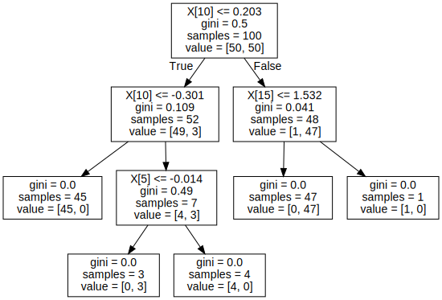
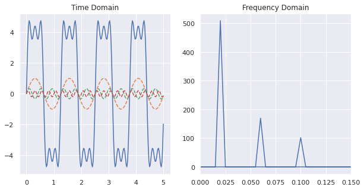

<a href="https://colab.research.google.com/github/ronva-h/technology_fundamentals/blob/main/C3%20Machine%20Learning%20I/Tech%20Fun%20C3%20S2%20Random%20Forests.ipynb" target="_parent"></a>

# Technology Fundamentals Course 3, Session 2: Bagging: Decision Trees and Random Forests

**Instructor**: Wesley Beckner

**Contact**: wesleybeckner@gmail.com

**Teaching Assistants**: Varsha Bang, Harsha Vardhan

**Contact**: vbang@uw.edu, harshav@uw.edu
<br>

---

<br>

In this session, we're going back to the topic of supervised learning models. These models however, belong to a special class of methods called bagging, or bootstrap aggregation. 

Bagging is an ensemble learning method. In this method, many weak classifiers cast their votes in a general election for the final prediction. 

The weak learners that random forests are made of, are called decision trees. 
<p align="center">
</img>
</p>

<br>

---

<br>

<a name='top'></a>

# Contents

* 4.0 [Preparing Environment and Importing Data](#x.0)
  * 4.0.1 [Import Packages](#x.0.1)
  * 4.0.2 [Load Dataset](#x.0.2)
* 4.1 [Decision Trees](#x.1)
  * 4.1.1 [Creating a Decision Tree](#x.1.1)
  * 4.1.2 [Interpreting a Decision Tree](#x.1.2)
    * 4.1.2.1 [Node & Branch Diagram](#x.1.2.1)
    * 4.1.2.2 [Decision Boundaries](#x.1.2.2)
  * 4.1.3 [Overfitting a Decision Tree](#x.1.3)
* 4.2 [Random Forests and Bagging](#x.2)
  * 4.2.1 [What is Bagging?](#x.2.1)
  * 4.2.2 [Random Forests for Classification](#x.2.2)
    * 4.2.2.1 [Interpreting a Random Forest](#x.2.2.1)
  * 4.2.3 [Random Forests for Regression](#x.2.3)
  

<br>

---

<a name='x.0'></a>

## 4.0 Preparing Environment and Importing Data

[back to top](#top)

<a name='x.0.1'></a>

### 4.0.1 Import Packages

[back to top](#top)


```python
import pandas as pd
import numpy as np
import datetime
import matplotlib.pyplot as plt
import plotly.express as px
import random
import scipy.stats
from sklearn.preprocessing import OneHotEncoder
from statsmodels.stats.outliers_influence import variance_inflation_factor
from sklearn.ensemble import RandomForestClassifier
import seaborn as sns; sns.set()
import graphviz 
from sklearn.metrics import accuracy_score
from ipywidgets import interact, interactive, widgets
from sklearn.metrics import mean_squared_error
from sklearn.model_selection import train_test_split
from sklearn import metrics
```

<a name='x.0.2'></a>

### 4.0.2 Load Dataset

[back to top](#top)


```python
margin = pd.read_csv('https://raw.githubusercontent.com/wesleybeckner/'\
                 'ds_for_engineers/main/data/truffle_margin/truffle_margin_customer.csv')
print(margin.shape, end='\n\n')
display(margin.head())
```

    (1668, 9)
    


<div>
<style scoped>
    .dataframe tbody tr th:only-of-type {
        vertical-align: middle;
    }

    .dataframe tbody tr th {
        vertical-align: top;
    }

    .dataframe thead th {
        text-align: right;
    }
</style>
<table border="1" class="dataframe">
  <thead>
    <tr style="text-align: right;">
      <th></th>
      <th>Base Cake</th>
      <th>Truffle Type</th>
      <th>Primary Flavor</th>
      <th>Secondary Flavor</th>
      <th>Color Group</th>
      <th>Customer</th>
      <th>Date</th>
      <th>KG</th>
      <th>EBITDA/KG</th>
    </tr>
  </thead>
  <tbody>
    <tr>
      <th>0</th>
      <td>Butter</td>
      <td>Candy Outer</td>
      <td>Butter Pecan</td>
      <td>Toffee</td>
      <td>Taupe</td>
      <td>Slugworth</td>
      <td>1/2020</td>
      <td>53770.342593</td>
      <td>0.500424</td>
    </tr>
    <tr>
      <th>1</th>
      <td>Butter</td>
      <td>Candy Outer</td>
      <td>Ginger Lime</td>
      <td>Banana</td>
      <td>Amethyst</td>
      <td>Slugworth</td>
      <td>1/2020</td>
      <td>466477.578125</td>
      <td>0.220395</td>
    </tr>
    <tr>
      <th>2</th>
      <td>Butter</td>
      <td>Candy Outer</td>
      <td>Ginger Lime</td>
      <td>Banana</td>
      <td>Burgundy</td>
      <td>Perk-a-Cola</td>
      <td>1/2020</td>
      <td>80801.728070</td>
      <td>0.171014</td>
    </tr>
    <tr>
      <th>3</th>
      <td>Butter</td>
      <td>Candy Outer</td>
      <td>Ginger Lime</td>
      <td>Banana</td>
      <td>White</td>
      <td>Fickelgruber</td>
      <td>1/2020</td>
      <td>18046.111111</td>
      <td>0.233025</td>
    </tr>
    <tr>
      <th>4</th>
      <td>Butter</td>
      <td>Candy Outer</td>
      <td>Ginger Lime</td>
      <td>Rum</td>
      <td>Amethyst</td>
      <td>Fickelgruber</td>
      <td>1/2020</td>
      <td>19147.454268</td>
      <td>0.480689</td>
    </tr>
  </tbody>
</table>
</div>


We're going to recreate the same operations we employed in Session 2, Feature Engineering:


```python
# identify categorical columns
cat_cols = margin.columns[:7]

# create the encoder object
enc = OneHotEncoder()

# grab the columns we want to convert from strings
X_cat = margin[cat_cols]

# fit our encoder to this data
enc.fit(X_cat)
onehotlabels = enc.transform(X_cat).toarray()
X_num = margin[['KG']]
X_truf = np.concatenate((onehotlabels, X_num.values),axis=1)

# grab our y data
y_truf = margin['EBITDA/KG'].values
```

Lastly, to create a classification task, we're going to identify high, med, and low value products:


```python
print('bad less than: {:.2f}'.format(margin[margin.columns[-1]].quantile(.25)), end='\n\n')
print('low less than: {:.2f}'.format(margin[margin.columns[-1]].quantile(.5)), end='\n\n')
print('med less than: {:.2f}'.format(margin[margin.columns[-1]].quantile(.75)), end='\n\n')
pd.DataFrame(margin[margin.columns[-2]]).boxplot(showfliers=False)
```

    bad less than: 0.12
    
    low less than: 0.22
    
    med less than: 0.35
    


    <matplotlib.axes._subplots.AxesSubplot at 0x7eff2a001b90>


    

    


```python
margin['profitability'] = margin[margin.columns[-1]].apply(
    lambda x: 'bad' if x <= margin[margin.columns[-1]].quantile(.25) else
              'low' if x <= margin[margin.columns[-1]].quantile(.50) else
              'med' if x <= margin[margin.columns[-1]].quantile(.75) else 'high')
```


```python
margin['profitability'].hist()
```


    <matplotlib.axes._subplots.AxesSubplot at 0x7eff29f68b90>


    

    


```python
class_profit = {'bad': 0, 'low': 1, 'med': 2, 'high': 3}
y_truf_class = margin['profitability'].map(class_profit).values
margin['profitability_encoding'] = y_truf_class
margin.head()
```


<div>
<style scoped>
    .dataframe tbody tr th:only-of-type {
        vertical-align: middle;
    }

    .dataframe tbody tr th {
        vertical-align: top;
    }

    .dataframe thead th {
        text-align: right;
    }
</style>
<table border="1" class="dataframe">
  <thead>
    <tr style="text-align: right;">
      <th></th>
      <th>Base Cake</th>
      <th>Truffle Type</th>
      <th>Primary Flavor</th>
      <th>Secondary Flavor</th>
      <th>Color Group</th>
      <th>Customer</th>
      <th>Date</th>
      <th>KG</th>
      <th>EBITDA/KG</th>
      <th>profitability</th>
      <th>profitability_encoding</th>
    </tr>
  </thead>
  <tbody>
    <tr>
      <th>0</th>
      <td>Butter</td>
      <td>Candy Outer</td>
      <td>Butter Pecan</td>
      <td>Toffee</td>
      <td>Taupe</td>
      <td>Slugworth</td>
      <td>1/2020</td>
      <td>53770.342593</td>
      <td>0.500424</td>
      <td>high</td>
      <td>3</td>
    </tr>
    <tr>
      <th>1</th>
      <td>Butter</td>
      <td>Candy Outer</td>
      <td>Ginger Lime</td>
      <td>Banana</td>
      <td>Amethyst</td>
      <td>Slugworth</td>
      <td>1/2020</td>
      <td>466477.578125</td>
      <td>0.220395</td>
      <td>med</td>
      <td>2</td>
    </tr>
    <tr>
      <th>2</th>
      <td>Butter</td>
      <td>Candy Outer</td>
      <td>Ginger Lime</td>
      <td>Banana</td>
      <td>Burgundy</td>
      <td>Perk-a-Cola</td>
      <td>1/2020</td>
      <td>80801.728070</td>
      <td>0.171014</td>
      <td>low</td>
      <td>1</td>
    </tr>
    <tr>
      <th>3</th>
      <td>Butter</td>
      <td>Candy Outer</td>
      <td>Ginger Lime</td>
      <td>Banana</td>
      <td>White</td>
      <td>Fickelgruber</td>
      <td>1/2020</td>
      <td>18046.111111</td>
      <td>0.233025</td>
      <td>med</td>
      <td>2</td>
    </tr>
    <tr>
      <th>4</th>
      <td>Butter</td>
      <td>Candy Outer</td>
      <td>Ginger Lime</td>
      <td>Rum</td>
      <td>Amethyst</td>
      <td>Fickelgruber</td>
      <td>1/2020</td>
      <td>19147.454268</td>
      <td>0.480689</td>
      <td>high</td>
      <td>3</td>
    </tr>
  </tbody>
</table>
</div>


<a name='x.1'></a>

## 4.1 Decision Trees

[back to top](#top)

In essence, a decision tree is a series of binary questions. 

</img>

Let's begin this discussion by talking about how we make decision trees in sklearn.

<a name='x.1.1'></a>

### 4.1.1 Creating a Decision Tree

[back to top](#top)


```python
from sklearn import tree
X = [[0, 0], [1, 1]]
y = [0, 1]
clf = tree.DecisionTreeClassifier()
clf = clf.fit(X, y)
```

After fitting the model we can use the predict method to show the output for a sample


```python
clf.predict([[2., 2.]])
```


    array([1])


Similar to what we saw with GMMs, we also have access to the probabilities of the outcomes:


```python
clf.predict_proba([[2., 2.]])
```


    array([[0., 1.]])


Let's now go on to using visual strategies to interpreting trees.

<a name='x.1.2'></a>

### 4.1.2 Interpreting a Decision Tree

[back to top](#top)

Throughout today, we will discuss many ways to view both a single tree and a random forest of trees.

<a name='x.1.2.1'></a>

#### 4.1.2.1 Node & Branch Diagram

[back to top](#top)

We can visualize the decision tree:


```python
tree.plot_tree(clf)
```


    [Text(167.4, 163.07999999999998, 'X[1] <= 0.5\ngini = 0.5\nsamples = 2\nvalue = [1, 1]'),
     Text(83.7, 54.360000000000014, 'gini = 0.0\nsamples = 1\nvalue = [1, 0]'),
     Text(251.10000000000002, 54.360000000000014, 'gini = 0.0\nsamples = 1\nvalue = [0, 1]')]


    

    


or, more prettily:


```python
import graphviz 
dot_data = tree.export_graphviz(clf, out_file=None) 
graph = graphviz.Source(dot_data) 
graph
```


    

    


The gini label, also known as **Gini impurity**, is a measure of how often a sample passing through the node would be incorrectly labeled if it was randomly assigned a label based on the proportion of all labels passing through the node. So it is a measure of the progress of our tree.

Let's take a more complex example


```python
from sklearn.datasets import make_classification as gen
X, y = gen(random_state=42)
```

Let's inspect our generated data:


```python
print(X.shape)
print(y.shape)
y[:5] # a binary classification
```

    (100, 20)
    (100,)


    array([0, 0, 1, 1, 0])


And now let's train our tree:


```python
clf = tree.DecisionTreeClassifier()
clf = clf.fit(X, y)
```

How do we interpret this graph?


```python
dot_data = tree.export_graphviz(clf, out_file=None) 
graph = graphviz.Source(dot_data) 
graph
```


    

    


> Can we confirm the observations in the tree by manually inspecting X and y?


```python
y[X[:,10] < .203]
```


    array([0, 0, 1, 0, 0, 0, 0, 0, 0, 0, 0, 0, 0, 0, 0, 0, 0, 0, 0, 0, 0, 0,
           0, 0, 0, 0, 0, 0, 0, 0, 0, 0, 0, 1, 0, 0, 0, 0, 0, 0, 0, 0, 0, 0,
           0, 1, 0, 0, 0, 0, 0, 0])


We can confirm the gini score of the top left node by hand...


```python
scr = []
for j in range(1000):
  y_pred = [0 if random.random() > ( 3/52 ) else 1 for i in range(52)]
  y_true = [0 if random.random() > ( 3/52 ) else 1 for i in range(52)]
  scr.append(mean_squared_error(y_pred,y_true))
np.mean(scr)
```


    0.10994230769230771


Let's take a look at this with our truffle dataset

> Vary the parameter `max_depth` what do you notice? Does the term _greedy_ mean anything to you?


```python
clf = tree.DecisionTreeClassifier(max_depth=1)
clf.fit(X_truf, y_truf_class)
```


    DecisionTreeClassifier(ccp_alpha=0.0, class_weight=None, criterion='gini',
                           max_depth=1, max_features=None, max_leaf_nodes=None,
                           min_impurity_decrease=0.0, min_impurity_split=None,
                           min_samples_leaf=1, min_samples_split=2,
                           min_weight_fraction_leaf=0.0, presort='deprecated',
                           random_state=None, splitter='best')


And now lets look at the graph:


```python
dot_data = tree.export_graphviz(clf, out_file=None) 
graph = graphviz.Source(dot_data) 
graph
```


    

    


What is `X[4]`???


```python
# It's those tasty sponge cake truffles!
enc.get_feature_names()[4]
```


    'x0_Sponge'


This is one great aspect of decision trees, their *interpretability*.

We will perform this analysis again, for now, let's proceed with simpler datasets while exploring the features of decision trees.

<a name='x.1.2.2'></a>

#### 4.1.2.1 Decision Boundaries

[back to top](#top)

Let's make some random blobs


```python
from sklearn.datasets import make_blobs as gen
X, y = gen(random_state=42)
```


```python
plt.scatter(X[:,0], X[:,1], c=y, cmap='viridis')
```


    <matplotlib.collections.PathCollection at 0x7eff29e6ea90>


    

    


Let's call up our Classifier again, this time setting the `max_depth` to two


```python
clf = tree.DecisionTreeClassifier(max_depth=2, random_state=42)
clf = clf.fit(X, y)
```


```python
# Parameters
plot_step = 0.02

x_min, x_max = X[:, 0].min() - 1, X[:, 0].max() + 1
y_min, y_max = X[:, 1].min() - 1, X[:, 1].max() + 1
xx, yy = np.meshgrid(np.arange(x_min, x_max, plot_step),
                      np.arange(y_min, y_max, plot_step))
plt.tight_layout(h_pad=0.5, w_pad=0.5, pad=2.5)

Z = clf.predict(np.c_[xx.ravel(), yy.ravel()])
Z = Z.reshape(xx.shape)
cs = plt.contourf(xx, yy, Z, cmap='viridis', alpha=0.2)

plt.scatter(X[:,0], X[:,1], c=y, cmap='viridis', edgecolor='grey', alpha=0.9)
```


    <matplotlib.collections.PathCollection at 0x7eff2a0a4bd0>


    

    


```python
dot_data = tree.export_graphviz(clf, out_file=None) 
graph = graphviz.Source(dot_data) 
graph
```


    

    


We can see from the output of this graph, that the tree attempts to create the class boundaries as far from the cluster centers as possible. What happens when these clusters overlap?


```python
X, y = gen(random_state=42, cluster_std=3)
plt.scatter(X[:,0], X[:,1], c=y, cmap='viridis')
```


    <matplotlib.collections.PathCollection at 0x7eff2a114150>


    

    


Let's go ahead and write our plot into a function


```python
def plot_tree(X, clf):
  plot_step = 0.02
  x_min, x_max = X[:, 0].min() - 1, X[:, 0].max() + 1
  y_min, y_max = X[:, 1].min() - 1, X[:, 1].max() + 1
  xx, yy = np.meshgrid(np.arange(x_min, x_max, plot_step),
                        np.arange(y_min, y_max, plot_step))
  plt.tight_layout(h_pad=0.5, w_pad=0.5, pad=2.5)

  Z = clf.predict(np.c_[xx.ravel(), yy.ravel()])
  Z = Z.reshape(xx.shape)
  cs = plt.contourf(xx, yy, Z, cmap='viridis', alpha=0.2)

  plt.scatter(X[:,0], X[:,1], c=y, cmap='viridis', edgecolor='grey', alpha=0.9)
  return plt
```

We see that the boundaries mislabel some points


```python
fig = plot_tree(X, clf)
```


    

    


<a name='x.1.3'></a>

### 4.1.3 Overfitting a Decision Tree

[back to top](#top)

Let's increase the max_depth


```python
clf = tree.DecisionTreeClassifier(max_depth=5, random_state=42)
clf = clf.fit(X, y)
plot_tree(X, clf)
```


    <module 'matplotlib.pyplot' from '/usr/local/lib/python3.7/dist-packages/matplotlib/pyplot.py'>


    

    


What we notice is that while the model accurately predicts the training data, we see some spurious labels, noteably the trailing purple bar that extends into the otherwise green region of the data. 

This is a well known fact about decision trees, that they tend to overfit their training data. In fact, this is a major motivation for why decision trees, a weak classifier, are conveniently packaged into ensembles.

We combine the idea of bootstrapping, with decision trees, to come up with an overall better classifier.

#### 4.1.3.1 Exercise: Minimize Overfitting

Repeat 4.1.3 with different max_depth settings, also read the docstring and play with any other hyperparameters available to you. What settings do you feel minimize overfitting?


```python
# Code Cell for 4.1.3.1
```

<a name='x.2'></a>

## 4.2 Random Forests and Bagging

[back to top](#top)

<a name='x.2.1'></a>

### 4.2.1 What is Bagging?

[back to top](#top)

**_Bagging_**, or Bootstrap AGGregation is the process of creating subsets of your data and training separate models on them, and using the aggregate votes of the models to make a final prediction.

**_Bootstrapping_** is a topic in and of itself that we will just touch on here. Without going through the statistical rigor of proof, bootstrapping, or sampling from your observations with replacement, simulates having drawn additional data from the true population. We use this method to create many new datasets that are then used to *train separate learners* in parallel. This overall approach is called **_Bagging_**.

<p align=center>
</img>
</p>

A **_Random Forest_** is an instance of bagging where the separate learners are decision trees. 

<a name='x.2.2'></a>

### 4.2.2 Random Forests for Classification

[back to top](#top)


```python
from sklearn.tree import DecisionTreeClassifier
from sklearn.ensemble import BaggingClassifier

tree = DecisionTreeClassifier()
bag = BaggingClassifier(tree, n_estimators=10, max_samples=0.8,
                        random_state=1)

bag.fit(X, y)
plot_tree(X, bag)
```


    <module 'matplotlib.pyplot' from '/usr/local/lib/python3.7/dist-packages/matplotlib/pyplot.py'>


    

    


In the above, we have bootstrapped by providing each individual tree with 80% of the population data. In practice, Random Forests can achieve even better results by randomizing how the individual classifiers are constructed. In fact there are many unique methods of training individual trees and you can learn more about them [here](https://scikit-learn.org/stable/modules/ensemble.html#forest). For now, know that it is better in practice to implement the RandomForests method in sklearn rather than bag individual trees yourself.


```python
from sklearn.ensemble import RandomForestClassifier
clf = RandomForestClassifier(n_estimators=10, random_state=2)
clf = clf.fit(X, y)
```


```python
plot_tree(X, clf)
```


    <module 'matplotlib.pyplot' from '/usr/local/lib/python3.7/dist-packages/matplotlib/pyplot.py'>


    

    


<a name='x.2.2.1'></a>

#### 4.2.2.1 Interpreting a Random Forest

[back to top](#top)

Let's revisit our truffle dataset again, this time with random forests


```python
# fit the model
clf = RandomForestClassifier(n_estimators=10, min_samples_leaf=6)
clf = clf.fit(X_truf, y_truf_class)
```

We get a fairly high accuracy when our `min_samples_leaf` is low and an accuracy that leaves room for improvement when `min_samples_leaf` is high. This indicates to us the model may be prown to overfitting if we are not careful:


```python
accuracy_score(clf.predict(X_truf), y_truf_class)
```


    0.6007194244604317


We need to do some housekeeping to get back the names and categories the features were pulled from:


```python
feat_dict = dict(zip([f'x{i}' for i in range(len(cat_cols))], 
                     cat_cols.str.replace(' ', '_')))
print(feat_dict)
feats = []

# enc.get_feature_names unpacks like so: `x4_White` where
# x<N> is an artifact of the original dimensions fed to enc()
# I am unpacking the feature names with the original dataframe header
for row in enc.get_feature_names():
  feats.append('{} {}'.format(feat_dict[row.split('_')[0]], row.split('_')[1]))

# feats will be used to visualize the feature importances
feats[:5]
```

    {'x0': 'Base_Cake', 'x1': 'Truffle_Type', 'x2': 'Primary_Flavor', 'x3': 'Secondary_Flavor', 'x4': 'Color_Group', 'x5': 'Customer', 'x6': 'Date'}


    ['Base_Cake Butter',
     'Base_Cake Cheese',
     'Base_Cake Chiffon',
     'Base_Cake Pound',
     'Base_Cake Sponge']


The feature importances are stored in `clf.feature_importances_`. These are calculated from the **_Mean Decrease in Impurity_** or MDI also called the **_Gini Importance_**. It is the sum of the number of nodes across all trees that include the feature, weighted by the number of samples passing through the node. 

One downside of estimating feature importance in this way is that it doesn't play well with highly cardinal features _(features with many unique values such as mailing addresses, are highly cardinal features)_


```python
# grab feature importances
imp = clf.feature_importances_

# their std
std = np.std([tree.feature_importances_ for tree in clf.estimators_], axis=0)

# create new dataframe
feat = pd.DataFrame([feats + ["KG"], imp, std]).T
feat.columns = ['name', 'importance', 'std']
feat = feat.sort_values('importance', ascending=False)
feat = feat.reset_index(drop=True)
feat.columns = ['feature', 'importance', 'std']
```

I'm going to use `plotly` to create this chart:

> How does feature importance change when we change the minimum leaf size from 2 to 6?


```python
px.bar(feat, x='feature', y='importance', error_y='std')
```


<html>
<head><meta charset="utf-8" /></head>
<body>
    <div>
            <script src="https://cdnjs.cloudflare.com/ajax/libs/mathjax/2.7.5/MathJax.js?config=TeX-AMS-MML_SVG"></script><script type="text/javascript">if (window.MathJax) {MathJax.Hub.Config({SVG: {font: "STIX-Web"}});}</script>
                <script type="text/javascript">window.PlotlyConfig = {MathJaxConfig: 'local'};</script>
        <script src="https://cdn.plot.ly/plotly-latest.min.js"></script>    
            <div id="318eb430-e0f4-4b77-aa05-3c077a236bea" class="plotly-graph-div" style="height:525px; width:100%;"></div>
            <script type="text/javascript">

                    window.PLOTLYENV=window.PLOTLYENV || {};

                if (document.getElementById("318eb430-e0f4-4b77-aa05-3c077a236bea")) {
                    Plotly.newPlot(
                        '318eb430-e0f4-4b77-aa05-3c077a236bea',
                        [{"alignmentgroup": "True", "error_y": {"array": [0.07555343650428877, 0.04063238643408586, 0.05961762914014548, 0.036511772297213245, 0.0290208966535553, 0.027395688661575626, 0.020452704347556663, 0.03393435310671577, 0.028642943310511235, 0.012532926656412787, 0.03556066576596446, 0.01583846311062793, 0.015769424865656922, 0.022456972121037738, 0.02357794745152038, 0.01442052676018209, 0.016310850227497925, 0.020135987095791785, 0.01966912273385237, 0.0172252292386212, 0.016188291852075806, 0.011232957255776955, 0.011752740590544949, 0.014215519364083693, 0.013231561004786502, 0.011128839190837566, 0.006571133069294302, 0.009489276856556898, 0.007960061906913968, 0.010480916770311037, 0.01077200787919219, 0.00994444700093636, 0.01698793108921301, 0.012224243018118919, 0.0074065694102534866, 0.01145262818011683, 0.014493721007728682, 0.008521135565720254, 0.012128874609229678, 0.00618660142472066, 0.008750592417062431, 0.01083766822715062, 0.006589032274060321, 0.005665682686641886, 0.007104402814719823, 0.009642691848896686, 0.005820366803373852, 0.004582819751796309, 0.006191175003169528, 0.010780497029991285, 0.009383117993507828, 0.01064557976533365, 0.007971400075341879, 0.007626220709434621, 0.004528508932574483, 0.007978753956889023, 0.00598655286524879, 0.004724575698947667, 0.006907133033972632, 0.012019731255860346, 0.0069698073631939425, 0.0042979530563582525, 0.00880028649397044, 0.006169496245711782, 0.011543630256147902, 0.011489894256293558, 0.004546766268214796, 0.0039653606347905285, 0.005142839080282742, 0.004941368568974321, 0.004792637324806003, 0.00421720688017499, 0.0035935515587245948, 0.008488082736005341, 0.006269385473890268, 0.006598567537142401, 0.003498034328041033, 0.003873584657620095, 0.0037805701429140014, 0.002515794877177775, 0.006673028932914227, 0.0023320341584585798, 0.00708673630649601, 0.004711100803629174, 0.003424765080306881, 0.0026921725725499285, 0.006302660607068695, 0.0032923995185687254, 0.0030791354423140693, 0.0030119835753018034, 0.0031442289102776937, 0.0020600908472405127, 0.002793480291008204, 0.00193979455345233, 0.0030857822778379788, 0.0035748079758318985, 0.0032705986017104887, 0.002272192880069807, 0.0022907382568384494, 0.0032671244214112233, 0.0019998154929131923, 0.0018820524312719476, 0.0019111629917143336, 0.0017978767817748138, 0.002340223707926282, 0.0016899808466311807, 0.0016614874356055674, 0.0015772015772983537, 0.0009475672660661238, 0.0011080745981432952, 0.0008970952531810846, 0.0005748636888217817, 0.0005470026863239088, 0.0, 0.0, 0.0, 0.0, 0.0, 0.0]}, "hoverlabel": {"namelength": 0}, "hovertemplate": "feature=%{x}<br>importance=%{y}", "legendgroup": "", "marker": {"color": "#636efa"}, "name": "", "offsetgroup": "", "orientation": "v", "showlegend": false, "textposition": "auto", "type": "bar", "x": ["Base_Cake Sponge", "Base_Cake Chiffon", "Base_Cake Pound", "KG", "Primary_Flavor Butter Toffee", "Base_Cake Tiramisu", "Secondary_Flavor Egg Nog", "Base_Cake Butter", "Base_Cake Cheese", "Customer Slugworth", "Color_Group Olive", "Customer Perk-a-Cola", "Color_Group White", "Secondary_Flavor Black Cherry", "Primary_Flavor Doughnut", "Customer Zebrabar", "Truffle_Type Candy Outer", "Primary_Flavor Orange Pineapple\tP", "Primary_Flavor Kettle Corn", "Color_Group Amethyst", "Truffle_Type Chocolate Outer", "Secondary_Flavor Black Currant", "Color_Group Teal", "Secondary_Flavor Wild Cherry Cream", "Secondary_Flavor Cucumber", "Primary_Flavor Toasted Coconut", "Color_Group Opal", "Customer Fickelgruber", "Color_Group Black", "Primary_Flavor Lemon Custard", "Secondary_Flavor Tangerine", "Secondary_Flavor Lemon", "Primary_Flavor Dill Pickle", "Primary_Flavor Spice", "Customer Dandy's Candies", "Secondary_Flavor Whipped Cream", "Primary_Flavor Orange", "Primary_Flavor Ginger Lime", "Secondary_Flavor Papaya", "Primary_Flavor Irish Cream", "Secondary_Flavor Apple", "Primary_Flavor Plum", "Primary_Flavor Mango", "Secondary_Flavor Rock and Rye", "Color_Group Tiffany", "Secondary_Flavor Peppermint", "Primary_Flavor Grand Mariner", "Primary_Flavor Caramel Cream", "Primary_Flavor Cheesecake", "Truffle_Type Jelly Filled", "Primary_Flavor Sassafras", "Primary_Flavor Horchata", "Primary_Flavor Acai Berry", "Primary_Flavor Watermelon", "Date 12/2020", "Primary_Flavor Lemon", "Primary_Flavor Pecan", "Secondary_Flavor Kiwi", "Primary_Flavor Cream Soda", "Primary_Flavor Gingersnap", "Primary_Flavor Ginger Ale", "Secondary_Flavor Banana", "Primary_Flavor Pink Lemonade", "Secondary_Flavor Pear", "Primary_Flavor Amaretto", "Primary_Flavor Blueberry", "Primary_Flavor Bavarian Cream", "Primary_Flavor Black Licorice", "Primary_Flavor Cherry Cola", "Primary_Flavor Coffee", "Color_Group Burgundy", "Date 7/2020", "Date 11/2020", "Secondary_Flavor Rum", "Secondary_Flavor Apricot", "Primary_Flavor Vanilla", "Date 10/2020", "Date 8/2020", "Secondary_Flavor Vanilla", "Date 9/2020", "Color_Group Rose", "Date 4/2020", "Primary_Flavor Chocolate Mint", "Primary_Flavor Orange Brandy", "Primary_Flavor Sour", "Date 2/2020", "Color_Group Slate", "Date 3/2020", "Secondary_Flavor Mojito", "Date 5/2020", "Secondary_Flavor Mixed Berry", "Secondary_Flavor Fuzzy Navel", "Primary_Flavor Raspberry Ginger Ale", "Primary_Flavor Cherry Cream Spice", "Primary_Flavor Lemon Bar", "Primary_Flavor Wild Cherry Cream", "Secondary_Flavor Ginger Beer", "Primary_Flavor Apricot", "Secondary_Flavor Dill Pickle", "Secondary_Flavor Mango", "Primary_Flavor Creme de Menthe", "Date 1/2020", "Date 6/2020", "Secondary_Flavor Butter Rum", "Primary_Flavor Chocolate", "Primary_Flavor Butter Pecan", "Secondary_Flavor Passion Fruit", "Primary_Flavor Wintergreen", "Primary_Flavor Pear", "Primary_Flavor Fruit Punch", "Secondary_Flavor Toffee", "Primary_Flavor Margarita", "Color_Group Taupe", "Primary_Flavor Birch Beer", "Primary_Flavor Butter Milk", "Color_Group Citrine", "Primary_Flavor Coconut", "Secondary_Flavor Tutti Frutti", "Secondary_Flavor Hazelnut"], "xaxis": "x", "y": [0.11070519650695783, 0.0639051536976566, 0.0548603760743442, 0.04690552959956567, 0.030875729545272637, 0.02964743757949146, 0.02903731620006769, 0.027549820016608686, 0.024187978949675365, 0.023614207046533706, 0.023004895620422038, 0.020589909133373552, 0.019963584487051135, 0.014793374515086494, 0.014393892077033574, 0.013853128581716494, 0.013244615846047074, 0.012690554084720291, 0.01259021885646476, 0.012404368567974087, 0.0113187384045495, 0.011071708910919128, 0.010741822613075441, 0.010696258810503114, 0.01036397151172899, 0.010153740726406372, 0.009873025937418815, 0.009624755083125741, 0.00939787547337474, 0.009324827381141128, 0.009223258704344116, 0.00920180252864671, 0.009030231263778518, 0.008748134672159761, 0.008650390754265581, 0.00857621547469525, 0.008182984461145851, 0.007935677327919664, 0.007710024862021607, 0.007655626597286043, 0.006909301064429637, 0.0068089928959846535, 0.006280078656786092, 0.0062527552424586595, 0.005937366089078937, 0.005569142846762498, 0.005395143076710668, 0.005349940638283773, 0.0053246203141319795, 0.005162744809445722, 0.00513549758800123, 0.005131023056676936, 0.00485863529267419, 0.004618572850759596, 0.004385632341887418, 0.004138155071736413, 0.004092217766380393, 0.004063384055128564, 0.004010104372789467, 0.004006577085286783, 0.00400548765617934, 0.00388998413390825, 0.0038868227387336947, 0.003858150268472716, 0.0038478767520493035, 0.0038428634866371617, 0.00373893601154158, 0.003709740677574182, 0.003654009077597494, 0.00348183888390368, 0.0034621232538648568, 0.0034131418308362077, 0.003344958987577941, 0.0032455102404200156, 0.003051238798750663, 0.0028849097281198836, 0.0028289898361587365, 0.0026498763977929355, 0.0026473717061639046, 0.002544288234247985, 0.002536787060152542, 0.0023816342255907124, 0.0023622454354986703, 0.002355487721202827, 0.0023118590899479387, 0.002239091551568516, 0.002100886869022899, 0.002075493235042351, 0.001917413173718334, 0.0018839487672445655, 0.001580612376283172, 0.0013055871972177259, 0.0012863009671007484, 0.0012487062252696925, 0.0012279317440148873, 0.0011916026586106328, 0.0011551536899490362, 0.0011197945637304875, 0.0011095070716949365, 0.0010890414738037415, 0.0010807649217126744, 0.0009599570923495142, 0.0009534468564891095, 0.0008997626619987524, 0.0007904775752950208, 0.0005633269488770604, 0.000553829145201856, 0.0005257338590994512, 0.0004349081329954505, 0.00036935819938109846, 0.0002990317510603616, 0.00019162122960726061, 0.00018233422877463634, 0.0, 0.0, 0.0, 0.0, 0.0, 0.0], "yaxis": "y"}],
                        {"barmode": "relative", "legend": {"tracegroupgap": 0}, "margin": {"t": 60}, "template": {"data": {"bar": [{"error_x": {"color": "#2a3f5f"}, "error_y": {"color": "#2a3f5f"}, "marker": {"line": {"color": "#E5ECF6", "width": 0.5}}, "type": "bar"}], "barpolar": [{"marker": {"line": {"color": "#E5ECF6", "width": 0.5}}, "type": "barpolar"}], "carpet": [{"aaxis": {"endlinecolor": "#2a3f5f", "gridcolor": "white", "linecolor": "white", "minorgridcolor": "white", "startlinecolor": "#2a3f5f"}, "baxis": {"endlinecolor": "#2a3f5f", "gridcolor": "white", "linecolor": "white", "minorgridcolor": "white", "startlinecolor": "#2a3f5f"}, "type": "carpet"}], "choropleth": [{"colorbar": {"outlinewidth": 0, "ticks": ""}, "type": "choropleth"}], "contour": [{"colorbar": {"outlinewidth": 0, "ticks": ""}, "colorscale": [[0.0, "#0d0887"], [0.1111111111111111, "#46039f"], [0.2222222222222222, "#7201a8"], [0.3333333333333333, "#9c179e"], [0.4444444444444444, "#bd3786"], [0.5555555555555556, "#d8576b"], [0.6666666666666666, "#ed7953"], [0.7777777777777778, "#fb9f3a"], [0.8888888888888888, "#fdca26"], [1.0, "#f0f921"]], "type": "contour"}], "contourcarpet": [{"colorbar": {"outlinewidth": 0, "ticks": ""}, "type": "contourcarpet"}], "heatmap": [{"colorbar": {"outlinewidth": 0, "ticks": ""}, "colorscale": [[0.0, "#0d0887"], [0.1111111111111111, "#46039f"], [0.2222222222222222, "#7201a8"], [0.3333333333333333, "#9c179e"], [0.4444444444444444, "#bd3786"], [0.5555555555555556, "#d8576b"], [0.6666666666666666, "#ed7953"], [0.7777777777777778, "#fb9f3a"], [0.8888888888888888, "#fdca26"], [1.0, "#f0f921"]], "type": "heatmap"}], "heatmapgl": [{"colorbar": {"outlinewidth": 0, "ticks": ""}, "colorscale": [[0.0, "#0d0887"], [0.1111111111111111, "#46039f"], [0.2222222222222222, "#7201a8"], [0.3333333333333333, "#9c179e"], [0.4444444444444444, "#bd3786"], [0.5555555555555556, "#d8576b"], [0.6666666666666666, "#ed7953"], [0.7777777777777778, "#fb9f3a"], [0.8888888888888888, "#fdca26"], [1.0, "#f0f921"]], "type": "heatmapgl"}], "histogram": [{"marker": {"colorbar": {"outlinewidth": 0, "ticks": ""}}, "type": "histogram"}], "histogram2d": [{"colorbar": {"outlinewidth": 0, "ticks": ""}, "colorscale": [[0.0, "#0d0887"], [0.1111111111111111, "#46039f"], [0.2222222222222222, "#7201a8"], [0.3333333333333333, "#9c179e"], [0.4444444444444444, "#bd3786"], [0.5555555555555556, "#d8576b"], [0.6666666666666666, "#ed7953"], [0.7777777777777778, "#fb9f3a"], [0.8888888888888888, "#fdca26"], [1.0, "#f0f921"]], "type": "histogram2d"}], "histogram2dcontour": [{"colorbar": {"outlinewidth": 0, "ticks": ""}, "colorscale": [[0.0, "#0d0887"], [0.1111111111111111, "#46039f"], [0.2222222222222222, "#7201a8"], [0.3333333333333333, "#9c179e"], [0.4444444444444444, "#bd3786"], [0.5555555555555556, "#d8576b"], [0.6666666666666666, "#ed7953"], [0.7777777777777778, "#fb9f3a"], [0.8888888888888888, "#fdca26"], [1.0, "#f0f921"]], "type": "histogram2dcontour"}], "mesh3d": [{"colorbar": {"outlinewidth": 0, "ticks": ""}, "type": "mesh3d"}], "parcoords": [{"line": {"colorbar": {"outlinewidth": 0, "ticks": ""}}, "type": "parcoords"}], "pie": [{"automargin": true, "type": "pie"}], "scatter": [{"marker": {"colorbar": {"outlinewidth": 0, "ticks": ""}}, "type": "scatter"}], "scatter3d": [{"line": {"colorbar": {"outlinewidth": 0, "ticks": ""}}, "marker": {"colorbar": {"outlinewidth": 0, "ticks": ""}}, "type": "scatter3d"}], "scattercarpet": [{"marker": {"colorbar": {"outlinewidth": 0, "ticks": ""}}, "type": "scattercarpet"}], "scattergeo": [{"marker": {"colorbar": {"outlinewidth": 0, "ticks": ""}}, "type": "scattergeo"}], "scattergl": [{"marker": {"colorbar": {"outlinewidth": 0, "ticks": ""}}, "type": "scattergl"}], "scattermapbox": [{"marker": {"colorbar": {"outlinewidth": 0, "ticks": ""}}, "type": "scattermapbox"}], "scatterpolar": [{"marker": {"colorbar": {"outlinewidth": 0, "ticks": ""}}, "type": "scatterpolar"}], "scatterpolargl": [{"marker": {"colorbar": {"outlinewidth": 0, "ticks": ""}}, "type": "scatterpolargl"}], "scatterternary": [{"marker": {"colorbar": {"outlinewidth": 0, "ticks": ""}}, "type": "scatterternary"}], "surface": [{"colorbar": {"outlinewidth": 0, "ticks": ""}, "colorscale": [[0.0, "#0d0887"], [0.1111111111111111, "#46039f"], [0.2222222222222222, "#7201a8"], [0.3333333333333333, "#9c179e"], [0.4444444444444444, "#bd3786"], [0.5555555555555556, "#d8576b"], [0.6666666666666666, "#ed7953"], [0.7777777777777778, "#fb9f3a"], [0.8888888888888888, "#fdca26"], [1.0, "#f0f921"]], "type": "surface"}], "table": [{"cells": {"fill": {"color": "#EBF0F8"}, "line": {"color": "white"}}, "header": {"fill": {"color": "#C8D4E3"}, "line": {"color": "white"}}, "type": "table"}]}, "layout": {"annotationdefaults": {"arrowcolor": "#2a3f5f", "arrowhead": 0, "arrowwidth": 1}, "coloraxis": {"colorbar": {"outlinewidth": 0, "ticks": ""}}, "colorscale": {"diverging": [[0, "#8e0152"], [0.1, "#c51b7d"], [0.2, "#de77ae"], [0.3, "#f1b6da"], [0.4, "#fde0ef"], [0.5, "#f7f7f7"], [0.6, "#e6f5d0"], [0.7, "#b8e186"], [0.8, "#7fbc41"], [0.9, "#4d9221"], [1, "#276419"]], "sequential": [[0.0, "#0d0887"], [0.1111111111111111, "#46039f"], [0.2222222222222222, "#7201a8"], [0.3333333333333333, "#9c179e"], [0.4444444444444444, "#bd3786"], [0.5555555555555556, "#d8576b"], [0.6666666666666666, "#ed7953"], [0.7777777777777778, "#fb9f3a"], [0.8888888888888888, "#fdca26"], [1.0, "#f0f921"]], "sequentialminus": [[0.0, "#0d0887"], [0.1111111111111111, "#46039f"], [0.2222222222222222, "#7201a8"], [0.3333333333333333, "#9c179e"], [0.4444444444444444, "#bd3786"], [0.5555555555555556, "#d8576b"], [0.6666666666666666, "#ed7953"], [0.7777777777777778, "#fb9f3a"], [0.8888888888888888, "#fdca26"], [1.0, "#f0f921"]]}, "colorway": ["#636efa", "#EF553B", "#00cc96", "#ab63fa", "#FFA15A", "#19d3f3", "#FF6692", "#B6E880", "#FF97FF", "#FECB52"], "font": {"color": "#2a3f5f"}, "geo": {"bgcolor": "white", "lakecolor": "white", "landcolor": "#E5ECF6", "showlakes": true, "showland": true, "subunitcolor": "white"}, "hoverlabel": {"align": "left"}, "hovermode": "closest", "mapbox": {"style": "light"}, "paper_bgcolor": "white", "plot_bgcolor": "#E5ECF6", "polar": {"angularaxis": {"gridcolor": "white", "linecolor": "white", "ticks": ""}, "bgcolor": "#E5ECF6", "radialaxis": {"gridcolor": "white", "linecolor": "white", "ticks": ""}}, "scene": {"xaxis": {"backgroundcolor": "#E5ECF6", "gridcolor": "white", "gridwidth": 2, "linecolor": "white", "showbackground": true, "ticks": "", "zerolinecolor": "white"}, "yaxis": {"backgroundcolor": "#E5ECF6", "gridcolor": "white", "gridwidth": 2, "linecolor": "white", "showbackground": true, "ticks": "", "zerolinecolor": "white"}, "zaxis": {"backgroundcolor": "#E5ECF6", "gridcolor": "white", "gridwidth": 2, "linecolor": "white", "showbackground": true, "ticks": "", "zerolinecolor": "white"}}, "shapedefaults": {"line": {"color": "#2a3f5f"}}, "ternary": {"aaxis": {"gridcolor": "white", "linecolor": "white", "ticks": ""}, "baxis": {"gridcolor": "white", "linecolor": "white", "ticks": ""}, "bgcolor": "#E5ECF6", "caxis": {"gridcolor": "white", "linecolor": "white", "ticks": ""}}, "title": {"x": 0.05}, "xaxis": {"automargin": true, "gridcolor": "white", "linecolor": "white", "ticks": "", "title": {"standoff": 15}, "zerolinecolor": "white", "zerolinewidth": 2}, "yaxis": {"automargin": true, "gridcolor": "white", "linecolor": "white", "ticks": "", "title": {"standoff": 15}, "zerolinecolor": "white", "zerolinewidth": 2}}}, "xaxis": {"anchor": "y", "domain": [0.0, 1.0], "title": {"text": "feature"}}, "yaxis": {"anchor": "x", "domain": [0.0, 1.0], "title": {"text": "importance"}}},
                        {"responsive": true}
                    ).then(function(){

var gd = document.getElementById('318eb430-e0f4-4b77-aa05-3c077a236bea');
var x = new MutationObserver(function (mutations, observer) {{
        var display = window.getComputedStyle(gd).display;
        if (!display || display === 'none') {{
            console.log([gd, 'removed!']);
            Plotly.purge(gd);
            observer.disconnect();
        }}
}});

// Listen for the removal of the full notebook cells
var notebookContainer = gd.closest('#notebook-container');
if (notebookContainer) {{
    x.observe(notebookContainer, {childList: true});
}}

// Listen for the clearing of the current output cell
var outputEl = gd.closest('.output');
if (outputEl) {{
    x.observe(outputEl, {childList: true});
}}

                        })
                };

            </script>
        </div>
</body>
</html>


We can then go and look at the different EBITDAs when selecting for each of these features:


```python
def ebitda_comp(feature=feat['feature']):
  if len(feature.split(' ')) > 1:
    group = feature.split(' ')[0].replace('_', ' ')
    sel = " ".join(feature.split(' ')[1:])
    pos = margin.loc[(margin[group] == sel)]['EBITDA/KG'].median()
    neg = margin.loc[~(margin[group] == sel)]['EBITDA/KG'].median()
    print("with:    {:.2e}".format(pos))
    print("without: {:.2e}".format(neg))
  else:
    pass  
```


```python
interact(ebitda_comp)
```


    interactive(children=(Dropdown(description='feature', options=('Base_Cake Sponge', 'Base_Cake Chiffon', 'Base_…


    <function __main__.ebitda_comp>


This is an example of how the interpretability of the random forest ensemble approach can be highly valuable.

<a name='x.2.3'></a>

### 4.2.3 Random Forests for Regression

[back to top](#top)


```python
from sklearn.ensemble import RandomForestRegressor

clf = RandomForestRegressor(n_estimators=10)
```

Because our labels on our blob data were numerical, we can apply and view the estimator in the same way:


```python
clf = clf.fit(X, y)
plot_tree(X, clf)
```


    <module 'matplotlib.pyplot' from '/usr/local/lib/python3.7/dist-packages/matplotlib/pyplot.py'>


    

    


I want to revisit a dataset we brought up in Session 2 on feature engineering:


```python
t = np.linspace(0,5,200)
w = 5
h = 4
s = 4 * h / np.pi * (np.sin(w*t) + np.sin(3*w*t)/3 + np.sin(5*w*t)/5)

F = np.fft.fft(s)
freq = np.fft.fftfreq(t.shape[-1])

fig, ax = plt.subplots(1,2,figsize=(10,5))

ax[0].plot(t,s)
ax[0].plot(t,np.sin(w*t), ls='--')
ax[0].plot(t,np.sin(w*t*3)/3, ls='--')
ax[0].plot(t,np.sin(w*t*5)/5, ls='--')
ax[0].set_title('Time Domain')

# tells us about the amplitude of the component at the
# corresponding frequency
magnitude = np.sqrt(F.real**2 + F.imag**2)

ax[1].plot(freq, magnitude)
ax[1].set_xlim(0,.15)
ax[1].set_title('Frequency Domain')
```


    Text(0.5, 1.0, 'Frequency Domain')


    

    


Let's see if a random forest regression model can capture the wave behavior of the time-series data


```python
clf = RandomForestRegressor(n_estimators=10)
clf.fit(t.reshape(-1,1),s)
```


    RandomForestRegressor(bootstrap=True, ccp_alpha=0.0, criterion='mse',
                          max_depth=None, max_features='auto', max_leaf_nodes=None,
                          max_samples=None, min_impurity_decrease=0.0,
                          min_impurity_split=None, min_samples_leaf=1,
                          min_samples_split=2, min_weight_fraction_leaf=0.0,
                          n_estimators=10, n_jobs=None, oob_score=False,
                          random_state=None, verbose=0, warm_start=False)


```python
fig, ax = plt.subplots(1,1,figsize=(10,5))

ax.plot(t,s)
ax.plot(t,clf.predict(t.reshape(-1,1)))
```


    [<matplotlib.lines.Line2D at 0x7eff29588690>]


    

    


Nice! without specifying any perdiodicity, the random forest does a good job of embedding this periodicity in the final output.

### 4.2.4 Extended Exercise: Practice with Random Forests

With the wine dataset:

* predict: quality, quality group

* use train_test_split

* create a learning curve of train/test score vs model complexity for your random forest model(s)


```python
# Code Cell for Exercise 4.2.4
wine = pd.read_csv("https://raw.githubusercontent.com/wesleybeckner/"\
      "ds_for_engineers/main/data/wine_quality/winequalityN.csv")

wine.dropna(inplace=True)
wine['quality_label'] = wine['quality'].apply(lambda x: 'low' if x <=5 else
                                              'med' if x <= 7 else 'high')

wine['type_encoding'] = wine['type'].map({'red': 0, 'white': 1})
wine['quality_encoding'] = wine['quality_label'].map({'low':0, 
                                                      'med': 1, 'high': 2})

wine.columns = wine.columns.str.replace(' ', '_')

features = list(wine.columns[1:-1].values)
features.remove('quality_label')
features.remove('quality')
```
