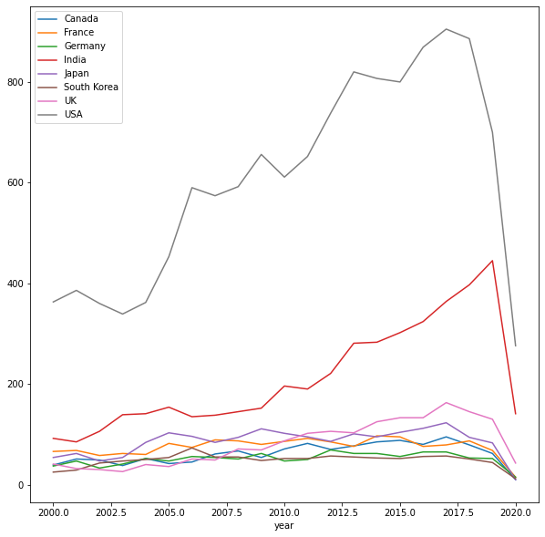

<a href="https://colab.research.google.com/github/wesleybeckner/technology_fundamentals/blob/main/C2%20Statistics%20and%20Model%20Creation/LABS_PROJECT/Tech_Fun_C2_L1_Data_Hunt_I.ipynb" target="_parent"></a>

# Technology Fundamentals Course 2, Lab 1: Data Hunt I

**Instructor**: Wesley Beckner

**Contact**: wesleybeckner@gmail.com

**Teaching Assitants**: Varsha Bang, Harsha Vardhan

**Contact**: vbang@uw.edu, harshav@uw.edu
<br>

---

<br>

That's right you heard correctly. It's a data hunt.

<br>

---


```python
import pandas as pd
import matplotlib.pyplot as plt
import seaborn as sns
from ipywidgets import interact
```


```python
df = pd.read_csv("https://raw.githubusercontent.com/wesleybeckner/"\
  "technology_explorers/main/assets/imdb_movies.csv")

# converting years to numbers for easy conditionals
df['year'] = pd.to_numeric(df['year'], errors='coerce')
df.shape
```

    /usr/local/lib/python3.7/dist-packages/IPython/core/interactiveshell.py:2718: DtypeWarning: Columns (3) have mixed types.Specify dtype option on import or set low_memory=False.
      interactivity=interactivity, compiler=compiler, result=result)


    (85855, 22)


```python
df.head(3)
```


<div>
<style scoped>
    .dataframe tbody tr th:only-of-type {
        vertical-align: middle;
    }

    .dataframe tbody tr th {
        vertical-align: top;
    }

    .dataframe thead th {
        text-align: right;
    }
</style>
<table border="1" class="dataframe">
  <thead>
    <tr style="text-align: right;">
      <th></th>
      <th>imdb_title_id</th>
      <th>title</th>
      <th>original_title</th>
      <th>year</th>
      <th>date_published</th>
      <th>genre</th>
      <th>duration</th>
      <th>country</th>
      <th>language</th>
      <th>director</th>
      <th>writer</th>
      <th>production_company</th>
      <th>actors</th>
      <th>description</th>
      <th>avg_vote</th>
      <th>votes</th>
      <th>budget</th>
      <th>usa_gross_income</th>
      <th>worlwide_gross_income</th>
      <th>metascore</th>
      <th>reviews_from_users</th>
      <th>reviews_from_critics</th>
    </tr>
  </thead>
  <tbody>
    <tr>
      <th>0</th>
      <td>tt0000009</td>
      <td>Miss Jerry</td>
      <td>Miss Jerry</td>
      <td>1894.0</td>
      <td>1894-10-09</td>
      <td>Romance</td>
      <td>45</td>
      <td>USA</td>
      <td>None</td>
      <td>Alexander Black</td>
      <td>Alexander Black</td>
      <td>Alexander Black Photoplays</td>
      <td>Blanche Bayliss, William Courtenay, Chauncey D...</td>
      <td>The adventures of a female reporter in the 1890s.</td>
      <td>5.9</td>
      <td>154</td>
      <td>NaN</td>
      <td>NaN</td>
      <td>NaN</td>
      <td>NaN</td>
      <td>1.0</td>
      <td>2.0</td>
    </tr>
    <tr>
      <th>1</th>
      <td>tt0000574</td>
      <td>The Story of the Kelly Gang</td>
      <td>The Story of the Kelly Gang</td>
      <td>1906.0</td>
      <td>1906-12-26</td>
      <td>Biography, Crime, Drama</td>
      <td>70</td>
      <td>Australia</td>
      <td>None</td>
      <td>Charles Tait</td>
      <td>Charles Tait</td>
      <td>J. and N. Tait</td>
      <td>Elizabeth Tait, John Tait, Norman Campbell, Be...</td>
      <td>True story of notorious Australian outlaw Ned ...</td>
      <td>6.1</td>
      <td>589</td>
      <td>$ 2250</td>
      <td>NaN</td>
      <td>NaN</td>
      <td>NaN</td>
      <td>7.0</td>
      <td>7.0</td>
    </tr>
    <tr>
      <th>2</th>
      <td>tt0001892</td>
      <td>Den sorte drøm</td>
      <td>Den sorte drøm</td>
      <td>1911.0</td>
      <td>1911-08-19</td>
      <td>Drama</td>
      <td>53</td>
      <td>Germany, Denmark</td>
      <td>NaN</td>
      <td>Urban Gad</td>
      <td>Urban Gad, Gebhard Schätzler-Perasini</td>
      <td>Fotorama</td>
      <td>Asta Nielsen, Valdemar Psilander, Gunnar Helse...</td>
      <td>Two men of high rank are both wooing the beaut...</td>
      <td>5.8</td>
      <td>188</td>
      <td>NaN</td>
      <td>NaN</td>
      <td>NaN</td>
      <td>NaN</td>
      <td>5.0</td>
      <td>2.0</td>
    </tr>
  </tbody>
</table>
</div>


# Q1 What american director has the highest mean  avg_vote?


```python

```


    director
    Daniel Keith, Snorri Sturluson    9.3
    Anthony Bawn                      9.3
    Derek Ahonen                      9.2
    Raghav Peri                       9.1
    James Marlowe                     8.8
                                     ... 
    Waleed Bedour                     1.2
    Fred Ashman                       1.1
    Aeneas Middleton                  1.1
    Steven A. Sandt                   1.1
    Francis Hamada                    1.1
    Name: avg_vote, Length: 12463, dtype: float64


# Q2 What american director with more than 5 movies, has the highest mean avg_vote?


```python

```


    director
    Quentin Tarantino     7.811111
    Charles Chaplin       7.764286
    David Fincher         7.625000
    Billy Wilder          7.580952
    Martin Scorsese       7.544444
                            ...   
    Barry Mahon           2.728571
    Dennis Devine         2.657143
    Bill Zebub            2.483333
    Mark Polonia          2.462500
    Christopher Forbes    2.000000
    Name: avg_vote, Length: 859, dtype: float64


# Q3 What director has the largest variance in avg_vote?


```python

```


    director
    Deniz Denizciler              4.030509
    Rudi Lagemann                 3.747666
    Emilio Ruiz Barrachina        3.676955
    Krishna Ghattamaneni          3.676955
    Milos Avramovic               3.606245
                                    ...   
    Ümit Degirmenci                    NaN
    Ümit Elçi                          NaN
    Ümit Köreken                       NaN
    Þorsteinn Gunnar Bjarnason         NaN
    Þórhildur Þorleifsdóttir           NaN
    Name: avg_vote, Length: 34733, dtype: float64


# Q4 What director with more than 10 movies has the largest variance in avg_vote?


```python

```


    director
    Harry Baweja         1.869954
    Shaji Kailas         1.854502
    Zdenek Troska        1.775984
    Adam Rifkin          1.711251
    Ram Gopal Varma      1.687850
                           ...   
    Ford Beebe           0.224343
    Ray Nazarro          0.210311
    Jean Grémillon       0.196946
    Louis Feuillade      0.156428
    Tsutomu Shibayama    0.126121
    Name: avg_vote, Length: 1135, dtype: float64


# Q5 What american directors with more than 5 movies have the largest variance in avg_vote?


```python

```


    director
    Martin Brest          2.033716
    David Winters         1.926049
    Adam Rifkin           1.711251
    Gus Trikonis          1.661271
    Jerry Jameson         1.646107
                            ...   
    Edward Killy          0.155265
    Willis Goldbeck       0.139443
    Richard T. Heffron    0.136626
    Bill Plympton         0.136626
    Nate Watt             0.129099
    Name: avg_vote, Length: 859, dtype: float64


# Q6 Where does M. Night Shyamalan fall on this rank scale?

(He's number 36/859)


```python

```


<div>
<style scoped>
    .dataframe tbody tr th:only-of-type {
        vertical-align: middle;
    }

    .dataframe tbody tr th {
        vertical-align: top;
    }

    .dataframe thead th {
        text-align: right;
    }
</style>
<table border="1" class="dataframe">
  <thead>
    <tr style="text-align: right;">
      <th></th>
      <th>director</th>
      <th>avg_vote</th>
    </tr>
  </thead>
  <tbody>
    <tr>
      <th>36</th>
      <td>M. Night Shyamalan</td>
      <td>1.258791</td>
    </tr>
  </tbody>
</table>
</div>


# Q7 How many movies were made each year in US from 2000-2020


```python

```


    year
    2000.0    363
    2001.0    386
    2002.0    360
    2003.0    339
    2004.0    362
    2005.0    453
    2006.0    590
    2007.0    574
    2008.0    592
    2009.0    656
    2010.0    611
    2011.0    652
    2012.0    738
    2013.0    820
    2014.0    807
    2015.0    800
    2016.0    869
    2017.0    905
    2018.0    886
    2019.0    700
    2020.0    276
    Name: title, dtype: int64


# Q8 Visualize The Results of Q7!


```python

```


    <matplotlib.axes._subplots.AxesSubplot at 0x7fea042dc890>


    

    


# Q9 For single country movies, how many movies were made each year in each country from 2000-2020, only include countries that made more than 1000 movies in that timeframe


```python

```


<div>
<style scoped>
    .dataframe tbody tr th:only-of-type {
        vertical-align: middle;
    }

    .dataframe tbody tr th {
        vertical-align: top;
    }

    .dataframe thead th {
        text-align: right;
    }
</style>
<table border="1" class="dataframe">
  <thead>
    <tr style="text-align: right;">
      <th></th>
      <th>country</th>
      <th>year</th>
      <th>title</th>
    </tr>
  </thead>
  <tbody>
    <tr>
      <th>0</th>
      <td>Canada</td>
      <td>2000.0</td>
      <td>39</td>
    </tr>
    <tr>
      <th>1</th>
      <td>Canada</td>
      <td>2001.0</td>
      <td>51</td>
    </tr>
    <tr>
      <th>2</th>
      <td>Canada</td>
      <td>2002.0</td>
      <td>49</td>
    </tr>
    <tr>
      <th>3</th>
      <td>Canada</td>
      <td>2003.0</td>
      <td>38</td>
    </tr>
    <tr>
      <th>4</th>
      <td>Canada</td>
      <td>2004.0</td>
      <td>52</td>
    </tr>
  </tbody>
</table>
</div>


# Q10 Visualize the results from Q9!


```python

```


    

    

