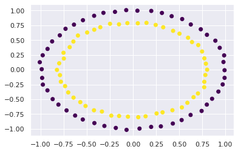
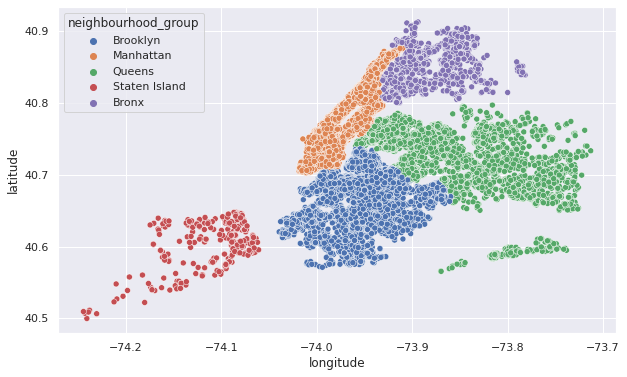

<a href="https://colab.research.google.com/github/wesleybeckner/data_science_foundations/blob/main/notebooks/extras/X1_Thinking_Data.ipynb" target="_parent"></a>

# Data Science Foundations <br> Extras 1: Thinking Data

**Instructor**: Wesley Beckner

**Contact**: wesleybeckner@gmail.com

---

<br>

Today we are going to take our newfound knowledge from the course, and practice how we can leverage data to build predictive models. We'll start with a feature engineering problem on some dummy data. This will get us thinking creatively about problem solving. We will then pivot over to an [Airbnb dataset](https://www.kaggle.com/dgomonov/new-york-city-airbnb-open-data/code). After performing some general, exploratory data analysis, we will solve the following business case: Airbnb is interested in using historical list prices from their airbnb hosts, to make pricing suggestions to new hosts. How can we use this existing datset to assist with this price listing suggestion?

<br>

---

## Prepare Environment and Import Data


```python
# basic packages
import pandas as pd
import numpy as np
import random
import copy

# visualization packages
import matplotlib.pyplot as plt
import plotly.express as px
import seaborn as sns; sns.set()
import graphviz 

# stats packages
import scipy.stats as stats
from scipy.spatial.distance import cdist
import statsmodels.api as sm
from statsmodels.formula.api import ols
from statsmodels.stats.outliers_influence import variance_inflation_factor

# sklearn preprocessing
from sklearn.preprocessing import OneHotEncoder, StandardScaler, PolynomialFeatures
from sklearn.decomposition import PCA
from sklearn.impute import SimpleImputer
from sklearn.model_selection import train_test_split
from sklearn.pipeline import make_pipeline

# sklearn modeling
from sklearn.neighbors import KNeighborsRegressor
from sklearn.ensemble import RandomForestClassifier, RandomForestRegressor, AdaBoostClassifier, GradientBoostingClassifier
from sklearn.linear_model import LinearRegression, LogisticRegression
from sklearn.mixture import GaussianMixture

# sklearn evaluation
from sklearn.metrics import mean_squared_error, r2_score, accuracy_score
from sklearn.model_selection import GridSearchCV, cross_val_score
```

## Warm Up

Add aditional feature(s) to `X` to predict `y` with a linear classifier (e.g. logistic regression)


```python
from sklearn.datasets import make_circles
X, y = make_circles(random_state=42, noise=.01)
relabel = dict(zip([0,1,2,3],[0,1,0,1]))
y = np.vectorize(relabel.get)(y)
plt.scatter(X[:,0], X[:,1], c=y, cmap='viridis')
```


    <matplotlib.collections.PathCollection at 0x7f20ec66d280>


    

    


and now predict


```python
# consider using
# LogisticRegression()
# r2_score
```

## Exploratory Data Analysis

which columns are numerical, string; which contain nans/nulls; what is the correlation between features


```python
airbnb = pd.read_csv("https://raw.githubusercontent.com/wesleybeckner/datasets/main/datasets/airbnb/AB_NYC_2019.csv")
```


```python
# recall these attributes
# shape dtypes

# and these methods
# head() tail() isnull() sum() nunique() copy() select_dtypes() describe() drop()
```

what visualizations would be useful to make?


```python
plt.figure(figsize=(10,6))
sns.scatterplot(x=airbnb.longitude,y=airbnb.latitude,hue=airbnb.neighbourhood_group)
```


    <AxesSubplot:xlabel='longitude', ylabel='latitude'>


    

    


## Feature Engineering

Say we want to predict `price`, using an ML model. How would you build your features?

Based on the number of null values, what would you do with the `last_review` and `reviews_per_month` column?


```python
X = airbnb.copy()
```

How will we deal with the categorical features?


```python
# Recall
# OneHotEncoder()
X_cat = X.select_dtypes(include='object')
display(X_cat.head())
print(X_cat.nunique())
```


<div>
<style scoped>
    .dataframe tbody tr th:only-of-type {
        vertical-align: middle;
    }

    .dataframe tbody tr th {
        vertical-align: top;
    }

    .dataframe thead th {
        text-align: right;
    }
</style>
<table border="1" class="dataframe">
  <thead>
    <tr style="text-align: right;">
      <th></th>
      <th>name</th>
      <th>host_name</th>
      <th>neighbourhood_group</th>
      <th>neighbourhood</th>
      <th>room_type</th>
      <th>last_review</th>
    </tr>
  </thead>
  <tbody>
    <tr>
      <th>0</th>
      <td>Clean &amp; quiet apt home by the park</td>
      <td>John</td>
      <td>Brooklyn</td>
      <td>Kensington</td>
      <td>Private room</td>
      <td>2018-10-19</td>
    </tr>
    <tr>
      <th>1</th>
      <td>Skylit Midtown Castle</td>
      <td>Jennifer</td>
      <td>Manhattan</td>
      <td>Midtown</td>
      <td>Entire home/apt</td>
      <td>2019-05-21</td>
    </tr>
    <tr>
      <th>2</th>
      <td>THE VILLAGE OF HARLEM....NEW YORK !</td>
      <td>Elisabeth</td>
      <td>Manhattan</td>
      <td>Harlem</td>
      <td>Private room</td>
      <td>NaN</td>
    </tr>
    <tr>
      <th>3</th>
      <td>Cozy Entire Floor of Brownstone</td>
      <td>LisaRoxanne</td>
      <td>Brooklyn</td>
      <td>Clinton Hill</td>
      <td>Entire home/apt</td>
      <td>2019-07-05</td>
    </tr>
    <tr>
      <th>4</th>
      <td>Entire Apt: Spacious Studio/Loft by central park</td>
      <td>Laura</td>
      <td>Manhattan</td>
      <td>East Harlem</td>
      <td>Entire home/apt</td>
      <td>2018-11-19</td>
    </tr>
  </tbody>
</table>
</div>


    name                   47905
    host_name              11452
    neighbourhood_group        5
    neighbourhood            221
    room_type                  3
    last_review             1764
    dtype: int64


```python
X_num = X.select_dtypes(exclude='object')
X_num.head()
```


<div>
<style scoped>
    .dataframe tbody tr th:only-of-type {
        vertical-align: middle;
    }

    .dataframe tbody tr th {
        vertical-align: top;
    }

    .dataframe thead th {
        text-align: right;
    }
</style>
<table border="1" class="dataframe">
  <thead>
    <tr style="text-align: right;">
      <th></th>
      <th>id</th>
      <th>host_id</th>
      <th>latitude</th>
      <th>longitude</th>
      <th>price</th>
      <th>minimum_nights</th>
      <th>number_of_reviews</th>
      <th>reviews_per_month</th>
      <th>calculated_host_listings_count</th>
      <th>availability_365</th>
    </tr>
  </thead>
  <tbody>
    <tr>
      <th>0</th>
      <td>2539</td>
      <td>2787</td>
      <td>40.64749</td>
      <td>-73.97237</td>
      <td>149</td>
      <td>1</td>
      <td>9</td>
      <td>0.21</td>
      <td>6</td>
      <td>365</td>
    </tr>
    <tr>
      <th>1</th>
      <td>2595</td>
      <td>2845</td>
      <td>40.75362</td>
      <td>-73.98377</td>
      <td>225</td>
      <td>1</td>
      <td>45</td>
      <td>0.38</td>
      <td>2</td>
      <td>355</td>
    </tr>
    <tr>
      <th>2</th>
      <td>3647</td>
      <td>4632</td>
      <td>40.80902</td>
      <td>-73.94190</td>
      <td>150</td>
      <td>3</td>
      <td>0</td>
      <td>NaN</td>
      <td>1</td>
      <td>365</td>
    </tr>
    <tr>
      <th>3</th>
      <td>3831</td>
      <td>4869</td>
      <td>40.68514</td>
      <td>-73.95976</td>
      <td>89</td>
      <td>1</td>
      <td>270</td>
      <td>4.64</td>
      <td>1</td>
      <td>194</td>
    </tr>
    <tr>
      <th>4</th>
      <td>5022</td>
      <td>7192</td>
      <td>40.79851</td>
      <td>-73.94399</td>
      <td>80</td>
      <td>10</td>
      <td>9</td>
      <td>0.10</td>
      <td>1</td>
      <td>0</td>
    </tr>
  </tbody>
</table>
</div>


## Feature Transformation

What features do you think will cause the most problems if untransformed? 

Scale and Center all but the target variable, price


```python
# Recall
# StandardScaler() df.pop()
```

## Model Baseline


```python
# Recall
# X_train, X_test, y_train, y_test = train_test_split(X, y, train_size=0.8, random_state=42)
# LinearRegression()
# r2_score()
```

try a model that captures non-linear relationships


```python
# Recall
# RandomForestRegressor()
```

both of these results from the `LinearRegression` and `RandomForest` models should indicate something to you (think back to [Model Selection and Validation](https://wesleybeckner.github.io/data_science_foundations/S3_Model_Selection_and_Validation/))

## Additional Strategies

After this first pass, what are some additional strategies to consider for improving the model?
