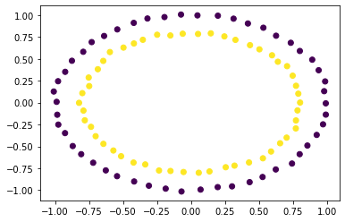

# Data Science Foundations <br> Extras 1: Thinking Data

**Instructor**: Wesley Beckner

**Contact**: wesleybeckner@gmail.com

---

<br>

Today we are going to take our newfound knowledge and tackle some data problems

<br>

---

<br>

<a name='x.0'></a>

## 1.0 Preparing Environment and Importing Data

[back to top](#top)

<a name='x.0.1'></a>

### 1.0.1 Import Packages

[back to top](#top)


```python
import matplotlib.pyplot as plt
import numpy as np
```

## Q1: Feature Engineering

Add aditional feature(s) to X to predict y with a linear model


```python
from sklearn.datasets import make_circles
X, y = make_circles(random_state=42, noise=.01)
relabel = dict(zip([0,1,2,3],[0,1,0,1]))
y = np.vectorize(relabel.get)(y)
plt.scatter(X[:,0], X[:,1], c=y, cmap='viridis')
```


    <matplotlib.collections.PathCollection at 0x7fdf3c7a8700>


    

    


