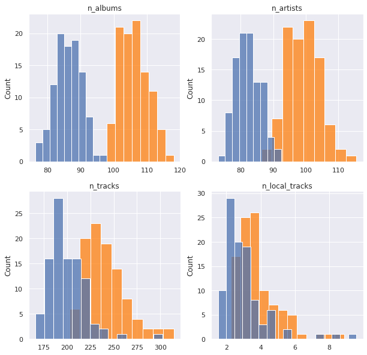

# What makes a playlist successful?

| Column Name             | Description                                                                                              |
|-------------------------|----------------------------------------------------------------------------------------------------------|
| playlist_uri            | The key, Spotify uri of the playlist                                                                     |
| owner                   | Playlist owner, Spotify username                                                                         |
| streams                 | Number of streams from the playlist today                                                                |
| stream30s               | Number of streams over 30 seconds from playlist today                                                    |
| dau                     | Number of Daily Active Users, i.e. users with a stream over 30 seconds from playlist today               |
| wau                     | Number of Weekly Active Users, i.e. users with a stream over 30 seconds from playlist in past week       |
| mau                     | Number of Monthly Active Users, i.e. users with a stream over 30 seconds from playlist in the past month |
| mau_previous_months     | Number of Monthly Active users in the month prior to this one                                            |
| mau_both_months         | Number of users that were active on the playlist both this and the previous month                        |
| users                   | Number of users streaming (all streams) from this playlist this month                                    |
| skippers                | Number of users who skipped more than 90 percent of their streams today                                  |
| owner_country           | Country of the playlist owner                                                                            |
| n_tracks                | Number of tracks in playlist                                                                             |
| n_local_tracks          | Change in number of tracks on playlist since yesterday                                                   |
| n_artists               | Number of unique artists in playlist                                                                     |
| n_albums                | Number of unique albums in playlist                                                                      |
| monthly_stream30s       | Number of streams over 30 seconds this month                                                             |
| monthly_owner_stream30s | Number of streams over 30 seconds by playlist owner this month                                           |
| tokens                  | List of playlist title tokens, stopwords and punctuation removed                                         |
| genre_1                 | No. 1 Genre by weight of playlist tracks, from Gracenote metadata                                        |
| genre_2                 | No. 2 Genre by weight of playlist tracks, from Gracenote metadata                                        |
| genre_3                 | No. 3 Genre by weight of playlist tracks, from Gracenote metadata                                        |
| mood_1                  | No. 1 Mood by weight of playlist tracks, from Gracenote metadata                                         |
| mood_2                  | No. 2 Mood by weight of playlist tracks, from Gracenote metadata                                         |
| mood_3                  | No. 3 Mood by weight of playlist tracks, from Gracenote metadata                                         |

## Imports


```python
# basic packages
import pandas as pd
pd.set_option('display.max_columns', 500)
import numpy as np
import random
import copy

# visualization packages
import matplotlib.pyplot as plt
import plotly.express as px
import seaborn as sns; sns.set()
import graphviz 

# stats packages
import scipy.stats as stats
from scipy.spatial.distance import cdist
import statsmodels.api as sm
from statsmodels.formula.api import ols
from statsmodels.discrete.discrete_model import Logit
from statsmodels.stats.outliers_influence import variance_inflation_factor

# sklearn preprocessing
from sklearn.preprocessing import OneHotEncoder, StandardScaler, PolynomialFeatures
from sklearn.decomposition import PCA
from sklearn.impute import SimpleImputer
from sklearn.model_selection import train_test_split
from sklearn.pipeline import make_pipeline
from sklearn.utils.class_weight import compute_class_weight

# sklearn modeling
from sklearn.neighbors import KNeighborsRegressor
from sklearn.ensemble import RandomForestClassifier, RandomForestRegressor, AdaBoostClassifier, GradientBoostingClassifier
from sklearn.linear_model import LinearRegression, LogisticRegression
from sklearn.mixture import GaussianMixture

# sklearn evaluation
from sklearn.metrics import mean_squared_error, r2_score, accuracy_score, classification_report, confusion_matrix
from sklearn.model_selection import GridSearchCV, cross_val_score

```


```python
df = pd.read_csv("../../data/playlist_summary_external-4.txt", delimiter='\t')
```

## Dependency


```python
sub_targets = ['mau_previous_month', 'mau_both_months', 'monthly_stream30s', 'stream30s']
# sub_targets = ['mau', 'dau', 'monthly_stream30s', 'stream30s']

des_features = ['mood_1', 'mood_2', 'mood_3', 'genre_1', 'genre_2', 'genre_3']
con_features = ['n_albums', 'n_artists', 'n_tracks', 'n_local_tracks']
df['success'] = df[sub_targets].apply(lambda x: x > np.quantile(x, 0.75)).all(axis=1)

df['listen_conversions'] = df['stream30s'] / df['streams']
df['listen_conversions'].fillna(value=0, inplace=True)

df['user_retention'] = df['mau_both_months'] / df['mau_previous_month']
df['user_retention'].fillna(value=0, inplace=True)

df['user_conversions'] = df['mau'] / df['users']
df['user_conversions'].fillna(value=0, inplace=True)


df['mau_growing'] = df['mau'] > df['mau_previous_month']
df['mau_growth'] = df['mau'] / df['mau_previous_month']
df['mau_growth'].fillna(value=0, inplace=True)
df['mau_growth'].replace([np.inf, -np.inf], 1, inplace=True)

new_metrics = ['listen_conversions', 'user_conversions', 'user_retention', 'mau_growth']

df['new_success'] = df[new_metrics].apply(lambda x: (x > 0.5) if (max(x) == 1) else (x > 1)).all(axis=1)
```


```python
df.loc[df['new_success'] == True][:50]
```


<div>
<style scoped>
    .dataframe tbody tr th:only-of-type {
        vertical-align: middle;
    }

    .dataframe tbody tr th {
        vertical-align: top;
    }

    .dataframe thead th {
        text-align: right;
    }
</style>
<table border="1" class="dataframe">
  <thead>
    <tr style="text-align: right;">
      <th></th>
      <th>playlist_uri</th>
      <th>owner</th>
      <th>streams</th>
      <th>stream30s</th>
      <th>dau</th>
      <th>wau</th>
      <th>mau</th>
      <th>mau_previous_month</th>
      <th>mau_both_months</th>
      <th>users</th>
      <th>skippers</th>
      <th>owner_country</th>
      <th>n_tracks</th>
      <th>n_local_tracks</th>
      <th>n_artists</th>
      <th>n_albums</th>
      <th>monthly_stream30s</th>
      <th>monthly_owner_stream30s</th>
      <th>tokens</th>
      <th>genre_1</th>
      <th>genre_2</th>
      <th>genre_3</th>
      <th>mood_1</th>
      <th>mood_2</th>
      <th>mood_3</th>
      <th>success</th>
      <th>listen_conversions</th>
      <th>user_retention</th>
      <th>user_conversions</th>
      <th>mau_growing</th>
      <th>mau_growth</th>
      <th>new_success</th>
    </tr>
  </thead>
  <tbody>
    <tr>
      <th>14</th>
      <td>spotify:user:9a3580868994077be27d244788d494cd:...</td>
      <td>9a3580868994077be27d244788d494cd</td>
      <td>28</td>
      <td>15</td>
      <td>1</td>
      <td>1</td>
      <td>2</td>
      <td>1</td>
      <td>1</td>
      <td>2</td>
      <td>0</td>
      <td>US</td>
      <td>321</td>
      <td>0</td>
      <td>170</td>
      <td>205</td>
      <td>83</td>
      <td>77</td>
      <td>["sunny", "daze"]</td>
      <td>Alternative</td>
      <td>Indie Rock</td>
      <td>Electronica</td>
      <td>Brooding</td>
      <td>Excited</td>
      <td>Sensual</td>
      <td>False</td>
      <td>0.535714</td>
      <td>1.000000</td>
      <td>1.000000</td>
      <td>True</td>
      <td>2.000000</td>
      <td>True</td>
    </tr>
    <tr>
      <th>18</th>
      <td>spotify:user:7abbdbd3119687473b8f2986e73e2ad6:...</td>
      <td>7abbdbd3119687473b8f2986e73e2ad6</td>
      <td>9</td>
      <td>5</td>
      <td>1</td>
      <td>2</td>
      <td>2</td>
      <td>1</td>
      <td>1</td>
      <td>2</td>
      <td>0</td>
      <td>US</td>
      <td>373</td>
      <td>8</td>
      <td>1</td>
      <td>1</td>
      <td>18</td>
      <td>11</td>
      <td>[]</td>
      <td>Pop</td>
      <td>Alternative</td>
      <td>Indie Rock</td>
      <td>Empowering</td>
      <td>Excited</td>
      <td>Urgent</td>
      <td>False</td>
      <td>0.555556</td>
      <td>1.000000</td>
      <td>1.000000</td>
      <td>True</td>
      <td>2.000000</td>
      <td>True</td>
    </tr>
    <tr>
      <th>20</th>
      <td>spotify:user:838141e861005b6a955cb389c19671a5:...</td>
      <td>838141e861005b6a955cb389c19671a5</td>
      <td>32</td>
      <td>25</td>
      <td>2</td>
      <td>3</td>
      <td>4</td>
      <td>3</td>
      <td>3</td>
      <td>5</td>
      <td>1</td>
      <td>US</td>
      <td>904</td>
      <td>0</td>
      <td>81</td>
      <td>125</td>
      <td>327</td>
      <td>253</td>
      <td>["metalcore", "forever"]</td>
      <td>Punk</td>
      <td>Metal</td>
      <td>Rock</td>
      <td>Defiant</td>
      <td>Urgent</td>
      <td>Aggressive</td>
      <td>False</td>
      <td>0.781250</td>
      <td>1.000000</td>
      <td>0.800000</td>
      <td>True</td>
      <td>1.333333</td>
      <td>True</td>
    </tr>
    <tr>
      <th>36</th>
      <td>spotify:user:2217942070bcaa5f1e651e27744b4402:...</td>
      <td>2217942070bcaa5f1e651e27744b4402</td>
      <td>18</td>
      <td>17</td>
      <td>1</td>
      <td>2</td>
      <td>4</td>
      <td>3</td>
      <td>3</td>
      <td>5</td>
      <td>1</td>
      <td>US</td>
      <td>141</td>
      <td>1</td>
      <td>122</td>
      <td>131</td>
      <td>567</td>
      <td>0</td>
      <td>["chill"]</td>
      <td>Rap</td>
      <td>Dance &amp; House</td>
      <td>Alternative</td>
      <td>Excited</td>
      <td>Defiant</td>
      <td>Energizing</td>
      <td>False</td>
      <td>0.944444</td>
      <td>1.000000</td>
      <td>0.800000</td>
      <td>True</td>
      <td>1.333333</td>
      <td>True</td>
    </tr>
    <tr>
      <th>59</th>
      <td>spotify:user:dfde15dd16b4ad87a75036276b4c9f66:...</td>
      <td>dfde15dd16b4ad87a75036276b4c9f66</td>
      <td>5</td>
      <td>5</td>
      <td>1</td>
      <td>1</td>
      <td>2</td>
      <td>1</td>
      <td>1</td>
      <td>3</td>
      <td>0</td>
      <td>US</td>
      <td>84</td>
      <td>0</td>
      <td>73</td>
      <td>78</td>
      <td>254</td>
      <td>239</td>
      <td>["vegas"]</td>
      <td>Rock</td>
      <td>Pop</td>
      <td>R&amp;B</td>
      <td>Upbeat</td>
      <td>Excited</td>
      <td>Empowering</td>
      <td>False</td>
      <td>1.000000</td>
      <td>1.000000</td>
      <td>0.666667</td>
      <td>True</td>
      <td>2.000000</td>
      <td>True</td>
    </tr>
    <tr>
      <th>62</th>
      <td>spotify:user:de0ab3440d9775d4208e024ff90530bc:...</td>
      <td>de0ab3440d9775d4208e024ff90530bc</td>
      <td>1</td>
      <td>1</td>
      <td>1</td>
      <td>1</td>
      <td>2</td>
      <td>1</td>
      <td>1</td>
      <td>3</td>
      <td>1</td>
      <td>US</td>
      <td>12</td>
      <td>0</td>
      <td>12</td>
      <td>1</td>
      <td>27</td>
      <td>23</td>
      <td>["thomas", "rhett", "goes", "like"]</td>
      <td>Country &amp; Folk</td>
      <td>-</td>
      <td>-</td>
      <td>Rowdy</td>
      <td>Defiant</td>
      <td>Yearning</td>
      <td>False</td>
      <td>1.000000</td>
      <td>1.000000</td>
      <td>0.666667</td>
      <td>True</td>
      <td>2.000000</td>
      <td>True</td>
    </tr>
    <tr>
      <th>64</th>
      <td>spotify:user:73595f62e3300d315b5891fd518ab8fa:...</td>
      <td>73595f62e3300d315b5891fd518ab8fa</td>
      <td>4</td>
      <td>4</td>
      <td>1</td>
      <td>1</td>
      <td>2</td>
      <td>1</td>
      <td>1</td>
      <td>3</td>
      <td>0</td>
      <td>US</td>
      <td>288</td>
      <td>0</td>
      <td>100</td>
      <td>104</td>
      <td>252</td>
      <td>250</td>
      <td>["hello", "sir"]</td>
      <td>Pop</td>
      <td>Alternative</td>
      <td>Rap</td>
      <td>Energizing</td>
      <td>Excited</td>
      <td>Urgent</td>
      <td>False</td>
      <td>1.000000</td>
      <td>1.000000</td>
      <td>0.666667</td>
      <td>True</td>
      <td>2.000000</td>
      <td>True</td>
    </tr>
    <tr>
      <th>159</th>
      <td>spotify:user:5c26a4b5ce48deb08729a4219dc00144:...</td>
      <td>5c26a4b5ce48deb08729a4219dc00144</td>
      <td>5</td>
      <td>3</td>
      <td>1</td>
      <td>1</td>
      <td>2</td>
      <td>1</td>
      <td>1</td>
      <td>2</td>
      <td>0</td>
      <td>US</td>
      <td>76</td>
      <td>1</td>
      <td>55</td>
      <td>56</td>
      <td>9</td>
      <td>1</td>
      <td>["house", "old", "favs"]</td>
      <td>Dance &amp; House</td>
      <td>Electronica</td>
      <td>Alternative</td>
      <td>Excited</td>
      <td>Sensual</td>
      <td>Energizing</td>
      <td>False</td>
      <td>0.600000</td>
      <td>1.000000</td>
      <td>1.000000</td>
      <td>True</td>
      <td>2.000000</td>
      <td>True</td>
    </tr>
    <tr>
      <th>177</th>
      <td>spotify:user:f11124f70f3a78930c638e736dac5b23:...</td>
      <td>f11124f70f3a78930c638e736dac5b23</td>
      <td>1</td>
      <td>1</td>
      <td>1</td>
      <td>2</td>
      <td>3</td>
      <td>1</td>
      <td>1</td>
      <td>4</td>
      <td>1</td>
      <td>US</td>
      <td>1124</td>
      <td>0</td>
      <td>312</td>
      <td>407</td>
      <td>134</td>
      <td>108</td>
      <td>["walter", "rock"]</td>
      <td>Rock</td>
      <td>Alternative</td>
      <td>Pop</td>
      <td>Excited</td>
      <td>Empowering</td>
      <td>Urgent</td>
      <td>False</td>
      <td>1.000000</td>
      <td>1.000000</td>
      <td>0.750000</td>
      <td>True</td>
      <td>3.000000</td>
      <td>True</td>
    </tr>
    <tr>
      <th>181</th>
      <td>spotify:user:3561fc615f880b895524d90f15852a35:...</td>
      <td>3561fc615f880b895524d90f15852a35</td>
      <td>8</td>
      <td>7</td>
      <td>1</td>
      <td>2</td>
      <td>2</td>
      <td>1</td>
      <td>1</td>
      <td>2</td>
      <td>0</td>
      <td>US</td>
      <td>114</td>
      <td>7</td>
      <td>72</td>
      <td>82</td>
      <td>88</td>
      <td>85</td>
      <td>["supa", "indie"]</td>
      <td>Indie Rock</td>
      <td>Alternative</td>
      <td>Pop</td>
      <td>Defiant</td>
      <td>Excited</td>
      <td>Yearning</td>
      <td>False</td>
      <td>0.875000</td>
      <td>1.000000</td>
      <td>1.000000</td>
      <td>True</td>
      <td>2.000000</td>
      <td>True</td>
    </tr>
    <tr>
      <th>192</th>
      <td>spotify:user:d1eb5346879b6e1ad1c3622db6f039ff:...</td>
      <td>d1eb5346879b6e1ad1c3622db6f039ff</td>
      <td>2</td>
      <td>2</td>
      <td>1</td>
      <td>1</td>
      <td>2</td>
      <td>1</td>
      <td>1</td>
      <td>2</td>
      <td>0</td>
      <td>US</td>
      <td>62</td>
      <td>0</td>
      <td>55</td>
      <td>58</td>
      <td>48</td>
      <td>41</td>
      <td>["summer", "time", "fine"]</td>
      <td>Pop</td>
      <td>Country &amp; Folk</td>
      <td>Rock</td>
      <td>Excited</td>
      <td>Yearning</td>
      <td>Upbeat</td>
      <td>False</td>
      <td>1.000000</td>
      <td>1.000000</td>
      <td>1.000000</td>
      <td>True</td>
      <td>2.000000</td>
      <td>True</td>
    </tr>
    <tr>
      <th>214</th>
      <td>spotify:user:9075f3d4e136bf9c9c89bd1762287a95:...</td>
      <td>9075f3d4e136bf9c9c89bd1762287a95</td>
      <td>1</td>
      <td>1</td>
      <td>1</td>
      <td>1</td>
      <td>2</td>
      <td>1</td>
      <td>1</td>
      <td>2</td>
      <td>1</td>
      <td>US</td>
      <td>25</td>
      <td>5</td>
      <td>15</td>
      <td>16</td>
      <td>9</td>
      <td>8</td>
      <td>["break", "stuff"]</td>
      <td>Metal</td>
      <td>Rap</td>
      <td>Alternative</td>
      <td>Defiant</td>
      <td>Aggressive</td>
      <td>Other</td>
      <td>False</td>
      <td>1.000000</td>
      <td>1.000000</td>
      <td>1.000000</td>
      <td>True</td>
      <td>2.000000</td>
      <td>True</td>
    </tr>
    <tr>
      <th>216</th>
      <td>spotify:user:e40f88ab2828e19e635da885b8f31cd2:...</td>
      <td>e40f88ab2828e19e635da885b8f31cd2</td>
      <td>1</td>
      <td>1</td>
      <td>1</td>
      <td>2</td>
      <td>2</td>
      <td>1</td>
      <td>1</td>
      <td>2</td>
      <td>1</td>
      <td>US</td>
      <td>136</td>
      <td>65</td>
      <td>64</td>
      <td>65</td>
      <td>29</td>
      <td>26</td>
      <td>["hype", "real"]</td>
      <td>Dance &amp; House</td>
      <td>Alternative</td>
      <td>Indie Rock</td>
      <td>Excited</td>
      <td>Energizing</td>
      <td>Urgent</td>
      <td>False</td>
      <td>1.000000</td>
      <td>1.000000</td>
      <td>1.000000</td>
      <td>True</td>
      <td>2.000000</td>
      <td>True</td>
    </tr>
    <tr>
      <th>220</th>
      <td>spotify:user:0e396a85e688de2a42a0c895df7d5d0e:...</td>
      <td>0e396a85e688de2a42a0c895df7d5d0e</td>
      <td>17</td>
      <td>12</td>
      <td>1</td>
      <td>1</td>
      <td>2</td>
      <td>1</td>
      <td>1</td>
      <td>2</td>
      <td>0</td>
      <td>US</td>
      <td>40</td>
      <td>0</td>
      <td>33</td>
      <td>35</td>
      <td>1110</td>
      <td>867</td>
      <td>["party"]</td>
      <td>Dance &amp; House</td>
      <td>Pop</td>
      <td>Rap</td>
      <td>Excited</td>
      <td>Urgent</td>
      <td>Empowering</td>
      <td>False</td>
      <td>0.705882</td>
      <td>1.000000</td>
      <td>1.000000</td>
      <td>True</td>
      <td>2.000000</td>
      <td>True</td>
    </tr>
    <tr>
      <th>224</th>
      <td>spotify:user:8f79948271f082bb3459a760ef320720:...</td>
      <td>8f79948271f082bb3459a760ef320720</td>
      <td>5</td>
      <td>5</td>
      <td>1</td>
      <td>1</td>
      <td>2</td>
      <td>1</td>
      <td>1</td>
      <td>2</td>
      <td>0</td>
      <td>US</td>
      <td>52</td>
      <td>0</td>
      <td>18</td>
      <td>8</td>
      <td>351</td>
      <td>240</td>
      <td>["new", "shit"]</td>
      <td>Rap</td>
      <td>Pop</td>
      <td>-</td>
      <td>Defiant</td>
      <td>Energizing</td>
      <td>Aggressive</td>
      <td>False</td>
      <td>1.000000</td>
      <td>1.000000</td>
      <td>1.000000</td>
      <td>True</td>
      <td>2.000000</td>
      <td>True</td>
    </tr>
    <tr>
      <th>227</th>
      <td>spotify:user:f3dd9a5c4f859ba9f33cf3bd1fcac7eb:...</td>
      <td>f3dd9a5c4f859ba9f33cf3bd1fcac7eb</td>
      <td>15</td>
      <td>10</td>
      <td>1</td>
      <td>3</td>
      <td>5</td>
      <td>2</td>
      <td>2</td>
      <td>6</td>
      <td>1</td>
      <td>US</td>
      <td>106</td>
      <td>0</td>
      <td>39</td>
      <td>61</td>
      <td>146</td>
      <td>27</td>
      <td>["star", "hits"]</td>
      <td>Religious</td>
      <td>Traditional</td>
      <td>Pop</td>
      <td>Empowering</td>
      <td>Upbeat</td>
      <td>Yearning</td>
      <td>False</td>
      <td>0.666667</td>
      <td>1.000000</td>
      <td>0.833333</td>
      <td>True</td>
      <td>2.500000</td>
      <td>True</td>
    </tr>
    <tr>
      <th>231</th>
      <td>spotify:user:46534787e91a7acf5138dd4d74243cee:...</td>
      <td>46534787e91a7acf5138dd4d74243cee</td>
      <td>1</td>
      <td>1</td>
      <td>1</td>
      <td>1</td>
      <td>3</td>
      <td>2</td>
      <td>2</td>
      <td>4</td>
      <td>1</td>
      <td>US</td>
      <td>184</td>
      <td>1</td>
      <td>88</td>
      <td>79</td>
      <td>61</td>
      <td>41</td>
      <td>["mmmm"]</td>
      <td>Indie Rock</td>
      <td>Pop</td>
      <td>Rock</td>
      <td>Empowering</td>
      <td>Gritty</td>
      <td>Yearning</td>
      <td>False</td>
      <td>1.000000</td>
      <td>1.000000</td>
      <td>0.750000</td>
      <td>True</td>
      <td>1.500000</td>
      <td>True</td>
    </tr>
    <tr>
      <th>246</th>
      <td>spotify:user:6da299ea4087854738e823161bcb7900:...</td>
      <td>6da299ea4087854738e823161bcb7900</td>
      <td>10</td>
      <td>10</td>
      <td>1</td>
      <td>1</td>
      <td>2</td>
      <td>1</td>
      <td>1</td>
      <td>2</td>
      <td>0</td>
      <td>US</td>
      <td>28</td>
      <td>0</td>
      <td>24</td>
      <td>28</td>
      <td>65</td>
      <td>2</td>
      <td>["sex", "robots"]</td>
      <td>Rock</td>
      <td>R&amp;B</td>
      <td>Indie Rock</td>
      <td>Sophisticated</td>
      <td>Melancholy</td>
      <td>Romantic</td>
      <td>False</td>
      <td>1.000000</td>
      <td>1.000000</td>
      <td>1.000000</td>
      <td>True</td>
      <td>2.000000</td>
      <td>True</td>
    </tr>
    <tr>
      <th>250</th>
      <td>spotify:user:b475a383c41d59938f65d952d81b8864:...</td>
      <td>b475a383c41d59938f65d952d81b8864</td>
      <td>16</td>
      <td>10</td>
      <td>1</td>
      <td>1</td>
      <td>2</td>
      <td>1</td>
      <td>1</td>
      <td>2</td>
      <td>0</td>
      <td>US</td>
      <td>114</td>
      <td>0</td>
      <td>36</td>
      <td>36</td>
      <td>906</td>
      <td>714</td>
      <td>["mean"]</td>
      <td>Indie Rock</td>
      <td>Alternative</td>
      <td>Pop</td>
      <td>Yearning</td>
      <td>Sensual</td>
      <td>Empowering</td>
      <td>False</td>
      <td>0.625000</td>
      <td>1.000000</td>
      <td>1.000000</td>
      <td>True</td>
      <td>2.000000</td>
      <td>True</td>
    </tr>
    <tr>
      <th>260</th>
      <td>spotify:user:1aa3cc0754052f796b36a27717efa16f:...</td>
      <td>1aa3cc0754052f796b36a27717efa16f</td>
      <td>5</td>
      <td>5</td>
      <td>1</td>
      <td>1</td>
      <td>2</td>
      <td>1</td>
      <td>1</td>
      <td>2</td>
      <td>0</td>
      <td>US</td>
      <td>41</td>
      <td>0</td>
      <td>38</td>
      <td>41</td>
      <td>66</td>
      <td>47</td>
      <td>["go", "deeper"]</td>
      <td>Dance &amp; House</td>
      <td>Electronica</td>
      <td>Alternative</td>
      <td>Excited</td>
      <td>Aggressive</td>
      <td>Sensual</td>
      <td>False</td>
      <td>1.000000</td>
      <td>1.000000</td>
      <td>1.000000</td>
      <td>True</td>
      <td>2.000000</td>
      <td>True</td>
    </tr>
    <tr>
      <th>284</th>
      <td>spotify:user:4c9a0f9fd1242e11448e8a6d3fbff8fd:...</td>
      <td>4c9a0f9fd1242e11448e8a6d3fbff8fd</td>
      <td>18</td>
      <td>11</td>
      <td>1</td>
      <td>1</td>
      <td>3</td>
      <td>2</td>
      <td>2</td>
      <td>4</td>
      <td>0</td>
      <td>US</td>
      <td>59</td>
      <td>0</td>
      <td>44</td>
      <td>47</td>
      <td>107</td>
      <td>31</td>
      <td>["rap", "noise"]</td>
      <td>Rap</td>
      <td>Alternative</td>
      <td>Pop</td>
      <td>Cool</td>
      <td>Defiant</td>
      <td>Sensual</td>
      <td>False</td>
      <td>0.611111</td>
      <td>1.000000</td>
      <td>0.750000</td>
      <td>True</td>
      <td>1.500000</td>
      <td>True</td>
    </tr>
    <tr>
      <th>292</th>
      <td>spotify:user:4beffc2da627ed6f7c2873a878d7bf6a:...</td>
      <td>4beffc2da627ed6f7c2873a878d7bf6a</td>
      <td>9</td>
      <td>6</td>
      <td>1</td>
      <td>2</td>
      <td>3</td>
      <td>2</td>
      <td>2</td>
      <td>3</td>
      <td>1</td>
      <td>US</td>
      <td>108</td>
      <td>0</td>
      <td>1</td>
      <td>101</td>
      <td>222</td>
      <td>40</td>
      <td>["hotness"]</td>
      <td>Alternative</td>
      <td>Indie Rock</td>
      <td>Pop</td>
      <td>Defiant</td>
      <td>Excited</td>
      <td>Yearning</td>
      <td>False</td>
      <td>0.666667</td>
      <td>1.000000</td>
      <td>1.000000</td>
      <td>True</td>
      <td>1.500000</td>
      <td>True</td>
    </tr>
    <tr>
      <th>317</th>
      <td>spotify:user:4523127fe71623256e9797d161d10137:...</td>
      <td>4523127fe71623256e9797d161d10137</td>
      <td>3</td>
      <td>2</td>
      <td>1</td>
      <td>2</td>
      <td>3</td>
      <td>1</td>
      <td>1</td>
      <td>3</td>
      <td>1</td>
      <td>US</td>
      <td>384</td>
      <td>0</td>
      <td>1</td>
      <td>167</td>
      <td>87</td>
      <td>46</td>
      <td>["drunkflex"]</td>
      <td>Rap</td>
      <td>R&amp;B</td>
      <td>Pop</td>
      <td>Defiant</td>
      <td>Cool</td>
      <td>Energizing</td>
      <td>False</td>
      <td>0.666667</td>
      <td>1.000000</td>
      <td>1.000000</td>
      <td>True</td>
      <td>3.000000</td>
      <td>True</td>
    </tr>
    <tr>
      <th>336</th>
      <td>spotify:user:e840e62982e2f4d08e45be4168cd6aec:...</td>
      <td>e840e62982e2f4d08e45be4168cd6aec</td>
      <td>53</td>
      <td>34</td>
      <td>1</td>
      <td>2</td>
      <td>2</td>
      <td>1</td>
      <td>1</td>
      <td>2</td>
      <td>0</td>
      <td>US</td>
      <td>142</td>
      <td>0</td>
      <td>1</td>
      <td>75</td>
      <td>111</td>
      <td>44</td>
      <td>["beer", "beer", "good"]</td>
      <td>Country &amp; Folk</td>
      <td>Rock</td>
      <td>Alternative</td>
      <td>Upbeat</td>
      <td>Empowering</td>
      <td>Yearning</td>
      <td>False</td>
      <td>0.641509</td>
      <td>1.000000</td>
      <td>1.000000</td>
      <td>True</td>
      <td>2.000000</td>
      <td>True</td>
    </tr>
    <tr>
      <th>340</th>
      <td>spotify:user:bb6325232492a9361cfaa0ee1f176a00:...</td>
      <td>bb6325232492a9361cfaa0ee1f176a00</td>
      <td>12</td>
      <td>12</td>
      <td>1</td>
      <td>1</td>
      <td>2</td>
      <td>1</td>
      <td>1</td>
      <td>2</td>
      <td>0</td>
      <td>US</td>
      <td>27</td>
      <td>0</td>
      <td>24</td>
      <td>26</td>
      <td>71</td>
      <td>13</td>
      <td>["right", "arm"]</td>
      <td>Country &amp; Folk</td>
      <td>Alternative</td>
      <td>Rock</td>
      <td>Easygoing</td>
      <td>Gritty</td>
      <td>Yearning</td>
      <td>False</td>
      <td>1.000000</td>
      <td>1.000000</td>
      <td>1.000000</td>
      <td>True</td>
      <td>2.000000</td>
      <td>True</td>
    </tr>
    <tr>
      <th>344</th>
      <td>spotify:user:1e4c23468589bb1346e4a3820f497b04:...</td>
      <td>1e4c23468589bb1346e4a3820f497b04</td>
      <td>5</td>
      <td>3</td>
      <td>1</td>
      <td>1</td>
      <td>2</td>
      <td>1</td>
      <td>1</td>
      <td>2</td>
      <td>0</td>
      <td>US</td>
      <td>228</td>
      <td>0</td>
      <td>152</td>
      <td>166</td>
      <td>187</td>
      <td>184</td>
      <td>["good"]</td>
      <td>Indie Rock</td>
      <td>Alternative</td>
      <td>Pop</td>
      <td>Defiant</td>
      <td>Yearning</td>
      <td>Excited</td>
      <td>False</td>
      <td>0.600000</td>
      <td>1.000000</td>
      <td>1.000000</td>
      <td>True</td>
      <td>2.000000</td>
      <td>True</td>
    </tr>
    <tr>
      <th>358</th>
      <td>spotify:user:de29cb4faa456728e206691dfa0a51f3:...</td>
      <td>de29cb4faa456728e206691dfa0a51f3</td>
      <td>1</td>
      <td>1</td>
      <td>1</td>
      <td>1</td>
      <td>2</td>
      <td>1</td>
      <td>1</td>
      <td>2</td>
      <td>1</td>
      <td>US</td>
      <td>10</td>
      <td>0</td>
      <td>6</td>
      <td>8</td>
      <td>5</td>
      <td>3</td>
      <td>["august"]</td>
      <td>Alternative</td>
      <td>Dance &amp; House</td>
      <td>Indie Rock</td>
      <td>Brooding</td>
      <td>Defiant</td>
      <td>Empowering</td>
      <td>False</td>
      <td>1.000000</td>
      <td>1.000000</td>
      <td>1.000000</td>
      <td>True</td>
      <td>2.000000</td>
      <td>True</td>
    </tr>
    <tr>
      <th>361</th>
      <td>spotify:user:653f1813c2f370e72960cb2a332d7aa6:...</td>
      <td>653f1813c2f370e72960cb2a332d7aa6</td>
      <td>8</td>
      <td>5</td>
      <td>2</td>
      <td>4</td>
      <td>5</td>
      <td>1</td>
      <td>1</td>
      <td>7</td>
      <td>1</td>
      <td>US</td>
      <td>87</td>
      <td>0</td>
      <td>79</td>
      <td>80</td>
      <td>12</td>
      <td>4</td>
      <td>["homecoming"]</td>
      <td>Pop</td>
      <td>R&amp;B</td>
      <td>Dance &amp; House</td>
      <td>Excited</td>
      <td>Energizing</td>
      <td>Yearning</td>
      <td>False</td>
      <td>0.625000</td>
      <td>1.000000</td>
      <td>0.714286</td>
      <td>True</td>
      <td>5.000000</td>
      <td>True</td>
    </tr>
    <tr>
      <th>367</th>
      <td>spotify:user:40847e29177f22d3bf8d7faec0cf4861:...</td>
      <td>40847e29177f22d3bf8d7faec0cf4861</td>
      <td>6</td>
      <td>5</td>
      <td>1</td>
      <td>1</td>
      <td>2</td>
      <td>1</td>
      <td>1</td>
      <td>2</td>
      <td>0</td>
      <td>US</td>
      <td>177</td>
      <td>0</td>
      <td>1</td>
      <td>153</td>
      <td>249</td>
      <td>233</td>
      <td>["brightside"]</td>
      <td>Pop</td>
      <td>Indie Rock</td>
      <td>Alternative</td>
      <td>Yearning</td>
      <td>Sensual</td>
      <td>Energizing</td>
      <td>False</td>
      <td>0.833333</td>
      <td>1.000000</td>
      <td>1.000000</td>
      <td>True</td>
      <td>2.000000</td>
      <td>True</td>
    </tr>
    <tr>
      <th>394</th>
      <td>spotify:user:21e4339ff7a8e574578b0f1604ab5d9e:...</td>
      <td>21e4339ff7a8e574578b0f1604ab5d9e</td>
      <td>1</td>
      <td>1</td>
      <td>1</td>
      <td>2</td>
      <td>2</td>
      <td>1</td>
      <td>1</td>
      <td>2</td>
      <td>1</td>
      <td>US</td>
      <td>30</td>
      <td>0</td>
      <td>13</td>
      <td>13</td>
      <td>12</td>
      <td>6</td>
      <td>["oldies", "goodies"]</td>
      <td>R&amp;B</td>
      <td>Dance &amp; House</td>
      <td>Rock</td>
      <td>Energizing</td>
      <td>Excited</td>
      <td>Stirring</td>
      <td>False</td>
      <td>1.000000</td>
      <td>1.000000</td>
      <td>1.000000</td>
      <td>True</td>
      <td>2.000000</td>
      <td>True</td>
    </tr>
    <tr>
      <th>403</th>
      <td>spotify:user:33620214caad9346df7f37bf78ffc050:...</td>
      <td>33620214caad9346df7f37bf78ffc050</td>
      <td>1</td>
      <td>1</td>
      <td>1</td>
      <td>1</td>
      <td>2</td>
      <td>1</td>
      <td>1</td>
      <td>2</td>
      <td>0</td>
      <td>US</td>
      <td>43</td>
      <td>0</td>
      <td>39</td>
      <td>23</td>
      <td>24</td>
      <td>0</td>
      <td>["knee", "deep"]</td>
      <td>Dance &amp; House</td>
      <td>Electronica</td>
      <td>Pop</td>
      <td>Aggressive</td>
      <td>Excited</td>
      <td>Energizing</td>
      <td>False</td>
      <td>1.000000</td>
      <td>1.000000</td>
      <td>1.000000</td>
      <td>True</td>
      <td>2.000000</td>
      <td>True</td>
    </tr>
    <tr>
      <th>408</th>
      <td>spotify:user:e0b33b783463663548a6c3ad58724ae6:...</td>
      <td>e0b33b783463663548a6c3ad58724ae6</td>
      <td>8</td>
      <td>7</td>
      <td>1</td>
      <td>1</td>
      <td>2</td>
      <td>1</td>
      <td>1</td>
      <td>2</td>
      <td>0</td>
      <td>US</td>
      <td>23</td>
      <td>0</td>
      <td>13</td>
      <td>14</td>
      <td>64</td>
      <td>56</td>
      <td>["country"]</td>
      <td>Country &amp; Folk</td>
      <td>Rock</td>
      <td>Pop</td>
      <td>Upbeat</td>
      <td>Yearning</td>
      <td>Empowering</td>
      <td>False</td>
      <td>0.875000</td>
      <td>1.000000</td>
      <td>1.000000</td>
      <td>True</td>
      <td>2.000000</td>
      <td>True</td>
    </tr>
    <tr>
      <th>419</th>
      <td>spotify:user:d6688b57d15e25391b00bd8b17dc9095:...</td>
      <td>d6688b57d15e25391b00bd8b17dc9095</td>
      <td>1</td>
      <td>1</td>
      <td>1</td>
      <td>2</td>
      <td>3</td>
      <td>1</td>
      <td>1</td>
      <td>3</td>
      <td>0</td>
      <td>US</td>
      <td>344</td>
      <td>44</td>
      <td>132</td>
      <td>135</td>
      <td>213</td>
      <td>187</td>
      <td>["deep", "hits"]</td>
      <td>Dance &amp; House</td>
      <td>Electronica</td>
      <td>Indie Rock</td>
      <td>Excited</td>
      <td>Energizing</td>
      <td>Aggressive</td>
      <td>False</td>
      <td>1.000000</td>
      <td>1.000000</td>
      <td>1.000000</td>
      <td>True</td>
      <td>3.000000</td>
      <td>True</td>
    </tr>
    <tr>
      <th>424</th>
      <td>spotify:user:45fee5a028a5eed2fb44640eecdf50de:...</td>
      <td>45fee5a028a5eed2fb44640eecdf50de</td>
      <td>21</td>
      <td>18</td>
      <td>2</td>
      <td>7</td>
      <td>11</td>
      <td>10</td>
      <td>6</td>
      <td>17</td>
      <td>1</td>
      <td>US</td>
      <td>3054</td>
      <td>466</td>
      <td>996</td>
      <td>1115</td>
      <td>384</td>
      <td>207</td>
      <td>[]</td>
      <td>Dance &amp; House</td>
      <td>Electronica</td>
      <td>Pop</td>
      <td>Excited</td>
      <td>Aggressive</td>
      <td>Energizing</td>
      <td>True</td>
      <td>0.857143</td>
      <td>0.600000</td>
      <td>0.647059</td>
      <td>True</td>
      <td>1.100000</td>
      <td>True</td>
    </tr>
    <tr>
      <th>425</th>
      <td>spotify:user:814674ef8d3c93403cda68aeb763497a:...</td>
      <td>814674ef8d3c93403cda68aeb763497a</td>
      <td>7</td>
      <td>7</td>
      <td>1</td>
      <td>1</td>
      <td>3</td>
      <td>1</td>
      <td>1</td>
      <td>3</td>
      <td>0</td>
      <td>US</td>
      <td>184</td>
      <td>0</td>
      <td>51</td>
      <td>66</td>
      <td>116</td>
      <td>70</td>
      <td>["junior", "high", "rock"]</td>
      <td>Alternative</td>
      <td>Punk</td>
      <td>Rock</td>
      <td>Empowering</td>
      <td>Urgent</td>
      <td>Defiant</td>
      <td>False</td>
      <td>1.000000</td>
      <td>1.000000</td>
      <td>1.000000</td>
      <td>True</td>
      <td>3.000000</td>
      <td>True</td>
    </tr>
    <tr>
      <th>428</th>
      <td>spotify:user:879e97eeb474370f17f097f0101d44f3:...</td>
      <td>879e97eeb474370f17f097f0101d44f3</td>
      <td>12</td>
      <td>9</td>
      <td>1</td>
      <td>11</td>
      <td>17</td>
      <td>7</td>
      <td>6</td>
      <td>20</td>
      <td>0</td>
      <td>US</td>
      <td>14</td>
      <td>0</td>
      <td>1</td>
      <td>1</td>
      <td>415</td>
      <td>33</td>
      <td>["nmt", "king", "black", "moon", "spell"]</td>
      <td>Rock</td>
      <td>Alternative</td>
      <td>-</td>
      <td>Yearning</td>
      <td>Brooding</td>
      <td>Aggressive</td>
      <td>True</td>
      <td>0.750000</td>
      <td>0.857143</td>
      <td>0.850000</td>
      <td>True</td>
      <td>2.428571</td>
      <td>True</td>
    </tr>
    <tr>
      <th>446</th>
      <td>spotify:user:9443fffe327eda7b3cec9778612ac335:...</td>
      <td>9443fffe327eda7b3cec9778612ac335</td>
      <td>4</td>
      <td>3</td>
      <td>1</td>
      <td>2</td>
      <td>3</td>
      <td>1</td>
      <td>1</td>
      <td>3</td>
      <td>0</td>
      <td>US</td>
      <td>36</td>
      <td>0</td>
      <td>30</td>
      <td>32</td>
      <td>97</td>
      <td>66</td>
      <td>[]</td>
      <td>Indie Rock</td>
      <td>Alternative</td>
      <td>Dance &amp; House</td>
      <td>Excited</td>
      <td>Defiant</td>
      <td>Empowering</td>
      <td>False</td>
      <td>0.750000</td>
      <td>1.000000</td>
      <td>1.000000</td>
      <td>True</td>
      <td>3.000000</td>
      <td>True</td>
    </tr>
    <tr>
      <th>467</th>
      <td>spotify:user:539b27b25ee0f459b460ef66210da609:...</td>
      <td>539b27b25ee0f459b460ef66210da609</td>
      <td>108</td>
      <td>108</td>
      <td>1</td>
      <td>2</td>
      <td>2</td>
      <td>1</td>
      <td>1</td>
      <td>2</td>
      <td>0</td>
      <td>US</td>
      <td>131</td>
      <td>0</td>
      <td>115</td>
      <td>121</td>
      <td>647</td>
      <td>387</td>
      <td>["pub", "crawl"]</td>
      <td>Rap</td>
      <td>Pop</td>
      <td>R&amp;B</td>
      <td>Defiant</td>
      <td>Cool</td>
      <td>Energizing</td>
      <td>False</td>
      <td>1.000000</td>
      <td>1.000000</td>
      <td>1.000000</td>
      <td>True</td>
      <td>2.000000</td>
      <td>True</td>
    </tr>
    <tr>
      <th>478</th>
      <td>spotify:user:d9e779ab573778babb4fd67858ec41e0:...</td>
      <td>d9e779ab573778babb4fd67858ec41e0</td>
      <td>3</td>
      <td>3</td>
      <td>1</td>
      <td>1</td>
      <td>2</td>
      <td>1</td>
      <td>1</td>
      <td>2</td>
      <td>0</td>
      <td>US</td>
      <td>1446</td>
      <td>0</td>
      <td>897</td>
      <td>931</td>
      <td>292</td>
      <td>239</td>
      <td>["songs"]</td>
      <td>Pop</td>
      <td>R&amp;B</td>
      <td>Rap</td>
      <td>Yearning</td>
      <td>Excited</td>
      <td>Sensual</td>
      <td>False</td>
      <td>1.000000</td>
      <td>1.000000</td>
      <td>1.000000</td>
      <td>True</td>
      <td>2.000000</td>
      <td>True</td>
    </tr>
    <tr>
      <th>483</th>
      <td>spotify:user:7c193901b1d4526ecf458cc5b452a35b:...</td>
      <td>7c193901b1d4526ecf458cc5b452a35b</td>
      <td>34</td>
      <td>24</td>
      <td>1</td>
      <td>1</td>
      <td>2</td>
      <td>1</td>
      <td>1</td>
      <td>2</td>
      <td>0</td>
      <td>US</td>
      <td>35</td>
      <td>0</td>
      <td>32</td>
      <td>32</td>
      <td>321</td>
      <td>316</td>
      <td>["something", "new"]</td>
      <td>Dance &amp; House</td>
      <td>Electronica</td>
      <td>Indie Rock</td>
      <td>Excited</td>
      <td>Energizing</td>
      <td>Aggressive</td>
      <td>False</td>
      <td>0.705882</td>
      <td>1.000000</td>
      <td>1.000000</td>
      <td>True</td>
      <td>2.000000</td>
      <td>True</td>
    </tr>
    <tr>
      <th>485</th>
      <td>spotify:user:65fff0752412570b543fea21fd9770ab:...</td>
      <td>65fff0752412570b543fea21fd9770ab</td>
      <td>2</td>
      <td>2</td>
      <td>1</td>
      <td>1</td>
      <td>3</td>
      <td>1</td>
      <td>1</td>
      <td>3</td>
      <td>0</td>
      <td>US</td>
      <td>4100</td>
      <td>5</td>
      <td>786</td>
      <td>618</td>
      <td>200</td>
      <td>193</td>
      <td>["great"]</td>
      <td>Indie Rock</td>
      <td>Rock</td>
      <td>Alternative</td>
      <td>Brooding</td>
      <td>Urgent</td>
      <td>Yearning</td>
      <td>False</td>
      <td>1.000000</td>
      <td>1.000000</td>
      <td>1.000000</td>
      <td>True</td>
      <td>3.000000</td>
      <td>True</td>
    </tr>
    <tr>
      <th>489</th>
      <td>spotify:user:4d28a20ebd3e8f4fe0523f7184cd3263:...</td>
      <td>4d28a20ebd3e8f4fe0523f7184cd3263</td>
      <td>1</td>
      <td>1</td>
      <td>1</td>
      <td>1</td>
      <td>2</td>
      <td>1</td>
      <td>1</td>
      <td>2</td>
      <td>1</td>
      <td>US</td>
      <td>115</td>
      <td>3</td>
      <td>101</td>
      <td>104</td>
      <td>60</td>
      <td>58</td>
      <td>["crayola"]</td>
      <td>Indie Rock</td>
      <td>Alternative</td>
      <td>Pop</td>
      <td>Excited</td>
      <td>Yearning</td>
      <td>Urgent</td>
      <td>False</td>
      <td>1.000000</td>
      <td>1.000000</td>
      <td>1.000000</td>
      <td>True</td>
      <td>2.000000</td>
      <td>True</td>
    </tr>
    <tr>
      <th>490</th>
      <td>spotify:user:392596fb751bee2bb32ea1e011ec645e:...</td>
      <td>392596fb751bee2bb32ea1e011ec645e</td>
      <td>4</td>
      <td>3</td>
      <td>1</td>
      <td>1</td>
      <td>2</td>
      <td>1</td>
      <td>1</td>
      <td>2</td>
      <td>0</td>
      <td>US</td>
      <td>15</td>
      <td>0</td>
      <td>15</td>
      <td>1</td>
      <td>82</td>
      <td>60</td>
      <td>["drake", "nothing"]</td>
      <td>Rap</td>
      <td>R&amp;B</td>
      <td>-</td>
      <td>Defiant</td>
      <td>Cool</td>
      <td>Sensual</td>
      <td>False</td>
      <td>0.750000</td>
      <td>1.000000</td>
      <td>1.000000</td>
      <td>True</td>
      <td>2.000000</td>
      <td>True</td>
    </tr>
    <tr>
      <th>491</th>
      <td>spotify:user:692604a1894775791815bb4f50f7780b:...</td>
      <td>692604a1894775791815bb4f50f7780b</td>
      <td>1</td>
      <td>1</td>
      <td>1</td>
      <td>2</td>
      <td>3</td>
      <td>2</td>
      <td>2</td>
      <td>4</td>
      <td>1</td>
      <td>US</td>
      <td>87</td>
      <td>2</td>
      <td>66</td>
      <td>77</td>
      <td>74</td>
      <td>7</td>
      <td>["smooth"]</td>
      <td>R&amp;B</td>
      <td>Pop</td>
      <td>Dance &amp; House</td>
      <td>Sensual</td>
      <td>Energizing</td>
      <td>Excited</td>
      <td>False</td>
      <td>1.000000</td>
      <td>1.000000</td>
      <td>0.750000</td>
      <td>True</td>
      <td>1.500000</td>
      <td>True</td>
    </tr>
    <tr>
      <th>499</th>
      <td>spotify:user:840fc70ebd65e41440c0c2fe73903b74:...</td>
      <td>840fc70ebd65e41440c0c2fe73903b74</td>
      <td>27</td>
      <td>22</td>
      <td>2</td>
      <td>2</td>
      <td>3</td>
      <td>1</td>
      <td>1</td>
      <td>3</td>
      <td>1</td>
      <td>US</td>
      <td>47</td>
      <td>0</td>
      <td>41</td>
      <td>35</td>
      <td>232</td>
      <td>204</td>
      <td>["versace"]</td>
      <td>Rap</td>
      <td>R&amp;B</td>
      <td>Alternative</td>
      <td>Defiant</td>
      <td>Energizing</td>
      <td>Cool</td>
      <td>False</td>
      <td>0.814815</td>
      <td>1.000000</td>
      <td>1.000000</td>
      <td>True</td>
      <td>3.000000</td>
      <td>True</td>
    </tr>
    <tr>
      <th>501</th>
      <td>spotify:user:f67b1ceedf44fe175f8a10547b921189:...</td>
      <td>f67b1ceedf44fe175f8a10547b921189</td>
      <td>37</td>
      <td>34</td>
      <td>1</td>
      <td>1</td>
      <td>2</td>
      <td>1</td>
      <td>1</td>
      <td>2</td>
      <td>0</td>
      <td>US</td>
      <td>68</td>
      <td>0</td>
      <td>55</td>
      <td>62</td>
      <td>316</td>
      <td>139</td>
      <td>["werk"]</td>
      <td>Indie Rock</td>
      <td>Alternative</td>
      <td>Rock</td>
      <td>Urgent</td>
      <td>Rowdy</td>
      <td>Excited</td>
      <td>False</td>
      <td>0.918919</td>
      <td>1.000000</td>
      <td>1.000000</td>
      <td>True</td>
      <td>2.000000</td>
      <td>True</td>
    </tr>
    <tr>
      <th>506</th>
      <td>spotify:user:dfb5ab1966d13df5e58f868c9cd0bb23:...</td>
      <td>dfb5ab1966d13df5e58f868c9cd0bb23</td>
      <td>3</td>
      <td>2</td>
      <td>1</td>
      <td>1</td>
      <td>2</td>
      <td>1</td>
      <td>1</td>
      <td>2</td>
      <td>1</td>
      <td>US</td>
      <td>41</td>
      <td>0</td>
      <td>19</td>
      <td>21</td>
      <td>53</td>
      <td>41</td>
      <td>["folkie"]</td>
      <td>Indie Rock</td>
      <td>Country &amp; Folk</td>
      <td>Pop</td>
      <td>Yearning</td>
      <td>Easygoing</td>
      <td>Empowering</td>
      <td>False</td>
      <td>0.666667</td>
      <td>1.000000</td>
      <td>1.000000</td>
      <td>True</td>
      <td>2.000000</td>
      <td>True</td>
    </tr>
    <tr>
      <th>541</th>
      <td>spotify:user:d58dbd377b35c97b00dd63b3ebf1ee2f:...</td>
      <td>d58dbd377b35c97b00dd63b3ebf1ee2f</td>
      <td>1</td>
      <td>1</td>
      <td>1</td>
      <td>1</td>
      <td>2</td>
      <td>1</td>
      <td>1</td>
      <td>2</td>
      <td>1</td>
      <td>US</td>
      <td>222</td>
      <td>0</td>
      <td>69</td>
      <td>57</td>
      <td>82</td>
      <td>73</td>
      <td>["fridaynightshit"]</td>
      <td>Rap</td>
      <td>Pop</td>
      <td>R&amp;B</td>
      <td>Defiant</td>
      <td>Cool</td>
      <td>Sensual</td>
      <td>False</td>
      <td>1.000000</td>
      <td>1.000000</td>
      <td>1.000000</td>
      <td>True</td>
      <td>2.000000</td>
      <td>True</td>
    </tr>
    <tr>
      <th>551</th>
      <td>spotify:user:2f191ea0c3fd5ab9e0a4adfada56708c:...</td>
      <td>2f191ea0c3fd5ab9e0a4adfada56708c</td>
      <td>8</td>
      <td>6</td>
      <td>1</td>
      <td>1</td>
      <td>2</td>
      <td>1</td>
      <td>1</td>
      <td>2</td>
      <td>0</td>
      <td>US</td>
      <td>204</td>
      <td>0</td>
      <td>128</td>
      <td>121</td>
      <td>136</td>
      <td>76</td>
      <td>["hey", "hi", "hello", "good"]</td>
      <td>Country &amp; Folk</td>
      <td>Pop</td>
      <td>Rock</td>
      <td>Upbeat</td>
      <td>Yearning</td>
      <td>Empowering</td>
      <td>False</td>
      <td>0.750000</td>
      <td>1.000000</td>
      <td>1.000000</td>
      <td>True</td>
      <td>2.000000</td>
      <td>True</td>
    </tr>
    <tr>
      <th>555</th>
      <td>spotify:user:c571b220926f804bb9c8ca9e9a17b018:...</td>
      <td>c571b220926f804bb9c8ca9e9a17b018</td>
      <td>1</td>
      <td>1</td>
      <td>1</td>
      <td>1</td>
      <td>2</td>
      <td>1</td>
      <td>1</td>
      <td>2</td>
      <td>1</td>
      <td>US</td>
      <td>88</td>
      <td>0</td>
      <td>62</td>
      <td>59</td>
      <td>62</td>
      <td>49</td>
      <td>[]</td>
      <td>Dance &amp; House</td>
      <td>Indie Rock</td>
      <td>R&amp;B</td>
      <td>Sensual</td>
      <td>Excited</td>
      <td>Brooding</td>
      <td>False</td>
      <td>1.000000</td>
      <td>1.000000</td>
      <td>1.000000</td>
      <td>True</td>
      <td>2.000000</td>
      <td>True</td>
    </tr>
  </tbody>
</table>
</div>


### Discrete


```python
def make_chisum(target='success'):
    
    chidf = pd.DataFrame()
    chidf[target] = df[target]
    chisum = pd.DataFrame()
    cutoff = 0.01
    pop = chidf[target].values

    for ind in des_features:
        chidf[ind] = df[ind]

        for grp_label in df[ind].unique():
            try:
                cTable = chidf.groupby(chidf[ind] == grp_label)[target].value_counts().values.reshape(2,2).T
                chi2, p, dof, ex = stats.chi2_contingency(cTable, correction=True, lambda_=None)
                ratio = cTable[1]/cTable[0]
                pos = ratio[1]/ratio[0]
                chisum = pd.concat([chisum, pd.DataFrame([[ind, grp_label, chi2, p, cTable, pos, p<cutoff]])])
            except:
                pass

    chisum.columns = ['feature', 'group', 'chi', 'p-value', 'cTable', 'multiplier', 'reject null']
    chisum = chisum.sort_values('p-value').reset_index(drop=True)
    
    return chisum

def make_cat_plots(target='success', ind_feature='genre_1'):
    fig, ax = plt.subplots(2, 2, figsize=(10,10), sharex='col', sharey='row')


    genre_list = chisum.loc[(chisum['feature'] == ind_feature)
                           & (chisum['reject null'] == True)].sort_values('multiplier', ascending=False)['group'].values

    dff = pd.DataFrame(df.groupby([ind_feature])[target].value_counts(sort=False))
    dff.columns = ['percent']
    dff = dff.reset_index()
    dff.loc[dff[target] == True, 'percent'] = dff.loc[dff[target] == True, 'percent'] / dff.loc[dff[target] == True, 'percent'].sum() 
    dff.loc[dff[target] == False, 'percent'] = dff.loc[dff[target] == False, 'percent'] / dff.loc[dff[target] == False, 'percent'].sum() 
    dff = dff.set_index(ind_feature).loc[genre_list,:]
    dff = dff.reset_index()

    sns.barplot(data=dff.iloc[:10,:], hue=target, y=ind_feature, x='percent', ax=ax[0,0])
    ax[0,0].set_title('Best  and Worst Genres, Percent')
    ax[0,0].set_ylabel('')
    ax[0,0].set_xlabel('')
    sns.barplot(data=dff.iloc[-10:,:], hue=target, y=ind_feature, x='percent', ax=ax[1,0])
    ax[1,0].set_ylabel('')

    dff = pd.DataFrame(df.groupby([ind_feature])[target].value_counts(sort=False))
    dff.columns = ['count']
    dff = dff.reset_index()
    dff = dff.set_index(ind_feature).loc[genre_list,:]
    dff = dff.reset_index()

    sns.barplot(data=dff.iloc[:10,:], hue=target, y=ind_feature, x='count', ax=ax[0,1])
    ax[0,1].set_title('Best and Worst Genres, Count')
    ax[0,1].set_ylabel('')
    ax[0,1].set_xlabel('')
    sns.barplot(data=dff.iloc[-10:,:], hue=target, y=ind_feature, x='count', ax=ax[1,1])
    ax[1,1].set_ylabel('')
    plt.tight_layout()

    ax[0,0].get_legend().remove()
    ax[1,1].get_legend().remove()
    ax[1,0].get_legend().remove()
    ax[0,1].legend(framealpha=1, facecolor='white', title="Success")
    
    return fig
```


```python
ind_feature = 'genre_1'
target = 'success'

chisum = make_chisum(target)
fig = make_cat_plots(target, ind_feature)

chisum.loc[(chisum['feature'] == ind_feature)
        & (chisum['reject null'] == True)].sort_values('multiplier', 
           ascending=False).to_excel(f'{target}_{ind_feature}_categorical.xlsx')

fig.savefig(f"{target}_{ind_feature}_categorical.svg")
```


    

    


```python
ind_feature = 'mood_1'
target = 'success'

chisum = make_chisum(target)
fig = make_cat_plots(target, ind_feature)

chisum.loc[(chisum['feature'] == ind_feature)
        & (chisum['reject null'] == True)].sort_values('multiplier', 
           ascending=False).to_excel(f'{target}_{ind_feature}_categorical.xlsx')

fig.savefig(f"{target}_{ind_feature}_categorical.svg")
```


    

    


### Continuous


```python
def make_con_plots(target, con_features):
    fig, ((ax1, ax2),(ax3, ax4)) = plt.subplots(2,2, figsize=(10,10))
    chidf = pd.DataFrame()
    chidf[target] = df[target]
    welchsum = pd.DataFrame()
    cutoff = 0.01
    pop = chidf[target].values

    for ind, ax in zip(con_features, [ax1, ax2, ax3, ax4]):
        chidf[ind] = df[ind]
        a = []
        b = []
        for i in range(100):
            boot1 = random.sample(
                        list(
                            chidf.loc[
                                (chidf[target] == True)
                            ][ind].values),
                        k=1000)
            boot2 = random.sample(
                        list(
                            chidf.loc[
                                (chidf[target] == False)
                            ][ind].values),
                        k=1000)
            a.append(np.mean(boot1))
            b.append(np.mean(boot2))
        testt, p = stats.ttest_ind(a, b, equal_var=False)
        a_avg = np.mean(a)
        b_avg = np.mean(b)
        welchsum = pd.concat([welchsum, pd.DataFrame([[ind, testt, p, a_avg, b_avg, p<cutoff]])])
        sns.histplot(a, color='tab:orange', label=f"{target} == True", ax=ax)
        sns.histplot(b, label=f"{target} == False", ax=ax)
        ax.set_title(ind)

    welchsum.columns = ['feature', 'test stat', 'p-value', 'upper q avg', 'lower q avg', 'reject null']
    welchsum = welchsum.sort_values('p-value').reset_index(drop=True)
    ax.legend()
    
    return fig, welchsum
```


```python
target = 'new_success'

fig, welchsum = make_con_plots(target, con_features)

welchsum.to_excel(f"{target}_continuous.xlsx")
fig.savefig(f"{target}_ttest.svg")
```


    

    


## Models

### Logistic Regression


```python
### y
target = "success"
print(target)
y = df[target].values

#### X
X = df[des_features + con_features]
enc = OneHotEncoder()
std = StandardScaler()
X_cat = enc.fit_transform(X[des_features]).toarray()
X_con = std.fit_transform(X[con_features])
X = np.hstack((np.ones((X_con.shape[0], 1)), X_con, X_cat))
feature_names = ['intercept'] + con_features + list(enc.get_feature_names_out())

data = pd.DataFrame(X, columns=feature_names)
```

    success


```python
def add_feature(feature_names, basemodel, data, y, r2max=0, model='linear', disp=0):
    feature_max = None
    bestsum = None
    newmodel = None
    for feature in feature_names:
        basemodel[feature] = data[feature]
        X2 = basemodel.values
        est = Logit(y, X2)
        est2 = est.fit(disp=0)
        summ = est2.summary()
        score = float(str(pd.DataFrame(summ.tables[0]).loc[3, 3]))
        if (score > r2max) and not (est2.pvalues > cutoff).any():
            r2max = score
            feature_max = feature
            bestsum = est2.summary()
            newmodel = basemodel.copy()
            if disp == 1:
                print(f"new r2max, {feature_max}, {r2max}")
        basemodel.drop(labels = feature, axis = 1, inplace = True)
    return r2max, feature_max, bestsum, newmodel
```


```python
candidates = feature_names.copy()
basemodel = pd.DataFrame()
r2max = 0
```


```python
while True:
    newr2max, feature_max, bestsum, newmodel = add_feature(
        feature_names=candidates, 
        basemodel=basemodel, 
        data=data, 
        y=y,
        r2max=r2max)    
    if newr2max > r2max:
        r2max = newr2max
        print(f"new r2max, {feature_max}, {r2max}")
        with open("success_fwd_selection_results.txt", "a+") as f:
            file_data = f.read()
            f.write(f"new r2max, {feature_max}, {r2max}\n")
        candidates.remove(feature_max)
        with open("success_canidates.txt", "w+") as f:
            file_data = f.read()
            for i in candidates:
                f.write(f"{i}\n")
        basemodel = newmodel
        basemodel.to_csv("success_basemodel.csv")
        continue
    else:
        break
```

    new r2max, intercept, 5.924e-11
    new r2max, genre_1_Latin, 0.01456
    new r2max, n_artists, 0.01853
    new r2max, genre_3_-, 0.02149
    new r2max, genre_1_Soundtrack, 0.02258
    new r2max, genre_1_Children's, 0.02361
    new r2max, genre_1_Traditional, 0.02447
    new r2max, mood_3_Romantic, 0.02502
    new r2max, genre_1_Spoken & Audio, 0.02535
    new r2max, genre_1_Easy Listening, 0.02569
    new r2max, genre_3_Traditional, 0.02601
    new r2max, genre_1_Jazz, 0.02632
    new r2max, mood_2_Sophisticated, 0.0266
    new r2max, mood_2_Romantic, 0.02687
    new r2max, n_albums, 0.02713
    new r2max, mood_1_Romantic, 0.02737


    ---------------------------------------------------------------------------

    KeyboardInterrupt                         Traceback (most recent call last)

    Input In [71], in <module>
          1 while True:
    ----> 2     newr2max, feature_max, bestsum, newmodel = add_feature(
          3         feature_names=candidates, 
          4         basemodel=basemodel, 
          5         data=data, 
          6         y=y,
          7         r2max=r2max)    
          8     if newr2max > r2max:
          9         r2max = newr2max


    Input In [69], in add_feature(feature_names, basemodel, data, y, r2max, model, disp)
          8 est = Logit(y, X2)
          9 est2 = est.fit(disp=0)
    ---> 10 summ = est2.summary()
         11 score = float(str(pd.DataFrame(summ.tables[0]).loc[3, 3]))
         12 if (score > r2max) and not (est2.pvalues > cutoff).any():


    File ~/anaconda3/envs/py39/lib/python3.9/site-packages/statsmodels/discrete/discrete_model.py:4015, in BinaryResults.summary(self, yname, xname, title, alpha, yname_list)
       4012 @Appender(DiscreteResults.summary.__doc__)
       4013 def summary(self, yname=None, xname=None, title=None, alpha=.05,
       4014             yname_list=None):
    -> 4015     smry = super(BinaryResults, self).summary(yname, xname, title, alpha,
       4016                                               yname_list)
       4017     fittedvalues = self.model.cdf(self.fittedvalues)
       4018     absprederror = np.abs(self.model.endog - fittedvalues)


    File ~/anaconda3/envs/py39/lib/python3.9/site-packages/statsmodels/discrete/discrete_model.py:3769, in DiscreteResults.summary(self, yname, xname, title, alpha, yname_list)
       3731 """
       3732 Summarize the Regression Results.
       3733 
       (...)
       3755 statsmodels.iolib.summary.Summary : Class that hold summary results.
       3756 """
       3758 top_left = [('Dep. Variable:', None),
       3759              ('Model:', [self.model.__class__.__name__]),
       3760              ('Method:', ['MLE']),
       (...)
       3763              ('converged:', ["%s" % self.mle_retvals['converged']]),
       3764             ]
       3766 top_right = [('No. Observations:', None),
       3767              ('Df Residuals:', None),
       3768              ('Df Model:', None),
    -> 3769              ('Pseudo R-squ.:', ["%#6.4g" % self.prsquared]),
       3770              ('Log-Likelihood:', None),
       3771              ('LL-Null:', ["%#8.5g" % self.llnull]),
       3772              ('LLR p-value:', ["%#6.4g" % self.llr_pvalue])
       3773              ]
       3775 if hasattr(self, 'cov_type'):
       3776     top_left.append(('Covariance Type:', [self.cov_type]))


    File ~/anaconda3/envs/py39/lib/python3.9/site-packages/pandas/_libs/properties.pyx:37, in pandas._libs.properties.CachedProperty.__get__()


    File ~/anaconda3/envs/py39/lib/python3.9/site-packages/statsmodels/discrete/discrete_model.py:3511, in DiscreteResults.prsquared(self)
       3506 @cache_readonly
       3507 def prsquared(self):
       3508     """
       3509     McFadden's pseudo-R-squared. `1 - (llf / llnull)`
       3510     """
    -> 3511     return 1 - self.llf/self.llnull


    File ~/anaconda3/envs/py39/lib/python3.9/site-packages/pandas/_libs/properties.pyx:37, in pandas._libs.properties.CachedProperty.__get__()


    File ~/anaconda3/envs/py39/lib/python3.9/site-packages/statsmodels/discrete/discrete_model.py:3604, in DiscreteResults.llnull(self)
       3601     res_null = mod_null.fit(start_params=sp_null, **opt_kwds)
       3602 else:
       3603     # this should be a reasonably method case across versions
    -> 3604     res_null = mod_null.fit(start_params=sp_null, method='nm',
       3605                             warn_convergence=False,
       3606                             maxiter=10000, disp=0)
       3607     res_null = mod_null.fit(start_params=res_null.params, method='bfgs',
       3608                             warn_convergence=False,
       3609                             maxiter=10000, disp=0)
       3611 if getattr(self, '_attach_nullmodel', False) is not False:


    File ~/anaconda3/envs/py39/lib/python3.9/site-packages/statsmodels/discrete/discrete_model.py:1983, in Logit.fit(self, start_params, method, maxiter, full_output, disp, callback, **kwargs)
       1980 @Appender(DiscreteModel.fit.__doc__)
       1981 def fit(self, start_params=None, method='newton', maxiter=35,
       1982         full_output=1, disp=1, callback=None, **kwargs):
    -> 1983     bnryfit = super().fit(start_params=start_params,
       1984                           method=method,
       1985                           maxiter=maxiter,
       1986                           full_output=full_output,
       1987                           disp=disp,
       1988                           callback=callback,
       1989                           **kwargs)
       1991     discretefit = LogitResults(self, bnryfit)
       1992     return BinaryResultsWrapper(discretefit)


    File ~/anaconda3/envs/py39/lib/python3.9/site-packages/statsmodels/discrete/discrete_model.py:230, in DiscreteModel.fit(self, start_params, method, maxiter, full_output, disp, callback, **kwargs)
        227 else:
        228     pass  # TODO: make a function factory to have multiple call-backs
    --> 230 mlefit = super().fit(start_params=start_params,
        231                      method=method,
        232                      maxiter=maxiter,
        233                      full_output=full_output,
        234                      disp=disp,
        235                      callback=callback,
        236                      **kwargs)
        238 return mlefit


    File ~/anaconda3/envs/py39/lib/python3.9/site-packages/statsmodels/base/model.py:563, in LikelihoodModel.fit(self, start_params, method, maxiter, full_output, disp, fargs, callback, retall, skip_hessian, **kwargs)
        560     del kwargs["use_t"]
        562 optimizer = Optimizer()
    --> 563 xopt, retvals, optim_settings = optimizer._fit(f, score, start_params,
        564                                                fargs, kwargs,
        565                                                hessian=hess,
        566                                                method=method,
        567                                                disp=disp,
        568                                                maxiter=maxiter,
        569                                                callback=callback,
        570                                                retall=retall,
        571                                                full_output=full_output)
        572 # Restore cov_type, cov_kwds and use_t
        573 optim_settings.update(kwds)


    File ~/anaconda3/envs/py39/lib/python3.9/site-packages/statsmodels/base/optimizer.py:241, in Optimizer._fit(self, objective, gradient, start_params, fargs, kwargs, hessian, method, maxiter, full_output, disp, callback, retall)
        238     fit_funcs.update(extra_fit_funcs)
        240 func = fit_funcs[method]
    --> 241 xopt, retvals = func(objective, gradient, start_params, fargs, kwargs,
        242                      disp=disp, maxiter=maxiter, callback=callback,
        243                      retall=retall, full_output=full_output,
        244                      hess=hessian)
        246 optim_settings = {'optimizer': method, 'start_params': start_params,
        247                   'maxiter': maxiter, 'full_output': full_output,
        248                   'disp': disp, 'fargs': fargs, 'callback': callback,
        249                   'retall': retall, "extra_fit_funcs": extra_fit_funcs}
        250 optim_settings.update(kwargs)


    File ~/anaconda3/envs/py39/lib/python3.9/site-packages/statsmodels/base/optimizer.py:728, in _fit_nm(f, score, start_params, fargs, kwargs, disp, maxiter, callback, retall, full_output, hess)
        726 ftol = kwargs.setdefault('ftol', 0.0001)
        727 maxfun = kwargs.setdefault('maxfun', None)
    --> 728 retvals = optimize.fmin(f, start_params, args=fargs, xtol=xtol,
        729                         ftol=ftol, maxiter=maxiter, maxfun=maxfun,
        730                         full_output=full_output, disp=disp, retall=retall,
        731                         callback=callback)
        732 if full_output:
        733     if not retall:


    File ~/anaconda3/envs/py39/lib/python3.9/site-packages/scipy/optimize/optimize.py:580, in fmin(func, x0, args, xtol, ftol, maxiter, maxfun, full_output, disp, retall, callback, initial_simplex)
        471 """
        472 Minimize a function using the downhill simplex algorithm.
        473 
       (...)
        570 
        571 """
        572 opts = {'xatol': xtol,
        573         'fatol': ftol,
        574         'maxiter': maxiter,
       (...)
        577         'return_all': retall,
        578         'initial_simplex': initial_simplex}
    --> 580 res = _minimize_neldermead(func, x0, args, callback=callback, **opts)
        581 if full_output:
        582     retlist = res['x'], res['fun'], res['nit'], res['nfev'], res['status']


    File ~/anaconda3/envs/py39/lib/python3.9/site-packages/scipy/optimize/optimize.py:793, in _minimize_neldermead(func, x0, args, callback, maxiter, maxfev, disp, return_all, initial_simplex, xatol, fatol, adaptive, bounds, **unknown_options)
        791 if bounds is not None:
        792     xc = np.clip(xc, lower_bound, upper_bound)
    --> 793 fxc = func(xc)
        795 if fxc <= fxr:
        796     sim[-1] = xc


    File ~/anaconda3/envs/py39/lib/python3.9/site-packages/scipy/optimize/optimize.py:464, in _wrap_function.<locals>.function_wrapper(x, *wrapper_args)
        462 def function_wrapper(x, *wrapper_args):
        463     ncalls[0] += 1
    --> 464     return function(np.copy(x), *(wrapper_args + args))


    File ~/anaconda3/envs/py39/lib/python3.9/site-packages/statsmodels/base/model.py:531, in LikelihoodModel.fit.<locals>.f(params, *args)
        530 def f(params, *args):
    --> 531     return -self.loglike(params, *args) / nobs


    File ~/anaconda3/envs/py39/lib/python3.9/site-packages/statsmodels/discrete/discrete_model.py:1872, in Logit.loglike(self, params)
       1870 q = 2*self.endog - 1
       1871 X = self.exog
    -> 1872 return np.sum(np.log(self.cdf(q*np.dot(X,params))))


    KeyboardInterrupt: 


```python
basemodel = pd.read_csv("success_basemodel.csv", index_col = 0)
basemodel.head()
```


<div>
<style scoped>
    .dataframe tbody tr th:only-of-type {
        vertical-align: middle;
    }

    .dataframe tbody tr th {
        vertical-align: top;
    }

    .dataframe thead th {
        text-align: right;
    }
</style>
<table border="1" class="dataframe">
  <thead>
    <tr style="text-align: right;">
      <th></th>
      <th>intercept</th>
      <th>genre_1_Latin</th>
      <th>n_artists</th>
      <th>genre_3_-</th>
      <th>genre_1_Soundtrack</th>
      <th>genre_1_Children's</th>
      <th>genre_1_Traditional</th>
      <th>mood_3_Romantic</th>
      <th>genre_1_Spoken &amp; Audio</th>
      <th>genre_1_Easy Listening</th>
      <th>genre_3_Traditional</th>
      <th>genre_1_Jazz</th>
      <th>mood_2_Sophisticated</th>
      <th>mood_2_Romantic</th>
      <th>n_albums</th>
      <th>mood_1_Romantic</th>
    </tr>
  </thead>
  <tbody>
    <tr>
      <th>0</th>
      <td>1.0</td>
      <td>0.0</td>
      <td>-0.623103</td>
      <td>0.0</td>
      <td>0.0</td>
      <td>0.0</td>
      <td>0.0</td>
      <td>0.0</td>
      <td>0.0</td>
      <td>0.0</td>
      <td>0.0</td>
      <td>0.0</td>
      <td>0.0</td>
      <td>1.0</td>
      <td>-0.609824</td>
      <td>0.0</td>
    </tr>
    <tr>
      <th>1</th>
      <td>1.0</td>
      <td>0.0</td>
      <td>0.219644</td>
      <td>0.0</td>
      <td>0.0</td>
      <td>0.0</td>
      <td>0.0</td>
      <td>0.0</td>
      <td>0.0</td>
      <td>0.0</td>
      <td>0.0</td>
      <td>0.0</td>
      <td>0.0</td>
      <td>0.0</td>
      <td>0.186014</td>
      <td>0.0</td>
    </tr>
    <tr>
      <th>2</th>
      <td>1.0</td>
      <td>1.0</td>
      <td>-0.381203</td>
      <td>1.0</td>
      <td>0.0</td>
      <td>0.0</td>
      <td>0.0</td>
      <td>1.0</td>
      <td>0.0</td>
      <td>0.0</td>
      <td>0.0</td>
      <td>0.0</td>
      <td>0.0</td>
      <td>0.0</td>
      <td>-0.392095</td>
      <td>0.0</td>
    </tr>
    <tr>
      <th>3</th>
      <td>1.0</td>
      <td>0.0</td>
      <td>-0.443629</td>
      <td>0.0</td>
      <td>0.0</td>
      <td>0.0</td>
      <td>0.0</td>
      <td>0.0</td>
      <td>0.0</td>
      <td>0.0</td>
      <td>0.0</td>
      <td>0.0</td>
      <td>0.0</td>
      <td>0.0</td>
      <td>-0.467174</td>
      <td>0.0</td>
    </tr>
    <tr>
      <th>4</th>
      <td>1.0</td>
      <td>0.0</td>
      <td>-0.287564</td>
      <td>0.0</td>
      <td>0.0</td>
      <td>0.0</td>
      <td>0.0</td>
      <td>0.0</td>
      <td>0.0</td>
      <td>0.0</td>
      <td>0.0</td>
      <td>0.0</td>
      <td>0.0</td>
      <td>0.0</td>
      <td>-0.279476</td>
      <td>0.0</td>
    </tr>
  </tbody>
</table>
</div>


```python
X2 = basemodel.values
est = Logit(y, X2)
est2 = est.fit(disp=0)
summ = est2.summary()

res_table = summ.tables[1]
res_df = pd.DataFrame(res_table.data)
cols = res_df.iloc[0]
cols = [str(i) for i in cols]
res_df.drop(0, axis=0, inplace=True)
res_df.set_index(0, inplace=True)
res_df.columns = cols[1:]
res_df.index = basemodel.columns
display(res_df)
res_df.to_excel("success_log.xlsx")
```


```python
### y
target = "monthly_stream30s"
print(target)
y = df[target].values
labels = y.copy()
names = []
weights = y.copy()
weights.dtype = 'float'
lim = 11
dom_class_weight = 1 / (lim - 1 - 1)
for idx, quant in zip(range(lim), np.linspace(0, 1, num=lim)):
    if idx < lim - 2:
        prev = quant
        continue
    elif idx == lim - 2:
        weights[y <= np.quantile(y, quant)] = dom_class_weight
        labels[labels <= np.quantile(y, quant)] = 0
        names += [f"less than {np.quantile(y, quant):.0f} listens"]
        
    else:
        labels[(labels > np.quantile(y, prev))
              & (labels <= np.quantile(y, quant))] = 1
        weights[(y > np.quantile(y, prev))
              & (y <= np.quantile(y, quant))] = 1.0
        names += [f"{np.quantile(y, prev):.0f} < listens <= {np.quantile(y, quant):.0f}"]
    prev = quant
y = labels

basemodel = pd.read_csv("../../scripts/basemodel.csv", index_col = 0)
X2 = basemodel.values
est = Logit(y, X2)
est2 = est.fit(disp=0)
summ = est2.summary()

res_table = summ.tables[1]
res_df = pd.DataFrame(res_table.data)
cols = res_df.iloc[0]
cols = [str(i) for i in cols]
res_df.drop(0, axis=0, inplace=True)
res_df.set_index(0, inplace=True)
res_df.columns = cols[1:]
res_df.index = basemodel.columns
display(res_df)
res_df.to_excel("log_model_monthly_stream30s.xlsx")
```

    monthly_stream30s


<div>
<style scoped>
    .dataframe tbody tr th:only-of-type {
        vertical-align: middle;
    }

    .dataframe tbody tr th {
        vertical-align: top;
    }

    .dataframe thead th {
        text-align: right;
    }
</style>
<table border="1" class="dataframe">
  <thead>
    <tr style="text-align: right;">
      <th></th>
      <th>coef</th>
      <th>std err</th>
      <th>z</th>
      <th>P&gt;|z|</th>
      <th>[0.025</th>
      <th>0.975]</th>
    </tr>
  </thead>
  <tbody>
    <tr>
      <th>intercept</th>
      <td>-2.0737</td>
      <td>0.016</td>
      <td>-133.150</td>
      <td>0.000</td>
      <td>-2.104</td>
      <td>-2.043</td>
    </tr>
    <tr>
      <th>n_albums</th>
      <td>0.2656</td>
      <td>0.012</td>
      <td>21.287</td>
      <td>0.000</td>
      <td>0.241</td>
      <td>0.290</td>
    </tr>
    <tr>
      <th>genre_1_Latin</th>
      <td>0.5408</td>
      <td>0.027</td>
      <td>19.906</td>
      <td>0.000</td>
      <td>0.488</td>
      <td>0.594</td>
    </tr>
    <tr>
      <th>genre_1_Indie Rock</th>
      <td>-0.5832</td>
      <td>0.020</td>
      <td>-28.964</td>
      <td>0.000</td>
      <td>-0.623</td>
      <td>-0.544</td>
    </tr>
    <tr>
      <th>genre_1_Rap</th>
      <td>-0.3259</td>
      <td>0.020</td>
      <td>-16.697</td>
      <td>0.000</td>
      <td>-0.364</td>
      <td>-0.288</td>
    </tr>
    <tr>
      <th>genre_1_Dance &amp; House</th>
      <td>-0.3034</td>
      <td>0.027</td>
      <td>-11.069</td>
      <td>0.000</td>
      <td>-0.357</td>
      <td>-0.250</td>
    </tr>
    <tr>
      <th>genre_1_Rock</th>
      <td>-0.4226</td>
      <td>0.025</td>
      <td>-16.996</td>
      <td>0.000</td>
      <td>-0.471</td>
      <td>-0.374</td>
    </tr>
    <tr>
      <th>mood_1_Energizing</th>
      <td>-0.2844</td>
      <td>0.027</td>
      <td>-10.670</td>
      <td>0.000</td>
      <td>-0.337</td>
      <td>-0.232</td>
    </tr>
    <tr>
      <th>genre_1_Children's</th>
      <td>0.7845</td>
      <td>0.062</td>
      <td>12.608</td>
      <td>0.000</td>
      <td>0.663</td>
      <td>0.906</td>
    </tr>
    <tr>
      <th>mood_1_Tender</th>
      <td>0.4943</td>
      <td>0.055</td>
      <td>9.032</td>
      <td>0.000</td>
      <td>0.387</td>
      <td>0.602</td>
    </tr>
    <tr>
      <th>mood_1_Other</th>
      <td>0.6206</td>
      <td>0.074</td>
      <td>8.413</td>
      <td>0.000</td>
      <td>0.476</td>
      <td>0.765</td>
    </tr>
    <tr>
      <th>n_tracks</th>
      <td>0.0462</td>
      <td>0.006</td>
      <td>7.613</td>
      <td>0.000</td>
      <td>0.034</td>
      <td>0.058</td>
    </tr>
    <tr>
      <th>mood_1_Peaceful</th>
      <td>0.6294</td>
      <td>0.060</td>
      <td>10.426</td>
      <td>0.000</td>
      <td>0.511</td>
      <td>0.748</td>
    </tr>
    <tr>
      <th>mood_1_Romantic</th>
      <td>0.2981</td>
      <td>0.033</td>
      <td>9.038</td>
      <td>0.000</td>
      <td>0.233</td>
      <td>0.363</td>
    </tr>
    <tr>
      <th>genre_1_Electronica</th>
      <td>-0.2326</td>
      <td>0.034</td>
      <td>-6.792</td>
      <td>0.000</td>
      <td>-0.300</td>
      <td>-0.165</td>
    </tr>
    <tr>
      <th>genre_2_Indie Rock</th>
      <td>-0.2050</td>
      <td>0.023</td>
      <td>-8.998</td>
      <td>0.000</td>
      <td>-0.250</td>
      <td>-0.160</td>
    </tr>
    <tr>
      <th>mood_2_Energizing</th>
      <td>-0.1384</td>
      <td>0.019</td>
      <td>-7.421</td>
      <td>0.000</td>
      <td>-0.175</td>
      <td>-0.102</td>
    </tr>
    <tr>
      <th>genre_1_R&amp;B</th>
      <td>-0.2335</td>
      <td>0.030</td>
      <td>-7.696</td>
      <td>0.000</td>
      <td>-0.293</td>
      <td>-0.174</td>
    </tr>
    <tr>
      <th>genre_3_Indie Rock</th>
      <td>-0.2540</td>
      <td>0.024</td>
      <td>-10.792</td>
      <td>0.000</td>
      <td>-0.300</td>
      <td>-0.208</td>
    </tr>
    <tr>
      <th>genre_1_Classical</th>
      <td>-0.5126</td>
      <td>0.060</td>
      <td>-8.609</td>
      <td>0.000</td>
      <td>-0.629</td>
      <td>-0.396</td>
    </tr>
    <tr>
      <th>genre_2_Alternative</th>
      <td>0.1769</td>
      <td>0.019</td>
      <td>9.542</td>
      <td>0.000</td>
      <td>0.141</td>
      <td>0.213</td>
    </tr>
    <tr>
      <th>genre_2_Metal</th>
      <td>0.4257</td>
      <td>0.040</td>
      <td>10.738</td>
      <td>0.000</td>
      <td>0.348</td>
      <td>0.503</td>
    </tr>
    <tr>
      <th>mood_2_Peaceful</th>
      <td>0.3761</td>
      <td>0.055</td>
      <td>6.856</td>
      <td>0.000</td>
      <td>0.269</td>
      <td>0.484</td>
    </tr>
    <tr>
      <th>mood_2_Romantic</th>
      <td>0.2300</td>
      <td>0.031</td>
      <td>7.414</td>
      <td>0.000</td>
      <td>0.169</td>
      <td>0.291</td>
    </tr>
    <tr>
      <th>mood_3_Romantic</th>
      <td>0.2597</td>
      <td>0.031</td>
      <td>8.252</td>
      <td>0.000</td>
      <td>0.198</td>
      <td>0.321</td>
    </tr>
    <tr>
      <th>genre_3_Alternative</th>
      <td>0.0482</td>
      <td>0.019</td>
      <td>2.529</td>
      <td>0.011</td>
      <td>0.011</td>
      <td>0.086</td>
    </tr>
    <tr>
      <th>n_artists</th>
      <td>0.0954</td>
      <td>0.013</td>
      <td>7.464</td>
      <td>0.000</td>
      <td>0.070</td>
      <td>0.120</td>
    </tr>
    <tr>
      <th>genre_1_Metal</th>
      <td>0.4049</td>
      <td>0.042</td>
      <td>9.680</td>
      <td>0.000</td>
      <td>0.323</td>
      <td>0.487</td>
    </tr>
    <tr>
      <th>mood_1_Aggressive</th>
      <td>-0.2660</td>
      <td>0.042</td>
      <td>-6.275</td>
      <td>0.000</td>
      <td>-0.349</td>
      <td>-0.183</td>
    </tr>
    <tr>
      <th>mood_3_Peaceful</th>
      <td>0.2912</td>
      <td>0.058</td>
      <td>4.983</td>
      <td>0.000</td>
      <td>0.177</td>
      <td>0.406</td>
    </tr>
    <tr>
      <th>mood_1_Empowering</th>
      <td>0.1197</td>
      <td>0.021</td>
      <td>5.789</td>
      <td>0.000</td>
      <td>0.079</td>
      <td>0.160</td>
    </tr>
    <tr>
      <th>genre_1_Religious</th>
      <td>-0.2328</td>
      <td>0.033</td>
      <td>-7.154</td>
      <td>0.000</td>
      <td>-0.297</td>
      <td>-0.169</td>
    </tr>
    <tr>
      <th>genre_3_Metal</th>
      <td>0.1978</td>
      <td>0.044</td>
      <td>4.527</td>
      <td>0.000</td>
      <td>0.112</td>
      <td>0.283</td>
    </tr>
    <tr>
      <th>genre_3_R&amp;B</th>
      <td>-0.1897</td>
      <td>0.024</td>
      <td>-8.057</td>
      <td>0.000</td>
      <td>-0.236</td>
      <td>-0.144</td>
    </tr>
    <tr>
      <th>mood_3_Yearning</th>
      <td>0.1176</td>
      <td>0.019</td>
      <td>6.096</td>
      <td>0.000</td>
      <td>0.080</td>
      <td>0.155</td>
    </tr>
    <tr>
      <th>mood_2_-</th>
      <td>0.4272</td>
      <td>0.074</td>
      <td>5.772</td>
      <td>0.000</td>
      <td>0.282</td>
      <td>0.572</td>
    </tr>
    <tr>
      <th>genre_3_Electronica</th>
      <td>-0.1893</td>
      <td>0.026</td>
      <td>-7.408</td>
      <td>0.000</td>
      <td>-0.239</td>
      <td>-0.139</td>
    </tr>
    <tr>
      <th>genre_2_Latin</th>
      <td>0.3700</td>
      <td>0.062</td>
      <td>5.959</td>
      <td>0.000</td>
      <td>0.248</td>
      <td>0.492</td>
    </tr>
    <tr>
      <th>mood_3_Empowering</th>
      <td>0.0909</td>
      <td>0.021</td>
      <td>4.386</td>
      <td>0.000</td>
      <td>0.050</td>
      <td>0.132</td>
    </tr>
    <tr>
      <th>genre_3_-</th>
      <td>-0.1084</td>
      <td>0.021</td>
      <td>-5.104</td>
      <td>0.000</td>
      <td>-0.150</td>
      <td>-0.067</td>
    </tr>
    <tr>
      <th>genre_1_Spoken &amp; Audio</th>
      <td>0.4897</td>
      <td>0.089</td>
      <td>5.489</td>
      <td>0.000</td>
      <td>0.315</td>
      <td>0.665</td>
    </tr>
    <tr>
      <th>genre_2_New Age</th>
      <td>0.3718</td>
      <td>0.067</td>
      <td>5.546</td>
      <td>0.000</td>
      <td>0.240</td>
      <td>0.503</td>
    </tr>
    <tr>
      <th>genre_3_New Age</th>
      <td>0.3384</td>
      <td>0.067</td>
      <td>5.053</td>
      <td>0.000</td>
      <td>0.207</td>
      <td>0.470</td>
    </tr>
    <tr>
      <th>genre_3_Rap</th>
      <td>-0.1484</td>
      <td>0.026</td>
      <td>-5.791</td>
      <td>0.000</td>
      <td>-0.199</td>
      <td>-0.098</td>
    </tr>
    <tr>
      <th>mood_1_Rowdy</th>
      <td>-0.2223</td>
      <td>0.051</td>
      <td>-4.373</td>
      <td>0.000</td>
      <td>-0.322</td>
      <td>-0.123</td>
    </tr>
    <tr>
      <th>mood_2_Rowdy</th>
      <td>-0.1655</td>
      <td>0.039</td>
      <td>-4.267</td>
      <td>0.000</td>
      <td>-0.242</td>
      <td>-0.089</td>
    </tr>
    <tr>
      <th>mood_2_Aggressive</th>
      <td>-0.1323</td>
      <td>0.030</td>
      <td>-4.345</td>
      <td>0.000</td>
      <td>-0.192</td>
      <td>-0.073</td>
    </tr>
    <tr>
      <th>genre_2_Spoken &amp; Audio</th>
      <td>0.3211</td>
      <td>0.068</td>
      <td>4.717</td>
      <td>0.000</td>
      <td>0.188</td>
      <td>0.455</td>
    </tr>
    <tr>
      <th>genre_1_New Age</th>
      <td>0.2391</td>
      <td>0.062</td>
      <td>3.863</td>
      <td>0.000</td>
      <td>0.118</td>
      <td>0.360</td>
    </tr>
    <tr>
      <th>genre_2_Jazz</th>
      <td>0.1958</td>
      <td>0.043</td>
      <td>4.533</td>
      <td>0.000</td>
      <td>0.111</td>
      <td>0.280</td>
    </tr>
    <tr>
      <th>genre_2_Pop</th>
      <td>0.0819</td>
      <td>0.016</td>
      <td>4.999</td>
      <td>0.000</td>
      <td>0.050</td>
      <td>0.114</td>
    </tr>
    <tr>
      <th>genre_3_Rock</th>
      <td>-0.0849</td>
      <td>0.020</td>
      <td>-4.290</td>
      <td>0.000</td>
      <td>-0.124</td>
      <td>-0.046</td>
    </tr>
    <tr>
      <th>mood_1_Cool</th>
      <td>-0.1212</td>
      <td>0.035</td>
      <td>-3.464</td>
      <td>0.001</td>
      <td>-0.190</td>
      <td>-0.053</td>
    </tr>
    <tr>
      <th>mood_1_Gritty</th>
      <td>-0.1494</td>
      <td>0.044</td>
      <td>-3.386</td>
      <td>0.001</td>
      <td>-0.236</td>
      <td>-0.063</td>
    </tr>
    <tr>
      <th>mood_1_Easygoing</th>
      <td>-0.2261</td>
      <td>0.074</td>
      <td>-3.056</td>
      <td>0.002</td>
      <td>-0.371</td>
      <td>-0.081</td>
    </tr>
    <tr>
      <th>genre_3_Dance &amp; House</th>
      <td>-0.0910</td>
      <td>0.025</td>
      <td>-3.595</td>
      <td>0.000</td>
      <td>-0.141</td>
      <td>-0.041</td>
    </tr>
    <tr>
      <th>mood_1_Excited</th>
      <td>0.0583</td>
      <td>0.018</td>
      <td>3.248</td>
      <td>0.001</td>
      <td>0.023</td>
      <td>0.093</td>
    </tr>
  </tbody>
</table>
</div>


```python
summ.tables[0]
```


<table class="simpletable">
<caption>Logit Regression Results</caption>
<tr>
  <th>Dep. Variable:</th>           <td>y</td>        <th>  No. Observations:  </th>   <td>403366</td>   
</tr>
<tr>
  <th>Model:</th>                 <td>Logit</td>      <th>  Df Residuals:      </th>   <td>403309</td>   
</tr>
<tr>
  <th>Method:</th>                 <td>MLE</td>       <th>  Df Model:          </th>   <td>    56</td>   
</tr>
<tr>
  <th>Date:</th>            <td>Sun, 24 Apr 2022</td> <th>  Pseudo R-squ.:     </th>   <td>0.04795</td>  
</tr>
<tr>
  <th>Time:</th>                <td>18:07:32</td>     <th>  Log-Likelihood:    </th> <td>-1.2475e+05</td>
</tr>
<tr>
  <th>converged:</th>             <td>True</td>       <th>  LL-Null:           </th> <td>-1.3104e+05</td>
</tr>
<tr>
  <th>Covariance Type:</th>     <td>nonrobust</td>    <th>  LLR p-value:       </th>   <td> 0.000</td>   
</tr>
</table>


### Random Forest


```python
### Create Categories
target = "success"
y = df[target].values
labels = y.copy()
names = ["True", "False"]
# lim = 5
# for idx, quant in zip(range(lim), np.linspace(0, 1, num=lim)):
#     if idx == 0:
#         prev = quant
#         continue
#     if idx == 1:
#         labels[labels <= np.quantile(y, quant)] = idx
#         names += [f"less than {np.quantile(y, quant):.0f} listens"]
#     else:
#         labels[(labels > np.quantile(y, prev))
#               &(labels <= np.quantile(y, quant))] = idx
#         names += [f"{np.quantile(y, prev):.0f} < listens <= {np.quantile(y, quant):.0f}"]
#     prev = quant
# y = labels

### Create Training Data

X = df[des_features + con_features]
enc = OneHotEncoder()
std = StandardScaler()

X_cat = enc.fit_transform(X[des_features]).toarray()
X_con = std.fit_transform(X[con_features])
X = np.hstack((X_con, X_cat))

X_train, X_test, y_train, y_test = train_test_split(X, y, random_state=42, train_size=0.8)

### Train Model

model = RandomForestClassifier()
model.fit(X_train, y_train)

### Asses Performance

y_hat_test = model.predict(X_test)
y_hat_train = model.predict(X_train)
print(f"Train Acc: {accuracy_score(y_train, y_hat_train):.2f}")
print(f"Test Acc: {accuracy_score(y_test, y_hat_test):.2f}")

print(classification_report(y_test, y_hat_test, zero_division=0))

fig, ax = plt.subplots(1, 1, figsize = (8,7))
sns.heatmap(confusion_matrix(y_test, y_hat_test), annot=True, ax=ax)
```

    Train Acc: 1.00
    Test Acc: 0.95
                  precision    recall  f1-score   support
    
           False       0.95      1.00      0.97     76844
            True       0.16      0.01      0.02      3830
    
        accuracy                           0.95     80674
       macro avg       0.55      0.50      0.50     80674
    weighted avg       0.91      0.95      0.93     80674
    


    <AxesSubplot:>


    

    

