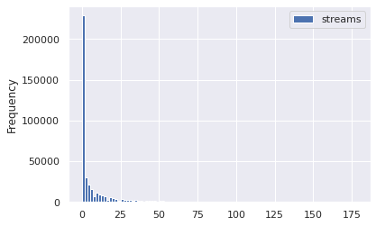
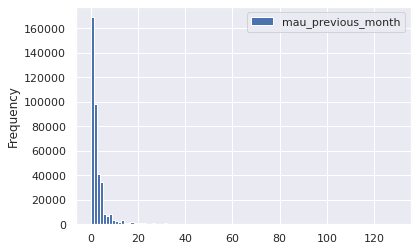
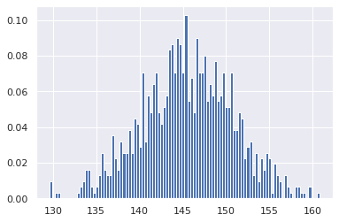

# What makes a playlist successful?

* Analysis
    * Design metric:
        * 30s listens/tot listens (listen conversions)
        * users both months/users prev month (user conversions)
        * best small time performers (less than X total monthly listens + high conversion)
        * best new user playlist (owner has only 1 popular playlist)
    * Define "top": binary top 10%, binary top 1%
* Slide deck
* Web App 
    * simulates playlist metadata; generates performance estimate

## Imports


```python
# basic packages
import pandas as pd
pd.set_option('display.max_columns', 500)
import numpy as np
import random
import copy

# visualization packages
import matplotlib.pyplot as plt
import plotly.express as px
import seaborn as sns; sns.set()
import graphviz 

# stats packages
import scipy.stats as stats
from scipy.spatial.distance import cdist
import statsmodels.api as sm
from statsmodels.formula.api import ols
from statsmodels.stats.outliers_influence import variance_inflation_factor

# sklearn preprocessing
from sklearn.preprocessing import OneHotEncoder, StandardScaler, PolynomialFeatures
from sklearn.decomposition import PCA
from sklearn.impute import SimpleImputer
from sklearn.model_selection import train_test_split
from sklearn.pipeline import make_pipeline

# sklearn modeling
from sklearn.neighbors import KNeighborsRegressor
from sklearn.ensemble import RandomForestClassifier, RandomForestRegressor, AdaBoostClassifier, GradientBoostingClassifier
from sklearn.linear_model import LinearRegression, LogisticRegression
from sklearn.mixture import GaussianMixture

# sklearn evaluation
from sklearn.metrics import mean_squared_error, r2_score, accuracy_score, classification_report, confusion_matrix
from sklearn.model_selection import GridSearchCV, cross_val_score

```


```python
df = pd.read_csv("playlist_summary_external-4.txt", delimiter='\t')
```


```python
df.head()
```


<div>
<style scoped>
    .dataframe tbody tr th:only-of-type {
        vertical-align: middle;
    }

    .dataframe tbody tr th {
        vertical-align: top;
    }

    .dataframe thead th {
        text-align: right;
    }
</style>
<table border="1" class="dataframe">
  <thead>
    <tr style="text-align: right;">
      <th></th>
      <th>playlist_uri</th>
      <th>owner</th>
      <th>streams</th>
      <th>stream30s</th>
      <th>dau</th>
      <th>wau</th>
      <th>mau</th>
      <th>mau_previous_month</th>
      <th>mau_both_months</th>
      <th>users</th>
      <th>skippers</th>
      <th>owner_country</th>
      <th>n_tracks</th>
      <th>n_local_tracks</th>
      <th>n_artists</th>
      <th>n_albums</th>
      <th>monthly_stream30s</th>
      <th>monthly_owner_stream30s</th>
      <th>tokens</th>
      <th>genre_1</th>
      <th>genre_2</th>
      <th>genre_3</th>
      <th>mood_1</th>
      <th>mood_2</th>
      <th>mood_3</th>
    </tr>
  </thead>
  <tbody>
    <tr>
      <th>0</th>
      <td>spotify:user:36069af6af076ccd9e597184a67b68c9:...</td>
      <td>36069af6af076ccd9e597184a67b68c9</td>
      <td>27</td>
      <td>27</td>
      <td>1</td>
      <td>1</td>
      <td>3</td>
      <td>3</td>
      <td>0</td>
      <td>8</td>
      <td>0</td>
      <td>US</td>
      <td>52</td>
      <td>0</td>
      <td>4</td>
      <td>7</td>
      <td>30</td>
      <td>27</td>
      <td>["ambient", "music", "therapy", "binaural", "b...</td>
      <td>Dance &amp; House</td>
      <td>New Age</td>
      <td>Country &amp; Folk</td>
      <td>Peaceful</td>
      <td>Romantic</td>
      <td>Somber</td>
    </tr>
    <tr>
      <th>1</th>
      <td>spotify:user:d1144a65b1c31c5f9f56b94f831124d5:...</td>
      <td>d1144a65b1c31c5f9f56b94f831124d5</td>
      <td>0</td>
      <td>0</td>
      <td>0</td>
      <td>1</td>
      <td>2</td>
      <td>1</td>
      <td>1</td>
      <td>3</td>
      <td>0</td>
      <td>US</td>
      <td>131</td>
      <td>0</td>
      <td>112</td>
      <td>113</td>
      <td>112</td>
      <td>94</td>
      <td>["good", "living"]</td>
      <td>Pop</td>
      <td>Indie Rock</td>
      <td>Alternative</td>
      <td>Excited</td>
      <td>Yearning</td>
      <td>Defiant</td>
    </tr>
    <tr>
      <th>2</th>
      <td>spotify:user:6b7fbed9edd6418ddd3b555bba441536:...</td>
      <td>6b7fbed9edd6418ddd3b555bba441536</td>
      <td>4</td>
      <td>2</td>
      <td>1</td>
      <td>1</td>
      <td>7</td>
      <td>5</td>
      <td>0</td>
      <td>15</td>
      <td>0</td>
      <td>US</td>
      <td>43</td>
      <td>0</td>
      <td>35</td>
      <td>36</td>
      <td>63</td>
      <td>0</td>
      <td>["norte\u00f1a"]</td>
      <td>Latin</td>
      <td>-</td>
      <td>-</td>
      <td>Lively</td>
      <td>Upbeat</td>
      <td>Romantic</td>
    </tr>
    <tr>
      <th>3</th>
      <td>spotify:user:580b98725077a94c3c8d01d07390426b:...</td>
      <td>580b98725077a94c3c8d01d07390426b</td>
      <td>12</td>
      <td>12</td>
      <td>1</td>
      <td>1</td>
      <td>4</td>
      <td>6</td>
      <td>1</td>
      <td>10</td>
      <td>0</td>
      <td>US</td>
      <td>27</td>
      <td>1</td>
      <td>27</td>
      <td>26</td>
      <td>154</td>
      <td>108</td>
      <td>[]</td>
      <td>Dance &amp; House</td>
      <td>Electronica</td>
      <td>Pop</td>
      <td>Excited</td>
      <td>Aggressive</td>
      <td>Defiant</td>
    </tr>
    <tr>
      <th>4</th>
      <td>spotify:user:1305d39070c95d161cc502e15014897d:...</td>
      <td>1305d39070c95d161cc502e15014897d</td>
      <td>20</td>
      <td>4</td>
      <td>1</td>
      <td>1</td>
      <td>2</td>
      <td>1</td>
      <td>1</td>
      <td>2</td>
      <td>1</td>
      <td>US</td>
      <td>52</td>
      <td>0</td>
      <td>47</td>
      <td>51</td>
      <td>230</td>
      <td>0</td>
      <td>["cheesy", "pants"]</td>
      <td>Indie Rock</td>
      <td>Alternative</td>
      <td>Electronica</td>
      <td>Excited</td>
      <td>Defiant</td>
      <td>Yearning</td>
    </tr>
  </tbody>
</table>
</div>


```python
df.tail()
```


<div>
<style scoped>
    .dataframe tbody tr th:only-of-type {
        vertical-align: middle;
    }

    .dataframe tbody tr th {
        vertical-align: top;
    }

    .dataframe thead th {
        text-align: right;
    }
</style>
<table border="1" class="dataframe">
  <thead>
    <tr style="text-align: right;">
      <th></th>
      <th>playlist_uri</th>
      <th>owner</th>
      <th>streams</th>
      <th>stream30s</th>
      <th>dau</th>
      <th>wau</th>
      <th>mau</th>
      <th>mau_previous_month</th>
      <th>mau_both_months</th>
      <th>users</th>
      <th>skippers</th>
      <th>owner_country</th>
      <th>n_tracks</th>
      <th>n_local_tracks</th>
      <th>n_artists</th>
      <th>n_albums</th>
      <th>monthly_stream30s</th>
      <th>monthly_owner_stream30s</th>
      <th>tokens</th>
      <th>genre_1</th>
      <th>genre_2</th>
      <th>genre_3</th>
      <th>mood_1</th>
      <th>mood_2</th>
      <th>mood_3</th>
    </tr>
  </thead>
  <tbody>
    <tr>
      <th>403361</th>
      <td>spotify:user:4672952d42bdd93b9215ce9a40394ea6:...</td>
      <td>4672952d42bdd93b9215ce9a40394ea6</td>
      <td>18</td>
      <td>6</td>
      <td>2</td>
      <td>6</td>
      <td>13</td>
      <td>12</td>
      <td>8</td>
      <td>20</td>
      <td>1</td>
      <td>US</td>
      <td>48</td>
      <td>0</td>
      <td>44</td>
      <td>48</td>
      <td>464</td>
      <td>43</td>
      <td>["discover", "mix"]</td>
      <td>Indie Rock</td>
      <td>Alternative</td>
      <td>Dance &amp; House</td>
      <td>Excited</td>
      <td>Yearning</td>
      <td>Energizing</td>
    </tr>
    <tr>
      <th>403362</th>
      <td>spotify:user:28c4378e099b4843f5dd42bb848c78ea:...</td>
      <td>28c4378e099b4843f5dd42bb848c78ea</td>
      <td>0</td>
      <td>0</td>
      <td>0</td>
      <td>0</td>
      <td>2</td>
      <td>1</td>
      <td>1</td>
      <td>3</td>
      <td>0</td>
      <td>US</td>
      <td>182</td>
      <td>27</td>
      <td>114</td>
      <td>129</td>
      <td>44</td>
      <td>14</td>
      <td>["ambient", "study", "music"]</td>
      <td>Electronica</td>
      <td>Dance &amp; House</td>
      <td>Rap</td>
      <td>Sensual</td>
      <td>Excited</td>
      <td>Brooding</td>
    </tr>
    <tr>
      <th>403363</th>
      <td>spotify:user:1c54302dc7e610a10c51eed81e26a168:...</td>
      <td>1c54302dc7e610a10c51eed81e26a168</td>
      <td>0</td>
      <td>0</td>
      <td>0</td>
      <td>2</td>
      <td>2</td>
      <td>0</td>
      <td>0</td>
      <td>2</td>
      <td>0</td>
      <td>US</td>
      <td>36</td>
      <td>0</td>
      <td>16</td>
      <td>15</td>
      <td>82</td>
      <td>80</td>
      <td>["october"]</td>
      <td>Rap</td>
      <td>Indie Rock</td>
      <td>Alternative</td>
      <td>Brooding</td>
      <td>Defiant</td>
      <td>Sophisticated</td>
    </tr>
    <tr>
      <th>403364</th>
      <td>spotify:user:adc973443cdf1abecdfb4244e530d451:...</td>
      <td>adc973443cdf1abecdfb4244e530d451</td>
      <td>0</td>
      <td>0</td>
      <td>0</td>
      <td>0</td>
      <td>2</td>
      <td>0</td>
      <td>0</td>
      <td>2</td>
      <td>0</td>
      <td>US</td>
      <td>50</td>
      <td>0</td>
      <td>25</td>
      <td>25</td>
      <td>2</td>
      <td>0</td>
      <td>[]</td>
      <td>Rap</td>
      <td>R&amp;B</td>
      <td>Latin</td>
      <td>Defiant</td>
      <td>Energizing</td>
      <td>Aggressive</td>
    </tr>
    <tr>
      <th>403365</th>
      <td>spotify:user:b3752c94e387192b7950b687453bcf45:...</td>
      <td>b3752c94e387192b7950b687453bcf45</td>
      <td>74</td>
      <td>16</td>
      <td>1</td>
      <td>1</td>
      <td>2</td>
      <td>1</td>
      <td>1</td>
      <td>3</td>
      <td>1</td>
      <td>US</td>
      <td>348</td>
      <td>10</td>
      <td>281</td>
      <td>290</td>
      <td>216</td>
      <td>178</td>
      <td>["eclecticism"]</td>
      <td>Rap</td>
      <td>Rock</td>
      <td>Alternative</td>
      <td>Defiant</td>
      <td>Energizing</td>
      <td>Cool</td>
    </tr>
  </tbody>
</table>
</div>


```python
df.sort_values('users', ascending=False).head()
```


<div>
<style scoped>
    .dataframe tbody tr th:only-of-type {
        vertical-align: middle;
    }

    .dataframe tbody tr th {
        vertical-align: top;
    }

    .dataframe thead th {
        text-align: right;
    }
</style>
<table border="1" class="dataframe">
  <thead>
    <tr style="text-align: right;">
      <th></th>
      <th>playlist_uri</th>
      <th>owner</th>
      <th>streams</th>
      <th>stream30s</th>
      <th>dau</th>
      <th>wau</th>
      <th>mau</th>
      <th>mau_previous_month</th>
      <th>mau_both_months</th>
      <th>users</th>
      <th>skippers</th>
      <th>owner_country</th>
      <th>n_tracks</th>
      <th>n_local_tracks</th>
      <th>n_artists</th>
      <th>n_albums</th>
      <th>monthly_stream30s</th>
      <th>monthly_owner_stream30s</th>
      <th>tokens</th>
      <th>genre_1</th>
      <th>genre_2</th>
      <th>genre_3</th>
      <th>mood_1</th>
      <th>mood_2</th>
      <th>mood_3</th>
    </tr>
  </thead>
  <tbody>
    <tr>
      <th>152032</th>
      <td>spotify:user:spotify:playlist:5FJXhjdILmRA2z5b...</td>
      <td>spotify</td>
      <td>2527075</td>
      <td>1461324</td>
      <td>152929</td>
      <td>669966</td>
      <td>1944150</td>
      <td>1478684</td>
      <td>578391</td>
      <td>3455406</td>
      <td>86162</td>
      <td>US</td>
      <td>51</td>
      <td>0</td>
      <td>51</td>
      <td>51</td>
      <td>42497334</td>
      <td>22</td>
      <td>["top", "hits"]</td>
      <td>Pop</td>
      <td>R&amp;B</td>
      <td>Dance &amp; House</td>
      <td>Excited</td>
      <td>Cool</td>
      <td>Brooding</td>
    </tr>
    <tr>
      <th>163726</th>
      <td>spotify:user:spotify:playlist:4hOKQuZbraPDIfaG...</td>
      <td>spotify</td>
      <td>2629715</td>
      <td>1513237</td>
      <td>122005</td>
      <td>514627</td>
      <td>1453097</td>
      <td>970905</td>
      <td>364140</td>
      <td>2448881</td>
      <td>56707</td>
      <td>US</td>
      <td>100</td>
      <td>0</td>
      <td>93</td>
      <td>86</td>
      <td>40722305</td>
      <td>0</td>
      <td>["top", "tracks", "currently", "spotify"]</td>
      <td>Pop</td>
      <td>Dance &amp; House</td>
      <td>Indie Rock</td>
      <td>Excited</td>
      <td>Defiant</td>
      <td>Energizing</td>
    </tr>
    <tr>
      <th>216752</th>
      <td>spotify:user:spotify:playlist:3ZgmfR6lsnCwdffZ...</td>
      <td>spotify</td>
      <td>735281</td>
      <td>348391</td>
      <td>43498</td>
      <td>219817</td>
      <td>688999</td>
      <td>365968</td>
      <td>109688</td>
      <td>1233952</td>
      <td>34145</td>
      <td>US</td>
      <td>100</td>
      <td>0</td>
      <td>100</td>
      <td>99</td>
      <td>9879201</td>
      <td>0</td>
      <td>["top", "pop", "tracks", "spotify"]</td>
      <td>Pop</td>
      <td>R&amp;B</td>
      <td>Rap</td>
      <td>Excited</td>
      <td>Defiant</td>
      <td>Empowering</td>
    </tr>
    <tr>
      <th>401060</th>
      <td>spotify:user:spotify:playlist:3MlpudZs4HT3i0yG...</td>
      <td>spotify</td>
      <td>505876</td>
      <td>245377</td>
      <td>33152</td>
      <td>121173</td>
      <td>430129</td>
      <td>339921</td>
      <td>79443</td>
      <td>973788</td>
      <td>23846</td>
      <td>US</td>
      <td>43</td>
      <td>0</td>
      <td>41</td>
      <td>42</td>
      <td>5567649</td>
      <td>44</td>
      <td>["teen", "party"]</td>
      <td>Pop</td>
      <td>R&amp;B</td>
      <td>Rap</td>
      <td>Excited</td>
      <td>Yearning</td>
      <td>Urgent</td>
    </tr>
    <tr>
      <th>307283</th>
      <td>spotify:user:spotify:playlist:04MJzJlzOoy5bTyt...</td>
      <td>spotify</td>
      <td>252309</td>
      <td>124903</td>
      <td>16480</td>
      <td>68518</td>
      <td>278966</td>
      <td>448102</td>
      <td>75371</td>
      <td>917174</td>
      <td>11888</td>
      <td>US</td>
      <td>296</td>
      <td>0</td>
      <td>1</td>
      <td>1</td>
      <td>4178965</td>
      <td>8</td>
      <td>["dance", "mega", "mix"]</td>
      <td>Dance &amp; House</td>
      <td>Electronica</td>
      <td>Pop</td>
      <td>Excited</td>
      <td>Aggressive</td>
      <td>Energizing</td>
    </tr>
  </tbody>
</table>
</div>


```python
df.iloc[403361,0]
```


    'spotify:user:4672952d42bdd93b9215ce9a40394ea6:playlist:6W45lqDBZ1TKma71Uu2F5x'


```python
df.columns
```


    Index(['playlist_uri', 'owner', 'streams', 'stream30s', 'dau', 'wau', 'mau',
           'mau_previous_month', 'mau_both_months', 'users', 'skippers',
           'owner_country', 'n_tracks', 'n_local_tracks', 'n_artists', 'n_albums',
           'monthly_stream30s', 'monthly_owner_stream30s', 'tokens', 'genre_1',
           'genre_2', 'genre_3', 'mood_1', 'mood_2', 'mood_3'],
          dtype='object')


```python
id = [df.columns[0], df.columns[1]]
targets = list(df.columns[2:11]) + ["monthly_stream30s", "monthly_owner_stream30s"]
features = set(df.columns) - set(targets) - set(id)
features = list(features)

print(f"id columns: {id}")
print(f"target columns: {targets}")
print(f"feature columns: {features}")
```

    id columns: ['playlist_uri', 'owner']
    target columns: ['streams', 'stream30s', 'dau', 'wau', 'mau', 'mau_previous_month', 'mau_both_months', 'users', 'skippers', 'monthly_stream30s', 'monthly_owner_stream30s']
    feature columns: ['n_tracks', 'mood_2', 'tokens', 'genre_3', 'owner_country', 'genre_2', 'genre_1', 'mood_3', 'n_artists', 'n_albums', 'n_local_tracks', 'mood_1']


`stream30s`, `dau`, `wau`, `mau`, `monthly_stream30s`, `monthly_owner_stream30s`, `mau_previous_months` and `mau_both_months` are all specifically for users who have streamed the playlist for over 30 seconds

Let's make the north star metric

* `mau_previous_month` - tells us how many users have streamed over 30 seconds from the playlist this past month
    * **downside**: since we don't know when the playlist was created, we may falsely label some playlists as having low rate of success

Let's make a guardrail metric

* `mau_both_months` - tells us if the playlist has replay value
    * **downside**: since we don't know when the playlist was created, we don't know at what stage the playlist is in its lifetime, i.e. do users fall off from months 1-2 or months 10-11
    
* `stream30s` - number of streams over 30 seconds today; tells us demand of playlist unormalized by number of users accessing the stream (i.e. some users will stream multiple times)
    * **downside** - a few users can dominate the overall number of listens
    
* `monthly_stream30s` - number of streams over 30 seconds for the month; will give us a longer term comparison between streams
    * **downside** - playlists created at some point in the month will be compared unequally
    
Secondary metric

* `monthly_owner_stream30s` - tells us if the owner or the playlist is significant in making a successful playlist; semi-feature column


```python
sub_targets = ['mau_previous_month', 'mau_both_months', 'monthly_stream30s', 'stream30s']
```

## Depenent Variable

it looks like `mau` may be from an incomplete month (comparing the frequency to `mau_previous_months`)


```python
quant = 0.99
for target in targets:
    cutoff = np.quantile(df[target], quant)
    y = df.loc[df[target] < cutoff]
    y.plot(kind='hist', y=target, bins=100)
```


    

    


    

    


    

    


    

    


    

    


    

    


    

    


    

    


    

    


    

    


    

    


```python
quant = 0.997
for target in sub_targets:
    cutoff = np.quantile(df[target], quant)
    y = df.loc[df[target] < cutoff]
    removed = df.loc[~(df[target] < cutoff)]
    print(f"removed items: {removed.shape[0]}")
    y.plot(kind='hist', y=target, bins=100)
    plt.show()
```

    removed items: 1212


    

    


    removed items: 1216


    

    


    removed items: 1211


    

    


    removed items: 1211


    

    


```python
df[sub_targets].describe()
```


<div>
<style scoped>
    .dataframe tbody tr th:only-of-type {
        vertical-align: middle;
    }

    .dataframe tbody tr th {
        vertical-align: top;
    }

    .dataframe thead th {
        text-align: right;
    }
</style>
<table border="1" class="dataframe">
  <thead>
    <tr style="text-align: right;">
      <th></th>
      <th>mau_previous_month</th>
      <th>mau_both_months</th>
      <th>monthly_stream30s</th>
      <th>stream30s</th>
    </tr>
  </thead>
  <tbody>
    <tr>
      <th>count</th>
      <td>4.033660e+05</td>
      <td>403366.000000</td>
      <td>4.033660e+05</td>
      <td>4.033660e+05</td>
    </tr>
    <tr>
      <th>mean</th>
      <td>5.819009e+01</td>
      <td>12.937065</td>
      <td>1.260489e+03</td>
      <td>4.283333e+01</td>
    </tr>
    <tr>
      <th>std</th>
      <td>3.827248e+03</td>
      <td>1240.912979</td>
      <td>1.062463e+05</td>
      <td>3.772412e+03</td>
    </tr>
    <tr>
      <th>min</th>
      <td>0.000000e+00</td>
      <td>0.000000</td>
      <td>2.000000e+00</td>
      <td>0.000000e+00</td>
    </tr>
    <tr>
      <th>25%</th>
      <td>1.000000e+00</td>
      <td>1.000000</td>
      <td>3.100000e+01</td>
      <td>0.000000e+00</td>
    </tr>
    <tr>
      <th>50%</th>
      <td>2.000000e+00</td>
      <td>1.000000</td>
      <td>7.900000e+01</td>
      <td>0.000000e+00</td>
    </tr>
    <tr>
      <th>75%</th>
      <td>3.000000e+00</td>
      <td>2.000000</td>
      <td>1.930000e+02</td>
      <td>5.000000e+00</td>
    </tr>
    <tr>
      <th>max</th>
      <td>1.478684e+06</td>
      <td>578391.000000</td>
      <td>4.249733e+07</td>
      <td>1.513237e+06</td>
    </tr>
  </tbody>
</table>
</div>


## Independent Variable


```python
features
```


    ['n_tracks',
     'mood_2',
     'tokens',
     'genre_3',
     'owner_country',
     'genre_2',
     'genre_1',
     'mood_3',
     'n_artists',
     'n_albums',
     'n_local_tracks',
     'owner',
     'mood_1']


```python
df[features].head()
```


<div>
<style scoped>
    .dataframe tbody tr th:only-of-type {
        vertical-align: middle;
    }

    .dataframe tbody tr th {
        vertical-align: top;
    }

    .dataframe thead th {
        text-align: right;
    }
</style>
<table border="1" class="dataframe">
  <thead>
    <tr style="text-align: right;">
      <th></th>
      <th>n_tracks</th>
      <th>mood_2</th>
      <th>tokens</th>
      <th>genre_3</th>
      <th>owner_country</th>
      <th>genre_2</th>
      <th>genre_1</th>
      <th>mood_3</th>
      <th>n_artists</th>
      <th>n_albums</th>
      <th>n_local_tracks</th>
      <th>owner</th>
      <th>mood_1</th>
    </tr>
  </thead>
  <tbody>
    <tr>
      <th>0</th>
      <td>52</td>
      <td>Romantic</td>
      <td>["ambient", "music", "therapy", "binaural", "b...</td>
      <td>Country &amp; Folk</td>
      <td>US</td>
      <td>New Age</td>
      <td>Dance &amp; House</td>
      <td>Somber</td>
      <td>4</td>
      <td>7</td>
      <td>0</td>
      <td>36069af6af076ccd9e597184a67b68c9</td>
      <td>Peaceful</td>
    </tr>
    <tr>
      <th>1</th>
      <td>131</td>
      <td>Yearning</td>
      <td>["good", "living"]</td>
      <td>Alternative</td>
      <td>US</td>
      <td>Indie Rock</td>
      <td>Pop</td>
      <td>Defiant</td>
      <td>112</td>
      <td>113</td>
      <td>0</td>
      <td>d1144a65b1c31c5f9f56b94f831124d5</td>
      <td>Excited</td>
    </tr>
    <tr>
      <th>2</th>
      <td>43</td>
      <td>Upbeat</td>
      <td>["norte\u00f1a"]</td>
      <td>-</td>
      <td>US</td>
      <td>-</td>
      <td>Latin</td>
      <td>Romantic</td>
      <td>35</td>
      <td>36</td>
      <td>0</td>
      <td>6b7fbed9edd6418ddd3b555bba441536</td>
      <td>Lively</td>
    </tr>
    <tr>
      <th>3</th>
      <td>27</td>
      <td>Aggressive</td>
      <td>[]</td>
      <td>Pop</td>
      <td>US</td>
      <td>Electronica</td>
      <td>Dance &amp; House</td>
      <td>Defiant</td>
      <td>27</td>
      <td>26</td>
      <td>1</td>
      <td>580b98725077a94c3c8d01d07390426b</td>
      <td>Excited</td>
    </tr>
    <tr>
      <th>4</th>
      <td>52</td>
      <td>Defiant</td>
      <td>["cheesy", "pants"]</td>
      <td>Electronica</td>
      <td>US</td>
      <td>Alternative</td>
      <td>Indie Rock</td>
      <td>Yearning</td>
      <td>47</td>
      <td>51</td>
      <td>0</td>
      <td>1305d39070c95d161cc502e15014897d</td>
      <td>Excited</td>
    </tr>
  </tbody>
</table>
</div>


```python

```


```python
con_features = list(df[features].select_dtypes('number').columns)
print(con_features)
des_features = list(df[features].select_dtypes('object').columns)
print(des_features)
```

    ['n_tracks', 'n_artists', 'n_albums', 'n_local_tracks']
    ['mood_2', 'tokens', 'genre_3', 'owner_country', 'genre_2', 'genre_1', 'mood_3', 'owner', 'mood_1']


```python
df[des_features].describe()
```


<div>
<style scoped>
    .dataframe tbody tr th:only-of-type {
        vertical-align: middle;
    }

    .dataframe tbody tr th {
        vertical-align: top;
    }

    .dataframe thead th {
        text-align: right;
    }
</style>
<table border="1" class="dataframe">
  <thead>
    <tr style="text-align: right;">
      <th></th>
      <th>mood_2</th>
      <th>tokens</th>
      <th>genre_3</th>
      <th>owner_country</th>
      <th>genre_2</th>
      <th>genre_1</th>
      <th>mood_3</th>
      <th>owner</th>
      <th>mood_1</th>
    </tr>
  </thead>
  <tbody>
    <tr>
      <th>count</th>
      <td>403366</td>
      <td>403366</td>
      <td>403366</td>
      <td>403366</td>
      <td>403366</td>
      <td>403366</td>
      <td>403366</td>
      <td>403366</td>
      <td>403366</td>
    </tr>
    <tr>
      <th>unique</th>
      <td>27</td>
      <td>192107</td>
      <td>26</td>
      <td>1</td>
      <td>26</td>
      <td>26</td>
      <td>27</td>
      <td>314899</td>
      <td>27</td>
    </tr>
    <tr>
      <th>top</th>
      <td>Energizing</td>
      <td>[]</td>
      <td>Pop</td>
      <td>US</td>
      <td>Alternative</td>
      <td>Indie Rock</td>
      <td>Energizing</td>
      <td>spotify</td>
      <td>Defiant</td>
    </tr>
    <tr>
      <th>freq</th>
      <td>51643</td>
      <td>32568</td>
      <td>78758</td>
      <td>403366</td>
      <td>66252</td>
      <td>70571</td>
      <td>56450</td>
      <td>399</td>
      <td>81079</td>
    </tr>
  </tbody>
</table>
</div>


we will go ahead and remove `owner_country` (1 unique), `owner`, and `tokens` (cardinal) from our feature analysis


```python
id = [df.columns[0]]
targets = list(df.columns[2:11]) + ["monthly_stream30s", "monthly_owner_stream30s"]
features = set(df.columns) - set(targets) - set(id) - set(["owner_country", "owner", "tokens"])
features = list(features)

print(f"id columns: {id}")
print(f"target columns: {targets}")
print(f"feature columns: {features}")

con_features = list(df[features].select_dtypes('number').columns)
print(con_features)
des_features = ['mood_1', 'mood_2', 'mood_3', 'genre_1', 'genre_2', 'genre_3']
print(des_features)
```

    id columns: ['playlist_uri']
    target columns: ['streams', 'stream30s', 'dau', 'wau', 'mau', 'mau_previous_month', 'mau_both_months', 'users', 'skippers', 'monthly_stream30s', 'monthly_owner_stream30s']
    feature columns: ['n_tracks', 'mood_2', 'genre_3', 'genre_2', 'genre_1', 'mood_3', 'n_artists', 'n_albums', 'n_local_tracks', 'mood_1']
    ['n_tracks', 'n_artists', 'n_albums', 'n_local_tracks']
    ['mood_1', 'mood_2', 'mood_3', 'genre_1', 'genre_2', 'genre_3']


### Discrete Features


```python
df[des_features].describe()
```


<div>
<style scoped>
    .dataframe tbody tr th:only-of-type {
        vertical-align: middle;
    }

    .dataframe tbody tr th {
        vertical-align: top;
    }

    .dataframe thead th {
        text-align: right;
    }
</style>
<table border="1" class="dataframe">
  <thead>
    <tr style="text-align: right;">
      <th></th>
      <th>mood_1</th>
      <th>mood_2</th>
      <th>mood_3</th>
      <th>genre_1</th>
      <th>genre_2</th>
      <th>genre_3</th>
    </tr>
  </thead>
  <tbody>
    <tr>
      <th>count</th>
      <td>403366</td>
      <td>403366</td>
      <td>403366</td>
      <td>403366</td>
      <td>403366</td>
      <td>403366</td>
    </tr>
    <tr>
      <th>unique</th>
      <td>27</td>
      <td>27</td>
      <td>27</td>
      <td>26</td>
      <td>26</td>
      <td>26</td>
    </tr>
    <tr>
      <th>top</th>
      <td>Defiant</td>
      <td>Energizing</td>
      <td>Energizing</td>
      <td>Indie Rock</td>
      <td>Alternative</td>
      <td>Pop</td>
    </tr>
    <tr>
      <th>freq</th>
      <td>81079</td>
      <td>51643</td>
      <td>56450</td>
      <td>70571</td>
      <td>66252</td>
      <td>78758</td>
    </tr>
  </tbody>
</table>
</div>


```python
df.value_counts(des_features)
```


    mood_1    mood_2      mood_3      genre_1        genre_2        genre_3
    Excited   Aggressive  Energizing  Dance & House  Electronica    Pop        4824
    Defiant   Cool        Energizing  Rap            R&B            Pop        4458
              Energizing  Cool        Rap            R&B            Pop        4003
                                                     Pop            R&B        1803
                          Excited     Rap            Pop            R&B        1225
                                                                               ... 
    Excited   Aggressive  Urgent      Alternative    Electronica    Metal         1
                                                     Dance & House  Pop           1
                          Upbeat      Pop            Soundtrack     -             1
                                      Indie Rock     Alternative    -             1
    Yearning  Urgent      Upbeat      Soundtrack     Pop            Rap           1
    Length: 138379, dtype: int64


```python
df[des_features[:3]].value_counts()
```


    mood_1    mood_2      mood_3    
    Defiant   Cool        Energizing    15125
              Energizing  Cool          12278
    Excited   Aggressive  Energizing     7564
    Defiant   Energizing  Excited        6672
              Excited     Energizing     6179
                                        ...  
    Peaceful  Urgent      Yearning          1
              Yearning    Cool              1
                          Excited           1
                          Fiery             1
    Other     Urgent      Aggressive        1
    Length: 9326, dtype: int64


```python
df[des_features[3:]].value_counts()
```


    genre_1        genre_2         genre_3    
    Rap            R&B             Pop            15477
    Indie Rock     Alternative     Rock           13102
    Dance & House  Electronica     Pop            10800
    Indie Rock     Alternative     Pop             9981
                                   Electronica     7233
                                                  ...  
    New Age        Country & Folk  Rock               1
                   Dance & House   R&B                1
                                   Rock               1
                                   Soundtrack         1
    Traditional    Spoken & Audio  Religious          1
    Length: 6664, dtype: int64


```python
fig, ax = plt.subplots(1, 2, figsize=(10,12))

dff = pd.DataFrame(df[des_features[0]].value_counts()).join(
    pd.DataFrame(df[des_features[1]].value_counts())).join(
    pd.DataFrame(df[des_features[2]].value_counts()))
dff = dff.reset_index().melt(id_vars='index')
dff.columns = ['mood', 'order', 'count']
sns.barplot(data=dff, hue='order', y='mood', x='count', orient='h', ax=ax[0])

dff = pd.DataFrame(df[des_features[3]].value_counts()).join(
    pd.DataFrame(df[des_features[4]].value_counts())).join(
    pd.DataFrame(df[des_features[5]].value_counts()))
dff = dff.reset_index().melt(id_vars='index')
dff.columns = ['genre', 'order', 'count']
sns.barplot(data=dff, hue='order', y='genre', x='count', orient='h', ax=ax[1])

plt.tight_layout()
```


    

    


### Continuous Features


```python
df[con_features].describe()
```


<div>
<style scoped>
    .dataframe tbody tr th:only-of-type {
        vertical-align: middle;
    }

    .dataframe tbody tr th {
        vertical-align: top;
    }

    .dataframe thead th {
        text-align: right;
    }
</style>
<table border="1" class="dataframe">
  <thead>
    <tr style="text-align: right;">
      <th></th>
      <th>n_tracks</th>
      <th>n_artists</th>
      <th>n_albums</th>
      <th>n_local_tracks</th>
    </tr>
  </thead>
  <tbody>
    <tr>
      <th>count</th>
      <td>403366.000000</td>
      <td>403366.000000</td>
      <td>403366.000000</td>
      <td>403366.000000</td>
    </tr>
    <tr>
      <th>mean</th>
      <td>201.483432</td>
      <td>83.852050</td>
      <td>88.224250</td>
      <td>3.084035</td>
    </tr>
    <tr>
      <th>std</th>
      <td>584.077765</td>
      <td>128.152488</td>
      <td>133.193118</td>
      <td>40.330266</td>
    </tr>
    <tr>
      <th>min</th>
      <td>1.000000</td>
      <td>1.000000</td>
      <td>1.000000</td>
      <td>0.000000</td>
    </tr>
    <tr>
      <th>25%</th>
      <td>38.000000</td>
      <td>18.000000</td>
      <td>19.000000</td>
      <td>0.000000</td>
    </tr>
    <tr>
      <th>50%</th>
      <td>84.000000</td>
      <td>46.000000</td>
      <td>48.000000</td>
      <td>0.000000</td>
    </tr>
    <tr>
      <th>75%</th>
      <td>192.000000</td>
      <td>100.000000</td>
      <td>106.000000</td>
      <td>0.000000</td>
    </tr>
    <tr>
      <th>max</th>
      <td>79984.000000</td>
      <td>5226.000000</td>
      <td>6397.000000</td>
      <td>9117.000000</td>
    </tr>
  </tbody>
</table>
</div>


```python
quant = 0.999
for target in con_features:
    cutoff = np.quantile(df[target], quant)
    y = df.loc[df[target] < cutoff]
    removed = df.loc[~(df[target] < cutoff)]
    print(f"removed items: {removed.shape[0]}")
    y.plot(kind='hist', y=target, bins=100, density=True)
    plt.show()
```

    removed items: 404


    

    


    removed items: 405


    

    


    removed items: 404


    

    


    removed items: 406


    

    


#### Bootstrapping

An example of how we will bootstrap to perform hypothesis tests later on


```python
means = []
ind = con_features[0]
for i in range(100):
    boot = random.sample(
                list(
                    df.loc[
                        (df[ind] > 9) 
                        & (df[ind] < 999)
                    ][ind].values),
                k=1000)
    means.append(np.mean(boot))
```


```python
stuff = plt.hist(means, bins=100, density=True)
```


    

    


## Dependency

### Categorical Target


```python
sub_targets
```


    ['mau_previous_month', 'mau_both_months', 'monthly_stream30s', 'stream30s']


```python
des_features
```


    ['mood_1', 'mood_2', 'mood_3', 'genre_1', 'genre_2', 'genre_3']


#### Categorical Feature

##### Moods


```python
chidf = pd.DataFrame()
target = sub_targets[2]
chidf[target] = df[target]
print(chidf[target].median())
moods = pd.DataFrame()
cutoff = 0.001
pop = chidf[target].values

for ind in des_features:
    # ind = des_features[0]
    chidf[ind] = df[ind]
    
    for grp_label in df[ind].unique():
        # grp_label = df[ind].unique()[0]
        grp = chidf.loc[chidf[ind] == grp_label][target].values
        chi2, p, m, cTable = stats.median_test(grp, pop, correction=True)
        ratio = cTable[0]/cTable[1]
        pos = ratio[0]/ratio[1] > 1
        moods = pd.concat([moods, pd.DataFrame([[ind, grp_label, chi2, p, cTable, pos, p<cutoff]])])

moods.columns = ['feature', 'group', 'chi', 'p-value', 'cTable', '+', 'reject null']
moods = moods.sort_values('p-value').reset_index(drop=True)
```

    79.0


```python
moods.loc[moods['reject null'] == True]
```


<div>
<style scoped>
    .dataframe tbody tr th:only-of-type {
        vertical-align: middle;
    }

    .dataframe tbody tr th {
        vertical-align: top;
    }

    .dataframe thead th {
        text-align: right;
    }
</style>
<table border="1" class="dataframe">
  <thead>
    <tr style="text-align: right;">
      <th></th>
      <th>feature</th>
      <th>group</th>
      <th>chi</th>
      <th>p-value</th>
      <th>cTable</th>
      <th>+</th>
      <th>reject null</th>
    </tr>
  </thead>
  <tbody>
    <tr>
      <th>0</th>
      <td>genre_3</td>
      <td>-</td>
      <td>1725.882036</td>
      <td>0.000000e+00</td>
      <td>[[16033, 205049], [24090, 198317]]</td>
      <td>False</td>
      <td>True</td>
    </tr>
    <tr>
      <th>1</th>
      <td>genre_2</td>
      <td>-</td>
      <td>1104.759466</td>
      <td>3.051013e-242</td>
      <td>[[8216, 203517], [12990, 199849]]</td>
      <td>False</td>
      <td>True</td>
    </tr>
    <tr>
      <th>2</th>
      <td>genre_1</td>
      <td>Latin</td>
      <td>651.374931</td>
      <td>1.122254e-143</td>
      <td>[[9000, 199027], [6012, 204339]]</td>
      <td>True</td>
      <td>True</td>
    </tr>
    <tr>
      <th>3</th>
      <td>mood_1</td>
      <td>Energizing</td>
      <td>611.189037</td>
      <td>6.167816e-135</td>
      <td>[[10316, 203517], [14071, 199849]]</td>
      <td>False</td>
      <td>True</td>
    </tr>
    <tr>
      <th>4</th>
      <td>genre_1</td>
      <td>Rock</td>
      <td>315.827189</td>
      <td>1.174487e-70</td>
      <td>[[12514, 201911], [15563, 201455]]</td>
      <td>False</td>
      <td>True</td>
    </tr>
    <tr>
      <th>...</th>
      <td>...</td>
      <td>...</td>
      <td>...</td>
      <td>...</td>
      <td>...</td>
      <td>...</td>
      <td>...</td>
    </tr>
    <tr>
      <th>93</th>
      <td>mood_1</td>
      <td>Stirring</td>
      <td>12.333846</td>
      <td>4.448190e-04</td>
      <td>[[877, 200454], [1044, 202912]]</td>
      <td>False</td>
      <td>True</td>
    </tr>
    <tr>
      <th>94</th>
      <td>mood_1</td>
      <td>Serious</td>
      <td>12.316512</td>
      <td>4.489689e-04</td>
      <td>[[778, 200454], [935, 202912]]</td>
      <td>False</td>
      <td>True</td>
    </tr>
    <tr>
      <th>95</th>
      <td>mood_2</td>
      <td>Lively</td>
      <td>12.161071</td>
      <td>4.879735e-04</td>
      <td>[[2588, 200454], [2882, 202912]]</td>
      <td>False</td>
      <td>True</td>
    </tr>
    <tr>
      <th>96</th>
      <td>mood_2</td>
      <td>Somber</td>
      <td>11.618507</td>
      <td>6.529880e-04</td>
      <td>[[792, 200454], [946, 202912]]</td>
      <td>False</td>
      <td>True</td>
    </tr>
    <tr>
      <th>97</th>
      <td>genre_2</td>
      <td>Dance &amp; House</td>
      <td>10.834697</td>
      <td>9.961560e-04</td>
      <td>[[12678, 201911], [13196, 201455]]</td>
      <td>False</td>
      <td>True</td>
    </tr>
  </tbody>
</table>
<p>98 rows × 7 columns</p>
</div>


##### Chi-Square


```python
chidf = pd.DataFrame()
target = sub_targets[2]
chidf[target] = df[target]
quant_value = 0.90
tar_value = np.quantile(chidf[target], quant_value)
chidf[target] = chidf[target] > tar_value
chisum = pd.DataFrame()
cutoff = 0.0001
pop = chidf[target].values

for ind in des_features:
    # ind = des_features[0]
    chidf[ind] = df[ind]

    for grp_label in df[ind].unique():
    # grp_label = df[ind].unique()[0]
        try:
            cTable = chidf.groupby(chidf[ind] == grp_label)[target].value_counts().values.reshape(2,2).T
            chi2, p, dof, ex = stats.chi2_contingency(cTable, correction=True, lambda_=None)
            ratio = cTable[1]/cTable[0]
            pos = ratio[1]/ratio[0]
            chisum = pd.concat([chisum, pd.DataFrame([[ind, grp_label, chi2, p, cTable, pos, p<cutoff]])])
        except:
            pass

chisum.columns = ['feature', 'group', 'chi', 'p-value', 'cTable', 'multiplier', 'reject null']
chisum = chisum.sort_values('p-value').reset_index(drop=True)
```

##### Categorical-Categorical Conclusions

increasing `quant_value` will render additional features; as the population performance worsens, new feature/group pairs have an opportunity to increase the multiplier

Best Groups


```python
chisum.loc[(chisum['reject null'] == True) & (chisum['multiplier'] > 2)].sort_values('multiplier', ascending=False)
```


<div>
<style scoped>
    .dataframe tbody tr th:only-of-type {
        vertical-align: middle;
    }

    .dataframe tbody tr th {
        vertical-align: top;
    }

    .dataframe thead th {
        text-align: right;
    }
</style>
<table border="1" class="dataframe">
  <thead>
    <tr style="text-align: right;">
      <th></th>
      <th>feature</th>
      <th>group</th>
      <th>chi</th>
      <th>p-value</th>
      <th>cTable</th>
      <th>multiplier</th>
      <th>reject null</th>
    </tr>
  </thead>
  <tbody>
    <tr>
      <th>6</th>
      <td>genre_1</td>
      <td>Children's</td>
      <td>262.624693</td>
      <td>4.596280e-59</td>
      <td>[[361785, 1286], [39933, 362]]</td>
      <td>2.550270</td>
      <td>True</td>
    </tr>
    <tr>
      <th>11</th>
      <td>mood_1</td>
      <td>Other</td>
      <td>197.598843</td>
      <td>6.979647e-45</td>
      <td>[[361719, 1352], [39952, 343]]</td>
      <td>2.296943</td>
      <td>True</td>
    </tr>
    <tr>
      <th>19</th>
      <td>genre_1</td>
      <td>Spoken &amp; Audio</td>
      <td>120.508309</td>
      <td>4.896128e-28</td>
      <td>[[362147, 924], [40068, 227]]</td>
      <td>2.220451</td>
      <td>True</td>
    </tr>
    <tr>
      <th>0</th>
      <td>genre_1</td>
      <td>Latin</td>
      <td>1150.625294</td>
      <td>3.280867e-252</td>
      <td>[[350782, 12289], [37572, 2723]]</td>
      <td>2.068731</td>
      <td>True</td>
    </tr>
    <tr>
      <th>12</th>
      <td>genre_1</td>
      <td>New Age</td>
      <td>166.484617</td>
      <td>4.335181e-38</td>
      <td>[[361286, 1785], [39896, 399]]</td>
      <td>2.024214</td>
      <td>True</td>
    </tr>
  </tbody>
</table>
</div>


Worst Groups


```python
chisum.loc[(chisum['reject null'] == True) & (chisum['multiplier'] < 0.8)].sort_values('multiplier', ascending=False)
```


<div>
<style scoped>
    .dataframe tbody tr th:only-of-type {
        vertical-align: middle;
    }

    .dataframe tbody tr th {
        vertical-align: top;
    }

    .dataframe thead th {
        text-align: right;
    }
</style>
<table border="1" class="dataframe">
  <thead>
    <tr style="text-align: right;">
      <th></th>
      <th>feature</th>
      <th>group</th>
      <th>chi</th>
      <th>p-value</th>
      <th>cTable</th>
      <th>multiplier</th>
      <th>reject null</th>
    </tr>
  </thead>
  <tbody>
    <tr>
      <th>28</th>
      <td>mood_2</td>
      <td>Sensual</td>
      <td>85.309680</td>
      <td>2.551113e-20</td>
      <td>[[343873, 19198], [38598, 1697]]</td>
      <td>0.787516</td>
      <td>True</td>
    </tr>
    <tr>
      <th>40</th>
      <td>genre_1</td>
      <td>Electronica</td>
      <td>65.249731</td>
      <td>6.598320e-16</td>
      <td>[[350162, 12909], [39176, 1119]]</td>
      <td>0.774794</td>
      <td>True</td>
    </tr>
    <tr>
      <th>2</th>
      <td>genre_1</td>
      <td>Indie Rock</td>
      <td>366.567076</td>
      <td>1.046303e-81</td>
      <td>[[298164, 64907], [34631, 5664]]</td>
      <td>0.751315</td>
      <td>True</td>
    </tr>
    <tr>
      <th>13</th>
      <td>genre_3</td>
      <td>Electronica</td>
      <td>163.908151</td>
      <td>1.584260e-37</td>
      <td>[[337501, 25570], [38143, 2152]]</td>
      <td>0.744684</td>
      <td>True</td>
    </tr>
    <tr>
      <th>21</th>
      <td>mood_1</td>
      <td>Brooding</td>
      <td>109.456909</td>
      <td>1.288759e-25</td>
      <td>[[346296, 16775], [38893, 1402]]</td>
      <td>0.744152</td>
      <td>True</td>
    </tr>
    <tr>
      <th>48</th>
      <td>mood_1</td>
      <td>Gritty</td>
      <td>49.741710</td>
      <td>1.753777e-12</td>
      <td>[[355800, 7271], [39695, 600]]</td>
      <td>0.739652</td>
      <td>True</td>
    </tr>
    <tr>
      <th>14</th>
      <td>mood_1</td>
      <td>Energizing</td>
      <td>162.542129</td>
      <td>3.149562e-37</td>
      <td>[[340541, 22530], [38438, 1857]]</td>
      <td>0.730229</td>
      <td>True</td>
    </tr>
    <tr>
      <th>68</th>
      <td>mood_3</td>
      <td>Other</td>
      <td>27.407286</td>
      <td>1.648091e-07</td>
      <td>[[361541, 1530], [40196, 99]]</td>
      <td>0.581994</td>
      <td>True</td>
    </tr>
  </tbody>
</table>
</div>


We would recommend would-be superstar playlist maker construct a playlist with the following attributes:

* **Genre 1: Children's** 
    * 2.6x more likely to be in the 90th percentile
    * 4.8x more likely to be in the 99th percentile
* **Mood 1: Other** 
    * 2.3x more likely to be in the 90th percentile
    * 2.4x more likely to be in the 99th percentile

#### Continuous Feature


```python
con_features
```


    ['n_tracks', 'n_artists', 'n_albums', 'n_local_tracks']


##### t-Test

For t tests we need to deal with the long tails in the distributions along the independent variable


```python
chidf = pd.DataFrame()
target = sub_targets[2]
chidf[target] = df[target]
quant_value = 0.90
tar_value = np.quantile(chidf[target], quant_value)
chidf[target] = chidf[target] > tar_value
welchsum = pd.DataFrame()
cutoff = 0.0001
pop = chidf[target].values

for ind in con_features:
    # ind = con_features[0]
    chidf[ind] = df[ind]

    # for grp_label in df[ind].unique():
    # try:
    a = []
    b = []
    for i in range(100):
        boot1 = random.sample(
                    list(
                        chidf.loc[
                            (chidf[target] == True)
                        ][ind].values),
                    k=1000)
        boot2 = random.sample(
                    list(
                        chidf.loc[
                            (chidf[target] == False)
                        ][ind].values),
                    k=1000)
        a.append(np.mean(boot1))
        b.append(np.mean(boot2))
    testt, p = stats.ttest_ind(a, b, equal_var=False)
    a_avg = np.mean(a)
    b_avg = np.mean(b)
    welchsum = pd.concat([welchsum, pd.DataFrame([[ind, testt, p, a_avg, b_avg, p<cutoff]])])
    sns.histplot(a, color='tab:orange', label=f"{target} > {tar_value:.0f}")
    sns.histplot(b, label=f"{target} <= {tar_value:.0f}")
    plt.title(ind)
    plt.legend()
    plt.show()
    # except:
    #     pass

welchsum.columns = ['feature', 'test stat', 'p-value', 'upper q avg', 'lower q avg', 'reject null']
welchsum = welchsum.sort_values('p-value').reset_index(drop=True)
```


    

    


    

    


    

    


    

    


```python
welchsum
```


<div>
<style scoped>
    .dataframe tbody tr th:only-of-type {
        vertical-align: middle;
    }

    .dataframe tbody tr th {
        vertical-align: top;
    }

    .dataframe thead th {
        text-align: right;
    }
</style>
<table border="1" class="dataframe">
  <thead>
    <tr style="text-align: right;">
      <th></th>
      <th>feature</th>
      <th>test stat</th>
      <th>p-value</th>
      <th>upper q avg</th>
      <th>lower q avg</th>
      <th>reject null</th>
    </tr>
  </thead>
  <tbody>
    <tr>
      <th>0</th>
      <td>n_albums</td>
      <td>102.048804</td>
      <td>9.074982e-151</td>
      <td>150.03201</td>
      <td>81.86361</td>
      <td>True</td>
    </tr>
    <tr>
      <th>1</th>
      <td>n_artists</td>
      <td>93.165040</td>
      <td>7.173538e-143</td>
      <td>142.27000</td>
      <td>77.84331</td>
      <td>True</td>
    </tr>
    <tr>
      <th>2</th>
      <td>n_tracks</td>
      <td>60.485334</td>
      <td>2.651696e-108</td>
      <td>415.45784</td>
      <td>177.93975</td>
      <td>True</td>
    </tr>
    <tr>
      <th>3</th>
      <td>n_local_tracks</td>
      <td>15.204209</td>
      <td>1.507712e-33</td>
      <td>6.30652</td>
      <td>2.75143</td>
      <td>True</td>
    </tr>
  </tbody>
</table>
</div>


Let's perform the same test again this time let's say we're only interested in playlists with at least 10 tracks and fewer than 1000 tracks


```python
chidf = pd.DataFrame()
target = sub_targets[2]
chidf[target] = df[target]
chidf['n_tracks'] = df['n_tracks']
quant_value = 0.90
tar_value = np.quantile(chidf[target], quant_value)
chidf[target] = chidf[target] > tar_value
welchsum = pd.DataFrame()
cutoff = 0.0001
pop = chidf[target].values

for ind in con_features:
    # ind = con_features[0]
    chidf[ind] = df[ind]

    # for grp_label in df[ind].unique():
    # try:
    a = []
    b = []
    for i in range(100):
        boot1 = random.sample(
                    list(
                        chidf.loc[
                            (chidf[target] == True)
                            & (chidf['n_tracks'] > 9)
                            & (chidf['n_tracks'] < 999)
                        ][ind].values),
                    k=1000)
        boot2 = random.sample(
                    list(
                        chidf.loc[
                            (chidf[target] == False)
                            & (chidf['n_tracks'] > 9)
                            & (chidf['n_tracks'] < 999)
                        ][ind].values),
                    k=1000)
        a.append(np.mean(boot1))
        b.append(np.mean(boot2))
    testt, p = stats.ttest_ind(a, b, equal_var=False)
    a_avg = np.mean(a)
    b_avg = np.mean(b)
    welchsum = pd.concat([welchsum, pd.DataFrame([[ind, testt, p, a_avg, b_avg, p<cutoff]])])
    sns.histplot(a, color='tab:orange', label=f"{target} > {tar_value:.0f}")
    sns.histplot(b, label=f"{target} <= {tar_value:.0f}")
    plt.title(ind)
    plt.legend()
    plt.show()
    # except:
    #     pass

welchsum.columns = ['feature', 'test stat', 'p-value', 'upper q avg', 'lower q avg', 'reject null']
welchsum = welchsum.sort_values('p-value').reset_index(drop=True)
```


    

    


    

    


    

    


    

    


```python
welchsum
```


<div>
<style scoped>
    .dataframe tbody tr th:only-of-type {
        vertical-align: middle;
    }

    .dataframe tbody tr th {
        vertical-align: top;
    }

    .dataframe thead th {
        text-align: right;
    }
</style>
<table border="1" class="dataframe">
  <thead>
    <tr style="text-align: right;">
      <th></th>
      <th>feature</th>
      <th>test stat</th>
      <th>p-value</th>
      <th>upper q avg</th>
      <th>lower q avg</th>
      <th>reject null</th>
    </tr>
  </thead>
  <tbody>
    <tr>
      <th>0</th>
      <td>n_tracks</td>
      <td>110.782734</td>
      <td>1.913718e-173</td>
      <td>231.56673</td>
      <td>137.09507</td>
      <td>True</td>
    </tr>
    <tr>
      <th>1</th>
      <td>n_artists</td>
      <td>87.812155</td>
      <td>2.100996e-157</td>
      <td>108.08371</td>
      <td>70.02189</td>
      <td>True</td>
    </tr>
    <tr>
      <th>2</th>
      <td>n_albums</td>
      <td>87.814955</td>
      <td>5.432018e-154</td>
      <td>114.92906</td>
      <td>73.64590</td>
      <td>True</td>
    </tr>
    <tr>
      <th>3</th>
      <td>n_local_tracks</td>
      <td>17.294490</td>
      <td>5.602552e-40</td>
      <td>3.02931</td>
      <td>1.85825</td>
      <td>True</td>
    </tr>
  </tbody>
</table>
</div>


##### Categorical-Continuous Conclusions

Our conclusions are the same. There is a clear delineation between number of tracks, albums, and artists for popular and unpopular playlists

#### Categorical Target Model

##### Deciles


```python
target
```


    'monthly_stream30s'


```python
y = df[target].values
labels = y.copy()
names = []
for idx, quant in zip(range(11), np.linspace(0, 1, num=11)):
    if idx == 0:
        prev = quant
        continue
    if idx == 1:
        labels[labels <= np.quantile(y, quant)] = idx
        names += [f"less than {np.quantile(y, quant):.0f} listens"]
    else:
        labels[(labels > np.quantile(y, prev))
              &(labels <= np.quantile(y, quant))] = idx
        names += [f"{np.quantile(y, prev):.0f} < listens <= {np.quantile(y, quant):.0f}"]
    prev = quant
y = labels
```


```python
X = df[des_features + con_features]
enc = OneHotEncoder()
std = StandardScaler()

X_cat = enc.fit_transform(X[des_features]).toarray()
X_con = std.fit_transform(X[con_features])
X = np.hstack((X_con, X_cat))

X_train, X_test, y_train, y_test = train_test_split(X, y, random_state=42, train_size=0.8)
```


```python
X_train.shape
```


    (322692, 163)


```python
model = RandomForestClassifier()
model.fit(X_train, y_train)
```


    RandomForestClassifier()


```python
y_hat_test = model.predict(X_test)
print(f"Train Acc: {accuracy_score(y_test, y_hat_test):.2f}")
print(f"Test Acc: {accuracy_score(y_test, y_hat_test):.2f}")
```

    Train Acc: 0.14
    Test Acc: 0.14


```python
print(classification_report(y_test, y_hat_test, zero_division=0))
```

                  precision    recall  f1-score   support
    
               1       0.19      0.27      0.22      8363
               2       0.13      0.13      0.13      7866
               3       0.12      0.12      0.12      8173
               4       0.10      0.09      0.10      7773
               5       0.11      0.10      0.10      8252
               6       0.11      0.10      0.10      7976
               7       0.11      0.09      0.10      8018
               8       0.12      0.10      0.11      8185
               9       0.14      0.14      0.14      8009
              10       0.21      0.26      0.23      8059
    
        accuracy                           0.14     80674
       macro avg       0.13      0.14      0.14     80674
    weighted avg       0.13      0.14      0.14     80674
    


```python
fig, ax = plt.subplots(1, 1, figsize = (8,7))
sns.heatmap(confusion_matrix(y_test, y_hat_test), annot=True, ax=ax)
```


    <AxesSubplot:>


    

    


##### Quartiles


```python
### Create Categories

y = df[target].values
labels = y.copy()
names = []
lim = 4
for idx, quant in zip(range(lim), np.linspace(0, 1, num=lim)):
    if idx == 0:
        prev = quant
        continue
    if idx == 1:
        labels[labels <= np.quantile(y, quant)] = idx
        names += [f"less than {np.quantile(y, quant):.0f} listens"]
    else:
        labels[(labels > np.quantile(y, prev))
              &(labels <= np.quantile(y, quant))] = idx
        names += [f"{np.quantile(y, prev):.0f} < listens <= {np.quantile(y, quant):.0f}"]
    prev = quant
y = labels

### Create Training Data

X = df[des_features + con_features]
enc = OneHotEncoder()
std = StandardScaler()

X_cat = enc.fit_transform(X[des_features]).toarray()
X_con = std.fit_transform(X[con_features])
X = np.hstack((X_con, X_cat))

X_train, X_test, y_train, y_test = train_test_split(X, y, random_state=42, train_size=0.8)

### Train Model

model = RandomForestClassifier()
model.fit(X_train, y_train)

### Asses Performance

y_hat_test = model.predict(X_test)
y_hat_train = model.predict(X_train)
print(f"Train Acc: {accuracy_score(y_train, y_hat_train):.2f}")
print(f"Test Acc: {accuracy_score(y_test, y_hat_test):.2f}")

print(classification_report(y_test, y_hat_test, zero_division=0))

fig, ax = plt.subplots(1, 1, figsize = (8,7))
sns.heatmap(confusion_matrix(y_test, y_hat_test), annot=True, ax=ax)
```

    Train Acc: 0.99
    Test Acc: 0.44
                  precision    recall  f1-score   support
    
               1       0.46      0.49      0.47     26847
               2       0.36      0.31      0.33     26799
               3       0.47      0.50      0.49     27028
    
        accuracy                           0.44     80674
       macro avg       0.43      0.44      0.43     80674
    weighted avg       0.43      0.44      0.43     80674
    


    <AxesSubplot:>


    

    


### Continuous Target

#### Linear

#### Ensemble
