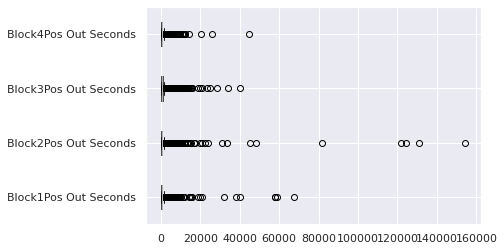
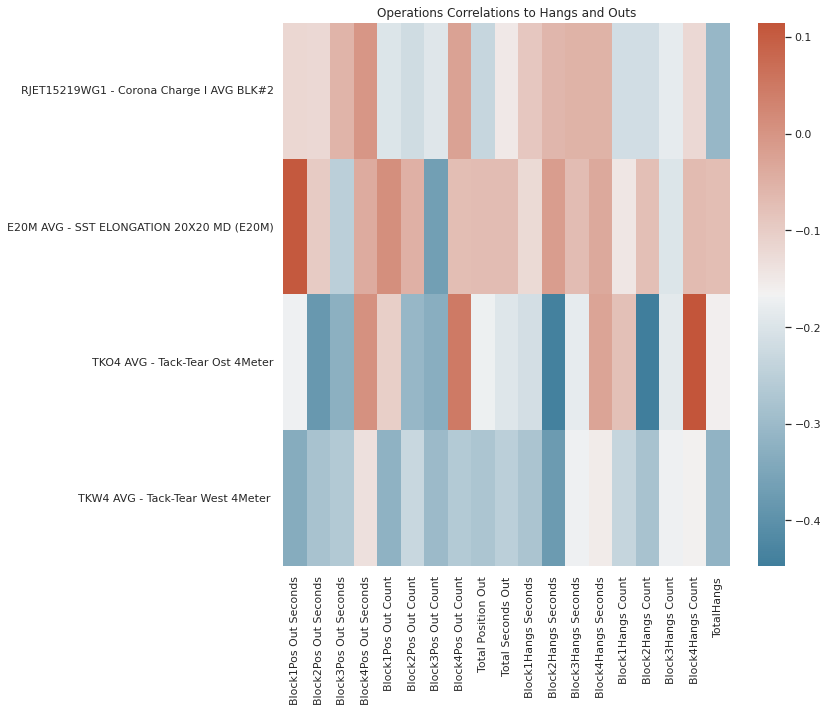
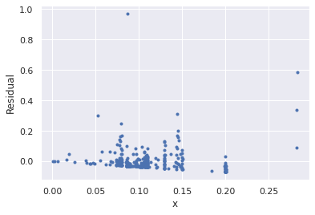
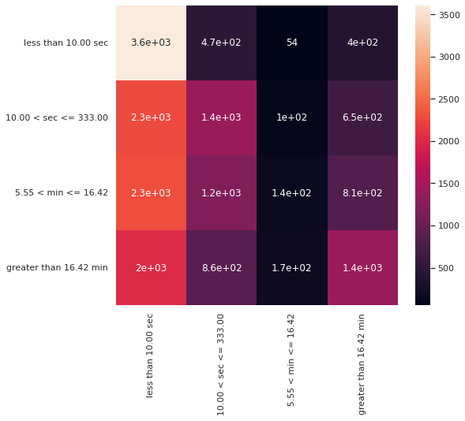

<a id='top'></a>

# Causality Analysis

# TODO

* ols assumptions for univariate analyses
    * residual plots
* forward selection
    * lines up more or less with chi square tests 
    * include some colinearity measure?
* logistic regression (binned seconds, binned total outs)
    * random forest does little better than random guessing
* business impact
* reorganize hypothesis tests section
    * univariate vs multivariate
    * cat v vat, cat v quant, quant v quant, quant v cat

## 1.0 Imports

### Import Libraries


```python
# basic packages
import pandas as pd
import numpy as np
import random
import copy

# visualization packages
from ipywidgets import interact
import matplotlib.pyplot as plt
import plotly.express as px
import seaborn as sns; sns.set()
import graphviz 

# stats packages
import scipy.stats as stats
from scipy.spatial.distance import cdist
import statsmodels.api as sm
from statsmodels.formula.api import ols
from statsmodels.stats.outliers_influence import variance_inflation_factor

# sklearn preprocessing
from sklearn.preprocessing import OneHotEncoder, StandardScaler, PolynomialFeatures, MinMaxScaler
from sklearn.decomposition import PCA
from sklearn.impute import SimpleImputer
from sklearn.model_selection import train_test_split
from sklearn.pipeline import make_pipeline

# sklearn modeling
from sklearn.neighbors import KNeighborsRegressor
from sklearn.ensemble import RandomForestClassifier, RandomForestRegressor, AdaBoostClassifier, GradientBoostingClassifier
from sklearn.linear_model import LinearRegression, LogisticRegression
from sklearn.mixture import GaussianMixture
from sklearn.cluster import KMeans

# sklearn evaluation
from sklearn.metrics import mean_squared_error, r2_score, accuracy_score, silhouette_score, calinski_harabasz_score, classification_report, confusion_matrix
from sklearn.model_selection import GridSearchCV, cross_val_score
```


```python
def make_patch_spines_invisible(ax):
    ax.set_frame_on(True)
    ax.patch.set_visible(False)
    for sp in ax.spines.values():
        sp.set_visible(False)
        
from matplotlib import colors
from itertools import cycle

def my_colors():
    tab = cycle(colors.TABLEAU_COLORS)
    return tab
```

### Load Data

[consider only feeds](#pairwise)

[consider feeds and operating conditions](#pairwise)


```python
feeds = ['ADD ARGUS ARGUSTAT AT 31 HK',
 'ADD ARGUS ARGUTHERM AO 77 PP',
 'ADD POLYPLAST PPM AO 01 UV PP',
 'ADD SCHULMAN DTY 20 AOUV',
 'BEIGE SCHULMAN PZ 91738 1 5 ZA',
 'BLACK SCHULMAN P7381',
 'DEVAN 2SPIN PP 106',
 'GREEN POLYPLAST COLOUR MB PP 6821',
 'GREEN SCHULMAN PZ 302446 1 5 T',
 'High MFR Black',
 'GREEN SCHULMAN PZ 34198 1 5 T',
 'MFR 4 Black',
 'MFR 4 Black Brown',
 'High MFR Grey',
 'MFR 4 Green',
 'PP BOREALIS HE465FB',
 'MFR 4 Black Colour Blending',
 'PP INEOS 100 GA02',
 'PP INEOS 100 GA04',
 'PP INEOS 100 GA09',
 'MFR 4 Grey Colour Blending',
 'PP INEOS GA012',
 'PP POLYCHIM HB12XF',
 'MFR 4 White',
 'PP TOTAL 7089',
 'PP TOTAL PPH 4065',
 'MFR 4 White Colour Blending',
 'PP BOREALIS HE370FB',
 'PP UNIPETROL GB005',
 'SILIKAT PBH ABPP 05',
 'SILIKAT POLYPLUS AB 1001 PP',
 'UV ARGUS ARGUVIN UV 361 PP',
 'UV ARGUS ARX 904 11 PP',
 'UV ARGUS ARX 904 11 PP.1',
 'UV ARGUS ARX 904 11 PP.2',
 'UV POLYPLAST 6005 PP',
 'UV SCHULMAN FPPUV 38',
 'MFR 4 Grey',
 'PP POLYCHIM HL10XF',
 'MFR 4 Grey Grey',
 'PP POLYMER TEST MFI4',
 'PP TOTAL 4069',
 'RR MASTERBATCH TEST',
 'UV ARGUS ARX V 16 706 UV PP']

df = pd.read_csv('../../../../../Dropbox/work/mfganalytic/data/dupont/TyparMasterReportWithSampleDataImprovement2017-today.csv', header=1)
df = df.loc[df['Product'].notnull()]
df[feeds] = df[feeds].div(df[feeds].sum(axis=1), axis=0) #normalize feed rates
df['Time Delta'] = pd.to_datetime(df['Doff Time']).diff()
df['Total Seconds Out'] = df[[i for i in df.columns if 'Sec' in i]].sum(1)

# df.dropna(inplace=True)
hangs = [df.columns[i] for i, j in enumerate('Hang' in col for col in df.columns) if j]
speeds = [df.columns[i] for i, j in enumerate('speed' in col for col in df.columns) if j]
outs = [df.columns[i] for i, j in enumerate('Out' in col for col in df.columns) if j]
prods = df['Product'].unique()
counts = [i for i in df.columns if 'Count' in i]

#from LOEWEN
virgin_polymer = ['PP INEOS 100 GA04', 'PP POLYCHIM HB12XF', 'PP TOTAL 7089', #INEOS 100 GA09 until 2018 (2k rolls)
                  'PP TOTAL PPH 4065', 'PP UNIPETROL GB005', 'PP POLYCHIM HL10XF'] #HL10XF not used after 2016, #BOREALIS 

virgin_polymer = []
for col in df.columns:
    if ('PP INEOS' in col) or ('PP TOTAL' in col) or ('PP UNI' in col) or ('PP BORE' in col) or ('PP POLY' in col):
        virgin_polymer.append(col)

pressures = []
for col in df.columns:
    if 'Press' in col or 'PRESS' in col:
        pressures.append(col)
        
silicates = []
for col in df.columns:
    if 'SIL' in col:
        silicates.append(col)
uvs = []
for col in df.columns:
    if 'UV ' in col:
        uvs.append(col)

recycle = []
for col in df.columns:
    if 'MFR' in col:
        recycle.append(col)
        
seconds = []
for col in df.columns:
    if 'Sec' in col:
        seconds.append(col)

master_batch = list(set(feeds) - set(recycle) - set(virgin_polymer))

operation = list(set(df.columns) - set(master_batch) - set(virgin_polymer) - set(recycle) -set(hangs) - set(outs))
operation.sort()
```

A summary of the columns


```python
print(f'pressures: {len(pressures)}') 
print(f'silicates: {len(silicates)}') 
print(f'uvs: {len(uvs)}') 
print(f'feeds: {len(feeds)}') 
print(f'master_batch: {len(master_batch)}') 
print(f'virgin_polymer: {len(virgin_polymer)}')
print(f'recycle: {len(recycle)}') 
print(f'operation: {len(operation)}') 
print()
print(f'hangs: {len(hangs)}') 
print(f'speeds: {len(speeds)}') 
print(f'outs: {len(outs)}') 
print(f'seconds: {len(seconds)}') 
print()
print('summary target columns: TotalHangs, Total Position Out')
print()
print(df.shape)
```

    pressures: 8
    silicates: 2
    uvs: 8
    feeds: 44
    master_batch: 20
    virgin_polymer: 13
    recycle: 11
    operation: 180
    
    hangs: 9
    speeds: 9
    outs: 10
    seconds: 9
    
    summary target columns: TotalHangs, Total Position Out
    
    (17897, 243)


```python
all_feats = df.select_dtypes(float).columns[df.select_dtypes(float).columns.isin(feeds + operation)].values
```


```python
df
```


<div>
<style scoped>
    .dataframe tbody tr th:only-of-type {
        vertical-align: middle;
    }

    .dataframe tbody tr th {
        vertical-align: top;
    }

    .dataframe thead th {
        text-align: right;
    }
</style>
<table border="1" class="dataframe">
  <thead>
    <tr style="text-align: right;">
      <th></th>
      <th>Millroll ID</th>
      <th>Product</th>
      <th>Roll Width</th>
      <th>Sample Number</th>
      <th>Doff Time</th>
      <th>Block1Pos Out Seconds</th>
      <th>Block2Pos Out Seconds</th>
      <th>Block3Pos Out Seconds</th>
      <th>Block4Pos Out Seconds</th>
      <th>Block1Pos Out Count</th>
      <th>...</th>
      <th>TKW5 AVG - Tack - Tear West 5 Meter</th>
      <th>TPOP - NUMBER OF TPO PEEKS (TPOP)</th>
      <th>TTMD AVG - TRAP TEAR MD (TTMD)</th>
      <th>TTXD AVG - TRAP TEAR XD (TTXD)</th>
      <th>UPEX - UWU PLOT EXTREM (UPEX)</th>
      <th>UWG - UWU GRAVIMETRIC WITH SCALE (UWG)</th>
      <th>UWGP AVG - UWU PLOT GRAVIMETRIC WITH SCALE (UWGP)</th>
      <th>WATP - WATER PERMEABILITY (WATP)</th>
      <th>Time Delta</th>
      <th>Total Seconds Out</th>
    </tr>
  </thead>
  <tbody>
    <tr>
      <th>0</th>
      <td>PM10022907</td>
      <td>136215.0</td>
      <td>5200.0</td>
      <td>NaN</td>
      <td>1/1/2017 12:43:57 AM</td>
      <td>NaN</td>
      <td>NaN</td>
      <td>NaN</td>
      <td>NaN</td>
      <td>NaN</td>
      <td>...</td>
      <td>NaN</td>
      <td>NaN</td>
      <td>NaN</td>
      <td>NaN</td>
      <td>NaN</td>
      <td>NaN</td>
      <td>NaN</td>
      <td>NaN</td>
      <td>NaT</td>
      <td>9.0</td>
    </tr>
    <tr>
      <th>1</th>
      <td>PM10022908</td>
      <td>136215.0</td>
      <td>5200.0</td>
      <td>NaN</td>
      <td>1/1/2017 1:32:49 AM</td>
      <td>NaN</td>
      <td>164.0</td>
      <td>240.0</td>
      <td>NaN</td>
      <td>NaN</td>
      <td>...</td>
      <td>NaN</td>
      <td>NaN</td>
      <td>NaN</td>
      <td>NaN</td>
      <td>NaN</td>
      <td>138.70</td>
      <td>NaN</td>
      <td>NaN</td>
      <td>0 days 00:48:52</td>
      <td>536.0</td>
    </tr>
    <tr>
      <th>2</th>
      <td>PM10022909</td>
      <td>136215.0</td>
      <td>5200.0</td>
      <td>NaN</td>
      <td>1/1/2017 2:21:40 AM</td>
      <td>NaN</td>
      <td>NaN</td>
      <td>NaN</td>
      <td>NaN</td>
      <td>NaN</td>
      <td>...</td>
      <td>NaN</td>
      <td>NaN</td>
      <td>NaN</td>
      <td>NaN</td>
      <td>NaN</td>
      <td>NaN</td>
      <td>NaN</td>
      <td>NaN</td>
      <td>0 days 00:48:51</td>
      <td>20.0</td>
    </tr>
    <tr>
      <th>3</th>
      <td>PM10022910</td>
      <td>136215.0</td>
      <td>5200.0</td>
      <td>NaN</td>
      <td>1/1/2017 3:10:34 AM</td>
      <td>NaN</td>
      <td>320.0</td>
      <td>264.0</td>
      <td>NaN</td>
      <td>NaN</td>
      <td>...</td>
      <td>NaN</td>
      <td>NaN</td>
      <td>36.96</td>
      <td>33.59</td>
      <td>NaN</td>
      <td>135.98</td>
      <td>NaN</td>
      <td>NaN</td>
      <td>0 days 00:48:54</td>
      <td>1001.0</td>
    </tr>
    <tr>
      <th>4</th>
      <td>PM10022911</td>
      <td>136215.0</td>
      <td>5200.0</td>
      <td>NaN</td>
      <td>1/1/2017 3:59:24 AM</td>
      <td>NaN</td>
      <td>NaN</td>
      <td>NaN</td>
      <td>NaN</td>
      <td>NaN</td>
      <td>...</td>
      <td>NaN</td>
      <td>NaN</td>
      <td>NaN</td>
      <td>NaN</td>
      <td>NaN</td>
      <td>NaN</td>
      <td>NaN</td>
      <td>NaN</td>
      <td>0 days 00:48:50</td>
      <td>0.0</td>
    </tr>
    <tr>
      <th>...</th>
      <td>...</td>
      <td>...</td>
      <td>...</td>
      <td>...</td>
      <td>...</td>
      <td>...</td>
      <td>...</td>
      <td>...</td>
      <td>...</td>
      <td>...</td>
      <td>...</td>
      <td>...</td>
      <td>...</td>
      <td>...</td>
      <td>...</td>
      <td>...</td>
      <td>...</td>
      <td>...</td>
      <td>...</td>
      <td>...</td>
      <td>...</td>
    </tr>
    <tr>
      <th>17892</th>
      <td>PM10040811</td>
      <td>90215.0</td>
      <td>4250.0</td>
      <td>P113099,P113100,P113101,P113102,P113103</td>
      <td>2/25/2019 7:56:16 PM</td>
      <td>NaN</td>
      <td>NaN</td>
      <td>NaN</td>
      <td>NaN</td>
      <td>NaN</td>
      <td>...</td>
      <td>NaN</td>
      <td>NaN</td>
      <td>21.30</td>
      <td>22.10</td>
      <td>NaN</td>
      <td>89.60</td>
      <td>NaN</td>
      <td>NaN</td>
      <td>0 days 00:57:24</td>
      <td>0.0</td>
    </tr>
    <tr>
      <th>17893</th>
      <td>PM10040812</td>
      <td>90215.0</td>
      <td>4250.0</td>
      <td>P113104</td>
      <td>2/25/2019 8:53:41 PM</td>
      <td>NaN</td>
      <td>NaN</td>
      <td>NaN</td>
      <td>NaN</td>
      <td>NaN</td>
      <td>...</td>
      <td>NaN</td>
      <td>NaN</td>
      <td>NaN</td>
      <td>NaN</td>
      <td>NaN</td>
      <td>NaN</td>
      <td>NaN</td>
      <td>NaN</td>
      <td>0 days 00:57:25</td>
      <td>0.0</td>
    </tr>
    <tr>
      <th>17894</th>
      <td>PM10040813</td>
      <td>90215.0</td>
      <td>4250.0</td>
      <td>P113105,P113106,P113107</td>
      <td>2/25/2019 9:51:06 PM</td>
      <td>NaN</td>
      <td>NaN</td>
      <td>NaN</td>
      <td>NaN</td>
      <td>NaN</td>
      <td>...</td>
      <td>NaN</td>
      <td>NaN</td>
      <td>NaN</td>
      <td>NaN</td>
      <td>NaN</td>
      <td>89.30</td>
      <td>NaN</td>
      <td>NaN</td>
      <td>0 days 00:57:25</td>
      <td>0.0</td>
    </tr>
    <tr>
      <th>17895</th>
      <td>PM10040814</td>
      <td>90215.0</td>
      <td>4250.0</td>
      <td>P113108</td>
      <td>2/25/2019 10:48:32 PM</td>
      <td>NaN</td>
      <td>NaN</td>
      <td>576.0</td>
      <td>NaN</td>
      <td>NaN</td>
      <td>...</td>
      <td>NaN</td>
      <td>NaN</td>
      <td>NaN</td>
      <td>NaN</td>
      <td>NaN</td>
      <td>NaN</td>
      <td>NaN</td>
      <td>NaN</td>
      <td>0 days 00:57:26</td>
      <td>799.0</td>
    </tr>
    <tr>
      <th>17896</th>
      <td>PM10040815</td>
      <td>90215.0</td>
      <td>4250.0</td>
      <td>P113109,P113110,P113111,P113112</td>
      <td>2/25/2019 11:45:55 PM</td>
      <td>NaN</td>
      <td>NaN</td>
      <td>429.0</td>
      <td>NaN</td>
      <td>NaN</td>
      <td>...</td>
      <td>NaN</td>
      <td>NaN</td>
      <td>23.20</td>
      <td>22.60</td>
      <td>NaN</td>
      <td>91.40</td>
      <td>NaN</td>
      <td>NaN</td>
      <td>0 days 00:57:23</td>
      <td>429.0</td>
    </tr>
  </tbody>
</table>
<p>17897 rows × 243 columns</p>
</div>


## 2.0 Understand The Dependent Variable

### What is the hit rate in these upset columns?

Around 7500 cases with no problem; 10000 cases with a position out


```python
target = "Total Position Out"
df.groupby(target).apply(lambda x: x[target] > 0).value_counts()
```


    True     10355
    False     7542
    Name: Total Position Out, dtype: int64


There are 30% higher incidence of hangs


```python
target = "TotalHangs"
df.groupby(target).apply(lambda x: x[target] > 0).value_counts()
```


    True     13954
    False     3943
    Name: TotalHangs, dtype: int64


```python
target1 = "TotalHangs"
target2 = "Total Position Out"
print(f"both upsets: {df.loc[(df[target1] > 0) & (df[target2] > 0)].shape[0]}")
print(f"only hangs: {df.loc[(df[target1] > 0) & (df[target2] == 0)].shape[0]}")
print(f"only outs: {df.loc[(df[target1] == 0) & (df[target2] > 0)].shape[0]}")
print(f"neither upset: {df.loc[(df[target1] == 0) & (df[target2] == 0)].shape[0]}")
```

    both upsets: 10161
    only hangs: 3793
    only outs: 194
    neither upset: 3749


### What is the magnitude of the outages?


```python
target = "Total Position Out"
y = df.loc[df[target] > 0][[i for i in outs if 'Sec' in i]].sum(axis=1)
x = df.loc[df[target] > 0][target]
plt.plot(x, y, ls='', marker='.')
```


    [<matplotlib.lines.Line2D at 0x7f0ad7207b80>]


    

    


```python
pd.DataFrame([x,y]).T.corr()
```


<div>
<style scoped>
    .dataframe tbody tr th:only-of-type {
        vertical-align: middle;
    }

    .dataframe tbody tr th {
        vertical-align: top;
    }

    .dataframe thead th {
        text-align: right;
    }
</style>
<table border="1" class="dataframe">
  <thead>
    <tr style="text-align: right;">
      <th></th>
      <th>Total Position Out</th>
      <th>Unnamed 0</th>
    </tr>
  </thead>
  <tbody>
    <tr>
      <th>Total Position Out</th>
      <td>1.00000</td>
      <td>0.62591</td>
    </tr>
    <tr>
      <th>Unnamed 0</th>
      <td>0.62591</td>
      <td>1.00000</td>
    </tr>
  </tbody>
</table>
</div>


```python
target = "TotalHangs"
y = df.loc[df[target] > 0][[i for i in outs if 'Sec' in i]].sum(axis=1)
x = df.loc[df[target] > 0][target]
plt.plot(x, y, ls='', marker='.')
```


    [<matplotlib.lines.Line2D at 0x7f0ad3eff460>]


    

    


```python
pd.DataFrame([x,y]).T.corr()
```


<div>
<style scoped>
    .dataframe tbody tr th:only-of-type {
        vertical-align: middle;
    }

    .dataframe tbody tr th {
        vertical-align: top;
    }

    .dataframe thead th {
        text-align: right;
    }
</style>
<table border="1" class="dataframe">
  <thead>
    <tr style="text-align: right;">
      <th></th>
      <th>TotalHangs</th>
      <th>Unnamed 0</th>
    </tr>
  </thead>
  <tbody>
    <tr>
      <th>TotalHangs</th>
      <td>1.000000</td>
      <td>0.390949</td>
    </tr>
    <tr>
      <th>Unnamed 0</th>
      <td>0.390949</td>
      <td>1.000000</td>
    </tr>
  </tbody>
</table>
</div>


### Distribution around the target variable, total seconds

We will certainly encounter trouble in an OLS estimate with this shape of the target variable; extreme skewness, upper tail, perhaps outliers


```python
tot_seconds = df[seconds].sum(1)
tot_seconds.kurt()
```


    923.6728632470827


```python
tot_seconds.skew()
```


    25.09323820232841


```python
tot_seconds.plot.kde()
```


    <AxesSubplot:ylabel='Density'>


    

    


```python
tot_seconds.describe()
```


    count     17897.000000
    mean       2093.512879
    std        8060.466090
    min           0.000000
    25%          20.000000
    50%         666.000000
    75%        1970.000000
    max      396570.000000
    dtype: float64


### Do block positions have the same behavior?


```python
target = "TotalHangs"
df.groupby(target)[hangs].count()
```


<div>
<style scoped>
    .dataframe tbody tr th:only-of-type {
        vertical-align: middle;
    }

    .dataframe tbody tr th {
        vertical-align: top;
    }

    .dataframe thead th {
        text-align: right;
    }
</style>
<table border="1" class="dataframe">
  <thead>
    <tr style="text-align: right;">
      <th></th>
      <th>Block1Hangs Seconds</th>
      <th>Block2Hangs Seconds</th>
      <th>Block3Hangs Seconds</th>
      <th>Block4Hangs Seconds</th>
      <th>Block1Hangs Count</th>
      <th>Block2Hangs Count</th>
      <th>Block3Hangs Count</th>
      <th>Block4Hangs Count</th>
      <th>TotalHangs</th>
    </tr>
    <tr>
      <th>TotalHangs</th>
      <th></th>
      <th></th>
      <th></th>
      <th></th>
      <th></th>
      <th></th>
      <th></th>
      <th></th>
      <th></th>
    </tr>
  </thead>
  <tbody>
    <tr>
      <th>0.0</th>
      <td>0</td>
      <td>0</td>
      <td>0</td>
      <td>0</td>
      <td>0</td>
      <td>0</td>
      <td>0</td>
      <td>0</td>
      <td>3943</td>
    </tr>
    <tr>
      <th>1.0</th>
      <td>510</td>
      <td>682</td>
      <td>745</td>
      <td>977</td>
      <td>510</td>
      <td>682</td>
      <td>745</td>
      <td>977</td>
      <td>2914</td>
    </tr>
    <tr>
      <th>2.0</th>
      <td>709</td>
      <td>761</td>
      <td>901</td>
      <td>1109</td>
      <td>709</td>
      <td>761</td>
      <td>901</td>
      <td>1109</td>
      <td>2424</td>
    </tr>
    <tr>
      <th>3.0</th>
      <td>721</td>
      <td>776</td>
      <td>930</td>
      <td>1103</td>
      <td>721</td>
      <td>776</td>
      <td>930</td>
      <td>1103</td>
      <td>1929</td>
    </tr>
    <tr>
      <th>4.0</th>
      <td>700</td>
      <td>773</td>
      <td>875</td>
      <td>993</td>
      <td>700</td>
      <td>773</td>
      <td>875</td>
      <td>993</td>
      <td>1577</td>
    </tr>
    <tr>
      <th>5.0</th>
      <td>609</td>
      <td>668</td>
      <td>744</td>
      <td>828</td>
      <td>609</td>
      <td>668</td>
      <td>745</td>
      <td>828</td>
      <td>1189</td>
    </tr>
    <tr>
      <th>6.0</th>
      <td>523</td>
      <td>498</td>
      <td>599</td>
      <td>631</td>
      <td>523</td>
      <td>498</td>
      <td>599</td>
      <td>631</td>
      <td>883</td>
    </tr>
    <tr>
      <th>7.0</th>
      <td>387</td>
      <td>414</td>
      <td>472</td>
      <td>505</td>
      <td>387</td>
      <td>414</td>
      <td>472</td>
      <td>505</td>
      <td>640</td>
    </tr>
    <tr>
      <th>8.0</th>
      <td>321</td>
      <td>338</td>
      <td>376</td>
      <td>409</td>
      <td>321</td>
      <td>338</td>
      <td>376</td>
      <td>409</td>
      <td>503</td>
    </tr>
    <tr>
      <th>9.0</th>
      <td>286</td>
      <td>275</td>
      <td>305</td>
      <td>339</td>
      <td>286</td>
      <td>275</td>
      <td>305</td>
      <td>339</td>
      <td>405</td>
    </tr>
    <tr>
      <th>10.0</th>
      <td>219</td>
      <td>206</td>
      <td>244</td>
      <td>248</td>
      <td>219</td>
      <td>206</td>
      <td>244</td>
      <td>248</td>
      <td>296</td>
    </tr>
    <tr>
      <th>11.0</th>
      <td>144</td>
      <td>154</td>
      <td>168</td>
      <td>171</td>
      <td>144</td>
      <td>154</td>
      <td>168</td>
      <td>171</td>
      <td>203</td>
    </tr>
    <tr>
      <th>12.0</th>
      <td>148</td>
      <td>139</td>
      <td>159</td>
      <td>171</td>
      <td>148</td>
      <td>139</td>
      <td>159</td>
      <td>171</td>
      <td>191</td>
    </tr>
    <tr>
      <th>13.0</th>
      <td>105</td>
      <td>100</td>
      <td>117</td>
      <td>106</td>
      <td>105</td>
      <td>100</td>
      <td>117</td>
      <td>106</td>
      <td>131</td>
    </tr>
    <tr>
      <th>14.0</th>
      <td>93</td>
      <td>88</td>
      <td>95</td>
      <td>96</td>
      <td>93</td>
      <td>88</td>
      <td>95</td>
      <td>96</td>
      <td>109</td>
    </tr>
    <tr>
      <th>15.0</th>
      <td>97</td>
      <td>89</td>
      <td>94</td>
      <td>97</td>
      <td>97</td>
      <td>89</td>
      <td>94</td>
      <td>97</td>
      <td>108</td>
    </tr>
    <tr>
      <th>16.0</th>
      <td>70</td>
      <td>64</td>
      <td>72</td>
      <td>76</td>
      <td>70</td>
      <td>64</td>
      <td>72</td>
      <td>76</td>
      <td>81</td>
    </tr>
    <tr>
      <th>17.0</th>
      <td>51</td>
      <td>50</td>
      <td>51</td>
      <td>47</td>
      <td>51</td>
      <td>50</td>
      <td>51</td>
      <td>47</td>
      <td>55</td>
    </tr>
    <tr>
      <th>18.0</th>
      <td>29</td>
      <td>30</td>
      <td>32</td>
      <td>33</td>
      <td>29</td>
      <td>30</td>
      <td>32</td>
      <td>33</td>
      <td>35</td>
    </tr>
    <tr>
      <th>19.0</th>
      <td>32</td>
      <td>32</td>
      <td>33</td>
      <td>32</td>
      <td>32</td>
      <td>32</td>
      <td>33</td>
      <td>32</td>
      <td>35</td>
    </tr>
    <tr>
      <th>20.0</th>
      <td>32</td>
      <td>32</td>
      <td>31</td>
      <td>34</td>
      <td>32</td>
      <td>32</td>
      <td>31</td>
      <td>34</td>
      <td>35</td>
    </tr>
    <tr>
      <th>21.0</th>
      <td>26</td>
      <td>27</td>
      <td>25</td>
      <td>24</td>
      <td>26</td>
      <td>27</td>
      <td>25</td>
      <td>24</td>
      <td>28</td>
    </tr>
    <tr>
      <th>22.0</th>
      <td>21</td>
      <td>20</td>
      <td>24</td>
      <td>24</td>
      <td>21</td>
      <td>20</td>
      <td>24</td>
      <td>24</td>
      <td>24</td>
    </tr>
    <tr>
      <th>23.0</th>
      <td>23</td>
      <td>23</td>
      <td>24</td>
      <td>23</td>
      <td>23</td>
      <td>23</td>
      <td>24</td>
      <td>23</td>
      <td>25</td>
    </tr>
    <tr>
      <th>24.0</th>
      <td>16</td>
      <td>17</td>
      <td>18</td>
      <td>19</td>
      <td>16</td>
      <td>17</td>
      <td>18</td>
      <td>19</td>
      <td>20</td>
    </tr>
    <tr>
      <th>25.0</th>
      <td>7</td>
      <td>8</td>
      <td>8</td>
      <td>7</td>
      <td>7</td>
      <td>8</td>
      <td>8</td>
      <td>7</td>
      <td>8</td>
    </tr>
    <tr>
      <th>26.0</th>
      <td>11</td>
      <td>10</td>
      <td>10</td>
      <td>11</td>
      <td>11</td>
      <td>10</td>
      <td>10</td>
      <td>11</td>
      <td>11</td>
    </tr>
    <tr>
      <th>27.0</th>
      <td>8</td>
      <td>9</td>
      <td>9</td>
      <td>8</td>
      <td>8</td>
      <td>9</td>
      <td>9</td>
      <td>8</td>
      <td>9</td>
    </tr>
    <tr>
      <th>28.0</th>
      <td>10</td>
      <td>10</td>
      <td>10</td>
      <td>10</td>
      <td>10</td>
      <td>10</td>
      <td>10</td>
      <td>10</td>
      <td>10</td>
    </tr>
    <tr>
      <th>29.0</th>
      <td>6</td>
      <td>5</td>
      <td>6</td>
      <td>6</td>
      <td>6</td>
      <td>5</td>
      <td>6</td>
      <td>6</td>
      <td>6</td>
    </tr>
    <tr>
      <th>30.0</th>
      <td>4</td>
      <td>3</td>
      <td>4</td>
      <td>4</td>
      <td>4</td>
      <td>3</td>
      <td>4</td>
      <td>4</td>
      <td>4</td>
    </tr>
    <tr>
      <th>31.0</th>
      <td>8</td>
      <td>8</td>
      <td>8</td>
      <td>8</td>
      <td>8</td>
      <td>8</td>
      <td>8</td>
      <td>8</td>
      <td>8</td>
    </tr>
    <tr>
      <th>32.0</th>
      <td>4</td>
      <td>3</td>
      <td>4</td>
      <td>4</td>
      <td>4</td>
      <td>3</td>
      <td>4</td>
      <td>4</td>
      <td>4</td>
    </tr>
    <tr>
      <th>33.0</th>
      <td>7</td>
      <td>5</td>
      <td>7</td>
      <td>6</td>
      <td>7</td>
      <td>5</td>
      <td>7</td>
      <td>6</td>
      <td>7</td>
    </tr>
    <tr>
      <th>34.0</th>
      <td>9</td>
      <td>8</td>
      <td>9</td>
      <td>8</td>
      <td>9</td>
      <td>8</td>
      <td>9</td>
      <td>8</td>
      <td>9</td>
    </tr>
    <tr>
      <th>35.0</th>
      <td>6</td>
      <td>6</td>
      <td>6</td>
      <td>6</td>
      <td>6</td>
      <td>6</td>
      <td>6</td>
      <td>6</td>
      <td>6</td>
    </tr>
    <tr>
      <th>36.0</th>
      <td>6</td>
      <td>5</td>
      <td>6</td>
      <td>6</td>
      <td>6</td>
      <td>5</td>
      <td>6</td>
      <td>6</td>
      <td>6</td>
    </tr>
    <tr>
      <th>37.0</th>
      <td>3</td>
      <td>3</td>
      <td>3</td>
      <td>3</td>
      <td>3</td>
      <td>3</td>
      <td>3</td>
      <td>3</td>
      <td>3</td>
    </tr>
    <tr>
      <th>38.0</th>
      <td>1</td>
      <td>1</td>
      <td>1</td>
      <td>0</td>
      <td>1</td>
      <td>1</td>
      <td>1</td>
      <td>0</td>
      <td>1</td>
    </tr>
    <tr>
      <th>39.0</th>
      <td>1</td>
      <td>1</td>
      <td>1</td>
      <td>1</td>
      <td>1</td>
      <td>1</td>
      <td>1</td>
      <td>1</td>
      <td>1</td>
    </tr>
    <tr>
      <th>40.0</th>
      <td>2</td>
      <td>2</td>
      <td>2</td>
      <td>2</td>
      <td>2</td>
      <td>2</td>
      <td>2</td>
      <td>2</td>
      <td>2</td>
    </tr>
    <tr>
      <th>42.0</th>
      <td>1</td>
      <td>1</td>
      <td>1</td>
      <td>1</td>
      <td>1</td>
      <td>1</td>
      <td>1</td>
      <td>1</td>
      <td>1</td>
    </tr>
    <tr>
      <th>43.0</th>
      <td>3</td>
      <td>3</td>
      <td>3</td>
      <td>3</td>
      <td>3</td>
      <td>3</td>
      <td>3</td>
      <td>3</td>
      <td>3</td>
    </tr>
    <tr>
      <th>45.0</th>
      <td>3</td>
      <td>3</td>
      <td>3</td>
      <td>3</td>
      <td>3</td>
      <td>3</td>
      <td>3</td>
      <td>3</td>
      <td>3</td>
    </tr>
    <tr>
      <th>46.0</th>
      <td>2</td>
      <td>2</td>
      <td>2</td>
      <td>2</td>
      <td>2</td>
      <td>2</td>
      <td>2</td>
      <td>2</td>
      <td>2</td>
    </tr>
    <tr>
      <th>48.0</th>
      <td>1</td>
      <td>1</td>
      <td>1</td>
      <td>1</td>
      <td>1</td>
      <td>1</td>
      <td>1</td>
      <td>1</td>
      <td>1</td>
    </tr>
    <tr>
      <th>52.0</th>
      <td>1</td>
      <td>1</td>
      <td>1</td>
      <td>1</td>
      <td>1</td>
      <td>1</td>
      <td>1</td>
      <td>1</td>
      <td>1</td>
    </tr>
    <tr>
      <th>53.0</th>
      <td>1</td>
      <td>1</td>
      <td>1</td>
      <td>1</td>
      <td>1</td>
      <td>1</td>
      <td>1</td>
      <td>1</td>
      <td>1</td>
    </tr>
    <tr>
      <th>54.0</th>
      <td>1</td>
      <td>1</td>
      <td>1</td>
      <td>1</td>
      <td>1</td>
      <td>1</td>
      <td>1</td>
      <td>1</td>
      <td>1</td>
    </tr>
    <tr>
      <th>58.0</th>
      <td>1</td>
      <td>1</td>
      <td>1</td>
      <td>1</td>
      <td>1</td>
      <td>1</td>
      <td>1</td>
      <td>1</td>
      <td>1</td>
    </tr>
    <tr>
      <th>62.0</th>
      <td>1</td>
      <td>1</td>
      <td>1</td>
      <td>1</td>
      <td>1</td>
      <td>1</td>
      <td>1</td>
      <td>1</td>
      <td>1</td>
    </tr>
    <tr>
      <th>63.0</th>
      <td>1</td>
      <td>1</td>
      <td>1</td>
      <td>1</td>
      <td>1</td>
      <td>1</td>
      <td>1</td>
      <td>1</td>
      <td>1</td>
    </tr>
    <tr>
      <th>70.0</th>
      <td>1</td>
      <td>1</td>
      <td>1</td>
      <td>1</td>
      <td>1</td>
      <td>1</td>
      <td>1</td>
      <td>1</td>
      <td>1</td>
    </tr>
    <tr>
      <th>72.0</th>
      <td>1</td>
      <td>1</td>
      <td>1</td>
      <td>1</td>
      <td>1</td>
      <td>1</td>
      <td>1</td>
      <td>1</td>
      <td>1</td>
    </tr>
    <tr>
      <th>140.0</th>
      <td>1</td>
      <td>1</td>
      <td>1</td>
      <td>1</td>
      <td>1</td>
      <td>1</td>
      <td>1</td>
      <td>1</td>
      <td>1</td>
    </tr>
  </tbody>
</table>
</div>


```python
df[[i for i in outs if 'Sec' in i]].boxplot(vert=False)
```


    <AxesSubplot:>


    

    


```python
df[[i for i in hangs if 'Sec' in i]].boxplot(vert=False)
```


    <AxesSubplot:>


    

    


## 3.0 Look for dependent-independent signal 

### Are there linear relationships between the dependent and independent variables?


```python
corr = df.corr()
```


```python
(abs(corr[outs+hangs]) > 0.3).any(axis=1)
```


    Product                                              False
    Roll Width                                           False
    Block1Pos Out Seconds                                 True
    Block2Pos Out Seconds                                 True
    Block3Pos Out Seconds                                 True
                                                         ...  
    UPEX - UWU PLOT EXTREM (UPEX)                        False
    UWG - UWU GRAVIMETRIC WITH SCALE (UWG)               False
    UWGP AVG - UWU PLOT GRAVIMETRIC WITH SCALE (UWGP)    False
    WATP - WATER PERMEABILITY (WATP)                     False
    Total Seconds Out                                     True
    Length: 237, dtype: bool


```python
cor_filt = corr.loc[(abs(corr[outs+hangs]) > 0.3).any(axis=1)].drop(labels=outs+hangs, axis=0)[outs+hangs]
cor_filt
```


<div>
<style scoped>
    .dataframe tbody tr th:only-of-type {
        vertical-align: middle;
    }

    .dataframe tbody tr th {
        vertical-align: top;
    }

    .dataframe thead th {
        text-align: right;
    }
</style>
<table border="1" class="dataframe">
  <thead>
    <tr style="text-align: right;">
      <th></th>
      <th>Block1Pos Out Seconds</th>
      <th>Block2Pos Out Seconds</th>
      <th>Block3Pos Out Seconds</th>
      <th>Block4Pos Out Seconds</th>
      <th>Block1Pos Out Count</th>
      <th>Block2Pos Out Count</th>
      <th>Block3Pos Out Count</th>
      <th>Block4Pos Out Count</th>
      <th>Total Position Out</th>
      <th>Total Seconds Out</th>
      <th>Block1Hangs Seconds</th>
      <th>Block2Hangs Seconds</th>
      <th>Block3Hangs Seconds</th>
      <th>Block4Hangs Seconds</th>
      <th>Block1Hangs Count</th>
      <th>Block2Hangs Count</th>
      <th>Block3Hangs Count</th>
      <th>Block4Hangs Count</th>
      <th>TotalHangs</th>
    </tr>
  </thead>
  <tbody>
    <tr>
      <th>ADD ARGUS ARGUSTAT AT 31 HK</th>
      <td>-0.103999</td>
      <td>-0.417688</td>
      <td>-0.383222</td>
      <td>0.202131</td>
      <td>-0.056194</td>
      <td>-0.412274</td>
      <td>0.155126</td>
      <td>0.145535</td>
      <td>0.014216</td>
      <td>0.029563</td>
      <td>0.121682</td>
      <td>-0.256723</td>
      <td>-0.012676</td>
      <td>0.099690</td>
      <td>-0.069354</td>
      <td>-0.041492</td>
      <td>0.094150</td>
      <td>0.041900</td>
      <td>0.344896</td>
    </tr>
    <tr>
      <th>PP INEOS 100 GA02</th>
      <td>NaN</td>
      <td>NaN</td>
      <td>NaN</td>
      <td>NaN</td>
      <td>NaN</td>
      <td>NaN</td>
      <td>NaN</td>
      <td>NaN</td>
      <td>-1.000000</td>
      <td>-1.000000</td>
      <td>NaN</td>
      <td>NaN</td>
      <td>NaN</td>
      <td>NaN</td>
      <td>NaN</td>
      <td>NaN</td>
      <td>NaN</td>
      <td>NaN</td>
      <td>-1.000000</td>
    </tr>
    <tr>
      <th>MFR 4 White</th>
      <td>0.289648</td>
      <td>-0.016268</td>
      <td>0.451446</td>
      <td>-0.155932</td>
      <td>0.297256</td>
      <td>-0.000098</td>
      <td>0.376795</td>
      <td>-0.003129</td>
      <td>0.225425</td>
      <td>0.182687</td>
      <td>0.231764</td>
      <td>-0.045076</td>
      <td>0.283286</td>
      <td>-0.119481</td>
      <td>0.108396</td>
      <td>-0.057188</td>
      <td>0.317089</td>
      <td>0.008018</td>
      <td>0.189109</td>
    </tr>
    <tr>
      <th>PP TOTAL 7089</th>
      <td>0.160268</td>
      <td>0.171023</td>
      <td>0.210796</td>
      <td>0.093720</td>
      <td>0.192159</td>
      <td>0.210942</td>
      <td>0.206859</td>
      <td>0.076058</td>
      <td>0.260505</td>
      <td>0.207522</td>
      <td>0.087954</td>
      <td>0.050670</td>
      <td>0.052622</td>
      <td>-0.050506</td>
      <td>0.218148</td>
      <td>0.251676</td>
      <td>0.134881</td>
      <td>0.121080</td>
      <td>0.331897</td>
    </tr>
    <tr>
      <th>SILIKAT POLYPLUS AB 1001 PP</th>
      <td>0.015132</td>
      <td>0.125801</td>
      <td>0.379559</td>
      <td>0.255662</td>
      <td>-0.018715</td>
      <td>0.012019</td>
      <td>0.161698</td>
      <td>0.067661</td>
      <td>0.127830</td>
      <td>0.137376</td>
      <td>-0.016317</td>
      <td>-0.018187</td>
      <td>-0.018956</td>
      <td>0.086781</td>
      <td>0.011207</td>
      <td>-0.020307</td>
      <td>0.092291</td>
      <td>0.109259</td>
      <td>0.069217</td>
    </tr>
    <tr>
      <th>RJET15219WG1 - Corona Charge I AVG BLK#2</th>
      <td>-0.120204</td>
      <td>-0.120509</td>
      <td>-0.056377</td>
      <td>-0.002054</td>
      <td>-0.198138</td>
      <td>-0.221189</td>
      <td>-0.193393</td>
      <td>-0.024541</td>
      <td>-0.232863</td>
      <td>-0.149862</td>
      <td>-0.090896</td>
      <td>-0.060404</td>
      <td>-0.054169</td>
      <td>-0.052683</td>
      <td>-0.215325</td>
      <td>-0.216545</td>
      <td>-0.182990</td>
      <td>-0.120387</td>
      <td>-0.308217</td>
    </tr>
    <tr>
      <th>BLFL - COLOUR BLACK FILAMENT L value (BLFL)</th>
      <td>-0.360086</td>
      <td>-0.157845</td>
      <td>-0.245565</td>
      <td>-0.268837</td>
      <td>-0.153321</td>
      <td>-0.162697</td>
      <td>-0.212481</td>
      <td>-0.247721</td>
      <td>-0.067632</td>
      <td>-0.121690</td>
      <td>0.097783</td>
      <td>0.146515</td>
      <td>-0.346923</td>
      <td>-0.110987</td>
      <td>0.402310</td>
      <td>-0.274153</td>
      <td>-0.378670</td>
      <td>-0.116264</td>
      <td>-0.117501</td>
    </tr>
    <tr>
      <th>BRFA - COLOUR BROWN FILAMENT a value (BRFa)</th>
      <td>0.159056</td>
      <td>0.250229</td>
      <td>-0.384880</td>
      <td>0.109024</td>
      <td>0.134248</td>
      <td>0.112836</td>
      <td>-0.380715</td>
      <td>-0.054074</td>
      <td>0.099040</td>
      <td>0.166926</td>
      <td>0.170184</td>
      <td>-0.065344</td>
      <td>-0.195062</td>
      <td>0.094596</td>
      <td>0.195404</td>
      <td>-0.333632</td>
      <td>-0.026209</td>
      <td>0.177576</td>
      <td>0.173995</td>
    </tr>
    <tr>
      <th>BRFB - COLOUR BROWN FILAMENT b value (BRFb)</th>
      <td>0.413876</td>
      <td>0.047748</td>
      <td>0.332752</td>
      <td>0.342115</td>
      <td>0.145794</td>
      <td>-0.028170</td>
      <td>0.246787</td>
      <td>0.234624</td>
      <td>0.216156</td>
      <td>0.311363</td>
      <td>0.148441</td>
      <td>-0.210193</td>
      <td>0.118275</td>
      <td>0.285286</td>
      <td>-0.027055</td>
      <td>-0.275750</td>
      <td>0.100830</td>
      <td>0.328240</td>
      <td>0.164345</td>
    </tr>
    <tr>
      <th>BRFL - COLOUR BROWN FILAMENT L value (BRFL)</th>
      <td>0.198864</td>
      <td>-0.178050</td>
      <td>0.483242</td>
      <td>0.205796</td>
      <td>0.017456</td>
      <td>-0.220432</td>
      <td>0.411110</td>
      <td>0.090885</td>
      <td>0.039031</td>
      <td>0.128326</td>
      <td>0.337130</td>
      <td>-0.326368</td>
      <td>0.075738</td>
      <td>0.145878</td>
      <td>0.195055</td>
      <td>-0.467536</td>
      <td>-0.075130</td>
      <td>0.188013</td>
      <td>-0.000575</td>
    </tr>
    <tr>
      <th>E20M AVG - SST ELONGATION 20X20 MD (E20M)</th>
      <td>0.106870</td>
      <td>-0.096775</td>
      <td>-0.249986</td>
      <td>-0.039633</td>
      <td>0.009518</td>
      <td>-0.049131</td>
      <td>-0.367065</td>
      <td>-0.074018</td>
      <td>-0.070058</td>
      <td>-0.071425</td>
      <td>-0.124456</td>
      <td>-0.016993</td>
      <td>-0.070312</td>
      <td>-0.036314</td>
      <td>-0.145788</td>
      <td>-0.075968</td>
      <td>-0.197153</td>
      <td>-0.069477</td>
      <td>-0.072872</td>
    </tr>
    <tr>
      <th>EF1M AVG - SST ELONGATION FOLDED 10 CM MD (EF1M)</th>
      <td>1.000000</td>
      <td>NaN</td>
      <td>1.000000</td>
      <td>-0.081738</td>
      <td>1.000000</td>
      <td>NaN</td>
      <td>NaN</td>
      <td>NaN</td>
      <td>-0.101606</td>
      <td>-0.178993</td>
      <td>0.313364</td>
      <td>-0.936781</td>
      <td>-1.000000</td>
      <td>-0.517401</td>
      <td>0.306235</td>
      <td>-0.950303</td>
      <td>-1.000000</td>
      <td>-0.324932</td>
      <td>-0.112334</td>
    </tr>
    <tr>
      <th>EF1X AVG - SST ELONGATION FOLDED 10 CM XD (EF1X)</th>
      <td>1.000000</td>
      <td>NaN</td>
      <td>1.000000</td>
      <td>0.126777</td>
      <td>1.000000</td>
      <td>NaN</td>
      <td>NaN</td>
      <td>NaN</td>
      <td>0.010039</td>
      <td>-0.063399</td>
      <td>0.896084</td>
      <td>-0.961383</td>
      <td>-1.000000</td>
      <td>-0.609904</td>
      <td>0.892730</td>
      <td>-0.971830</td>
      <td>-1.000000</td>
      <td>-0.340772</td>
      <td>0.050483</td>
    </tr>
    <tr>
      <th>NATM AVG - Nail Tear MD EN 13859-1 (NATM)</th>
      <td>-0.517421</td>
      <td>-0.835147</td>
      <td>0.511409</td>
      <td>-0.258360</td>
      <td>-0.296500</td>
      <td>-0.906038</td>
      <td>NaN</td>
      <td>-0.333754</td>
      <td>-0.100244</td>
      <td>0.013436</td>
      <td>-0.338129</td>
      <td>0.580493</td>
      <td>0.826191</td>
      <td>-0.322585</td>
      <td>-0.348782</td>
      <td>0.063309</td>
      <td>0.929207</td>
      <td>-0.430201</td>
      <td>0.086484</td>
    </tr>
    <tr>
      <th>NATX AVG - Nail Tear XD EN 13859-1 (NATX)</th>
      <td>0.269389</td>
      <td>-0.864128</td>
      <td>0.542651</td>
      <td>0.071499</td>
      <td>-0.053990</td>
      <td>-0.927938</td>
      <td>NaN</td>
      <td>-0.056465</td>
      <td>-0.084131</td>
      <td>0.046366</td>
      <td>-0.190830</td>
      <td>0.541297</td>
      <td>0.777131</td>
      <td>-0.114506</td>
      <td>-0.096640</td>
      <td>0.051081</td>
      <td>0.902927</td>
      <td>-0.295087</td>
      <td>0.093804</td>
    </tr>
    <tr>
      <th>O90 - O90 EN ISO 12956 (O90E)</th>
      <td>NaN</td>
      <td>NaN</td>
      <td>NaN</td>
      <td>0.807962</td>
      <td>NaN</td>
      <td>NaN</td>
      <td>NaN</td>
      <td>NaN</td>
      <td>-0.265093</td>
      <td>-0.268107</td>
      <td>-0.280791</td>
      <td>-0.378899</td>
      <td>NaN</td>
      <td>-0.451610</td>
      <td>-0.307148</td>
      <td>-0.267261</td>
      <td>NaN</td>
      <td>-0.269680</td>
      <td>-0.193539</td>
    </tr>
    <tr>
      <th>PU AVG - PUNCTURE "US Rod" (PU)</th>
      <td>0.173625</td>
      <td>-0.790779</td>
      <td>-0.165265</td>
      <td>0.451194</td>
      <td>-0.127912</td>
      <td>-0.952390</td>
      <td>-0.184515</td>
      <td>0.734933</td>
      <td>-0.040323</td>
      <td>-0.021124</td>
      <td>0.096383</td>
      <td>-0.998695</td>
      <td>-0.288786</td>
      <td>0.156274</td>
      <td>0.066142</td>
      <td>0.363427</td>
      <td>-0.297118</td>
      <td>0.479459</td>
      <td>-0.239496</td>
    </tr>
    <tr>
      <th>TKO4 AVG - Tack-Tear Ost 4Meter</th>
      <td>-0.170480</td>
      <td>-0.383667</td>
      <td>-0.326335</td>
      <td>0.006590</td>
      <td>-0.104058</td>
      <td>-0.308260</td>
      <td>-0.329544</td>
      <td>0.047734</td>
      <td>-0.171814</td>
      <td>-0.195662</td>
      <td>-0.214633</td>
      <td>-0.440748</td>
      <td>-0.182875</td>
      <td>-0.027353</td>
      <td>-0.077638</td>
      <td>-0.447423</td>
      <td>-0.187893</td>
      <td>0.114764</td>
      <td>-0.160340</td>
    </tr>
    <tr>
      <th>TKO5 AVG - Tack - Tear  Ost 5 Meter</th>
      <td>1.000000</td>
      <td>0.134107</td>
      <td>0.560717</td>
      <td>-0.070116</td>
      <td>NaN</td>
      <td>0.106485</td>
      <td>0.152594</td>
      <td>-0.525375</td>
      <td>-0.373817</td>
      <td>-0.306252</td>
      <td>0.338272</td>
      <td>0.155577</td>
      <td>0.034557</td>
      <td>-0.453643</td>
      <td>0.286066</td>
      <td>0.056270</td>
      <td>-0.066270</td>
      <td>-0.400941</td>
      <td>-0.387297</td>
    </tr>
    <tr>
      <th>TKW4 AVG - Tack-Tear West 4Meter</th>
      <td>-0.334291</td>
      <td>-0.282220</td>
      <td>-0.265607</td>
      <td>-0.134467</td>
      <td>-0.320379</td>
      <td>-0.231417</td>
      <td>-0.300679</td>
      <td>-0.265049</td>
      <td>-0.274024</td>
      <td>-0.250617</td>
      <td>-0.277325</td>
      <td>-0.375559</td>
      <td>-0.168965</td>
      <td>-0.154119</td>
      <td>-0.236424</td>
      <td>-0.282687</td>
      <td>-0.168865</td>
      <td>-0.162801</td>
      <td>-0.316193</td>
    </tr>
    <tr>
      <th>TKW5 AVG - Tack - Tear West 5 Meter</th>
      <td>1.000000</td>
      <td>0.051583</td>
      <td>0.100609</td>
      <td>0.018368</td>
      <td>NaN</td>
      <td>0.014194</td>
      <td>-0.167032</td>
      <td>-0.366762</td>
      <td>-0.279911</td>
      <td>-0.190366</td>
      <td>0.069184</td>
      <td>0.108657</td>
      <td>0.224892</td>
      <td>-0.326866</td>
      <td>-0.003422</td>
      <td>0.043730</td>
      <td>0.039670</td>
      <td>-0.362928</td>
      <td>-0.270898</td>
    </tr>
  </tbody>
</table>
</div>


```python
fig, ax = plt.subplots(figsize=(10,10))
cmap = sns.diverging_palette(230, 20, as_cmap=True)
sns.heatmap(cor_filt, cmap=cmap)
```


    <AxesSubplot:>


    

    


#### Filter N > 100


```python
cor_filt = cor_filt.loc[[df[item].dropna().shape[0] > 100 for item in cor_filt.index]]
```


```python
fig, ax = plt.subplots(figsize=(10,10))
cmap = sns.diverging_palette(230, 20, as_cmap=True)
sns.heatmap(cor_filt.loc[[df[item].dropna().shape[0] > 100 for item in cor_filt.index]], cmap=cmap)
```


    <AxesSubplot:>


    

    


#### Operating Conditions


```python
fig, ax = plt.subplots(figsize=(10,10))
cmap = sns.diverging_palette(230, 20, as_cmap=True)
sns.heatmap(cor_filt.loc[cor_filt.index.isin(operation)], cmap=cmap)
ax.set_title("Operations Correlations to Hangs and Outs")
```


    Text(0.5, 1.0, 'Operations Correlations to Hangs and Outs')


    

    


#### Feeds


```python
fig, ax = plt.subplots(figsize=(10,10))
cmap = sns.diverging_palette(230, 20, as_cmap=True)
sns.heatmap(cor_filt.loc[~cor_filt.index.isin(operation)], cmap=cmap)
ax.set_title("Feeds Correlations to Hangs and Outs")
```


    Text(0.5, 1.0, 'Feeds Correlations to Hangs and Outs')


    

    


```python
ind_vars = list(cor_filt.index[~cor_filt.index.isin(operation)])
ind_vars
```


    ['MFR 4 White', 'PP TOTAL 7089', 'SILIKAT POLYPLUS AB 1001 PP']


```python
fig, ax = plt.subplots(1, 3, figsize=(30,10))
indices = np.argwhere(ax)
for index, ind_var in enumerate(ind_vars):
    df[[ind_var] + seconds].melt(id_vars=ind_var,
                                    value_vars=None,
                                    var_name=None,).plot(x=ind_var, y='value', ax=ax[index], ls='', marker='.')
```


    

    


## 4.0 Understand the Independent Variable

### Descriptive Stats on Ind Var

all the feeds sum to 1 (feeds are mass or volume fractions), so we probably won't need to worry about scaling


```python
df[feeds].sum(1)
```


    0        1.0
    1        1.0
    2        1.0
    3        1.0
    4        1.0
            ... 
    17892    1.0
    17893    1.0
    17894    1.0
    17895    1.0
    17896    1.0
    Length: 17897, dtype: float64


many of the feeds are not used at all


```python
skew = df[feeds].skew()
kurt = df[feeds].kurtosis()
null = df[feeds].isnull().sum()
n = df[feeds].notnull().sum()
med = df[feeds].median()
men = df[feeds].mean()

dff = pd.DataFrame([skew, kurt, null, n, med, men])
dff = dff.T
dff.columns = ['skew', 'kurtosis', 'null cnt', 'n', 'median', 'mean']
dff.loc[dff['n'] > 0]
```


<div>
<style scoped>
    .dataframe tbody tr th:only-of-type {
        vertical-align: middle;
    }

    .dataframe tbody tr th {
        vertical-align: top;
    }

    .dataframe thead th {
        text-align: right;
    }
</style>
<table border="1" class="dataframe">
  <thead>
    <tr style="text-align: right;">
      <th></th>
      <th>skew</th>
      <th>kurtosis</th>
      <th>null cnt</th>
      <th>n</th>
      <th>median</th>
      <th>mean</th>
    </tr>
  </thead>
  <tbody>
    <tr>
      <th>ADD ARGUS ARGUSTAT AT 31 HK</th>
      <td>-1.122018</td>
      <td>-0.275303</td>
      <td>17798.0</td>
      <td>99.0</td>
      <td>0.006560</td>
      <td>0.005080</td>
    </tr>
    <tr>
      <th>ADD ARGUS ARGUTHERM AO 77 PP</th>
      <td>14.927951</td>
      <td>248.300227</td>
      <td>15627.0</td>
      <td>2270.0</td>
      <td>0.005249</td>
      <td>0.010705</td>
    </tr>
    <tr>
      <th>ADD POLYPLAST PPM AO 01 UV PP</th>
      <td>5.788514</td>
      <td>87.051660</td>
      <td>16769.0</td>
      <td>1128.0</td>
      <td>0.006397</td>
      <td>0.006218</td>
    </tr>
    <tr>
      <th>ADD SCHULMAN DTY 20 AOUV</th>
      <td>6.573319</td>
      <td>99.052816</td>
      <td>13484.0</td>
      <td>4413.0</td>
      <td>0.004997</td>
      <td>0.005411</td>
    </tr>
    <tr>
      <th>BEIGE SCHULMAN PZ 91738 1 5 ZA</th>
      <td>-0.455858</td>
      <td>10.108094</td>
      <td>16975.0</td>
      <td>922.0</td>
      <td>0.008922</td>
      <td>0.008708</td>
    </tr>
    <tr>
      <th>BLACK SCHULMAN P7381</th>
      <td>2.301415</td>
      <td>16.313957</td>
      <td>4471.0</td>
      <td>13426.0</td>
      <td>0.000317</td>
      <td>0.002040</td>
    </tr>
    <tr>
      <th>DEVAN 2SPIN PP 106</th>
      <td>0.770601</td>
      <td>11.066370</td>
      <td>13279.0</td>
      <td>4618.0</td>
      <td>0.006658</td>
      <td>0.005554</td>
    </tr>
    <tr>
      <th>GREEN POLYPLAST COLOUR MB PP 6821</th>
      <td>-1.856631</td>
      <td>3.540741</td>
      <td>16894.0</td>
      <td>1003.0</td>
      <td>0.007519</td>
      <td>0.006822</td>
    </tr>
    <tr>
      <th>GREEN SCHULMAN PZ 302446 1 5 T</th>
      <td>0.363239</td>
      <td>8.864015</td>
      <td>17150.0</td>
      <td>747.0</td>
      <td>0.018764</td>
      <td>0.018006</td>
    </tr>
    <tr>
      <th>High MFR Black</th>
      <td>0.473484</td>
      <td>-1.518082</td>
      <td>14862.0</td>
      <td>3035.0</td>
      <td>0.047883</td>
      <td>0.146677</td>
    </tr>
    <tr>
      <th>MFR 4 Black</th>
      <td>1.612264</td>
      <td>4.261601</td>
      <td>12595.0</td>
      <td>5302.0</td>
      <td>0.030099</td>
      <td>0.098792</td>
    </tr>
    <tr>
      <th>MFR 4 Black Brown</th>
      <td>-0.086521</td>
      <td>-0.342944</td>
      <td>16360.0</td>
      <td>1537.0</td>
      <td>0.189244</td>
      <td>0.150273</td>
    </tr>
    <tr>
      <th>High MFR Grey</th>
      <td>-0.364616</td>
      <td>-1.483643</td>
      <td>15900.0</td>
      <td>1997.0</td>
      <td>0.226358</td>
      <td>0.199138</td>
    </tr>
    <tr>
      <th>MFR 4 Green</th>
      <td>0.149918</td>
      <td>8.244109</td>
      <td>15985.0</td>
      <td>1912.0</td>
      <td>0.279622</td>
      <td>0.262574</td>
    </tr>
    <tr>
      <th>PP INEOS 100 GA02</th>
      <td>NaN</td>
      <td>NaN</td>
      <td>17895.0</td>
      <td>2.0</td>
      <td>0.107927</td>
      <td>0.107927</td>
    </tr>
    <tr>
      <th>PP INEOS 100 GA04</th>
      <td>1.294449</td>
      <td>5.764334</td>
      <td>6684.0</td>
      <td>11213.0</td>
      <td>0.208757</td>
      <td>0.216941</td>
    </tr>
    <tr>
      <th>PP INEOS 100 GA09</th>
      <td>-0.449540</td>
      <td>-0.968103</td>
      <td>16802.0</td>
      <td>1095.0</td>
      <td>0.224353</td>
      <td>0.219208</td>
    </tr>
    <tr>
      <th>PP POLYCHIM HB12XF</th>
      <td>-0.222658</td>
      <td>-0.684893</td>
      <td>16525.0</td>
      <td>1372.0</td>
      <td>0.275755</td>
      <td>0.291827</td>
    </tr>
    <tr>
      <th>MFR 4 White</th>
      <td>1.136619</td>
      <td>2.053071</td>
      <td>17559.0</td>
      <td>338.0</td>
      <td>0.098961</td>
      <td>0.111129</td>
    </tr>
    <tr>
      <th>PP TOTAL 7089</th>
      <td>-0.216726</td>
      <td>-1.333059</td>
      <td>16346.0</td>
      <td>1551.0</td>
      <td>0.276430</td>
      <td>0.288643</td>
    </tr>
    <tr>
      <th>PP TOTAL PPH 4065</th>
      <td>0.353911</td>
      <td>0.740658</td>
      <td>611.0</td>
      <td>17286.0</td>
      <td>0.441009</td>
      <td>0.424684</td>
    </tr>
    <tr>
      <th>PP UNIPETROL GB005</th>
      <td>0.117291</td>
      <td>1.045121</td>
      <td>11444.0</td>
      <td>6453.0</td>
      <td>0.324773</td>
      <td>0.295906</td>
    </tr>
    <tr>
      <th>SILIKAT PBH ABPP 05</th>
      <td>2.690146</td>
      <td>26.471577</td>
      <td>15967.0</td>
      <td>1930.0</td>
      <td>0.005001</td>
      <td>0.005229</td>
    </tr>
    <tr>
      <th>SILIKAT POLYPLUS AB 1001 PP</th>
      <td>6.874010</td>
      <td>77.288671</td>
      <td>17360.0</td>
      <td>537.0</td>
      <td>0.002506</td>
      <td>0.002642</td>
    </tr>
    <tr>
      <th>UV ARGUS ARX 904 11 PP</th>
      <td>1.405525</td>
      <td>3.135048</td>
      <td>17166.0</td>
      <td>731.0</td>
      <td>0.019242</td>
      <td>0.025060</td>
    </tr>
    <tr>
      <th>UV ARGUS ARX 904 11 PP.1</th>
      <td>1.405525</td>
      <td>3.135048</td>
      <td>17166.0</td>
      <td>731.0</td>
      <td>0.019242</td>
      <td>0.025060</td>
    </tr>
    <tr>
      <th>UV ARGUS ARX 904 11 PP.2</th>
      <td>1.405525</td>
      <td>3.135048</td>
      <td>17166.0</td>
      <td>731.0</td>
      <td>0.019242</td>
      <td>0.025060</td>
    </tr>
    <tr>
      <th>UV POLYPLAST 6005 PP</th>
      <td>1.426790</td>
      <td>1.634549</td>
      <td>17506.0</td>
      <td>391.0</td>
      <td>0.020009</td>
      <td>0.026245</td>
    </tr>
    <tr>
      <th>UV SCHULMAN FPPUV 38</th>
      <td>2.114261</td>
      <td>14.372541</td>
      <td>17141.0</td>
      <td>756.0</td>
      <td>0.029986</td>
      <td>0.032261</td>
    </tr>
    <tr>
      <th>MFR 4 Grey</th>
      <td>1.718802</td>
      <td>10.970192</td>
      <td>8567.0</td>
      <td>9330.0</td>
      <td>0.269445</td>
      <td>0.263401</td>
    </tr>
    <tr>
      <th>MFR 4 Grey Grey</th>
      <td>3.607370</td>
      <td>20.342313</td>
      <td>15865.0</td>
      <td>2032.0</td>
      <td>0.040035</td>
      <td>0.068547</td>
    </tr>
    <tr>
      <th>UV ARGUS ARX V 16 706 UV PP</th>
      <td>1.889895</td>
      <td>6.474782</td>
      <td>7972.0</td>
      <td>9925.0</td>
      <td>0.002110</td>
      <td>0.007994</td>
    </tr>
  </tbody>
</table>
</div>


our `ind_vars` feeds have some strong correlations with other feeds

In particular, `PP TOTAL 7089` and `SILIKAT POLYPLUS AB 1001 PP` have a correlation w/ eachother of .923


```python
ind_corr = df[feeds].corr()[ind_vars].dropna(how='all')
ind_corr.loc[(abs(ind_corr) > 0.5).any(1)]
```


<div>
<style scoped>
    .dataframe tbody tr th:only-of-type {
        vertical-align: middle;
    }

    .dataframe tbody tr th {
        vertical-align: top;
    }

    .dataframe thead th {
        text-align: right;
    }
</style>
<table border="1" class="dataframe">
  <thead>
    <tr style="text-align: right;">
      <th></th>
      <th>MFR 4 White</th>
      <th>PP TOTAL 7089</th>
      <th>SILIKAT POLYPLUS AB 1001 PP</th>
    </tr>
  </thead>
  <tbody>
    <tr>
      <th>ADD SCHULMAN DTY 20 AOUV</th>
      <td>-0.741967</td>
      <td>-0.057221</td>
      <td>-0.875009</td>
    </tr>
    <tr>
      <th>High MFR Black</th>
      <td>NaN</td>
      <td>-0.351428</td>
      <td>0.538436</td>
    </tr>
    <tr>
      <th>MFR 4 Black</th>
      <td>-0.442742</td>
      <td>0.876072</td>
      <td>-0.602269</td>
    </tr>
    <tr>
      <th>PP INEOS 100 GA09</th>
      <td>NaN</td>
      <td>-0.654004</td>
      <td>NaN</td>
    </tr>
    <tr>
      <th>PP POLYCHIM HB12XF</th>
      <td>NaN</td>
      <td>-0.697618</td>
      <td>0.322222</td>
    </tr>
    <tr>
      <th>MFR 4 White</th>
      <td>1.000000</td>
      <td>NaN</td>
      <td>NaN</td>
    </tr>
    <tr>
      <th>PP TOTAL 7089</th>
      <td>NaN</td>
      <td>1.000000</td>
      <td>0.923427</td>
    </tr>
    <tr>
      <th>PP UNIPETROL GB005</th>
      <td>-0.634001</td>
      <td>-0.713590</td>
      <td>0.148101</td>
    </tr>
    <tr>
      <th>SILIKAT POLYPLUS AB 1001 PP</th>
      <td>NaN</td>
      <td>0.923427</td>
      <td>1.000000</td>
    </tr>
  </tbody>
</table>
</div>


`ind_vars` feeds exhibit bimodal distributions (2+ recipes)


```python
for ind in ind_vars:
    df[ind].plot.kde()
    plt.title(ind)
    plt.xlim(0)
    plt.show()
```


    

    


    

    


    

    


## 5.0 Hypothesis Tests

### Non-Parametric

#### Univariate Categorical to Categorical (Chi-Square)


```python
ind_vars
```


    ['MFR 4 White', 'PP TOTAL 7089', 'SILIKAT POLYPLUS AB 1001 PP']


```python
chidf = pd.DataFrame()
target = 'Total Position Out'
chidf[target] = df[target] > 0
for ind in ind_vars:
    chidf[ind] = (df[ind] > 0 ) | (df[ind].notnull())
    display(chidf.groupby(ind)[target].value_counts())
    
    # in cTable, populations are rows (Tot Pos Out)
    # groups are columns (w/ the feed w/o the feed)
    cTable = (chidf.groupby(ind)[target].value_counts().values).reshape(2,2).T
    print(cTable)
    chi2, p, dof, ex = stats.chi2_contingency(cTable, correction=True, lambda_=None)
    print(f"chi2 stat: {chi2:.2f} \tp-value: {p:.2e}")
    print()
```


    MFR 4 White  Total Position Out
    False        True                  10182
                 False                  7377
    True         True                    173
                 False                   165
    Name: Total Position Out, dtype: int64


    [[10182   173]
     [ 7377   165]]
    chi2 stat: 6.02 	p-value: 1.41e-02
    


    PP TOTAL 7089  Total Position Out
    False          True                  9171
                   False                 7175
    True           True                  1184
                   False                  367
    Name: Total Position Out, dtype: int64


    [[9171 1184]
     [7175  367]]
    chi2 stat: 237.00 	p-value: 1.78e-53
    


    SILIKAT POLYPLUS AB 1001 PP  Total Position Out
    False                        True                  9996
                                 False                 7364
    True                         True                   359
                                 False                  178
    Name: Total Position Out, dtype: int64


    [[9996  359]
     [7364  178]]
    chi2 stat: 17.99 	p-value: 2.22e-05
    


```python
chidf = pd.DataFrame()
target = 'Total Position Out'
chidf[target] = df[target] > 0
chisum = pd.DataFrame()
cutoff = 0.01
for ind in feeds:
    chidf[ind] = (df[ind] > 0 ) | (df[ind].notnull())   
    try:
        cTable = (chidf.groupby(ind)[target].value_counts().values).reshape(2,2).T
        chi2, p, dof, ex = stats.chi2_contingency(cTable, correction=True, lambda_=None)
        ratio = cTable[0]/cTable[1]
        pos = ratio[0]/ratio[1] > 1
        chisum = pd.concat([chisum, pd.DataFrame([[ind, chi2, p, cTable, pos, p<cutoff]])])
    except:
        # print(f"\t\t{ind} returned error; n: {chidf[ind].sum()}")
        pass

chisum.columns = ['feed', 'chi', 'p-value', 'cTable', '+', 'reject null']
chisum = chisum.sort_values('p-value').reset_index(drop=True)
```


```python
chisum['type'] = None
chisum.loc[chisum['feed'].isin(master_batch), 'type'] = 'master_batch'
chisum.loc[chisum['feed'].isin(recycle), 'type'] = 'recyle'
chisum.loc[chisum['feed'].isin(virgin_polymer), 'type'] = 'virgin_polymer'
chisum.loc[chisum['feed'].isin(silicates), 'type'] = 'silicates'
chisum.loc[chisum['feed'].isin(uvs), 'type'] = 'uvs'
```


```python
chisum.loc[chisum['reject null'] == True]
```


<div>
<style scoped>
    .dataframe tbody tr th:only-of-type {
        vertical-align: middle;
    }

    .dataframe tbody tr th {
        vertical-align: top;
    }

    .dataframe thead th {
        text-align: right;
    }
</style>
<table border="1" class="dataframe">
  <thead>
    <tr style="text-align: right;">
      <th></th>
      <th>feed</th>
      <th>chi</th>
      <th>p-value</th>
      <th>cTable</th>
      <th>+</th>
      <th>reject null</th>
      <th>type</th>
    </tr>
  </thead>
  <tbody>
    <tr>
      <th>0</th>
      <td>PP TOTAL 7089</td>
      <td>236.997695</td>
      <td>1.775656e-53</td>
      <td>[[9171, 1184], [7175, 367]]</td>
      <td>False</td>
      <td>True</td>
      <td>virgin_polymer</td>
    </tr>
    <tr>
      <th>1</th>
      <td>PP POLYCHIM HB12XF</td>
      <td>160.530330</td>
      <td>8.665205e-37</td>
      <td>[[9338, 1017], [7187, 355]]</td>
      <td>False</td>
      <td>True</td>
      <td>virgin_polymer</td>
    </tr>
    <tr>
      <th>2</th>
      <td>High MFR Grey</td>
      <td>136.568590</td>
      <td>1.498471e-31</td>
      <td>[[8956, 1399], [6944, 598]]</td>
      <td>False</td>
      <td>True</td>
      <td>recyle</td>
    </tr>
    <tr>
      <th>3</th>
      <td>SILIKAT PBH ABPP 05</td>
      <td>125.809746</td>
      <td>3.384213e-29</td>
      <td>[[9008, 1347], [6959, 583]]</td>
      <td>False</td>
      <td>True</td>
      <td>silicates</td>
    </tr>
    <tr>
      <th>4</th>
      <td>BLACK SCHULMAN P7381</td>
      <td>105.280707</td>
      <td>1.060033e-24</td>
      <td>[[2353, 8237], [2118, 5189]]</td>
      <td>False</td>
      <td>True</td>
      <td>master_batch</td>
    </tr>
    <tr>
      <th>5</th>
      <td>PP INEOS 100 GA09</td>
      <td>53.633573</td>
      <td>2.415953e-13</td>
      <td>[[9605, 750], [7197, 345]]</td>
      <td>False</td>
      <td>True</td>
      <td>virgin_polymer</td>
    </tr>
    <tr>
      <th>6</th>
      <td>ADD ARGUS ARGUTHERM AO 77 PP</td>
      <td>49.779216</td>
      <td>1.720570e-12</td>
      <td>[[8886, 1469], [6741, 801]]</td>
      <td>False</td>
      <td>True</td>
      <td>master_batch</td>
    </tr>
    <tr>
      <th>7</th>
      <td>DEVAN 2SPIN PP 106</td>
      <td>35.237690</td>
      <td>2.918209e-09</td>
      <td>[[7511, 2844], [5768, 1774]]</td>
      <td>False</td>
      <td>True</td>
      <td>master_batch</td>
    </tr>
    <tr>
      <th>8</th>
      <td>High MFR Black</td>
      <td>34.917755</td>
      <td>3.439303e-09</td>
      <td>[[8452, 1903], [6410, 1132]]</td>
      <td>False</td>
      <td>True</td>
      <td>recyle</td>
    </tr>
    <tr>
      <th>9</th>
      <td>GREEN POLYPLAST COLOUR MB PP 6821</td>
      <td>29.252089</td>
      <td>6.354766e-08</td>
      <td>[[9692, 663], [7202, 340]]</td>
      <td>False</td>
      <td>True</td>
      <td>master_batch</td>
    </tr>
    <tr>
      <th>10</th>
      <td>MFR 4 Black Brown</td>
      <td>20.494540</td>
      <td>5.980160e-06</td>
      <td>[[9550, 805], [6810, 732]]</td>
      <td>True</td>
      <td>True</td>
      <td>recyle</td>
    </tr>
    <tr>
      <th>11</th>
      <td>UV ARGUS ARX V 16 706 UV PP</td>
      <td>20.048858</td>
      <td>7.548859e-06</td>
      <td>[[4465, 5890], [3507, 4035]]</td>
      <td>False</td>
      <td>True</td>
      <td>uvs</td>
    </tr>
    <tr>
      <th>12</th>
      <td>ADD POLYPLAST PPM AO 01 UV PP</td>
      <td>19.643205</td>
      <td>9.333462e-06</td>
      <td>[[9774, 581], [6995, 547]]</td>
      <td>True</td>
      <td>True</td>
      <td>uvs</td>
    </tr>
    <tr>
      <th>13</th>
      <td>SILIKAT POLYPLUS AB 1001 PP</td>
      <td>17.988635</td>
      <td>2.222278e-05</td>
      <td>[[9996, 359], [7364, 178]]</td>
      <td>False</td>
      <td>True</td>
      <td>silicates</td>
    </tr>
    <tr>
      <th>14</th>
      <td>GREEN SCHULMAN PZ 302446 1 5 T</td>
      <td>14.155700</td>
      <td>1.682865e-04</td>
      <td>[[9973, 382], [7177, 365]]</td>
      <td>True</td>
      <td>True</td>
      <td>master_batch</td>
    </tr>
    <tr>
      <th>15</th>
      <td>MFR 4 Grey Grey</td>
      <td>9.004184</td>
      <td>2.693622e-03</td>
      <td>[[9464, 1141], [6401, 891]]</td>
      <td>True</td>
      <td>True</td>
      <td>recyle</td>
    </tr>
  </tbody>
</table>
</div>


##### Check confounding variables

**Isolate Products (product conflation with feed)**

Let's isolate the comparison by _only_ products made with the feed (`ind_var`) in question

We see that `MFR 4 White` and `SILIKAT POLYPLUS AB 1001 PP` are very imbalanced compared to `PP TOTAL 7089`


```python
target = 'Total Position Out'

for ind in ind_vars:
    chidf = pd.DataFrame()
    # isolate products made with `ind`
    dff = df.loc[df['Product'].isin(df.loc[df[ind] > 0]['Product'].unique())]
    chidf[target] = dff[target] > 0
    chidf[ind] = dff[ind] > 0
    display(chidf.groupby(ind)[target].value_counts())
    
    # in cTable, populations are rows (Tot Pos Out)
    # groups are columns (w/ the feed w/o the feed)
    cTable = (chidf.groupby(ind)[target].value_counts().values).reshape(2,2).T
    print(cTable)
    chi2, p, dof, ex = stats.chi2_contingency(cTable, correction=True, lambda_=None)
    print(f"chi2 stat: {chi2:.2f} \tp-value: {p:.2e}")
    print()
```


    MFR 4 White  Total Position Out
    False        True                  3978
                 False                 2933
    True         True                   173
                 False                  165
    Name: Total Position Out, dtype: int64


    [[3978  173]
     [2933  165]]
    chi2 stat: 5.10 	p-value: 2.40e-02
    


    PP TOTAL 7089  Total Position Out
    False          True                  2301
                   False                 1393
    True           True                  1184
                   False                  367
    Name: Total Position Out, dtype: int64


    [[2301 1184]
     [1393  367]]
    chi2 stat: 96.05 	p-value: 1.12e-22
    


    SILIKAT POLYPLUS AB 1001 PP  Total Position Out
    False                        True                  2418
                                 False                 1602
    True                         True                   359
                                 False                  178
    Name: Total Position Out, dtype: int64


    [[2418  359]
     [1602  178]]
    chi2 stat: 8.66 	p-value: 3.25e-03
    


```python
target = 'Total Position Out'
chisum2 = pd.DataFrame()
cutoff = 0.01
for ind in feeds:
    
    chidf = pd.DataFrame()    
    # isolate products made with `ind`
    dff = df.loc[df['Product'].isin(df.loc[df[ind] > 0]['Product'].unique())]
    chidf[target] = dff[target] > 0
    chidf[ind] = dff[ind] > 0
    
    try:
        cTable = (chidf.groupby(ind)[target].value_counts().values).reshape(2,2).T
        chi2, p, dof, ex = stats.chi2_contingency(cTable, correction=True, lambda_=None)
        ratio = cTable[0]/cTable[1]
        pos = ratio[0]/ratio[1] > 1
        chisum2 = pd.concat([chisum2, pd.DataFrame([[ind, chi2, p, cTable, pos, p<cutoff]])])
    except:
        # print(f"\t\t{ind} returned error; n: {chidf[ind].sum()}")
        pass

chisum2.columns = ['feed', 'chi', 'p-value', 'cTable', '+', 'reject null']
chisum2 = chisum2.sort_values('p-value').reset_index(drop=True)
```


```python
tests = chisum.set_index('feed').join(chisum2.set_index('feed')[['p-value', 'reject null']], rsuffix=', confound')
tests.loc[(tests['reject null'] == True) & (tests['reject null, confound'] == True)]
```


<div>
<style scoped>
    .dataframe tbody tr th:only-of-type {
        vertical-align: middle;
    }

    .dataframe tbody tr th {
        vertical-align: top;
    }

    .dataframe thead th {
        text-align: right;
    }
</style>
<table border="1" class="dataframe">
  <thead>
    <tr style="text-align: right;">
      <th></th>
      <th>chi</th>
      <th>p-value</th>
      <th>cTable</th>
      <th>+</th>
      <th>reject null</th>
      <th>type</th>
      <th>p-value, confound</th>
      <th>reject null, confound</th>
    </tr>
    <tr>
      <th>feed</th>
      <th></th>
      <th></th>
      <th></th>
      <th></th>
      <th></th>
      <th></th>
      <th></th>
      <th></th>
    </tr>
  </thead>
  <tbody>
    <tr>
      <th>PP TOTAL 7089</th>
      <td>236.997695</td>
      <td>1.775656e-53</td>
      <td>[[9171, 1184], [7175, 367]]</td>
      <td>False</td>
      <td>True</td>
      <td>virgin_polymer</td>
      <td>1.118476e-22</td>
      <td>True</td>
    </tr>
    <tr>
      <th>PP POLYCHIM HB12XF</th>
      <td>160.530330</td>
      <td>8.665205e-37</td>
      <td>[[9338, 1017], [7187, 355]]</td>
      <td>False</td>
      <td>True</td>
      <td>virgin_polymer</td>
      <td>2.117300e-10</td>
      <td>True</td>
    </tr>
    <tr>
      <th>High MFR Grey</th>
      <td>136.568590</td>
      <td>1.498471e-31</td>
      <td>[[8956, 1399], [6944, 598]]</td>
      <td>False</td>
      <td>True</td>
      <td>recyle</td>
      <td>3.703831e-20</td>
      <td>True</td>
    </tr>
    <tr>
      <th>SILIKAT PBH ABPP 05</th>
      <td>125.809746</td>
      <td>3.384213e-29</td>
      <td>[[9008, 1347], [6959, 583]]</td>
      <td>False</td>
      <td>True</td>
      <td>silicates</td>
      <td>1.053579e-05</td>
      <td>True</td>
    </tr>
    <tr>
      <th>BLACK SCHULMAN P7381</th>
      <td>105.280707</td>
      <td>1.060033e-24</td>
      <td>[[2353, 8237], [2118, 5189]]</td>
      <td>False</td>
      <td>True</td>
      <td>master_batch</td>
      <td>1.224043e-26</td>
      <td>True</td>
    </tr>
    <tr>
      <th>PP INEOS 100 GA09</th>
      <td>53.633573</td>
      <td>2.415953e-13</td>
      <td>[[9605, 750], [7197, 345]]</td>
      <td>False</td>
      <td>True</td>
      <td>virgin_polymer</td>
      <td>1.089179e-03</td>
      <td>True</td>
    </tr>
    <tr>
      <th>ADD ARGUS ARGUTHERM AO 77 PP</th>
      <td>49.779216</td>
      <td>1.720570e-12</td>
      <td>[[8886, 1469], [6741, 801]]</td>
      <td>False</td>
      <td>True</td>
      <td>master_batch</td>
      <td>3.540298e-10</td>
      <td>True</td>
    </tr>
    <tr>
      <th>High MFR Black</th>
      <td>34.917755</td>
      <td>3.439303e-09</td>
      <td>[[8452, 1903], [6410, 1132]]</td>
      <td>False</td>
      <td>True</td>
      <td>recyle</td>
      <td>6.799384e-03</td>
      <td>True</td>
    </tr>
    <tr>
      <th>GREEN POLYPLAST COLOUR MB PP 6821</th>
      <td>29.252089</td>
      <td>6.354766e-08</td>
      <td>[[9692, 663], [7202, 340]]</td>
      <td>False</td>
      <td>True</td>
      <td>master_batch</td>
      <td>1.482338e-11</td>
      <td>True</td>
    </tr>
    <tr>
      <th>ADD POLYPLAST PPM AO 01 UV PP</th>
      <td>19.643205</td>
      <td>9.333462e-06</td>
      <td>[[9774, 581], [6995, 547]]</td>
      <td>True</td>
      <td>True</td>
      <td>uvs</td>
      <td>1.905591e-05</td>
      <td>True</td>
    </tr>
    <tr>
      <th>SILIKAT POLYPLUS AB 1001 PP</th>
      <td>17.988635</td>
      <td>2.222278e-05</td>
      <td>[[9996, 359], [7364, 178]]</td>
      <td>False</td>
      <td>True</td>
      <td>silicates</td>
      <td>3.245550e-03</td>
      <td>True</td>
    </tr>
  </tbody>
</table>
</div>


we can compare this with our feed correlation table - there may be other explanatory variables 'hiding'


```python
ind_corr.loc[(abs(ind_corr) > 0.3).any(1)]
```


<div>
<style scoped>
    .dataframe tbody tr th:only-of-type {
        vertical-align: middle;
    }

    .dataframe tbody tr th {
        vertical-align: top;
    }

    .dataframe thead th {
        text-align: right;
    }
</style>
<table border="1" class="dataframe">
  <thead>
    <tr style="text-align: right;">
      <th></th>
      <th>MFR 4 White</th>
      <th>PP TOTAL 7089</th>
      <th>SILIKAT POLYPLUS AB 1001 PP</th>
    </tr>
  </thead>
  <tbody>
    <tr>
      <th>ADD SCHULMAN DTY 20 AOUV</th>
      <td>-0.741967</td>
      <td>-0.057221</td>
      <td>-0.875009</td>
    </tr>
    <tr>
      <th>BLACK SCHULMAN P7381</th>
      <td>0.196431</td>
      <td>-0.470838</td>
      <td>0.082699</td>
    </tr>
    <tr>
      <th>DEVAN 2SPIN PP 106</th>
      <td>NaN</td>
      <td>-0.415896</td>
      <td>0.097590</td>
    </tr>
    <tr>
      <th>High MFR Black</th>
      <td>NaN</td>
      <td>-0.351428</td>
      <td>0.538436</td>
    </tr>
    <tr>
      <th>MFR 4 Black</th>
      <td>-0.442742</td>
      <td>0.876072</td>
      <td>-0.602269</td>
    </tr>
    <tr>
      <th>PP INEOS 100 GA04</th>
      <td>0.342077</td>
      <td>-0.248904</td>
      <td>0.402788</td>
    </tr>
    <tr>
      <th>PP INEOS 100 GA09</th>
      <td>NaN</td>
      <td>-0.654004</td>
      <td>NaN</td>
    </tr>
    <tr>
      <th>PP POLYCHIM HB12XF</th>
      <td>NaN</td>
      <td>-0.697618</td>
      <td>0.322222</td>
    </tr>
    <tr>
      <th>MFR 4 White</th>
      <td>1.000000</td>
      <td>NaN</td>
      <td>NaN</td>
    </tr>
    <tr>
      <th>PP TOTAL 7089</th>
      <td>NaN</td>
      <td>1.000000</td>
      <td>0.923427</td>
    </tr>
    <tr>
      <th>PP TOTAL PPH 4065</th>
      <td>-0.419569</td>
      <td>-0.160492</td>
      <td>0.089303</td>
    </tr>
    <tr>
      <th>PP UNIPETROL GB005</th>
      <td>-0.634001</td>
      <td>-0.713590</td>
      <td>0.148101</td>
    </tr>
    <tr>
      <th>SILIKAT POLYPLUS AB 1001 PP</th>
      <td>NaN</td>
      <td>0.923427</td>
      <td>1.000000</td>
    </tr>
    <tr>
      <th>UV ARGUS ARX 904 11 PP</th>
      <td>NaN</td>
      <td>-0.461986</td>
      <td>NaN</td>
    </tr>
    <tr>
      <th>UV ARGUS ARX 904 11 PP.1</th>
      <td>NaN</td>
      <td>-0.461986</td>
      <td>NaN</td>
    </tr>
    <tr>
      <th>UV ARGUS ARX 904 11 PP.2</th>
      <td>NaN</td>
      <td>-0.461986</td>
      <td>NaN</td>
    </tr>
    <tr>
      <th>MFR 4 Grey</th>
      <td>-0.303323</td>
      <td>-0.381548</td>
      <td>0.038125</td>
    </tr>
    <tr>
      <th>MFR 4 Grey Grey</th>
      <td>0.395658</td>
      <td>-0.102141</td>
      <td>-0.086338</td>
    </tr>
    <tr>
      <th>UV ARGUS ARX V 16 706 UV PP</th>
      <td>0.246254</td>
      <td>-0.439913</td>
      <td>-0.084811</td>
    </tr>
  </tbody>
</table>
</div>


#### Univariate Categorical to Quantitative (Moods Median)

A limitation of the previous analysis is that our threshold for counting an upset in the line was pretty low - any delay (position out > 0 seconds). A way we can naturally increase this threshold is to compare medians (of position out (secs)) across our groups.


```python
chidf = pd.DataFrame()
target = 'Seconds'
chidf[target] = df[seconds].sum(1)
moods = pd.DataFrame()
cutoff = 0.01
pop = chidf[target].values

for ind in feeds:
    try:
        chidf[ind] = (df[ind] > 0 ) | (df[ind].notnull())
        grp = chidf.loc[chidf[ind] == True][target].values
        chi2, p, m, cTable = stats.median_test(grp, pop, correction=False)
        ratio = cTable[0]/cTable[1]
        pos = ratio[0]/ratio[1] < 1
        moods = pd.concat([moods, pd.DataFrame([[ind, chi2, p, cTable, pos, p<cutoff]])])
    except:
        # print(f"\t\t{ind} returned error; n: {chidf[ind].sum()}")
        pass

moods.columns = ['feed', 'chi', 'p-value', 'cTable', '+', 'reject null']
moods = moods.sort_values('p-value').reset_index(drop=True)
```


```python
moods.loc[moods['reject null'] == True]
```


<div>
<style scoped>
    .dataframe tbody tr th:only-of-type {
        vertical-align: middle;
    }

    .dataframe tbody tr th {
        vertical-align: top;
    }

    .dataframe thead th {
        text-align: right;
    }
</style>
<table border="1" class="dataframe">
  <thead>
    <tr style="text-align: right;">
      <th></th>
      <th>feed</th>
      <th>chi</th>
      <th>p-value</th>
      <th>cTable</th>
      <th>+</th>
      <th>reject null</th>
    </tr>
  </thead>
  <tbody>
    <tr>
      <th>0</th>
      <td>PP TOTAL 7089</td>
      <td>284.071422</td>
      <td>9.736103e-64</td>
      <td>[[1093, 8620], [458, 9277]]</td>
      <td>False</td>
      <td>True</td>
    </tr>
    <tr>
      <th>1</th>
      <td>MFR 4 Grey Grey</td>
      <td>161.505327</td>
      <td>5.305934e-37</td>
      <td>[[744, 9215], [1288, 8682]]</td>
      <td>True</td>
      <td>True</td>
    </tr>
    <tr>
      <th>2</th>
      <td>PP POLYCHIM HB12XF</td>
      <td>140.079653</td>
      <td>2.557382e-32</td>
      <td>[[897, 8734], [475, 9163]]</td>
      <td>False</td>
      <td>True</td>
    </tr>
    <tr>
      <th>3</th>
      <td>High MFR Grey</td>
      <td>134.851343</td>
      <td>3.558380e-31</td>
      <td>[[1244, 8697], [753, 9200]]</td>
      <td>False</td>
      <td>True</td>
    </tr>
    <tr>
      <th>4</th>
      <td>SILIKAT PBH ABPP 05</td>
      <td>132.735135</td>
      <td>1.033157e-30</td>
      <td>[[1205, 8704], [725, 9193]]</td>
      <td>False</td>
      <td>True</td>
    </tr>
    <tr>
      <th>5</th>
      <td>SILIKAT POLYPLUS AB 1001 PP</td>
      <td>40.522176</td>
      <td>1.943972e-10</td>
      <td>[[341, 8870], [196, 9027]]</td>
      <td>False</td>
      <td>True</td>
    </tr>
    <tr>
      <th>6</th>
      <td>DEVAN 2SPIN PP 106</td>
      <td>39.379816</td>
      <td>3.488847e-10</td>
      <td>[[2499, 8758], [2119, 9139]]</td>
      <td>False</td>
      <td>True</td>
    </tr>
    <tr>
      <th>7</th>
      <td>BLACK SCHULMAN P7381</td>
      <td>33.697655</td>
      <td>6.437826e-09</td>
      <td>[[6961, 8686], [6465, 9211]]</td>
      <td>False</td>
      <td>True</td>
    </tr>
    <tr>
      <th>8</th>
      <td>GREEN POLYPLAST COLOUR MB PP 6821</td>
      <td>32.518968</td>
      <td>1.180348e-08</td>
      <td>[[589, 8854], [414, 9043]]</td>
      <td>False</td>
      <td>True</td>
    </tr>
    <tr>
      <th>9</th>
      <td>PP INEOS 100 GA09</td>
      <td>26.828649</td>
      <td>2.223170e-07</td>
      <td>[[630, 8854], [465, 9043]]</td>
      <td>False</td>
      <td>True</td>
    </tr>
    <tr>
      <th>10</th>
      <td>ADD ARGUS ARGUTHERM AO 77 PP</td>
      <td>26.802325</td>
      <td>2.253660e-07</td>
      <td>[[1250, 8823], [1020, 9074]]</td>
      <td>False</td>
      <td>True</td>
    </tr>
    <tr>
      <th>11</th>
      <td>UV ARGUS ARX V 16 706 UV PP</td>
      <td>23.787198</td>
      <td>1.075957e-06</td>
      <td>[[5152, 8744], [4773, 9153]]</td>
      <td>False</td>
      <td>True</td>
    </tr>
    <tr>
      <th>12</th>
      <td>High MFR Black</td>
      <td>18.389746</td>
      <td>1.800242e-05</td>
      <td>[[1626, 8835], [1409, 9062]]</td>
      <td>False</td>
      <td>True</td>
    </tr>
    <tr>
      <th>13</th>
      <td>ADD POLYPLAST PPM AO 01 UV PP</td>
      <td>15.536764</td>
      <td>8.091620e-05</td>
      <td>[[499, 9000], [629, 8897]]</td>
      <td>True</td>
      <td>True</td>
    </tr>
    <tr>
      <th>14</th>
      <td>UV SCHULMAN FPPUV 38</td>
      <td>12.417442</td>
      <td>4.253424e-04</td>
      <td>[[330, 8983], [426, 8914]]</td>
      <td>True</td>
      <td>True</td>
    </tr>
    <tr>
      <th>15</th>
      <td>MFR 4 White</td>
      <td>11.470090</td>
      <td>7.072526e-04</td>
      <td>[[138, 8971], [200, 8926]]</td>
      <td>True</td>
      <td>True</td>
    </tr>
    <tr>
      <th>16</th>
      <td>GREEN SCHULMAN PZ 302446 1 5 T</td>
      <td>9.924320</td>
      <td>1.631091e-03</td>
      <td>[[331, 8983], [416, 8914]]</td>
      <td>True</td>
      <td>True</td>
    </tr>
  </tbody>
</table>
</div>


we see that overall the moods test is _slightly_ less pessimistic


```python
chisum['reject null'].value_counts()
```


    True     16
    False    16
    Name: reject null, dtype: int64


```python
moods['reject null'].value_counts()
```


    True     17
    False    15
    Name: reject null, dtype: int64


```python
testsf = tests.join(moods.set_index('feed')[['p-value', 'reject null']], lsuffix=', chi', rsuffix=', moods')
testsf.loc[(testsf['reject null, chi'] == True) & (testsf['reject null, moods'] == True) & (testsf['reject null, confound'] == True)]
```


<div>
<style scoped>
    .dataframe tbody tr th:only-of-type {
        vertical-align: middle;
    }

    .dataframe tbody tr th {
        vertical-align: top;
    }

    .dataframe thead th {
        text-align: right;
    }
</style>
<table border="1" class="dataframe">
  <thead>
    <tr style="text-align: right;">
      <th></th>
      <th>chi</th>
      <th>p-value, chi</th>
      <th>cTable</th>
      <th>+</th>
      <th>reject null, chi</th>
      <th>type</th>
      <th>p-value, confound</th>
      <th>reject null, confound</th>
      <th>p-value, moods</th>
      <th>reject null, moods</th>
    </tr>
    <tr>
      <th>feed</th>
      <th></th>
      <th></th>
      <th></th>
      <th></th>
      <th></th>
      <th></th>
      <th></th>
      <th></th>
      <th></th>
      <th></th>
    </tr>
  </thead>
  <tbody>
    <tr>
      <th>PP TOTAL 7089</th>
      <td>236.997695</td>
      <td>1.775656e-53</td>
      <td>[[9171, 1184], [7175, 367]]</td>
      <td>False</td>
      <td>True</td>
      <td>virgin_polymer</td>
      <td>1.118476e-22</td>
      <td>True</td>
      <td>9.736103e-64</td>
      <td>True</td>
    </tr>
    <tr>
      <th>PP POLYCHIM HB12XF</th>
      <td>160.530330</td>
      <td>8.665205e-37</td>
      <td>[[9338, 1017], [7187, 355]]</td>
      <td>False</td>
      <td>True</td>
      <td>virgin_polymer</td>
      <td>2.117300e-10</td>
      <td>True</td>
      <td>2.557382e-32</td>
      <td>True</td>
    </tr>
    <tr>
      <th>High MFR Grey</th>
      <td>136.568590</td>
      <td>1.498471e-31</td>
      <td>[[8956, 1399], [6944, 598]]</td>
      <td>False</td>
      <td>True</td>
      <td>recyle</td>
      <td>3.703831e-20</td>
      <td>True</td>
      <td>3.558380e-31</td>
      <td>True</td>
    </tr>
    <tr>
      <th>SILIKAT PBH ABPP 05</th>
      <td>125.809746</td>
      <td>3.384213e-29</td>
      <td>[[9008, 1347], [6959, 583]]</td>
      <td>False</td>
      <td>True</td>
      <td>silicates</td>
      <td>1.053579e-05</td>
      <td>True</td>
      <td>1.033157e-30</td>
      <td>True</td>
    </tr>
    <tr>
      <th>BLACK SCHULMAN P7381</th>
      <td>105.280707</td>
      <td>1.060033e-24</td>
      <td>[[2353, 8237], [2118, 5189]]</td>
      <td>False</td>
      <td>True</td>
      <td>master_batch</td>
      <td>1.224043e-26</td>
      <td>True</td>
      <td>6.437826e-09</td>
      <td>True</td>
    </tr>
    <tr>
      <th>PP INEOS 100 GA09</th>
      <td>53.633573</td>
      <td>2.415953e-13</td>
      <td>[[9605, 750], [7197, 345]]</td>
      <td>False</td>
      <td>True</td>
      <td>virgin_polymer</td>
      <td>1.089179e-03</td>
      <td>True</td>
      <td>2.223170e-07</td>
      <td>True</td>
    </tr>
    <tr>
      <th>ADD ARGUS ARGUTHERM AO 77 PP</th>
      <td>49.779216</td>
      <td>1.720570e-12</td>
      <td>[[8886, 1469], [6741, 801]]</td>
      <td>False</td>
      <td>True</td>
      <td>master_batch</td>
      <td>3.540298e-10</td>
      <td>True</td>
      <td>2.253660e-07</td>
      <td>True</td>
    </tr>
    <tr>
      <th>High MFR Black</th>
      <td>34.917755</td>
      <td>3.439303e-09</td>
      <td>[[8452, 1903], [6410, 1132]]</td>
      <td>False</td>
      <td>True</td>
      <td>recyle</td>
      <td>6.799384e-03</td>
      <td>True</td>
      <td>1.800242e-05</td>
      <td>True</td>
    </tr>
    <tr>
      <th>GREEN POLYPLAST COLOUR MB PP 6821</th>
      <td>29.252089</td>
      <td>6.354766e-08</td>
      <td>[[9692, 663], [7202, 340]]</td>
      <td>False</td>
      <td>True</td>
      <td>master_batch</td>
      <td>1.482338e-11</td>
      <td>True</td>
      <td>1.180348e-08</td>
      <td>True</td>
    </tr>
    <tr>
      <th>ADD POLYPLAST PPM AO 01 UV PP</th>
      <td>19.643205</td>
      <td>9.333462e-06</td>
      <td>[[9774, 581], [6995, 547]]</td>
      <td>True</td>
      <td>True</td>
      <td>uvs</td>
      <td>1.905591e-05</td>
      <td>True</td>
      <td>8.091620e-05</td>
      <td>True</td>
    </tr>
    <tr>
      <th>SILIKAT POLYPLUS AB 1001 PP</th>
      <td>17.988635</td>
      <td>2.222278e-05</td>
      <td>[[9996, 359], [7364, 178]]</td>
      <td>False</td>
      <td>True</td>
      <td>silicates</td>
      <td>3.245550e-03</td>
      <td>True</td>
      <td>1.943972e-10</td>
      <td>True</td>
    </tr>
  </tbody>
</table>
</div>


##### Non-Parametric Conclusions


```python
problem_vars = testsf.loc[(testsf['reject null, chi'] == True) 
                        & (testsf['reject null, moods'] == True) 
                        & (testsf['reject null, confound'] == True)].iloc[:5].index

print(f"Compared with correlation\nthe dependency tests show that the top 5 problem variables are:\n{[f'{i}' for i in problem_vars]}")
```

    Compared with correlation
    the dependency tests show that the top 5 problem variables are:
    ['PP TOTAL 7089', 'PP POLYCHIM HB12XF', 'High MFR Grey', 'SILIKAT PBH ABPP 05', 'BLACK SCHULMAN P7381']


```python
testsf.loc[(testsf['reject null, chi'] == True) & (testsf['reject null, moods'] == True) & (testsf['reject null, confound'] == True)].iloc[:5]
```


<div>
<style scoped>
    .dataframe tbody tr th:only-of-type {
        vertical-align: middle;
    }

    .dataframe tbody tr th {
        vertical-align: top;
    }

    .dataframe thead th {
        text-align: right;
    }
</style>
<table border="1" class="dataframe">
  <thead>
    <tr style="text-align: right;">
      <th></th>
      <th>chi</th>
      <th>p-value, chi</th>
      <th>cTable</th>
      <th>+</th>
      <th>reject null, chi</th>
      <th>type</th>
      <th>p-value, confound</th>
      <th>reject null, confound</th>
      <th>p-value, moods</th>
      <th>reject null, moods</th>
    </tr>
    <tr>
      <th>feed</th>
      <th></th>
      <th></th>
      <th></th>
      <th></th>
      <th></th>
      <th></th>
      <th></th>
      <th></th>
      <th></th>
      <th></th>
    </tr>
  </thead>
  <tbody>
    <tr>
      <th>PP TOTAL 7089</th>
      <td>236.997695</td>
      <td>1.775656e-53</td>
      <td>[[9171, 1184], [7175, 367]]</td>
      <td>False</td>
      <td>True</td>
      <td>virgin_polymer</td>
      <td>1.118476e-22</td>
      <td>True</td>
      <td>9.736103e-64</td>
      <td>True</td>
    </tr>
    <tr>
      <th>PP POLYCHIM HB12XF</th>
      <td>160.530330</td>
      <td>8.665205e-37</td>
      <td>[[9338, 1017], [7187, 355]]</td>
      <td>False</td>
      <td>True</td>
      <td>virgin_polymer</td>
      <td>2.117300e-10</td>
      <td>True</td>
      <td>2.557382e-32</td>
      <td>True</td>
    </tr>
    <tr>
      <th>High MFR Grey</th>
      <td>136.568590</td>
      <td>1.498471e-31</td>
      <td>[[8956, 1399], [6944, 598]]</td>
      <td>False</td>
      <td>True</td>
      <td>recyle</td>
      <td>3.703831e-20</td>
      <td>True</td>
      <td>3.558380e-31</td>
      <td>True</td>
    </tr>
    <tr>
      <th>SILIKAT PBH ABPP 05</th>
      <td>125.809746</td>
      <td>3.384213e-29</td>
      <td>[[9008, 1347], [6959, 583]]</td>
      <td>False</td>
      <td>True</td>
      <td>silicates</td>
      <td>1.053579e-05</td>
      <td>True</td>
      <td>1.033157e-30</td>
      <td>True</td>
    </tr>
    <tr>
      <th>BLACK SCHULMAN P7381</th>
      <td>105.280707</td>
      <td>1.060033e-24</td>
      <td>[[2353, 8237], [2118, 5189]]</td>
      <td>False</td>
      <td>True</td>
      <td>master_batch</td>
      <td>1.224043e-26</td>
      <td>True</td>
      <td>6.437826e-09</td>
      <td>True</td>
    </tr>
  </tbody>
</table>
</div>


### Parametric

#### Univariate Quantitative to Quantitative (Linear Regression)


```python
for ind in ind_vars: 
    lindf = pd.DataFrame()
    lindf[ind] = df[ind]
    lindf['seconds'] = df['Total Seconds Out']
    
    lindf = lindf.dropna().reset_index(drop=True)

    x = lindf[ind].values.reshape(-1,1)
    y = lindf['seconds'].values
    scaler = MinMaxScaler()
    y = scaler.fit_transform(y.reshape(-1, 1))
    
    
    ### FIT AND HYP TEST
    model = LinearRegression()
    model.fit(x, y)
    y_pred = model.predict(x)
    plt.plot(y_pred, y, ls='', marker='.')
    plt.ylabel('True')
    plt.xlabel('Predicted')
    plt.show()
    
    plt.plot(x, (y-y_pred), ls='', marker='.')
    plt.ylabel('Residual')
    plt.xlabel('x')
    plt.show()
    
    n = y.shape[0]
    print(f'R2: {r2_score(y, y_pred):.2e}')
    RSE = np.sqrt(r2_score(y, y_pred)/(n-2))
    print(f"RSE: {RSE:.2e}", end="\n\n")

    m = model.coef_[0][0]
    b = model.intercept_[0]

    # b_hat
    print(f"b: {b:.2e}")
    print(f"m: {m:.2e}", end="\n\n")
    
    print(f"n: {n}")
    x_bar = np.mean(x)
    print(f"x_bar: {x_bar:.2e}")
    

    SE_b = np.sqrt(RSE**2 * ((1/n) + x_bar**2/np.sum((x-x_bar)**2)))
    print(f"SE_b: {SE_b:.2e}")

    SE_m = np.sqrt(RSE**2/np.sum((x-x_bar)**2))
    print(f"SE_m: {SE_m:.2e}")


    t = m/SE_m
    print(f"test statistic: {t}")
    print(f"p-value: {stats.t.sf(x=t, df=n-2)}")
```


    

    


    

    


    R2: 3.34e-02
    RSE: 9.97e-03
    
    b: -2.51e-03
    m: 3.61e-01
    
    n: 338
    x_bar: 1.11e-01
    SE_b: 1.51e-03
    SE_m: 1.26e-02
    test statistic: 28.56535956265302
    p-value: 3.2661498371310494e-92


    

    


    

    


    R2: 4.31e-02
    RSE: 5.27e-03
    
    b: -3.19e-03
    m: 9.08e-02
    
    n: 1551
    x_bar: 2.89e-01
    SE_b: 3.09e-04
    SE_m: 9.66e-04
    test statistic: 94.02166426512674
    p-value: 0.0


    

    


    

    


    R2: 1.89e-02
    RSE: 5.94e-03
    
    b: -1.36e-02
    m: 1.57e+01
    
    n: 537
    x_bar: 2.64e-03
    SE_b: 1.04e-03
    SE_m: 3.81e-01
    test statistic: 41.11483903422569
    p-value: 4.981863349397906e-168


```python
for ind in ind_vars: 
    lindf = pd.DataFrame()
    lindf[ind] = df[ind]
    lindf['seconds'] = df['Total Seconds Out']
    
    lindf = lindf.dropna().reset_index(drop=True)

    x = lindf[ind].values.reshape(-1,1)
    y = lindf['seconds'].values
    scaler = MinMaxScaler()
    y = scaler.fit_transform(y.reshape(-1, 1))
    X2 = sm.add_constant(x)
    est = sm.OLS(y, X2)
    est2 = est.fit()
    print(est2.summary())
```

                                OLS Regression Results                            
    ==============================================================================
    Dep. Variable:                      y   R-squared:                       0.033
    Model:                            OLS   Adj. R-squared:                  0.030
    Method:                 Least Squares   F-statistic:                     11.60
    Date:                Sat, 02 Apr 2022   Prob (F-statistic):           0.000739
    Time:                        10:02:50   Log-Likelihood:                 360.28
    No. Observations:                 338   AIC:                            -716.6
    Df Residuals:                     336   BIC:                            -708.9
    Df Model:                           1                                         
    Covariance Type:            nonrobust                                         
    ==============================================================================
                     coef    std err          t      P>|t|      [0.025      0.975]
    ------------------------------------------------------------------------------
    const         -0.0025      0.013     -0.199      0.843      -0.027       0.022
    x1             0.3612      0.106      3.406      0.001       0.153       0.570
    ==============================================================================
    Omnibus:                      457.321   Durbin-Watson:                   1.128
    Prob(Omnibus):                  0.000   Jarque-Bera (JB):            55378.392
    Skew:                           6.475   Prob(JB):                         0.00
    Kurtosis:                      64.356   Cond. No.                         23.6
    ==============================================================================
    
    Notes:
    [1] Standard Errors assume that the covariance matrix of the errors is correctly specified.
                                OLS Regression Results                            
    ==============================================================================
    Dep. Variable:                      y   R-squared:                       0.043
    Model:                            OLS   Adj. R-squared:                  0.042
    Method:                 Least Squares   F-statistic:                     69.71
    Date:                Sat, 02 Apr 2022   Prob (F-statistic):           1.50e-16
    Time:                        10:02:50   Log-Likelihood:                 2180.0
    No. Observations:                1551   AIC:                            -4356.
    Df Residuals:                    1549   BIC:                            -4345.
    Df Model:                           1                                         
    Covariance Type:            nonrobust                                         
    ==============================================================================
                     coef    std err          t      P>|t|      [0.025      0.975]
    ------------------------------------------------------------------------------
    const         -0.0032      0.003     -0.917      0.359      -0.010       0.004
    x1             0.0908      0.011      8.349      0.000       0.069       0.112
    ==============================================================================
    Omnibus:                     2262.527   Durbin-Watson:                   1.176
    Prob(Omnibus):                  0.000   Jarque-Bera (JB):           660230.502
    Skew:                           8.562   Prob(JB):                         0.00
    Kurtosis:                     102.615   Cond. No.                         7.82
    ==============================================================================
    
    Notes:
    [1] Standard Errors assume that the covariance matrix of the errors is correctly specified.
                                OLS Regression Results                            
    ==============================================================================
    Dep. Variable:                      y   R-squared:                       0.019
    Model:                            OLS   Adj. R-squared:                  0.017
    Method:                 Least Squares   F-statistic:                     10.29
    Date:                Sat, 02 Apr 2022   Prob (F-statistic):            0.00142
    Time:                        10:02:50   Log-Likelihood:                 622.03
    No. Observations:                 537   AIC:                            -1240.
    Df Residuals:                     535   BIC:                            -1231.
    Df Model:                           1                                         
    Covariance Type:            nonrobust                                         
    ==============================================================================
                     coef    std err          t      P>|t|      [0.025      0.975]
    ------------------------------------------------------------------------------
    const         -0.0136      0.013     -1.020      0.308      -0.040       0.013
    x1            15.6795      4.888      3.208      0.001       6.078      25.281
    ==============================================================================
    Omnibus:                      739.911   Durbin-Watson:                   1.268
    Prob(Omnibus):                  0.000   Jarque-Bera (JB):           108127.158
    Skew:                           7.213   Prob(JB):                         0.00
    Kurtosis:                      71.003   Cond. No.                     1.49e+03
    ==============================================================================
    
    Notes:
    [1] Standard Errors assume that the covariance matrix of the errors is correctly specified.
    [2] The condition number is large, 1.49e+03. This might indicate that there are
    strong multicollinearity or other numerical problems.


##### Feature Engineering

Introducing polynomial features results in poor coefficient estimates


```python
ind = ind_vars[1]
lindf = pd.DataFrame()
lindf[ind] = df[ind]
lindf['seconds'] = df['Total Seconds Out']

lindf = lindf.dropna().reset_index(drop=True)

x = lindf[ind].values.reshape(-1,1)
features = PolynomialFeatures(degree=3)
x = features.fit_transform(x.reshape(-1,1))
y = lindf['seconds'].values
scaler = MinMaxScaler()
y = scaler.fit_transform(y.reshape(-1, 1))


### FIT AND HYP TEST
X2 = sm.add_constant(x)
est = sm.OLS(y, X2)
est2 = est.fit()
print(est2.summary())
    
model = LinearRegression()
model.fit(x, y)
y_pred = model.predict(x)
plt.plot(y_pred, y, ls='', marker='.')
plt.ylabel('True')
plt.xlabel('Predicted')
plt.show()

n = y.shape[0]
print(f'R2: {r2_score(y, y_pred):.2e}')
RSE = np.sqrt(r2_score(y, y_pred)/(n-2))
print(f"RSE: {RSE:.2e}", end="\n\n")

m = model.coef_[0][0]
b = model.intercept_[0]

# b_hat
print(f"b: {b:.2e}")
print(f"m: {m:.2e}", end="\n\n")

print(f"n: {n}")
x_bar = np.mean(x)
print(f"x_bar: {x_bar:.2e}")


SE_b = np.sqrt(RSE**2 * ((1/n) + x_bar**2/np.sum((x-x_bar)**2)))
print(f"SE_b: {SE_b:.2e}")

SE_m = np.sqrt(RSE**2/np.sum((x-x_bar)**2))
print(f"SE_m: {SE_m:.2e}")


t = m/SE_m
print(t)
print(stats.t.sf(x=t, df=n-2))
```

                                OLS Regression Results                            
    ==============================================================================
    Dep. Variable:                      y   R-squared:                       0.056
    Model:                            OLS   Adj. R-squared:                  0.055
    Method:                 Least Squares   F-statistic:                     30.83
    Date:                Sat, 02 Apr 2022   Prob (F-statistic):           2.35e-19
    Time:                        10:03:01   Log-Likelihood:                 2190.9
    No. Observations:                1551   AIC:                            -4374.
    Df Residuals:                    1547   BIC:                            -4352.
    Df Model:                           3                                         
    Covariance Type:            nonrobust                                         
    ==============================================================================
                     coef    std err          t      P>|t|      [0.025      0.975]
    ------------------------------------------------------------------------------
    const          0.0030      0.009      0.334      0.739      -0.014       0.020
    x1             0.1612      0.124      1.301      0.193      -0.082       0.404
    x2            -0.9203      0.523     -1.761      0.078      -1.945       0.105
    x3             1.6922      0.664      2.550      0.011       0.390       2.994
    ==============================================================================
    Omnibus:                     2252.329   Durbin-Watson:                   1.188
    Prob(Omnibus):                  0.000   Jarque-Bera (JB):           651735.784
    Skew:                           8.487   Prob(JB):                         0.00
    Kurtosis:                     101.979   Cond. No.                         594.
    ==============================================================================
    
    Notes:
    [1] Standard Errors assume that the covariance matrix of the errors is correctly specified.


    

    


    R2: 5.64e-02
    RSE: 6.03e-03
    
    b: 2.95e-03
    m: 0.00e+00
    
    n: 1551
    x_bar: 3.58e-01
    SE_b: 1.69e-04
    SE_m: 1.96e-04
    0.0
    0.5


#### Multivariate Quantitative to Quantitative (Multivariate Linear Regression)


```python
lindf = pd.DataFrame()
lindf[feeds] = df[feeds]
lindf['seconds'] = df['Total Seconds Out']
lindf.fillna(0, inplace=True)
lindf
```


<div>
<style scoped>
    .dataframe tbody tr th:only-of-type {
        vertical-align: middle;
    }

    .dataframe tbody tr th {
        vertical-align: top;
    }

    .dataframe thead th {
        text-align: right;
    }
</style>
<table border="1" class="dataframe">
  <thead>
    <tr style="text-align: right;">
      <th></th>
      <th>ADD ARGUS ARGUSTAT AT 31 HK</th>
      <th>ADD ARGUS ARGUTHERM AO 77 PP</th>
      <th>ADD POLYPLAST PPM AO 01 UV PP</th>
      <th>ADD SCHULMAN DTY 20 AOUV</th>
      <th>BEIGE SCHULMAN PZ 91738 1 5 ZA</th>
      <th>BLACK SCHULMAN P7381</th>
      <th>DEVAN 2SPIN PP 106</th>
      <th>GREEN POLYPLAST COLOUR MB PP 6821</th>
      <th>GREEN SCHULMAN PZ 302446 1 5 T</th>
      <th>High MFR Black</th>
      <th>...</th>
      <th>UV POLYPLAST 6005 PP</th>
      <th>UV SCHULMAN FPPUV 38</th>
      <th>MFR 4 Grey</th>
      <th>PP POLYCHIM HL10XF</th>
      <th>MFR 4 Grey Grey</th>
      <th>PP POLYMER TEST MFI4</th>
      <th>PP TOTAL 4069</th>
      <th>RR MASTERBATCH TEST</th>
      <th>UV ARGUS ARX V 16 706 UV PP</th>
      <th>seconds</th>
    </tr>
  </thead>
  <tbody>
    <tr>
      <th>0</th>
      <td>0.0</td>
      <td>0.0</td>
      <td>0.0</td>
      <td>0.005337</td>
      <td>0.0</td>
      <td>0.000253</td>
      <td>0.0</td>
      <td>0.0</td>
      <td>0.0</td>
      <td>0.0</td>
      <td>...</td>
      <td>0.0</td>
      <td>0.0</td>
      <td>0.409353</td>
      <td>0.0</td>
      <td>0.0</td>
      <td>0.0</td>
      <td>0.0</td>
      <td>0.0</td>
      <td>0.000000</td>
      <td>9.0</td>
    </tr>
    <tr>
      <th>1</th>
      <td>0.0</td>
      <td>0.0</td>
      <td>0.0</td>
      <td>0.005867</td>
      <td>0.0</td>
      <td>0.000272</td>
      <td>0.0</td>
      <td>0.0</td>
      <td>0.0</td>
      <td>0.0</td>
      <td>...</td>
      <td>0.0</td>
      <td>0.0</td>
      <td>0.452007</td>
      <td>0.0</td>
      <td>0.0</td>
      <td>0.0</td>
      <td>0.0</td>
      <td>0.0</td>
      <td>0.000000</td>
      <td>536.0</td>
    </tr>
    <tr>
      <th>2</th>
      <td>0.0</td>
      <td>0.0</td>
      <td>0.0</td>
      <td>0.005895</td>
      <td>0.0</td>
      <td>0.000270</td>
      <td>0.0</td>
      <td>0.0</td>
      <td>0.0</td>
      <td>0.0</td>
      <td>...</td>
      <td>0.0</td>
      <td>0.0</td>
      <td>0.449608</td>
      <td>0.0</td>
      <td>0.0</td>
      <td>0.0</td>
      <td>0.0</td>
      <td>0.0</td>
      <td>0.000000</td>
      <td>20.0</td>
    </tr>
    <tr>
      <th>3</th>
      <td>0.0</td>
      <td>0.0</td>
      <td>0.0</td>
      <td>0.005743</td>
      <td>0.0</td>
      <td>0.000272</td>
      <td>0.0</td>
      <td>0.0</td>
      <td>0.0</td>
      <td>0.0</td>
      <td>...</td>
      <td>0.0</td>
      <td>0.0</td>
      <td>0.440883</td>
      <td>0.0</td>
      <td>0.0</td>
      <td>0.0</td>
      <td>0.0</td>
      <td>0.0</td>
      <td>0.000000</td>
      <td>1001.0</td>
    </tr>
    <tr>
      <th>4</th>
      <td>0.0</td>
      <td>0.0</td>
      <td>0.0</td>
      <td>0.004553</td>
      <td>0.0</td>
      <td>0.000211</td>
      <td>0.0</td>
      <td>0.0</td>
      <td>0.0</td>
      <td>0.0</td>
      <td>...</td>
      <td>0.0</td>
      <td>0.0</td>
      <td>0.349459</td>
      <td>0.0</td>
      <td>0.0</td>
      <td>0.0</td>
      <td>0.0</td>
      <td>0.0</td>
      <td>0.000000</td>
      <td>0.0</td>
    </tr>
    <tr>
      <th>...</th>
      <td>...</td>
      <td>...</td>
      <td>...</td>
      <td>...</td>
      <td>...</td>
      <td>...</td>
      <td>...</td>
      <td>...</td>
      <td>...</td>
      <td>...</td>
      <td>...</td>
      <td>...</td>
      <td>...</td>
      <td>...</td>
      <td>...</td>
      <td>...</td>
      <td>...</td>
      <td>...</td>
      <td>...</td>
      <td>...</td>
      <td>...</td>
    </tr>
    <tr>
      <th>17892</th>
      <td>0.0</td>
      <td>0.0</td>
      <td>0.0</td>
      <td>0.000000</td>
      <td>0.0</td>
      <td>0.000187</td>
      <td>0.0</td>
      <td>0.0</td>
      <td>0.0</td>
      <td>0.0</td>
      <td>...</td>
      <td>0.0</td>
      <td>0.0</td>
      <td>0.339726</td>
      <td>0.0</td>
      <td>0.0</td>
      <td>0.0</td>
      <td>0.0</td>
      <td>0.0</td>
      <td>0.002062</td>
      <td>0.0</td>
    </tr>
    <tr>
      <th>17893</th>
      <td>0.0</td>
      <td>0.0</td>
      <td>0.0</td>
      <td>0.000000</td>
      <td>0.0</td>
      <td>0.000000</td>
      <td>0.0</td>
      <td>0.0</td>
      <td>0.0</td>
      <td>0.0</td>
      <td>...</td>
      <td>0.0</td>
      <td>0.0</td>
      <td>0.342659</td>
      <td>0.0</td>
      <td>0.0</td>
      <td>0.0</td>
      <td>0.0</td>
      <td>0.0</td>
      <td>0.002071</td>
      <td>0.0</td>
    </tr>
    <tr>
      <th>17894</th>
      <td>0.0</td>
      <td>0.0</td>
      <td>0.0</td>
      <td>0.000000</td>
      <td>0.0</td>
      <td>0.000190</td>
      <td>0.0</td>
      <td>0.0</td>
      <td>0.0</td>
      <td>0.0</td>
      <td>...</td>
      <td>0.0</td>
      <td>0.0</td>
      <td>0.345886</td>
      <td>0.0</td>
      <td>0.0</td>
      <td>0.0</td>
      <td>0.0</td>
      <td>0.0</td>
      <td>0.002107</td>
      <td>0.0</td>
    </tr>
    <tr>
      <th>17895</th>
      <td>0.0</td>
      <td>0.0</td>
      <td>0.0</td>
      <td>0.000000</td>
      <td>0.0</td>
      <td>0.000187</td>
      <td>0.0</td>
      <td>0.0</td>
      <td>0.0</td>
      <td>0.0</td>
      <td>...</td>
      <td>0.0</td>
      <td>0.0</td>
      <td>0.344945</td>
      <td>0.0</td>
      <td>0.0</td>
      <td>0.0</td>
      <td>0.0</td>
      <td>0.0</td>
      <td>0.002095</td>
      <td>799.0</td>
    </tr>
    <tr>
      <th>17896</th>
      <td>0.0</td>
      <td>0.0</td>
      <td>0.0</td>
      <td>0.000000</td>
      <td>0.0</td>
      <td>0.000190</td>
      <td>0.0</td>
      <td>0.0</td>
      <td>0.0</td>
      <td>0.0</td>
      <td>...</td>
      <td>0.0</td>
      <td>0.0</td>
      <td>0.345288</td>
      <td>0.0</td>
      <td>0.0</td>
      <td>0.0</td>
      <td>0.0</td>
      <td>0.0</td>
      <td>0.002105</td>
      <td>429.0</td>
    </tr>
  </tbody>
</table>
<p>17897 rows × 45 columns</p>
</div>


```python
lindf = pd.DataFrame()
lindf[feeds] = df[feeds]
lindf['seconds'] = df['Total Seconds Out']
lindf.fillna(0, inplace=True)

x = lindf[feeds].values
# features = PolynomialFeatures(degree=3)
# x = features.fit_transform(x.reshape(-1,1))
y = lindf['seconds'].values
scaler = MinMaxScaler()
y = scaler.fit_transform(y.reshape(-1, 1))


### FIT AND HYP TEST
X2 = sm.add_constant(x)
est = sm.OLS(y, X2)
est2 = est.fit()
print(est2.summary())
    
model = LinearRegression()
model.fit(x, y)
y_pred = model.predict(x)
plt.plot(y_pred, y, ls='', marker='.')
plt.ylabel('True')
plt.xlabel('Predicted')
plt.show()

n = y.shape[0]
print(f'R2: {r2_score(y, y_pred):.2e}')
RSE = np.sqrt(r2_score(y, y_pred)/(n-2))
print(f"RSE: {RSE:.2e}", end="\n\n")

m = model.coef_[0][0]
b = model.intercept_[0]

# b_hat
print(f"b: {b:.2e}")
print(f"m: {m:.2e}", end="\n\n")

print(f"n: {n}")
x_bar = np.mean(x)
print(f"x_bar: {x_bar:.2e}")


SE_b = np.sqrt(RSE**2 * ((1/n) + x_bar**2/np.sum((x-x_bar)**2)))
print(f"SE_b: {SE_b:.2e}")

SE_m = np.sqrt(RSE**2/np.sum((x-x_bar)**2))
print(f"SE_m: {SE_m:.2e}")


t = m/SE_m
print(t)
print(stats.t.sf(x=t, df=n-2))
```

                                OLS Regression Results                            
    ==============================================================================
    Dep. Variable:                      y   R-squared:                       0.050
    Model:                            OLS   Adj. R-squared:                  0.049
    Method:                 Least Squares   F-statistic:                     31.47
    Date:                Sat, 02 Apr 2022   Prob (F-statistic):          2.76e-174
    Time:                        10:03:19   Log-Likelihood:                 44791.
    No. Observations:               17897   AIC:                        -8.952e+04
    Df Residuals:                   17866   BIC:                        -8.928e+04
    Df Model:                          30                                         
    Covariance Type:            nonrobust                                         
    ==============================================================================
                     coef    std err          t      P>|t|      [0.025      0.975]
    ------------------------------------------------------------------------------
    const          0.0123      0.002      5.316      0.000       0.008       0.017
    x1            -1.0553      0.382     -2.760      0.006      -1.805      -0.306
    x2            -0.0119      0.010     -1.241      0.215      -0.031       0.007
    x3             0.0351      0.100      0.352      0.725      -0.161       0.231
    x4            -0.2377      0.069     -3.438      0.001      -0.373      -0.102
    x5             0.4001      0.145      2.750      0.006       0.115       0.685
    x6            -0.0224      0.128     -0.175      0.861      -0.272       0.228
    x7            -0.3174      0.096     -3.305      0.001      -0.506      -0.129
    x8            -0.5909      0.209     -2.825      0.005      -1.001      -0.181
    x9            -0.4059      0.087     -4.655      0.000      -0.577      -0.235
    x10           -0.0241      0.005     -5.206      0.000      -0.033      -0.015
    x11        -2.473e-14   1.17e-14     -2.107      0.035   -4.77e-14   -1.73e-15
    x12           -0.0050      0.004     -1.371      0.171      -0.012       0.002
    x13           -0.0288      0.007     -4.319      0.000      -0.042      -0.016
    x14           -0.0268      0.005     -5.644      0.000      -0.036      -0.018
    x15           -0.0200      0.006     -3.620      0.000      -0.031      -0.009
    x16        -1.023e-14    3.5e-15     -2.923      0.003   -1.71e-14   -3.37e-15
    x17        -9.109e-16    2.5e-16     -3.649      0.000    -1.4e-15   -4.22e-16
    x18           -0.0994      0.093     -1.073      0.283      -0.281       0.082
    x19           -0.0055      0.003     -2.044      0.041      -0.011      -0.000
    x20            0.0003      0.005      0.058      0.954      -0.009       0.010
    x21         1.325e-15    1.2e-16     11.078      0.000    1.09e-15    1.56e-15
    x22        -2.494e-16   8.68e-17     -2.873      0.004    -4.2e-16   -7.93e-17
    x23            0.0145      0.004      3.827      0.000       0.007       0.022
    x24           -0.0100      0.010     -1.051      0.293      -0.029       0.009
    x25            0.0216      0.004      5.724      0.000       0.014       0.029
    x26           -0.0101      0.002     -4.198      0.000      -0.015      -0.005
    x27         -1.03e-16   8.73e-17     -1.180      0.238   -2.74e-16     6.8e-17
    x28         9.329e-16   7.53e-17     12.396      0.000    7.85e-16    1.08e-15
    x29           -0.0074      0.003     -2.881      0.004      -0.012      -0.002
    x30            1.7091      0.132     12.994      0.000       1.451       1.967
    x31            4.1538      0.376     11.053      0.000       3.417       4.890
    x32                 0          0        nan        nan           0           0
    x33            0.0031      0.012      0.263      0.792      -0.020       0.026
    x34            0.0031      0.012      0.263      0.792      -0.020       0.026
    x35            0.0031      0.012      0.263      0.792      -0.020       0.026
    x36            0.0790      0.042      1.868      0.062      -0.004       0.162
    x37            0.0525      0.030      1.774      0.076      -0.006       0.111
    x38           -0.0064      0.003     -2.521      0.012      -0.011      -0.001
    x39                 0          0        nan        nan           0           0
    x40           -0.0136      0.005     -2.762      0.006      -0.023      -0.004
    x41                 0          0        nan        nan           0           0
    x42                 0          0        nan        nan           0           0
    x43                 0          0        nan        nan           0           0
    x44            0.1990      0.048      4.119      0.000       0.104       0.294
    ==============================================================================
    Omnibus:                    43479.020   Durbin-Watson:                   1.074
    Prob(Omnibus):                  0.000   Jarque-Bera (JB):        693938974.691
    Skew:                          25.434   Prob(JB):                         0.00
    Kurtosis:                     966.322   Cond. No.                     1.11e+16
    ==============================================================================
    
    Notes:
    [1] Standard Errors assume that the covariance matrix of the errors is correctly specified.
    [2] The smallest eigenvalue is 1.79e-28. This might indicate that there are
    strong multicollinearity problems or that the design matrix is singular.


    

    


    R2: 5.02e-02
    RSE: 1.67e-03
    
    b: 1.23e-02
    m: -1.06e+00
    
    n: 17897
    x_bar: 2.26e-02
    SE_b: 1.25e-05
    SE_m: 2.14e-05
    -49284.75476441197
    1.0


##### Forward Selection


```python
def add_feature(features, basemodel, data, y, r2max):
    for feed in features:
        
        basemodel[feed] = data[feed]
        basemodel.fillna(0, inplace=True)
        x = basemodel[[col for col in basemodel.columns if col != 'seconds']].values


        ### FIT AND HYP TEST
        X2 = sm.add_constant(x)
        est = sm.OLS(y, X2)
        est2 = est.fit()

        if (est2.rsquared > r2max) and not (est2.pvalues > cutoff).any():
            r2max = est2.rsquared
            feedmax = feed
            bestsum = est2.summary()
            newmodel = basemodel.copy()
        else:
            pass
        
        basemodel.drop(labels = feed, axis = 1, inplace = True)
    return r2max, feedmax, bestsum, newmodel
```


```python
lindf = pd.DataFrame()
lindf['seconds'] = df['Total Seconds Out']
lindf.fillna(0, inplace=True)
y = lindf['seconds'].values
scaler = MinMaxScaler()
y = scaler.fit_transform(y.reshape(-1, 1))
r2max = 0
candidates = feeds.copy()
basemodel = lindf

while True:
    newr2max, feedmax, bestsum, newmodel = add_feature(
        features=candidates, 
        basemodel=basemodel, 
        data=df, 
        y=y,
        r2max=0)
    
    if newr2max > r2max:
        # print(newr2max, feedmax)
        candidates.remove(feedmax)
        r2max = newr2max
        basemodel = newmodel
        continue
    else:
        break
```

    /home/wbeckner/anaconda3/envs/py39/lib/python3.9/site-packages/statsmodels/regression/linear_model.py:1918: RuntimeWarning: divide by zero encountered in double_scalars
      return np.sqrt(eigvals[0]/eigvals[-1])
    /home/wbeckner/anaconda3/envs/py39/lib/python3.9/site-packages/statsmodels/regression/linear_model.py:1918: RuntimeWarning: divide by zero encountered in double_scalars
      return np.sqrt(eigvals[0]/eigvals[-1])
    /home/wbeckner/anaconda3/envs/py39/lib/python3.9/site-packages/statsmodels/regression/linear_model.py:1918: RuntimeWarning: divide by zero encountered in double_scalars
      return np.sqrt(eigvals[0]/eigvals[-1])
    /home/wbeckner/anaconda3/envs/py39/lib/python3.9/site-packages/statsmodels/regression/linear_model.py:1918: RuntimeWarning: divide by zero encountered in double_scalars
      return np.sqrt(eigvals[0]/eigvals[-1])


we see some of the usual suspects from the chi-square tests. Notably some are missing: `High MFR Grey`, `BLACK SCHULMAN P7381`, `PP INEOS 100 GA09` and others.


```python
basemodel.head()
```


<div>
<style scoped>
    .dataframe tbody tr th:only-of-type {
        vertical-align: middle;
    }

    .dataframe tbody tr th {
        vertical-align: top;
    }

    .dataframe thead th {
        text-align: right;
    }
</style>
<table border="1" class="dataframe">
  <thead>
    <tr style="text-align: right;">
      <th></th>
      <th>seconds</th>
      <th>PP TOTAL 7089</th>
      <th>PP POLYCHIM HB12XF</th>
      <th>SILIKAT PBH ABPP 05</th>
      <th>SILIKAT POLYPLUS AB 1001 PP</th>
      <th>MFR 4 Green</th>
      <th>ADD SCHULMAN DTY 20 AOUV</th>
      <th>GREEN SCHULMAN PZ 302446 1 5 T</th>
      <th>MFR 4 Grey</th>
      <th>UV ARGUS ARX V 16 706 UV PP</th>
      <th>GREEN SCHULMAN PZ 34198 1 5 T</th>
    </tr>
  </thead>
  <tbody>
    <tr>
      <th>0</th>
      <td>9.0</td>
      <td>0.0</td>
      <td>0.0</td>
      <td>0.0</td>
      <td>0.0</td>
      <td>0.0</td>
      <td>0.005337</td>
      <td>0.0</td>
      <td>0.409353</td>
      <td>0.0</td>
      <td>0.0</td>
    </tr>
    <tr>
      <th>1</th>
      <td>536.0</td>
      <td>0.0</td>
      <td>0.0</td>
      <td>0.0</td>
      <td>0.0</td>
      <td>0.0</td>
      <td>0.005867</td>
      <td>0.0</td>
      <td>0.452007</td>
      <td>0.0</td>
      <td>0.0</td>
    </tr>
    <tr>
      <th>2</th>
      <td>20.0</td>
      <td>0.0</td>
      <td>0.0</td>
      <td>0.0</td>
      <td>0.0</td>
      <td>0.0</td>
      <td>0.005895</td>
      <td>0.0</td>
      <td>0.449608</td>
      <td>0.0</td>
      <td>0.0</td>
    </tr>
    <tr>
      <th>3</th>
      <td>1001.0</td>
      <td>0.0</td>
      <td>0.0</td>
      <td>0.0</td>
      <td>0.0</td>
      <td>0.0</td>
      <td>0.005743</td>
      <td>0.0</td>
      <td>0.440883</td>
      <td>0.0</td>
      <td>0.0</td>
    </tr>
    <tr>
      <th>4</th>
      <td>0.0</td>
      <td>0.0</td>
      <td>0.0</td>
      <td>0.0</td>
      <td>0.0</td>
      <td>0.0</td>
      <td>0.004553</td>
      <td>0.0</td>
      <td>0.349459</td>
      <td>0.0</td>
      <td>0.0</td>
    </tr>
  </tbody>
</table>
</div>


```python
forward_selection_feeds = basemodel.columns[1:]
```


```python
bestsum
```


<table class="simpletable">
<caption>OLS Regression Results</caption>
<tr>
  <th>Dep. Variable:</th>            <td>y</td>        <th>  R-squared:         </th>  <td>   0.046</td> 
</tr>
<tr>
  <th>Model:</th>                   <td>OLS</td>       <th>  Adj. R-squared:    </th>  <td>   0.045</td> 
</tr>
<tr>
  <th>Method:</th>             <td>Least Squares</td>  <th>  F-statistic:       </th>  <td>   94.99</td> 
</tr>
<tr>
  <th>Date:</th>             <td>Sat, 02 Apr 2022</td> <th>  Prob (F-statistic):</th>  <td>5.51e-174</td>
</tr>
<tr>
  <th>Time:</th>                 <td>10:04:41</td>     <th>  Log-Likelihood:    </th>  <td>  44748.</td> 
</tr>
<tr>
  <th>No. Observations:</th>      <td> 17897</td>      <th>  AIC:               </th> <td>-8.948e+04</td>
</tr>
<tr>
  <th>Df Residuals:</th>          <td> 17887</td>      <th>  BIC:               </th> <td>-8.940e+04</td>
</tr>
<tr>
  <th>Df Model:</th>              <td>     9</td>      <th>                     </th>      <td> </td>    
</tr>
<tr>
  <th>Covariance Type:</th>      <td>nonrobust</td>    <th>                     </th>      <td> </td>    
</tr>
</table>
<table class="simpletable">
<tr>
    <td></td>       <th>coef</th>     <th>std err</th>      <th>t</th>      <th>P>|t|</th>  <th>[0.025</th>    <th>0.975]</th>  
</tr>
<tr>
  <th>const</th> <td>    0.0034</td> <td>    0.000</td> <td>   11.288</td> <td> 0.000</td> <td>    0.003</td> <td>    0.004</td>
</tr>
<tr>
  <th>x1</th>    <td>    0.0214</td> <td>    0.002</td> <td>   11.535</td> <td> 0.000</td> <td>    0.018</td> <td>    0.025</td>
</tr>
<tr>
  <th>x2</th>    <td>    0.0146</td> <td>    0.002</td> <td>    7.837</td> <td> 0.000</td> <td>    0.011</td> <td>    0.018</td>
</tr>
<tr>
  <th>x3</th>    <td>    1.5742</td> <td>    0.110</td> <td>   14.375</td> <td> 0.000</td> <td>    1.360</td> <td>    1.789</td>
</tr>
<tr>
  <th>x4</th>    <td>    4.1700</td> <td>    0.363</td> <td>   11.497</td> <td> 0.000</td> <td>    3.459</td> <td>    4.881</td>
</tr>
<tr>
  <th>x5</th>    <td>   -0.0181</td> <td>    0.003</td> <td>   -6.276</td> <td> 0.000</td> <td>   -0.024</td> <td>   -0.012</td>
</tr>
<tr>
  <th>x6</th>    <td>   -0.2879</td> <td>    0.065</td> <td>   -4.450</td> <td> 0.000</td> <td>   -0.415</td> <td>   -0.161</td>
</tr>
<tr>
  <th>x7</th>    <td>   -0.1932</td> <td>    0.052</td> <td>   -3.698</td> <td> 0.000</td> <td>   -0.296</td> <td>   -0.091</td>
</tr>
<tr>
  <th>x8</th>    <td>    0.0037</td> <td>    0.001</td> <td>    3.322</td> <td> 0.001</td> <td>    0.002</td> <td>    0.006</td>
</tr>
<tr>
  <th>x9</th>    <td>    0.0736</td> <td>    0.028</td> <td>    2.641</td> <td> 0.008</td> <td>    0.019</td> <td>    0.128</td>
</tr>
<tr>
  <th>x10</th>   <td>         0</td> <td>        0</td> <td>      nan</td> <td>   nan</td> <td>        0</td> <td>        0</td>
</tr>
<tr>
  <th>x11</th>   <td>         0</td> <td>        0</td> <td>      nan</td> <td>   nan</td> <td>        0</td> <td>        0</td>
</tr>
</table>
<table class="simpletable">
<tr>
  <th>Omnibus:</th>       <td>43415.763</td> <th>  Durbin-Watson:     </th>   <td>   1.068</td>   
</tr>
<tr>
  <th>Prob(Omnibus):</th>  <td> 0.000</td>   <th>  Jarque-Bera (JB):  </th> <td>683838684.139</td>
</tr>
<tr>
  <th>Skew:</th>           <td>25.346</td>   <th>  Prob(JB):          </th>   <td>    0.00</td>   
</tr>
<tr>
  <th>Kurtosis:</th>       <td>959.275</td>  <th>  Cond. No.          </th>   <td>     inf</td>   
</tr>
</table><br/><br/>Notes:<br/>[1] Standard Errors assume that the covariance matrix of the errors is correctly specified.<br/>[2] The smallest eigenvalue is      0. This might indicate that there are<br/>strong multicollinearity problems or that the design matrix is singular.


#### Multivariate Conclusions

y poses a problem with out of the box regression. Extreme tails will upset the residual plots.

We some overlap of the parametric and non-parametric approaches:


```python
[i for i in basemodel.columns if i in (problem_vars)]
```


    ['PP TOTAL 7089', 'PP POLYCHIM HB12XF', 'SILIKAT PBH ABPP 05']


#### Multivariate Quantitative to Categorical (Binned Output Variable)

Logistic regression does little better than random guessing


```python
lindf = pd.DataFrame()
lindf['seconds'] = df['Total Seconds Out']
lindf.fillna(0, inplace=True)
y = lindf['seconds'].values
r2max = 0
candidates = feeds.copy()
basemodel = lindf

labels = y.copy()
labels[labels <= np.quantile(y, .25)] = 1
labels[(labels > np.quantile(y, .25)) & (labels <= np.quantile(y, .5))] = 2
labels[(labels > np.quantile(y, .5)) & (labels <= np.quantile(y, .75))] = 3
labels[(labels > np.quantile(y, .75))] = 4

names = []
names += [f"less than {np.quantile(y, .25):.2f} sec"]
names += [f"{np.quantile(y, .25):.2f} < sec <= {np.quantile(y, .5):.2f}"]
names += [f"{np.quantile(y, .5)/60:.2f} < min <= {np.quantile(y, .75)/60:.2f}"]
names += [f"greater than {np.quantile(y, .75)/60:.2f} min"]

y = labels
ind = feeds
lindf[ind] = df[ind]
lindf.fillna(0, inplace=True)
x = lindf[ind].values#.reshape(-1,1)

model = LogisticRegression()
model.fit(x, y)
y_pred = model.predict(x)

print(f"Train Acc: {accuracy_score(y, model.predict(x)):.2f}")
print(f"Test Acc: {accuracy_score(y, model.predict(x)):.2f}")
```

    Train Acc: 0.37
    Test Acc: 0.37


    /home/wbeckner/anaconda3/envs/py39/lib/python3.9/site-packages/sklearn/linear_model/_logistic.py:814: ConvergenceWarning: lbfgs failed to converge (status=1):
    STOP: TOTAL NO. of ITERATIONS REACHED LIMIT.
    
    Increase the number of iterations (max_iter) or scale the data as shown in:
        https://scikit-learn.org/stable/modules/preprocessing.html
    Please also refer to the documentation for alternative solver options:
        https://scikit-learn.org/stable/modules/linear_model.html#logistic-regression
      n_iter_i = _check_optimize_result(


```python
print(classification_report(y, y_pred, zero_division=0))
fig, ax = plt.subplots(1, 1, figsize = (8,7))
sns.heatmap(confusion_matrix(y,y_pred), annot=True, ax=ax, xticklabels=names, yticklabels=names)
```

                  precision    recall  f1-score   support
    
             1.0       0.35      0.80      0.49      4527
             2.0       0.36      0.32      0.34      4434
             3.0       0.30      0.03      0.06      4463
             4.0       0.43      0.32      0.37      4473
    
        accuracy                           0.37     17897
       macro avg       0.36      0.37      0.31     17897
    weighted avg       0.36      0.37      0.31     17897
    


    <AxesSubplot:>


    

    


If we are careful about regularizing the random forest model, it does a little bit better


```python
lindf = pd.DataFrame()
lindf['seconds'] = df['Total Seconds Out']
lindf.fillna(0, inplace=True)
y = lindf['seconds'].values
r2max = 0
candidates = feeds.copy()
basemodel = lindf

labels = y.copy()
labels[labels <= np.quantile(y, .25)] = 1
labels[(labels > np.quantile(y, .25)) & (labels <= np.quantile(y, .5))] = 2
labels[(labels > np.quantile(y, .5)) & (labels <= np.quantile(y, .75))] = 3
labels[(labels > np.quantile(y, .75))] = 4

names = []
names += [f"less than {np.quantile(y, .25):.2f} sec"]
names += [f"{np.quantile(y, .25):.2f} < sec <= {np.quantile(y, .5):.2f}"]
names += [f"{np.quantile(y, .5)/60:.2f} < min <= {np.quantile(y, .75)/60:.2f}"]
names += [f"greater than {np.quantile(y, .75)/60:.2f} min"]

y = labels

ind = feeds
lindf[ind] = df[ind]
lindf.fillna(0, inplace=True)
X = lindf[ind].values#.reshape(-1,1)

X_train, X_test, y_train, y_test = train_test_split(X, y, train_size=0.8, random_state=42)

model = RandomForestClassifier(n_jobs=-1)
model.fit(X_train, y_train)
print(f"Train Acc: {accuracy_score(y_train, model.predict(X_train)):.2f}")
print(f"Test Acc: {accuracy_score(y_test, model.predict(X_test)):.2f}")
```

    Train Acc: 0.99
    Test Acc: 0.39


```python
y_pred = model.predict(X_test)
print(classification_report(y_test, y_pred, zero_division=0))
fig, ax = plt.subplots(1, 1, figsize = (8,7))
sns.heatmap(confusion_matrix(y_test,y_pred), annot=True, ax=ax, xticklabels=names, yticklabels=names)
```

                  precision    recall  f1-score   support
    
             1.0       0.41      0.48      0.44       898
             2.0       0.33      0.30      0.31       881
             3.0       0.29      0.27      0.28       893
             4.0       0.50      0.51      0.51       908
    
        accuracy                           0.39      3580
       macro avg       0.38      0.39      0.38      3580
    weighted avg       0.38      0.39      0.38      3580
    


    <AxesSubplot:>


    

    


```python
# grab feature importances
imp = model.feature_importances_

# their std
std = np.std([tree.feature_importances_ for tree in model.estimators_], axis=0)

# create new dataframe
feat = pd.DataFrame([ind, imp, std]).T
feat.columns = ['feature', 'importance', 'std']
feat = feat.sort_values('importance', ascending=False)
feat = feat.reset_index(drop=True)
feat.dropna(inplace=True)
feat.head(20)

```


<div>
<style scoped>
    .dataframe tbody tr th:only-of-type {
        vertical-align: middle;
    }

    .dataframe tbody tr th {
        vertical-align: top;
    }

    .dataframe thead th {
        text-align: right;
    }
</style>
<table border="1" class="dataframe">
  <thead>
    <tr style="text-align: right;">
      <th></th>
      <th>feature</th>
      <th>importance</th>
      <th>std</th>
    </tr>
  </thead>
  <tbody>
    <tr>
      <th>0</th>
      <td>PP TOTAL PPH 4065</td>
      <td>0.150387</td>
      <td>0.008053</td>
    </tr>
    <tr>
      <th>1</th>
      <td>BLACK SCHULMAN P7381</td>
      <td>0.118158</td>
      <td>0.008725</td>
    </tr>
    <tr>
      <th>2</th>
      <td>PP INEOS 100 GA04</td>
      <td>0.100635</td>
      <td>0.005217</td>
    </tr>
    <tr>
      <th>3</th>
      <td>UV ARGUS ARX V 16 706 UV PP</td>
      <td>0.090776</td>
      <td>0.006273</td>
    </tr>
    <tr>
      <th>4</th>
      <td>MFR 4 Grey</td>
      <td>0.08828</td>
      <td>0.005656</td>
    </tr>
    <tr>
      <th>5</th>
      <td>PP UNIPETROL GB005</td>
      <td>0.060558</td>
      <td>0.003569</td>
    </tr>
    <tr>
      <th>6</th>
      <td>MFR 4 Black</td>
      <td>0.052589</td>
      <td>0.003695</td>
    </tr>
    <tr>
      <th>7</th>
      <td>ADD SCHULMAN DTY 20 AOUV</td>
      <td>0.041478</td>
      <td>0.003554</td>
    </tr>
    <tr>
      <th>8</th>
      <td>DEVAN 2SPIN PP 106</td>
      <td>0.038438</td>
      <td>0.004061</td>
    </tr>
    <tr>
      <th>9</th>
      <td>High MFR Black</td>
      <td>0.028838</td>
      <td>0.002515</td>
    </tr>
    <tr>
      <th>10</th>
      <td>MFR 4 Grey Grey</td>
      <td>0.025758</td>
      <td>0.002319</td>
    </tr>
    <tr>
      <th>11</th>
      <td>ADD ARGUS ARGUTHERM AO 77 PP</td>
      <td>0.024526</td>
      <td>0.002253</td>
    </tr>
    <tr>
      <th>12</th>
      <td>High MFR Grey</td>
      <td>0.020652</td>
      <td>0.004188</td>
    </tr>
    <tr>
      <th>13</th>
      <td>MFR 4 Green</td>
      <td>0.016508</td>
      <td>0.002725</td>
    </tr>
    <tr>
      <th>14</th>
      <td>SILIKAT PBH ABPP 05</td>
      <td>0.016283</td>
      <td>0.002291</td>
    </tr>
    <tr>
      <th>15</th>
      <td>PP TOTAL 7089</td>
      <td>0.01624</td>
      <td>0.004897</td>
    </tr>
    <tr>
      <th>16</th>
      <td>ADD POLYPLAST PPM AO 01 UV PP</td>
      <td>0.013499</td>
      <td>0.001685</td>
    </tr>
    <tr>
      <th>17</th>
      <td>MFR 4 Black Brown</td>
      <td>0.013401</td>
      <td>0.002131</td>
    </tr>
    <tr>
      <th>18</th>
      <td>PP POLYCHIM HB12XF</td>
      <td>0.01245</td>
      <td>0.002185</td>
    </tr>
    <tr>
      <th>19</th>
      <td>PP INEOS 100 GA09</td>
      <td>0.010354</td>
      <td>0.00156</td>
    </tr>
  </tbody>
</table>
</div>


## 6.0 Business Impact

What is the so what?

From Hyp tests - target is either `'Total Position Out'` or `'Total Seconds Out'`

We had culprits from pearsons:


```python
ind_vars
```


    ['MFR 4 White', 'PP TOTAL 7089', 'SILIKAT POLYPLUS AB 1001 PP']


culprits from non parametric tests:


```python
list(problem_vars)
```


    ['PP TOTAL 7089',
     'PP POLYCHIM HB12XF',
     'High MFR Grey',
     'SILIKAT PBH ABPP 05',
     'BLACK SCHULMAN P7381']


and culprits from linear regression


```python
forward_selection_feeds
```


    Index(['PP TOTAL 7089', 'PP POLYCHIM HB12XF', 'SILIKAT PBH ABPP 05',
           'SILIKAT POLYPLUS AB 1001 PP', 'MFR 4 Green',
           'ADD SCHULMAN DTY 20 AOUV', 'GREEN SCHULMAN PZ 302446 1 5 T',
           'MFR 4 Grey', 'UV ARGUS ARX V 16 706 UV PP',
           'GREEN SCHULMAN PZ 34198 1 5 T'],
          dtype='object')


and we can check the overlap between non-parametric and linear regression (parametric):


```python
predict_vars = [i for i in basemodel.columns if i in (problem_vars)]
predict_vars
```


    ['PP TOTAL 7089', 'PP POLYCHIM HB12XF', 'SILIKAT PBH ABPP 05']


```python
all_vars = set(list(problem_vars) + list(forward_selection_feeds))
all_vars
```


    {'ADD SCHULMAN DTY 20 AOUV',
     'BLACK SCHULMAN P7381',
     'GREEN SCHULMAN PZ 302446 1 5 T',
     'GREEN SCHULMAN PZ 34198 1 5 T',
     'High MFR Grey',
     'MFR 4 Green',
     'MFR 4 Grey',
     'PP POLYCHIM HB12XF',
     'PP TOTAL 7089',
     'SILIKAT PBH ABPP 05',
     'SILIKAT POLYPLUS AB 1001 PP',
     'UV ARGUS ARX V 16 706 UV PP'}


```python
# add to DF
business = pd.DataFrame()
value_line_by_day = 99000
for ind in problem_vars:
    try:
        # products, 
        prods = df.loc[df[ind] > 0]['Product'].unique()
        nprods = df.loc[df[ind] > 0]['Product'].nunique()
        dff = df.loc[df['Product'].isin(prods)]
        # total runtime, 
        tot_runtime = dff['Time Delta'].sum()
        # total runtime with feed, 
        tot_runtime_wfeed = dff[dff[ind] > 0]['Time Delta'].sum()
        #downtime w/o feed, downtime w/ feed, 
        avg_downtime_min = dff.groupby(dff[ind] > 0)[seconds[:4]].mean().mean(1)/60
        avg_downtime_min_wfeed = avg_downtime_min[True]
        avg_downtime_min_w_ofeed = avg_downtime_min[False]
        ratio = avg_downtime_min_wfeed / avg_downtime_min_w_ofeed
        # average runtime, 
        avg_runtime_min = dff['Time Delta'].mean().total_seconds()/60
        # days saved, dollars saved
        days_saved = (tot_runtime_wfeed.total_seconds()/60 / avg_runtime_min * avg_downtime_min.diff().values[-1])/60/24
        
        dollars_saved_per_batch = value_line_by_day * avg_downtime_min.diff().values[-1] / (60*24)
        
        business = pd.concat((business, pd.DataFrame([[ind, nprods, tot_runtime, tot_runtime_wfeed, avg_downtime_min_wfeed, 
                                                       avg_downtime_min_w_ofeed, ratio, avg_runtime_min, days_saved, 
                                                       days_saved*value_line_by_day, dollars_saved_per_batch]],
                    columns=['Feed', 'Products', 'Total Runtime, Products', 'Total Runtime With Feed',
                             'Average Downtime With Feed', 'Average Downtime Without Feed', 'Downtime Mult X (with feed)', 
                             'Average Runtime', 'Days Saved (2 YRS)', 'Dollars Saved (2 YRS)', 'Dollars Saved (Per Batch)'])))
    except:
        print(ind)
        print(dff.groupby(df[ind] > 0)[seconds[:4]].mean().mean(1)/60)
business = business.sort_values('Dollars Saved (Per Batch)', ascending=False).reset_index(drop=True)
business
# workshop downtime ratio
# feed products, feed products
# Dollars saved per batch
```


<div>
<style scoped>
    .dataframe tbody tr th:only-of-type {
        vertical-align: middle;
    }

    .dataframe tbody tr th {
        vertical-align: top;
    }

    .dataframe thead th {
        text-align: right;
    }
</style>
<table border="1" class="dataframe">
  <thead>
    <tr style="text-align: right;">
      <th></th>
      <th>Feed</th>
      <th>Products</th>
      <th>Total Runtime, Products</th>
      <th>Total Runtime With Feed</th>
      <th>Average Downtime With Feed</th>
      <th>Average Downtime Without Feed</th>
      <th>Downtime Mult X (with feed)</th>
      <th>Average Runtime</th>
      <th>Days Saved (2 YRS)</th>
      <th>Dollars Saved (2 YRS)</th>
      <th>Dollars Saved (Per Batch)</th>
    </tr>
  </thead>
  <tbody>
    <tr>
      <th>0</th>
      <td>SILIKAT PBH ABPP 05</td>
      <td>26</td>
      <td>409 days 20:43:21</td>
      <td>94 days 04:36:05</td>
      <td>26.250639</td>
      <td>13.671063</td>
      <td>1.920161</td>
      <td>70.835736</td>
      <td>16.727319</td>
      <td>1.656005e+06</td>
      <td>864.845823</td>
    </tr>
    <tr>
      <th>1</th>
      <td>High MFR Grey</td>
      <td>36</td>
      <td>564 days 04:13:41</td>
      <td>94 days 12:26:59</td>
      <td>23.623539</td>
      <td>12.809036</td>
      <td>1.844287</td>
      <td>65.459164</td>
      <td>15.615433</td>
      <td>1.545928e+06</td>
      <td>743.497080</td>
    </tr>
    <tr>
      <th>2</th>
      <td>PP POLYCHIM HB12XF</td>
      <td>17</td>
      <td>383 days 00:03:51</td>
      <td>67 days 09:13:53</td>
      <td>21.043525</td>
      <td>15.600015</td>
      <td>1.348943</td>
      <td>70.908183</td>
      <td>5.173013</td>
      <td>5.121283e+05</td>
      <td>374.241303</td>
    </tr>
    <tr>
      <th>3</th>
      <td>BLACK SCHULMAN P7381</td>
      <td>64</td>
      <td>751 days 20:01:57</td>
      <td>590 days 12:21:50</td>
      <td>14.902871</td>
      <td>12.363943</td>
      <td>1.205349</td>
      <td>63.216276</td>
      <td>23.716605</td>
      <td>2.347944e+06</td>
      <td>174.551301</td>
    </tr>
    <tr>
      <th>4</th>
      <td>PP TOTAL 7089</td>
      <td>13</td>
      <td>291 days 22:06:22</td>
      <td>79 days 15:56:47</td>
      <td>20.651050</td>
      <td>18.269305</td>
      <td>1.130369</td>
      <td>80.146114</td>
      <td>2.367430</td>
      <td>2.343756e+05</td>
      <td>163.744933</td>
    </tr>
  </tbody>
</table>
</div>


```python
pd.set_option('display.precision', 2)
display(business[['Feed', 'Average Downtime With Feed', 'Average Downtime Without Feed',
                  'Downtime Mult X (with feed)', 'Days Saved (2 YRS)', 'Dollars Saved (2 YRS)', 
                  'Dollars Saved (Per Batch)']],
        )
pd.set_option('display.precision', 6)
```


<div>
<style scoped>
    .dataframe tbody tr th:only-of-type {
        vertical-align: middle;
    }

    .dataframe tbody tr th {
        vertical-align: top;
    }

    .dataframe thead th {
        text-align: right;
    }
</style>
<table border="1" class="dataframe">
  <thead>
    <tr style="text-align: right;">
      <th></th>
      <th>Feed</th>
      <th>Average Downtime With Feed</th>
      <th>Average Downtime Without Feed</th>
      <th>Downtime Mult X (with feed)</th>
      <th>Days Saved (2 YRS)</th>
      <th>Dollars Saved (2 YRS)</th>
      <th>Dollars Saved (Per Batch)</th>
    </tr>
  </thead>
  <tbody>
    <tr>
      <th>0</th>
      <td>SILIKAT PBH ABPP 05</td>
      <td>26.25</td>
      <td>13.67</td>
      <td>1.92</td>
      <td>16.73</td>
      <td>1.66e+06</td>
      <td>864.85</td>
    </tr>
    <tr>
      <th>1</th>
      <td>High MFR Grey</td>
      <td>23.62</td>
      <td>12.81</td>
      <td>1.84</td>
      <td>15.62</td>
      <td>1.55e+06</td>
      <td>743.50</td>
    </tr>
    <tr>
      <th>2</th>
      <td>PP POLYCHIM HB12XF</td>
      <td>21.04</td>
      <td>15.60</td>
      <td>1.35</td>
      <td>5.17</td>
      <td>5.12e+05</td>
      <td>374.24</td>
    </tr>
    <tr>
      <th>3</th>
      <td>BLACK SCHULMAN P7381</td>
      <td>14.90</td>
      <td>12.36</td>
      <td>1.21</td>
      <td>23.72</td>
      <td>2.35e+06</td>
      <td>174.55</td>
    </tr>
    <tr>
      <th>4</th>
      <td>PP TOTAL 7089</td>
      <td>20.65</td>
      <td>18.27</td>
      <td>1.13</td>
      <td>2.37</td>
      <td>2.34e+05</td>
      <td>163.74</td>
    </tr>
  </tbody>
</table>
</div>


We see that `'SILKAT PBH ABPP 05'` as well as `'High MFR Grey'` have a large amount of days saved over the two years, a strong downtime multiplier effect and the largest dollars saved per batch. Since High MFR Grey is a recycle feed, we may not have the ability to remove it from the feed list. Leaving the SILKAT (Silicate) feed the prime feedstock to remove

## 7.0 Visualizations

### PP TOTAL 7089


```python
predict_var = predict_vars[1]
outcome_var = [i for i in df.columns if 'Seconds' in i]

def myplot(col=list(df.loc[df[predict_var] > 0]['Product'].unique())):
    fig, ax = plt.subplots(figsize=(20,10))
    axt = ax.twinx()
    
    # other feeds
    df.loc[df['Product'] == col][feeds].reset_index(drop=True).dropna(axis=1, how='all').plot(ls='', marker='*', ax=ax, alpha=0.2)
    
    # predict_var feed
    df.loc[df['Product'] == col][feeds].reset_index(drop=True)[predict_var].plot(ls='--', marker='+', ax=ax, lw=2, c='red')
    
    # outcome_var
    df.loc[df['Product'] == col][outcome_var].reset_index(drop=True).sum(1).plot(ls='-', marker='+', lw=1, ax=axt, alpha=1, c='blue',
                                                                                label='Total Seconds Out')
    
    # outliers
    ax.set_ylim(0)
    axt.set_ylim(0, 
                np.quantile(df.loc[df['Product'] == col][outcome_var].reset_index(drop=True).sum(1), 0.997))
    
    h1, l1 = ax.get_legend_handles_labels()
    h2, l2 = axt.get_legend_handles_labels()
    ax.legend(h1+h2, l1+l2, loc=0)
```


```python
interact(myplot)
```


    interactive(children=(Dropdown(description='col', options=(0.0, 125617.0, 55626.0, 110617.0, 260607.0, 165215.…


    <function __main__.myplot(col=[0.0, 125617.0, 55626.0, 110617.0, 260607.0, 165215.0, 136215.0, 125215.0, 110215.0, 100215.0, 80215.0, 100617.0, 90617.0, 90215.0, 90216.0, 110520.0, 80617.0])>


