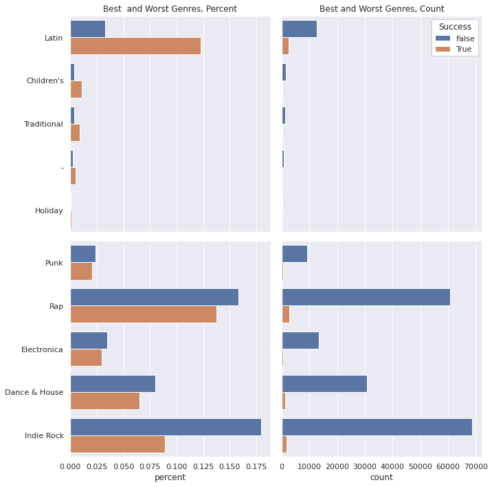
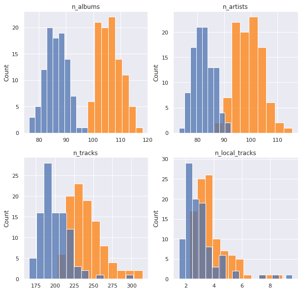

# Data Science Foundations <br> X4: Spotify

**Instructor**: Wesley Beckner

**Contact**: wesleybeckner@gmail.com

---

<br>

Prompt: What makes a playlist successful? 

<br>

---

## Data Description


| Column Name             | Description                                                                                              |
|-------------------------|----------------------------------------------------------------------------------------------------------|
| playlist_uri            | The key, Spotify uri of the playlist                                                                     |
| owner                   | Playlist owner, Spotify username                                                                         |
| streams                 | Number of streams from the playlist today                                                                |
| stream30s               | Number of streams over 30 seconds from playlist today                                                    |
| dau                     | Number of Daily Active Users, i.e. users with a stream over 30 seconds from playlist today               |
| wau                     | Number of Weekly Active Users, i.e. users with a stream over 30 seconds from playlist in past week       |
| mau                     | Number of Monthly Active Users, i.e. users with a stream over 30 seconds from playlist in the past month |
| mau_previous_months     | Number of Monthly Active users in the month prior to this one                                            |
| mau_both_months         | Number of users that were active on the playlist both this and the previous month                        |
| users                   | Number of users streaming (all streams) from this playlist this month                                    |
| skippers                | Number of users who skipped more than 90 percent of their streams today                                  |
| owner_country           | Country of the playlist owner                                                                            |
| n_tracks                | Number of tracks in playlist                                                                             |
| n_local_tracks          | Change in number of tracks on playlist since yesterday                                                   |
| n_artists               | Number of unique artists in playlist                                                                     |
| n_albums                | Number of unique albums in playlist                                                                      |
| monthly_stream30s       | Number of streams over 30 seconds this month                                                             |
| monthly_owner_stream30s | Number of streams over 30 seconds by playlist owner this month                                           |
| tokens                  | List of playlist title tokens, stopwords and punctuation removed                                         |
| genre_1                 | No. 1 Genre by weight of playlist tracks, from Gracenote metadata                                        |
| genre_2                 | No. 2 Genre by weight of playlist tracks, from Gracenote metadata                                        |
| genre_3                 | No. 3 Genre by weight of playlist tracks, from Gracenote metadata                                        |
| mood_1                  | No. 1 Mood by weight of playlist tracks, from Gracenote metadata                                         |
| mood_2                  | No. 2 Mood by weight of playlist tracks, from Gracenote metadata                                         |
| mood_3                  | No. 3 Mood by weight of playlist tracks, from Gracenote metadata                                         |

## Imports


```python
# basic packages
import pandas as pd
pd.set_option('display.max_columns', 500)
import numpy as np
import random
import copy

# visualization packages
import matplotlib.pyplot as plt
import plotly.express as px
import seaborn as sns; sns.set()
import graphviz 

# stats packages
import scipy.stats as stats
from scipy.spatial.distance import cdist
import statsmodels.api as sm
from statsmodels.formula.api import ols
from statsmodels.discrete.discrete_model import Logit
from statsmodels.stats.outliers_influence import variance_inflation_factor

# sklearn preprocessing
from sklearn.preprocessing import OneHotEncoder, StandardScaler, PolynomialFeatures
from sklearn.decomposition import PCA
from sklearn.impute import SimpleImputer
from sklearn.model_selection import train_test_split
from sklearn.pipeline import make_pipeline
from sklearn.utils.class_weight import compute_class_weight

# sklearn modeling
from sklearn.neighbors import KNeighborsRegressor
from sklearn.ensemble import RandomForestClassifier, RandomForestRegressor, AdaBoostClassifier, GradientBoostingClassifier
from sklearn.linear_model import LinearRegression, LogisticRegression
from sklearn.mixture import GaussianMixture

# sklearn evaluation
from sklearn.metrics import mean_squared_error, r2_score, accuracy_score, classification_report, confusion_matrix
from sklearn.model_selection import GridSearchCV, cross_val_score

```


```python
df = pd.read_csv("../../data/playlist_summary_external-4.txt", delimiter='\t')
```

## Dependency


```python
sub_targets = ['mau_previous_month', 'mau_both_months', 'monthly_stream30s', 'stream30s']
# sub_targets = ['mau', 'dau', 'monthly_stream30s', 'stream30s']

des_features = ['mood_1', 'mood_2', 'mood_3', 'genre_1', 'genre_2', 'genre_3']
con_features = ['n_albums', 'n_artists', 'n_tracks', 'n_local_tracks']
df['success'] = df[sub_targets].apply(lambda x: x > np.quantile(x, 0.75)).all(axis=1)

df['listen_conversions'] = df['stream30s'] / df['streams']
df['listen_conversions'].fillna(value=0, inplace=True)

df['user_retention'] = df['mau_both_months'] / df['mau_previous_month']
df['user_retention'].fillna(value=0, inplace=True)

df['user_conversions'] = df['mau'] / df['users']
df['user_conversions'].fillna(value=0, inplace=True)


df['mau_growing'] = df['mau'] > df['mau_previous_month']
df['mau_growth'] = df['mau'] / df['mau_previous_month']
df['mau_growth'].fillna(value=0, inplace=True)
df['mau_growth'].replace([np.inf, -np.inf], 1, inplace=True)

new_metrics = ['listen_conversions', 'user_conversions', 'user_retention', 'mau_growth']

df['new_success'] = df[new_metrics].apply(lambda x: (x > 0.5) if (max(x) == 1) else (x > 1)).all(axis=1)
```

### Discrete


```python
fig, ax = plt.subplots(1, 2, figsize=(10,10))

dff = pd.DataFrame(df[des_features[0]].value_counts()).join(
    pd.DataFrame(df[des_features[1]].value_counts())).join(
    pd.DataFrame(df[des_features[2]].value_counts()))
dff = dff.reset_index().melt(id_vars='index')
dff.columns = ['mood', 'order', 'count']
sns.barplot(data=dff, hue='order', y='mood', x='count', orient='h', ax=ax[0])

dff = pd.DataFrame(df[des_features[3]].value_counts()).join(
    pd.DataFrame(df[des_features[4]].value_counts())).join(
    pd.DataFrame(df[des_features[5]].value_counts()))
dff = dff.reset_index().melt(id_vars='index')
dff.columns = ['genre', 'order', 'count']
sns.barplot(data=dff, hue='order', y='genre', x='count', orient='h', ax=ax[1])

plt.tight_layout()
fig.savefig("discrete_rank_bar_plot.svg")
```


    

    


```python
def make_chisum(target='success'):
    
    chidf = pd.DataFrame()
    chidf[target] = df[target]
    chisum = pd.DataFrame()
    cutoff = 0.01
    pop = chidf[target].values

    for ind in des_features:
        chidf[ind] = df[ind]

        for grp_label in df[ind].unique():
            try:
                cTable = chidf.groupby(chidf[ind] == grp_label)[target].value_counts().values.reshape(2,2).T
                chi2, p, dof, ex = stats.chi2_contingency(cTable, correction=True, lambda_=None)
                ratio = cTable[1]/cTable[0]
                pos = ratio[1]/ratio[0]
                chisum = pd.concat([chisum, pd.DataFrame([[ind, grp_label, chi2, p, cTable, pos, p<cutoff]])])
            except:
                pass

    chisum.columns = ['feature', 'group', 'chi', 'p-value', 'cTable', 'multiplier', 'reject null']
    chisum = chisum.sort_values('p-value').reset_index(drop=True)
    
    return chisum

def make_cat_plots(target='success', ind_feature='genre_1'):
    fig, ax = plt.subplots(2, 2, figsize=(10,10), sharex='col', sharey='row')


    genre_list = chisum.loc[(chisum['feature'] == ind_feature)
                           & (chisum['reject null'] == True)].sort_values('multiplier', ascending=False)['group'].values

    dff = pd.DataFrame(df.groupby([ind_feature])[target].value_counts(sort=False))
    dff.columns = ['percent']
    dff = dff.reset_index()
    dff.loc[dff[target] == True, 'percent'] = dff.loc[dff[target] == True, 'percent'] / dff.loc[dff[target] == True, 'percent'].sum() 
    dff.loc[dff[target] == False, 'percent'] = dff.loc[dff[target] == False, 'percent'] / dff.loc[dff[target] == False, 'percent'].sum() 
    dff = dff.set_index(ind_feature).loc[genre_list,:]
    dff = dff.reset_index()

    sns.barplot(data=dff.iloc[:10,:], hue=target, y=ind_feature, x='percent', ax=ax[0,0])
    ax[0,0].set_title('Best  and Worst Genres, Percent')
    ax[0,0].set_ylabel('')
    ax[0,0].set_xlabel('')
    sns.barplot(data=dff.iloc[-10:,:], hue=target, y=ind_feature, x='percent', ax=ax[1,0])
    ax[1,0].set_ylabel('')

    dff = pd.DataFrame(df.groupby([ind_feature])[target].value_counts(sort=False))
    dff.columns = ['count']
    dff = dff.reset_index()
    dff = dff.set_index(ind_feature).loc[genre_list,:]
    dff = dff.reset_index()

    sns.barplot(data=dff.iloc[:10,:], hue=target, y=ind_feature, x='count', ax=ax[0,1])
    ax[0,1].set_title('Best and Worst Genres, Count')
    ax[0,1].set_ylabel('')
    ax[0,1].set_xlabel('')
    sns.barplot(data=dff.iloc[-10:,:], hue=target, y=ind_feature, x='count', ax=ax[1,1])
    ax[1,1].set_ylabel('')
    plt.tight_layout()

    ax[0,0].get_legend().remove()
    ax[1,1].get_legend().remove()
    ax[1,0].get_legend().remove()
    ax[0,1].legend(framealpha=1, facecolor='white', title="Success")
    
    return fig
```


```python
ind_feature = 'genre_1'
target = 'success'

chisum = make_chisum(target)
fig = make_cat_plots(target, ind_feature)

chisum.loc[(chisum['feature'] == ind_feature)
        & (chisum['reject null'] == True)].sort_values('multiplier', 
           ascending=False).to_excel(f'{target}_{ind_feature}_categorical.xlsx')

fig.savefig(f"{target}_{ind_feature}_categorical.svg")
```


    

    


```python
ind_feature = 'mood_1'
target = 'success'

chisum = make_chisum(target)
fig = make_cat_plots(target, ind_feature)

chisum.loc[(chisum['feature'] == ind_feature)
        & (chisum['reject null'] == True)].sort_values('multiplier', 
           ascending=False).to_excel(f'{target}_{ind_feature}_categorical.xlsx')

fig.savefig(f"{target}_{ind_feature}_categorical.svg")
```


    

    


### Continuous


```python
def make_con_plots(target, con_features):
    fig, ((ax1, ax2),(ax3, ax4)) = plt.subplots(2,2, figsize=(10,10))
    chidf = pd.DataFrame()
    chidf[target] = df[target]
    welchsum = pd.DataFrame()
    cutoff = 0.01
    pop = chidf[target].values

    for ind, ax in zip(con_features, [ax1, ax2, ax3, ax4]):
        chidf[ind] = df[ind]
        a = []
        b = []
        for i in range(100):
            boot1 = random.sample(
                        list(
                            chidf.loc[
                                (chidf[target] == True)
                            ][ind].values),
                        k=1000)
            boot2 = random.sample(
                        list(
                            chidf.loc[
                                (chidf[target] == False)
                            ][ind].values),
                        k=1000)
            a.append(np.mean(boot1))
            b.append(np.mean(boot2))
        testt, p = stats.ttest_ind(a, b, equal_var=False)
        a_avg = np.mean(a)
        b_avg = np.mean(b)
        welchsum = pd.concat([welchsum, pd.DataFrame([[ind, testt, p, a_avg, b_avg, p<cutoff]])])
        sns.histplot(a, color='tab:orange', label=f"{target} == True", ax=ax)
        sns.histplot(b, label=f"{target} == False", ax=ax)
        ax.set_title(ind)

    welchsum.columns = ['feature', 'test stat', 'p-value', 'upper q avg', 'lower q avg', 'reject null']
    welchsum = welchsum.sort_values('p-value').reset_index(drop=True)
    ax.legend()
    
    return fig, welchsum
```


```python
target = 'new_success'

fig, welchsum = make_con_plots(target, con_features)

welchsum.to_excel(f"{target}_continuous.xlsx")
fig.savefig(f"{target}_ttest.svg")
```


    

    


## Models

### Logistic Regression


```python
### y
target = "success"
print(target)
y = df[target].values

#### X
X = df[des_features + con_features]
enc = OneHotEncoder()
std = StandardScaler()
X_cat = enc.fit_transform(X[des_features]).toarray()
X_con = std.fit_transform(X[con_features])
X = np.hstack((np.ones((X_con.shape[0], 1)), X_con, X_cat))
feature_names = ['intercept'] + con_features + list(enc.get_feature_names_out())

data = pd.DataFrame(X, columns=feature_names)
```

    success


```python
def add_feature(feature_names, basemodel, data, y, r2max=0, model='linear', disp=0):
    feature_max = None
    bestsum = None
    newmodel = None
    for feature in feature_names:
        basemodel[feature] = data[feature]
        X2 = basemodel.values
        est = Logit(y, X2)
        est2 = est.fit(disp=0)
        summ = est2.summary()
        score = float(str(pd.DataFrame(summ.tables[0]).loc[3, 3]))
        if (score > r2max) and not (est2.pvalues > cutoff).any():
            r2max = score
            feature_max = feature
            bestsum = est2.summary()
            newmodel = basemodel.copy()
            if disp == 1:
                print(f"new r2max, {feature_max}, {r2max}")
        basemodel.drop(labels = feature, axis = 1, inplace = True)
    return r2max, feature_max, bestsum, newmodel
```


```python
candidates = feature_names.copy()
basemodel = pd.DataFrame()
r2max = 0
```


```python
while True:
    newr2max, feature_max, bestsum, newmodel = add_feature(
        feature_names=candidates, 
        basemodel=basemodel, 
        data=data, 
        y=y,
        r2max=r2max)    
    if newr2max > r2max:
        r2max = newr2max
        print(f"new r2max, {feature_max}, {r2max}")
        with open("success_fwd_selection_results.txt", "a+") as f:
            file_data = f.read()
            f.write(f"new r2max, {feature_max}, {r2max}\n")
        candidates.remove(feature_max)
        with open("success_canidates.txt", "w+") as f:
            file_data = f.read()
            for i in candidates:
                f.write(f"{i}\n")
        basemodel = newmodel
        basemodel.to_csv("success_basemodel.csv")
        continue
    else:
        break
```


```python
basemodel = pd.read_csv("success_basemodel.csv", index_col = 0)
X2 = basemodel.values
est = Logit(y, X2)
est2 = est.fit(disp=0)
summ = est2.summary()

res_table = summ.tables[1]
res_df = pd.DataFrame(res_table.data)
cols = res_df.iloc[0]
cols = [str(i) for i in cols]
res_df.drop(0, axis=0, inplace=True)
res_df.set_index(0, inplace=True)
res_df.columns = cols[1:]
res_df.index = basemodel.columns
display(res_df)
res_df.to_excel("success_log.xlsx")
```


```python
### y
target = "monthly_stream30s"
print(target)
y = df[target].values
labels = y.copy()
names = []
weights = y.copy()
weights.dtype = 'float'
lim = 11
dom_class_weight = 1 / (lim - 1 - 1)
for idx, quant in zip(range(lim), np.linspace(0, 1, num=lim)):
    if idx < lim - 2:
        prev = quant
        continue
    elif idx == lim - 2:
        weights[y <= np.quantile(y, quant)] = dom_class_weight
        labels[labels <= np.quantile(y, quant)] = 0
        names += [f"less than {np.quantile(y, quant):.0f} listens"]
        
    else:
        labels[(labels > np.quantile(y, prev))
              & (labels <= np.quantile(y, quant))] = 1
        weights[(y > np.quantile(y, prev))
              & (y <= np.quantile(y, quant))] = 1.0
        names += [f"{np.quantile(y, prev):.0f} < listens <= {np.quantile(y, quant):.0f}"]
    prev = quant
y = labels

basemodel = pd.read_csv("../../scripts/basemodel.csv", index_col = 0)
X2 = basemodel.values
est = Logit(y, X2)
est2 = est.fit(disp=0)
summ = est2.summary()

res_table = summ.tables[1]
res_df = pd.DataFrame(res_table.data)
cols = res_df.iloc[0]
cols = [str(i) for i in cols]
res_df.drop(0, axis=0, inplace=True)
res_df.set_index(0, inplace=True)
res_df.columns = cols[1:]
res_df.index = basemodel.columns
display(res_df)
res_df.to_excel("log_model_monthly_stream30s.xlsx")
```

    monthly_stream30s


<div>
<style scoped>
    .dataframe tbody tr th:only-of-type {
        vertical-align: middle;
    }

    .dataframe tbody tr th {
        vertical-align: top;
    }

    .dataframe thead th {
        text-align: right;
    }
</style>
<table border="1" class="dataframe">
  <thead>
    <tr style="text-align: right;">
      <th></th>
      <th>coef</th>
      <th>std err</th>
      <th>z</th>
      <th>P&gt;|z|</th>
      <th>[0.025</th>
      <th>0.975]</th>
    </tr>
  </thead>
  <tbody>
    <tr>
      <th>intercept</th>
      <td>-2.0737</td>
      <td>0.016</td>
      <td>-133.150</td>
      <td>0.000</td>
      <td>-2.104</td>
      <td>-2.043</td>
    </tr>
    <tr>
      <th>n_albums</th>
      <td>0.2656</td>
      <td>0.012</td>
      <td>21.287</td>
      <td>0.000</td>
      <td>0.241</td>
      <td>0.290</td>
    </tr>
    <tr>
      <th>genre_1_Latin</th>
      <td>0.5408</td>
      <td>0.027</td>
      <td>19.906</td>
      <td>0.000</td>
      <td>0.488</td>
      <td>0.594</td>
    </tr>
    <tr>
      <th>genre_1_Indie Rock</th>
      <td>-0.5832</td>
      <td>0.020</td>
      <td>-28.964</td>
      <td>0.000</td>
      <td>-0.623</td>
      <td>-0.544</td>
    </tr>
    <tr>
      <th>genre_1_Rap</th>
      <td>-0.3259</td>
      <td>0.020</td>
      <td>-16.697</td>
      <td>0.000</td>
      <td>-0.364</td>
      <td>-0.288</td>
    </tr>
    <tr>
      <th>genre_1_Dance &amp; House</th>
      <td>-0.3034</td>
      <td>0.027</td>
      <td>-11.069</td>
      <td>0.000</td>
      <td>-0.357</td>
      <td>-0.250</td>
    </tr>
    <tr>
      <th>genre_1_Rock</th>
      <td>-0.4226</td>
      <td>0.025</td>
      <td>-16.996</td>
      <td>0.000</td>
      <td>-0.471</td>
      <td>-0.374</td>
    </tr>
    <tr>
      <th>mood_1_Energizing</th>
      <td>-0.2844</td>
      <td>0.027</td>
      <td>-10.670</td>
      <td>0.000</td>
      <td>-0.337</td>
      <td>-0.232</td>
    </tr>
    <tr>
      <th>genre_1_Children's</th>
      <td>0.7845</td>
      <td>0.062</td>
      <td>12.608</td>
      <td>0.000</td>
      <td>0.663</td>
      <td>0.906</td>
    </tr>
    <tr>
      <th>mood_1_Tender</th>
      <td>0.4943</td>
      <td>0.055</td>
      <td>9.032</td>
      <td>0.000</td>
      <td>0.387</td>
      <td>0.602</td>
    </tr>
    <tr>
      <th>mood_1_Other</th>
      <td>0.6206</td>
      <td>0.074</td>
      <td>8.413</td>
      <td>0.000</td>
      <td>0.476</td>
      <td>0.765</td>
    </tr>
    <tr>
      <th>n_tracks</th>
      <td>0.0462</td>
      <td>0.006</td>
      <td>7.613</td>
      <td>0.000</td>
      <td>0.034</td>
      <td>0.058</td>
    </tr>
    <tr>
      <th>mood_1_Peaceful</th>
      <td>0.6294</td>
      <td>0.060</td>
      <td>10.426</td>
      <td>0.000</td>
      <td>0.511</td>
      <td>0.748</td>
    </tr>
    <tr>
      <th>mood_1_Romantic</th>
      <td>0.2981</td>
      <td>0.033</td>
      <td>9.038</td>
      <td>0.000</td>
      <td>0.233</td>
      <td>0.363</td>
    </tr>
    <tr>
      <th>genre_1_Electronica</th>
      <td>-0.2326</td>
      <td>0.034</td>
      <td>-6.792</td>
      <td>0.000</td>
      <td>-0.300</td>
      <td>-0.165</td>
    </tr>
    <tr>
      <th>genre_2_Indie Rock</th>
      <td>-0.2050</td>
      <td>0.023</td>
      <td>-8.998</td>
      <td>0.000</td>
      <td>-0.250</td>
      <td>-0.160</td>
    </tr>
    <tr>
      <th>mood_2_Energizing</th>
      <td>-0.1384</td>
      <td>0.019</td>
      <td>-7.421</td>
      <td>0.000</td>
      <td>-0.175</td>
      <td>-0.102</td>
    </tr>
    <tr>
      <th>genre_1_R&amp;B</th>
      <td>-0.2335</td>
      <td>0.030</td>
      <td>-7.696</td>
      <td>0.000</td>
      <td>-0.293</td>
      <td>-0.174</td>
    </tr>
    <tr>
      <th>genre_3_Indie Rock</th>
      <td>-0.2540</td>
      <td>0.024</td>
      <td>-10.792</td>
      <td>0.000</td>
      <td>-0.300</td>
      <td>-0.208</td>
    </tr>
    <tr>
      <th>genre_1_Classical</th>
      <td>-0.5126</td>
      <td>0.060</td>
      <td>-8.609</td>
      <td>0.000</td>
      <td>-0.629</td>
      <td>-0.396</td>
    </tr>
    <tr>
      <th>genre_2_Alternative</th>
      <td>0.1769</td>
      <td>0.019</td>
      <td>9.542</td>
      <td>0.000</td>
      <td>0.141</td>
      <td>0.213</td>
    </tr>
    <tr>
      <th>genre_2_Metal</th>
      <td>0.4257</td>
      <td>0.040</td>
      <td>10.738</td>
      <td>0.000</td>
      <td>0.348</td>
      <td>0.503</td>
    </tr>
    <tr>
      <th>mood_2_Peaceful</th>
      <td>0.3761</td>
      <td>0.055</td>
      <td>6.856</td>
      <td>0.000</td>
      <td>0.269</td>
      <td>0.484</td>
    </tr>
    <tr>
      <th>mood_2_Romantic</th>
      <td>0.2300</td>
      <td>0.031</td>
      <td>7.414</td>
      <td>0.000</td>
      <td>0.169</td>
      <td>0.291</td>
    </tr>
    <tr>
      <th>mood_3_Romantic</th>
      <td>0.2597</td>
      <td>0.031</td>
      <td>8.252</td>
      <td>0.000</td>
      <td>0.198</td>
      <td>0.321</td>
    </tr>
    <tr>
      <th>genre_3_Alternative</th>
      <td>0.0482</td>
      <td>0.019</td>
      <td>2.529</td>
      <td>0.011</td>
      <td>0.011</td>
      <td>0.086</td>
    </tr>
    <tr>
      <th>n_artists</th>
      <td>0.0954</td>
      <td>0.013</td>
      <td>7.464</td>
      <td>0.000</td>
      <td>0.070</td>
      <td>0.120</td>
    </tr>
    <tr>
      <th>genre_1_Metal</th>
      <td>0.4049</td>
      <td>0.042</td>
      <td>9.680</td>
      <td>0.000</td>
      <td>0.323</td>
      <td>0.487</td>
    </tr>
    <tr>
      <th>mood_1_Aggressive</th>
      <td>-0.2660</td>
      <td>0.042</td>
      <td>-6.275</td>
      <td>0.000</td>
      <td>-0.349</td>
      <td>-0.183</td>
    </tr>
    <tr>
      <th>mood_3_Peaceful</th>
      <td>0.2912</td>
      <td>0.058</td>
      <td>4.983</td>
      <td>0.000</td>
      <td>0.177</td>
      <td>0.406</td>
    </tr>
    <tr>
      <th>mood_1_Empowering</th>
      <td>0.1197</td>
      <td>0.021</td>
      <td>5.789</td>
      <td>0.000</td>
      <td>0.079</td>
      <td>0.160</td>
    </tr>
    <tr>
      <th>genre_1_Religious</th>
      <td>-0.2328</td>
      <td>0.033</td>
      <td>-7.154</td>
      <td>0.000</td>
      <td>-0.297</td>
      <td>-0.169</td>
    </tr>
    <tr>
      <th>genre_3_Metal</th>
      <td>0.1978</td>
      <td>0.044</td>
      <td>4.527</td>
      <td>0.000</td>
      <td>0.112</td>
      <td>0.283</td>
    </tr>
    <tr>
      <th>genre_3_R&amp;B</th>
      <td>-0.1897</td>
      <td>0.024</td>
      <td>-8.057</td>
      <td>0.000</td>
      <td>-0.236</td>
      <td>-0.144</td>
    </tr>
    <tr>
      <th>mood_3_Yearning</th>
      <td>0.1176</td>
      <td>0.019</td>
      <td>6.096</td>
      <td>0.000</td>
      <td>0.080</td>
      <td>0.155</td>
    </tr>
    <tr>
      <th>mood_2_-</th>
      <td>0.4272</td>
      <td>0.074</td>
      <td>5.772</td>
      <td>0.000</td>
      <td>0.282</td>
      <td>0.572</td>
    </tr>
    <tr>
      <th>genre_3_Electronica</th>
      <td>-0.1893</td>
      <td>0.026</td>
      <td>-7.408</td>
      <td>0.000</td>
      <td>-0.239</td>
      <td>-0.139</td>
    </tr>
    <tr>
      <th>genre_2_Latin</th>
      <td>0.3700</td>
      <td>0.062</td>
      <td>5.959</td>
      <td>0.000</td>
      <td>0.248</td>
      <td>0.492</td>
    </tr>
    <tr>
      <th>mood_3_Empowering</th>
      <td>0.0909</td>
      <td>0.021</td>
      <td>4.386</td>
      <td>0.000</td>
      <td>0.050</td>
      <td>0.132</td>
    </tr>
    <tr>
      <th>genre_3_-</th>
      <td>-0.1084</td>
      <td>0.021</td>
      <td>-5.104</td>
      <td>0.000</td>
      <td>-0.150</td>
      <td>-0.067</td>
    </tr>
    <tr>
      <th>genre_1_Spoken &amp; Audio</th>
      <td>0.4897</td>
      <td>0.089</td>
      <td>5.489</td>
      <td>0.000</td>
      <td>0.315</td>
      <td>0.665</td>
    </tr>
    <tr>
      <th>genre_2_New Age</th>
      <td>0.3718</td>
      <td>0.067</td>
      <td>5.546</td>
      <td>0.000</td>
      <td>0.240</td>
      <td>0.503</td>
    </tr>
    <tr>
      <th>genre_3_New Age</th>
      <td>0.3384</td>
      <td>0.067</td>
      <td>5.053</td>
      <td>0.000</td>
      <td>0.207</td>
      <td>0.470</td>
    </tr>
    <tr>
      <th>genre_3_Rap</th>
      <td>-0.1484</td>
      <td>0.026</td>
      <td>-5.791</td>
      <td>0.000</td>
      <td>-0.199</td>
      <td>-0.098</td>
    </tr>
    <tr>
      <th>mood_1_Rowdy</th>
      <td>-0.2223</td>
      <td>0.051</td>
      <td>-4.373</td>
      <td>0.000</td>
      <td>-0.322</td>
      <td>-0.123</td>
    </tr>
    <tr>
      <th>mood_2_Rowdy</th>
      <td>-0.1655</td>
      <td>0.039</td>
      <td>-4.267</td>
      <td>0.000</td>
      <td>-0.242</td>
      <td>-0.089</td>
    </tr>
    <tr>
      <th>mood_2_Aggressive</th>
      <td>-0.1323</td>
      <td>0.030</td>
      <td>-4.345</td>
      <td>0.000</td>
      <td>-0.192</td>
      <td>-0.073</td>
    </tr>
    <tr>
      <th>genre_2_Spoken &amp; Audio</th>
      <td>0.3211</td>
      <td>0.068</td>
      <td>4.717</td>
      <td>0.000</td>
      <td>0.188</td>
      <td>0.455</td>
    </tr>
    <tr>
      <th>genre_1_New Age</th>
      <td>0.2391</td>
      <td>0.062</td>
      <td>3.863</td>
      <td>0.000</td>
      <td>0.118</td>
      <td>0.360</td>
    </tr>
    <tr>
      <th>genre_2_Jazz</th>
      <td>0.1958</td>
      <td>0.043</td>
      <td>4.533</td>
      <td>0.000</td>
      <td>0.111</td>
      <td>0.280</td>
    </tr>
    <tr>
      <th>genre_2_Pop</th>
      <td>0.0819</td>
      <td>0.016</td>
      <td>4.999</td>
      <td>0.000</td>
      <td>0.050</td>
      <td>0.114</td>
    </tr>
    <tr>
      <th>genre_3_Rock</th>
      <td>-0.0849</td>
      <td>0.020</td>
      <td>-4.290</td>
      <td>0.000</td>
      <td>-0.124</td>
      <td>-0.046</td>
    </tr>
    <tr>
      <th>mood_1_Cool</th>
      <td>-0.1212</td>
      <td>0.035</td>
      <td>-3.464</td>
      <td>0.001</td>
      <td>-0.190</td>
      <td>-0.053</td>
    </tr>
    <tr>
      <th>mood_1_Gritty</th>
      <td>-0.1494</td>
      <td>0.044</td>
      <td>-3.386</td>
      <td>0.001</td>
      <td>-0.236</td>
      <td>-0.063</td>
    </tr>
    <tr>
      <th>mood_1_Easygoing</th>
      <td>-0.2261</td>
      <td>0.074</td>
      <td>-3.056</td>
      <td>0.002</td>
      <td>-0.371</td>
      <td>-0.081</td>
    </tr>
    <tr>
      <th>genre_3_Dance &amp; House</th>
      <td>-0.0910</td>
      <td>0.025</td>
      <td>-3.595</td>
      <td>0.000</td>
      <td>-0.141</td>
      <td>-0.041</td>
    </tr>
    <tr>
      <th>mood_1_Excited</th>
      <td>0.0583</td>
      <td>0.018</td>
      <td>3.248</td>
      <td>0.001</td>
      <td>0.023</td>
      <td>0.093</td>
    </tr>
  </tbody>
</table>
</div>


```python
summ.tables[0]
```


<table class="simpletable">
<caption>Logit Regression Results</caption>
<tr>
  <th>Dep. Variable:</th>           <td>y</td>        <th>  No. Observations:  </th>   <td>403366</td>   
</tr>
<tr>
  <th>Model:</th>                 <td>Logit</td>      <th>  Df Residuals:      </th>   <td>403309</td>   
</tr>
<tr>
  <th>Method:</th>                 <td>MLE</td>       <th>  Df Model:          </th>   <td>    56</td>   
</tr>
<tr>
  <th>Date:</th>            <td>Sun, 24 Apr 2022</td> <th>  Pseudo R-squ.:     </th>   <td>0.04795</td>  
</tr>
<tr>
  <th>Time:</th>                <td>18:07:32</td>     <th>  Log-Likelihood:    </th> <td>-1.2475e+05</td>
</tr>
<tr>
  <th>converged:</th>             <td>True</td>       <th>  LL-Null:           </th> <td>-1.3104e+05</td>
</tr>
<tr>
  <th>Covariance Type:</th>     <td>nonrobust</td>    <th>  LLR p-value:       </th>   <td> 0.000</td>   
</tr>
</table>


```python
basemodel = pd.read_csv("../../scripts/new_basemodel.csv", index_col = 0)
y = df['new_success']
X2 = basemodel.values
est = Logit(y, X2)
est2 = est.fit(disp=0)
summ = est2.summary()

res_table = summ.tables[1]
res_df = pd.DataFrame(res_table.data)
cols = res_df.iloc[0]
cols = [str(i) for i in cols]
res_df.drop(0, axis=0, inplace=True)
res_df.set_index(0, inplace=True)
res_df.columns = cols[1:]
res_df.index = basemodel.columns
display(res_df)
res_df.to_excel("new_success_log_model.xlsx")
```


<div>
<style scoped>
    .dataframe tbody tr th:only-of-type {
        vertical-align: middle;
    }

    .dataframe tbody tr th {
        vertical-align: top;
    }

    .dataframe thead th {
        text-align: right;
    }
</style>
<table border="1" class="dataframe">
  <thead>
    <tr style="text-align: right;">
      <th></th>
      <th>coef</th>
      <th>std err</th>
      <th>z</th>
      <th>P&gt;|z|</th>
      <th>[0.025</th>
      <th>0.975]</th>
    </tr>
  </thead>
  <tbody>
    <tr>
      <th>intercept</th>
      <td>-2.4336</td>
      <td>0.012</td>
      <td>-201.725</td>
      <td>0.000</td>
      <td>-2.457</td>
      <td>-2.410</td>
    </tr>
    <tr>
      <th>genre_3_-</th>
      <td>-0.6766</td>
      <td>0.025</td>
      <td>-27.158</td>
      <td>0.000</td>
      <td>-0.725</td>
      <td>-0.628</td>
    </tr>
    <tr>
      <th>n_albums</th>
      <td>0.1399</td>
      <td>0.015</td>
      <td>9.597</td>
      <td>0.000</td>
      <td>0.111</td>
      <td>0.169</td>
    </tr>
    <tr>
      <th>genre_1_Indie Rock</th>
      <td>0.2702</td>
      <td>0.016</td>
      <td>17.240</td>
      <td>0.000</td>
      <td>0.240</td>
      <td>0.301</td>
    </tr>
    <tr>
      <th>mood_1_Defiant</th>
      <td>0.2505</td>
      <td>0.018</td>
      <td>14.035</td>
      <td>0.000</td>
      <td>0.215</td>
      <td>0.285</td>
    </tr>
    <tr>
      <th>genre_1_Dance &amp; House</th>
      <td>0.3042</td>
      <td>0.021</td>
      <td>14.388</td>
      <td>0.000</td>
      <td>0.263</td>
      <td>0.346</td>
    </tr>
    <tr>
      <th>mood_1_Excited</th>
      <td>0.1917</td>
      <td>0.017</td>
      <td>11.607</td>
      <td>0.000</td>
      <td>0.159</td>
      <td>0.224</td>
    </tr>
    <tr>
      <th>mood_1_Upbeat</th>
      <td>0.2698</td>
      <td>0.028</td>
      <td>9.713</td>
      <td>0.000</td>
      <td>0.215</td>
      <td>0.324</td>
    </tr>
    <tr>
      <th>genre_2_Indie Rock</th>
      <td>0.1527</td>
      <td>0.019</td>
      <td>7.854</td>
      <td>0.000</td>
      <td>0.115</td>
      <td>0.191</td>
    </tr>
    <tr>
      <th>genre_1_Rap</th>
      <td>0.1876</td>
      <td>0.019</td>
      <td>9.843</td>
      <td>0.000</td>
      <td>0.150</td>
      <td>0.225</td>
    </tr>
    <tr>
      <th>genre_1_Religious</th>
      <td>0.2676</td>
      <td>0.030</td>
      <td>8.877</td>
      <td>0.000</td>
      <td>0.209</td>
      <td>0.327</td>
    </tr>
    <tr>
      <th>mood_2_Romantic</th>
      <td>-0.2858</td>
      <td>0.044</td>
      <td>-6.533</td>
      <td>0.000</td>
      <td>-0.372</td>
      <td>-0.200</td>
    </tr>
    <tr>
      <th>mood_1_Yearning</th>
      <td>0.1965</td>
      <td>0.020</td>
      <td>9.809</td>
      <td>0.000</td>
      <td>0.157</td>
      <td>0.236</td>
    </tr>
    <tr>
      <th>mood_1_Romantic</th>
      <td>-0.2540</td>
      <td>0.045</td>
      <td>-5.620</td>
      <td>0.000</td>
      <td>-0.343</td>
      <td>-0.165</td>
    </tr>
    <tr>
      <th>mood_3_Romantic</th>
      <td>-0.2249</td>
      <td>0.042</td>
      <td>-5.304</td>
      <td>0.000</td>
      <td>-0.308</td>
      <td>-0.142</td>
    </tr>
    <tr>
      <th>mood_1_Other</th>
      <td>-0.6658</td>
      <td>0.134</td>
      <td>-4.954</td>
      <td>0.000</td>
      <td>-0.929</td>
      <td>-0.402</td>
    </tr>
    <tr>
      <th>mood_2_Yearning</th>
      <td>0.1714</td>
      <td>0.019</td>
      <td>9.044</td>
      <td>0.000</td>
      <td>0.134</td>
      <td>0.209</td>
    </tr>
    <tr>
      <th>mood_3_Yearning</th>
      <td>0.1290</td>
      <td>0.019</td>
      <td>6.682</td>
      <td>0.000</td>
      <td>0.091</td>
      <td>0.167</td>
    </tr>
    <tr>
      <th>mood_2_Defiant</th>
      <td>0.1263</td>
      <td>0.019</td>
      <td>6.645</td>
      <td>0.000</td>
      <td>0.089</td>
      <td>0.164</td>
    </tr>
    <tr>
      <th>mood_2_Excited</th>
      <td>0.1043</td>
      <td>0.018</td>
      <td>5.871</td>
      <td>0.000</td>
      <td>0.069</td>
      <td>0.139</td>
    </tr>
    <tr>
      <th>genre_1_Electronica</th>
      <td>0.1490</td>
      <td>0.030</td>
      <td>5.018</td>
      <td>0.000</td>
      <td>0.091</td>
      <td>0.207</td>
    </tr>
    <tr>
      <th>n_artists</th>
      <td>-0.0723</td>
      <td>0.015</td>
      <td>-4.776</td>
      <td>0.000</td>
      <td>-0.102</td>
      <td>-0.043</td>
    </tr>
    <tr>
      <th>mood_3_Urgent</th>
      <td>-0.1036</td>
      <td>0.022</td>
      <td>-4.766</td>
      <td>0.000</td>
      <td>-0.146</td>
      <td>-0.061</td>
    </tr>
  </tbody>
</table>
</div>

