# Data Science Foundations <br> X4: Spotify

**Instructor**: Wesley Beckner

**Contact**: wesleybeckner@gmail.com

---

<br>

Prompt: What makes a playlist successful? 

Deck: [PDF](https://github.com/wesleybeckner/data_science_foundations/raw/main/assets/Spotify%20Final%20Presentation_WAB.pdf)

<br>

---

## What makes a playlist successful?

**Analysis**

* Simple metric (dependent variable)
    * mau_previous_month
    * mau_both_months
    * monthly_stream30s
    * stream30s
* Design metric (dependent variable)
    * 30s listens/tot listens (listen conversions)
    * Users both months/users prev month (user conversions)
    * Best small time performers (less than X total monthly listens + high conversion)
    * Best new user playlist (owner has only 1 popular playlist)
* Define "top"
    * Top 10%
        * mau_previous_month: 9.0
        * mau_both_months: 2.0
        * mau: 9.0
        * monthly_stream30s: 432.0
        * stream30s: 17.0
    * Top 1%
        * mau_previous_month: 130.0
        * mau_both_months: 19.0
        * mau: 143.0
        * monthly_stream30s: 2843.0
        * stream30s: 113.0
* Independent variables
    * moods and genres (categorical)
    * number of tracks, albums, artists, and local tracks (continuous)
        
The analysis will consist of:

1. understand the distribution characteristics of the dependent and independent variables
2. quantify the dependency of the dependent/independent variables for each of the simple and design metrics
    1. chi-square test
    2. bootstrap/t-test

**Key Conclusions**

for the simple metrics, what I define as "popularlity" key genres and moods were **Romantic, Latin, Children's, Lively, Traditional, and Jazz**. Playlists that included these genres/moods had a positive multiplier effect (usually in the vicinicty of 2x more likely) on the key simple metric (i.e. playlists with latin as a primary genre were 2.5x more likely to be in the top 10% of streams longer than 30 seconds)

for the design metrics, what I define as "trendiness" some of the key genres and moods become flipped in comparison to the relationship with popular playlists. In particular, **Dance & House, Indie Rock, and Defiant** rise to the top as labels that push a playlist into the trendy category

| Column Name             | Description                                                                                              |
|-------------------------|----------------------------------------------------------------------------------------------------------|
| playlist_uri            | The key, Spotify uri of the playlist                                                                     |
| owner                   | Playlist owner, Spotify username                                                                         |
| streams                 | Number of streams from the playlist today                                                                |
| stream30s               | Number of streams over 30 seconds from playlist today                                                    |
| dau                     | Number of Daily Active Users, i.e. users with a stream over 30 seconds from playlist today               |
| wau                     | Number of Weekly Active Users, i.e. users with a stream over 30 seconds from playlist in past week       |
| mau                     | Number of Monthly Active Users, i.e. users with a stream over 30 seconds from playlist in the past month |
| mau_previous_months     | Number of Monthly Active users in the month prior to this one                                            |
| mau_both_months         | Number of users that were active on the playlist both this and the previous month                        |
| users                   | Number of users streaming (all streams) from this playlist this month                                    |
| skippers                | Number of users who skipped more than 90 percent of their streams today                                  |
| owner_country           | Country of the playlist owner                                                                            |
| n_tracks                | Number of tracks in playlist                                                                             |
| n_local_tracks          | Change in number of tracks on playlist since yesterday                                                   |
| n_artists               | Number of unique artists in playlist                                                                     |
| n_albums                | Number of unique albums in playlist                                                                      |
| monthly_stream30s       | Number of streams over 30 seconds this month                                                             |
| monthly_owner_stream30s | Number of streams over 30 seconds by playlist owner this month                                           |
| tokens                  | List of playlist title tokens, stopwords and punctuation removed                                         |
| genre_1                 | No. 1 Genre by weight of playlist tracks, from Gracenote metadata                                        |
| genre_2                 | No. 2 Genre by weight of playlist tracks, from Gracenote metadata                                        |
| genre_3                 | No. 3 Genre by weight of playlist tracks, from Gracenote metadata                                        |
| mood_1                  | No. 1 Mood by weight of playlist tracks, from Gracenote metadata                                         |
| mood_2                  | No. 2 Mood by weight of playlist tracks, from Gracenote metadata                                         |
| mood_3                  | No. 3 Mood by weight of playlist tracks, from Gracenote metadata                                         |

## Imports


```python
# basic packages
import pandas as pd
pd.set_option('display.max_columns', 500)
import numpy as np
import random
import copy

# visualization packages
import matplotlib.pyplot as plt
import plotly.express as px
import seaborn as sns; sns.set()
import graphviz 

# stats packages
import scipy.stats as stats
from scipy.spatial.distance import cdist
import statsmodels.api as sm
from statsmodels.formula.api import ols
from statsmodels.discrete.discrete_model import Logit
from statsmodels.stats.outliers_influence import variance_inflation_factor

# sklearn preprocessing
from sklearn.preprocessing import OneHotEncoder, StandardScaler, PolynomialFeatures
from sklearn.decomposition import PCA
from sklearn.impute import SimpleImputer
from sklearn.model_selection import train_test_split
from sklearn.pipeline import make_pipeline
from sklearn.utils.class_weight import compute_class_weight

# sklearn modeling
from sklearn.neighbors import KNeighborsRegressor
from sklearn.ensemble import RandomForestClassifier, RandomForestRegressor, AdaBoostClassifier, GradientBoostingClassifier
from sklearn.linear_model import LinearRegression, LogisticRegression
from sklearn.mixture import GaussianMixture

# sklearn evaluation
from sklearn.metrics import mean_squared_error, r2_score, accuracy_score, classification_report, confusion_matrix
from sklearn.model_selection import GridSearchCV, cross_val_score

```


```python
df = pd.read_csv("../../data/playlist_summary_external-4.txt", delimiter='\t')
```


```python
df.head()
```


<div>
<style scoped>
    .dataframe tbody tr th:only-of-type {
        vertical-align: middle;
    }

    .dataframe tbody tr th {
        vertical-align: top;
    }

    .dataframe thead th {
        text-align: right;
    }
</style>
<table border="1" class="dataframe">
  <thead>
    <tr style="text-align: right;">
      <th></th>
      <th>playlist_uri</th>
      <th>owner</th>
      <th>streams</th>
      <th>stream30s</th>
      <th>dau</th>
      <th>wau</th>
      <th>mau</th>
      <th>mau_previous_month</th>
      <th>mau_both_months</th>
      <th>users</th>
      <th>skippers</th>
      <th>owner_country</th>
      <th>n_tracks</th>
      <th>n_local_tracks</th>
      <th>n_artists</th>
      <th>n_albums</th>
      <th>monthly_stream30s</th>
      <th>monthly_owner_stream30s</th>
      <th>tokens</th>
      <th>genre_1</th>
      <th>genre_2</th>
      <th>genre_3</th>
      <th>mood_1</th>
      <th>mood_2</th>
      <th>mood_3</th>
    </tr>
  </thead>
  <tbody>
    <tr>
      <th>0</th>
      <td>spotify:user:36069af6af076ccd9e597184a67b68c9:...</td>
      <td>36069af6af076ccd9e597184a67b68c9</td>
      <td>27</td>
      <td>27</td>
      <td>1</td>
      <td>1</td>
      <td>3</td>
      <td>3</td>
      <td>0</td>
      <td>8</td>
      <td>0</td>
      <td>US</td>
      <td>52</td>
      <td>0</td>
      <td>4</td>
      <td>7</td>
      <td>30</td>
      <td>27</td>
      <td>["ambient", "music", "therapy", "binaural", "b...</td>
      <td>Dance &amp; House</td>
      <td>New Age</td>
      <td>Country &amp; Folk</td>
      <td>Peaceful</td>
      <td>Romantic</td>
      <td>Somber</td>
    </tr>
    <tr>
      <th>1</th>
      <td>spotify:user:d1144a65b1c31c5f9f56b94f831124d5:...</td>
      <td>d1144a65b1c31c5f9f56b94f831124d5</td>
      <td>0</td>
      <td>0</td>
      <td>0</td>
      <td>1</td>
      <td>2</td>
      <td>1</td>
      <td>1</td>
      <td>3</td>
      <td>0</td>
      <td>US</td>
      <td>131</td>
      <td>0</td>
      <td>112</td>
      <td>113</td>
      <td>112</td>
      <td>94</td>
      <td>["good", "living"]</td>
      <td>Pop</td>
      <td>Indie Rock</td>
      <td>Alternative</td>
      <td>Excited</td>
      <td>Yearning</td>
      <td>Defiant</td>
    </tr>
    <tr>
      <th>2</th>
      <td>spotify:user:6b7fbed9edd6418ddd3b555bba441536:...</td>
      <td>6b7fbed9edd6418ddd3b555bba441536</td>
      <td>4</td>
      <td>2</td>
      <td>1</td>
      <td>1</td>
      <td>7</td>
      <td>5</td>
      <td>0</td>
      <td>15</td>
      <td>0</td>
      <td>US</td>
      <td>43</td>
      <td>0</td>
      <td>35</td>
      <td>36</td>
      <td>63</td>
      <td>0</td>
      <td>["norte\u00f1a"]</td>
      <td>Latin</td>
      <td>-</td>
      <td>-</td>
      <td>Lively</td>
      <td>Upbeat</td>
      <td>Romantic</td>
    </tr>
    <tr>
      <th>3</th>
      <td>spotify:user:580b98725077a94c3c8d01d07390426b:...</td>
      <td>580b98725077a94c3c8d01d07390426b</td>
      <td>12</td>
      <td>12</td>
      <td>1</td>
      <td>1</td>
      <td>4</td>
      <td>6</td>
      <td>1</td>
      <td>10</td>
      <td>0</td>
      <td>US</td>
      <td>27</td>
      <td>1</td>
      <td>27</td>
      <td>26</td>
      <td>154</td>
      <td>108</td>
      <td>[]</td>
      <td>Dance &amp; House</td>
      <td>Electronica</td>
      <td>Pop</td>
      <td>Excited</td>
      <td>Aggressive</td>
      <td>Defiant</td>
    </tr>
    <tr>
      <th>4</th>
      <td>spotify:user:1305d39070c95d161cc502e15014897d:...</td>
      <td>1305d39070c95d161cc502e15014897d</td>
      <td>20</td>
      <td>4</td>
      <td>1</td>
      <td>1</td>
      <td>2</td>
      <td>1</td>
      <td>1</td>
      <td>2</td>
      <td>1</td>
      <td>US</td>
      <td>52</td>
      <td>0</td>
      <td>47</td>
      <td>51</td>
      <td>230</td>
      <td>0</td>
      <td>["cheesy", "pants"]</td>
      <td>Indie Rock</td>
      <td>Alternative</td>
      <td>Electronica</td>
      <td>Excited</td>
      <td>Defiant</td>
      <td>Yearning</td>
    </tr>
  </tbody>
</table>
</div>


```python
df.tail()
```


<div>
<style scoped>
    .dataframe tbody tr th:only-of-type {
        vertical-align: middle;
    }

    .dataframe tbody tr th {
        vertical-align: top;
    }

    .dataframe thead th {
        text-align: right;
    }
</style>
<table border="1" class="dataframe">
  <thead>
    <tr style="text-align: right;">
      <th></th>
      <th>playlist_uri</th>
      <th>owner</th>
      <th>streams</th>
      <th>stream30s</th>
      <th>dau</th>
      <th>wau</th>
      <th>mau</th>
      <th>mau_previous_month</th>
      <th>mau_both_months</th>
      <th>users</th>
      <th>skippers</th>
      <th>owner_country</th>
      <th>n_tracks</th>
      <th>n_local_tracks</th>
      <th>n_artists</th>
      <th>n_albums</th>
      <th>monthly_stream30s</th>
      <th>monthly_owner_stream30s</th>
      <th>tokens</th>
      <th>genre_1</th>
      <th>genre_2</th>
      <th>genre_3</th>
      <th>mood_1</th>
      <th>mood_2</th>
      <th>mood_3</th>
    </tr>
  </thead>
  <tbody>
    <tr>
      <th>403361</th>
      <td>spotify:user:4672952d42bdd93b9215ce9a40394ea6:...</td>
      <td>4672952d42bdd93b9215ce9a40394ea6</td>
      <td>18</td>
      <td>6</td>
      <td>2</td>
      <td>6</td>
      <td>13</td>
      <td>12</td>
      <td>8</td>
      <td>20</td>
      <td>1</td>
      <td>US</td>
      <td>48</td>
      <td>0</td>
      <td>44</td>
      <td>48</td>
      <td>464</td>
      <td>43</td>
      <td>["discover", "mix"]</td>
      <td>Indie Rock</td>
      <td>Alternative</td>
      <td>Dance &amp; House</td>
      <td>Excited</td>
      <td>Yearning</td>
      <td>Energizing</td>
    </tr>
    <tr>
      <th>403362</th>
      <td>spotify:user:28c4378e099b4843f5dd42bb848c78ea:...</td>
      <td>28c4378e099b4843f5dd42bb848c78ea</td>
      <td>0</td>
      <td>0</td>
      <td>0</td>
      <td>0</td>
      <td>2</td>
      <td>1</td>
      <td>1</td>
      <td>3</td>
      <td>0</td>
      <td>US</td>
      <td>182</td>
      <td>27</td>
      <td>114</td>
      <td>129</td>
      <td>44</td>
      <td>14</td>
      <td>["ambient", "study", "music"]</td>
      <td>Electronica</td>
      <td>Dance &amp; House</td>
      <td>Rap</td>
      <td>Sensual</td>
      <td>Excited</td>
      <td>Brooding</td>
    </tr>
    <tr>
      <th>403363</th>
      <td>spotify:user:1c54302dc7e610a10c51eed81e26a168:...</td>
      <td>1c54302dc7e610a10c51eed81e26a168</td>
      <td>0</td>
      <td>0</td>
      <td>0</td>
      <td>2</td>
      <td>2</td>
      <td>0</td>
      <td>0</td>
      <td>2</td>
      <td>0</td>
      <td>US</td>
      <td>36</td>
      <td>0</td>
      <td>16</td>
      <td>15</td>
      <td>82</td>
      <td>80</td>
      <td>["october"]</td>
      <td>Rap</td>
      <td>Indie Rock</td>
      <td>Alternative</td>
      <td>Brooding</td>
      <td>Defiant</td>
      <td>Sophisticated</td>
    </tr>
    <tr>
      <th>403364</th>
      <td>spotify:user:adc973443cdf1abecdfb4244e530d451:...</td>
      <td>adc973443cdf1abecdfb4244e530d451</td>
      <td>0</td>
      <td>0</td>
      <td>0</td>
      <td>0</td>
      <td>2</td>
      <td>0</td>
      <td>0</td>
      <td>2</td>
      <td>0</td>
      <td>US</td>
      <td>50</td>
      <td>0</td>
      <td>25</td>
      <td>25</td>
      <td>2</td>
      <td>0</td>
      <td>[]</td>
      <td>Rap</td>
      <td>R&amp;B</td>
      <td>Latin</td>
      <td>Defiant</td>
      <td>Energizing</td>
      <td>Aggressive</td>
    </tr>
    <tr>
      <th>403365</th>
      <td>spotify:user:b3752c94e387192b7950b687453bcf45:...</td>
      <td>b3752c94e387192b7950b687453bcf45</td>
      <td>74</td>
      <td>16</td>
      <td>1</td>
      <td>1</td>
      <td>2</td>
      <td>1</td>
      <td>1</td>
      <td>3</td>
      <td>1</td>
      <td>US</td>
      <td>348</td>
      <td>10</td>
      <td>281</td>
      <td>290</td>
      <td>216</td>
      <td>178</td>
      <td>["eclecticism"]</td>
      <td>Rap</td>
      <td>Rock</td>
      <td>Alternative</td>
      <td>Defiant</td>
      <td>Energizing</td>
      <td>Cool</td>
    </tr>
  </tbody>
</table>
</div>


```python
df.sort_values('users', ascending=False).head()
```


<div>
<style scoped>
    .dataframe tbody tr th:only-of-type {
        vertical-align: middle;
    }

    .dataframe tbody tr th {
        vertical-align: top;
    }

    .dataframe thead th {
        text-align: right;
    }
</style>
<table border="1" class="dataframe">
  <thead>
    <tr style="text-align: right;">
      <th></th>
      <th>playlist_uri</th>
      <th>owner</th>
      <th>streams</th>
      <th>stream30s</th>
      <th>dau</th>
      <th>wau</th>
      <th>mau</th>
      <th>mau_previous_month</th>
      <th>mau_both_months</th>
      <th>users</th>
      <th>skippers</th>
      <th>owner_country</th>
      <th>n_tracks</th>
      <th>n_local_tracks</th>
      <th>n_artists</th>
      <th>n_albums</th>
      <th>monthly_stream30s</th>
      <th>monthly_owner_stream30s</th>
      <th>tokens</th>
      <th>genre_1</th>
      <th>genre_2</th>
      <th>genre_3</th>
      <th>mood_1</th>
      <th>mood_2</th>
      <th>mood_3</th>
    </tr>
  </thead>
  <tbody>
    <tr>
      <th>152032</th>
      <td>spotify:user:spotify:playlist:5FJXhjdILmRA2z5b...</td>
      <td>spotify</td>
      <td>2527075</td>
      <td>1461324</td>
      <td>152929</td>
      <td>669966</td>
      <td>1944150</td>
      <td>1478684</td>
      <td>578391</td>
      <td>3455406</td>
      <td>86162</td>
      <td>US</td>
      <td>51</td>
      <td>0</td>
      <td>51</td>
      <td>51</td>
      <td>42497334</td>
      <td>22</td>
      <td>["top", "hits"]</td>
      <td>Pop</td>
      <td>R&amp;B</td>
      <td>Dance &amp; House</td>
      <td>Excited</td>
      <td>Cool</td>
      <td>Brooding</td>
    </tr>
    <tr>
      <th>163726</th>
      <td>spotify:user:spotify:playlist:4hOKQuZbraPDIfaG...</td>
      <td>spotify</td>
      <td>2629715</td>
      <td>1513237</td>
      <td>122005</td>
      <td>514627</td>
      <td>1453097</td>
      <td>970905</td>
      <td>364140</td>
      <td>2448881</td>
      <td>56707</td>
      <td>US</td>
      <td>100</td>
      <td>0</td>
      <td>93</td>
      <td>86</td>
      <td>40722305</td>
      <td>0</td>
      <td>["top", "tracks", "currently", "spotify"]</td>
      <td>Pop</td>
      <td>Dance &amp; House</td>
      <td>Indie Rock</td>
      <td>Excited</td>
      <td>Defiant</td>
      <td>Energizing</td>
    </tr>
    <tr>
      <th>216752</th>
      <td>spotify:user:spotify:playlist:3ZgmfR6lsnCwdffZ...</td>
      <td>spotify</td>
      <td>735281</td>
      <td>348391</td>
      <td>43498</td>
      <td>219817</td>
      <td>688999</td>
      <td>365968</td>
      <td>109688</td>
      <td>1233952</td>
      <td>34145</td>
      <td>US</td>
      <td>100</td>
      <td>0</td>
      <td>100</td>
      <td>99</td>
      <td>9879201</td>
      <td>0</td>
      <td>["top", "pop", "tracks", "spotify"]</td>
      <td>Pop</td>
      <td>R&amp;B</td>
      <td>Rap</td>
      <td>Excited</td>
      <td>Defiant</td>
      <td>Empowering</td>
    </tr>
    <tr>
      <th>401060</th>
      <td>spotify:user:spotify:playlist:3MlpudZs4HT3i0yG...</td>
      <td>spotify</td>
      <td>505876</td>
      <td>245377</td>
      <td>33152</td>
      <td>121173</td>
      <td>430129</td>
      <td>339921</td>
      <td>79443</td>
      <td>973788</td>
      <td>23846</td>
      <td>US</td>
      <td>43</td>
      <td>0</td>
      <td>41</td>
      <td>42</td>
      <td>5567649</td>
      <td>44</td>
      <td>["teen", "party"]</td>
      <td>Pop</td>
      <td>R&amp;B</td>
      <td>Rap</td>
      <td>Excited</td>
      <td>Yearning</td>
      <td>Urgent</td>
    </tr>
    <tr>
      <th>307283</th>
      <td>spotify:user:spotify:playlist:04MJzJlzOoy5bTyt...</td>
      <td>spotify</td>
      <td>252309</td>
      <td>124903</td>
      <td>16480</td>
      <td>68518</td>
      <td>278966</td>
      <td>448102</td>
      <td>75371</td>
      <td>917174</td>
      <td>11888</td>
      <td>US</td>
      <td>296</td>
      <td>0</td>
      <td>1</td>
      <td>1</td>
      <td>4178965</td>
      <td>8</td>
      <td>["dance", "mega", "mix"]</td>
      <td>Dance &amp; House</td>
      <td>Electronica</td>
      <td>Pop</td>
      <td>Excited</td>
      <td>Aggressive</td>
      <td>Energizing</td>
    </tr>
  </tbody>
</table>
</div>


```python
df.iloc[403361,0]
```


    'spotify:user:4672952d42bdd93b9215ce9a40394ea6:playlist:6W45lqDBZ1TKma71Uu2F5x'


```python
df.columns
```


    Index(['playlist_uri', 'owner', 'streams', 'stream30s', 'dau', 'wau', 'mau',
           'mau_previous_month', 'mau_both_months', 'users', 'skippers',
           'owner_country', 'n_tracks', 'n_local_tracks', 'n_artists', 'n_albums',
           'monthly_stream30s', 'monthly_owner_stream30s', 'tokens', 'genre_1',
           'genre_2', 'genre_3', 'mood_1', 'mood_2', 'mood_3'],
          dtype='object')


```python
id = [df.columns[0], df.columns[1]]
targets = list(df.columns[2:11]) + ["monthly_stream30s", "monthly_owner_stream30s"]
features = set(df.columns) - set(targets) - set(id)
features = list(features)

print(f"id columns: {id}")
print(f"target columns: {targets}")
print(f"feature columns: {features}")
```

    id columns: ['playlist_uri', 'owner']
    target columns: ['streams', 'stream30s', 'dau', 'wau', 'mau', 'mau_previous_month', 'mau_both_months', 'users', 'skippers', 'monthly_stream30s', 'monthly_owner_stream30s']
    feature columns: ['n_albums', 'n_artists', 'mood_1', 'n_tracks', 'mood_3', 'genre_1', 'genre_2', 'genre_3', 'tokens', 'owner_country', 'n_local_tracks', 'mood_2']


`stream30s`, `dau`, `wau`, `mau`, `monthly_stream30s`, `monthly_owner_stream30s`, `mau_previous_months` and `mau_both_months` are all specifically for users who have streamed the playlist for over 30 seconds

Let's make the north star metric

* `mau_previous_month` - tells us how many users have streamed over 30 seconds from the playlist this past month
    * **downside**: since we don't know when the playlist was created, we may falsely label some playlists as having low rate of success

Let's make a guardrail metric

* `mau_both_months` - tells us if the playlist has replay value
    * **downside**: since we don't know when the playlist was created, we don't know at what stage the playlist is in its lifetime, i.e. do users fall off from months 1-2 or months 10-11
    
* `stream30s` - number of streams over 30 seconds today; tells us demand of playlist unormalized by number of users accessing the stream (i.e. some users will stream multiple times)
    * **downside** - a few users can dominate the overall number of listens
    
* `monthly_stream30s` - number of streams over 30 seconds for the month; will give us a longer term comparison between streams
    * **downside** - playlists created at some point in the month will be compared unequally
    
Secondary metric

* `monthly_owner_stream30s` - tells us if the owner or the playlist is significant in making a successful playlist; semi-feature column


```python
sub_targets = ['mau_previous_month', 'mau_both_months',  'mau', 'monthly_stream30s', 'stream30s']
```

## Depenent Variable

it looks like `mau` may be from an incomplete month (comparing the frequency to `mau_previous_months`)


```python
df[targets].corr()
```


<div>
<style scoped>
    .dataframe tbody tr th:only-of-type {
        vertical-align: middle;
    }

    .dataframe tbody tr th {
        vertical-align: top;
    }

    .dataframe thead th {
        text-align: right;
    }
</style>
<table border="1" class="dataframe">
  <thead>
    <tr style="text-align: right;">
      <th></th>
      <th>streams</th>
      <th>stream30s</th>
      <th>dau</th>
      <th>wau</th>
      <th>mau</th>
      <th>mau_previous_month</th>
      <th>mau_both_months</th>
      <th>users</th>
      <th>skippers</th>
      <th>monthly_stream30s</th>
      <th>monthly_owner_stream30s</th>
    </tr>
  </thead>
  <tbody>
    <tr>
      <th>streams</th>
      <td>1.000000</td>
      <td>0.994380</td>
      <td>0.988381</td>
      <td>0.967860</td>
      <td>0.958000</td>
      <td>0.905523</td>
      <td>0.957998</td>
      <td>0.911023</td>
      <td>0.948062</td>
      <td>0.984383</td>
      <td>-0.001338</td>
    </tr>
    <tr>
      <th>stream30s</th>
      <td>0.994380</td>
      <td>1.000000</td>
      <td>0.985062</td>
      <td>0.968307</td>
      <td>0.957810</td>
      <td>0.908967</td>
      <td>0.956223</td>
      <td>0.912391</td>
      <td>0.937712</td>
      <td>0.992060</td>
      <td>-0.000767</td>
    </tr>
    <tr>
      <th>dau</th>
      <td>0.988381</td>
      <td>0.985062</td>
      <td>1.000000</td>
      <td>0.986290</td>
      <td>0.981306</td>
      <td>0.938572</td>
      <td>0.975665</td>
      <td>0.946317</td>
      <td>0.980372</td>
      <td>0.980044</td>
      <td>-0.003330</td>
    </tr>
    <tr>
      <th>wau</th>
      <td>0.967860</td>
      <td>0.968307</td>
      <td>0.986290</td>
      <td>1.000000</td>
      <td>0.995568</td>
      <td>0.957752</td>
      <td>0.974101</td>
      <td>0.970788</td>
      <td>0.976330</td>
      <td>0.978300</td>
      <td>-0.004150</td>
    </tr>
    <tr>
      <th>mau</th>
      <td>0.958000</td>
      <td>0.957810</td>
      <td>0.981306</td>
      <td>0.995568</td>
      <td>1.000000</td>
      <td>0.969613</td>
      <td>0.969983</td>
      <td>0.983961</td>
      <td>0.980052</td>
      <td>0.970658</td>
      <td>-0.004432</td>
    </tr>
    <tr>
      <th>mau_previous_month</th>
      <td>0.905523</td>
      <td>0.908967</td>
      <td>0.938572</td>
      <td>0.957752</td>
      <td>0.969613</td>
      <td>1.000000</td>
      <td>0.954992</td>
      <td>0.990228</td>
      <td>0.943692</td>
      <td>0.931162</td>
      <td>-0.004802</td>
    </tr>
    <tr>
      <th>mau_both_months</th>
      <td>0.957998</td>
      <td>0.956223</td>
      <td>0.975665</td>
      <td>0.974101</td>
      <td>0.969983</td>
      <td>0.954992</td>
      <td>1.000000</td>
      <td>0.942426</td>
      <td>0.951045</td>
      <td>0.971727</td>
      <td>-0.003219</td>
    </tr>
    <tr>
      <th>users</th>
      <td>0.911023</td>
      <td>0.912391</td>
      <td>0.946317</td>
      <td>0.970788</td>
      <td>0.983961</td>
      <td>0.990228</td>
      <td>0.942426</td>
      <td>1.000000</td>
      <td>0.963877</td>
      <td>0.931219</td>
      <td>-0.005115</td>
    </tr>
    <tr>
      <th>skippers</th>
      <td>0.948062</td>
      <td>0.937712</td>
      <td>0.980372</td>
      <td>0.976330</td>
      <td>0.980052</td>
      <td>0.943692</td>
      <td>0.951045</td>
      <td>0.963877</td>
      <td>1.000000</td>
      <td>0.935228</td>
      <td>-0.004150</td>
    </tr>
    <tr>
      <th>monthly_stream30s</th>
      <td>0.984383</td>
      <td>0.992060</td>
      <td>0.980044</td>
      <td>0.978300</td>
      <td>0.970658</td>
      <td>0.931162</td>
      <td>0.971727</td>
      <td>0.931219</td>
      <td>0.935228</td>
      <td>1.000000</td>
      <td>-0.000519</td>
    </tr>
    <tr>
      <th>monthly_owner_stream30s</th>
      <td>-0.001338</td>
      <td>-0.000767</td>
      <td>-0.003330</td>
      <td>-0.004150</td>
      <td>-0.004432</td>
      <td>-0.004802</td>
      <td>-0.003219</td>
      <td>-0.005115</td>
      <td>-0.004150</td>
      <td>-0.000519</td>
      <td>1.000000</td>
    </tr>
  </tbody>
</table>
</div>


```python
df.plot(x='mau', y='mau_previous_month', ls='', marker='.')
```


    <AxesSubplot:xlabel='mau'>


    

    


```python
df.plot(x='mau', y='dau', ls='', marker='.')
```


    <AxesSubplot:xlabel='mau'>


    

    


```python
df.plot(x='mau', y='wau', ls='', marker='.')
```


    <AxesSubplot:xlabel='mau'>


    

    


```python
df.plot(x='mau', y='stream30s', ls='', marker='.')
```


    <AxesSubplot:xlabel='mau'>


    

    


```python
df.plot(x='stream30s', y='monthly_owner_stream30s', ls='', marker='.')
```


    <AxesSubplot:xlabel='stream30s'>


    

    


```python
df.plot(x='stream30s', y='skippers', ls='', marker='.')
```


    <AxesSubplot:xlabel='stream30s'>


    

    


```python

```


```python
quant = 0.99
for target in targets:
    cutoff = np.quantile(df[target], quant)
    y = df.loc[df[target] < cutoff]
    y.plot(kind='hist', y=target, bins=100)
```


    

    


    

    


    
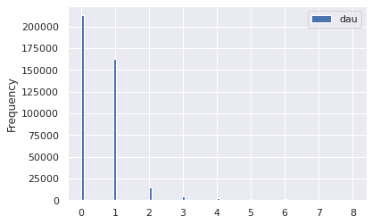
    


    

    


    

    


    

    


    

    


    

    


    

    


    

    


    

    


```python
quant = 0.997
for target in sub_targets:
    cutoff = np.quantile(df[target], quant)
    y = df.loc[df[target] < cutoff]
    removed = df.loc[~(df[target] < cutoff)]
    print(f"removed items: {removed.shape[0]}")
    y.plot(kind='hist', y=target, bins=100)
    plt.show()
```

    removed items: 1212


    

    


    removed items: 1216


    
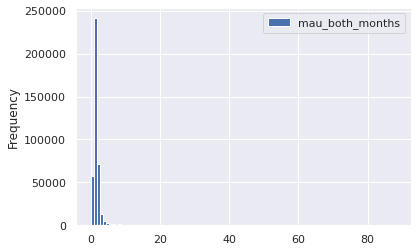
    


    removed items: 1211


    

    


    removed items: 1211


    

    


```python
df[sub_targets].describe()
```


<div>
<style scoped>
    .dataframe tbody tr th:only-of-type {
        vertical-align: middle;
    }

    .dataframe tbody tr th {
        vertical-align: top;
    }

    .dataframe thead th {
        text-align: right;
    }
</style>
<table border="1" class="dataframe">
  <thead>
    <tr style="text-align: right;">
      <th></th>
      <th>mau_previous_month</th>
      <th>mau_both_months</th>
      <th>monthly_stream30s</th>
      <th>stream30s</th>
    </tr>
  </thead>
  <tbody>
    <tr>
      <th>count</th>
      <td>4.033660e+05</td>
      <td>403366.000000</td>
      <td>4.033660e+05</td>
      <td>4.033660e+05</td>
    </tr>
    <tr>
      <th>mean</th>
      <td>5.819009e+01</td>
      <td>12.937065</td>
      <td>1.260489e+03</td>
      <td>4.283333e+01</td>
    </tr>
    <tr>
      <th>std</th>
      <td>3.827248e+03</td>
      <td>1240.912979</td>
      <td>1.062463e+05</td>
      <td>3.772412e+03</td>
    </tr>
    <tr>
      <th>min</th>
      <td>0.000000e+00</td>
      <td>0.000000</td>
      <td>2.000000e+00</td>
      <td>0.000000e+00</td>
    </tr>
    <tr>
      <th>25%</th>
      <td>1.000000e+00</td>
      <td>1.000000</td>
      <td>3.100000e+01</td>
      <td>0.000000e+00</td>
    </tr>
    <tr>
      <th>50%</th>
      <td>2.000000e+00</td>
      <td>1.000000</td>
      <td>7.900000e+01</td>
      <td>0.000000e+00</td>
    </tr>
    <tr>
      <th>75%</th>
      <td>3.000000e+00</td>
      <td>2.000000</td>
      <td>1.930000e+02</td>
      <td>5.000000e+00</td>
    </tr>
    <tr>
      <th>max</th>
      <td>1.478684e+06</td>
      <td>578391.000000</td>
      <td>4.249733e+07</td>
      <td>1.513237e+06</td>
    </tr>
  </tbody>
</table>
</div>


## Independent Variable


```python
features
```


    ['n_albums',
     'n_artists',
     'mood_1',
     'n_tracks',
     'mood_3',
     'genre_1',
     'genre_2',
     'genre_3',
     'tokens',
     'owner_country',
     'n_local_tracks',
     'mood_2']


```python
df[features].head()
```


<div>
<style scoped>
    .dataframe tbody tr th:only-of-type {
        vertical-align: middle;
    }

    .dataframe tbody tr th {
        vertical-align: top;
    }

    .dataframe thead th {
        text-align: right;
    }
</style>
<table border="1" class="dataframe">
  <thead>
    <tr style="text-align: right;">
      <th></th>
      <th>n_albums</th>
      <th>n_artists</th>
      <th>mood_1</th>
      <th>n_tracks</th>
      <th>mood_3</th>
      <th>genre_1</th>
      <th>genre_2</th>
      <th>genre_3</th>
      <th>tokens</th>
      <th>owner_country</th>
      <th>n_local_tracks</th>
      <th>mood_2</th>
    </tr>
  </thead>
  <tbody>
    <tr>
      <th>0</th>
      <td>7</td>
      <td>4</td>
      <td>Peaceful</td>
      <td>52</td>
      <td>Somber</td>
      <td>Dance &amp; House</td>
      <td>New Age</td>
      <td>Country &amp; Folk</td>
      <td>["ambient", "music", "therapy", "binaural", "b...</td>
      <td>US</td>
      <td>0</td>
      <td>Romantic</td>
    </tr>
    <tr>
      <th>1</th>
      <td>113</td>
      <td>112</td>
      <td>Excited</td>
      <td>131</td>
      <td>Defiant</td>
      <td>Pop</td>
      <td>Indie Rock</td>
      <td>Alternative</td>
      <td>["good", "living"]</td>
      <td>US</td>
      <td>0</td>
      <td>Yearning</td>
    </tr>
    <tr>
      <th>2</th>
      <td>36</td>
      <td>35</td>
      <td>Lively</td>
      <td>43</td>
      <td>Romantic</td>
      <td>Latin</td>
      <td>-</td>
      <td>-</td>
      <td>["norte\u00f1a"]</td>
      <td>US</td>
      <td>0</td>
      <td>Upbeat</td>
    </tr>
    <tr>
      <th>3</th>
      <td>26</td>
      <td>27</td>
      <td>Excited</td>
      <td>27</td>
      <td>Defiant</td>
      <td>Dance &amp; House</td>
      <td>Electronica</td>
      <td>Pop</td>
      <td>[]</td>
      <td>US</td>
      <td>1</td>
      <td>Aggressive</td>
    </tr>
    <tr>
      <th>4</th>
      <td>51</td>
      <td>47</td>
      <td>Excited</td>
      <td>52</td>
      <td>Yearning</td>
      <td>Indie Rock</td>
      <td>Alternative</td>
      <td>Electronica</td>
      <td>["cheesy", "pants"]</td>
      <td>US</td>
      <td>0</td>
      <td>Defiant</td>
    </tr>
  </tbody>
</table>
</div>


```python

```


```python
con_features = list(df[features].select_dtypes('number').columns)
print(con_features)
des_features = list(df[features].select_dtypes('object').columns)
print(des_features)
```

    ['n_albums', 'n_artists', 'n_tracks', 'n_local_tracks']
    ['mood_1', 'mood_3', 'genre_1', 'genre_2', 'genre_3', 'tokens', 'owner_country', 'mood_2']


```python
df[des_features].describe()
```


<div>
<style scoped>
    .dataframe tbody tr th:only-of-type {
        vertical-align: middle;
    }

    .dataframe tbody tr th {
        vertical-align: top;
    }

    .dataframe thead th {
        text-align: right;
    }
</style>
<table border="1" class="dataframe">
  <thead>
    <tr style="text-align: right;">
      <th></th>
      <th>mood_1</th>
      <th>mood_3</th>
      <th>genre_1</th>
      <th>genre_2</th>
      <th>genre_3</th>
      <th>tokens</th>
      <th>owner_country</th>
      <th>mood_2</th>
    </tr>
  </thead>
  <tbody>
    <tr>
      <th>count</th>
      <td>403366</td>
      <td>403366</td>
      <td>403366</td>
      <td>403366</td>
      <td>403366</td>
      <td>403366</td>
      <td>403366</td>
      <td>403366</td>
    </tr>
    <tr>
      <th>unique</th>
      <td>27</td>
      <td>27</td>
      <td>26</td>
      <td>26</td>
      <td>26</td>
      <td>192107</td>
      <td>1</td>
      <td>27</td>
    </tr>
    <tr>
      <th>top</th>
      <td>Defiant</td>
      <td>Energizing</td>
      <td>Indie Rock</td>
      <td>Alternative</td>
      <td>Pop</td>
      <td>[]</td>
      <td>US</td>
      <td>Energizing</td>
    </tr>
    <tr>
      <th>freq</th>
      <td>81079</td>
      <td>56450</td>
      <td>70571</td>
      <td>66252</td>
      <td>78758</td>
      <td>32568</td>
      <td>403366</td>
      <td>51643</td>
    </tr>
  </tbody>
</table>
</div>


we will go ahead and remove `owner_country` (1 unique), `owner`, and `tokens` (cardinal) from our feature analysis


```python
id = [df.columns[0]]
targets = list(df.columns[2:11]) + ["monthly_stream30s", "monthly_owner_stream30s"]
features = set(df.columns) - set(targets) - set(id) - set(["owner_country", "owner", "tokens"])
features = list(features)

print(f"id columns: {id}")
print(f"target columns: {targets}")
print(f"feature columns: {features}")

con_features = list(df[features].select_dtypes('number').columns)
print(con_features)
des_features = ['mood_1', 'mood_2', 'mood_3', 'genre_1', 'genre_2', 'genre_3']
print(des_features)
```

    id columns: ['playlist_uri']
    target columns: ['streams', 'stream30s', 'dau', 'wau', 'mau', 'mau_previous_month', 'mau_both_months', 'users', 'skippers', 'monthly_stream30s', 'monthly_owner_stream30s']
    feature columns: ['n_albums', 'mood_1', 'n_artists', 'n_tracks', 'mood_3', 'genre_1', 'genre_2', 'genre_3', 'n_local_tracks', 'mood_2']
    ['n_albums', 'n_artists', 'n_tracks', 'n_local_tracks']
    ['mood_1', 'mood_2', 'mood_3', 'genre_1', 'genre_2', 'genre_3']


### Discrete Features


```python
df[des_features].describe()
```


<div>
<style scoped>
    .dataframe tbody tr th:only-of-type {
        vertical-align: middle;
    }

    .dataframe tbody tr th {
        vertical-align: top;
    }

    .dataframe thead th {
        text-align: right;
    }
</style>
<table border="1" class="dataframe">
  <thead>
    <tr style="text-align: right;">
      <th></th>
      <th>mood_1</th>
      <th>mood_2</th>
      <th>mood_3</th>
      <th>genre_1</th>
      <th>genre_2</th>
      <th>genre_3</th>
    </tr>
  </thead>
  <tbody>
    <tr>
      <th>count</th>
      <td>403366</td>
      <td>403366</td>
      <td>403366</td>
      <td>403366</td>
      <td>403366</td>
      <td>403366</td>
    </tr>
    <tr>
      <th>unique</th>
      <td>27</td>
      <td>27</td>
      <td>27</td>
      <td>26</td>
      <td>26</td>
      <td>26</td>
    </tr>
    <tr>
      <th>top</th>
      <td>Defiant</td>
      <td>Energizing</td>
      <td>Energizing</td>
      <td>Indie Rock</td>
      <td>Alternative</td>
      <td>Pop</td>
    </tr>
    <tr>
      <th>freq</th>
      <td>81079</td>
      <td>51643</td>
      <td>56450</td>
      <td>70571</td>
      <td>66252</td>
      <td>78758</td>
    </tr>
  </tbody>
</table>
</div>


```python
df.value_counts(des_features)
```


    mood_1    mood_2      mood_3      genre_1        genre_2        genre_3
    Excited   Aggressive  Energizing  Dance & House  Electronica    Pop        4824
    Defiant   Cool        Energizing  Rap            R&B            Pop        4458
              Energizing  Cool        Rap            R&B            Pop        4003
                                                     Pop            R&B        1803
                          Excited     Rap            Pop            R&B        1225
                                                                               ... 
    Excited   Aggressive  Urgent      Alternative    Electronica    Metal         1
                                                     Dance & House  Pop           1
                          Upbeat      Pop            Soundtrack     -             1
                                      Indie Rock     Alternative    -             1
    Yearning  Urgent      Upbeat      Soundtrack     Pop            Rap           1
    Length: 138379, dtype: int64


```python
df[des_features[:3]].value_counts()
```


    mood_1    mood_2      mood_3    
    Defiant   Cool        Energizing    15125
              Energizing  Cool          12278
    Excited   Aggressive  Energizing     7564
    Defiant   Energizing  Excited        6672
              Excited     Energizing     6179
                                        ...  
    Peaceful  Urgent      Yearning          1
              Yearning    Cool              1
                          Excited           1
                          Fiery             1
    Other     Urgent      Aggressive        1
    Length: 9326, dtype: int64


```python
df[des_features[3:]].value_counts()
```


    genre_1        genre_2         genre_3    
    Rap            R&B             Pop            15477
    Indie Rock     Alternative     Rock           13102
    Dance & House  Electronica     Pop            10800
    Indie Rock     Alternative     Pop             9981
                                   Electronica     7233
                                                  ...  
    New Age        Country & Folk  Rock               1
                   Dance & House   R&B                1
                                   Rock               1
                                   Soundtrack         1
    Traditional    Spoken & Audio  Religious          1
    Length: 6664, dtype: int64


```python
fig, ax = plt.subplots(1, 2, figsize=(10,10))

dff = pd.DataFrame(df[des_features[0]].value_counts()).join(
    pd.DataFrame(df[des_features[1]].value_counts())).join(
    pd.DataFrame(df[des_features[2]].value_counts()))
dff = dff.reset_index().melt(id_vars='index')
dff.columns = ['mood', 'order', 'count']
sns.barplot(data=dff, hue='order', y='mood', x='count', orient='h', ax=ax[0])

dff = pd.DataFrame(df[des_features[3]].value_counts()).join(
    pd.DataFrame(df[des_features[4]].value_counts())).join(
    pd.DataFrame(df[des_features[5]].value_counts()))
dff = dff.reset_index().melt(id_vars='index')
dff.columns = ['genre', 'order', 'count']
sns.barplot(data=dff, hue='order', y='genre', x='count', orient='h', ax=ax[1])

plt.tight_layout()
```


    

    


### Continuous Features


```python
df[con_features].describe()
```


<div>
<style scoped>
    .dataframe tbody tr th:only-of-type {
        vertical-align: middle;
    }

    .dataframe tbody tr th {
        vertical-align: top;
    }

    .dataframe thead th {
        text-align: right;
    }
</style>
<table border="1" class="dataframe">
  <thead>
    <tr style="text-align: right;">
      <th></th>
      <th>n_albums</th>
      <th>n_artists</th>
      <th>n_tracks</th>
      <th>n_local_tracks</th>
    </tr>
  </thead>
  <tbody>
    <tr>
      <th>count</th>
      <td>403366.000000</td>
      <td>403366.000000</td>
      <td>403366.000000</td>
      <td>403366.000000</td>
    </tr>
    <tr>
      <th>mean</th>
      <td>88.224250</td>
      <td>83.852050</td>
      <td>201.483432</td>
      <td>3.084035</td>
    </tr>
    <tr>
      <th>std</th>
      <td>133.193118</td>
      <td>128.152488</td>
      <td>584.077765</td>
      <td>40.330266</td>
    </tr>
    <tr>
      <th>min</th>
      <td>1.000000</td>
      <td>1.000000</td>
      <td>1.000000</td>
      <td>0.000000</td>
    </tr>
    <tr>
      <th>25%</th>
      <td>19.000000</td>
      <td>18.000000</td>
      <td>38.000000</td>
      <td>0.000000</td>
    </tr>
    <tr>
      <th>50%</th>
      <td>48.000000</td>
      <td>46.000000</td>
      <td>84.000000</td>
      <td>0.000000</td>
    </tr>
    <tr>
      <th>75%</th>
      <td>106.000000</td>
      <td>100.000000</td>
      <td>192.000000</td>
      <td>0.000000</td>
    </tr>
    <tr>
      <th>max</th>
      <td>6397.000000</td>
      <td>5226.000000</td>
      <td>79984.000000</td>
      <td>9117.000000</td>
    </tr>
  </tbody>
</table>
</div>


```python
quant = 0.999
for target in con_features:
    cutoff = np.quantile(df[target], quant)
    y = df.loc[df[target] < cutoff]
    removed = df.loc[~(df[target] < cutoff)]
    print(f"removed items: {removed.shape[0]}")
    y.plot(kind='hist', y=target, bins=100, density=True)
    plt.show()
```

    removed items: 404


    

    


    removed items: 405


    

    


    removed items: 404


    

    


    removed items: 406


    

    


#### Bootstrapping

An example of how we will bootstrap to perform hypothesis tests later on


```python
means = []
ind = con_features[0]
for i in range(100):
    boot = random.sample(
                list(
                    df.loc[
                        (df[ind] > 9) 
                        & (df[ind] < 999)
                    ][ind].values),
                k=1000)
    means.append(np.mean(boot))
```


```python
stuff = plt.hist(means, bins=100, density=True)
```


    
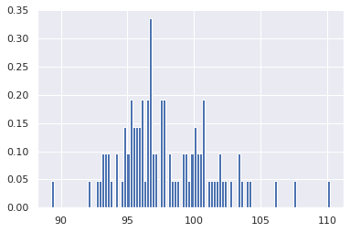
    


## Dependency

### Categorical Target


```python
sub_targets
```


    ['mau_previous_month',
     'mau_both_months',
     'mau',
     'monthly_stream30s',
     'stream30s']


```python
for target in sub_targets:
    print(f"p99 {target}: {np.quantile(df[target], 0.99)}")
```

    p99 mau_previous_month: 130.0
    p99 mau_both_months: 19.0
    p99 mau: 143.0
    p99 monthly_stream30s: 2843.0
    p99 stream30s: 113.0


```python
des_features
```


    ['mood_1', 'mood_2', 'mood_3', 'genre_1', 'genre_2', 'genre_3']


#### Categorical Feature

##### Moods


```python
chidf = pd.DataFrame()
target = sub_targets[2]
chidf[target] = df[target]
print(chidf[target].median())
moods = pd.DataFrame()
cutoff = 0.001
pop = chidf[target].values

for ind in des_features:
    # ind = des_features[0]
    chidf[ind] = df[ind]
    
    for grp_label in df[ind].unique():
        # grp_label = df[ind].unique()[0]
        grp = chidf.loc[chidf[ind] == grp_label][target].values
        chi2, p, m, cTable = stats.median_test(grp, pop, correction=True)
        ratio = cTable[0]/cTable[1]
        pos = ratio[0]/ratio[1] > 1
        moods = pd.concat([moods, pd.DataFrame([[ind, grp_label, chi2, p, cTable, pos, p<cutoff]])])

moods.columns = ['feature', 'group', 'chi', 'p-value', 'cTable', '+', 'reject null']
moods = moods.sort_values('p-value').reset_index(drop=True)
```

    79.0


```python
moods.loc[moods['reject null'] == True]
```


<div>
<style scoped>
    .dataframe tbody tr th:only-of-type {
        vertical-align: middle;
    }

    .dataframe tbody tr th {
        vertical-align: top;
    }

    .dataframe thead th {
        text-align: right;
    }
</style>
<table border="1" class="dataframe">
  <thead>
    <tr style="text-align: right;">
      <th></th>
      <th>feature</th>
      <th>group</th>
      <th>chi</th>
      <th>p-value</th>
      <th>cTable</th>
      <th>+</th>
      <th>reject null</th>
    </tr>
  </thead>
  <tbody>
    <tr>
      <th>0</th>
      <td>genre_3</td>
      <td>-</td>
      <td>1725.882036</td>
      <td>0.000000e+00</td>
      <td>[[16033, 205049], [24090, 198317]]</td>
      <td>False</td>
      <td>True</td>
    </tr>
    <tr>
      <th>1</th>
      <td>genre_2</td>
      <td>-</td>
      <td>1104.759466</td>
      <td>3.051013e-242</td>
      <td>[[8216, 203517], [12990, 199849]]</td>
      <td>False</td>
      <td>True</td>
    </tr>
    <tr>
      <th>2</th>
      <td>genre_1</td>
      <td>Latin</td>
      <td>651.374931</td>
      <td>1.122254e-143</td>
      <td>[[9000, 199027], [6012, 204339]]</td>
      <td>True</td>
      <td>True</td>
    </tr>
    <tr>
      <th>3</th>
      <td>mood_1</td>
      <td>Energizing</td>
      <td>611.189037</td>
      <td>6.167816e-135</td>
      <td>[[10316, 203517], [14071, 199849]]</td>
      <td>False</td>
      <td>True</td>
    </tr>
    <tr>
      <th>4</th>
      <td>genre_1</td>
      <td>Rock</td>
      <td>315.827189</td>
      <td>1.174487e-70</td>
      <td>[[12514, 201911], [15563, 201455]]</td>
      <td>False</td>
      <td>True</td>
    </tr>
    <tr>
      <th>...</th>
      <td>...</td>
      <td>...</td>
      <td>...</td>
      <td>...</td>
      <td>...</td>
      <td>...</td>
      <td>...</td>
    </tr>
    <tr>
      <th>93</th>
      <td>mood_1</td>
      <td>Stirring</td>
      <td>12.333846</td>
      <td>4.448190e-04</td>
      <td>[[877, 200454], [1044, 202912]]</td>
      <td>False</td>
      <td>True</td>
    </tr>
    <tr>
      <th>94</th>
      <td>mood_1</td>
      <td>Serious</td>
      <td>12.316512</td>
      <td>4.489689e-04</td>
      <td>[[778, 200454], [935, 202912]]</td>
      <td>False</td>
      <td>True</td>
    </tr>
    <tr>
      <th>95</th>
      <td>mood_2</td>
      <td>Lively</td>
      <td>12.161071</td>
      <td>4.879735e-04</td>
      <td>[[2588, 200454], [2882, 202912]]</td>
      <td>False</td>
      <td>True</td>
    </tr>
    <tr>
      <th>96</th>
      <td>mood_2</td>
      <td>Somber</td>
      <td>11.618507</td>
      <td>6.529880e-04</td>
      <td>[[792, 200454], [946, 202912]]</td>
      <td>False</td>
      <td>True</td>
    </tr>
    <tr>
      <th>97</th>
      <td>genre_2</td>
      <td>Dance &amp; House</td>
      <td>10.834697</td>
      <td>9.961560e-04</td>
      <td>[[12678, 201911], [13196, 201455]]</td>
      <td>False</td>
      <td>True</td>
    </tr>
  </tbody>
</table>
<p>98 rows × 7 columns</p>
</div>


##### Chi-Square


```python
chidf = pd.DataFrame()
target = sub_targets[2]
chidf[target] = df[target]
quant_value = 0.90
tar_value = np.quantile(chidf[target], quant_value)
chidf[target] = chidf[target] > tar_value
chisum = pd.DataFrame()
cutoff = 0.0001
pop = chidf[target].values

for ind in des_features:
    # ind = des_features[0]
    chidf[ind] = df[ind]

    for grp_label in df[ind].unique():
    # grp_label = df[ind].unique()[0]
        try:
            cTable = chidf.groupby(chidf[ind] == grp_label)[target].value_counts().values.reshape(2,2).T
            chi2, p, dof, ex = stats.chi2_contingency(cTable, correction=True, lambda_=None)
            ratio = cTable[1]/cTable[0]
            pos = ratio[1]/ratio[0]
            chisum = pd.concat([chisum, pd.DataFrame([[ind, grp_label, chi2, p, cTable, pos, p<cutoff]])])
        except:
            pass

chisum.columns = ['feature', 'group', 'chi', 'p-value', 'cTable', 'multiplier', 'reject null']
chisum = chisum.sort_values('p-value').reset_index(drop=True)
```

##### Categorical-Categorical Conclusions

increasing `quant_value` will render additional features; as the population performance worsens, new feature/group pairs have an opportunity to increase the multiplier

Best Groups


```python
chisum.loc[(chisum['reject null'] == True) & (chisum['multiplier'] > 2)].sort_values('multiplier', ascending=False)
```


<div>
<style scoped>
    .dataframe tbody tr th:only-of-type {
        vertical-align: middle;
    }

    .dataframe tbody tr th {
        vertical-align: top;
    }

    .dataframe thead th {
        text-align: right;
    }
</style>
<table border="1" class="dataframe">
  <thead>
    <tr style="text-align: right;">
      <th></th>
      <th>feature</th>
      <th>group</th>
      <th>chi</th>
      <th>p-value</th>
      <th>cTable</th>
      <th>multiplier</th>
      <th>reject null</th>
    </tr>
  </thead>
  <tbody>
    <tr>
      <th>6</th>
      <td>genre_1</td>
      <td>Children's</td>
      <td>262.624693</td>
      <td>4.596280e-59</td>
      <td>[[361785, 1286], [39933, 362]]</td>
      <td>2.550270</td>
      <td>True</td>
    </tr>
    <tr>
      <th>11</th>
      <td>mood_1</td>
      <td>Other</td>
      <td>197.598843</td>
      <td>6.979647e-45</td>
      <td>[[361719, 1352], [39952, 343]]</td>
      <td>2.296943</td>
      <td>True</td>
    </tr>
    <tr>
      <th>19</th>
      <td>genre_1</td>
      <td>Spoken &amp; Audio</td>
      <td>120.508309</td>
      <td>4.896128e-28</td>
      <td>[[362147, 924], [40068, 227]]</td>
      <td>2.220451</td>
      <td>True</td>
    </tr>
    <tr>
      <th>0</th>
      <td>genre_1</td>
      <td>Latin</td>
      <td>1150.625294</td>
      <td>3.280867e-252</td>
      <td>[[350782, 12289], [37572, 2723]]</td>
      <td>2.068731</td>
      <td>True</td>
    </tr>
    <tr>
      <th>12</th>
      <td>genre_1</td>
      <td>New Age</td>
      <td>166.484617</td>
      <td>4.335181e-38</td>
      <td>[[361286, 1785], [39896, 399]]</td>
      <td>2.024214</td>
      <td>True</td>
    </tr>
  </tbody>
</table>
</div>


Worst Groups


```python
chisum.loc[(chisum['reject null'] == True) & (chisum['multiplier'] < 0.8)].sort_values('multiplier', ascending=False)
```


<div>
<style scoped>
    .dataframe tbody tr th:only-of-type {
        vertical-align: middle;
    }

    .dataframe tbody tr th {
        vertical-align: top;
    }

    .dataframe thead th {
        text-align: right;
    }
</style>
<table border="1" class="dataframe">
  <thead>
    <tr style="text-align: right;">
      <th></th>
      <th>feature</th>
      <th>group</th>
      <th>chi</th>
      <th>p-value</th>
      <th>cTable</th>
      <th>multiplier</th>
      <th>reject null</th>
    </tr>
  </thead>
  <tbody>
    <tr>
      <th>28</th>
      <td>mood_2</td>
      <td>Sensual</td>
      <td>85.309680</td>
      <td>2.551113e-20</td>
      <td>[[343873, 19198], [38598, 1697]]</td>
      <td>0.787516</td>
      <td>True</td>
    </tr>
    <tr>
      <th>40</th>
      <td>genre_1</td>
      <td>Electronica</td>
      <td>65.249731</td>
      <td>6.598320e-16</td>
      <td>[[350162, 12909], [39176, 1119]]</td>
      <td>0.774794</td>
      <td>True</td>
    </tr>
    <tr>
      <th>2</th>
      <td>genre_1</td>
      <td>Indie Rock</td>
      <td>366.567076</td>
      <td>1.046303e-81</td>
      <td>[[298164, 64907], [34631, 5664]]</td>
      <td>0.751315</td>
      <td>True</td>
    </tr>
    <tr>
      <th>13</th>
      <td>genre_3</td>
      <td>Electronica</td>
      <td>163.908151</td>
      <td>1.584260e-37</td>
      <td>[[337501, 25570], [38143, 2152]]</td>
      <td>0.744684</td>
      <td>True</td>
    </tr>
    <tr>
      <th>21</th>
      <td>mood_1</td>
      <td>Brooding</td>
      <td>109.456909</td>
      <td>1.288759e-25</td>
      <td>[[346296, 16775], [38893, 1402]]</td>
      <td>0.744152</td>
      <td>True</td>
    </tr>
    <tr>
      <th>48</th>
      <td>mood_1</td>
      <td>Gritty</td>
      <td>49.741710</td>
      <td>1.753777e-12</td>
      <td>[[355800, 7271], [39695, 600]]</td>
      <td>0.739652</td>
      <td>True</td>
    </tr>
    <tr>
      <th>14</th>
      <td>mood_1</td>
      <td>Energizing</td>
      <td>162.542129</td>
      <td>3.149562e-37</td>
      <td>[[340541, 22530], [38438, 1857]]</td>
      <td>0.730229</td>
      <td>True</td>
    </tr>
    <tr>
      <th>68</th>
      <td>mood_3</td>
      <td>Other</td>
      <td>27.407286</td>
      <td>1.648091e-07</td>
      <td>[[361541, 1530], [40196, 99]]</td>
      <td>0.581994</td>
      <td>True</td>
    </tr>
  </tbody>
</table>
</div>


We would recommend would-be superstar playlist maker construct a playlist with the following attributes:

* **Genre 1: Children's** 
    * 2.6x more likely to be in the 90th percentile
    * 4.8x more likely to be in the 99th percentile
* **Mood 1: Other** 
    * 2.3x more likely to be in the 90th percentile
    * 2.4x more likely to be in the 99th percentile

#### Continuous Feature


```python
targets
```


    ['streams',
     'stream30s',
     'dau',
     'wau',
     'mau',
     'mau_previous_month',
     'mau_both_months',
     'users',
     'skippers',
     'monthly_stream30s',
     'monthly_owner_stream30s']


```python
con_features
```


    ['n_albums', 'n_artists', 'n_tracks', 'n_local_tracks']


```python
target = "monthly_stream30s"
print(target)
chidf[target] = df[target]
quant_value = 0.90
tar_value = np.quantile(chidf[target], quant_value)

fig, ax = plt.subplots(figsize=(10,10))
df.loc[df[target] > tar_value].groupby('n_albums')[['wau']].mean().plot(ls='', marker='.', ax=ax)
ax.set_xlim(0, 200)
# ax.set_ylim(0, 100)
```

    monthly_stream30s


    (0.0, 200.0)


    

    


##### t-Test

For t tests we need to deal with the long tails in the distributions along the independent variable


```python
df[targets].describe()
```


<div>
<style scoped>
    .dataframe tbody tr th:only-of-type {
        vertical-align: middle;
    }

    .dataframe tbody tr th {
        vertical-align: top;
    }

    .dataframe thead th {
        text-align: right;
    }
</style>
<table border="1" class="dataframe">
  <thead>
    <tr style="text-align: right;">
      <th></th>
      <th>streams</th>
      <th>stream30s</th>
      <th>dau</th>
      <th>wau</th>
      <th>mau</th>
      <th>mau_previous_month</th>
      <th>mau_both_months</th>
      <th>users</th>
      <th>skippers</th>
      <th>monthly_stream30s</th>
      <th>monthly_owner_stream30s</th>
    </tr>
  </thead>
  <tbody>
    <tr>
      <th>count</th>
      <td>4.033660e+05</td>
      <td>4.033660e+05</td>
      <td>403366.000000</td>
      <td>403366.000000</td>
      <td>4.033660e+05</td>
      <td>4.033660e+05</td>
      <td>403366.000000</td>
      <td>4.033660e+05</td>
      <td>403366.000000</td>
      <td>4.033660e+05</td>
      <td>403366.000000</td>
    </tr>
    <tr>
      <th>mean</th>
      <td>7.101375e+01</td>
      <td>4.283333e+01</td>
      <td>4.418265</td>
      <td>21.784446</td>
      <td>6.614290e+01</td>
      <td>5.819009e+01</td>
      <td>12.937065</td>
      <td>1.493085e+02</td>
      <td>2.827749</td>
      <td>1.260489e+03</td>
      <td>93.556621</td>
    </tr>
    <tr>
      <th>std</th>
      <td>6.492014e+03</td>
      <td>3.772412e+03</td>
      <td>358.855685</td>
      <td>1614.650805</td>
      <td>4.732580e+03</td>
      <td>3.827248e+03</td>
      <td>1240.912979</td>
      <td>9.247484e+03</td>
      <td>205.059728</td>
      <td>1.062463e+05</td>
      <td>226.250189</td>
    </tr>
    <tr>
      <th>min</th>
      <td>0.000000e+00</td>
      <td>0.000000e+00</td>
      <td>0.000000</td>
      <td>0.000000</td>
      <td>2.000000e+00</td>
      <td>0.000000e+00</td>
      <td>0.000000</td>
      <td>2.000000e+00</td>
      <td>0.000000</td>
      <td>2.000000e+00</td>
      <td>0.000000</td>
    </tr>
    <tr>
      <th>25%</th>
      <td>0.000000e+00</td>
      <td>0.000000e+00</td>
      <td>0.000000</td>
      <td>1.000000</td>
      <td>2.000000e+00</td>
      <td>1.000000e+00</td>
      <td>1.000000</td>
      <td>2.000000e+00</td>
      <td>0.000000</td>
      <td>3.100000e+01</td>
      <td>6.000000</td>
    </tr>
    <tr>
      <th>50%</th>
      <td>1.000000e+00</td>
      <td>0.000000e+00</td>
      <td>0.000000</td>
      <td>1.000000</td>
      <td>2.000000e+00</td>
      <td>2.000000e+00</td>
      <td>1.000000</td>
      <td>3.000000e+00</td>
      <td>0.000000</td>
      <td>7.900000e+01</td>
      <td>30.000000</td>
    </tr>
    <tr>
      <th>75%</th>
      <td>8.000000e+00</td>
      <td>5.000000e+00</td>
      <td>1.000000</td>
      <td>2.000000</td>
      <td>4.000000e+00</td>
      <td>3.000000e+00</td>
      <td>2.000000</td>
      <td>7.000000e+00</td>
      <td>0.000000</td>
      <td>1.930000e+02</td>
      <td>96.000000</td>
    </tr>
    <tr>
      <th>max</th>
      <td>2.629715e+06</td>
      <td>1.513237e+06</td>
      <td>152929.000000</td>
      <td>669966.000000</td>
      <td>1.944150e+06</td>
      <td>1.478684e+06</td>
      <td>578391.000000</td>
      <td>3.455406e+06</td>
      <td>86162.000000</td>
      <td>4.249733e+07</td>
      <td>25904.000000</td>
    </tr>
  </tbody>
</table>
</div>


```python
df.loc[df['owner'] != 'spotify'][targets].describe()
```


<div>
<style scoped>
    .dataframe tbody tr th:only-of-type {
        vertical-align: middle;
    }

    .dataframe tbody tr th {
        vertical-align: top;
    }

    .dataframe thead th {
        text-align: right;
    }
</style>
<table border="1" class="dataframe">
  <thead>
    <tr style="text-align: right;">
      <th></th>
      <th>streams</th>
      <th>stream30s</th>
      <th>dau</th>
      <th>wau</th>
      <th>mau</th>
      <th>mau_previous_month</th>
      <th>mau_both_months</th>
      <th>users</th>
      <th>skippers</th>
      <th>monthly_stream30s</th>
      <th>monthly_owner_stream30s</th>
    </tr>
  </thead>
  <tbody>
    <tr>
      <th>count</th>
      <td>402967.000000</td>
      <td>402967.000000</td>
      <td>402967.000000</td>
      <td>402967.000000</td>
      <td>402967.000000</td>
      <td>402967.000000</td>
      <td>402967.000000</td>
      <td>402967.000000</td>
      <td>402967.000000</td>
      <td>4.029670e+05</td>
      <td>402967.000000</td>
    </tr>
    <tr>
      <th>mean</th>
      <td>20.968960</td>
      <td>11.990945</td>
      <td>1.232421</td>
      <td>5.275308</td>
      <td>14.860487</td>
      <td>13.483665</td>
      <td>3.029327</td>
      <td>32.824100</td>
      <td>0.728640</td>
      <td>3.543268e+02</td>
      <td>93.647783</td>
    </tr>
    <tr>
      <th>std</th>
      <td>766.262668</td>
      <td>404.190477</td>
      <td>41.227771</td>
      <td>185.706612</td>
      <td>504.704081</td>
      <td>548.731437</td>
      <td>129.629183</td>
      <td>1157.601711</td>
      <td>27.054367</td>
      <td>1.093559e+04</td>
      <td>226.343585</td>
    </tr>
    <tr>
      <th>min</th>
      <td>0.000000</td>
      <td>0.000000</td>
      <td>0.000000</td>
      <td>0.000000</td>
      <td>2.000000</td>
      <td>0.000000</td>
      <td>0.000000</td>
      <td>2.000000</td>
      <td>0.000000</td>
      <td>2.000000e+00</td>
      <td>0.000000</td>
    </tr>
    <tr>
      <th>25%</th>
      <td>0.000000</td>
      <td>0.000000</td>
      <td>0.000000</td>
      <td>1.000000</td>
      <td>2.000000</td>
      <td>1.000000</td>
      <td>1.000000</td>
      <td>2.000000</td>
      <td>0.000000</td>
      <td>3.100000e+01</td>
      <td>6.000000</td>
    </tr>
    <tr>
      <th>50%</th>
      <td>1.000000</td>
      <td>0.000000</td>
      <td>0.000000</td>
      <td>1.000000</td>
      <td>2.000000</td>
      <td>2.000000</td>
      <td>1.000000</td>
      <td>3.000000</td>
      <td>0.000000</td>
      <td>7.900000e+01</td>
      <td>30.000000</td>
    </tr>
    <tr>
      <th>75%</th>
      <td>8.000000</td>
      <td>5.000000</td>
      <td>1.000000</td>
      <td>2.000000</td>
      <td>4.000000</td>
      <td>3.000000</td>
      <td>2.000000</td>
      <td>7.000000</td>
      <td>0.000000</td>
      <td>1.930000e+02</td>
      <td>96.000000</td>
    </tr>
    <tr>
      <th>max</th>
      <td>293283.000000</td>
      <td>173753.000000</td>
      <td>18290.000000</td>
      <td>71891.000000</td>
      <td>206756.000000</td>
      <td>190026.000000</td>
      <td>59049.000000</td>
      <td>439699.000000</td>
      <td>11755.000000</td>
      <td>5.098585e+06</td>
      <td>25904.000000</td>
    </tr>
  </tbody>
</table>
</div>


```python
chidf = pd.DataFrame()
target = "mau"
chidf[target] = df[target]
quant_value = 0.99
tar_value = np.quantile(chidf[target], quant_value)
chidf[target] = chidf[target] > tar_value
welchsum = pd.DataFrame()
cutoff = 0.0001
pop = chidf[target].values

for ind in con_features:
    # ind = con_features[0]
    chidf[ind] = df[ind]

    # for grp_label in df[ind].unique():
    # try:
    a = []
    b = []
    for i in range(100):
        boot1 = random.sample(
                    list(
                        chidf.loc[
                            (chidf[target] == True)
                        ][ind].values),
                    k=1000)
        boot2 = random.sample(
                    list(
                        chidf.loc[
                            (chidf[target] == False)
                        ][ind].values),
                    k=1000)
        a.append(np.mean(boot1))
        b.append(np.mean(boot2))
    testt, p = stats.ttest_ind(a, b, equal_var=False)
    a_avg = np.mean(a)
    b_avg = np.mean(b)
    welchsum = pd.concat([welchsum, pd.DataFrame([[ind, testt, p, a_avg, b_avg, p<cutoff]])])
    sns.histplot(a, color='tab:orange', label=f"{target} > {tar_value:.0f}")
    sns.histplot(b, label=f"{target} <= {tar_value:.0f}")
    plt.title(ind)
    plt.legend()
    plt.show()
    # except:
    #     pass

welchsum.columns = ['feature', 'test stat', 'p-value', 'upper q avg', 'lower q avg', 'reject null']
welchsum = welchsum.sort_values('p-value').reset_index(drop=True)
```


    

    


    

    


    

    


    

    


```python
welchsum
```


<div>
<style scoped>
    .dataframe tbody tr th:only-of-type {
        vertical-align: middle;
    }

    .dataframe tbody tr th {
        vertical-align: top;
    }

    .dataframe thead th {
        text-align: right;
    }
</style>
<table border="1" class="dataframe">
  <thead>
    <tr style="text-align: right;">
      <th></th>
      <th>feature</th>
      <th>test stat</th>
      <th>p-value</th>
      <th>upper q avg</th>
      <th>lower q avg</th>
      <th>reject null</th>
    </tr>
  </thead>
  <tbody>
    <tr>
      <th>0</th>
      <td>n_tracks</td>
      <td>10.277868</td>
      <td>4.444906e-20</td>
      <td>214.33164</td>
      <td>193.07872</td>
      <td>True</td>
    </tr>
    <tr>
      <th>1</th>
      <td>n_artists</td>
      <td>5.367785</td>
      <td>2.238566e-07</td>
      <td>84.92819</td>
      <td>81.98974</td>
      <td>True</td>
    </tr>
    <tr>
      <th>2</th>
      <td>n_local_tracks</td>
      <td>-2.602519</td>
      <td>1.006900e-02</td>
      <td>2.59716</td>
      <td>2.84386</td>
      <td>False</td>
    </tr>
    <tr>
      <th>3</th>
      <td>n_albums</td>
      <td>-0.827392</td>
      <td>4.090126e-01</td>
      <td>85.92611</td>
      <td>86.46785</td>
      <td>False</td>
    </tr>
  </tbody>
</table>
</div>


Let's perform the same test again this time let's say we're only interested in playlists with at least 10 tracks and fewer than 1000 tracks


```python
chidf = pd.DataFrame()
target = sub_targets[2]
chidf[target] = df[target]
chidf['n_tracks'] = df['n_tracks']
quant_value = 0.90
tar_value = np.quantile(chidf[target], quant_value)
chidf[target] = chidf[target] > tar_value
welchsum = pd.DataFrame()
cutoff = 0.0001
pop = chidf[target].values

for ind in con_features:
    # ind = con_features[0]
    chidf[ind] = df[ind]

    # for grp_label in df[ind].unique():
    # try:
    a = []
    b = []
    for i in range(100):
        boot1 = random.sample(
                    list(
                        chidf.loc[
                            (chidf[target] == True)
                            & (chidf['n_tracks'] > 9)
                            & (chidf['n_tracks'] < 999)
                        ][ind].values),
                    k=1000)
        boot2 = random.sample(
                    list(
                        chidf.loc[
                            (chidf[target] == False)
                            & (chidf['n_tracks'] > 9)
                            & (chidf['n_tracks'] < 999)
                        ][ind].values),
                    k=1000)
        a.append(np.mean(boot1))
        b.append(np.mean(boot2))
    testt, p = stats.ttest_ind(a, b, equal_var=False)
    a_avg = np.mean(a)
    b_avg = np.mean(b)
    welchsum = pd.concat([welchsum, pd.DataFrame([[ind, testt, p, a_avg, b_avg, p<cutoff]])])
    sns.histplot(a, color='tab:orange', label=f"{target} > {tar_value:.0f}")
    sns.histplot(b, label=f"{target} <= {tar_value:.0f}")
    plt.title(ind)
    plt.legend()
    plt.show()
    # except:
    #     pass

welchsum.columns = ['feature', 'test stat', 'p-value', 'upper q avg', 'lower q avg', 'reject null']
welchsum = welchsum.sort_values('p-value').reset_index(drop=True)
```


    

    


    

    


    
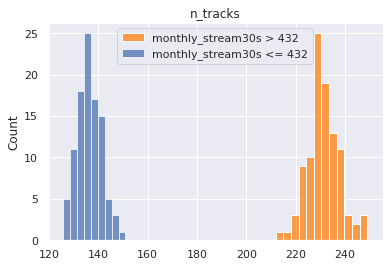
    


    

    


```python
welchsum
```


<div>
<style scoped>
    .dataframe tbody tr th:only-of-type {
        vertical-align: middle;
    }

    .dataframe tbody tr th {
        vertical-align: top;
    }

    .dataframe thead th {
        text-align: right;
    }
</style>
<table border="1" class="dataframe">
  <thead>
    <tr style="text-align: right;">
      <th></th>
      <th>feature</th>
      <th>test stat</th>
      <th>p-value</th>
      <th>upper q avg</th>
      <th>lower q avg</th>
      <th>reject null</th>
    </tr>
  </thead>
  <tbody>
    <tr>
      <th>0</th>
      <td>n_tracks</td>
      <td>115.613349</td>
      <td>3.417496e-174</td>
      <td>231.30575</td>
      <td>136.10481</td>
      <td>True</td>
    </tr>
    <tr>
      <th>1</th>
      <td>n_artists</td>
      <td>97.323391</td>
      <td>2.230656e-167</td>
      <td>108.74091</td>
      <td>70.18516</td>
      <td>True</td>
    </tr>
    <tr>
      <th>2</th>
      <td>n_albums</td>
      <td>94.393421</td>
      <td>2.063549e-160</td>
      <td>114.38747</td>
      <td>74.44801</td>
      <td>True</td>
    </tr>
    <tr>
      <th>3</th>
      <td>n_local_tracks</td>
      <td>15.122963</td>
      <td>4.889333e-34</td>
      <td>3.04746</td>
      <td>1.99517</td>
      <td>True</td>
    </tr>
  </tbody>
</table>
</div>


##### Categorical-Continuous Conclusions

Our conclusions are the same. There is a clear delineation between number of tracks, albums, and artists for popular and unpopular playlists

#### Putting it All Together


```python
sub_targets
```


    ['mau_previous_month', 'mau_both_months', 'monthly_stream30s', 'stream30s']


```python
des_features
```


    ['mood_1', 'mood_2', 'mood_3', 'genre_1', 'genre_2', 'genre_3']


```python
master = pd.DataFrame()
for target in sub_targets:
    # target = sub_targets[0]
    for quant_value in [0.9, 0.99]:
        # quant_value = 0.90
        chidf = pd.DataFrame()
        chidf[target] = df[target]
        tar_value = np.quantile(chidf[target], quant_value)
        chidf[target] = chidf[target] > tar_value
        chisum = pd.DataFrame()
        cutoff = 0.0001
        pop = chidf[target].values

        for ind in des_features:
            # ind = des_features[0]
            chidf[ind] = df[ind]

            for grp_label in df[ind].unique():
            # grp_label = df[ind].unique()[0]
                try:
                    cTable = chidf.groupby(chidf[ind] == grp_label)[target].value_counts().values.reshape(2,2).T
                    chi2, p, dof, ex = stats.chi2_contingency(cTable, correction=True, lambda_=None)
                    ratio = cTable[1]/cTable[0]
                    pos = ratio[1]/ratio[0]
                    chisum = pd.concat([chisum, pd.DataFrame([[target, quant_value, tar_value, ind, grp_label, chi2, p, cTable, pos, p<cutoff]])])
                except:
                    pass

        chisum.columns = ['target', 'upper q', 'upper q value', 'feature', 'group', 'chi', 'p-value', 'cTable', 'multiplier', 'reject null']
        chisum = chisum.sort_values('p-value').reset_index(drop=True)
        chisum = chisum.loc[(chisum['reject null'] == True) & (chisum['multiplier'] > 2)].sort_values('multiplier', ascending=False)
        master = pd.concat((master, chisum))
    
master
```


<div>
<style scoped>
    .dataframe tbody tr th:only-of-type {
        vertical-align: middle;
    }

    .dataframe tbody tr th {
        vertical-align: top;
    }

    .dataframe thead th {
        text-align: right;
    }
</style>
<table border="1" class="dataframe">
  <thead>
    <tr style="text-align: right;">
      <th></th>
      <th>target</th>
      <th>upper q</th>
      <th>upper q value</th>
      <th>feature</th>
      <th>group</th>
      <th>chi</th>
      <th>p-value</th>
      <th>cTable</th>
      <th>multiplier</th>
      <th>reject null</th>
    </tr>
  </thead>
  <tbody>
    <tr>
      <th>2</th>
      <td>mau_previous_month</td>
      <td>0.90</td>
      <td>9.0</td>
      <td>genre_1</td>
      <td>Latin</td>
      <td>5590.525321</td>
      <td>0.000000e+00</td>
      <td>[[355002, 11016], [33352, 3996]]</td>
      <td>3.861095</td>
      <td>True</td>
    </tr>
    <tr>
      <th>18</th>
      <td>mau_previous_month</td>
      <td>0.90</td>
      <td>9.0</td>
      <td>genre_1</td>
      <td>Children's</td>
      <td>434.974313</td>
      <td>1.343518e-96</td>
      <td>[[364768, 1250], [36950, 398]]</td>
      <td>3.143224</td>
      <td>True</td>
    </tr>
    <tr>
      <th>1</th>
      <td>mau_previous_month</td>
      <td>0.90</td>
      <td>9.0</td>
      <td>mood_1</td>
      <td>Lively</td>
      <td>2312.708732</td>
      <td>0.000000e+00</td>
      <td>[[358030, 7988], [34990, 2358]]</td>
      <td>3.020517</td>
      <td>True</td>
    </tr>
    <tr>
      <th>22</th>
      <td>mau_previous_month</td>
      <td>0.90</td>
      <td>9.0</td>
      <td>genre_1</td>
      <td>Traditional</td>
      <td>357.345743</td>
      <td>1.065483e-79</td>
      <td>[[364829, 1189], [36989, 359]]</td>
      <td>2.978032</td>
      <td>True</td>
    </tr>
    <tr>
      <th>7</th>
      <td>mau_previous_month</td>
      <td>0.90</td>
      <td>9.0</td>
      <td>genre_2</td>
      <td>Jazz</td>
      <td>1046.212802</td>
      <td>1.619916e-229</td>
      <td>[[362333, 3685], [36262, 1086]]</td>
      <td>2.944750</td>
      <td>True</td>
    </tr>
    <tr>
      <th>...</th>
      <td>...</td>
      <td>...</td>
      <td>...</td>
      <td>...</td>
      <td>...</td>
      <td>...</td>
      <td>...</td>
      <td>...</td>
      <td>...</td>
      <td>...</td>
    </tr>
    <tr>
      <th>36</th>
      <td>stream30s</td>
      <td>0.99</td>
      <td>113.0</td>
      <td>genre_2</td>
      <td>Easy Listening</td>
      <td>26.570340</td>
      <td>2.541152e-07</td>
      <td>[[397291, 2078], [3952, 45]]</td>
      <td>2.177002</td>
      <td>True</td>
    </tr>
    <tr>
      <th>29</th>
      <td>stream30s</td>
      <td>0.99</td>
      <td>113.0</td>
      <td>genre_2</td>
      <td>Traditional</td>
      <td>39.102302</td>
      <td>4.021695e-10</td>
      <td>[[396243, 3126], [3930, 67]]</td>
      <td>2.161001</td>
      <td>True</td>
    </tr>
    <tr>
      <th>24</th>
      <td>stream30s</td>
      <td>0.99</td>
      <td>113.0</td>
      <td>genre_3</td>
      <td>Jazz</td>
      <td>46.586071</td>
      <td>8.768129e-12</td>
      <td>[[395431, 3938], [3914, 83]]</td>
      <td>2.129376</td>
      <td>True</td>
    </tr>
    <tr>
      <th>22</th>
      <td>stream30s</td>
      <td>0.99</td>
      <td>113.0</td>
      <td>mood_2</td>
      <td>Easygoing</td>
      <td>48.122685</td>
      <td>4.003676e-12</td>
      <td>[[394690, 4679], [3902, 95]]</td>
      <td>2.053711</td>
      <td>True</td>
    </tr>
    <tr>
      <th>18</th>
      <td>stream30s</td>
      <td>0.99</td>
      <td>113.0</td>
      <td>mood_2</td>
      <td>Lively</td>
      <td>53.658720</td>
      <td>2.385226e-13</td>
      <td>[[394007, 5362], [3889, 108]]</td>
      <td>2.040624</td>
      <td>True</td>
    </tr>
  </tbody>
</table>
<p>182 rows × 10 columns</p>
</div>


```python
master['group'].value_counts()
```


    -                 22
    Romantic          19
    Lively            17
    Traditional       16
    Children's        16
    Jazz              14
    Latin             12
    Serious            8
    Easy Listening     8
    Soundtrack         8
    Other              7
    New Age            7
    Holiday            6
    Peaceful           6
    Spoken & Audio     4
    Fiery              3
    Tender             3
    Easygoing          3
    Sophisticated      2
    Somber             1
    Name: group, dtype: int64


```python
master.loc[master['upper q'] == 0.90]['group'].value_counts()
```


    -                 12
    Lively             7
    Traditional        7
    Children's         7
    Jazz               7
    Latin              7
    Romantic           6
    Other              5
    Serious            5
    Holiday            5
    Easy Listening     4
    Soundtrack         4
    Spoken & Audio     3
    Fiery              3
    Sophisticated      2
    New Age            1
    Tender             1
    Name: group, dtype: int64


```python
sort_key = {i: j for i,j in zip(master['group'].value_counts().index.values, range(master['group'].nunique()))}
master['rank'] = master['group'].apply(lambda x: sort_key[x])
master.sort_values('rank', inplace=True)
# master.drop('rank', axis=1, inplace=True)
master.loc[master['group'] != '-'][:20]
```


<div>
<style scoped>
    .dataframe tbody tr th:only-of-type {
        vertical-align: middle;
    }

    .dataframe tbody tr th {
        vertical-align: top;
    }

    .dataframe thead th {
        text-align: right;
    }
</style>
<table border="1" class="dataframe">
  <thead>
    <tr style="text-align: right;">
      <th></th>
      <th>target</th>
      <th>upper q</th>
      <th>upper q value</th>
      <th>feature</th>
      <th>group</th>
      <th>chi</th>
      <th>p-value</th>
      <th>cTable</th>
      <th>multiplier</th>
      <th>reject null</th>
      <th>rank</th>
    </tr>
  </thead>
  <tbody>
    <tr>
      <th>7</th>
      <td>monthly_stream30s</td>
      <td>0.99</td>
      <td>2843.0</td>
      <td>mood_2</td>
      <td>Romantic</td>
      <td>146.934024</td>
      <td>8.112487e-34</td>
      <td>[[389339, 9994], [3810, 223]]</td>
      <td>2.280176</td>
      <td>True</td>
      <td>1</td>
    </tr>
    <tr>
      <th>6</th>
      <td>stream30s</td>
      <td>0.99</td>
      <td>113.0</td>
      <td>mood_2</td>
      <td>Romantic</td>
      <td>148.026986</td>
      <td>4.679851e-34</td>
      <td>[[389374, 9995], [3775, 222]]</td>
      <td>2.290974</td>
      <td>True</td>
      <td>1</td>
    </tr>
    <tr>
      <th>4</th>
      <td>monthly_stream30s</td>
      <td>0.99</td>
      <td>2843.0</td>
      <td>mood_1</td>
      <td>Romantic</td>
      <td>175.072639</td>
      <td>5.772239e-40</td>
      <td>[[390131, 9202], [3812, 221]]</td>
      <td>2.457919</td>
      <td>True</td>
      <td>1</td>
    </tr>
    <tr>
      <th>2</th>
      <td>mau</td>
      <td>0.99</td>
      <td>143.0</td>
      <td>mood_1</td>
      <td>Romantic</td>
      <td>202.823985</td>
      <td>5.053546e-46</td>
      <td>[[390156, 9193], [3787, 230]]</td>
      <td>2.577588</td>
      <td>True</td>
      <td>1</td>
    </tr>
    <tr>
      <th>1</th>
      <td>mau</td>
      <td>0.90</td>
      <td>9.0</td>
      <td>mood_2</td>
      <td>Romantic</td>
      <td>1531.190216</td>
      <td>0.000000e+00</td>
      <td>[[355299, 8035], [37850, 2182]]</td>
      <td>2.549159</td>
      <td>True</td>
      <td>1</td>
    </tr>
    <tr>
      <th>8</th>
      <td>mau_previous_month</td>
      <td>0.90</td>
      <td>9.0</td>
      <td>mood_3</td>
      <td>Romantic</td>
      <td>1013.797108</td>
      <td>1.800082e-222</td>
      <td>[[357949, 8069], [35525, 1823]]</td>
      <td>2.276429</td>
      <td>True</td>
      <td>1</td>
    </tr>
    <tr>
      <th>4</th>
      <td>mau_previous_month</td>
      <td>0.99</td>
      <td>130.0</td>
      <td>mood_1</td>
      <td>Romantic</td>
      <td>156.500834</td>
      <td>6.579992e-36</td>
      <td>[[390127, 9209], [3816, 214]]</td>
      <td>2.375740</td>
      <td>True</td>
      <td>1</td>
    </tr>
    <tr>
      <th>8</th>
      <td>mau</td>
      <td>0.90</td>
      <td>9.0</td>
      <td>mood_3</td>
      <td>Romantic</td>
      <td>1170.355016</td>
      <td>1.690629e-256</td>
      <td>[[355429, 7905], [38045, 1987]]</td>
      <td>2.348287</td>
      <td>True</td>
      <td>1</td>
    </tr>
    <tr>
      <th>6</th>
      <td>mau</td>
      <td>0.99</td>
      <td>143.0</td>
      <td>mood_2</td>
      <td>Romantic</td>
      <td>105.450504</td>
      <td>9.729814e-25</td>
      <td>[[389336, 10013], [3813, 204]]</td>
      <td>2.080289</td>
      <td>True</td>
      <td>1</td>
    </tr>
    <tr>
      <th>5</th>
      <td>mau_previous_month</td>
      <td>0.99</td>
      <td>130.0</td>
      <td>mood_3</td>
      <td>Romantic</td>
      <td>112.605179</td>
      <td>2.633191e-26</td>
      <td>[[389647, 9689], [3827, 203]]</td>
      <td>2.133192</td>
      <td>True</td>
      <td>1</td>
    </tr>
    <tr>
      <th>6</th>
      <td>monthly_stream30s</td>
      <td>0.99</td>
      <td>2843.0</td>
      <td>mood_3</td>
      <td>Romantic</td>
      <td>149.750731</td>
      <td>1.965370e-34</td>
      <td>[[389660, 9673], [3814, 219]]</td>
      <td>2.313066</td>
      <td>True</td>
      <td>1</td>
    </tr>
    <tr>
      <th>3</th>
      <td>mau_both_months</td>
      <td>0.99</td>
      <td>19.0</td>
      <td>mood_1</td>
      <td>Romantic</td>
      <td>109.693770</td>
      <td>1.143607e-25</td>
      <td>[[390177, 9231], [3766, 192]]</td>
      <td>2.154933</td>
      <td>True</td>
      <td>1</td>
    </tr>
    <tr>
      <th>6</th>
      <td>mau_previous_month</td>
      <td>0.90</td>
      <td>9.0</td>
      <td>mood_1</td>
      <td>Romantic</td>
      <td>1142.816205</td>
      <td>1.633755e-250</td>
      <td>[[358408, 7610], [35535, 1813]]</td>
      <td>2.402893</td>
      <td>True</td>
      <td>1</td>
    </tr>
    <tr>
      <th>10</th>
      <td>stream30s</td>
      <td>0.99</td>
      <td>113.0</td>
      <td>mood_3</td>
      <td>Romantic</td>
      <td>136.025552</td>
      <td>1.969792e-31</td>
      <td>[[389689, 9680], [3785, 212]]</td>
      <td>2.254825</td>
      <td>True</td>
      <td>1</td>
    </tr>
    <tr>
      <th>5</th>
      <td>mau</td>
      <td>0.99</td>
      <td>143.0</td>
      <td>mood_3</td>
      <td>Romantic</td>
      <td>122.574129</td>
      <td>1.728356e-28</td>
      <td>[[389664, 9685], [3810, 207]]</td>
      <td>2.185929</td>
      <td>True</td>
      <td>1</td>
    </tr>
    <tr>
      <th>6</th>
      <td>mau</td>
      <td>0.90</td>
      <td>9.0</td>
      <td>mood_1</td>
      <td>Romantic</td>
      <td>1328.179994</td>
      <td>8.498925e-291</td>
      <td>[[355892, 7442], [38051, 1981]]</td>
      <td>2.489700</td>
      <td>True</td>
      <td>1</td>
    </tr>
    <tr>
      <th>6</th>
      <td>mau_previous_month</td>
      <td>0.99</td>
      <td>130.0</td>
      <td>mood_2</td>
      <td>Romantic</td>
      <td>104.434543</td>
      <td>1.624732e-24</td>
      <td>[[389323, 10013], [3826, 204]]</td>
      <td>2.073152</td>
      <td>True</td>
      <td>1</td>
    </tr>
    <tr>
      <th>8</th>
      <td>stream30s</td>
      <td>0.99</td>
      <td>113.0</td>
      <td>mood_1</td>
      <td>Romantic</td>
      <td>139.245969</td>
      <td>3.891401e-32</td>
      <td>[[390152, 9217], [3791, 206]]</td>
      <td>2.300158</td>
      <td>True</td>
      <td>1</td>
    </tr>
    <tr>
      <th>5</th>
      <td>mau_previous_month</td>
      <td>0.90</td>
      <td>9.0</td>
      <td>mood_2</td>
      <td>Romantic</td>
      <td>1379.938658</td>
      <td>4.806442e-302</td>
      <td>[[357822, 8196], [35327, 2021]]</td>
      <td>2.497610</td>
      <td>True</td>
      <td>1</td>
    </tr>
    <tr>
      <th>1</th>
      <td>mau_both_months</td>
      <td>0.90</td>
      <td>2.0</td>
      <td>mood_1</td>
      <td>Lively</td>
      <td>750.247385</td>
      <td>3.544959e-165</td>
      <td>[[361665, 8747], [31355, 1599]]</td>
      <td>2.108575</td>
      <td>True</td>
      <td>2</td>
    </tr>
  </tbody>
</table>
</div>


```python
sub_targets
```


    ['mau_previous_month',
     'mau_both_months',
     'mau',
     'monthly_stream30s',
     'stream30s']


```python
master.head()
```


<div>
<style scoped>
    .dataframe tbody tr th:only-of-type {
        vertical-align: middle;
    }

    .dataframe tbody tr th {
        vertical-align: top;
    }

    .dataframe thead th {
        text-align: right;
    }
</style>
<table border="1" class="dataframe">
  <thead>
    <tr style="text-align: right;">
      <th></th>
      <th>target</th>
      <th>upper q</th>
      <th>upper q value</th>
      <th>feature</th>
      <th>group</th>
      <th>chi</th>
      <th>p-value</th>
      <th>cTable</th>
      <th>multiplier</th>
      <th>reject null</th>
      <th>rank</th>
    </tr>
  </thead>
  <tbody>
    <tr>
      <th>12</th>
      <td>stream30s</td>
      <td>0.99</td>
      <td>113.0</td>
      <td>mood_3</td>
      <td>-</td>
      <td>125.854082</td>
      <td>3.309444e-29</td>
      <td>[[397434, 1935], [3927, 70]]</td>
      <td>3.661181</td>
      <td>True</td>
      <td>0</td>
    </tr>
    <tr>
      <th>11</th>
      <td>monthly_stream30s</td>
      <td>0.99</td>
      <td>2843.0</td>
      <td>mood_2</td>
      <td>-</td>
      <td>109.163417</td>
      <td>1.494430e-25</td>
      <td>[[397529, 1804], [3969, 64]]</td>
      <td>3.553294</td>
      <td>True</td>
      <td>0</td>
    </tr>
    <tr>
      <th>67</th>
      <td>mau_previous_month</td>
      <td>0.90</td>
      <td>9.0</td>
      <td>genre_1</td>
      <td>-</td>
      <td>95.863487</td>
      <td>1.230846e-22</td>
      <td>[[365249, 769], [37173, 175]]</td>
      <td>2.236007</td>
      <td>True</td>
      <td>0</td>
    </tr>
    <tr>
      <th>10</th>
      <td>monthly_stream30s</td>
      <td>0.99</td>
      <td>2843.0</td>
      <td>mood_1</td>
      <td>-</td>
      <td>112.668942</td>
      <td>2.549855e-26</td>
      <td>[[397605, 1728], [3970, 63]]</td>
      <td>3.651389</td>
      <td>True</td>
      <td>0</td>
    </tr>
    <tr>
      <th>7</th>
      <td>stream30s</td>
      <td>0.99</td>
      <td>113.0</td>
      <td>mood_1</td>
      <td>-</td>
      <td>141.501726</td>
      <td>1.249779e-32</td>
      <td>[[397646, 1723], [3929, 68]]</td>
      <td>3.994277</td>
      <td>True</td>
      <td>0</td>
    </tr>
  </tbody>
</table>
</div>


```python
master.loc[master['feature'].str.contains('genre')].groupby('group')[['multiplier', 'rank']].mean().sort_values('multiplier', ascending=False)
```


<div>
<style scoped>
    .dataframe tbody tr th:only-of-type {
        vertical-align: middle;
    }

    .dataframe tbody tr th {
        vertical-align: top;
    }

    .dataframe thead th {
        text-align: right;
    }
</style>
<table border="1" class="dataframe">
  <thead>
    <tr style="text-align: right;">
      <th></th>
      <th>multiplier</th>
      <th>rank</th>
    </tr>
    <tr>
      <th>group</th>
      <th></th>
      <th></th>
    </tr>
  </thead>
  <tbody>
    <tr>
      <th>Tender</th>
      <td>3.033890</td>
      <td>16.0</td>
    </tr>
    <tr>
      <th>-</th>
      <td>2.935235</td>
      <td>0.0</td>
    </tr>
    <tr>
      <th>Peaceful</th>
      <td>2.564297</td>
      <td>13.0</td>
    </tr>
    <tr>
      <th>Other</th>
      <td>2.494292</td>
      <td>10.0</td>
    </tr>
    <tr>
      <th>Lively</th>
      <td>2.364492</td>
      <td>2.0</td>
    </tr>
    <tr>
      <th>Romantic</th>
      <td>2.318001</td>
      <td>1.0</td>
    </tr>
    <tr>
      <th>Fiery</th>
      <td>2.244027</td>
      <td>15.0</td>
    </tr>
    <tr>
      <th>Somber</th>
      <td>2.194114</td>
      <td>19.0</td>
    </tr>
    <tr>
      <th>Serious</th>
      <td>2.190306</td>
      <td>7.0</td>
    </tr>
    <tr>
      <th>Easygoing</th>
      <td>2.088064</td>
      <td>17.0</td>
    </tr>
    <tr>
      <th>Sophisticated</th>
      <td>2.055203</td>
      <td>18.0</td>
    </tr>
  </tbody>
</table>
</div>


```python
master['rank'] = master['group'].apply(lambda x: sort_key[x])
master.groupby('group')[['multiplier', 'rank']].mean().sort_values('multiplier', ascending=False)
```


<div>
<style scoped>
    .dataframe tbody tr th:only-of-type {
        vertical-align: middle;
    }

    .dataframe tbody tr th {
        vertical-align: top;
    }

    .dataframe thead th {
        text-align: right;
    }
</style>
<table border="1" class="dataframe">
  <thead>
    <tr style="text-align: right;">
      <th></th>
      <th>multiplier</th>
      <th>rank</th>
    </tr>
    <tr>
      <th>group</th>
      <th></th>
      <th></th>
    </tr>
  </thead>
  <tbody>
    <tr>
      <th>-</th>
      <td>3.049100</td>
      <td>0.0</td>
    </tr>
    <tr>
      <th>Tender</th>
      <td>3.033890</td>
      <td>16.0</td>
    </tr>
    <tr>
      <th>Latin</th>
      <td>3.001282</td>
      <td>6.0</td>
    </tr>
    <tr>
      <th>Children's</th>
      <td>2.871261</td>
      <td>4.0</td>
    </tr>
    <tr>
      <th>Holiday</th>
      <td>2.836528</td>
      <td>12.0</td>
    </tr>
    <tr>
      <th>New Age</th>
      <td>2.754796</td>
      <td>11.0</td>
    </tr>
    <tr>
      <th>Spoken &amp; Audio</th>
      <td>2.610393</td>
      <td>14.0</td>
    </tr>
    <tr>
      <th>Peaceful</th>
      <td>2.564297</td>
      <td>13.0</td>
    </tr>
    <tr>
      <th>Other</th>
      <td>2.425104</td>
      <td>10.0</td>
    </tr>
    <tr>
      <th>Easy Listening</th>
      <td>2.407295</td>
      <td>8.0</td>
    </tr>
    <tr>
      <th>Lively</th>
      <td>2.364492</td>
      <td>2.0</td>
    </tr>
    <tr>
      <th>Traditional</th>
      <td>2.361342</td>
      <td>3.0</td>
    </tr>
    <tr>
      <th>Jazz</th>
      <td>2.342954</td>
      <td>5.0</td>
    </tr>
    <tr>
      <th>Romantic</th>
      <td>2.318001</td>
      <td>1.0</td>
    </tr>
    <tr>
      <th>Fiery</th>
      <td>2.244027</td>
      <td>15.0</td>
    </tr>
    <tr>
      <th>Soundtrack</th>
      <td>2.209295</td>
      <td>9.0</td>
    </tr>
    <tr>
      <th>Somber</th>
      <td>2.194114</td>
      <td>19.0</td>
    </tr>
    <tr>
      <th>Serious</th>
      <td>2.190306</td>
      <td>7.0</td>
    </tr>
    <tr>
      <th>Easygoing</th>
      <td>2.088064</td>
      <td>17.0</td>
    </tr>
    <tr>
      <th>Sophisticated</th>
      <td>2.055203</td>
      <td>18.0</td>
    </tr>
  </tbody>
</table>
</div>


```python
master.to_csv("chi_square_results.csv")
```


```python
con_master = pd.DataFrame()
for target in sub_targets:
    # target = sub_targets[2]
    for quant_value in [0.90, 0.99]:
        chidf = pd.DataFrame()
        chidf[target] = df[target]
        chidf['n_tracks'] = df['n_tracks']
        # quant_value = 0.90
        tar_value = np.quantile(chidf[target], quant_value)
        chidf[target] = chidf[target] > tar_value
        welchsum = pd.DataFrame()
        cutoff = 0.0001
        pop = chidf[target].values

        for ind in con_features:
            # ind = con_features[0]
            chidf[ind] = df[ind]

            # for grp_label in df[ind].unique():
            # try:
            a = []
            b = []
            for i in range(100):
                boot1 = random.sample(
                            list(
                                chidf.loc[
                                    (chidf[target] == True)
                                    & (chidf['n_tracks'] > 9)
                                    & (chidf['n_tracks'] < 999)
                                ][ind].values),
                            k=1000)
                boot2 = random.sample(
                            list(
                                chidf.loc[
                                    (chidf[target] == False)
                                    & (chidf['n_tracks'] > 9)
                                    & (chidf['n_tracks'] < 999)
                                ][ind].values),
                            k=1000)
                a.append(np.mean(boot1))
                b.append(np.mean(boot2))
            testt, p = stats.ttest_ind(a, b, equal_var=False)
            a_avg = np.mean(a)
            b_avg = np.mean(b)
            welchsum = pd.concat([welchsum, pd.DataFrame([[target, quant_value, ind, testt, p, a_avg, b_avg, p<cutoff]])])
            print(target, quant_value)
            sns.histplot(a, color='tab:orange', label=f"{target} > {tar_value:.0f}")
            sns.histplot(b, label=f"{target} <= {tar_value:.0f}")
            plt.title(ind)
            plt.legend()
            plt.show()
            # except:
            #     pass

        welchsum.columns = ['target', 'quantile', 'feature', 'test stat', 'p-value', 'upper q avg', 'lower q avg', 'reject null']
        welchsum = welchsum.sort_values('p-value').reset_index(drop=True)
        con_master = pd.concat((con_master, welchsum))
con_master
```

    mau_previous_month 0.9


    
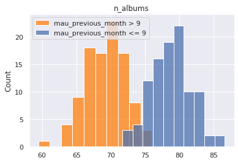
    


    mau_previous_month 0.9


    
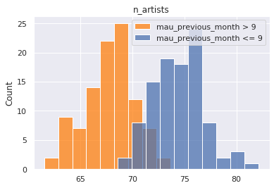
    


    mau_previous_month 0.9


    

    


    mau_previous_month 0.9


    

    


    mau_previous_month 0.99


    

    


    mau_previous_month 0.99


    

    


    mau_previous_month 0.99


    
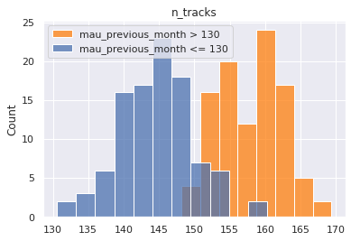
    


    mau_previous_month 0.99


    

    


    mau_both_months 0.9


    

    


    mau_both_months 0.9


    

    


    mau_both_months 0.9


    

    


    mau_both_months 0.9


    
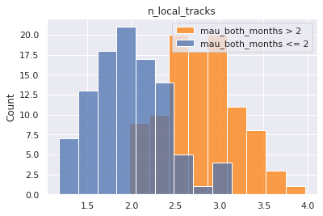
    


    mau_both_months 0.99


    

    


    mau_both_months 0.99


    
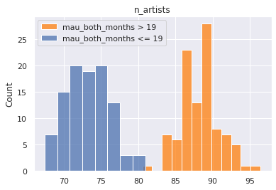
    


    mau_both_months 0.99


    

    


    mau_both_months 0.99


    

    


    mau 0.9


    
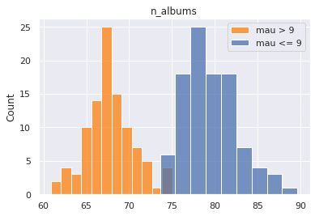
    


    mau 0.9


    
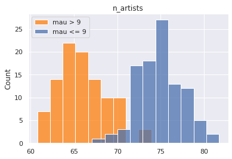
    


    mau 0.9


    

    


    mau 0.9


    

    


    mau 0.99


    

    


    mau 0.99


    

    


    mau 0.99


    
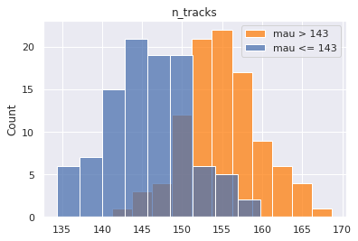
    


    mau 0.99


    

    


    monthly_stream30s 0.9


    

    


    monthly_stream30s 0.9


    

    


    monthly_stream30s 0.9


    
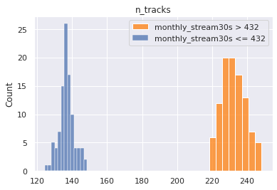
    


    monthly_stream30s 0.9


    

    


    monthly_stream30s 0.99


    

    


    monthly_stream30s 0.99


    

    


    monthly_stream30s 0.99


    
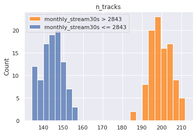
    


    monthly_stream30s 0.99


    

    


    stream30s 0.9


    

    


    stream30s 0.9


    

    


    stream30s 0.9


    

    


    stream30s 0.9


    

    


    stream30s 0.99


    

    


    stream30s 0.99


    

    


    stream30s 0.99


    

    


    stream30s 0.99


    

    


<div>
<style scoped>
    .dataframe tbody tr th:only-of-type {
        vertical-align: middle;
    }

    .dataframe tbody tr th {
        vertical-align: top;
    }

    .dataframe thead th {
        text-align: right;
    }
</style>
<table border="1" class="dataframe">
  <thead>
    <tr style="text-align: right;">
      <th></th>
      <th>target</th>
      <th>quantile</th>
      <th>feature</th>
      <th>test stat</th>
      <th>p-value</th>
      <th>upper q avg</th>
      <th>lower q avg</th>
      <th>reject null</th>
    </tr>
  </thead>
  <tbody>
    <tr>
      <th>0</th>
      <td>mau_previous_month</td>
      <td>0.90</td>
      <td>n_albums</td>
      <td>-23.264501</td>
      <td>1.517148e-58</td>
      <td>69.19828</td>
      <td>78.75130</td>
      <td>True</td>
    </tr>
    <tr>
      <th>1</th>
      <td>mau_previous_month</td>
      <td>0.90</td>
      <td>n_artists</td>
      <td>-19.090166</td>
      <td>9.131465e-47</td>
      <td>67.78967</td>
      <td>74.42581</td>
      <td>True</td>
    </tr>
    <tr>
      <th>2</th>
      <td>mau_previous_month</td>
      <td>0.90</td>
      <td>n_local_tracks</td>
      <td>-8.591563</td>
      <td>3.210041e-15</td>
      <td>1.68487</td>
      <td>2.13934</td>
      <td>True</td>
    </tr>
    <tr>
      <th>3</th>
      <td>mau_previous_month</td>
      <td>0.90</td>
      <td>n_tracks</td>
      <td>4.900218</td>
      <td>2.017971e-06</td>
      <td>149.27223</td>
      <td>145.40243</td>
      <td>True</td>
    </tr>
    <tr>
      <th>0</th>
      <td>mau_previous_month</td>
      <td>0.99</td>
      <td>n_tracks</td>
      <td>19.149805</td>
      <td>1.101097e-46</td>
      <td>157.92259</td>
      <td>144.56996</td>
      <td>True</td>
    </tr>
    <tr>
      <th>1</th>
      <td>mau_previous_month</td>
      <td>0.99</td>
      <td>n_artists</td>
      <td>9.668152</td>
      <td>4.508161e-18</td>
      <td>77.26126</td>
      <td>73.71656</td>
      <td>True</td>
    </tr>
    <tr>
      <th>2</th>
      <td>mau_previous_month</td>
      <td>0.99</td>
      <td>n_local_tracks</td>
      <td>-4.443426</td>
      <td>1.514586e-05</td>
      <td>1.89286</td>
      <td>2.11507</td>
      <td>True</td>
    </tr>
    <tr>
      <th>3</th>
      <td>mau_previous_month</td>
      <td>0.99</td>
      <td>n_albums</td>
      <td>1.862787</td>
      <td>6.399527e-02</td>
      <td>78.89529</td>
      <td>78.24458</td>
      <td>False</td>
    </tr>
    <tr>
      <th>0</th>
      <td>mau_both_months</td>
      <td>0.90</td>
      <td>n_tracks</td>
      <td>49.521659</td>
      <td>1.017659e-108</td>
      <td>181.22258</td>
      <td>141.77758</td>
      <td>True</td>
    </tr>
    <tr>
      <th>1</th>
      <td>mau_both_months</td>
      <td>0.90</td>
      <td>n_albums</td>
      <td>44.662168</td>
      <td>7.684105e-105</td>
      <td>96.16066</td>
      <td>75.92092</td>
      <td>True</td>
    </tr>
    <tr>
      <th>2</th>
      <td>mau_both_months</td>
      <td>0.90</td>
      <td>n_artists</td>
      <td>44.359056</td>
      <td>9.041628e-103</td>
      <td>90.79743</td>
      <td>72.15272</td>
      <td>True</td>
    </tr>
    <tr>
      <th>3</th>
      <td>mau_both_months</td>
      <td>0.90</td>
      <td>n_local_tracks</td>
      <td>13.737285</td>
      <td>1.342361e-30</td>
      <td>2.78731</td>
      <td>1.97483</td>
      <td>True</td>
    </tr>
    <tr>
      <th>0</th>
      <td>mau_both_months</td>
      <td>0.99</td>
      <td>n_tracks</td>
      <td>43.038413</td>
      <td>5.369851e-102</td>
      <td>175.40377</td>
      <td>145.00116</td>
      <td>True</td>
    </tr>
    <tr>
      <th>1</th>
      <td>mau_both_months</td>
      <td>0.99</td>
      <td>n_artists</td>
      <td>38.561073</td>
      <td>1.471847e-93</td>
      <td>88.24552</td>
      <td>73.26184</td>
      <td>True</td>
    </tr>
    <tr>
      <th>2</th>
      <td>mau_both_months</td>
      <td>0.99</td>
      <td>n_albums</td>
      <td>34.193348</td>
      <td>1.157948e-84</td>
      <td>91.12947</td>
      <td>77.20951</td>
      <td>True</td>
    </tr>
    <tr>
      <th>3</th>
      <td>mau_both_months</td>
      <td>0.99</td>
      <td>n_local_tracks</td>
      <td>6.722576</td>
      <td>1.917602e-10</td>
      <td>2.56940</td>
      <td>2.10191</td>
      <td>True</td>
    </tr>
    <tr>
      <th>0</th>
      <td>mau</td>
      <td>0.90</td>
      <td>n_albums</td>
      <td>-28.035344</td>
      <td>2.209065e-70</td>
      <td>67.80156</td>
      <td>79.48186</td>
      <td>True</td>
    </tr>
    <tr>
      <th>1</th>
      <td>mau</td>
      <td>0.90</td>
      <td>n_artists</td>
      <td>-23.052205</td>
      <td>7.021697e-58</td>
      <td>66.03151</td>
      <td>74.84314</td>
      <td>True</td>
    </tr>
    <tr>
      <th>2</th>
      <td>mau</td>
      <td>0.90</td>
      <td>n_local_tracks</td>
      <td>-9.891800</td>
      <td>5.454116e-19</td>
      <td>1.57376</td>
      <td>2.12208</td>
      <td>True</td>
    </tr>
    <tr>
      <th>3</th>
      <td>mau</td>
      <td>0.90</td>
      <td>n_tracks</td>
      <td>1.804461</td>
      <td>7.267873e-02</td>
      <td>146.48072</td>
      <td>145.09618</td>
      <td>False</td>
    </tr>
    <tr>
      <th>0</th>
      <td>mau</td>
      <td>0.99</td>
      <td>n_tracks</td>
      <td>12.627041</td>
      <td>3.513887e-27</td>
      <td>155.01260</td>
      <td>145.83850</td>
      <td>True</td>
    </tr>
    <tr>
      <th>1</th>
      <td>mau</td>
      <td>0.99</td>
      <td>n_artists</td>
      <td>7.983360</td>
      <td>1.264344e-13</td>
      <td>76.43482</td>
      <td>73.73105</td>
      <td>True</td>
    </tr>
    <tr>
      <th>2</th>
      <td>mau</td>
      <td>0.99</td>
      <td>n_local_tracks</td>
      <td>-6.172898</td>
      <td>4.276522e-09</td>
      <td>1.76129</td>
      <td>2.07410</td>
      <td>True</td>
    </tr>
    <tr>
      <th>3</th>
      <td>mau</td>
      <td>0.99</td>
      <td>n_albums</td>
      <td>1.442954</td>
      <td>1.506168e-01</td>
      <td>78.53564</td>
      <td>77.96526</td>
      <td>False</td>
    </tr>
    <tr>
      <th>0</th>
      <td>monthly_stream30s</td>
      <td>0.90</td>
      <td>n_tracks</td>
      <td>116.726338</td>
      <td>2.452095e-164</td>
      <td>232.32350</td>
      <td>136.98027</td>
      <td>True</td>
    </tr>
    <tr>
      <th>1</th>
      <td>monthly_stream30s</td>
      <td>0.90</td>
      <td>n_artists</td>
      <td>92.368904</td>
      <td>2.578108e-157</td>
      <td>108.07236</td>
      <td>70.08310</td>
      <td>True</td>
    </tr>
    <tr>
      <th>2</th>
      <td>monthly_stream30s</td>
      <td>0.90</td>
      <td>n_albums</td>
      <td>86.396836</td>
      <td>1.619061e-153</td>
      <td>114.85460</td>
      <td>74.19437</td>
      <td>True</td>
    </tr>
    <tr>
      <th>3</th>
      <td>monthly_stream30s</td>
      <td>0.90</td>
      <td>n_local_tracks</td>
      <td>17.521798</td>
      <td>4.704385e-40</td>
      <td>3.01074</td>
      <td>1.97501</td>
      <td>True</td>
    </tr>
    <tr>
      <th>0</th>
      <td>monthly_stream30s</td>
      <td>0.99</td>
      <td>n_tracks</td>
      <td>72.651978</td>
      <td>1.071572e-144</td>
      <td>199.50667</td>
      <td>144.19406</td>
      <td>True</td>
    </tr>
    <tr>
      <th>1</th>
      <td>monthly_stream30s</td>
      <td>0.99</td>
      <td>n_albums</td>
      <td>40.530369</td>
      <td>8.810322e-98</td>
      <td>95.06869</td>
      <td>77.58295</td>
      <td>True</td>
    </tr>
    <tr>
      <th>2</th>
      <td>monthly_stream30s</td>
      <td>0.99</td>
      <td>n_artists</td>
      <td>41.165863</td>
      <td>1.560381e-97</td>
      <td>90.42413</td>
      <td>74.19337</td>
      <td>True</td>
    </tr>
    <tr>
      <th>3</th>
      <td>monthly_stream30s</td>
      <td>0.99</td>
      <td>n_local_tracks</td>
      <td>6.120756</td>
      <td>5.135842e-09</td>
      <td>2.37637</td>
      <td>2.04232</td>
      <td>True</td>
    </tr>
    <tr>
      <th>0</th>
      <td>stream30s</td>
      <td>0.90</td>
      <td>n_tracks</td>
      <td>90.846516</td>
      <td>2.364112e-160</td>
      <td>207.07344</td>
      <td>139.38590</td>
      <td>True</td>
    </tr>
    <tr>
      <th>1</th>
      <td>stream30s</td>
      <td>0.90</td>
      <td>n_albums</td>
      <td>68.563722</td>
      <td>6.972523e-137</td>
      <td>105.31471</td>
      <td>75.42986</td>
      <td>True</td>
    </tr>
    <tr>
      <th>2</th>
      <td>stream30s</td>
      <td>0.90</td>
      <td>n_artists</td>
      <td>68.402932</td>
      <td>2.057561e-132</td>
      <td>99.37767</td>
      <td>70.87686</td>
      <td>True</td>
    </tr>
    <tr>
      <th>3</th>
      <td>stream30s</td>
      <td>0.90</td>
      <td>n_local_tracks</td>
      <td>14.588639</td>
      <td>6.290309e-32</td>
      <td>2.89681</td>
      <td>1.93857</td>
      <td>True</td>
    </tr>
    <tr>
      <th>0</th>
      <td>stream30s</td>
      <td>0.99</td>
      <td>n_tracks</td>
      <td>77.043302</td>
      <td>2.214047e-149</td>
      <td>201.25989</td>
      <td>144.76511</td>
      <td>True</td>
    </tr>
    <tr>
      <th>1</th>
      <td>stream30s</td>
      <td>0.99</td>
      <td>n_artists</td>
      <td>47.632996</td>
      <td>2.794842e-107</td>
      <td>92.60628</td>
      <td>73.13416</td>
      <td>True</td>
    </tr>
    <tr>
      <th>2</th>
      <td>stream30s</td>
      <td>0.99</td>
      <td>n_albums</td>
      <td>44.900868</td>
      <td>5.246137e-103</td>
      <td>98.01367</td>
      <td>78.12288</td>
      <td>True</td>
    </tr>
    <tr>
      <th>3</th>
      <td>stream30s</td>
      <td>0.99</td>
      <td>n_local_tracks</td>
      <td>4.520672</td>
      <td>1.062456e-05</td>
      <td>2.29328</td>
      <td>2.05241</td>
      <td>True</td>
    </tr>
  </tbody>
</table>
</div>


```python
con_master
```


<div>
<style scoped>
    .dataframe tbody tr th:only-of-type {
        vertical-align: middle;
    }

    .dataframe tbody tr th {
        vertical-align: top;
    }

    .dataframe thead th {
        text-align: right;
    }
</style>
<table border="1" class="dataframe">
  <thead>
    <tr style="text-align: right;">
      <th></th>
      <th>target</th>
      <th>quantile</th>
      <th>feature</th>
      <th>test stat</th>
      <th>p-value</th>
      <th>upper q avg</th>
      <th>lower q avg</th>
      <th>reject null</th>
    </tr>
  </thead>
  <tbody>
    <tr>
      <th>0</th>
      <td>mau_previous_month</td>
      <td>0.90</td>
      <td>n_albums</td>
      <td>-23.264501</td>
      <td>1.517148e-58</td>
      <td>69.19828</td>
      <td>78.75130</td>
      <td>True</td>
    </tr>
    <tr>
      <th>1</th>
      <td>mau_previous_month</td>
      <td>0.90</td>
      <td>n_artists</td>
      <td>-19.090166</td>
      <td>9.131465e-47</td>
      <td>67.78967</td>
      <td>74.42581</td>
      <td>True</td>
    </tr>
    <tr>
      <th>2</th>
      <td>mau_previous_month</td>
      <td>0.90</td>
      <td>n_local_tracks</td>
      <td>-8.591563</td>
      <td>3.210041e-15</td>
      <td>1.68487</td>
      <td>2.13934</td>
      <td>True</td>
    </tr>
    <tr>
      <th>3</th>
      <td>mau_previous_month</td>
      <td>0.90</td>
      <td>n_tracks</td>
      <td>4.900218</td>
      <td>2.017971e-06</td>
      <td>149.27223</td>
      <td>145.40243</td>
      <td>True</td>
    </tr>
    <tr>
      <th>0</th>
      <td>mau_previous_month</td>
      <td>0.99</td>
      <td>n_tracks</td>
      <td>19.149805</td>
      <td>1.101097e-46</td>
      <td>157.92259</td>
      <td>144.56996</td>
      <td>True</td>
    </tr>
    <tr>
      <th>1</th>
      <td>mau_previous_month</td>
      <td>0.99</td>
      <td>n_artists</td>
      <td>9.668152</td>
      <td>4.508161e-18</td>
      <td>77.26126</td>
      <td>73.71656</td>
      <td>True</td>
    </tr>
    <tr>
      <th>2</th>
      <td>mau_previous_month</td>
      <td>0.99</td>
      <td>n_local_tracks</td>
      <td>-4.443426</td>
      <td>1.514586e-05</td>
      <td>1.89286</td>
      <td>2.11507</td>
      <td>True</td>
    </tr>
    <tr>
      <th>3</th>
      <td>mau_previous_month</td>
      <td>0.99</td>
      <td>n_albums</td>
      <td>1.862787</td>
      <td>6.399527e-02</td>
      <td>78.89529</td>
      <td>78.24458</td>
      <td>False</td>
    </tr>
    <tr>
      <th>0</th>
      <td>mau_both_months</td>
      <td>0.90</td>
      <td>n_tracks</td>
      <td>49.521659</td>
      <td>1.017659e-108</td>
      <td>181.22258</td>
      <td>141.77758</td>
      <td>True</td>
    </tr>
    <tr>
      <th>1</th>
      <td>mau_both_months</td>
      <td>0.90</td>
      <td>n_albums</td>
      <td>44.662168</td>
      <td>7.684105e-105</td>
      <td>96.16066</td>
      <td>75.92092</td>
      <td>True</td>
    </tr>
    <tr>
      <th>2</th>
      <td>mau_both_months</td>
      <td>0.90</td>
      <td>n_artists</td>
      <td>44.359056</td>
      <td>9.041628e-103</td>
      <td>90.79743</td>
      <td>72.15272</td>
      <td>True</td>
    </tr>
    <tr>
      <th>3</th>
      <td>mau_both_months</td>
      <td>0.90</td>
      <td>n_local_tracks</td>
      <td>13.737285</td>
      <td>1.342361e-30</td>
      <td>2.78731</td>
      <td>1.97483</td>
      <td>True</td>
    </tr>
    <tr>
      <th>0</th>
      <td>mau_both_months</td>
      <td>0.99</td>
      <td>n_tracks</td>
      <td>43.038413</td>
      <td>5.369851e-102</td>
      <td>175.40377</td>
      <td>145.00116</td>
      <td>True</td>
    </tr>
    <tr>
      <th>1</th>
      <td>mau_both_months</td>
      <td>0.99</td>
      <td>n_artists</td>
      <td>38.561073</td>
      <td>1.471847e-93</td>
      <td>88.24552</td>
      <td>73.26184</td>
      <td>True</td>
    </tr>
    <tr>
      <th>2</th>
      <td>mau_both_months</td>
      <td>0.99</td>
      <td>n_albums</td>
      <td>34.193348</td>
      <td>1.157948e-84</td>
      <td>91.12947</td>
      <td>77.20951</td>
      <td>True</td>
    </tr>
    <tr>
      <th>3</th>
      <td>mau_both_months</td>
      <td>0.99</td>
      <td>n_local_tracks</td>
      <td>6.722576</td>
      <td>1.917602e-10</td>
      <td>2.56940</td>
      <td>2.10191</td>
      <td>True</td>
    </tr>
    <tr>
      <th>0</th>
      <td>mau</td>
      <td>0.90</td>
      <td>n_albums</td>
      <td>-28.035344</td>
      <td>2.209065e-70</td>
      <td>67.80156</td>
      <td>79.48186</td>
      <td>True</td>
    </tr>
    <tr>
      <th>1</th>
      <td>mau</td>
      <td>0.90</td>
      <td>n_artists</td>
      <td>-23.052205</td>
      <td>7.021697e-58</td>
      <td>66.03151</td>
      <td>74.84314</td>
      <td>True</td>
    </tr>
    <tr>
      <th>2</th>
      <td>mau</td>
      <td>0.90</td>
      <td>n_local_tracks</td>
      <td>-9.891800</td>
      <td>5.454116e-19</td>
      <td>1.57376</td>
      <td>2.12208</td>
      <td>True</td>
    </tr>
    <tr>
      <th>3</th>
      <td>mau</td>
      <td>0.90</td>
      <td>n_tracks</td>
      <td>1.804461</td>
      <td>7.267873e-02</td>
      <td>146.48072</td>
      <td>145.09618</td>
      <td>False</td>
    </tr>
    <tr>
      <th>0</th>
      <td>mau</td>
      <td>0.99</td>
      <td>n_tracks</td>
      <td>12.627041</td>
      <td>3.513887e-27</td>
      <td>155.01260</td>
      <td>145.83850</td>
      <td>True</td>
    </tr>
    <tr>
      <th>1</th>
      <td>mau</td>
      <td>0.99</td>
      <td>n_artists</td>
      <td>7.983360</td>
      <td>1.264344e-13</td>
      <td>76.43482</td>
      <td>73.73105</td>
      <td>True</td>
    </tr>
    <tr>
      <th>2</th>
      <td>mau</td>
      <td>0.99</td>
      <td>n_local_tracks</td>
      <td>-6.172898</td>
      <td>4.276522e-09</td>
      <td>1.76129</td>
      <td>2.07410</td>
      <td>True</td>
    </tr>
    <tr>
      <th>3</th>
      <td>mau</td>
      <td>0.99</td>
      <td>n_albums</td>
      <td>1.442954</td>
      <td>1.506168e-01</td>
      <td>78.53564</td>
      <td>77.96526</td>
      <td>False</td>
    </tr>
    <tr>
      <th>0</th>
      <td>monthly_stream30s</td>
      <td>0.90</td>
      <td>n_tracks</td>
      <td>116.726338</td>
      <td>2.452095e-164</td>
      <td>232.32350</td>
      <td>136.98027</td>
      <td>True</td>
    </tr>
    <tr>
      <th>1</th>
      <td>monthly_stream30s</td>
      <td>0.90</td>
      <td>n_artists</td>
      <td>92.368904</td>
      <td>2.578108e-157</td>
      <td>108.07236</td>
      <td>70.08310</td>
      <td>True</td>
    </tr>
    <tr>
      <th>2</th>
      <td>monthly_stream30s</td>
      <td>0.90</td>
      <td>n_albums</td>
      <td>86.396836</td>
      <td>1.619061e-153</td>
      <td>114.85460</td>
      <td>74.19437</td>
      <td>True</td>
    </tr>
    <tr>
      <th>3</th>
      <td>monthly_stream30s</td>
      <td>0.90</td>
      <td>n_local_tracks</td>
      <td>17.521798</td>
      <td>4.704385e-40</td>
      <td>3.01074</td>
      <td>1.97501</td>
      <td>True</td>
    </tr>
    <tr>
      <th>0</th>
      <td>monthly_stream30s</td>
      <td>0.99</td>
      <td>n_tracks</td>
      <td>72.651978</td>
      <td>1.071572e-144</td>
      <td>199.50667</td>
      <td>144.19406</td>
      <td>True</td>
    </tr>
    <tr>
      <th>1</th>
      <td>monthly_stream30s</td>
      <td>0.99</td>
      <td>n_albums</td>
      <td>40.530369</td>
      <td>8.810322e-98</td>
      <td>95.06869</td>
      <td>77.58295</td>
      <td>True</td>
    </tr>
    <tr>
      <th>2</th>
      <td>monthly_stream30s</td>
      <td>0.99</td>
      <td>n_artists</td>
      <td>41.165863</td>
      <td>1.560381e-97</td>
      <td>90.42413</td>
      <td>74.19337</td>
      <td>True</td>
    </tr>
    <tr>
      <th>3</th>
      <td>monthly_stream30s</td>
      <td>0.99</td>
      <td>n_local_tracks</td>
      <td>6.120756</td>
      <td>5.135842e-09</td>
      <td>2.37637</td>
      <td>2.04232</td>
      <td>True</td>
    </tr>
    <tr>
      <th>0</th>
      <td>stream30s</td>
      <td>0.90</td>
      <td>n_tracks</td>
      <td>90.846516</td>
      <td>2.364112e-160</td>
      <td>207.07344</td>
      <td>139.38590</td>
      <td>True</td>
    </tr>
    <tr>
      <th>1</th>
      <td>stream30s</td>
      <td>0.90</td>
      <td>n_albums</td>
      <td>68.563722</td>
      <td>6.972523e-137</td>
      <td>105.31471</td>
      <td>75.42986</td>
      <td>True</td>
    </tr>
    <tr>
      <th>2</th>
      <td>stream30s</td>
      <td>0.90</td>
      <td>n_artists</td>
      <td>68.402932</td>
      <td>2.057561e-132</td>
      <td>99.37767</td>
      <td>70.87686</td>
      <td>True</td>
    </tr>
    <tr>
      <th>3</th>
      <td>stream30s</td>
      <td>0.90</td>
      <td>n_local_tracks</td>
      <td>14.588639</td>
      <td>6.290309e-32</td>
      <td>2.89681</td>
      <td>1.93857</td>
      <td>True</td>
    </tr>
    <tr>
      <th>0</th>
      <td>stream30s</td>
      <td>0.99</td>
      <td>n_tracks</td>
      <td>77.043302</td>
      <td>2.214047e-149</td>
      <td>201.25989</td>
      <td>144.76511</td>
      <td>True</td>
    </tr>
    <tr>
      <th>1</th>
      <td>stream30s</td>
      <td>0.99</td>
      <td>n_artists</td>
      <td>47.632996</td>
      <td>2.794842e-107</td>
      <td>92.60628</td>
      <td>73.13416</td>
      <td>True</td>
    </tr>
    <tr>
      <th>2</th>
      <td>stream30s</td>
      <td>0.99</td>
      <td>n_albums</td>
      <td>44.900868</td>
      <td>5.246137e-103</td>
      <td>98.01367</td>
      <td>78.12288</td>
      <td>True</td>
    </tr>
    <tr>
      <th>3</th>
      <td>stream30s</td>
      <td>0.99</td>
      <td>n_local_tracks</td>
      <td>4.520672</td>
      <td>1.062456e-05</td>
      <td>2.29328</td>
      <td>2.05241</td>
      <td>True</td>
    </tr>
  </tbody>
</table>
</div>


```python
con_master.to_csv("t_test_results.csv")
```

#### Models (Multi-Feature Analysis)

##### Deciles - Random Forest


```python
sub_targets
```


    ['mau_previous_month',
     'mau_both_months',
     'mau',
     'monthly_stream30s',
     'stream30s']


```python
target = sub_targets[-2]
```


```python
y = df[target].values
labels = y.copy()
names = []
for idx, quant in zip(range(11), np.linspace(0, 1, num=11)):
    if idx == 0:
        prev = quant
        continue
    if idx == 1:
        labels[labels <= np.quantile(y, quant)] = idx
        names += [f"less than {np.quantile(y, quant):.0f} listens"]
    else:
        labels[(labels > np.quantile(y, prev))
              &(labels <= np.quantile(y, quant))] = idx
        names += [f"{np.quantile(y, prev):.0f} < listens <= {np.quantile(y, quant):.0f}"]
    prev = quant
y = labels
```


```python
names
```


    ['less than 13 listens',
     '13 < listens <= 24',
     '24 < listens <= 38',
     '38 < listens <= 55',
     '55 < listens <= 79',
     '79 < listens <= 111',
     '111 < listens <= 159',
     '159 < listens <= 240',
     '240 < listens <= 432',
     '432 < listens <= 42497334']


```python
X = df[des_features + con_features]
enc = OneHotEncoder()
std = StandardScaler()

X_cat = enc.fit_transform(X[des_features]).toarray()
X_con = std.fit_transform(X[con_features])
X = np.hstack((X_con, X_cat))

X_train, X_test, y_train, y_test = train_test_split(X, y, random_state=42, train_size=0.8)
```


```python
model = RandomForestClassifier()
model.fit(X_train, y_train)
```


    RandomForestClassifier()


```python
y_hat_test = model.predict(X_test)
print(f"Train Acc: {accuracy_score(y_test, y_hat_test):.2f}")
print(f"Test Acc: {accuracy_score(y_test, y_hat_test):.2f}")
```

    Train Acc: 0.14
    Test Acc: 0.14


```python
print(classification_report(y_test, y_hat_test, zero_division=0))
```

                  precision    recall  f1-score   support
    
               1       0.19      0.26      0.22      8363
               2       0.13      0.13      0.13      7866
               3       0.13      0.12      0.13      8173
               4       0.10      0.09      0.10      7773
               5       0.11      0.10      0.10      8252
               6       0.11      0.09      0.10      7976
               7       0.11      0.10      0.10      8018
               8       0.12      0.10      0.11      8185
               9       0.14      0.14      0.14      8009
              10       0.20      0.26      0.23      8059
    
        accuracy                           0.14     80674
       macro avg       0.13      0.14      0.14     80674
    weighted avg       0.13      0.14      0.14     80674
    


```python
fig, ax = plt.subplots(1, 1, figsize = (10, 10))
sns.heatmap(confusion_matrix(y_test, y_hat_test), annot=True, ax=ax, xticklabels=names, yticklabels=names)
```


    <AxesSubplot:>


    

    


```python
# grab feature importances
imp = model.feature_importances_

# their std
std = np.std([tree.feature_importances_ for tree in model.estimators_], axis=0)

# build feature names
feature_names = con_features + list(enc.get_feature_names_out())

# create new dataframe
feat = pd.DataFrame([feature_names, imp, std]).T
feat.columns = ['feature', 'importance', 'std']
feat = feat.sort_values('importance', ascending=False)
feat = feat.reset_index(drop=True)
feat.dropna(inplace=True)
feat.head(20)
```


<div>
<style scoped>
    .dataframe tbody tr th:only-of-type {
        vertical-align: middle;
    }

    .dataframe tbody tr th {
        vertical-align: top;
    }

    .dataframe thead th {
        text-align: right;
    }
</style>
<table border="1" class="dataframe">
  <thead>
    <tr style="text-align: right;">
      <th></th>
      <th>feature</th>
      <th>importance</th>
      <th>std</th>
    </tr>
  </thead>
  <tbody>
    <tr>
      <th>0</th>
      <td>n_tracks</td>
      <td>0.152852</td>
      <td>0.006907</td>
    </tr>
    <tr>
      <th>1</th>
      <td>n_albums</td>
      <td>0.135581</td>
      <td>0.007403</td>
    </tr>
    <tr>
      <th>2</th>
      <td>n_artists</td>
      <td>0.133666</td>
      <td>0.007421</td>
    </tr>
    <tr>
      <th>3</th>
      <td>n_local_tracks</td>
      <td>0.038311</td>
      <td>0.005365</td>
    </tr>
    <tr>
      <th>4</th>
      <td>genre_2_Pop</td>
      <td>0.011607</td>
      <td>0.000991</td>
    </tr>
    <tr>
      <th>5</th>
      <td>genre_3_Pop</td>
      <td>0.01145</td>
      <td>0.003792</td>
    </tr>
    <tr>
      <th>6</th>
      <td>genre_3_Alternative</td>
      <td>0.010917</td>
      <td>0.002062</td>
    </tr>
    <tr>
      <th>7</th>
      <td>genre_3_Rock</td>
      <td>0.009709</td>
      <td>0.002517</td>
    </tr>
    <tr>
      <th>8</th>
      <td>mood_3_Excited</td>
      <td>0.009644</td>
      <td>0.000618</td>
    </tr>
    <tr>
      <th>9</th>
      <td>mood_2_Excited</td>
      <td>0.009271</td>
      <td>0.000782</td>
    </tr>
    <tr>
      <th>10</th>
      <td>genre_2_Alternative</td>
      <td>0.009073</td>
      <td>0.003263</td>
    </tr>
    <tr>
      <th>11</th>
      <td>mood_3_Yearning</td>
      <td>0.00904</td>
      <td>0.001758</td>
    </tr>
    <tr>
      <th>12</th>
      <td>genre_3_Indie Rock</td>
      <td>0.00876</td>
      <td>0.000795</td>
    </tr>
    <tr>
      <th>13</th>
      <td>mood_3_Defiant</td>
      <td>0.008758</td>
      <td>0.000674</td>
    </tr>
    <tr>
      <th>14</th>
      <td>mood_3_Urgent</td>
      <td>0.008581</td>
      <td>0.000502</td>
    </tr>
    <tr>
      <th>15</th>
      <td>mood_2_Defiant</td>
      <td>0.008537</td>
      <td>0.000787</td>
    </tr>
    <tr>
      <th>16</th>
      <td>mood_3_Empowering</td>
      <td>0.008351</td>
      <td>0.001044</td>
    </tr>
    <tr>
      <th>17</th>
      <td>mood_3_Sensual</td>
      <td>0.008343</td>
      <td>0.000575</td>
    </tr>
    <tr>
      <th>18</th>
      <td>mood_2_Yearning</td>
      <td>0.008315</td>
      <td>0.00197</td>
    </tr>
    <tr>
      <th>19</th>
      <td>genre_2_Rock</td>
      <td>0.008229</td>
      <td>0.000827</td>
    </tr>
  </tbody>
</table>
</div>


##### Quartiles - Random Forest


```python
### Create Categories

y = df[target].values
labels = y.copy()
names = []
lim = 5
for idx, quant in zip(range(lim), np.linspace(0, 1, num=lim)):
    if idx == 0:
        prev = quant
        continue
    if idx == 1:
        labels[labels <= np.quantile(y, quant)] = idx
        names += [f"less than {np.quantile(y, quant):.0f} listens"]
    else:
        labels[(labels > np.quantile(y, prev))
              &(labels <= np.quantile(y, quant))] = idx
        names += [f"{np.quantile(y, prev):.0f} < listens <= {np.quantile(y, quant):.0f}"]
    prev = quant
y = labels

### Create Training Data

X = df[des_features + con_features]
enc = OneHotEncoder()
std = StandardScaler()

X_cat = enc.fit_transform(X[des_features]).toarray()
X_con = std.fit_transform(X[con_features])
X = np.hstack((X_con, X_cat))

X_train, X_test, y_train, y_test = train_test_split(X, y, random_state=42, train_size=0.8)

### Train Model

model = RandomForestClassifier()
model.fit(X_train, y_train)

### Asses Performance

y_hat_test = model.predict(X_test)
y_hat_train = model.predict(X_train)
print(f"Train Acc: {accuracy_score(y_train, y_hat_train):.2f}")
print(f"Test Acc: {accuracy_score(y_test, y_hat_test):.2f}")

print(classification_report(y_test, y_hat_test, zero_division=0))

fig, ax = plt.subplots(1, 1, figsize = (8,7))
sns.heatmap(confusion_matrix(y_test, y_hat_test), annot=True, ax=ax)
```

    Train Acc: 0.99
    Test Acc: 0.33
                  precision    recall  f1-score   support
    
               1       0.37      0.43      0.40     20461
               2       0.27      0.23      0.25     19966
               3       0.27      0.23      0.25     20082
               4       0.39      0.44      0.41     20165
    
        accuracy                           0.33     80674
       macro avg       0.33      0.33      0.33     80674
    weighted avg       0.33      0.33      0.33     80674
    


    <AxesSubplot:>


    

    


##### Binary, 90th Percentile, Random Forest


```python
### Create Categories

y = df[target].values
labels = y.copy()
names = []
weights = y.copy()
weights.dtype = 'float'
lim = 5
dom_class_weight = 1 / (lim - 1 - 1)
for idx, quant in zip(range(lim), np.linspace(0, 1, num=lim)):
    if idx < lim - 2:
        prev = quant
        continue
    elif idx == lim - 2:
        weights[y <= np.quantile(y, quant)] = dom_class_weight
        labels[labels <= np.quantile(y, quant)] = idx
        names += [f"less than {np.quantile(y, quant):.0f} listens"]
        
    else:
        labels[(labels > np.quantile(y, prev))
              &(labels <= np.quantile(y, quant))] = idx
        weights[(y > np.quantile(y, prev))
              &(y <= np.quantile(y, quant))] = 1.0
        names += [f"{np.quantile(y, prev):.0f} < listens <= {np.quantile(y, quant):.0f}"]
        
    prev = quant
y = labels
```


```python
### Create Training Data

X = df[des_features + con_features]
enc = OneHotEncoder()
std = StandardScaler()

X_cat = enc.fit_transform(X[des_features]).toarray()
X_con = std.fit_transform(X[con_features])
X = np.hstack((X_con, X_cat))

X_train, X_test, y_train, y_test, weight_train, weight_test = train_test_split(X, y, weights, random_state=42, train_size=0.8)


### Strateification Code

# strat_y0_idx = np.array(random.sample(list(np.argwhere(y_train==3).reshape(-1)), np.unique(y_train, return_counts=True)[1][1]))
# strat_y1_idx = np.argwhere(y_train==4).reshape(-1)
# strat_idx = np.hstack((strat_y0_idx, strat_y1_idx))
# X_train = X_train[strat_idx]
# y_train = y_train[strat_idx]
```


```python
### Train Model

model = RandomForestClassifier()
model.fit(X_train, y_train)

### Assess Performance

y_hat_test = model.predict(X_test)
y_hat_train = model.predict(X_train)
print(f"Train Acc: {accuracy_score(y_train, y_hat_train):.2f}")
print(f"Test Acc: {accuracy_score(y_test, y_hat_test):.2f}")

print(classification_report(y_test, y_hat_test, zero_division=0))

fig, ax = plt.subplots(1, 1, figsize = (8,7))
sns.heatmap(confusion_matrix(y_test, y_hat_test), annot=True, ax=ax)
```

    /home/wbeckner/anaconda3/envs/py39/lib/python3.9/site-packages/sklearn/linear_model/_logistic.py:814: ConvergenceWarning: lbfgs failed to converge (status=1):
    STOP: TOTAL NO. of ITERATIONS REACHED LIMIT.
    
    Increase the number of iterations (max_iter) or scale the data as shown in:
        https://scikit-learn.org/stable/modules/preprocessing.html
    Please also refer to the documentation for alternative solver options:
        https://scikit-learn.org/stable/modules/linear_model.html#logistic-regression
      n_iter_i = _check_optimize_result(


    Train Acc: 0.76
    Test Acc: 0.76
                  precision    recall  f1-score   support
    
               3       0.76      0.98      0.86     60509
               4       0.58      0.08      0.13     20165
    
        accuracy                           0.76     80674
       macro avg       0.67      0.53      0.50     80674
    weighted avg       0.72      0.76      0.68     80674
    


    <AxesSubplot:>


    

    


##### Forward Selection Model


```python
### y
print(target)
y = df[target].values
labels = y.copy()
names = []
weights = y.copy()
weights.dtype = 'float'
lim = 11
dom_class_weight = 1 / (lim - 1 - 1)
for idx, quant in zip(range(lim), np.linspace(0, 1, num=lim)):
    if idx < lim - 2:
        prev = quant
        continue
    elif idx == lim - 2:
        weights[y <= np.quantile(y, quant)] = dom_class_weight
        labels[labels <= np.quantile(y, quant)] = 0
        names += [f"less than {np.quantile(y, quant):.0f} listens"]
        
    else:
        labels[(labels > np.quantile(y, prev))
              & (labels <= np.quantile(y, quant))] = 1
        weights[(y > np.quantile(y, prev))
              & (y <= np.quantile(y, quant))] = 1.0
        names += [f"{np.quantile(y, prev):.0f} < listens <= {np.quantile(y, quant):.0f}"]
    prev = quant
y = labels

#### X

X = df[des_features + con_features]

enc = OneHotEncoder()
std = StandardScaler()

X_cat = enc.fit_transform(X[des_features]).toarray()
X_con = std.fit_transform(X[con_features])
X = np.hstack((np.ones((X_con.shape[0], 1)), X_con, X_cat))
feature_names = ['intercept'] + con_features + list(enc.get_feature_names_out())

data = pd.DataFrame(X, columns=feature_names)
print(names)
```

    monthly_stream30s
    ['less than 432 listens', '432 < listens <= 42497334']


```python
def add_feature(feature_names, basemodel, data, y, r2max=0, model='linear', disp=0):
    feature_max = None
    bestsum = None
    newmodel = None
    for feature in feature_names:
        basemodel[feature] = data[feature]
        X2 = basemodel.values
        est = Logit(y, X2)
        est2 = est.fit(disp=0)
        summ = est2.summary()
        score = float(str(pd.DataFrame(summ.tables[0]).loc[3, 3]))
        if (score > r2max) and not (est2.pvalues > cutoff).any():
            r2max = score
            feature_max = feature
            bestsum = est2.summary()
            newmodel = basemodel.copy()
            if disp == 1:
                print(f"new r2max, {feature_max}, {r2max}")
        basemodel.drop(labels = feature, axis = 1, inplace = True)
    return r2max, feature_max, bestsum, newmodel
```


```python
candidates = feature_names.copy()
basemodel = pd.DataFrame()
r2max = 0
```


```python
with open("canidates.txt", "w+") as f:
    file_data = f.read()
    for i in candidates:
        f.write(f"{i}\n")
```


```python
basemodel.to_csv("basemodel.csv")
```


```python
with open("canidates.txt", "r") as f:
    # file_data = f.read()
    new = []
    for line in f:
        current_place = line[:-1]
        new.append(current_place)
```


```python
new = pd.read_csv("basemodel.csv", index_col=0)
```


```python
with open("fwd_selection_results.txt", "r+") as f:
    for line in f:
        pass
    lastline = line[:-1]
    stuff = lastline.split(", ")
    new = float(stuff[-1])

```


```python
new
```


    0.04052


```python
while True:
    newr2max, feature_max, bestsum, newmodel = add_feature(
        feature_names=candidates, 
        basemodel=basemodel, 
        data=data, 
        y=y,
        r2max=r2max)    
    if newr2max > r2max:
        r2max = newr2max
        print(f"new r2max, {feature_max}, {r2max}")
        with open("fwd_selection_results.txt", "a+") as f:
            file_data = f.read()
            f.write(f"new r2max, {feature_max}, {r2max}\n")
        candidates.remove(feature_max)
        with open("canidates.txt", "w+") as f:
            file_data = f.read()
            for i in candidates:
                f.write(f"{i}\n")
        basemodel = newmodel
        basemodel.to_csv("basemodel.csv")
        continue
    else:
        break
```

    new r2max, n_albums, 0.02614
    new r2max, genre_1_Latin, 0.03093
    new r2max, genre_1_Indie Rock, 0.03274
    new r2max, genre_1_Rap, 0.03431
    new r2max, genre_1_Dance & House, 0.03568
    new r2max, genre_1_Rock, 0.03674
    new r2max, mood_1_Energizing, 0.03772
    new r2max, genre_1_Children's, 0.03863
    new r2max, mood_1_Tender, 0.03931
    new r2max, mood_1_Other, 0.03995
    new r2max, n_tracks, 0.04052


    ---------------------------------------------------------------------------

    KeyboardInterrupt                         Traceback (most recent call last)

    Input In [675], in <module>
          1 while True:
    ----> 2     newr2max, feature_max, bestsum, newmodel = add_feature(
          3         feature_names=candidates, 
          4         basemodel=basemodel, 
          5         data=data, 
          6         y=y,
          7         r2max=r2max)    
          8     if newr2max > r2max:
          9         r2max = newr2max


    Input In [669], in add_feature(feature_names, basemodel, data, y, r2max, model, disp)
          8 est = Logit(y, X2)
          9 est2 = est.fit(disp=0)
    ---> 10 summ = est2.summary()
         11 score = float(str(pd.DataFrame(summ.tables[0]).loc[3, 3]))
         12 if (score > r2max) and not (est2.pvalues > cutoff).any():


    File ~/anaconda3/envs/py39/lib/python3.9/site-packages/statsmodels/discrete/discrete_model.py:4015, in BinaryResults.summary(self, yname, xname, title, alpha, yname_list)
       4012 @Appender(DiscreteResults.summary.__doc__)
       4013 def summary(self, yname=None, xname=None, title=None, alpha=.05,
       4014             yname_list=None):
    -> 4015     smry = super(BinaryResults, self).summary(yname, xname, title, alpha,
       4016                                               yname_list)
       4017     fittedvalues = self.model.cdf(self.fittedvalues)
       4018     absprederror = np.abs(self.model.endog - fittedvalues)


    File ~/anaconda3/envs/py39/lib/python3.9/site-packages/statsmodels/discrete/discrete_model.py:3769, in DiscreteResults.summary(self, yname, xname, title, alpha, yname_list)
       3731 """
       3732 Summarize the Regression Results.
       3733 
       (...)
       3755 statsmodels.iolib.summary.Summary : Class that hold summary results.
       3756 """
       3758 top_left = [('Dep. Variable:', None),
       3759              ('Model:', [self.model.__class__.__name__]),
       3760              ('Method:', ['MLE']),
       (...)
       3763              ('converged:', ["%s" % self.mle_retvals['converged']]),
       3764             ]
       3766 top_right = [('No. Observations:', None),
       3767              ('Df Residuals:', None),
       3768              ('Df Model:', None),
    -> 3769              ('Pseudo R-squ.:', ["%#6.4g" % self.prsquared]),
       3770              ('Log-Likelihood:', None),
       3771              ('LL-Null:', ["%#8.5g" % self.llnull]),
       3772              ('LLR p-value:', ["%#6.4g" % self.llr_pvalue])
       3773              ]
       3775 if hasattr(self, 'cov_type'):
       3776     top_left.append(('Covariance Type:', [self.cov_type]))


    File ~/anaconda3/envs/py39/lib/python3.9/site-packages/pandas/_libs/properties.pyx:37, in pandas._libs.properties.CachedProperty.__get__()


    File ~/anaconda3/envs/py39/lib/python3.9/site-packages/statsmodels/discrete/discrete_model.py:3511, in DiscreteResults.prsquared(self)
       3506 @cache_readonly
       3507 def prsquared(self):
       3508     """
       3509     McFadden's pseudo-R-squared. `1 - (llf / llnull)`
       3510     """
    -> 3511     return 1 - self.llf/self.llnull


    File ~/anaconda3/envs/py39/lib/python3.9/site-packages/pandas/_libs/properties.pyx:37, in pandas._libs.properties.CachedProperty.__get__()


    File ~/anaconda3/envs/py39/lib/python3.9/site-packages/statsmodels/discrete/discrete_model.py:3604, in DiscreteResults.llnull(self)
       3601     res_null = mod_null.fit(start_params=sp_null, **opt_kwds)
       3602 else:
       3603     # this should be a reasonably method case across versions
    -> 3604     res_null = mod_null.fit(start_params=sp_null, method='nm',
       3605                             warn_convergence=False,
       3606                             maxiter=10000, disp=0)
       3607     res_null = mod_null.fit(start_params=res_null.params, method='bfgs',
       3608                             warn_convergence=False,
       3609                             maxiter=10000, disp=0)
       3611 if getattr(self, '_attach_nullmodel', False) is not False:


    File ~/anaconda3/envs/py39/lib/python3.9/site-packages/statsmodels/discrete/discrete_model.py:1983, in Logit.fit(self, start_params, method, maxiter, full_output, disp, callback, **kwargs)
       1980 @Appender(DiscreteModel.fit.__doc__)
       1981 def fit(self, start_params=None, method='newton', maxiter=35,
       1982         full_output=1, disp=1, callback=None, **kwargs):
    -> 1983     bnryfit = super().fit(start_params=start_params,
       1984                           method=method,
       1985                           maxiter=maxiter,
       1986                           full_output=full_output,
       1987                           disp=disp,
       1988                           callback=callback,
       1989                           **kwargs)
       1991     discretefit = LogitResults(self, bnryfit)
       1992     return BinaryResultsWrapper(discretefit)


    File ~/anaconda3/envs/py39/lib/python3.9/site-packages/statsmodels/discrete/discrete_model.py:230, in DiscreteModel.fit(self, start_params, method, maxiter, full_output, disp, callback, **kwargs)
        227 else:
        228     pass  # TODO: make a function factory to have multiple call-backs
    --> 230 mlefit = super().fit(start_params=start_params,
        231                      method=method,
        232                      maxiter=maxiter,
        233                      full_output=full_output,
        234                      disp=disp,
        235                      callback=callback,
        236                      **kwargs)
        238 return mlefit


    File ~/anaconda3/envs/py39/lib/python3.9/site-packages/statsmodels/base/model.py:563, in LikelihoodModel.fit(self, start_params, method, maxiter, full_output, disp, fargs, callback, retall, skip_hessian, **kwargs)
        560     del kwargs["use_t"]
        562 optimizer = Optimizer()
    --> 563 xopt, retvals, optim_settings = optimizer._fit(f, score, start_params,
        564                                                fargs, kwargs,
        565                                                hessian=hess,
        566                                                method=method,
        567                                                disp=disp,
        568                                                maxiter=maxiter,
        569                                                callback=callback,
        570                                                retall=retall,
        571                                                full_output=full_output)
        572 # Restore cov_type, cov_kwds and use_t
        573 optim_settings.update(kwds)


    File ~/anaconda3/envs/py39/lib/python3.9/site-packages/statsmodels/base/optimizer.py:241, in Optimizer._fit(self, objective, gradient, start_params, fargs, kwargs, hessian, method, maxiter, full_output, disp, callback, retall)
        238     fit_funcs.update(extra_fit_funcs)
        240 func = fit_funcs[method]
    --> 241 xopt, retvals = func(objective, gradient, start_params, fargs, kwargs,
        242                      disp=disp, maxiter=maxiter, callback=callback,
        243                      retall=retall, full_output=full_output,
        244                      hess=hessian)
        246 optim_settings = {'optimizer': method, 'start_params': start_params,
        247                   'maxiter': maxiter, 'full_output': full_output,
        248                   'disp': disp, 'fargs': fargs, 'callback': callback,
        249                   'retall': retall, "extra_fit_funcs": extra_fit_funcs}
        250 optim_settings.update(kwargs)


    File ~/anaconda3/envs/py39/lib/python3.9/site-packages/statsmodels/base/optimizer.py:728, in _fit_nm(f, score, start_params, fargs, kwargs, disp, maxiter, callback, retall, full_output, hess)
        726 ftol = kwargs.setdefault('ftol', 0.0001)
        727 maxfun = kwargs.setdefault('maxfun', None)
    --> 728 retvals = optimize.fmin(f, start_params, args=fargs, xtol=xtol,
        729                         ftol=ftol, maxiter=maxiter, maxfun=maxfun,
        730                         full_output=full_output, disp=disp, retall=retall,
        731                         callback=callback)
        732 if full_output:
        733     if not retall:


    File ~/anaconda3/envs/py39/lib/python3.9/site-packages/scipy/optimize/optimize.py:580, in fmin(func, x0, args, xtol, ftol, maxiter, maxfun, full_output, disp, retall, callback, initial_simplex)
        471 """
        472 Minimize a function using the downhill simplex algorithm.
        473 
       (...)
        570 
        571 """
        572 opts = {'xatol': xtol,
        573         'fatol': ftol,
        574         'maxiter': maxiter,
       (...)
        577         'return_all': retall,
        578         'initial_simplex': initial_simplex}
    --> 580 res = _minimize_neldermead(func, x0, args, callback=callback, **opts)
        581 if full_output:
        582     retlist = res['x'], res['fun'], res['nit'], res['nfev'], res['status']


    File ~/anaconda3/envs/py39/lib/python3.9/site-packages/scipy/optimize/optimize.py:768, in _minimize_neldermead(func, x0, args, callback, maxiter, maxfev, disp, return_all, initial_simplex, xatol, fatol, adaptive, bounds, **unknown_options)
        766 if bounds is not None:
        767     xr = np.clip(xr, lower_bound, upper_bound)
    --> 768 fxr = func(xr)
        769 doshrink = 0
        771 if fxr < fsim[0]:


    File ~/anaconda3/envs/py39/lib/python3.9/site-packages/scipy/optimize/optimize.py:464, in _wrap_function.<locals>.function_wrapper(x, *wrapper_args)
        462 def function_wrapper(x, *wrapper_args):
        463     ncalls[0] += 1
    --> 464     return function(np.copy(x), *(wrapper_args + args))


    File ~/anaconda3/envs/py39/lib/python3.9/site-packages/statsmodels/base/model.py:531, in LikelihoodModel.fit.<locals>.f(params, *args)
        530 def f(params, *args):
    --> 531     return -self.loglike(params, *args) / nobs


    File ~/anaconda3/envs/py39/lib/python3.9/site-packages/statsmodels/discrete/discrete_model.py:1872, in Logit.loglike(self, params)
       1870 q = 2*self.endog - 1
       1871 X = self.exog
    -> 1872 return np.sum(np.log(self.cdf(q*np.dot(X,params))))


    File <__array_function__ internals>:5, in dot(*args, **kwargs)


    KeyboardInterrupt: 


```python
candidates
```


    ['n_artists',
     'n_local_tracks',
     'mood_1_-',
     'mood_1_Aggressive',
     'mood_1_Brooding',
     'mood_1_Cool',
     'mood_1_Defiant',
     'mood_1_Easygoing',
     'mood_1_Empowering',
     'mood_1_Excited',
     'mood_1_Fiery',
     'mood_1_Gritty',
     'mood_1_Lively',
     'mood_1_Melancholy',
     'mood_1_Peaceful',
     'mood_1_Romantic',
     'mood_1_Rowdy',
     'mood_1_Sensual',
     'mood_1_Sentimental',
     'mood_1_Serious',
     'mood_1_Somber',
     'mood_1_Sophisticated',
     'mood_1_Stirring',
     'mood_1_Upbeat',
     'mood_1_Urgent',
     'mood_1_Yearning',
     'mood_2_-',
     'mood_2_Aggressive',
     'mood_2_Brooding',
     'mood_2_Cool',
     'mood_2_Defiant',
     'mood_2_Easygoing',
     'mood_2_Empowering',
     'mood_2_Energizing',
     'mood_2_Excited',
     'mood_2_Fiery',
     'mood_2_Gritty',
     'mood_2_Lively',
     'mood_2_Melancholy',
     'mood_2_Other',
     'mood_2_Peaceful',
     'mood_2_Romantic',
     'mood_2_Rowdy',
     'mood_2_Sensual',
     'mood_2_Sentimental',
     'mood_2_Serious',
     'mood_2_Somber',
     'mood_2_Sophisticated',
     'mood_2_Stirring',
     'mood_2_Tender',
     'mood_2_Upbeat',
     'mood_2_Urgent',
     'mood_2_Yearning',
     'mood_3_-',
     'mood_3_Aggressive',
     'mood_3_Brooding',
     'mood_3_Cool',
     'mood_3_Defiant',
     'mood_3_Easygoing',
     'mood_3_Empowering',
     'mood_3_Energizing',
     'mood_3_Excited',
     'mood_3_Fiery',
     'mood_3_Gritty',
     'mood_3_Lively',
     'mood_3_Melancholy',
     'mood_3_Other',
     'mood_3_Peaceful',
     'mood_3_Romantic',
     'mood_3_Rowdy',
     'mood_3_Sensual',
     'mood_3_Sentimental',
     'mood_3_Serious',
     'mood_3_Somber',
     'mood_3_Sophisticated',
     'mood_3_Stirring',
     'mood_3_Tender',
     'mood_3_Upbeat',
     'mood_3_Urgent',
     'mood_3_Yearning',
     'genre_1_-',
     'genre_1_Alternative',
     'genre_1_Blues',
     'genre_1_Classical',
     'genre_1_Country & Folk',
     'genre_1_Easy Listening',
     'genre_1_Electronica',
     'genre_1_Holiday',
     'genre_1_Jazz',
     'genre_1_Metal',
     'genre_1_New Age',
     'genre_1_Other',
     'genre_1_Pop',
     'genre_1_Punk',
     'genre_1_R&B',
     'genre_1_Reggae',
     'genre_1_Religious',
     'genre_1_Soundtrack',
     'genre_1_Spoken & Audio',
     'genre_1_Traditional',
     'genre_2_-',
     'genre_2_Alternative',
     'genre_2_Blues',
     "genre_2_Children's",
     'genre_2_Classical',
     'genre_2_Country & Folk',
     'genre_2_Dance & House',
     'genre_2_Easy Listening',
     'genre_2_Electronica',
     'genre_2_Holiday',
     'genre_2_Indie Rock',
     'genre_2_Jazz',
     'genre_2_Latin',
     'genre_2_Metal',
     'genre_2_New Age',
     'genre_2_Other',
     'genre_2_Pop',
     'genre_2_Punk',
     'genre_2_R&B',
     'genre_2_Rap',
     'genre_2_Reggae',
     'genre_2_Religious',
     'genre_2_Rock',
     'genre_2_Soundtrack',
     'genre_2_Spoken & Audio',
     'genre_2_Traditional',
     'genre_3_-',
     'genre_3_Alternative',
     'genre_3_Blues',
     "genre_3_Children's",
     'genre_3_Classical',
     'genre_3_Country & Folk',
     'genre_3_Dance & House',
     'genre_3_Easy Listening',
     'genre_3_Electronica',
     'genre_3_Holiday',
     'genre_3_Indie Rock',
     'genre_3_Jazz',
     'genre_3_Latin',
     'genre_3_Metal',
     'genre_3_New Age',
     'genre_3_Other',
     'genre_3_Pop',
     'genre_3_Punk',
     'genre_3_R&B',
     'genre_3_Rap',
     'genre_3_Reggae',
     'genre_3_Religious',
     'genre_3_Rock',
     'genre_3_Soundtrack',
     'genre_3_Spoken & Audio',
     'genre_3_Traditional']


```python
X2 = basemodel.values
est = Logit(y, X2)
est2 = est.fit(disp=0)
summ = est2.summary()

res_table = summ.tables[1]
res_df = pd.DataFrame(res_table.data)
cols = res_df.iloc[0]
cols = [str(i) for i in cols]
res_df.drop(0, axis=0, inplace=True)
res_df.set_index(0, inplace=True)
res_df.columns = cols[1:]
res_df.index = basemodel.columns
res_df
```


<div>
<style scoped>
    .dataframe tbody tr th:only-of-type {
        vertical-align: middle;
    }

    .dataframe tbody tr th {
        vertical-align: top;
    }

    .dataframe thead th {
        text-align: right;
    }
</style>
<table border="1" class="dataframe">
  <thead>
    <tr style="text-align: right;">
      <th></th>
      <th>coef</th>
      <th>std err</th>
      <th>z</th>
      <th>P&gt;|z|</th>
      <th>[0.025</th>
      <th>0.975]</th>
    </tr>
  </thead>
  <tbody>
    <tr>
      <th>intercept</th>
      <td>-2.0979</td>
      <td>0.008</td>
      <td>-273.128</td>
      <td>0.000</td>
      <td>-2.113</td>
      <td>-2.083</td>
    </tr>
    <tr>
      <th>n_albums</th>
      <td>0.3430</td>
      <td>0.006</td>
      <td>61.214</td>
      <td>0.000</td>
      <td>0.332</td>
      <td>0.354</td>
    </tr>
    <tr>
      <th>genre_1_Latin</th>
      <td>0.6929</td>
      <td>0.023</td>
      <td>30.536</td>
      <td>0.000</td>
      <td>0.648</td>
      <td>0.737</td>
    </tr>
    <tr>
      <th>genre_1_Indie Rock</th>
      <td>-0.4654</td>
      <td>0.016</td>
      <td>-28.755</td>
      <td>0.000</td>
      <td>-0.497</td>
      <td>-0.434</td>
    </tr>
    <tr>
      <th>genre_1_Rap</th>
      <td>-0.3804</td>
      <td>0.016</td>
      <td>-23.163</td>
      <td>0.000</td>
      <td>-0.413</td>
      <td>-0.348</td>
    </tr>
    <tr>
      <th>genre_1_Dance &amp; House</th>
      <td>-0.3978</td>
      <td>0.022</td>
      <td>-18.022</td>
      <td>0.000</td>
      <td>-0.441</td>
      <td>-0.355</td>
    </tr>
    <tr>
      <th>genre_1_Rock</th>
      <td>-0.3562</td>
      <td>0.023</td>
      <td>-15.423</td>
      <td>0.000</td>
      <td>-0.402</td>
      <td>-0.311</td>
    </tr>
    <tr>
      <th>mood_1_Energizing</th>
      <td>-0.3623</td>
      <td>0.025</td>
      <td>-14.323</td>
      <td>0.000</td>
      <td>-0.412</td>
      <td>-0.313</td>
    </tr>
    <tr>
      <th>genre_1_Children's</th>
      <td>0.9479</td>
      <td>0.061</td>
      <td>15.652</td>
      <td>0.000</td>
      <td>0.829</td>
      <td>1.067</td>
    </tr>
    <tr>
      <th>mood_1_Tender</th>
      <td>0.6629</td>
      <td>0.047</td>
      <td>14.006</td>
      <td>0.000</td>
      <td>0.570</td>
      <td>0.756</td>
    </tr>
    <tr>
      <th>mood_1_Other</th>
      <td>0.8465</td>
      <td>0.062</td>
      <td>13.611</td>
      <td>0.000</td>
      <td>0.725</td>
      <td>0.968</td>
    </tr>
    <tr>
      <th>n_tracks</th>
      <td>0.0688</td>
      <td>0.006</td>
      <td>11.549</td>
      <td>0.000</td>
      <td>0.057</td>
      <td>0.080</td>
    </tr>
    <tr>
      <th>mood_2_Serious</th>
      <td>0.0046</td>
      <td>0.080</td>
      <td>0.058</td>
      <td>0.954</td>
      <td>-0.151</td>
      <td>0.161</td>
    </tr>
  </tbody>
</table>
</div>


##### Binary, 99th Percentile


```python
### Create Categories

y = df[target].values
labels = y.copy()
names = []
weights = y.copy()
weights.dtype = 'float'
lim = 11
dom_class_weight = 1 / (lim - 1 - 1)
for idx, quant in zip(range(lim), np.linspace(0, 1, num=lim)):
    if idx < lim - 2:
        prev = quant
        continue
    elif idx == lim - 2:
        weights[y <= np.quantile(y, quant)] = dom_class_weight
        labels[labels <= np.quantile(y, quant)] = idx
        names += [f"less than {np.quantile(y, quant):.0f} listens"]
        
    else:
        labels[(labels > np.quantile(y, prev))
              &(labels <= np.quantile(y, quant))] = idx
        weights[(y > np.quantile(y, prev))
              &(y <= np.quantile(y, quant))] = 1.0
        names += [f"{np.quantile(y, prev):.0f} < listens <= {np.quantile(y, quant):.0f}"]
        
    prev = quant
y = labels

### Create Training Data

X = df[des_features + con_features]
enc = OneHotEncoder()
std = StandardScaler()

X_cat = enc.fit_transform(X[des_features]).toarray()
X_con = std.fit_transform(X[con_features])
X = np.hstack((X_con, X_cat))

X_train, X_test, y_train, y_test, weight_train, weight_test = train_test_split(X, y, weights, random_state=42, train_size=0.8)

### Train Model

model = RandomForestClassifier()
model.fit(X_train, y_train, weight_train)

### Asses Performance

y_hat_test = model.predict(X_test)
y_hat_train = model.predict(X_train)
print(f"Train Acc: {accuracy_score(y_train, y_hat_train):.2f}")
print(f"Test Acc: {accuracy_score(y_test, y_hat_test):.2f}")

print(classification_report(y_test, y_hat_test, zero_division=0))

fig, ax = plt.subplots(1, 1, figsize = (8,7))
sns.heatmap(confusion_matrix(y_test, y_hat_test), annot=True, ax=ax)
```

    Train Acc: 1.00
    Test Acc: 0.90
                  precision    recall  f1-score   support
    
               9       0.90      0.99      0.94     72615
              10       0.27      0.03      0.05      8059
    
        accuracy                           0.90     80674
       macro avg       0.59      0.51      0.50     80674
    weighted avg       0.84      0.90      0.86     80674
    


    <AxesSubplot:>


    
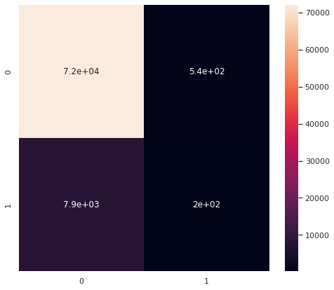
    


## Other Metrics

* 30s listens/tot listens (listen conversions) _also like a bounce rate_
* Users both months/users prev month (user conversions)
    * combine with mau > mau_previous_month
* Best small time performers (less than X total monthly listens + high conversion)
* Best new user playlist (owner has only 1 popular playlist)

### Listen and User Conversions, MAU Growing


```python
df['listen_conversions'] = df['stream30s'] / df['streams']
df['listen_conversions'].fillna(value=0, inplace=True)

df['user_retention'] = df['mau_both_months'] / df['mau_previous_month']
df['user_retention'].fillna(value=0, inplace=True)

df['user_conversions'] = df['mau'] / df['users']
df['user_conversions'].fillna(value=0, inplace=True)


df['mau_growing'] = df['mau'] > df['mau_previous_month']
df['mau_growth'] = df['mau'] / df['mau_previous_month']
df['mau_growth'].fillna(value=0, inplace=True)
df['mau_growth'].replace([np.inf, -np.inf], 1, inplace=True)
```


```python
new_metrics = ['listen_conversions', 'user_conversions', 'user_retention', 'mau_growth']
```


```python
df[new_metrics].describe()
```


<div>
<style scoped>
    .dataframe tbody tr th:only-of-type {
        vertical-align: middle;
    }

    .dataframe tbody tr th {
        vertical-align: top;
    }

    .dataframe thead th {
        text-align: right;
    }
</style>
<table border="1" class="dataframe">
  <thead>
    <tr style="text-align: right;">
      <th></th>
      <th>listen_conversions</th>
      <th>user_conversions</th>
      <th>user_retention</th>
      <th>mau_growth</th>
    </tr>
  </thead>
  <tbody>
    <tr>
      <th>count</th>
      <td>403366.000000</td>
      <td>403366.000000</td>
      <td>403366.000000</td>
      <td>403366.000000</td>
    </tr>
    <tr>
      <th>mean</th>
      <td>0.334701</td>
      <td>0.724072</td>
      <td>0.571070</td>
      <td>1.513218</td>
    </tr>
    <tr>
      <th>std</th>
      <td>0.399968</td>
      <td>0.261708</td>
      <td>0.392073</td>
      <td>17.459669</td>
    </tr>
    <tr>
      <th>min</th>
      <td>0.000000</td>
      <td>0.020348</td>
      <td>0.000000</td>
      <td>0.031250</td>
    </tr>
    <tr>
      <th>25%</th>
      <td>0.000000</td>
      <td>0.500000</td>
      <td>0.200000</td>
      <td>1.000000</td>
    </tr>
    <tr>
      <th>50%</th>
      <td>0.000000</td>
      <td>0.666667</td>
      <td>0.500000</td>
      <td>1.066667</td>
    </tr>
    <tr>
      <th>75%</th>
      <td>0.730769</td>
      <td>1.000000</td>
      <td>1.000000</td>
      <td>2.000000</td>
    </tr>
    <tr>
      <th>max</th>
      <td>1.000000</td>
      <td>1.000000</td>
      <td>1.000000</td>
      <td>7859.000000</td>
    </tr>
  </tbody>
</table>
</div>


```python
df['listen_conversions'].plot(kind='hist', bins=10)
```


    <AxesSubplot:ylabel='Frequency'>


    
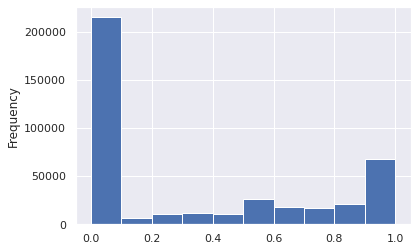
    


```python
df['user_conversions'].plot(kind='hist', bins=10)
```


    <AxesSubplot:ylabel='Frequency'>


    

    


```python
df['user_retention'].plot(kind='hist', bins=10)
```


    <AxesSubplot:ylabel='Frequency'>


    

    


```python
df.loc[df['mau_growth'] < 10]['mau_growth'].plot(kind='hist', bins=20)
```


    <AxesSubplot:ylabel='Frequency'>


    
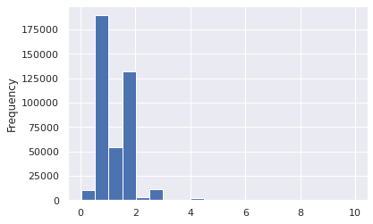
    


```python
df['mau_growing'].value_counts().plot(kind='bar')
```


    <AxesSubplot:>


    

    


```python
df['new_success'] = df[new_metrics].apply(lambda x: (x > 0.5) if (max(x) == 1) else (x > 1)).all(axis=1)
```


```python
df['new_success'].value_counts()
```


    False    362869
    True      40497
    Name: new_success, dtype: int64


```python
df.loc[df['new_success'] == True]
```


<div>
<style scoped>
    .dataframe tbody tr th:only-of-type {
        vertical-align: middle;
    }

    .dataframe tbody tr th {
        vertical-align: top;
    }

    .dataframe thead th {
        text-align: right;
    }
</style>
<table border="1" class="dataframe">
  <thead>
    <tr style="text-align: right;">
      <th></th>
      <th>playlist_uri</th>
      <th>owner</th>
      <th>streams</th>
      <th>stream30s</th>
      <th>dau</th>
      <th>wau</th>
      <th>mau</th>
      <th>mau_previous_month</th>
      <th>mau_both_months</th>
      <th>users</th>
      <th>skippers</th>
      <th>owner_country</th>
      <th>n_tracks</th>
      <th>n_local_tracks</th>
      <th>n_artists</th>
      <th>n_albums</th>
      <th>monthly_stream30s</th>
      <th>monthly_owner_stream30s</th>
      <th>tokens</th>
      <th>genre_1</th>
      <th>genre_2</th>
      <th>genre_3</th>
      <th>mood_1</th>
      <th>mood_2</th>
      <th>mood_3</th>
      <th>success</th>
      <th>listen_conversions</th>
      <th>user_retention</th>
      <th>user_conversions</th>
      <th>mau_growing</th>
      <th>mau_growth</th>
      <th>new_success</th>
    </tr>
  </thead>
  <tbody>
    <tr>
      <th>14</th>
      <td>spotify:user:9a3580868994077be27d244788d494cd:...</td>
      <td>9a3580868994077be27d244788d494cd</td>
      <td>28</td>
      <td>15</td>
      <td>1</td>
      <td>1</td>
      <td>2</td>
      <td>1</td>
      <td>1</td>
      <td>2</td>
      <td>0</td>
      <td>US</td>
      <td>321</td>
      <td>0</td>
      <td>170</td>
      <td>205</td>
      <td>83</td>
      <td>77</td>
      <td>["sunny", "daze"]</td>
      <td>Alternative</td>
      <td>Indie Rock</td>
      <td>Electronica</td>
      <td>Brooding</td>
      <td>Excited</td>
      <td>Sensual</td>
      <td>False</td>
      <td>0.535714</td>
      <td>1.0</td>
      <td>1.000000</td>
      <td>True</td>
      <td>2.000000</td>
      <td>True</td>
    </tr>
    <tr>
      <th>18</th>
      <td>spotify:user:7abbdbd3119687473b8f2986e73e2ad6:...</td>
      <td>7abbdbd3119687473b8f2986e73e2ad6</td>
      <td>9</td>
      <td>5</td>
      <td>1</td>
      <td>2</td>
      <td>2</td>
      <td>1</td>
      <td>1</td>
      <td>2</td>
      <td>0</td>
      <td>US</td>
      <td>373</td>
      <td>8</td>
      <td>1</td>
      <td>1</td>
      <td>18</td>
      <td>11</td>
      <td>[]</td>
      <td>Pop</td>
      <td>Alternative</td>
      <td>Indie Rock</td>
      <td>Empowering</td>
      <td>Excited</td>
      <td>Urgent</td>
      <td>False</td>
      <td>0.555556</td>
      <td>1.0</td>
      <td>1.000000</td>
      <td>True</td>
      <td>2.000000</td>
      <td>True</td>
    </tr>
    <tr>
      <th>20</th>
      <td>spotify:user:838141e861005b6a955cb389c19671a5:...</td>
      <td>838141e861005b6a955cb389c19671a5</td>
      <td>32</td>
      <td>25</td>
      <td>2</td>
      <td>3</td>
      <td>4</td>
      <td>3</td>
      <td>3</td>
      <td>5</td>
      <td>1</td>
      <td>US</td>
      <td>904</td>
      <td>0</td>
      <td>81</td>
      <td>125</td>
      <td>327</td>
      <td>253</td>
      <td>["metalcore", "forever"]</td>
      <td>Punk</td>
      <td>Metal</td>
      <td>Rock</td>
      <td>Defiant</td>
      <td>Urgent</td>
      <td>Aggressive</td>
      <td>False</td>
      <td>0.781250</td>
      <td>1.0</td>
      <td>0.800000</td>
      <td>True</td>
      <td>1.333333</td>
      <td>True</td>
    </tr>
    <tr>
      <th>36</th>
      <td>spotify:user:2217942070bcaa5f1e651e27744b4402:...</td>
      <td>2217942070bcaa5f1e651e27744b4402</td>
      <td>18</td>
      <td>17</td>
      <td>1</td>
      <td>2</td>
      <td>4</td>
      <td>3</td>
      <td>3</td>
      <td>5</td>
      <td>1</td>
      <td>US</td>
      <td>141</td>
      <td>1</td>
      <td>122</td>
      <td>131</td>
      <td>567</td>
      <td>0</td>
      <td>["chill"]</td>
      <td>Rap</td>
      <td>Dance &amp; House</td>
      <td>Alternative</td>
      <td>Excited</td>
      <td>Defiant</td>
      <td>Energizing</td>
      <td>False</td>
      <td>0.944444</td>
      <td>1.0</td>
      <td>0.800000</td>
      <td>True</td>
      <td>1.333333</td>
      <td>True</td>
    </tr>
    <tr>
      <th>59</th>
      <td>spotify:user:dfde15dd16b4ad87a75036276b4c9f66:...</td>
      <td>dfde15dd16b4ad87a75036276b4c9f66</td>
      <td>5</td>
      <td>5</td>
      <td>1</td>
      <td>1</td>
      <td>2</td>
      <td>1</td>
      <td>1</td>
      <td>3</td>
      <td>0</td>
      <td>US</td>
      <td>84</td>
      <td>0</td>
      <td>73</td>
      <td>78</td>
      <td>254</td>
      <td>239</td>
      <td>["vegas"]</td>
      <td>Rock</td>
      <td>Pop</td>
      <td>R&amp;B</td>
      <td>Upbeat</td>
      <td>Excited</td>
      <td>Empowering</td>
      <td>False</td>
      <td>1.000000</td>
      <td>1.0</td>
      <td>0.666667</td>
      <td>True</td>
      <td>2.000000</td>
      <td>True</td>
    </tr>
    <tr>
      <th>...</th>
      <td>...</td>
      <td>...</td>
      <td>...</td>
      <td>...</td>
      <td>...</td>
      <td>...</td>
      <td>...</td>
      <td>...</td>
      <td>...</td>
      <td>...</td>
      <td>...</td>
      <td>...</td>
      <td>...</td>
      <td>...</td>
      <td>...</td>
      <td>...</td>
      <td>...</td>
      <td>...</td>
      <td>...</td>
      <td>...</td>
      <td>...</td>
      <td>...</td>
      <td>...</td>
      <td>...</td>
      <td>...</td>
      <td>...</td>
      <td>...</td>
      <td>...</td>
      <td>...</td>
      <td>...</td>
      <td>...</td>
      <td>...</td>
    </tr>
    <tr>
      <th>403329</th>
      <td>spotify:user:358b83239c6a2557fbfb053330d49a41:...</td>
      <td>358b83239c6a2557fbfb053330d49a41</td>
      <td>4</td>
      <td>4</td>
      <td>1</td>
      <td>1</td>
      <td>3</td>
      <td>1</td>
      <td>1</td>
      <td>3</td>
      <td>0</td>
      <td>US</td>
      <td>33</td>
      <td>0</td>
      <td>28</td>
      <td>31</td>
      <td>271</td>
      <td>32</td>
      <td>["one", "dirt", "road"]</td>
      <td>Country &amp; Folk</td>
      <td>Rock</td>
      <td>-</td>
      <td>Yearning</td>
      <td>Empowering</td>
      <td>Gritty</td>
      <td>False</td>
      <td>1.000000</td>
      <td>1.0</td>
      <td>1.000000</td>
      <td>True</td>
      <td>3.000000</td>
      <td>True</td>
    </tr>
    <tr>
      <th>403336</th>
      <td>spotify:user:a0781a2de47beb8bd693f3022f316327:...</td>
      <td>a0781a2de47beb8bd693f3022f316327</td>
      <td>856</td>
      <td>855</td>
      <td>3</td>
      <td>10</td>
      <td>10</td>
      <td>5</td>
      <td>5</td>
      <td>10</td>
      <td>0</td>
      <td>US</td>
      <td>168</td>
      <td>0</td>
      <td>6</td>
      <td>9</td>
      <td>33747</td>
      <td>1391</td>
      <td>["evning", "song"]</td>
      <td>-</td>
      <td>-</td>
      <td>-</td>
      <td>-</td>
      <td>-</td>
      <td>-</td>
      <td>True</td>
      <td>0.998832</td>
      <td>1.0</td>
      <td>1.000000</td>
      <td>True</td>
      <td>2.000000</td>
      <td>True</td>
    </tr>
    <tr>
      <th>403338</th>
      <td>spotify:user:06f6dd666f1bbf9148c792b87ed4d22f:...</td>
      <td>06f6dd666f1bbf9148c792b87ed4d22f</td>
      <td>5</td>
      <td>4</td>
      <td>1</td>
      <td>1</td>
      <td>2</td>
      <td>1</td>
      <td>1</td>
      <td>2</td>
      <td>0</td>
      <td>US</td>
      <td>59</td>
      <td>0</td>
      <td>34</td>
      <td>46</td>
      <td>21</td>
      <td>9</td>
      <td>["rhc"]</td>
      <td>Religious</td>
      <td>Pop</td>
      <td>Alternative</td>
      <td>Empowering</td>
      <td>Upbeat</td>
      <td>Brooding</td>
      <td>False</td>
      <td>0.800000</td>
      <td>1.0</td>
      <td>1.000000</td>
      <td>True</td>
      <td>2.000000</td>
      <td>True</td>
    </tr>
    <tr>
      <th>403348</th>
      <td>spotify:user:c6af258245d55221cebedb1175f08d83:...</td>
      <td>c6af258245d55221cebedb1175f08d83</td>
      <td>13</td>
      <td>11</td>
      <td>1</td>
      <td>1</td>
      <td>2</td>
      <td>1</td>
      <td>1</td>
      <td>2</td>
      <td>0</td>
      <td>US</td>
      <td>31</td>
      <td>0</td>
      <td>30</td>
      <td>29</td>
      <td>208</td>
      <td>206</td>
      <td>["zumba", "val", "silva", "playlist"]</td>
      <td>Latin</td>
      <td>Pop</td>
      <td>Dance &amp; House</td>
      <td>Aggressive</td>
      <td>Excited</td>
      <td>Defiant</td>
      <td>False</td>
      <td>0.846154</td>
      <td>1.0</td>
      <td>1.000000</td>
      <td>True</td>
      <td>2.000000</td>
      <td>True</td>
    </tr>
    <tr>
      <th>403353</th>
      <td>spotify:user:5461b6b460dd512d7b4fd4fb488f3520:...</td>
      <td>5461b6b460dd512d7b4fd4fb488f3520</td>
      <td>2</td>
      <td>2</td>
      <td>1</td>
      <td>1</td>
      <td>2</td>
      <td>1</td>
      <td>1</td>
      <td>2</td>
      <td>0</td>
      <td>US</td>
      <td>146</td>
      <td>0</td>
      <td>115</td>
      <td>123</td>
      <td>405</td>
      <td>321</td>
      <td>["myfavorites"]</td>
      <td>Indie Rock</td>
      <td>Electronica</td>
      <td>Alternative</td>
      <td>Yearning</td>
      <td>Energizing</td>
      <td>Brooding</td>
      <td>False</td>
      <td>1.000000</td>
      <td>1.0</td>
      <td>1.000000</td>
      <td>True</td>
      <td>2.000000</td>
      <td>True</td>
    </tr>
  </tbody>
</table>
<p>40497 rows × 32 columns</p>
</div>


```python
chidf = pd.DataFrame()
target = 'new_success'
chidf[target] = df[target]
# quant_value = 0.90
# tar_value = np.quantile(chidf[target], quant_value)
# chidf[target] = chidf[target] > tar_value
chisum = pd.DataFrame()
cutoff = 0.0001
pop = chidf[target].values

for ind in des_features:
    # ind = des_features[0]
    chidf[ind] = df[ind]

    for grp_label in df[ind].unique():
    # grp_label = df[ind].unique()[0]
        try:
            cTable = chidf.groupby(chidf[ind] == grp_label)[target].value_counts().values.reshape(2,2).T
            chi2, p, dof, ex = stats.chi2_contingency(cTable, correction=True, lambda_=None)
            ratio = cTable[1]/cTable[0]
            pos = ratio[1]/ratio[0]
            chisum = pd.concat([chisum, pd.DataFrame([[ind, grp_label, chi2, p, cTable, pos, p<cutoff]])])
        except:
            pass

chisum.columns = ['feature', 'group', 'chi', 'p-value', 'cTable', 'multiplier', 'reject null']
chisum = chisum.sort_values('p-value').reset_index(drop=True)
```


```python
chisum.loc[chisum['reject null'] == True].sort_values('multiplier', ascending=False)
```


<div>
<style scoped>
    .dataframe tbody tr th:only-of-type {
        vertical-align: middle;
    }

    .dataframe tbody tr th {
        vertical-align: top;
    }

    .dataframe thead th {
        text-align: right;
    }
</style>
<table border="1" class="dataframe">
  <thead>
    <tr style="text-align: right;">
      <th></th>
      <th>feature</th>
      <th>group</th>
      <th>chi</th>
      <th>p-value</th>
      <th>cTable</th>
      <th>multiplier</th>
      <th>reject null</th>
    </tr>
  </thead>
  <tbody>
    <tr>
      <th>6</th>
      <td>genre_1</td>
      <td>Dance &amp; House</td>
      <td>231.225731</td>
      <td>3.221322e-52</td>
      <td>[[334768, 28101], [36487, 4010]]</td>
      <td>1.309267</td>
      <td>True</td>
    </tr>
    <tr>
      <th>2</th>
      <td>genre_1</td>
      <td>Indie Rock</td>
      <td>386.328998</td>
      <td>5.212769e-86</td>
      <td>[[300809, 62060], [31986, 8511]]</td>
      <td>1.289733</td>
      <td>True</td>
    </tr>
    <tr>
      <th>3</th>
      <td>mood_1</td>
      <td>Excited</td>
      <td>289.821405</td>
      <td>5.438394e-65</td>
      <td>[[306376, 56493], [32871, 7626]]</td>
      <td>1.258184</td>
      <td>True</td>
    </tr>
    <tr>
      <th>4</th>
      <td>mood_1</td>
      <td>Defiant</td>
      <td>285.014998</td>
      <td>6.064223e-64</td>
      <td>[[291222, 71647], [31065, 9432]]</td>
      <td>1.234123</td>
      <td>True</td>
    </tr>
    <tr>
      <th>16</th>
      <td>genre_2</td>
      <td>Electronica</td>
      <td>124.733558</td>
      <td>5.820843e-29</td>
      <td>[[335186, 27683], [36772, 3725]]</td>
      <td>1.226540</td>
      <td>True</td>
    </tr>
    <tr>
      <th>...</th>
      <td>...</td>
      <td>...</td>
      <td>...</td>
      <td>...</td>
      <td>...</td>
      <td>...</td>
      <td>...</td>
    </tr>
    <tr>
      <th>70</th>
      <td>mood_1</td>
      <td>Somber</td>
      <td>30.852148</td>
      <td>2.784538e-08</td>
      <td>[[361994, 875], [40456, 41]]</td>
      <td>0.419270</td>
      <td>True</td>
    </tr>
    <tr>
      <th>0</th>
      <td>genre_3</td>
      <td>-</td>
      <td>1404.327669</td>
      <td>2.410008e-307</td>
      <td>[[324633, 38236], [38610, 1887]]</td>
      <td>0.414947</td>
      <td>True</td>
    </tr>
    <tr>
      <th>1</th>
      <td>genre_2</td>
      <td>-</td>
      <td>861.809401</td>
      <td>1.968786e-189</td>
      <td>[[342541, 20328], [39619, 878]]</td>
      <td>0.373430</td>
      <td>True</td>
    </tr>
    <tr>
      <th>24</th>
      <td>mood_1</td>
      <td>Other</td>
      <td>81.806778</td>
      <td>1.500630e-19</td>
      <td>[[361232, 1637], [40439, 58]]</td>
      <td>0.316494</td>
      <td>True</td>
    </tr>
    <tr>
      <th>42</th>
      <td>genre_1</td>
      <td>Spoken &amp; Audio</td>
      <td>58.779116</td>
      <td>1.764037e-14</td>
      <td>[[361755, 1114], [40460, 37]]</td>
      <td>0.296965</td>
      <td>True</td>
    </tr>
  </tbody>
</table>
<p>101 rows × 7 columns</p>
</div>


```python
chisum.loc[chisum['reject null'] == True].sort_values('multiplier', ascending=True)[:20]
```


<div>
<style scoped>
    .dataframe tbody tr th:only-of-type {
        vertical-align: middle;
    }

    .dataframe tbody tr th {
        vertical-align: top;
    }

    .dataframe thead th {
        text-align: right;
    }
</style>
<table border="1" class="dataframe">
  <thead>
    <tr style="text-align: right;">
      <th></th>
      <th>feature</th>
      <th>group</th>
      <th>chi</th>
      <th>p-value</th>
      <th>cTable</th>
      <th>multiplier</th>
      <th>reject null</th>
    </tr>
  </thead>
  <tbody>
    <tr>
      <th>42</th>
      <td>genre_1</td>
      <td>Spoken &amp; Audio</td>
      <td>58.779116</td>
      <td>1.764037e-14</td>
      <td>[[361755, 1114], [40460, 37]]</td>
      <td>0.296965</td>
      <td>True</td>
    </tr>
    <tr>
      <th>24</th>
      <td>mood_1</td>
      <td>Other</td>
      <td>81.806778</td>
      <td>1.500630e-19</td>
      <td>[[361232, 1637], [40439, 58]]</td>
      <td>0.316494</td>
      <td>True</td>
    </tr>
    <tr>
      <th>1</th>
      <td>genre_2</td>
      <td>-</td>
      <td>861.809401</td>
      <td>1.968786e-189</td>
      <td>[[342541, 20328], [39619, 878]]</td>
      <td>0.373430</td>
      <td>True</td>
    </tr>
    <tr>
      <th>0</th>
      <td>genre_3</td>
      <td>-</td>
      <td>1404.327669</td>
      <td>2.410008e-307</td>
      <td>[[324633, 38236], [38610, 1887]]</td>
      <td>0.414947</td>
      <td>True</td>
    </tr>
    <tr>
      <th>70</th>
      <td>mood_1</td>
      <td>Somber</td>
      <td>30.852148</td>
      <td>2.784538e-08</td>
      <td>[[361994, 875], [40456, 41]]</td>
      <td>0.419270</td>
      <td>True</td>
    </tr>
    <tr>
      <th>73</th>
      <td>genre_1</td>
      <td>Easy Listening</td>
      <td>30.613123</td>
      <td>3.149562e-08</td>
      <td>[[361984, 885], [40455, 42]]</td>
      <td>0.424642</td>
      <td>True</td>
    </tr>
    <tr>
      <th>40</th>
      <td>mood_2</td>
      <td>-</td>
      <td>60.796108</td>
      <td>6.330294e-15</td>
      <td>[[361087, 1782], [40411, 86]]</td>
      <td>0.431224</td>
      <td>True</td>
    </tr>
    <tr>
      <th>43</th>
      <td>mood_1</td>
      <td>-</td>
      <td>57.600397</td>
      <td>3.211607e-14</td>
      <td>[[361161, 1708], [40414, 83]]</td>
      <td>0.434269</td>
      <td>True</td>
    </tr>
    <tr>
      <th>37</th>
      <td>mood_3</td>
      <td>-</td>
      <td>64.489845</td>
      <td>9.703118e-16</td>
      <td>[[360957, 1912], [40404, 93]]</td>
      <td>0.434536</td>
      <td>True</td>
    </tr>
    <tr>
      <th>48</th>
      <td>genre_1</td>
      <td>Children's</td>
      <td>52.188042</td>
      <td>5.043231e-13</td>
      <td>[[361298, 1571], [40420, 77]]</td>
      <td>0.438111</td>
      <td>True</td>
    </tr>
    <tr>
      <th>32</th>
      <td>mood_1</td>
      <td>Easygoing</td>
      <td>72.784800</td>
      <td>1.445861e-17</td>
      <td>[[360451, 2418], [40371, 126]]</td>
      <td>0.465255</td>
      <td>True</td>
    </tr>
    <tr>
      <th>56</th>
      <td>mood_3</td>
      <td>Serious</td>
      <td>43.083601</td>
      <td>5.245004e-11</td>
      <td>[[361404, 1465], [40420, 77]]</td>
      <td>0.469948</td>
      <td>True</td>
    </tr>
    <tr>
      <th>59</th>
      <td>genre_2</td>
      <td>Other</td>
      <td>41.614387</td>
      <td>1.111721e-10</td>
      <td>[[361446, 1423], [40422, 75]]</td>
      <td>0.471283</td>
      <td>True</td>
    </tr>
    <tr>
      <th>82</th>
      <td>mood_2</td>
      <td>Other</td>
      <td>25.423296</td>
      <td>4.603257e-07</td>
      <td>[[361970, 899], [40449, 48]]</td>
      <td>0.477800</td>
      <td>True</td>
    </tr>
    <tr>
      <th>60</th>
      <td>genre_1</td>
      <td>Traditional</td>
      <td>39.228043</td>
      <td>3.770852e-10</td>
      <td>[[361402, 1467], [40416, 81]]</td>
      <td>0.493733</td>
      <td>True</td>
    </tr>
    <tr>
      <th>39</th>
      <td>genre_3</td>
      <td>Easy Listening</td>
      <td>61.357952</td>
      <td>4.758655e-15</td>
      <td>[[360552, 2317], [40368, 129]]</td>
      <td>0.497272</td>
      <td>True</td>
    </tr>
    <tr>
      <th>47</th>
      <td>genre_2</td>
      <td>Easy Listening</td>
      <td>53.106215</td>
      <td>3.159911e-13</td>
      <td>[[360858, 2011], [40385, 112]]</td>
      <td>0.497648</td>
      <td>True</td>
    </tr>
    <tr>
      <th>65</th>
      <td>mood_2</td>
      <td>Stirring</td>
      <td>34.226638</td>
      <td>4.905289e-09</td>
      <td>[[361548, 1321], [40423, 74]]</td>
      <td>0.501033</td>
      <td>True</td>
    </tr>
    <tr>
      <th>57</th>
      <td>mood_1</td>
      <td>Serious</td>
      <td>42.044137</td>
      <td>8.923632e-11</td>
      <td>[[361247, 1622], [40406, 91]]</td>
      <td>0.501590</td>
      <td>True</td>
    </tr>
    <tr>
      <th>10</th>
      <td>genre_1</td>
      <td>Soundtrack</td>
      <td>169.038371</td>
      <td>1.200050e-38</td>
      <td>[[356345, 6524], [40127, 370]]</td>
      <td>0.503642</td>
      <td>True</td>
    </tr>
  </tbody>
</table>
</div>


```python
chidf = pd.DataFrame()
target = "success"
chidf[target] = df[target]
# chidf.iloc[:int(chidf.shape[0]/2),:] = True
# chidf.iloc[int(chidf.shape[0]/2):,:] = False
# quant_value = 0.99
# tar_value = np.quantile(chidf[target], quant_value)
# chidf[target] = chidf[target] > tar_value
welchsum = pd.DataFrame()
cutoff = 0.0001
pop = chidf[target].values

for ind in con_features:
    # ind = con_features[0]
    chidf[ind] = df[ind]

    # for grp_label in df[ind].unique():
    # try:
    a = []
    b = []
    for i in range(100):
        boot1 = random.sample(
                    list(
                        chidf.loc[
                            (chidf[target] == True)
                        ][ind].values),
                    k=1000)
        boot2 = random.sample(
                    list(
                        chidf.loc[
                            (chidf[target] == False)
                        ][ind].values),
                    k=1000)
        a.append(np.mean(boot1))
        b.append(np.mean(boot2))
    testt, p = stats.ttest_ind(a, b, equal_var=False)
    a_avg = np.mean(a)
    b_avg = np.mean(b)
    welchsum = pd.concat([welchsum, pd.DataFrame([[ind, testt, p, a_avg, b_avg, p<cutoff]])])
    sns.histplot(a, color='tab:orange', label=f"{target} == True")
    sns.histplot(b, label=f"{target} == False")
    plt.title(ind)
    plt.legend()
    plt.show()
    # except:
    #     pass

welchsum.columns = ['feature', 'test stat', 'p-value', 'upper q avg', 'lower q avg', 'reject null']
welchsum = welchsum.sort_values('p-value').reset_index(drop=True)
```


    

    


    
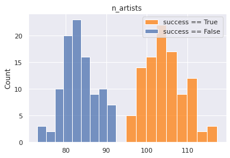
    


    

    


    

    


```python
sns.histplot(df, x='listen_conversions', hue='mau_growing', bins=10)
```


    <AxesSubplot:xlabel='listen_conversions', ylabel='Count'>


    

    


```python
sns.histplot(df, x='user_conversions', hue='mau_growing', bins=10)
```


    <AxesSubplot:xlabel='user_conversions', ylabel='Count'>


    

    


```python
sns.histplot(df, x='user_conversions', hue=df['dau'] > 1, bins=10)
```


    <AxesSubplot:xlabel='user_conversions', ylabel='Count'>


    

    


```python
(df['mau'] > 5).describe()
```


    count     403366
    unique         2
    top        False
    freq      338256
    Name: mau, dtype: object


```python
np.quantile(df['mau'], 0.9)
```


    9.0


### Considering outliers


```python
df = df.loc[df[targets].apply(lambda x: (x < 3*x.std()) if (x.dtype == int or x.dtype == float) else x).all(axis=1)]
```


```python
df = df.loc[df['owner'] != 'spotify']
```

### Multiple Criteria for Success


```python
df['success'] = df[sub_targets].apply(lambda x: x > np.quantile(x, 0.75)).all(axis=1)
```


```python
fig, ax = plt.subplots(figsize=(10,10))
df.loc[df['success'] == True].groupby('n_tracks')[['wau']].mean().plot(ls='', marker='.', ax=ax)
ax.set_xlim(0, 200)
ax.set_ylim(0, 5000)
```


    (0.0, 5000.0)


    
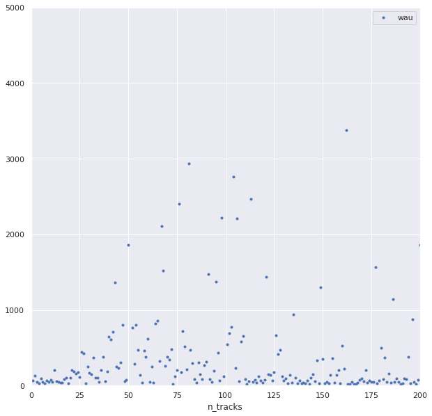
    


```python
chidf = pd.DataFrame()
target = 'success'
chidf[target] = df[target]
# quant_value = 0.90
# tar_value = np.quantile(chidf[target], quant_value)
# chidf[target] = chidf[target] > tar_value
chisum = pd.DataFrame()
cutoff = 0.0001
pop = chidf[target].values

for ind in des_features:
    # ind = des_features[0]
    chidf[ind] = df[ind]

    for grp_label in df[ind].unique():
    # grp_label = df[ind].unique()[0]
        try:
            cTable = chidf.groupby(chidf[ind] == grp_label)[target].value_counts().values.reshape(2,2).T
            chi2, p, dof, ex = stats.chi2_contingency(cTable, correction=True, lambda_=None)
            ratio = cTable[1]/cTable[0]
            pos = ratio[1]/ratio[0]
            chisum = pd.concat([chisum, pd.DataFrame([[ind, grp_label, chi2, p, cTable, pos, p<cutoff]])])
        except:
            pass

chisum.columns = ['feature', 'group', 'chi', 'p-value', 'cTable', 'multiplier', 'reject null']
chisum = chisum.sort_values('p-value').reset_index(drop=True)
```


```python
chisum.loc[chisum['reject null'] == True].sort_values('multiplier', ascending=False)
```


<div>
<style scoped>
    .dataframe tbody tr th:only-of-type {
        vertical-align: middle;
    }

    .dataframe tbody tr th {
        vertical-align: top;
    }

    .dataframe thead th {
        text-align: right;
    }
</style>
<table border="1" class="dataframe">
  <thead>
    <tr style="text-align: right;">
      <th></th>
      <th>feature</th>
      <th>group</th>
      <th>chi</th>
      <th>p-value</th>
      <th>cTable</th>
      <th>multiplier</th>
      <th>reject null</th>
    </tr>
  </thead>
  <tbody>
    <tr>
      <th>0</th>
      <td>genre_1</td>
      <td>Latin</td>
      <td>3516.528142</td>
      <td>0.000000e+00</td>
      <td>[[371720, 12806], [16634, 2206]]</td>
      <td>3.849561</td>
      <td>True</td>
    </tr>
    <tr>
      <th>4</th>
      <td>genre_2</td>
      <td>Jazz</td>
      <td>708.535543</td>
      <td>4.164954e-156</td>
      <td>[[380364, 4162], [18231, 609]]</td>
      <td>3.052841</td>
      <td>True</td>
    </tr>
    <tr>
      <th>1</th>
      <td>mood_1</td>
      <td>Lively</td>
      <td>1287.773814</td>
      <td>5.130420e-282</td>
      <td>[[375424, 9102], [17596, 1244]]</td>
      <td>2.916028</td>
      <td>True</td>
    </tr>
    <tr>
      <th>14</th>
      <td>genre_1</td>
      <td>Children's</td>
      <td>208.802667</td>
      <td>2.506648e-47</td>
      <td>[[383079, 1447], [18639, 201]]</td>
      <td>2.854916</td>
      <td>True</td>
    </tr>
    <tr>
      <th>20</th>
      <td>genre_1</td>
      <td>Traditional</td>
      <td>149.152847</td>
      <td>2.655403e-34</td>
      <td>[[383152, 1374], [18666, 174]]</td>
      <td>2.599455</td>
      <td>True</td>
    </tr>
    <tr>
      <th>...</th>
      <td>...</td>
      <td>...</td>
      <td>...</td>
      <td>...</td>
      <td>...</td>
      <td>...</td>
      <td>...</td>
    </tr>
    <tr>
      <th>22</th>
      <td>genre_2</td>
      <td>Indie Rock</td>
      <td>137.000630</td>
      <td>1.205469e-31</td>
      <td>[[353648, 30878], [17772, 1068]]</td>
      <td>0.688267</td>
      <td>True</td>
    </tr>
    <tr>
      <th>34</th>
      <td>mood_1</td>
      <td>Brooding</td>
      <td>84.460032</td>
      <td>3.920608e-20</td>
      <td>[[366942, 17584], [18247, 593]]</td>
      <td>0.678177</td>
      <td>True</td>
    </tr>
    <tr>
      <th>9</th>
      <td>genre_2</td>
      <td>Alternative</td>
      <td>331.424544</td>
      <td>4.704591e-74</td>
      <td>[[320464, 64062], [16650, 2190]]</td>
      <td>0.657974</td>
      <td>True</td>
    </tr>
    <tr>
      <th>11</th>
      <td>mood_1</td>
      <td>Yearning</td>
      <td>223.850708</td>
      <td>1.307610e-50</td>
      <td>[[347224, 37302], [17631, 1209]]</td>
      <td>0.638303</td>
      <td>True</td>
    </tr>
    <tr>
      <th>2</th>
      <td>genre_1</td>
      <td>Indie Rock</td>
      <td>866.348545</td>
      <td>2.029540e-190</td>
      <td>[[315752, 68774], [17043, 1797]]</td>
      <td>0.484087</td>
      <td>True</td>
    </tr>
  </tbody>
</table>
<p>92 rows × 7 columns</p>
</div>


```python
ind = 'n_tracks'
target = 'wau'
mean_wau_vs_track = []
for track in range(1, 201):
    means = [] 
    for i in range(10):
        boot = random.sample(
                    list(
                        df.loc[
                            (df['success'] == True) 
                            & (df[ind] == track)
                        ][target].values),
                    k=min(len(list(
                        df.loc[
                            (df['success'] == True) 
                            & (df[ind] == track)
                        ][target].values)), 1000))
        means.append(np.mean(boot))
    mean_wau_vs_track.append(np.mean(means))
```


```python
fig, ax = plt.subplots(figsize=(10,10))
plt.plot(range(len(mean_wau_vs_track)), mean_wau_vs_track, ls='', marker='.')
# ax.set_ylim(0,5)
```


    [<matplotlib.lines.Line2D at 0x7f838e3d99a0>]


    

    


```python
len(df.loc[
                            (df['success'] == True) 
                            & (df[ind] == track)
                        ][target].values)
```


    14


### Dependency


```python
master = pd.DataFrame()
for target in new_metrics:
    # target = sub_targets[0]
    chidf = pd.DataFrame()
    chidf[target] = df[target]
    quant_value = 0.90
    tar_value = np.quantile(chidf[target], quant_value)
    tar_value = 0.8
    chidf[target] = chidf[target] >= tar_value
    chisum = pd.DataFrame()
    cutoff = 0.0001
    pop = chidf[target].values

    for ind in des_features:
        # ind = des_features[0]
        chidf[ind] = df[ind]

        for grp_label in df[ind].unique():
        # grp_label = df[ind].unique()[0]
            try:
                cTable = chidf.groupby(chidf[ind] == grp_label)[target].value_counts().values.reshape(2,2).T
                chi2, p, dof, ex = stats.chi2_contingency(cTable, correction=True, lambda_=None)
                ratio = cTable[1]/cTable[0]
                pos = ratio[1]/ratio[0]
                chisum = pd.concat([chisum, pd.DataFrame([[target, ind, grp_label, chi2, p, cTable, pos, p<cutoff]])])
            except:
                pass

    chisum.columns = ['target', 'feature', 'group', 'chi', 'p-value', 'cTable', 'multiplier', 'reject null']
    chisum = chisum.sort_values('p-value').reset_index(drop=True)
    # chisum = chisum.loc[(chisum['reject null'] == True) & (chisum['multiplier'] > 2)].sort_values('multiplier', ascending=False)
    master = pd.concat((master, chisum))
    
master
```


<div>
<style scoped>
    .dataframe tbody tr th:only-of-type {
        vertical-align: middle;
    }

    .dataframe tbody tr th {
        vertical-align: top;
    }

    .dataframe thead th {
        text-align: right;
    }
</style>
<table border="1" class="dataframe">
  <thead>
    <tr style="text-align: right;">
      <th></th>
      <th>target</th>
      <th>feature</th>
      <th>group</th>
      <th>chi</th>
      <th>p-value</th>
      <th>cTable</th>
      <th>multiplier</th>
      <th>reject null</th>
    </tr>
  </thead>
  <tbody>
    <tr>
      <th>0</th>
      <td>listen_conversions</td>
      <td>genre_1</td>
      <td>Rap</td>
      <td>399.045079</td>
      <td>8.888113e-89</td>
      <td>[[263266, 51481], [76577, 12042]]</td>
      <td>0.804170</td>
      <td>True</td>
    </tr>
    <tr>
      <th>1</th>
      <td>listen_conversions</td>
      <td>genre_1</td>
      <td>Latin</td>
      <td>340.400638</td>
      <td>5.219381e-76</td>
      <td>[[303952, 10795], [84402, 4217]]</td>
      <td>1.406803</td>
      <td>True</td>
    </tr>
    <tr>
      <th>2</th>
      <td>listen_conversions</td>
      <td>mood_1</td>
      <td>Defiant</td>
      <td>324.874553</td>
      <td>1.256443e-72</td>
      <td>[[249581, 65166], [72706, 15913]]</td>
      <td>0.838248</td>
      <td>True</td>
    </tr>
    <tr>
      <th>3</th>
      <td>listen_conversions</td>
      <td>genre_3</td>
      <td>-</td>
      <td>282.376331</td>
      <td>2.279083e-63</td>
      <td>[[284762, 29985], [78481, 10138]]</td>
      <td>1.226777</td>
      <td>True</td>
    </tr>
    <tr>
      <th>4</th>
      <td>listen_conversions</td>
      <td>genre_2</td>
      <td>-</td>
      <td>259.043360</td>
      <td>2.773590e-58</td>
      <td>[[299145, 15602], [83015, 5604]]</td>
      <td>1.294324</td>
      <td>True</td>
    </tr>
    <tr>
      <th>...</th>
      <td>...</td>
      <td>...</td>
      <td>...</td>
      <td>...</td>
      <td>...</td>
      <td>...</td>
      <td>...</td>
      <td>...</td>
    </tr>
    <tr>
      <th>154</th>
      <td>user_conversions</td>
      <td>mood_1</td>
      <td>Gritty</td>
      <td>0.255320</td>
      <td>6.133538e-01</td>
      <td>[[235846, 4671], [159649, 3200]]</td>
      <td>1.012051</td>
      <td>False</td>
    </tr>
    <tr>
      <th>155</th>
      <td>user_conversions</td>
      <td>mood_1</td>
      <td>Melancholy</td>
      <td>0.183720</td>
      <td>6.681957e-01</td>
      <td>[[237216, 3301], [160587, 2262]]</td>
      <td>1.012233</td>
      <td>False</td>
    </tr>
    <tr>
      <th>156</th>
      <td>user_conversions</td>
      <td>mood_3</td>
      <td>Gritty</td>
      <td>0.091581</td>
      <td>7.621766e-01</td>
      <td>[[233926, 6591], [158413, 4436]]</td>
      <td>0.993866</td>
      <td>False</td>
    </tr>
    <tr>
      <th>157</th>
      <td>user_conversions</td>
      <td>mood_2</td>
      <td>Urgent</td>
      <td>0.026083</td>
      <td>8.716985e-01</td>
      <td>[[227220, 13297], [153866, 8983]]</td>
      <td>0.997635</td>
      <td>False</td>
    </tr>
    <tr>
      <th>158</th>
      <td>user_conversions</td>
      <td>genre_2</td>
      <td>Spoken &amp; Audio</td>
      <td>0.006088</td>
      <td>9.378078e-01</td>
      <td>[[239335, 1182], [162045, 804]]</td>
      <td>1.004637</td>
      <td>False</td>
    </tr>
  </tbody>
</table>
<p>318 rows × 8 columns</p>
</div>


```python
master.loc[(master['reject null'] == True) & (master['multiplier'] > 1.5)]
```


<div>
<style scoped>
    .dataframe tbody tr th:only-of-type {
        vertical-align: middle;
    }

    .dataframe tbody tr th {
        vertical-align: top;
    }

    .dataframe thead th {
        text-align: right;
    }
</style>
<table border="1" class="dataframe">
  <thead>
    <tr style="text-align: right;">
      <th></th>
      <th>target</th>
      <th>feature</th>
      <th>group</th>
      <th>chi</th>
      <th>p-value</th>
      <th>cTable</th>
      <th>multiplier</th>
      <th>reject null</th>
    </tr>
  </thead>
  <tbody>
    <tr>
      <th>7</th>
      <td>listen_conversions</td>
      <td>genre_1</td>
      <td>New Age</td>
      <td>136.770883</td>
      <td>1.353331e-31</td>
      <td>[[313269, 1478], [87913, 706]]</td>
      <td>1.702137</td>
      <td>True</td>
    </tr>
    <tr>
      <th>9</th>
      <td>listen_conversions</td>
      <td>mood_1</td>
      <td>Tender</td>
      <td>115.194233</td>
      <td>7.135481e-27</td>
      <td>[[312449, 2298], [87647, 972]]</td>
      <td>1.507851</td>
      <td>True</td>
    </tr>
    <tr>
      <th>18</th>
      <td>listen_conversions</td>
      <td>genre_2</td>
      <td>New Age</td>
      <td>71.594191</td>
      <td>2.643338e-17</td>
      <td>[[313509, 1238], [88081, 538]]</td>
      <td>1.546783</td>
      <td>True</td>
    </tr>
    <tr>
      <th>23</th>
      <td>listen_conversions</td>
      <td>genre_1</td>
      <td>Children's</td>
      <td>60.468486</td>
      <td>7.476593e-15</td>
      <td>[[313592, 1155], [88126, 493]]</td>
      <td>1.518888</td>
      <td>True</td>
    </tr>
  </tbody>
</table>
</div>


```python
master.loc[(master['reject null'] == True) & (master['multiplier'] < .5)]
```


<div>
<style scoped>
    .dataframe tbody tr th:only-of-type {
        vertical-align: middle;
    }

    .dataframe tbody tr th {
        vertical-align: top;
    }

    .dataframe thead th {
        text-align: right;
    }
</style>
<table border="1" class="dataframe">
  <thead>
    <tr style="text-align: right;">
      <th></th>
      <th>target</th>
      <th>feature</th>
      <th>group</th>
      <th>chi</th>
      <th>p-value</th>
      <th>cTable</th>
      <th>multiplier</th>
      <th>reject null</th>
    </tr>
  </thead>
  <tbody>
    <tr>
      <th>0</th>
      <td>user_conversions</td>
      <td>genre_2</td>
      <td>-</td>
      <td>3922.996570</td>
      <td>0.000000e+00</td>
      <td>[[223516, 17001], [158644, 4205]]</td>
      <td>0.348479</td>
      <td>True</td>
    </tr>
    <tr>
      <th>1</th>
      <td>user_conversions</td>
      <td>genre_1</td>
      <td>Latin</td>
      <td>1976.239449</td>
      <td>0.000000e+00</td>
      <td>[[228943, 11574], [159411, 3438]]</td>
      <td>0.426610</td>
      <td>True</td>
    </tr>
    <tr>
      <th>3</th>
      <td>user_conversions</td>
      <td>genre_3</td>
      <td>-</td>
      <td>6170.632022</td>
      <td>0.000000e+00</td>
      <td>[[209266, 31251], [153977, 8872]]</td>
      <td>0.385834</td>
      <td>True</td>
    </tr>
    <tr>
      <th>4</th>
      <td>user_conversions</td>
      <td>mood_1</td>
      <td>Lively</td>
      <td>1155.365166</td>
      <td>3.060886e-253</td>
      <td>[[232673, 7844], [160347, 2502]]</td>
      <td>0.462844</td>
      <td>True</td>
    </tr>
    <tr>
      <th>11</th>
      <td>user_conversions</td>
      <td>genre_2</td>
      <td>Jazz</td>
      <td>534.239051</td>
      <td>3.378526e-118</td>
      <td>[[236893, 3624], [161702, 1147]]</td>
      <td>0.463673</td>
      <td>True</td>
    </tr>
    <tr>
      <th>16</th>
      <td>user_conversions</td>
      <td>mood_3</td>
      <td>-</td>
      <td>436.706320</td>
      <td>5.640063e-97</td>
      <td>[[238863, 1654], [162498, 351]]</td>
      <td>0.311941</td>
      <td>True</td>
    </tr>
    <tr>
      <th>18</th>
      <td>user_conversions</td>
      <td>mood_2</td>
      <td>-</td>
      <td>395.335894</td>
      <td>5.705144e-88</td>
      <td>[[238982, 1535], [162516, 333]]</td>
      <td>0.319010</td>
      <td>True</td>
    </tr>
    <tr>
      <th>21</th>
      <td>user_conversions</td>
      <td>mood_1</td>
      <td>-</td>
      <td>379.442742</td>
      <td>1.645452e-84</td>
      <td>[[239045, 1472], [162530, 319]]</td>
      <td>0.318734</td>
      <td>True</td>
    </tr>
    <tr>
      <th>23</th>
      <td>user_conversions</td>
      <td>mood_1</td>
      <td>Other</td>
      <td>340.234697</td>
      <td>5.672282e-76</td>
      <td>[[239134, 1383], [162537, 312]]</td>
      <td>0.331911</td>
      <td>True</td>
    </tr>
    <tr>
      <th>26</th>
      <td>user_conversions</td>
      <td>mood_1</td>
      <td>Tender</td>
      <td>313.405005</td>
      <td>3.958040e-70</td>
      <td>[[238072, 2445], [162024, 825]]</td>
      <td>0.495797</td>
      <td>True</td>
    </tr>
    <tr>
      <th>30</th>
      <td>user_conversions</td>
      <td>genre_1</td>
      <td>Spoken &amp; Audio</td>
      <td>282.114763</td>
      <td>2.598715e-63</td>
      <td>[[239551, 966], [162664, 185]]</td>
      <td>0.282034</td>
      <td>True</td>
    </tr>
    <tr>
      <th>32</th>
      <td>user_conversions</td>
      <td>genre_1</td>
      <td>Children's</td>
      <td>267.069910</td>
      <td>4.937672e-60</td>
      <td>[[239209, 1308], [162509, 340]]</td>
      <td>0.382623</td>
      <td>True</td>
    </tr>
    <tr>
      <th>41</th>
      <td>user_conversions</td>
      <td>genre_1</td>
      <td>New Age</td>
      <td>239.970389</td>
      <td>3.991738e-54</td>
      <td>[[238860, 1657], [162322, 527]]</td>
      <td>0.468009</td>
      <td>True</td>
    </tr>
    <tr>
      <th>45</th>
      <td>user_conversions</td>
      <td>genre_2</td>
      <td>Easy Listening</td>
      <td>225.530477</td>
      <td>5.624862e-51</td>
      <td>[[238912, 1605], [162331, 518]]</td>
      <td>0.474997</td>
      <td>True</td>
    </tr>
    <tr>
      <th>48</th>
      <td>user_conversions</td>
      <td>genre_1</td>
      <td>Traditional</td>
      <td>214.931791</td>
      <td>1.153312e-48</td>
      <td>[[239311, 1206], [162507, 342]]</td>
      <td>0.417609</td>
      <td>True</td>
    </tr>
    <tr>
      <th>52</th>
      <td>user_conversions</td>
      <td>genre_1</td>
      <td>-</td>
      <td>175.754457</td>
      <td>4.096893e-40</td>
      <td>[[239754, 763], [162668, 181]]</td>
      <td>0.349637</td>
      <td>True</td>
    </tr>
    <tr>
      <th>54</th>
      <td>user_conversions</td>
      <td>mood_1</td>
      <td>Serious</td>
      <td>162.207641</td>
      <td>3.726709e-37</td>
      <td>[[239237, 1280], [162416, 433]]</td>
      <td>0.498285</td>
      <td>True</td>
    </tr>
    <tr>
      <th>64</th>
      <td>user_conversions</td>
      <td>genre_1</td>
      <td>Easy Listening</td>
      <td>146.743632</td>
      <td>8.928423e-34</td>
      <td>[[239783, 734], [162656, 193]]</td>
      <td>0.387623</td>
      <td>True</td>
    </tr>
    <tr>
      <th>77</th>
      <td>user_conversions</td>
      <td>mood_1</td>
      <td>Somber</td>
      <td>112.482411</td>
      <td>2.801392e-26</td>
      <td>[[239813, 704], [162637, 212]]</td>
      <td>0.444034</td>
      <td>True</td>
    </tr>
    <tr>
      <th>95</th>
      <td>user_conversions</td>
      <td>genre_1</td>
      <td>Blues</td>
      <td>64.312880</td>
      <td>1.061495e-15</td>
      <td>[[240162, 355], [162750, 99]]</td>
      <td>0.411519</td>
      <td>True</td>
    </tr>
    <tr>
      <th>96</th>
      <td>user_conversions</td>
      <td>genre_3</td>
      <td>Holiday</td>
      <td>62.618863</td>
      <td>2.508395e-15</td>
      <td>[[240238, 279], [162782, 67]]</td>
      <td>0.354410</td>
      <td>True</td>
    </tr>
    <tr>
      <th>99</th>
      <td>user_conversions</td>
      <td>genre_2</td>
      <td>Holiday</td>
      <td>55.198819</td>
      <td>1.089342e-13</td>
      <td>[[240302, 215], [162803, 46]]</td>
      <td>0.315802</td>
      <td>True</td>
    </tr>
    <tr>
      <th>117</th>
      <td>user_conversions</td>
      <td>genre_1</td>
      <td>Other</td>
      <td>24.171106</td>
      <td>8.814482e-07</td>
      <td>[[240383, 134], [162812, 37]]</td>
      <td>0.407675</td>
      <td>True</td>
    </tr>
  </tbody>
</table>
</div>


```python
new_master = pd.DataFrame()
for target in new_metrics:
    # target = sub_targets[2]
    chidf = pd.DataFrame()
    chidf[target] = df[target]
    chidf['n_tracks'] = df['n_tracks']
    quant_value = 0.90
    tar_value = np.quantile(chidf[target], quant_value)
    tar_value = 0.8
    chidf[target] = chidf[target] >= tar_value
    welchsum = pd.DataFrame()
    cutoff = 0.0001
    pop = chidf[target].values

    for ind in con_features:
        # ind = con_features[0]
        chidf[ind] = df[ind]

        # for grp_label in df[ind].unique():
        # try:
        a = []
        b = []
        for i in range(100):
            boot1 = random.sample(
                        list(
                            chidf.loc[
                                (chidf[target] == True)
                                & (chidf['n_tracks'] > 9)
                                & (chidf['n_tracks'] < 999)
                            ][ind].values),
                        k=1000)
            boot2 = random.sample(
                        list(
                            chidf.loc[
                                (chidf[target] == False)
                                & (chidf['n_tracks'] > 9)
                                & (chidf['n_tracks'] < 999)
                            ][ind].values),
                        k=1000)
            a.append(np.mean(boot1))
            b.append(np.mean(boot2))
        testt, p = stats.ttest_ind(a, b, equal_var=False)
        a_avg = np.mean(a)
        b_avg = np.mean(b)
        welchsum = pd.concat([welchsum, pd.DataFrame([[target, ind, testt, p, a_avg, b_avg, p<cutoff]])])
        sns.histplot(a, color='tab:orange', label=f"{target} >= {tar_value:.0f}")
        sns.histplot(b, label=f"{target} < {tar_value:.0f}")
        plt.title(f"{target}, {ind}")
        plt.legend()
        plt.show()
        # except:
        #     pass

    welchsum.columns = ['target', 'feature', 'test stat', 'p-value', 'upper q avg', 'lower q avg', 'reject null']
    welchsum = welchsum.sort_values('p-value').reset_index(drop=True)
    new_master = pd.concat((new_master, welchsum))
new_master
```


    

    


    

    


    

    


    

    


    

    


    

    


    

    


    

    


<div>
<style scoped>
    .dataframe tbody tr th:only-of-type {
        vertical-align: middle;
    }

    .dataframe tbody tr th {
        vertical-align: top;
    }

    .dataframe thead th {
        text-align: right;
    }
</style>
<table border="1" class="dataframe">
  <thead>
    <tr style="text-align: right;">
      <th></th>
      <th>target</th>
      <th>feature</th>
      <th>test stat</th>
      <th>p-value</th>
      <th>upper q avg</th>
      <th>lower q avg</th>
      <th>reject null</th>
    </tr>
  </thead>
  <tbody>
    <tr>
      <th>0</th>
      <td>listen_conversions</td>
      <td>n_tracks</td>
      <td>10.791139</td>
      <td>1.289400e-21</td>
      <td>151.33751</td>
      <td>143.74398</td>
      <td>True</td>
    </tr>
    <tr>
      <th>1</th>
      <td>listen_conversions</td>
      <td>n_albums</td>
      <td>2.441572</td>
      <td>1.550563e-02</td>
      <td>78.52885</td>
      <td>77.60380</td>
      <td>False</td>
    </tr>
    <tr>
      <th>2</th>
      <td>listen_conversions</td>
      <td>n_local_tracks</td>
      <td>-1.514198</td>
      <td>1.315704e-01</td>
      <td>2.04345</td>
      <td>2.13447</td>
      <td>False</td>
    </tr>
    <tr>
      <th>3</th>
      <td>listen_conversions</td>
      <td>n_artists</td>
      <td>1.186743</td>
      <td>2.367580e-01</td>
      <td>73.94089</td>
      <td>73.48707</td>
      <td>False</td>
    </tr>
    <tr>
      <th>0</th>
      <td>user_conversions</td>
      <td>n_artists</td>
      <td>29.009043</td>
      <td>3.528897e-73</td>
      <td>80.09057</td>
      <td>69.51769</td>
      <td>True</td>
    </tr>
    <tr>
      <th>1</th>
      <td>user_conversions</td>
      <td>n_albums</td>
      <td>27.865311</td>
      <td>5.520382e-70</td>
      <td>84.69724</td>
      <td>73.45058</td>
      <td>True</td>
    </tr>
    <tr>
      <th>2</th>
      <td>user_conversions</td>
      <td>n_tracks</td>
      <td>12.465380</td>
      <td>1.108146e-26</td>
      <td>150.70376</td>
      <td>140.85719</td>
      <td>True</td>
    </tr>
    <tr>
      <th>3</th>
      <td>user_conversions</td>
      <td>n_local_tracks</td>
      <td>3.208929</td>
      <td>1.563093e-03</td>
      <td>2.20957</td>
      <td>2.02793</td>
      <td>False</td>
    </tr>
  </tbody>
</table>
</div>


## Conclusions

### Discrete, Independent Variables

We note that there is class imbalance in the discrete independent variables:


```python
fig, ax = plt.subplots(1, 2, figsize=(10,10))

dff = pd.DataFrame(df[des_features[0]].value_counts()).join(
    pd.DataFrame(df[des_features[1]].value_counts())).join(
    pd.DataFrame(df[des_features[2]].value_counts()))
dff = dff.reset_index().melt(id_vars='index')
dff.columns = ['mood', 'order', 'count']
sns.barplot(data=dff, hue='order', y='mood', x='count', orient='h', ax=ax[0])

dff = pd.DataFrame(df[des_features[3]].value_counts()).join(
    pd.DataFrame(df[des_features[4]].value_counts())).join(
    pd.DataFrame(df[des_features[5]].value_counts()))
dff = dff.reset_index().melt(id_vars='index')
dff.columns = ['genre', 'order', 'count']
sns.barplot(data=dff, hue='order', y='genre', x='count', orient='h', ax=ax[1])

plt.tight_layout()
```


    

    


This class imbalance can have a variety of effects (and might be derived from a variety of sources).

For example, users will have more choice when listening to popular genres likeIndie Rock and Rap, and less choice with genres like Blues and Easy listening. As it so happens, when we look to the relationship between genre/mood and the dependent variables, many of the genre/moods with smaller class sizes will have a positive multiplier effect on the dependent variable

### Continuous, Independent Variables

The four continuous variables of focus in this dataset are highly tailed. Due to this, our statistical tests will require bootstrapping.


```python
quant = 0.999
con_features = ['n_albums', 'n_artists', 'n_tracks', 'n_local_tracks']
for target in con_features:
    cutoff = np.quantile(df[target], quant)
    y = df.loc[df[target] < cutoff]
    removed = df.loc[~(df[target] < cutoff)]
    print(f"removed items: {removed.shape[0]}")
    y.plot(kind='hist', y=target, bins=100, density=True)
    plt.show()
```

    removed items: 404


    

    


    removed items: 405


    

    


    removed items: 404


    
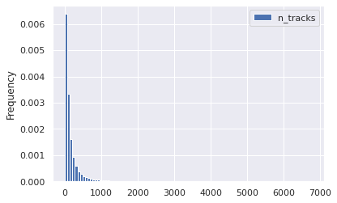
    


    removed items: 406


    

    


an example of bootstrapping `n_albums`


```python
means = []
ind = con_features[0]
for i in range(100):
    boot = random.sample(
                list(
                    df.loc[
                        (df[ind] > 9) 
                        & (df[ind] < 999)
                    ][ind].values),
                k=1000)
    means.append(np.mean(boot))
stuff = plt.hist(means, bins=100, density=True)
```


    

    


### Discrete, Dependent Variables

For the purposes of investigating a "successful" playlist, there are 5 primary metrics:


```python
targets
```


    ['streams',
     'stream30s',
     'dau',
     'wau',
     'mau',
     'mau_previous_month',
     'mau_both_months',
     'users',
     'skippers',
     'monthly_stream30s',
     'monthly_owner_stream30s']


```python
df[sub_targets].describe().round(1).to_excel("file.xlsx")
```

and "top" performers in each of these metrics were based on top 10% and top 1% quantiles:


```python
print('p99 targets')
for target in sub_targets:
    space = ' '* (20 - len(str(target)))
    print(f"{target}: {space} {np.quantile(df[target], 0.99)}")
print()
print('p90 targets')
for target in sub_targets:
    space = ' '* (20 - len(str(target)))
    print(f"{target}: {space} {np.quantile(df[target], 0.90)}")
```

    p99 targets
    mau_previous_month:    130.0
    mau_both_months:       19.0
    mau:                   143.0
    monthly_stream30s:     2843.0
    stream30s:             113.0
    
    p90 targets
    mau_previous_month:    9.0
    mau_both_months:       2.0
    mau:                   9.0
    monthly_stream30s:     432.0
    stream30s:             17.0


You can imagine with these metrics, some concerns are:

* what if a playlist was made in the current month, or even current day?
    * playlist is not properly represented by the data
* how do we normalize by playlists that already have a high visibility? i.e. what if a playlist is "good" but just isn't getting noticed?
    * can compute conversion metrics:
        * 30 second listens / total listens
        * mau both months / mau previous month
        
While noting these shortcomings, to keep the analysis focused I singled out the previously mentioned targets, with a focus on `monthly_stream30s` as the north star metric. `monthly_stream30s` is advantageous as a nort star metric since it contains data from the entire month (reducing variance) only contains relevant listens (greater than 30 seconds long). Some disadvantages of this metric are that it doesn't account for just a few listeners who may be providing the majority of listens, and playlists that were made in the current month will be undervalued.

### Dependency

#### Chi Square

In the chi-square test, the contigency table was used to calculate a `multiplier` effect. This is a ratio of ratios: the count of upper quantile over bottom quantile for the given group over the count of upper quantile over bottom quantile for non-group. In other words, it articulates how much more likely a sample in the given group is likely to be in the upper quantile vs a sample not in the given group


```python
chisq_results = pd.read_csv("chi_square_results.csv", index_col=0)
chisq_results.head()
```


<div>
<style scoped>
    .dataframe tbody tr th:only-of-type {
        vertical-align: middle;
    }

    .dataframe tbody tr th {
        vertical-align: top;
    }

    .dataframe thead th {
        text-align: right;
    }
</style>
<table border="1" class="dataframe">
  <thead>
    <tr style="text-align: right;">
      <th></th>
      <th>target</th>
      <th>upper q</th>
      <th>upper q value</th>
      <th>feature</th>
      <th>group</th>
      <th>chi</th>
      <th>p-value</th>
      <th>cTable</th>
      <th>multiplier</th>
      <th>reject null</th>
      <th>rank</th>
    </tr>
  </thead>
  <tbody>
    <tr>
      <th>12</th>
      <td>stream30s</td>
      <td>0.99</td>
      <td>113.0</td>
      <td>mood_3</td>
      <td>-</td>
      <td>125.854082</td>
      <td>3.309444e-29</td>
      <td>[[397434   1935]\n [  3927     70]]</td>
      <td>3.661181</td>
      <td>True</td>
      <td>0</td>
    </tr>
    <tr>
      <th>11</th>
      <td>monthly_stream30s</td>
      <td>0.99</td>
      <td>2843.0</td>
      <td>mood_2</td>
      <td>-</td>
      <td>109.163417</td>
      <td>1.494430e-25</td>
      <td>[[397529   1804]\n [  3969     64]]</td>
      <td>3.553294</td>
      <td>True</td>
      <td>0</td>
    </tr>
    <tr>
      <th>67</th>
      <td>mau_previous_month</td>
      <td>0.90</td>
      <td>9.0</td>
      <td>genre_1</td>
      <td>-</td>
      <td>95.863487</td>
      <td>1.230846e-22</td>
      <td>[[365249    769]\n [ 37173    175]]</td>
      <td>2.236007</td>
      <td>True</td>
      <td>0</td>
    </tr>
    <tr>
      <th>10</th>
      <td>monthly_stream30s</td>
      <td>0.99</td>
      <td>2843.0</td>
      <td>mood_1</td>
      <td>-</td>
      <td>112.668942</td>
      <td>2.549855e-26</td>
      <td>[[397605   1728]\n [  3970     63]]</td>
      <td>3.651389</td>
      <td>True</td>
      <td>0</td>
    </tr>
    <tr>
      <th>7</th>
      <td>stream30s</td>
      <td>0.99</td>
      <td>113.0</td>
      <td>mood_1</td>
      <td>-</td>
      <td>141.501726</td>
      <td>1.249779e-32</td>
      <td>[[397646   1723]\n [  3929     68]]</td>
      <td>3.994277</td>
      <td>True</td>
      <td>0</td>
    </tr>
  </tbody>
</table>
</div>


```python
chisq_results['target'].unique()
```


    array(['stream30s', 'monthly_stream30s', 'mau_previous_month', 'mau',
           'mau_both_months'], dtype=object)


```python
chisq_results['upper q'].unique()
```


    array([0.99, 0.9 ])


Taking together the five targets, the two upper quantiles, and the six categorical independent variables, we can identify which group occured the most frequently as a variable of influence:


```python
chisq_results.loc[(chisq_results['feature'].str.contains('genre'))
                & (chisq_results['group'] != '-')]['group'].value_counts()
```


    Traditional       16
    Children's        16
    Jazz              14
    Latin             12
    Easy Listening     8
    Soundtrack         8
    New Age            7
    Holiday            6
    Spoken & Audio     4
    Other              2
    Name: group, dtype: int64


Using these value counts as a "rank" we can then groupby this rank and see how each group is influencing the propensity to be in the upper quadrant

Taking "Romantic" as an example, we see that it's multiplier effect is relatively consistent across the five targets and two quantiles:


```python
sort_key = {i: j for i,j in zip(chisq_results['group'].value_counts().index.values, range(chisq_results['group'].nunique()))}
chisq_results['rank'] = chisq_results['group'].apply(lambda x: sort_key[x])
chisq_results.sort_values('rank', inplace=True)
# chisq_results.drop('rank', axis=1, inplace=True)
chisq_results.loc[chisq_results['group'] != '-'][:20]
```


<div>
<style scoped>
    .dataframe tbody tr th:only-of-type {
        vertical-align: middle;
    }

    .dataframe tbody tr th {
        vertical-align: top;
    }

    .dataframe thead th {
        text-align: right;
    }
</style>
<table border="1" class="dataframe">
  <thead>
    <tr style="text-align: right;">
      <th></th>
      <th>target</th>
      <th>upper q</th>
      <th>upper q value</th>
      <th>feature</th>
      <th>group</th>
      <th>chi</th>
      <th>p-value</th>
      <th>cTable</th>
      <th>multiplier</th>
      <th>reject null</th>
      <th>rank</th>
    </tr>
  </thead>
  <tbody>
    <tr>
      <th>3</th>
      <td>mau_both_months</td>
      <td>0.99</td>
      <td>19.0</td>
      <td>mood_1</td>
      <td>Romantic</td>
      <td>109.693770</td>
      <td>1.143607e-25</td>
      <td>[[390177   9231]\n [  3766    192]]</td>
      <td>2.154933</td>
      <td>True</td>
      <td>1</td>
    </tr>
    <tr>
      <th>5</th>
      <td>mau_previous_month</td>
      <td>0.90</td>
      <td>9.0</td>
      <td>mood_2</td>
      <td>Romantic</td>
      <td>1379.938658</td>
      <td>4.806442e-302</td>
      <td>[[357822   8196]\n [ 35327   2021]]</td>
      <td>2.497610</td>
      <td>True</td>
      <td>1</td>
    </tr>
    <tr>
      <th>8</th>
      <td>stream30s</td>
      <td>0.99</td>
      <td>113.0</td>
      <td>mood_1</td>
      <td>Romantic</td>
      <td>139.245969</td>
      <td>3.891401e-32</td>
      <td>[[390152   9217]\n [  3791    206]]</td>
      <td>2.300158</td>
      <td>True</td>
      <td>1</td>
    </tr>
    <tr>
      <th>6</th>
      <td>mau_previous_month</td>
      <td>0.99</td>
      <td>130.0</td>
      <td>mood_2</td>
      <td>Romantic</td>
      <td>104.434543</td>
      <td>1.624732e-24</td>
      <td>[[389323  10013]\n [  3826    204]]</td>
      <td>2.073152</td>
      <td>True</td>
      <td>1</td>
    </tr>
    <tr>
      <th>6</th>
      <td>mau</td>
      <td>0.90</td>
      <td>9.0</td>
      <td>mood_1</td>
      <td>Romantic</td>
      <td>1328.179994</td>
      <td>8.498925e-291</td>
      <td>[[355892   7442]\n [ 38051   1981]]</td>
      <td>2.489700</td>
      <td>True</td>
      <td>1</td>
    </tr>
    <tr>
      <th>5</th>
      <td>mau</td>
      <td>0.99</td>
      <td>143.0</td>
      <td>mood_3</td>
      <td>Romantic</td>
      <td>122.574129</td>
      <td>1.728356e-28</td>
      <td>[[389664   9685]\n [  3810    207]]</td>
      <td>2.185929</td>
      <td>True</td>
      <td>1</td>
    </tr>
    <tr>
      <th>10</th>
      <td>stream30s</td>
      <td>0.99</td>
      <td>113.0</td>
      <td>mood_3</td>
      <td>Romantic</td>
      <td>136.025552</td>
      <td>1.969792e-31</td>
      <td>[[389689   9680]\n [  3785    212]]</td>
      <td>2.254825</td>
      <td>True</td>
      <td>1</td>
    </tr>
    <tr>
      <th>6</th>
      <td>mau_previous_month</td>
      <td>0.90</td>
      <td>9.0</td>
      <td>mood_1</td>
      <td>Romantic</td>
      <td>1142.816205</td>
      <td>1.633755e-250</td>
      <td>[[358408   7610]\n [ 35535   1813]]</td>
      <td>2.402893</td>
      <td>True</td>
      <td>1</td>
    </tr>
    <tr>
      <th>6</th>
      <td>monthly_stream30s</td>
      <td>0.99</td>
      <td>2843.0</td>
      <td>mood_3</td>
      <td>Romantic</td>
      <td>149.750731</td>
      <td>1.965370e-34</td>
      <td>[[389660   9673]\n [  3814    219]]</td>
      <td>2.313066</td>
      <td>True</td>
      <td>1</td>
    </tr>
    <tr>
      <th>4</th>
      <td>monthly_stream30s</td>
      <td>0.99</td>
      <td>2843.0</td>
      <td>mood_1</td>
      <td>Romantic</td>
      <td>175.072639</td>
      <td>5.772239e-40</td>
      <td>[[390131   9202]\n [  3812    221]]</td>
      <td>2.457919</td>
      <td>True</td>
      <td>1</td>
    </tr>
    <tr>
      <th>6</th>
      <td>mau</td>
      <td>0.99</td>
      <td>143.0</td>
      <td>mood_2</td>
      <td>Romantic</td>
      <td>105.450504</td>
      <td>9.729814e-25</td>
      <td>[[389336  10013]\n [  3813    204]]</td>
      <td>2.080289</td>
      <td>True</td>
      <td>1</td>
    </tr>
    <tr>
      <th>5</th>
      <td>mau_previous_month</td>
      <td>0.99</td>
      <td>130.0</td>
      <td>mood_3</td>
      <td>Romantic</td>
      <td>112.605179</td>
      <td>2.633191e-26</td>
      <td>[[389647   9689]\n [  3827    203]]</td>
      <td>2.133192</td>
      <td>True</td>
      <td>1</td>
    </tr>
    <tr>
      <th>6</th>
      <td>stream30s</td>
      <td>0.99</td>
      <td>113.0</td>
      <td>mood_2</td>
      <td>Romantic</td>
      <td>148.026986</td>
      <td>4.679851e-34</td>
      <td>[[389374   9995]\n [  3775    222]]</td>
      <td>2.290974</td>
      <td>True</td>
      <td>1</td>
    </tr>
    <tr>
      <th>2</th>
      <td>mau</td>
      <td>0.99</td>
      <td>143.0</td>
      <td>mood_1</td>
      <td>Romantic</td>
      <td>202.823985</td>
      <td>5.053546e-46</td>
      <td>[[390156   9193]\n [  3787    230]]</td>
      <td>2.577588</td>
      <td>True</td>
      <td>1</td>
    </tr>
    <tr>
      <th>7</th>
      <td>monthly_stream30s</td>
      <td>0.99</td>
      <td>2843.0</td>
      <td>mood_2</td>
      <td>Romantic</td>
      <td>146.934024</td>
      <td>8.112487e-34</td>
      <td>[[389339   9994]\n [  3810    223]]</td>
      <td>2.280176</td>
      <td>True</td>
      <td>1</td>
    </tr>
    <tr>
      <th>8</th>
      <td>mau_previous_month</td>
      <td>0.90</td>
      <td>9.0</td>
      <td>mood_3</td>
      <td>Romantic</td>
      <td>1013.797108</td>
      <td>1.800082e-222</td>
      <td>[[357949   8069]\n [ 35525   1823]]</td>
      <td>2.276429</td>
      <td>True</td>
      <td>1</td>
    </tr>
    <tr>
      <th>4</th>
      <td>mau_previous_month</td>
      <td>0.99</td>
      <td>130.0</td>
      <td>mood_1</td>
      <td>Romantic</td>
      <td>156.500834</td>
      <td>6.579992e-36</td>
      <td>[[390127   9209]\n [  3816    214]]</td>
      <td>2.375740</td>
      <td>True</td>
      <td>1</td>
    </tr>
    <tr>
      <th>8</th>
      <td>mau</td>
      <td>0.90</td>
      <td>9.0</td>
      <td>mood_3</td>
      <td>Romantic</td>
      <td>1170.355016</td>
      <td>1.690629e-256</td>
      <td>[[355429   7905]\n [ 38045   1987]]</td>
      <td>2.348287</td>
      <td>True</td>
      <td>1</td>
    </tr>
    <tr>
      <th>1</th>
      <td>mau</td>
      <td>0.90</td>
      <td>9.0</td>
      <td>mood_2</td>
      <td>Romantic</td>
      <td>1531.190216</td>
      <td>0.000000e+00</td>
      <td>[[355299   8035]\n [ 37850   2182]]</td>
      <td>2.549159</td>
      <td>True</td>
      <td>1</td>
    </tr>
    <tr>
      <th>2</th>
      <td>mau</td>
      <td>0.90</td>
      <td>9.0</td>
      <td>mood_1</td>
      <td>Lively</td>
      <td>2423.134070</td>
      <td>0.000000e+00</td>
      <td>[[355493   7841]\n [ 37527   2505]]</td>
      <td>3.026380</td>
      <td>True</td>
      <td>2</td>
    </tr>
  </tbody>
</table>
</div>


```python
chisq_results.loc[(chisq_results['group'] == 'Traditional')
                 & (chisq_results['target'] == 'monthly_stream30s')]
```


<div>
<style scoped>
    .dataframe tbody tr th:only-of-type {
        vertical-align: middle;
    }

    .dataframe tbody tr th {
        vertical-align: top;
    }

    .dataframe thead th {
        text-align: right;
    }
</style>
<table border="1" class="dataframe">
  <thead>
    <tr style="text-align: right;">
      <th></th>
      <th>target</th>
      <th>upper q</th>
      <th>upper q value</th>
      <th>feature</th>
      <th>group</th>
      <th>chi</th>
      <th>p-value</th>
      <th>cTable</th>
      <th>multiplier</th>
      <th>reject null</th>
      <th>rank</th>
    </tr>
  </thead>
  <tbody>
    <tr>
      <th>36</th>
      <td>monthly_stream30s</td>
      <td>0.99</td>
      <td>2843.0</td>
      <td>genre_3</td>
      <td>Traditional</td>
      <td>29.032918</td>
      <td>7.115879e-08</td>
      <td>[[396376   2957]\n [  3973     60]]</td>
      <td>2.024364</td>
      <td>True</td>
      <td>3</td>
    </tr>
    <tr>
      <th>27</th>
      <td>monthly_stream30s</td>
      <td>0.99</td>
      <td>2843.0</td>
      <td>genre_2</td>
      <td>Traditional</td>
      <td>47.457479</td>
      <td>5.621008e-12</td>
      <td>[[396211   3122]\n [  3962     71]]</td>
      <td>2.274246</td>
      <td>True</td>
      <td>3</td>
    </tr>
  </tbody>
</table>
</div>


Let's use this idea of average multiplier effect, and average chi-square statistic to summarize by group.

Sorting by the test statistic, we see the top 5 most influential groups:


```python
chisq_results.groupby('group')[['chi', 'multiplier', 'rank']].mean().sort_values('chi', ascending=False)[:10]
```


<div>
<style scoped>
    .dataframe tbody tr th:only-of-type {
        vertical-align: middle;
    }

    .dataframe tbody tr th {
        vertical-align: top;
    }

    .dataframe thead th {
        text-align: right;
    }
</style>
<table border="1" class="dataframe">
  <thead>
    <tr style="text-align: right;">
      <th></th>
      <th>chi</th>
      <th>multiplier</th>
      <th>rank</th>
    </tr>
    <tr>
      <th>group</th>
      <th></th>
      <th></th>
      <th></th>
    </tr>
  </thead>
  <tbody>
    <tr>
      <th>Latin</th>
      <td>1686.610898</td>
      <td>3.001282</td>
      <td>6.0</td>
    </tr>
    <tr>
      <th>-</th>
      <td>766.884882</td>
      <td>3.049100</td>
      <td>0.0</td>
    </tr>
    <tr>
      <th>Sophisticated</th>
      <td>581.181538</td>
      <td>2.055203</td>
      <td>18.0</td>
    </tr>
    <tr>
      <th>Lively</th>
      <td>523.373076</td>
      <td>2.364492</td>
      <td>2.0</td>
    </tr>
    <tr>
      <th>Romantic</th>
      <td>493.442950</td>
      <td>2.318001</td>
      <td>1.0</td>
    </tr>
    <tr>
      <th>Soundtrack</th>
      <td>345.506268</td>
      <td>2.209295</td>
      <td>9.0</td>
    </tr>
    <tr>
      <th>Jazz</th>
      <td>323.657066</td>
      <td>2.342954</td>
      <td>5.0</td>
    </tr>
    <tr>
      <th>Fiery</th>
      <td>261.957158</td>
      <td>2.244027</td>
      <td>15.0</td>
    </tr>
    <tr>
      <th>Tender</th>
      <td>212.399270</td>
      <td>3.033890</td>
      <td>16.0</td>
    </tr>
    <tr>
      <th>Traditional</th>
      <td>176.194741</td>
      <td>2.361342</td>
      <td>3.0</td>
    </tr>
  </tbody>
</table>
</div>


Sorting instead by the multiplier, we can see which group has the _heaviest_ influence


```python
chisq_results.groupby('group')[['chi', 'multiplier', 'rank']].mean().sort_values('multiplier', ascending=False)[:10]
```


<div>
<style scoped>
    .dataframe tbody tr th:only-of-type {
        vertical-align: middle;
    }

    .dataframe tbody tr th {
        vertical-align: top;
    }

    .dataframe thead th {
        text-align: right;
    }
</style>
<table border="1" class="dataframe">
  <thead>
    <tr style="text-align: right;">
      <th></th>
      <th>chi</th>
      <th>multiplier</th>
      <th>rank</th>
    </tr>
    <tr>
      <th>group</th>
      <th></th>
      <th></th>
      <th></th>
    </tr>
  </thead>
  <tbody>
    <tr>
      <th>-</th>
      <td>766.884882</td>
      <td>3.049100</td>
      <td>0.0</td>
    </tr>
    <tr>
      <th>Tender</th>
      <td>212.399270</td>
      <td>3.033890</td>
      <td>16.0</td>
    </tr>
    <tr>
      <th>Latin</th>
      <td>1686.610898</td>
      <td>3.001282</td>
      <td>6.0</td>
    </tr>
    <tr>
      <th>Children's</th>
      <td>165.058604</td>
      <td>2.871261</td>
      <td>4.0</td>
    </tr>
    <tr>
      <th>Holiday</th>
      <td>41.741338</td>
      <td>2.836528</td>
      <td>12.0</td>
    </tr>
    <tr>
      <th>New Age</th>
      <td>75.783147</td>
      <td>2.754796</td>
      <td>10.0</td>
    </tr>
    <tr>
      <th>Spoken &amp; Audio</th>
      <td>163.859264</td>
      <td>2.610393</td>
      <td>14.0</td>
    </tr>
    <tr>
      <th>Peaceful</th>
      <td>61.046237</td>
      <td>2.564297</td>
      <td>13.0</td>
    </tr>
    <tr>
      <th>Other</th>
      <td>166.299708</td>
      <td>2.425104</td>
      <td>11.0</td>
    </tr>
    <tr>
      <th>Easy Listening</th>
      <td>99.533804</td>
      <td>2.407295</td>
      <td>8.0</td>
    </tr>
  </tbody>
</table>
</div>


Sorting instead by rank, we see which groups show up most frequently


```python
chisq_results.groupby('group')[['chi', 'multiplier', 'rank']].mean().sort_values('rank', ascending=True)[:10]
```


<div>
<style scoped>
    .dataframe tbody tr th:only-of-type {
        vertical-align: middle;
    }

    .dataframe tbody tr th {
        vertical-align: top;
    }

    .dataframe thead th {
        text-align: right;
    }
</style>
<table border="1" class="dataframe">
  <thead>
    <tr style="text-align: right;">
      <th></th>
      <th>chi</th>
      <th>multiplier</th>
      <th>rank</th>
    </tr>
    <tr>
      <th>group</th>
      <th></th>
      <th></th>
      <th></th>
    </tr>
  </thead>
  <tbody>
    <tr>
      <th>-</th>
      <td>766.884882</td>
      <td>3.049100</td>
      <td>0.0</td>
    </tr>
    <tr>
      <th>Romantic</th>
      <td>493.442950</td>
      <td>2.318001</td>
      <td>1.0</td>
    </tr>
    <tr>
      <th>Lively</th>
      <td>523.373076</td>
      <td>2.364492</td>
      <td>2.0</td>
    </tr>
    <tr>
      <th>Traditional</th>
      <td>176.194741</td>
      <td>2.361342</td>
      <td>3.0</td>
    </tr>
    <tr>
      <th>Children's</th>
      <td>165.058604</td>
      <td>2.871261</td>
      <td>4.0</td>
    </tr>
    <tr>
      <th>Jazz</th>
      <td>323.657066</td>
      <td>2.342954</td>
      <td>5.0</td>
    </tr>
    <tr>
      <th>Latin</th>
      <td>1686.610898</td>
      <td>3.001282</td>
      <td>6.0</td>
    </tr>
    <tr>
      <th>Serious</th>
      <td>103.700606</td>
      <td>2.190306</td>
      <td>7.0</td>
    </tr>
    <tr>
      <th>Easy Listening</th>
      <td>99.533804</td>
      <td>2.407295</td>
      <td>8.0</td>
    </tr>
    <tr>
      <th>Soundtrack</th>
      <td>345.506268</td>
      <td>2.209295</td>
      <td>9.0</td>
    </tr>
  </tbody>
</table>
</div>


```python
chisq_results.loc[chisq_results['target'] == 'monthly_stream30s']
```


<div>
<style scoped>
    .dataframe tbody tr th:only-of-type {
        vertical-align: middle;
    }

    .dataframe tbody tr th {
        vertical-align: top;
    }

    .dataframe thead th {
        text-align: right;
    }
</style>
<table border="1" class="dataframe">
  <thead>
    <tr style="text-align: right;">
      <th></th>
      <th>target</th>
      <th>upper q</th>
      <th>upper q value</th>
      <th>feature</th>
      <th>group</th>
      <th>chi</th>
      <th>p-value</th>
      <th>cTable</th>
      <th>multiplier</th>
      <th>reject null</th>
      <th>rank</th>
    </tr>
  </thead>
  <tbody>
    <tr>
      <th>14</th>
      <td>monthly_stream30s</td>
      <td>0.99</td>
      <td>2843.0</td>
      <td>mood_3</td>
      <td>-</td>
      <td>95.615882</td>
      <td>1.394829e-22</td>
      <td>[[397392   1941]\n [  3969     64]]</td>
      <td>3.301357</td>
      <td>True</td>
      <td>0</td>
    </tr>
    <tr>
      <th>3</th>
      <td>monthly_stream30s</td>
      <td>0.99</td>
      <td>2843.0</td>
      <td>genre_1</td>
      <td>-</td>
      <td>198.911522</td>
      <td>3.608821e-45</td>
      <td>[[398442    891]\n [  3980     53]]</td>
      <td>5.954979</td>
      <td>True</td>
      <td>0</td>
    </tr>
    <tr>
      <th>10</th>
      <td>monthly_stream30s</td>
      <td>0.99</td>
      <td>2843.0</td>
      <td>mood_1</td>
      <td>-</td>
      <td>112.668942</td>
      <td>2.549855e-26</td>
      <td>[[397605   1728]\n [  3970     63]]</td>
      <td>3.651389</td>
      <td>True</td>
      <td>0</td>
    </tr>
    <tr>
      <th>11</th>
      <td>monthly_stream30s</td>
      <td>0.99</td>
      <td>2843.0</td>
      <td>mood_2</td>
      <td>-</td>
      <td>109.163417</td>
      <td>1.494430e-25</td>
      <td>[[397529   1804]\n [  3969     64]]</td>
      <td>3.553294</td>
      <td>True</td>
      <td>0</td>
    </tr>
    <tr>
      <th>6</th>
      <td>monthly_stream30s</td>
      <td>0.99</td>
      <td>2843.0</td>
      <td>mood_3</td>
      <td>Romantic</td>
      <td>149.750731</td>
      <td>1.965370e-34</td>
      <td>[[389660   9673]\n [  3814    219]]</td>
      <td>2.313066</td>
      <td>True</td>
      <td>1</td>
    </tr>
    <tr>
      <th>4</th>
      <td>monthly_stream30s</td>
      <td>0.99</td>
      <td>2843.0</td>
      <td>mood_1</td>
      <td>Romantic</td>
      <td>175.072639</td>
      <td>5.772239e-40</td>
      <td>[[390131   9202]\n [  3812    221]]</td>
      <td>2.457919</td>
      <td>True</td>
      <td>1</td>
    </tr>
    <tr>
      <th>7</th>
      <td>monthly_stream30s</td>
      <td>0.99</td>
      <td>2843.0</td>
      <td>mood_2</td>
      <td>Romantic</td>
      <td>146.934024</td>
      <td>8.112487e-34</td>
      <td>[[389339   9994]\n [  3810    223]]</td>
      <td>2.280176</td>
      <td>True</td>
      <td>1</td>
    </tr>
    <tr>
      <th>22</th>
      <td>monthly_stream30s</td>
      <td>0.99</td>
      <td>2843.0</td>
      <td>mood_2</td>
      <td>Lively</td>
      <td>62.570224</td>
      <td>2.571115e-15</td>
      <td>[[393976   5357]\n [  3920    113]]</td>
      <td>2.120023</td>
      <td>True</td>
      <td>2</td>
    </tr>
    <tr>
      <th>5</th>
      <td>monthly_stream30s</td>
      <td>0.99</td>
      <td>2843.0</td>
      <td>mood_1</td>
      <td>Lively</td>
      <td>172.134248</td>
      <td>2.529542e-39</td>
      <td>[[389222  10111]\n [  3798    235]]</td>
      <td>2.381860</td>
      <td>True</td>
      <td>2</td>
    </tr>
    <tr>
      <th>36</th>
      <td>monthly_stream30s</td>
      <td>0.99</td>
      <td>2843.0</td>
      <td>genre_3</td>
      <td>Traditional</td>
      <td>29.032918</td>
      <td>7.115879e-08</td>
      <td>[[396376   2957]\n [  3973     60]]</td>
      <td>2.024364</td>
      <td>True</td>
      <td>3</td>
    </tr>
    <tr>
      <th>27</th>
      <td>monthly_stream30s</td>
      <td>0.99</td>
      <td>2843.0</td>
      <td>genre_2</td>
      <td>Traditional</td>
      <td>47.457479</td>
      <td>5.621008e-12</td>
      <td>[[396211   3122]\n [  3962     71]]</td>
      <td>2.274246</td>
      <td>True</td>
      <td>3</td>
    </tr>
    <tr>
      <th>37</th>
      <td>monthly_stream30s</td>
      <td>0.99</td>
      <td>2843.0</td>
      <td>genre_2</td>
      <td>Children's</td>
      <td>28.313598</td>
      <td>1.031687e-07</td>
      <td>[[397689   1644]\n [  3994     39]]</td>
      <td>2.362100</td>
      <td>True</td>
      <td>4</td>
    </tr>
    <tr>
      <th>2</th>
      <td>monthly_stream30s</td>
      <td>0.99</td>
      <td>2843.0</td>
      <td>genre_1</td>
      <td>Children's</td>
      <td>207.229586</td>
      <td>5.524721e-47</td>
      <td>[[397760   1573]\n [  3958     75]]</td>
      <td>4.791570</td>
      <td>True</td>
      <td>4</td>
    </tr>
    <tr>
      <th>6</th>
      <td>monthly_stream30s</td>
      <td>0.90</td>
      <td>432.0</td>
      <td>genre_1</td>
      <td>Children's</td>
      <td>262.624693</td>
      <td>4.596280e-59</td>
      <td>[[361785   1286]\n [ 39933    362]]</td>
      <td>2.550270</td>
      <td>True</td>
      <td>4</td>
    </tr>
    <tr>
      <th>16</th>
      <td>monthly_stream30s</td>
      <td>0.99</td>
      <td>2843.0</td>
      <td>genre_2</td>
      <td>Jazz</td>
      <td>79.207991</td>
      <td>5.590349e-19</td>
      <td>[[394671   4662]\n [  3924    109]]</td>
      <td>2.351584</td>
      <td>True</td>
      <td>5</td>
    </tr>
    <tr>
      <th>30</th>
      <td>monthly_stream30s</td>
      <td>0.99</td>
      <td>2843.0</td>
      <td>genre_3</td>
      <td>Jazz</td>
      <td>39.188768</td>
      <td>3.847472e-10</td>
      <td>[[395392   3941]\n [  3953     80]]</td>
      <td>2.030414</td>
      <td>True</td>
      <td>5</td>
    </tr>
    <tr>
      <th>0</th>
      <td>monthly_stream30s</td>
      <td>0.99</td>
      <td>2843.0</td>
      <td>genre_1</td>
      <td>Latin</td>
      <td>537.892273</td>
      <td>5.419582e-119</td>
      <td>[[384749  14584]\n [  3605    428]]</td>
      <td>3.132127</td>
      <td>True</td>
      <td>6</td>
    </tr>
    <tr>
      <th>0</th>
      <td>monthly_stream30s</td>
      <td>0.90</td>
      <td>432.0</td>
      <td>genre_1</td>
      <td>Latin</td>
      <td>1150.625294</td>
      <td>3.280867e-252</td>
      <td>[[350782  12289]\n [ 37572   2723]]</td>
      <td>2.068731</td>
      <td>True</td>
      <td>6</td>
    </tr>
    <tr>
      <th>50</th>
      <td>monthly_stream30s</td>
      <td>0.99</td>
      <td>2843.0</td>
      <td>mood_2</td>
      <td>Serious</td>
      <td>20.339173</td>
      <td>6.485903e-06</td>
      <td>[[397730   1603]\n [  3998     35]]</td>
      <td>2.172101</td>
      <td>True</td>
      <td>7</td>
    </tr>
    <tr>
      <th>38</th>
      <td>monthly_stream30s</td>
      <td>0.99</td>
      <td>2843.0</td>
      <td>genre_2</td>
      <td>Easy Listening</td>
      <td>28.186480</td>
      <td>1.101715e-07</td>
      <td>[[397256   2077]\n [  3987     46]]</td>
      <td>2.206712</td>
      <td>True</td>
      <td>8</td>
    </tr>
    <tr>
      <th>29</th>
      <td>monthly_stream30s</td>
      <td>0.99</td>
      <td>2843.0</td>
      <td>genre_1</td>
      <td>Easy Listening</td>
      <td>40.400033</td>
      <td>2.069376e-10</td>
      <td>[[398435    898]\n [  4004     29]]</td>
      <td>3.213550</td>
      <td>True</td>
      <td>8</td>
    </tr>
    <tr>
      <th>20</th>
      <td>monthly_stream30s</td>
      <td>0.99</td>
      <td>2843.0</td>
      <td>genre_1</td>
      <td>Soundtrack</td>
      <td>66.073066</td>
      <td>4.345131e-16</td>
      <td>[[392575   6758]\n [  3897    136]]</td>
      <td>2.027276</td>
      <td>True</td>
      <td>9</td>
    </tr>
    <tr>
      <th>28</th>
      <td>monthly_stream30s</td>
      <td>0.99</td>
      <td>2843.0</td>
      <td>genre_1</td>
      <td>New Age</td>
      <td>43.730647</td>
      <td>3.768245e-11</td>
      <td>[[397202   2131]\n [  3980     53]]</td>
      <td>2.482109</td>
      <td>True</td>
      <td>10</td>
    </tr>
    <tr>
      <th>12</th>
      <td>monthly_stream30s</td>
      <td>0.90</td>
      <td>432.0</td>
      <td>genre_1</td>
      <td>New Age</td>
      <td>166.484617</td>
      <td>4.335181e-38</td>
      <td>[[361286   1785]\n [ 39896    399]]</td>
      <td>2.024214</td>
      <td>True</td>
      <td>10</td>
    </tr>
    <tr>
      <th>21</th>
      <td>monthly_stream30s</td>
      <td>0.99</td>
      <td>2843.0</td>
      <td>genre_3</td>
      <td>New Age</td>
      <td>63.004025</td>
      <td>2.062846e-15</td>
      <td>[[397632   1701]\n [  3982     51]]</td>
      <td>2.993960</td>
      <td>True</td>
      <td>10</td>
    </tr>
    <tr>
      <th>15</th>
      <td>monthly_stream30s</td>
      <td>0.99</td>
      <td>2843.0</td>
      <td>genre_2</td>
      <td>New Age</td>
      <td>85.761620</td>
      <td>2.029879e-20</td>
      <td>[[397614   1719]\n [  3976     57]]</td>
      <td>3.315998</td>
      <td>True</td>
      <td>10</td>
    </tr>
    <tr>
      <th>33</th>
      <td>monthly_stream30s</td>
      <td>0.99</td>
      <td>2843.0</td>
      <td>mood_1</td>
      <td>Other</td>
      <td>30.443472</td>
      <td>3.437382e-08</td>
      <td>[[397678   1655]\n [  3993     40]]</td>
      <td>2.407101</td>
      <td>True</td>
      <td>11</td>
    </tr>
    <tr>
      <th>11</th>
      <td>monthly_stream30s</td>
      <td>0.90</td>
      <td>432.0</td>
      <td>mood_1</td>
      <td>Other</td>
      <td>197.598843</td>
      <td>6.979647e-45</td>
      <td>[[361719   1352]\n [ 39952    343]]</td>
      <td>2.296943</td>
      <td>True</td>
      <td>11</td>
    </tr>
    <tr>
      <th>26</th>
      <td>monthly_stream30s</td>
      <td>0.99</td>
      <td>2843.0</td>
      <td>mood_1</td>
      <td>Peaceful</td>
      <td>47.834009</td>
      <td>4.638752e-12</td>
      <td>[[397055   2278]\n [  3976     57]]</td>
      <td>2.498765</td>
      <td>True</td>
      <td>13</td>
    </tr>
    <tr>
      <th>17</th>
      <td>monthly_stream30s</td>
      <td>0.99</td>
      <td>2843.0</td>
      <td>mood_3</td>
      <td>Peaceful</td>
      <td>69.964512</td>
      <td>6.038104e-17</td>
      <td>[[396736   2597]\n [  3963     70]]</td>
      <td>2.698383</td>
      <td>True</td>
      <td>13</td>
    </tr>
    <tr>
      <th>12</th>
      <td>monthly_stream30s</td>
      <td>0.99</td>
      <td>2843.0</td>
      <td>mood_2</td>
      <td>Peaceful</td>
      <td>99.188851</td>
      <td>2.295356e-23</td>
      <td>[[396395   2938]\n [  3948     85]]</td>
      <td>2.904813</td>
      <td>True</td>
      <td>13</td>
    </tr>
    <tr>
      <th>52</th>
      <td>monthly_stream30s</td>
      <td>0.99</td>
      <td>2843.0</td>
      <td>genre_1</td>
      <td>Spoken &amp; Audio</td>
      <td>19.783961</td>
      <td>8.670724e-06</td>
      <td>[[398209   1124]\n [  4006     27]]</td>
      <td>2.387798</td>
      <td>True</td>
      <td>14</td>
    </tr>
    <tr>
      <th>19</th>
      <td>monthly_stream30s</td>
      <td>0.90</td>
      <td>432.0</td>
      <td>genre_1</td>
      <td>Spoken &amp; Audio</td>
      <td>120.508309</td>
      <td>4.896128e-28</td>
      <td>[[362147    924]\n [ 40068    227]]</td>
      <td>2.220451</td>
      <td>True</td>
      <td>14</td>
    </tr>
    <tr>
      <th>1</th>
      <td>monthly_stream30s</td>
      <td>0.99</td>
      <td>2843.0</td>
      <td>mood_1</td>
      <td>Tender</td>
      <td>218.759022</td>
      <td>1.686848e-49</td>
      <td>[[396180   3153]\n [  3916    117]]</td>
      <td>3.754151</td>
      <td>True</td>
      <td>16</td>
    </tr>
    <tr>
      <th>23</th>
      <td>monthly_stream30s</td>
      <td>0.99</td>
      <td>2843.0</td>
      <td>mood_2</td>
      <td>Easygoing</td>
      <td>61.911050</td>
      <td>3.593275e-15</td>
      <td>[[394661   4672]\n [  3931    102]]</td>
      <td>2.191889</td>
      <td>True</td>
      <td>17</td>
    </tr>
    <tr>
      <th>25</th>
      <td>monthly_stream30s</td>
      <td>0.99</td>
      <td>2843.0</td>
      <td>mood_3</td>
      <td>Easygoing</td>
      <td>49.108110</td>
      <td>2.422366e-12</td>
      <td>[[394265   5068]\n [  3931    102]]</td>
      <td>2.018593</td>
      <td>True</td>
      <td>17</td>
    </tr>
    <tr>
      <th>34</th>
      <td>monthly_stream30s</td>
      <td>0.99</td>
      <td>2843.0</td>
      <td>mood_3</td>
      <td>Somber</td>
      <td>29.620347</td>
      <td>5.255040e-08</td>
      <td>[[397107   2226]\n [  3984     49]]</td>
      <td>2.194114</td>
      <td>True</td>
      <td>19</td>
    </tr>
  </tbody>
</table>
</div>


It creates some fog to jumble together mood/genres this way. We can instead separate them and ask questions like:

##### What is the most influential primary genre on monthly streams over 30 seconds?

Answer: Children's followed by Latin

Reason: both genre's appear as influential in other guardrail metrics (high rank), have high test statistics, and are influential in both p99 and p90 with multiplier effects of [4.8, 2.6] and [3.1, 2.1], respectively.


```python
chisq_results.loc[(chisq_results['feature'] == 'genre_1')
                 & (chisq_results['target'] == 'monthly_stream30s')]
```


<div>
<style scoped>
    .dataframe tbody tr th:only-of-type {
        vertical-align: middle;
    }

    .dataframe tbody tr th {
        vertical-align: top;
    }

    .dataframe thead th {
        text-align: right;
    }
</style>
<table border="1" class="dataframe">
  <thead>
    <tr style="text-align: right;">
      <th></th>
      <th>target</th>
      <th>upper q</th>
      <th>upper q value</th>
      <th>feature</th>
      <th>group</th>
      <th>chi</th>
      <th>p-value</th>
      <th>cTable</th>
      <th>multiplier</th>
      <th>reject null</th>
      <th>rank</th>
    </tr>
  </thead>
  <tbody>
    <tr>
      <th>3</th>
      <td>monthly_stream30s</td>
      <td>0.99</td>
      <td>2843.0</td>
      <td>genre_1</td>
      <td>-</td>
      <td>198.911522</td>
      <td>3.608821e-45</td>
      <td>[[398442    891]\n [  3980     53]]</td>
      <td>5.954979</td>
      <td>True</td>
      <td>0</td>
    </tr>
    <tr>
      <th>2</th>
      <td>monthly_stream30s</td>
      <td>0.99</td>
      <td>2843.0</td>
      <td>genre_1</td>
      <td>Children's</td>
      <td>207.229586</td>
      <td>5.524721e-47</td>
      <td>[[397760   1573]\n [  3958     75]]</td>
      <td>4.791570</td>
      <td>True</td>
      <td>4</td>
    </tr>
    <tr>
      <th>6</th>
      <td>monthly_stream30s</td>
      <td>0.90</td>
      <td>432.0</td>
      <td>genre_1</td>
      <td>Children's</td>
      <td>262.624693</td>
      <td>4.596280e-59</td>
      <td>[[361785   1286]\n [ 39933    362]]</td>
      <td>2.550270</td>
      <td>True</td>
      <td>4</td>
    </tr>
    <tr>
      <th>0</th>
      <td>monthly_stream30s</td>
      <td>0.99</td>
      <td>2843.0</td>
      <td>genre_1</td>
      <td>Latin</td>
      <td>537.892273</td>
      <td>5.419582e-119</td>
      <td>[[384749  14584]\n [  3605    428]]</td>
      <td>3.132127</td>
      <td>True</td>
      <td>6</td>
    </tr>
    <tr>
      <th>0</th>
      <td>monthly_stream30s</td>
      <td>0.90</td>
      <td>432.0</td>
      <td>genre_1</td>
      <td>Latin</td>
      <td>1150.625294</td>
      <td>3.280867e-252</td>
      <td>[[350782  12289]\n [ 37572   2723]]</td>
      <td>2.068731</td>
      <td>True</td>
      <td>6</td>
    </tr>
    <tr>
      <th>29</th>
      <td>monthly_stream30s</td>
      <td>0.99</td>
      <td>2843.0</td>
      <td>genre_1</td>
      <td>Easy Listening</td>
      <td>40.400033</td>
      <td>2.069376e-10</td>
      <td>[[398435    898]\n [  4004     29]]</td>
      <td>3.213550</td>
      <td>True</td>
      <td>8</td>
    </tr>
    <tr>
      <th>20</th>
      <td>monthly_stream30s</td>
      <td>0.99</td>
      <td>2843.0</td>
      <td>genre_1</td>
      <td>Soundtrack</td>
      <td>66.073066</td>
      <td>4.345131e-16</td>
      <td>[[392575   6758]\n [  3897    136]]</td>
      <td>2.027276</td>
      <td>True</td>
      <td>9</td>
    </tr>
    <tr>
      <th>28</th>
      <td>monthly_stream30s</td>
      <td>0.99</td>
      <td>2843.0</td>
      <td>genre_1</td>
      <td>New Age</td>
      <td>43.730647</td>
      <td>3.768245e-11</td>
      <td>[[397202   2131]\n [  3980     53]]</td>
      <td>2.482109</td>
      <td>True</td>
      <td>10</td>
    </tr>
    <tr>
      <th>12</th>
      <td>monthly_stream30s</td>
      <td>0.90</td>
      <td>432.0</td>
      <td>genre_1</td>
      <td>New Age</td>
      <td>166.484617</td>
      <td>4.335181e-38</td>
      <td>[[361286   1785]\n [ 39896    399]]</td>
      <td>2.024214</td>
      <td>True</td>
      <td>10</td>
    </tr>
    <tr>
      <th>52</th>
      <td>monthly_stream30s</td>
      <td>0.99</td>
      <td>2843.0</td>
      <td>genre_1</td>
      <td>Spoken &amp; Audio</td>
      <td>19.783961</td>
      <td>8.670724e-06</td>
      <td>[[398209   1124]\n [  4006     27]]</td>
      <td>2.387798</td>
      <td>True</td>
      <td>14</td>
    </tr>
    <tr>
      <th>19</th>
      <td>monthly_stream30s</td>
      <td>0.90</td>
      <td>432.0</td>
      <td>genre_1</td>
      <td>Spoken &amp; Audio</td>
      <td>120.508309</td>
      <td>4.896128e-28</td>
      <td>[[362147    924]\n [ 40068    227]]</td>
      <td>2.220451</td>
      <td>True</td>
      <td>14</td>
    </tr>
  </tbody>
</table>
</div>


##### What is the most influential primary mood on monthly streams over 30 seconds?

Answer: Romantic and Lively

Reason: Romantic and Lively moods appear multiple times as highly influential (high rank) they have high multipliers. A contendent may be Tender, as it has a high multiplier effect as well at 3.75


```python
chisq_results.loc[(chisq_results['feature'] == 'mood_1')
                 & (chisq_results['target'] == 'monthly_stream30s')]
```


<div>
<style scoped>
    .dataframe tbody tr th:only-of-type {
        vertical-align: middle;
    }

    .dataframe tbody tr th {
        vertical-align: top;
    }

    .dataframe thead th {
        text-align: right;
    }
</style>
<table border="1" class="dataframe">
  <thead>
    <tr style="text-align: right;">
      <th></th>
      <th>target</th>
      <th>upper q</th>
      <th>upper q value</th>
      <th>feature</th>
      <th>group</th>
      <th>chi</th>
      <th>p-value</th>
      <th>cTable</th>
      <th>multiplier</th>
      <th>reject null</th>
      <th>rank</th>
    </tr>
  </thead>
  <tbody>
    <tr>
      <th>10</th>
      <td>monthly_stream30s</td>
      <td>0.99</td>
      <td>2843.0</td>
      <td>mood_1</td>
      <td>-</td>
      <td>112.668942</td>
      <td>2.549855e-26</td>
      <td>[[397605   1728]\n [  3970     63]]</td>
      <td>3.651389</td>
      <td>True</td>
      <td>0</td>
    </tr>
    <tr>
      <th>4</th>
      <td>monthly_stream30s</td>
      <td>0.99</td>
      <td>2843.0</td>
      <td>mood_1</td>
      <td>Romantic</td>
      <td>175.072639</td>
      <td>5.772239e-40</td>
      <td>[[390131   9202]\n [  3812    221]]</td>
      <td>2.457919</td>
      <td>True</td>
      <td>1</td>
    </tr>
    <tr>
      <th>5</th>
      <td>monthly_stream30s</td>
      <td>0.99</td>
      <td>2843.0</td>
      <td>mood_1</td>
      <td>Lively</td>
      <td>172.134248</td>
      <td>2.529542e-39</td>
      <td>[[389222  10111]\n [  3798    235]]</td>
      <td>2.381860</td>
      <td>True</td>
      <td>2</td>
    </tr>
    <tr>
      <th>33</th>
      <td>monthly_stream30s</td>
      <td>0.99</td>
      <td>2843.0</td>
      <td>mood_1</td>
      <td>Other</td>
      <td>30.443472</td>
      <td>3.437382e-08</td>
      <td>[[397678   1655]\n [  3993     40]]</td>
      <td>2.407101</td>
      <td>True</td>
      <td>11</td>
    </tr>
    <tr>
      <th>11</th>
      <td>monthly_stream30s</td>
      <td>0.90</td>
      <td>432.0</td>
      <td>mood_1</td>
      <td>Other</td>
      <td>197.598843</td>
      <td>6.979647e-45</td>
      <td>[[361719   1352]\n [ 39952    343]]</td>
      <td>2.296943</td>
      <td>True</td>
      <td>11</td>
    </tr>
    <tr>
      <th>26</th>
      <td>monthly_stream30s</td>
      <td>0.99</td>
      <td>2843.0</td>
      <td>mood_1</td>
      <td>Peaceful</td>
      <td>47.834009</td>
      <td>4.638752e-12</td>
      <td>[[397055   2278]\n [  3976     57]]</td>
      <td>2.498765</td>
      <td>True</td>
      <td>13</td>
    </tr>
    <tr>
      <th>1</th>
      <td>monthly_stream30s</td>
      <td>0.99</td>
      <td>2843.0</td>
      <td>mood_1</td>
      <td>Tender</td>
      <td>218.759022</td>
      <td>1.686848e-49</td>
      <td>[[396180   3153]\n [  3916    117]]</td>
      <td>3.754151</td>
      <td>True</td>
      <td>16</td>
    </tr>
  </tbody>
</table>
</div>


##### Which Categorical Feature is most influential overall?

Answer: genre_1, followed by genre_2 and mood_1

Reason: we see that these features appear multiple times across the 5 different targets and 2 different quantiles


```python
chisq_results['feature'].value_counts()
```


    genre_1    48
    genre_2    39
    mood_1     34
    mood_2     28
    mood_3     17
    genre_3    16
    Name: feature, dtype: int64


##### What are the shortcomings of this analysis?

We haven't taken into account confounding variables. For example, perhaps Latin genre is typically associated with Lively mood. Then which variable is it that actually contributes to a highly performing playlist? We have strategies for dealing with this. We can stratify the confounding variables by over or under sampling. We can also consider them together in a forward selection logistic model. We will take the latter approach later on in the analysis.

We haven't considered the categorical variables alongside the continuous variables, so we don't know how they fit overall in terms of relative improtance. We will approach this the same way as the confounding variables issue, and incorporate all variables in a logistic regression.

#### t-Test


```python
ttest_results = pd.read_csv("t_test_results.csv", index_col=0)
ttest_results.head()
```


<div>
<style scoped>
    .dataframe tbody tr th:only-of-type {
        vertical-align: middle;
    }

    .dataframe tbody tr th {
        vertical-align: top;
    }

    .dataframe thead th {
        text-align: right;
    }
</style>
<table border="1" class="dataframe">
  <thead>
    <tr style="text-align: right;">
      <th></th>
      <th>target</th>
      <th>feature</th>
      <th>test stat</th>
      <th>p-value</th>
      <th>upper q avg</th>
      <th>lower q avg</th>
      <th>reject null</th>
    </tr>
  </thead>
  <tbody>
    <tr>
      <th>0</th>
      <td>mau_previous_month</td>
      <td>n_albums</td>
      <td>-25.318099</td>
      <td>4.772854e-63</td>
      <td>69.77939</td>
      <td>78.70629</td>
      <td>True</td>
    </tr>
    <tr>
      <th>1</th>
      <td>mau_previous_month</td>
      <td>n_artists</td>
      <td>-15.418330</td>
      <td>9.408966e-36</td>
      <td>68.08641</td>
      <td>73.90254</td>
      <td>True</td>
    </tr>
    <tr>
      <th>2</th>
      <td>mau_previous_month</td>
      <td>n_local_tracks</td>
      <td>-9.550137</td>
      <td>7.728853e-18</td>
      <td>1.60489</td>
      <td>2.07692</td>
      <td>True</td>
    </tr>
    <tr>
      <th>3</th>
      <td>mau_previous_month</td>
      <td>n_tracks</td>
      <td>6.086774</td>
      <td>5.913654e-09</td>
      <td>149.50371</td>
      <td>145.10534</td>
      <td>True</td>
    </tr>
    <tr>
      <th>0</th>
      <td>mau_both_months</td>
      <td>n_artists</td>
      <td>52.402365</td>
      <td>2.845239e-114</td>
      <td>91.41907</td>
      <td>71.97618</td>
      <td>True</td>
    </tr>
  </tbody>
</table>
</div>


#### Models


```python
log_results = pd.read_csv("../../scripts/fwd_selection_results.txt", header=None, index_col=0)
log_results.columns = ['feature', 'pseudo r2']
log_results.reset_index(inplace=True, drop=True)
log_results.drop(0, axis=0, inplace=True)
log_results
```


<div>
<style scoped>
    .dataframe tbody tr th:only-of-type {
        vertical-align: middle;
    }

    .dataframe tbody tr th {
        vertical-align: top;
    }

    .dataframe thead th {
        text-align: right;
    }
</style>
<table border="1" class="dataframe">
  <thead>
    <tr style="text-align: right;">
      <th></th>
      <th>feature</th>
      <th>pseudo r2</th>
    </tr>
  </thead>
  <tbody>
    <tr>
      <th>1</th>
      <td>intercept</td>
      <td>2.197000e-12</td>
    </tr>
    <tr>
      <th>2</th>
      <td>n_albums</td>
      <td>2.614000e-02</td>
    </tr>
    <tr>
      <th>3</th>
      <td>genre_1_Latin</td>
      <td>3.093000e-02</td>
    </tr>
    <tr>
      <th>4</th>
      <td>genre_1_Indie Rock</td>
      <td>3.274000e-02</td>
    </tr>
    <tr>
      <th>5</th>
      <td>genre_1_Rap</td>
      <td>3.431000e-02</td>
    </tr>
    <tr>
      <th>6</th>
      <td>genre_1_Dance &amp; House</td>
      <td>3.568000e-02</td>
    </tr>
    <tr>
      <th>7</th>
      <td>genre_1_Rock</td>
      <td>3.674000e-02</td>
    </tr>
    <tr>
      <th>8</th>
      <td>mood_1_Energizing</td>
      <td>3.772000e-02</td>
    </tr>
    <tr>
      <th>9</th>
      <td>genre_1_Children's</td>
      <td>3.863000e-02</td>
    </tr>
    <tr>
      <th>10</th>
      <td>mood_1_Tender</td>
      <td>3.931000e-02</td>
    </tr>
    <tr>
      <th>11</th>
      <td>mood_1_Other</td>
      <td>3.995000e-02</td>
    </tr>
    <tr>
      <th>12</th>
      <td>n_tracks</td>
      <td>4.052000e-02</td>
    </tr>
    <tr>
      <th>13</th>
      <td>mood_1_Peaceful</td>
      <td>4.106000e-02</td>
    </tr>
    <tr>
      <th>14</th>
      <td>mood_1_Romantic</td>
      <td>4.161000e-02</td>
    </tr>
    <tr>
      <th>15</th>
      <td>genre_1_Electronica</td>
      <td>4.208000e-02</td>
    </tr>
    <tr>
      <th>16</th>
      <td>genre_2_Indie Rock</td>
      <td>4.248000e-02</td>
    </tr>
    <tr>
      <th>17</th>
      <td>mood_2_Energizing</td>
      <td>4.287000e-02</td>
    </tr>
    <tr>
      <th>18</th>
      <td>genre_1_R&amp;B</td>
      <td>4.319000e-02</td>
    </tr>
    <tr>
      <th>19</th>
      <td>genre_3_Indie Rock</td>
      <td>4.353000e-02</td>
    </tr>
    <tr>
      <th>20</th>
      <td>genre_1_Classical</td>
      <td>4.379000e-02</td>
    </tr>
    <tr>
      <th>21</th>
      <td>genre_2_Alternative</td>
      <td>4.403000e-02</td>
    </tr>
    <tr>
      <th>22</th>
      <td>genre_2_Metal</td>
      <td>4.427000e-02</td>
    </tr>
    <tr>
      <th>23</th>
      <td>mood_2_Peaceful</td>
      <td>4.449000e-02</td>
    </tr>
    <tr>
      <th>24</th>
      <td>mood_2_Romantic</td>
      <td>4.472000e-02</td>
    </tr>
    <tr>
      <th>25</th>
      <td>mood_3_Romantic</td>
      <td>4.498000e-02</td>
    </tr>
    <tr>
      <th>26</th>
      <td>genre_3_Alternative</td>
      <td>4.522000e-02</td>
    </tr>
  </tbody>
</table>
</div>


```python
target = "monthly_stream30s"
y = df[target].values
labels = y.copy()
names = []
weights = y.copy()
weights.dtype = 'float'
lim = 11
dom_class_weight = 1 / (lim - 1 - 1)
for idx, quant in zip(range(lim), np.linspace(0, 1, num=lim)):
    if idx < lim - 2:
        prev = quant
        continue
    elif idx == lim - 2:
        weights[y <= np.quantile(y, quant)] = dom_class_weight
        labels[labels <= np.quantile(y, quant)] = 0
        names += [f"less than {np.quantile(y, quant):.0f} listens"]
        
    else:
        labels[(labels > np.quantile(y, prev))
              & (labels <= np.quantile(y, quant))] = 1
        weights[(y > np.quantile(y, prev))
              & (y <= np.quantile(y, quant))] = 1.0
        names += [f"{np.quantile(y, prev):.0f} < listens <= {np.quantile(y, quant):.0f}"]
    prev = quant
y = labels

basemodel = pd.read_csv("../../scripts/basemodel.csv", index_col = 0)
X2 = basemodel.values
est = Logit(y, X2)
est2 = est.fit(disp=0)
summ = est2.summary()

res_table = summ.tables[1]
res_df = pd.DataFrame(res_table.data)
cols = res_df.iloc[0]
cols = [str(i) for i in cols]
res_df.drop(0, axis=0, inplace=True)
res_df.set_index(0, inplace=True)
res_df.columns = cols[1:]
res_df.index = basemodel.columns
res_df
```


<div>
<style scoped>
    .dataframe tbody tr th:only-of-type {
        vertical-align: middle;
    }

    .dataframe tbody tr th {
        vertical-align: top;
    }

    .dataframe thead th {
        text-align: right;
    }
</style>
<table border="1" class="dataframe">
  <thead>
    <tr style="text-align: right;">
      <th></th>
      <th>coef</th>
      <th>std err</th>
      <th>z</th>
      <th>P&gt;|z|</th>
      <th>[0.025</th>
      <th>0.975]</th>
    </tr>
  </thead>
  <tbody>
    <tr>
      <th>intercept</th>
      <td>-2.0919</td>
      <td>0.012</td>
      <td>-180.211</td>
      <td>0.000</td>
      <td>-2.115</td>
      <td>-2.069</td>
    </tr>
    <tr>
      <th>n_albums</th>
      <td>0.2659</td>
      <td>0.012</td>
      <td>21.370</td>
      <td>0.000</td>
      <td>0.241</td>
      <td>0.290</td>
    </tr>
    <tr>
      <th>genre_1_Latin</th>
      <td>0.5389</td>
      <td>0.025</td>
      <td>21.354</td>
      <td>0.000</td>
      <td>0.489</td>
      <td>0.588</td>
    </tr>
    <tr>
      <th>genre_1_Indie Rock</th>
      <td>-0.5919</td>
      <td>0.020</td>
      <td>-30.130</td>
      <td>0.000</td>
      <td>-0.630</td>
      <td>-0.553</td>
    </tr>
    <tr>
      <th>genre_1_Rap</th>
      <td>-0.3552</td>
      <td>0.018</td>
      <td>-19.651</td>
      <td>0.000</td>
      <td>-0.391</td>
      <td>-0.320</td>
    </tr>
    <tr>
      <th>genre_1_Dance &amp; House</th>
      <td>-0.3364</td>
      <td>0.023</td>
      <td>-14.444</td>
      <td>0.000</td>
      <td>-0.382</td>
      <td>-0.291</td>
    </tr>
    <tr>
      <th>genre_1_Rock</th>
      <td>-0.4325</td>
      <td>0.024</td>
      <td>-18.072</td>
      <td>0.000</td>
      <td>-0.479</td>
      <td>-0.386</td>
    </tr>
    <tr>
      <th>mood_1_Energizing</th>
      <td>-0.3012</td>
      <td>0.026</td>
      <td>-11.592</td>
      <td>0.000</td>
      <td>-0.352</td>
      <td>-0.250</td>
    </tr>
    <tr>
      <th>genre_1_Children's</th>
      <td>0.7694</td>
      <td>0.061</td>
      <td>12.545</td>
      <td>0.000</td>
      <td>0.649</td>
      <td>0.890</td>
    </tr>
    <tr>
      <th>mood_1_Tender</th>
      <td>0.6086</td>
      <td>0.053</td>
      <td>11.496</td>
      <td>0.000</td>
      <td>0.505</td>
      <td>0.712</td>
    </tr>
    <tr>
      <th>mood_1_Other</th>
      <td>0.8435</td>
      <td>0.062</td>
      <td>13.497</td>
      <td>0.000</td>
      <td>0.721</td>
      <td>0.966</td>
    </tr>
    <tr>
      <th>n_tracks</th>
      <td>0.0465</td>
      <td>0.006</td>
      <td>7.665</td>
      <td>0.000</td>
      <td>0.035</td>
      <td>0.058</td>
    </tr>
    <tr>
      <th>mood_1_Peaceful</th>
      <td>0.7355</td>
      <td>0.057</td>
      <td>12.849</td>
      <td>0.000</td>
      <td>0.623</td>
      <td>0.848</td>
    </tr>
    <tr>
      <th>mood_1_Romantic</th>
      <td>0.3608</td>
      <td>0.032</td>
      <td>11.187</td>
      <td>0.000</td>
      <td>0.298</td>
      <td>0.424</td>
    </tr>
    <tr>
      <th>genre_1_Electronica</th>
      <td>-0.2585</td>
      <td>0.033</td>
      <td>-7.726</td>
      <td>0.000</td>
      <td>-0.324</td>
      <td>-0.193</td>
    </tr>
    <tr>
      <th>genre_2_Indie Rock</th>
      <td>-0.2338</td>
      <td>0.022</td>
      <td>-10.617</td>
      <td>0.000</td>
      <td>-0.277</td>
      <td>-0.191</td>
    </tr>
    <tr>
      <th>mood_2_Energizing</th>
      <td>-0.1235</td>
      <td>0.018</td>
      <td>-6.837</td>
      <td>0.000</td>
      <td>-0.159</td>
      <td>-0.088</td>
    </tr>
    <tr>
      <th>genre_1_R&amp;B</th>
      <td>-0.2373</td>
      <td>0.030</td>
      <td>-7.999</td>
      <td>0.000</td>
      <td>-0.295</td>
      <td>-0.179</td>
    </tr>
    <tr>
      <th>genre_3_Indie Rock</th>
      <td>-0.1994</td>
      <td>0.022</td>
      <td>-8.880</td>
      <td>0.000</td>
      <td>-0.243</td>
      <td>-0.155</td>
    </tr>
    <tr>
      <th>genre_1_Classical</th>
      <td>-0.5369</td>
      <td>0.059</td>
      <td>-9.114</td>
      <td>0.000</td>
      <td>-0.652</td>
      <td>-0.421</td>
    </tr>
    <tr>
      <th>genre_2_Alternative</th>
      <td>0.1578</td>
      <td>0.018</td>
      <td>8.915</td>
      <td>0.000</td>
      <td>0.123</td>
      <td>0.192</td>
    </tr>
    <tr>
      <th>genre_2_Metal</th>
      <td>0.3654</td>
      <td>0.039</td>
      <td>9.356</td>
      <td>0.000</td>
      <td>0.289</td>
      <td>0.442</td>
    </tr>
    <tr>
      <th>mood_2_Peaceful</th>
      <td>0.4354</td>
      <td>0.053</td>
      <td>8.150</td>
      <td>0.000</td>
      <td>0.331</td>
      <td>0.540</td>
    </tr>
    <tr>
      <th>mood_2_Romantic</th>
      <td>0.2643</td>
      <td>0.031</td>
      <td>8.628</td>
      <td>0.000</td>
      <td>0.204</td>
      <td>0.324</td>
    </tr>
    <tr>
      <th>mood_3_Romantic</th>
      <td>0.2600</td>
      <td>0.031</td>
      <td>8.363</td>
      <td>0.000</td>
      <td>0.199</td>
      <td>0.321</td>
    </tr>
    <tr>
      <th>genre_3_Alternative</th>
      <td>0.1152</td>
      <td>0.018</td>
      <td>6.548</td>
      <td>0.000</td>
      <td>0.081</td>
      <td>0.150</td>
    </tr>
    <tr>
      <th>n_artists</th>
      <td>0.0968</td>
      <td>0.013</td>
      <td>7.587</td>
      <td>0.000</td>
      <td>0.072</td>
      <td>0.122</td>
    </tr>
    <tr>
      <th>genre_1_Metal</th>
      <td>0.3371</td>
      <td>0.041</td>
      <td>8.282</td>
      <td>0.000</td>
      <td>0.257</td>
      <td>0.417</td>
    </tr>
    <tr>
      <th>mood_1_Aggressive</th>
      <td>-0.2743</td>
      <td>0.041</td>
      <td>-6.671</td>
      <td>0.000</td>
      <td>-0.355</td>
      <td>-0.194</td>
    </tr>
    <tr>
      <th>mood_3_Peaceful</th>
      <td>0.3313</td>
      <td>0.057</td>
      <td>5.778</td>
      <td>0.000</td>
      <td>0.219</td>
      <td>0.444</td>
    </tr>
    <tr>
      <th>mood_1_Empowering</th>
      <td>0.1344</td>
      <td>0.020</td>
      <td>6.801</td>
      <td>0.000</td>
      <td>0.096</td>
      <td>0.173</td>
    </tr>
    <tr>
      <th>genre_1_Religious</th>
      <td>-0.1832</td>
      <td>0.032</td>
      <td>-5.799</td>
      <td>0.000</td>
      <td>-0.245</td>
      <td>-0.121</td>
    </tr>
    <tr>
      <th>genre_3_Metal</th>
      <td>0.2308</td>
      <td>0.043</td>
      <td>5.361</td>
      <td>0.000</td>
      <td>0.146</td>
      <td>0.315</td>
    </tr>
    <tr>
      <th>genre_3_R&amp;B</th>
      <td>-0.1163</td>
      <td>0.022</td>
      <td>-5.238</td>
      <td>0.000</td>
      <td>-0.160</td>
      <td>-0.073</td>
    </tr>
  </tbody>
</table>
</div>


## Final Figures and Tables


```python
df = pd.read_csv("../../data/playlist_summary_external-4.txt", delimiter='\t')
```

### Dependency


```python
sub_targets = ['mau_previous_month', 'mau_both_months', 'monthly_stream30s', 'stream30s']
# sub_targets = ['mau', 'dau', 'monthly_stream30s', 'stream30s']

des_features = ['mood_1', 'mood_2', 'mood_3', 'genre_1', 'genre_2', 'genre_3']
con_features = ['n_albums', 'n_artists', 'n_tracks', 'n_local_tracks']
df['success'] = df[sub_targets].apply(lambda x: x > np.quantile(x, 0.75)).all(axis=1)

df['listen_conversions'] = df['stream30s'] / df['streams']
df['listen_conversions'].fillna(value=0, inplace=True)

df['user_retention'] = df['mau_both_months'] / df['mau_previous_month']
df['user_retention'].fillna(value=0, inplace=True)

df['user_conversions'] = df['mau'] / df['users']
df['user_conversions'].fillna(value=0, inplace=True)


df['mau_growing'] = df['mau'] > df['mau_previous_month']
df['mau_growth'] = df['mau'] / df['mau_previous_month']
df['mau_growth'].fillna(value=0, inplace=True)
df['mau_growth'].replace([np.inf, -np.inf], 1, inplace=True)

new_metrics = ['listen_conversions', 'user_conversions', 'user_retention', 'mau_growth']

df['new_success'] = df[new_metrics].apply(lambda x: (x > 0.5) if (max(x) == 1) else (x > 1)).all(axis=1)
```

#### Discrete


```python
fig, ax = plt.subplots(1, 2, figsize=(10,10))

dff = pd.DataFrame(df[des_features[0]].value_counts()).join(
    pd.DataFrame(df[des_features[1]].value_counts())).join(
    pd.DataFrame(df[des_features[2]].value_counts()))
dff = dff.reset_index().melt(id_vars='index')
dff.columns = ['mood', 'order', 'count']
sns.barplot(data=dff, hue='order', y='mood', x='count', orient='h', ax=ax[0])

dff = pd.DataFrame(df[des_features[3]].value_counts()).join(
    pd.DataFrame(df[des_features[4]].value_counts())).join(
    pd.DataFrame(df[des_features[5]].value_counts()))
dff = dff.reset_index().melt(id_vars='index')
dff.columns = ['genre', 'order', 'count']
sns.barplot(data=dff, hue='order', y='genre', x='count', orient='h', ax=ax[1])

plt.tight_layout()
fig.savefig("discrete_rank_bar_plot.svg")
```


    
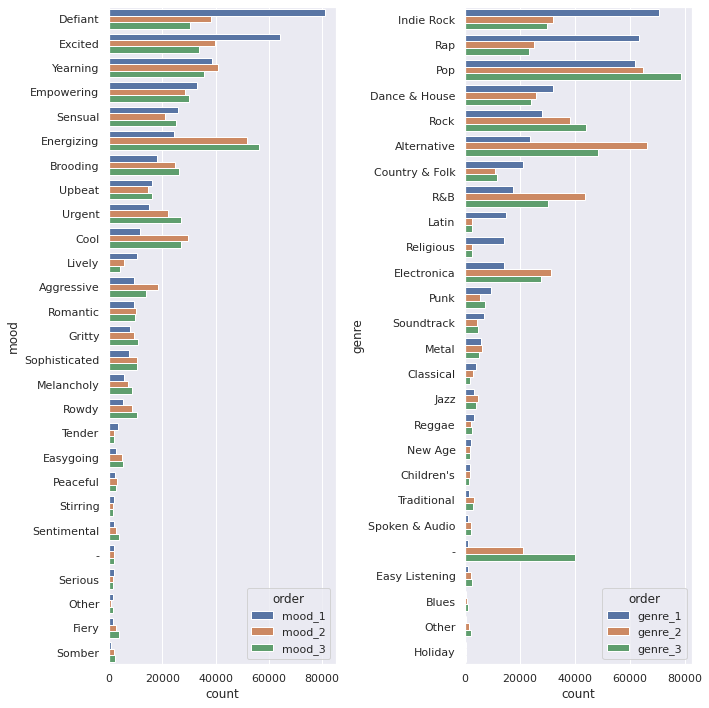
    


```python
def make_chisum(target='success'):
    
    chidf = pd.DataFrame()
    chidf[target] = df[target]
    chisum = pd.DataFrame()
    cutoff = 0.01
    pop = chidf[target].values

    for ind in des_features:
        chidf[ind] = df[ind]

        for grp_label in df[ind].unique():
            try:
                cTable = chidf.groupby(chidf[ind] == grp_label)[target].value_counts().values.reshape(2,2).T
                chi2, p, dof, ex = stats.chi2_contingency(cTable, correction=True, lambda_=None)
                ratio = cTable[1]/cTable[0]
                pos = ratio[1]/ratio[0]
                chisum = pd.concat([chisum, pd.DataFrame([[ind, grp_label, chi2, p, cTable, pos, p<cutoff]])])
            except:
                pass

    chisum.columns = ['feature', 'group', 'chi', 'p-value', 'cTable', 'multiplier', 'reject null']
    chisum = chisum.sort_values('p-value').reset_index(drop=True)
    
    return chisum

def make_cat_plots(target='success', ind_feature='genre_1'):
    fig, ax = plt.subplots(2, 2, figsize=(10,10), sharex='col', sharey='row')


    genre_list = chisum.loc[(chisum['feature'] == ind_feature)
                           & (chisum['reject null'] == True)].sort_values('multiplier', ascending=False)['group'].values

    dff = pd.DataFrame(df.groupby([ind_feature])[target].value_counts(sort=False))
    dff.columns = ['percent']
    dff = dff.reset_index()
    dff.loc[dff[target] == True, 'percent'] = dff.loc[dff[target] == True, 'percent'] / dff.loc[dff[target] == True, 'percent'].sum() 
    dff.loc[dff[target] == False, 'percent'] = dff.loc[dff[target] == False, 'percent'] / dff.loc[dff[target] == False, 'percent'].sum() 
    dff = dff.set_index(ind_feature).loc[genre_list,:]
    dff = dff.reset_index()

    sns.barplot(data=dff.iloc[:10,:], hue=target, y=ind_feature, x='percent', ax=ax[0,0])
    ax[0,0].set_title('Best  and Worst Genres, Percent')
    ax[0,0].set_ylabel('')
    ax[0,0].set_xlabel('')
    sns.barplot(data=dff.iloc[-10:,:], hue=target, y=ind_feature, x='percent', ax=ax[1,0])
    ax[1,0].set_ylabel('')

    dff = pd.DataFrame(df.groupby([ind_feature])[target].value_counts(sort=False))
    dff.columns = ['count']
    dff = dff.reset_index()
    dff = dff.set_index(ind_feature).loc[genre_list,:]
    dff = dff.reset_index()

    sns.barplot(data=dff.iloc[:10,:], hue=target, y=ind_feature, x='count', ax=ax[0,1])
    ax[0,1].set_title('Best and Worst Genres, Count')
    ax[0,1].set_ylabel('')
    ax[0,1].set_xlabel('')
    sns.barplot(data=dff.iloc[-10:,:], hue=target, y=ind_feature, x='count', ax=ax[1,1])
    ax[1,1].set_ylabel('')
    plt.tight_layout()

    ax[0,0].get_legend().remove()
    ax[1,1].get_legend().remove()
    ax[1,0].get_legend().remove()
    ax[0,1].legend(framealpha=1, facecolor='white', title="Success")
    
    return fig
```


```python
ind_feature = 'genre_1'
target = 'success'

chisum = make_chisum(target)
fig = make_cat_plots(target, ind_feature)

chisum.loc[(chisum['feature'] == ind_feature)
        & (chisum['reject null'] == True)].sort_values('multiplier', 
           ascending=False).to_excel(f'{target}_{ind_feature}_categorical.xlsx')

fig.savefig(f"{target}_{ind_feature}_categorical.svg")
```


    

    


```python
ind_feature = 'mood_1'
target = 'success'

chisum = make_chisum(target)
fig = make_cat_plots(target, ind_feature)

chisum.loc[(chisum['feature'] == ind_feature)
        & (chisum['reject null'] == True)].sort_values('multiplier', 
           ascending=False).to_excel(f'{target}_{ind_feature}_categorical.xlsx')

fig.savefig(f"{target}_{ind_feature}_categorical.svg")
```


    

    


#### Continuous


```python
def make_con_plots(target, con_features):
    fig, ((ax1, ax2),(ax3, ax4)) = plt.subplots(2,2, figsize=(10,10))
    chidf = pd.DataFrame()
    chidf[target] = df[target]
    welchsum = pd.DataFrame()
    cutoff = 0.01
    pop = chidf[target].values

    for ind, ax in zip(con_features, [ax1, ax2, ax3, ax4]):
        chidf[ind] = df[ind]
        a = []
        b = []
        for i in range(100):
            boot1 = random.sample(
                        list(
                            chidf.loc[
                                (chidf[target] == True)
                            ][ind].values),
                        k=1000)
            boot2 = random.sample(
                        list(
                            chidf.loc[
                                (chidf[target] == False)
                            ][ind].values),
                        k=1000)
            a.append(np.mean(boot1))
            b.append(np.mean(boot2))
        testt, p = stats.ttest_ind(a, b, equal_var=False)
        a_avg = np.mean(a)
        b_avg = np.mean(b)
        welchsum = pd.concat([welchsum, pd.DataFrame([[ind, testt, p, a_avg, b_avg, p<cutoff]])])
        sns.histplot(a, color='tab:orange', label=f"{target} == True", ax=ax)
        sns.histplot(b, label=f"{target} == False", ax=ax)
        ax.set_title(ind)

    welchsum.columns = ['feature', 'test stat', 'p-value', 'upper q avg', 'lower q avg', 'reject null']
    welchsum = welchsum.sort_values('p-value').reset_index(drop=True)
    ax.legend()
    
    return fig, welchsum
```


```python
target = 'new_success'

fig, welchsum = make_con_plots(target, con_features)

welchsum.to_excel(f"{target}_continuous.xlsx")
fig.savefig(f"{target}_ttest.svg")
```


    

    


### Models

#### Logistic Regression


```python
### y
target = "success"
print(target)
y = df[target].values

#### X
X = df[des_features + con_features]
enc = OneHotEncoder()
std = StandardScaler()
X_cat = enc.fit_transform(X[des_features]).toarray()
X_con = std.fit_transform(X[con_features])
X = np.hstack((np.ones((X_con.shape[0], 1)), X_con, X_cat))
feature_names = ['intercept'] + con_features + list(enc.get_feature_names_out())

data = pd.DataFrame(X, columns=feature_names)
```

    success


```python
def add_feature(feature_names, basemodel, data, y, r2max=0, model='linear', disp=0):
    feature_max = None
    bestsum = None
    newmodel = None
    for feature in feature_names:
        basemodel[feature] = data[feature]
        X2 = basemodel.values
        est = Logit(y, X2)
        est2 = est.fit(disp=0)
        summ = est2.summary()
        score = float(str(pd.DataFrame(summ.tables[0]).loc[3, 3]))
        if (score > r2max) and not (est2.pvalues > cutoff).any():
            r2max = score
            feature_max = feature
            bestsum = est2.summary()
            newmodel = basemodel.copy()
            if disp == 1:
                print(f"new r2max, {feature_max}, {r2max}")
        basemodel.drop(labels = feature, axis = 1, inplace = True)
    return r2max, feature_max, bestsum, newmodel
```


```python
candidates = feature_names.copy()
basemodel = pd.DataFrame()
r2max = 0
```


```python
while True:
    newr2max, feature_max, bestsum, newmodel = add_feature(
        feature_names=candidates, 
        basemodel=basemodel, 
        data=data, 
        y=y,
        r2max=r2max)    
    if newr2max > r2max:
        r2max = newr2max
        print(f"new r2max, {feature_max}, {r2max}")
        with open("success_fwd_selection_results.txt", "a+") as f:
            file_data = f.read()
            f.write(f"new r2max, {feature_max}, {r2max}\n")
        candidates.remove(feature_max)
        with open("success_canidates.txt", "w+") as f:
            file_data = f.read()
            for i in candidates:
                f.write(f"{i}\n")
        basemodel = newmodel
        basemodel.to_csv("success_basemodel.csv")
        continue
    else:
        break
```


```python
basemodel = pd.read_csv("success_basemodel.csv", index_col = 0)
X2 = basemodel.values
est = Logit(y, X2)
est2 = est.fit(disp=0)
summ = est2.summary()

res_table = summ.tables[1]
res_df = pd.DataFrame(res_table.data)
cols = res_df.iloc[0]
cols = [str(i) for i in cols]
res_df.drop(0, axis=0, inplace=True)
res_df.set_index(0, inplace=True)
res_df.columns = cols[1:]
res_df.index = basemodel.columns
display(res_df)
res_df.to_excel("success_log.xlsx")
```


```python
### y
target = "monthly_stream30s"
print(target)
y = df[target].values
labels = y.copy()
names = []
weights = y.copy()
weights.dtype = 'float'
lim = 11
dom_class_weight = 1 / (lim - 1 - 1)
for idx, quant in zip(range(lim), np.linspace(0, 1, num=lim)):
    if idx < lim - 2:
        prev = quant
        continue
    elif idx == lim - 2:
        weights[y <= np.quantile(y, quant)] = dom_class_weight
        labels[labels <= np.quantile(y, quant)] = 0
        names += [f"less than {np.quantile(y, quant):.0f} listens"]
        
    else:
        labels[(labels > np.quantile(y, prev))
              & (labels <= np.quantile(y, quant))] = 1
        weights[(y > np.quantile(y, prev))
              & (y <= np.quantile(y, quant))] = 1.0
        names += [f"{np.quantile(y, prev):.0f} < listens <= {np.quantile(y, quant):.0f}"]
    prev = quant
y = labels

basemodel = pd.read_csv("../../scripts/basemodel.csv", index_col = 0)
X2 = basemodel.values
est = Logit(y, X2)
est2 = est.fit(disp=0)
summ = est2.summary()

res_table = summ.tables[1]
res_df = pd.DataFrame(res_table.data)
cols = res_df.iloc[0]
cols = [str(i) for i in cols]
res_df.drop(0, axis=0, inplace=True)
res_df.set_index(0, inplace=True)
res_df.columns = cols[1:]
res_df.index = basemodel.columns
display(res_df)
res_df.to_excel("log_model_monthly_stream30s.xlsx")
```

    monthly_stream30s


<div>
<style scoped>
    .dataframe tbody tr th:only-of-type {
        vertical-align: middle;
    }

    .dataframe tbody tr th {
        vertical-align: top;
    }

    .dataframe thead th {
        text-align: right;
    }
</style>
<table border="1" class="dataframe">
  <thead>
    <tr style="text-align: right;">
      <th></th>
      <th>coef</th>
      <th>std err</th>
      <th>z</th>
      <th>P&gt;|z|</th>
      <th>[0.025</th>
      <th>0.975]</th>
    </tr>
  </thead>
  <tbody>
    <tr>
      <th>intercept</th>
      <td>-2.0737</td>
      <td>0.016</td>
      <td>-133.150</td>
      <td>0.000</td>
      <td>-2.104</td>
      <td>-2.043</td>
    </tr>
    <tr>
      <th>n_albums</th>
      <td>0.2656</td>
      <td>0.012</td>
      <td>21.287</td>
      <td>0.000</td>
      <td>0.241</td>
      <td>0.290</td>
    </tr>
    <tr>
      <th>genre_1_Latin</th>
      <td>0.5408</td>
      <td>0.027</td>
      <td>19.906</td>
      <td>0.000</td>
      <td>0.488</td>
      <td>0.594</td>
    </tr>
    <tr>
      <th>genre_1_Indie Rock</th>
      <td>-0.5832</td>
      <td>0.020</td>
      <td>-28.964</td>
      <td>0.000</td>
      <td>-0.623</td>
      <td>-0.544</td>
    </tr>
    <tr>
      <th>genre_1_Rap</th>
      <td>-0.3259</td>
      <td>0.020</td>
      <td>-16.697</td>
      <td>0.000</td>
      <td>-0.364</td>
      <td>-0.288</td>
    </tr>
    <tr>
      <th>genre_1_Dance &amp; House</th>
      <td>-0.3034</td>
      <td>0.027</td>
      <td>-11.069</td>
      <td>0.000</td>
      <td>-0.357</td>
      <td>-0.250</td>
    </tr>
    <tr>
      <th>genre_1_Rock</th>
      <td>-0.4226</td>
      <td>0.025</td>
      <td>-16.996</td>
      <td>0.000</td>
      <td>-0.471</td>
      <td>-0.374</td>
    </tr>
    <tr>
      <th>mood_1_Energizing</th>
      <td>-0.2844</td>
      <td>0.027</td>
      <td>-10.670</td>
      <td>0.000</td>
      <td>-0.337</td>
      <td>-0.232</td>
    </tr>
    <tr>
      <th>genre_1_Children's</th>
      <td>0.7845</td>
      <td>0.062</td>
      <td>12.608</td>
      <td>0.000</td>
      <td>0.663</td>
      <td>0.906</td>
    </tr>
    <tr>
      <th>mood_1_Tender</th>
      <td>0.4943</td>
      <td>0.055</td>
      <td>9.032</td>
      <td>0.000</td>
      <td>0.387</td>
      <td>0.602</td>
    </tr>
    <tr>
      <th>mood_1_Other</th>
      <td>0.6206</td>
      <td>0.074</td>
      <td>8.413</td>
      <td>0.000</td>
      <td>0.476</td>
      <td>0.765</td>
    </tr>
    <tr>
      <th>n_tracks</th>
      <td>0.0462</td>
      <td>0.006</td>
      <td>7.613</td>
      <td>0.000</td>
      <td>0.034</td>
      <td>0.058</td>
    </tr>
    <tr>
      <th>mood_1_Peaceful</th>
      <td>0.6294</td>
      <td>0.060</td>
      <td>10.426</td>
      <td>0.000</td>
      <td>0.511</td>
      <td>0.748</td>
    </tr>
    <tr>
      <th>mood_1_Romantic</th>
      <td>0.2981</td>
      <td>0.033</td>
      <td>9.038</td>
      <td>0.000</td>
      <td>0.233</td>
      <td>0.363</td>
    </tr>
    <tr>
      <th>genre_1_Electronica</th>
      <td>-0.2326</td>
      <td>0.034</td>
      <td>-6.792</td>
      <td>0.000</td>
      <td>-0.300</td>
      <td>-0.165</td>
    </tr>
    <tr>
      <th>genre_2_Indie Rock</th>
      <td>-0.2050</td>
      <td>0.023</td>
      <td>-8.998</td>
      <td>0.000</td>
      <td>-0.250</td>
      <td>-0.160</td>
    </tr>
    <tr>
      <th>mood_2_Energizing</th>
      <td>-0.1384</td>
      <td>0.019</td>
      <td>-7.421</td>
      <td>0.000</td>
      <td>-0.175</td>
      <td>-0.102</td>
    </tr>
    <tr>
      <th>genre_1_R&amp;B</th>
      <td>-0.2335</td>
      <td>0.030</td>
      <td>-7.696</td>
      <td>0.000</td>
      <td>-0.293</td>
      <td>-0.174</td>
    </tr>
    <tr>
      <th>genre_3_Indie Rock</th>
      <td>-0.2540</td>
      <td>0.024</td>
      <td>-10.792</td>
      <td>0.000</td>
      <td>-0.300</td>
      <td>-0.208</td>
    </tr>
    <tr>
      <th>genre_1_Classical</th>
      <td>-0.5126</td>
      <td>0.060</td>
      <td>-8.609</td>
      <td>0.000</td>
      <td>-0.629</td>
      <td>-0.396</td>
    </tr>
    <tr>
      <th>genre_2_Alternative</th>
      <td>0.1769</td>
      <td>0.019</td>
      <td>9.542</td>
      <td>0.000</td>
      <td>0.141</td>
      <td>0.213</td>
    </tr>
    <tr>
      <th>genre_2_Metal</th>
      <td>0.4257</td>
      <td>0.040</td>
      <td>10.738</td>
      <td>0.000</td>
      <td>0.348</td>
      <td>0.503</td>
    </tr>
    <tr>
      <th>mood_2_Peaceful</th>
      <td>0.3761</td>
      <td>0.055</td>
      <td>6.856</td>
      <td>0.000</td>
      <td>0.269</td>
      <td>0.484</td>
    </tr>
    <tr>
      <th>mood_2_Romantic</th>
      <td>0.2300</td>
      <td>0.031</td>
      <td>7.414</td>
      <td>0.000</td>
      <td>0.169</td>
      <td>0.291</td>
    </tr>
    <tr>
      <th>mood_3_Romantic</th>
      <td>0.2597</td>
      <td>0.031</td>
      <td>8.252</td>
      <td>0.000</td>
      <td>0.198</td>
      <td>0.321</td>
    </tr>
    <tr>
      <th>genre_3_Alternative</th>
      <td>0.0482</td>
      <td>0.019</td>
      <td>2.529</td>
      <td>0.011</td>
      <td>0.011</td>
      <td>0.086</td>
    </tr>
    <tr>
      <th>n_artists</th>
      <td>0.0954</td>
      <td>0.013</td>
      <td>7.464</td>
      <td>0.000</td>
      <td>0.070</td>
      <td>0.120</td>
    </tr>
    <tr>
      <th>genre_1_Metal</th>
      <td>0.4049</td>
      <td>0.042</td>
      <td>9.680</td>
      <td>0.000</td>
      <td>0.323</td>
      <td>0.487</td>
    </tr>
    <tr>
      <th>mood_1_Aggressive</th>
      <td>-0.2660</td>
      <td>0.042</td>
      <td>-6.275</td>
      <td>0.000</td>
      <td>-0.349</td>
      <td>-0.183</td>
    </tr>
    <tr>
      <th>mood_3_Peaceful</th>
      <td>0.2912</td>
      <td>0.058</td>
      <td>4.983</td>
      <td>0.000</td>
      <td>0.177</td>
      <td>0.406</td>
    </tr>
    <tr>
      <th>mood_1_Empowering</th>
      <td>0.1197</td>
      <td>0.021</td>
      <td>5.789</td>
      <td>0.000</td>
      <td>0.079</td>
      <td>0.160</td>
    </tr>
    <tr>
      <th>genre_1_Religious</th>
      <td>-0.2328</td>
      <td>0.033</td>
      <td>-7.154</td>
      <td>0.000</td>
      <td>-0.297</td>
      <td>-0.169</td>
    </tr>
    <tr>
      <th>genre_3_Metal</th>
      <td>0.1978</td>
      <td>0.044</td>
      <td>4.527</td>
      <td>0.000</td>
      <td>0.112</td>
      <td>0.283</td>
    </tr>
    <tr>
      <th>genre_3_R&amp;B</th>
      <td>-0.1897</td>
      <td>0.024</td>
      <td>-8.057</td>
      <td>0.000</td>
      <td>-0.236</td>
      <td>-0.144</td>
    </tr>
    <tr>
      <th>mood_3_Yearning</th>
      <td>0.1176</td>
      <td>0.019</td>
      <td>6.096</td>
      <td>0.000</td>
      <td>0.080</td>
      <td>0.155</td>
    </tr>
    <tr>
      <th>mood_2_-</th>
      <td>0.4272</td>
      <td>0.074</td>
      <td>5.772</td>
      <td>0.000</td>
      <td>0.282</td>
      <td>0.572</td>
    </tr>
    <tr>
      <th>genre_3_Electronica</th>
      <td>-0.1893</td>
      <td>0.026</td>
      <td>-7.408</td>
      <td>0.000</td>
      <td>-0.239</td>
      <td>-0.139</td>
    </tr>
    <tr>
      <th>genre_2_Latin</th>
      <td>0.3700</td>
      <td>0.062</td>
      <td>5.959</td>
      <td>0.000</td>
      <td>0.248</td>
      <td>0.492</td>
    </tr>
    <tr>
      <th>mood_3_Empowering</th>
      <td>0.0909</td>
      <td>0.021</td>
      <td>4.386</td>
      <td>0.000</td>
      <td>0.050</td>
      <td>0.132</td>
    </tr>
    <tr>
      <th>genre_3_-</th>
      <td>-0.1084</td>
      <td>0.021</td>
      <td>-5.104</td>
      <td>0.000</td>
      <td>-0.150</td>
      <td>-0.067</td>
    </tr>
    <tr>
      <th>genre_1_Spoken &amp; Audio</th>
      <td>0.4897</td>
      <td>0.089</td>
      <td>5.489</td>
      <td>0.000</td>
      <td>0.315</td>
      <td>0.665</td>
    </tr>
    <tr>
      <th>genre_2_New Age</th>
      <td>0.3718</td>
      <td>0.067</td>
      <td>5.546</td>
      <td>0.000</td>
      <td>0.240</td>
      <td>0.503</td>
    </tr>
    <tr>
      <th>genre_3_New Age</th>
      <td>0.3384</td>
      <td>0.067</td>
      <td>5.053</td>
      <td>0.000</td>
      <td>0.207</td>
      <td>0.470</td>
    </tr>
    <tr>
      <th>genre_3_Rap</th>
      <td>-0.1484</td>
      <td>0.026</td>
      <td>-5.791</td>
      <td>0.000</td>
      <td>-0.199</td>
      <td>-0.098</td>
    </tr>
    <tr>
      <th>mood_1_Rowdy</th>
      <td>-0.2223</td>
      <td>0.051</td>
      <td>-4.373</td>
      <td>0.000</td>
      <td>-0.322</td>
      <td>-0.123</td>
    </tr>
    <tr>
      <th>mood_2_Rowdy</th>
      <td>-0.1655</td>
      <td>0.039</td>
      <td>-4.267</td>
      <td>0.000</td>
      <td>-0.242</td>
      <td>-0.089</td>
    </tr>
    <tr>
      <th>mood_2_Aggressive</th>
      <td>-0.1323</td>
      <td>0.030</td>
      <td>-4.345</td>
      <td>0.000</td>
      <td>-0.192</td>
      <td>-0.073</td>
    </tr>
    <tr>
      <th>genre_2_Spoken &amp; Audio</th>
      <td>0.3211</td>
      <td>0.068</td>
      <td>4.717</td>
      <td>0.000</td>
      <td>0.188</td>
      <td>0.455</td>
    </tr>
    <tr>
      <th>genre_1_New Age</th>
      <td>0.2391</td>
      <td>0.062</td>
      <td>3.863</td>
      <td>0.000</td>
      <td>0.118</td>
      <td>0.360</td>
    </tr>
    <tr>
      <th>genre_2_Jazz</th>
      <td>0.1958</td>
      <td>0.043</td>
      <td>4.533</td>
      <td>0.000</td>
      <td>0.111</td>
      <td>0.280</td>
    </tr>
    <tr>
      <th>genre_2_Pop</th>
      <td>0.0819</td>
      <td>0.016</td>
      <td>4.999</td>
      <td>0.000</td>
      <td>0.050</td>
      <td>0.114</td>
    </tr>
    <tr>
      <th>genre_3_Rock</th>
      <td>-0.0849</td>
      <td>0.020</td>
      <td>-4.290</td>
      <td>0.000</td>
      <td>-0.124</td>
      <td>-0.046</td>
    </tr>
    <tr>
      <th>mood_1_Cool</th>
      <td>-0.1212</td>
      <td>0.035</td>
      <td>-3.464</td>
      <td>0.001</td>
      <td>-0.190</td>
      <td>-0.053</td>
    </tr>
    <tr>
      <th>mood_1_Gritty</th>
      <td>-0.1494</td>
      <td>0.044</td>
      <td>-3.386</td>
      <td>0.001</td>
      <td>-0.236</td>
      <td>-0.063</td>
    </tr>
    <tr>
      <th>mood_1_Easygoing</th>
      <td>-0.2261</td>
      <td>0.074</td>
      <td>-3.056</td>
      <td>0.002</td>
      <td>-0.371</td>
      <td>-0.081</td>
    </tr>
    <tr>
      <th>genre_3_Dance &amp; House</th>
      <td>-0.0910</td>
      <td>0.025</td>
      <td>-3.595</td>
      <td>0.000</td>
      <td>-0.141</td>
      <td>-0.041</td>
    </tr>
    <tr>
      <th>mood_1_Excited</th>
      <td>0.0583</td>
      <td>0.018</td>
      <td>3.248</td>
      <td>0.001</td>
      <td>0.023</td>
      <td>0.093</td>
    </tr>
  </tbody>
</table>
</div>


```python
summ.tables[0]
```


<table class="simpletable">
<caption>Logit Regression Results</caption>
<tr>
  <th>Dep. Variable:</th>           <td>y</td>        <th>  No. Observations:  </th>   <td>403366</td>   
</tr>
<tr>
  <th>Model:</th>                 <td>Logit</td>      <th>  Df Residuals:      </th>   <td>403309</td>   
</tr>
<tr>
  <th>Method:</th>                 <td>MLE</td>       <th>  Df Model:          </th>   <td>    56</td>   
</tr>
<tr>
  <th>Date:</th>            <td>Sun, 24 Apr 2022</td> <th>  Pseudo R-squ.:     </th>   <td>0.04795</td>  
</tr>
<tr>
  <th>Time:</th>                <td>18:07:32</td>     <th>  Log-Likelihood:    </th> <td>-1.2475e+05</td>
</tr>
<tr>
  <th>converged:</th>             <td>True</td>       <th>  LL-Null:           </th> <td>-1.3104e+05</td>
</tr>
<tr>
  <th>Covariance Type:</th>     <td>nonrobust</td>    <th>  LLR p-value:       </th>   <td> 0.000</td>   
</tr>
</table>


```python
basemodel = pd.read_csv("../../scripts/new_basemodel.csv", index_col = 0)
y = df['new_success']
X2 = basemodel.values
est = Logit(y, X2)
est2 = est.fit(disp=0)
summ = est2.summary()

res_table = summ.tables[1]
res_df = pd.DataFrame(res_table.data)
cols = res_df.iloc[0]
cols = [str(i) for i in cols]
res_df.drop(0, axis=0, inplace=True)
res_df.set_index(0, inplace=True)
res_df.columns = cols[1:]
res_df.index = basemodel.columns
display(res_df)
res_df.to_excel("new_success_log_model.xlsx")
```


<div>
<style scoped>
    .dataframe tbody tr th:only-of-type {
        vertical-align: middle;
    }

    .dataframe tbody tr th {
        vertical-align: top;
    }

    .dataframe thead th {
        text-align: right;
    }
</style>
<table border="1" class="dataframe">
  <thead>
    <tr style="text-align: right;">
      <th></th>
      <th>coef</th>
      <th>std err</th>
      <th>z</th>
      <th>P&gt;|z|</th>
      <th>[0.025</th>
      <th>0.975]</th>
    </tr>
  </thead>
  <tbody>
    <tr>
      <th>intercept</th>
      <td>-2.4336</td>
      <td>0.012</td>
      <td>-201.725</td>
      <td>0.000</td>
      <td>-2.457</td>
      <td>-2.410</td>
    </tr>
    <tr>
      <th>genre_3_-</th>
      <td>-0.6766</td>
      <td>0.025</td>
      <td>-27.158</td>
      <td>0.000</td>
      <td>-0.725</td>
      <td>-0.628</td>
    </tr>
    <tr>
      <th>n_albums</th>
      <td>0.1399</td>
      <td>0.015</td>
      <td>9.597</td>
      <td>0.000</td>
      <td>0.111</td>
      <td>0.169</td>
    </tr>
    <tr>
      <th>genre_1_Indie Rock</th>
      <td>0.2702</td>
      <td>0.016</td>
      <td>17.240</td>
      <td>0.000</td>
      <td>0.240</td>
      <td>0.301</td>
    </tr>
    <tr>
      <th>mood_1_Defiant</th>
      <td>0.2505</td>
      <td>0.018</td>
      <td>14.035</td>
      <td>0.000</td>
      <td>0.215</td>
      <td>0.285</td>
    </tr>
    <tr>
      <th>genre_1_Dance &amp; House</th>
      <td>0.3042</td>
      <td>0.021</td>
      <td>14.388</td>
      <td>0.000</td>
      <td>0.263</td>
      <td>0.346</td>
    </tr>
    <tr>
      <th>mood_1_Excited</th>
      <td>0.1917</td>
      <td>0.017</td>
      <td>11.607</td>
      <td>0.000</td>
      <td>0.159</td>
      <td>0.224</td>
    </tr>
    <tr>
      <th>mood_1_Upbeat</th>
      <td>0.2698</td>
      <td>0.028</td>
      <td>9.713</td>
      <td>0.000</td>
      <td>0.215</td>
      <td>0.324</td>
    </tr>
    <tr>
      <th>genre_2_Indie Rock</th>
      <td>0.1527</td>
      <td>0.019</td>
      <td>7.854</td>
      <td>0.000</td>
      <td>0.115</td>
      <td>0.191</td>
    </tr>
    <tr>
      <th>genre_1_Rap</th>
      <td>0.1876</td>
      <td>0.019</td>
      <td>9.843</td>
      <td>0.000</td>
      <td>0.150</td>
      <td>0.225</td>
    </tr>
    <tr>
      <th>genre_1_Religious</th>
      <td>0.2676</td>
      <td>0.030</td>
      <td>8.877</td>
      <td>0.000</td>
      <td>0.209</td>
      <td>0.327</td>
    </tr>
    <tr>
      <th>mood_2_Romantic</th>
      <td>-0.2858</td>
      <td>0.044</td>
      <td>-6.533</td>
      <td>0.000</td>
      <td>-0.372</td>
      <td>-0.200</td>
    </tr>
    <tr>
      <th>mood_1_Yearning</th>
      <td>0.1965</td>
      <td>0.020</td>
      <td>9.809</td>
      <td>0.000</td>
      <td>0.157</td>
      <td>0.236</td>
    </tr>
    <tr>
      <th>mood_1_Romantic</th>
      <td>-0.2540</td>
      <td>0.045</td>
      <td>-5.620</td>
      <td>0.000</td>
      <td>-0.343</td>
      <td>-0.165</td>
    </tr>
    <tr>
      <th>mood_3_Romantic</th>
      <td>-0.2249</td>
      <td>0.042</td>
      <td>-5.304</td>
      <td>0.000</td>
      <td>-0.308</td>
      <td>-0.142</td>
    </tr>
    <tr>
      <th>mood_1_Other</th>
      <td>-0.6658</td>
      <td>0.134</td>
      <td>-4.954</td>
      <td>0.000</td>
      <td>-0.929</td>
      <td>-0.402</td>
    </tr>
    <tr>
      <th>mood_2_Yearning</th>
      <td>0.1714</td>
      <td>0.019</td>
      <td>9.044</td>
      <td>0.000</td>
      <td>0.134</td>
      <td>0.209</td>
    </tr>
    <tr>
      <th>mood_3_Yearning</th>
      <td>0.1290</td>
      <td>0.019</td>
      <td>6.682</td>
      <td>0.000</td>
      <td>0.091</td>
      <td>0.167</td>
    </tr>
    <tr>
      <th>mood_2_Defiant</th>
      <td>0.1263</td>
      <td>0.019</td>
      <td>6.645</td>
      <td>0.000</td>
      <td>0.089</td>
      <td>0.164</td>
    </tr>
    <tr>
      <th>mood_2_Excited</th>
      <td>0.1043</td>
      <td>0.018</td>
      <td>5.871</td>
      <td>0.000</td>
      <td>0.069</td>
      <td>0.139</td>
    </tr>
    <tr>
      <th>genre_1_Electronica</th>
      <td>0.1490</td>
      <td>0.030</td>
      <td>5.018</td>
      <td>0.000</td>
      <td>0.091</td>
      <td>0.207</td>
    </tr>
    <tr>
      <th>n_artists</th>
      <td>-0.0723</td>
      <td>0.015</td>
      <td>-4.776</td>
      <td>0.000</td>
      <td>-0.102</td>
      <td>-0.043</td>
    </tr>
    <tr>
      <th>mood_3_Urgent</th>
      <td>-0.1036</td>
      <td>0.022</td>
      <td>-4.766</td>
      <td>0.000</td>
      <td>-0.146</td>
      <td>-0.061</td>
    </tr>
  </tbody>
</table>
</div>

