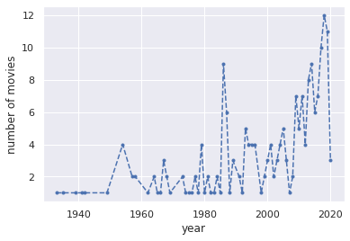
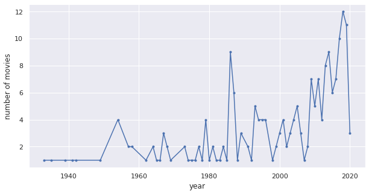
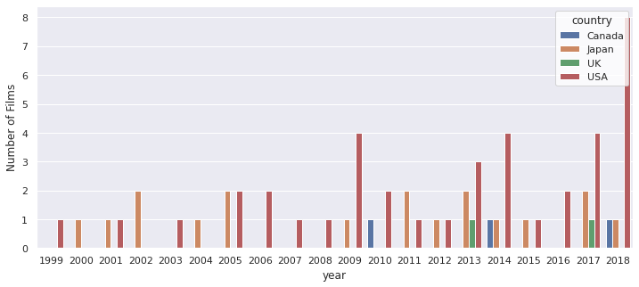
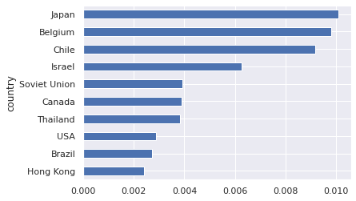
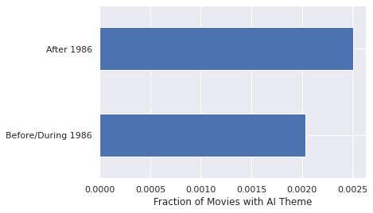
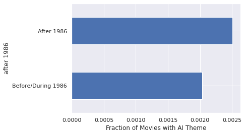
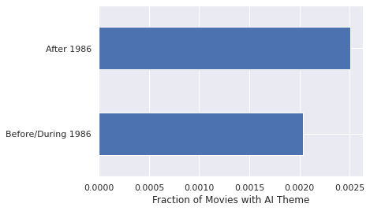
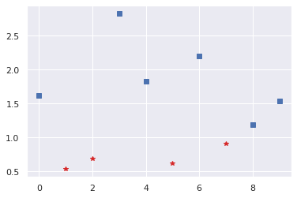
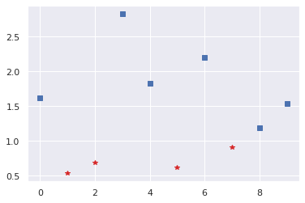

# Technology Innovation 510
## Introduction to Data Science Methods: Data Science and Visualization

**Instructor**: Wesley Beckner

**Contact**: wesleybeckner@gmail.com

<br>

---

<br>

Today, we'll be continuing our discussion of AI/DS/ML with our part II: Data Science (and a focus in Visualization)🎉

<br>

---

# Preparing Notebook for Demos

## Importing Packages

Once we have our packages installed, we need to import them. We can also import packages that are pre-installed in the Colab environment.


```python
import numpy as np
import random
import pandas as pd
import matplotlib.pyplot as plt
from sklearn.linear_model import LinearRegression
import seaborn as sns
pd.options.display.max_rows = 999
pd.set_option('display.max_colwidth', None)
sns.set()
```

## Importing Data

We also have the ability to import data, and use it elsewhere in the notebook 📝!


```python
df = pd.read_csv("https://raw.githubusercontent.com/wesleybeckner/"\
  "technology_explorers/main/assets/imdb_movies.csv")

# converting years to numbers for easy conditionals
df['year'] = pd.to_numeric(df['year'], errors='coerce')
```

    /usr/local/lib/python3.7/dist-packages/IPython/core/interactiveshell.py:2718: DtypeWarning: Columns (3) have mixed types.Specify dtype option on import or set low_memory=False.
      interactivity=interactivity, compiler=compiler, result=result)


## 📊 What is Data Science?

### The Emergence of Data Science

Data Science is a broad field, and depending on who you talk to, it can mean different things. In summary, many independent scientific fields began accumulating large amounts of data. At the UW in particular, these were dominated by the astronomy and oceanography departments. Folks began to realize that they needed a particular set of tools to handle large amounts of data. This culminated in the [eScience studio](https://escience.washington.edu/), which began to service the data needs of many departments on campus.

Today, data science not only has to do with large amounts of data, but refers generally to tools that allow us to work with a variety of data types. Because of this, machine learning is a tool within data science. But there are other tools apart from machine learning that make up the data science ecosystem. Some of them are:

* data visualization
* databases 
* statistics

You could argue for others as well (algorithms, web servers, programming, etc.), but these are the formally accepted areas. We can borrow from Drew Conway's Data Science Venn Diagram, first published on his blog in September 2010, to make further sense of this:

<p align="center">
</img>

#### 💭 1

Let's see if we can converge on a definition of Data Science. Talk to your neighbor, convene together, then let's share. Do this at 2 different levels:

How would you explain Data Science to:
1. your grandmother
2. a young professional

You may find these articles useful:

* from Oracle
    * [A business pov on DS](https://www.oracle.com/data-science/what-is-data-science/)

    * [An implementation pov on DS](https://www.oracle.com/a/ocom/docs/data-science-lifecycle-ebook.pdf)

* a more technical *cough* better *cough* discussion on DS from Software Carpentry:
    * [A research pov on DS](https://software-carpentry.org/blog/2017/12/assessing-data-science.html)
    * [The minues from that meeting](https://github.com/carpentries/assessment/blob/main/assessment-network/minutes/2017-11-15.md)

#### 💬 1

I'll write these down, let's see if we can all agree on a precise definition

### Saying Stuff About Data (Statistics)

When we're talking about statistics, we're really talking about data story telling. Statistics is at the C O R E of data science, really. Without a basic knowledge of statistics it'll be hard for you to construct your data narratives and have them hold water. 

Let's start with some simple examples of data story telling, and use these to generate our own thoughts on the matter.

#### Anscombe's Quartet

There's a very famous anomaly in DS caled Anscombe's quartet. Observe the following data

<p align=center>
</img>

We can construct this in python and confirm the summary statistics ourselves


```python
df = pd.read_excel("https://github.com/wesleybeckner/technology_explorers/blob"\
                   "/main/assets/data_science/anscombes.xlsx?raw=true",
              header=[0,1])
df
```


<div>
<style scoped>
    .dataframe tbody tr th:only-of-type {
        vertical-align: middle;
    }

    .dataframe tbody tr th {
        vertical-align: top;
    }

    .dataframe thead tr th {
        text-align: left;
    }
</style>
<table border="1" class="dataframe">
  <thead>
    <tr>
      <th></th>
      <th colspan="2" halign="left">I</th>
      <th colspan="2" halign="left">II</th>
      <th colspan="2" halign="left">III</th>
      <th colspan="2" halign="left">IV</th>
    </tr>
    <tr>
      <th></th>
      <th>X</th>
      <th>Y</th>
      <th>X</th>
      <th>Y</th>
      <th>X</th>
      <th>Y</th>
      <th>X</th>
      <th>Y</th>
    </tr>
  </thead>
  <tbody>
    <tr>
      <th>0</th>
      <td>10</td>
      <td>8.04</td>
      <td>10</td>
      <td>9.14</td>
      <td>10</td>
      <td>7.46</td>
      <td>8</td>
      <td>6.58</td>
    </tr>
    <tr>
      <th>1</th>
      <td>8</td>
      <td>6.95</td>
      <td>8</td>
      <td>8.14</td>
      <td>8</td>
      <td>6.77</td>
      <td>8</td>
      <td>5.76</td>
    </tr>
    <tr>
      <th>2</th>
      <td>13</td>
      <td>7.58</td>
      <td>13</td>
      <td>8.74</td>
      <td>13</td>
      <td>12.74</td>
      <td>8</td>
      <td>7.71</td>
    </tr>
    <tr>
      <th>3</th>
      <td>9</td>
      <td>8.81</td>
      <td>9</td>
      <td>8.77</td>
      <td>9</td>
      <td>7.11</td>
      <td>8</td>
      <td>8.84</td>
    </tr>
    <tr>
      <th>4</th>
      <td>11</td>
      <td>8.33</td>
      <td>11</td>
      <td>9.26</td>
      <td>11</td>
      <td>7.81</td>
      <td>8</td>
      <td>8.47</td>
    </tr>
    <tr>
      <th>5</th>
      <td>14</td>
      <td>9.96</td>
      <td>14</td>
      <td>8.10</td>
      <td>14</td>
      <td>8.84</td>
      <td>8</td>
      <td>7.04</td>
    </tr>
    <tr>
      <th>6</th>
      <td>6</td>
      <td>7.24</td>
      <td>6</td>
      <td>6.13</td>
      <td>6</td>
      <td>6.08</td>
      <td>8</td>
      <td>5.25</td>
    </tr>
    <tr>
      <th>7</th>
      <td>4</td>
      <td>4.26</td>
      <td>4</td>
      <td>3.10</td>
      <td>4</td>
      <td>5.39</td>
      <td>19</td>
      <td>12.50</td>
    </tr>
    <tr>
      <th>8</th>
      <td>12</td>
      <td>10.84</td>
      <td>12</td>
      <td>9.13</td>
      <td>12</td>
      <td>8.15</td>
      <td>8</td>
      <td>5.56</td>
    </tr>
    <tr>
      <th>9</th>
      <td>7</td>
      <td>4.82</td>
      <td>7</td>
      <td>7.26</td>
      <td>7</td>
      <td>6.42</td>
      <td>8</td>
      <td>7.91</td>
    </tr>
    <tr>
      <th>10</th>
      <td>5</td>
      <td>5.68</td>
      <td>5</td>
      <td>4.74</td>
      <td>5</td>
      <td>5.73</td>
      <td>8</td>
      <td>6.89</td>
    </tr>
  </tbody>
</table>
</div>


We can calculate the mean/variance of X and Y for samples I, II, III, and IV


```python
df.mean()
```


    I    X    9.000000
         Y    7.500909
    II   X    9.000000
         Y    7.500909
    III  X    9.000000
         Y    7.500000
    IV   X    9.000000
         Y    7.500909
    dtype: float64


```python
# do we remember the relationship between standard deviation and variance?
df.std()**2
```


    I    X    11.000000
         Y     4.127269
    II   X    11.000000
         Y     4.127629
    III  X    11.000000
         Y     4.122620
    IV   X    11.000000
         Y     4.123249
    dtype: float64


For the line of best fit, recall the equation for a linear relationship between x and y:

$$y(x)= m\cdot x + b$$ 


```python
model = LinearRegression()
sets = ['I', 'II', 'III', 'IV']
for data in sets:
  model.fit(df[data]['X'].values.reshape(11,1),
            df[data]['Y'])
  print("Linear Regression Line: Y = {:.2f}X + {:.2f}".format(model.coef_[0], model.intercept_))
```

    Linear Regression Line: Y = 0.50X + 3.00
    Linear Regression Line: Y = 0.50X + 3.00
    Linear Regression Line: Y = 0.50X + 3.00
    Linear Regression Line: Y = 0.50X + 3.00


$R^2$ measures the goodness of fit. $R^2$ is generally defined as the ratio of the total sum of squares $SS_{\sf tot} $ to the residual sum of squares $SS_{\sf res} $:

The Residual Sum of Squares is defined as:

$$SS_{\sf res}=\sum_{i=1}^{N} \left(y^{\sf exact}_i - y^{\sf calc}_i\right)^2$$

We now define the total sum of squares, a measure of the total variance in the data:

$$SS_{\sf tot}=\sum_{i=1}^{N} \left(y^{\sf exact}_i-\bar{y}\right)^2$$

The $R^2$ tells us how much of the variance of the data, is captured by the model we created:

$$R^2 = 1 - {SS_{\sf res}\over SS_{\sf tot}}$$

In the first equation, $\bar{y}=\sum_i y^{\sf exact}_i/N$ is the average value of y for $N$ points. The best value of $R^2$ is 1 but it can also take a negative value if the error is large.


```python
for data in sets:
  # calc the ssr
  ssr = np.sum((df[data]['Y'] - 
                model.predict(df[data]['X'].values.reshape(-1,1)))**2)

  # calc the sst
  sst = np.sum((df[data]['Y'] - 
                df[data]['Y'].mean())**2)

  # calc the r2
  r2 = 1 - (ssr/sst)
  print("R2 = {:.2f}".format(r2))
```

    R2 = 0.67
    R2 = 0.67
    R2 = 0.67
    R2 = 0.67


As we can see, everything checks out. The summary statistics are all the same!

Can we answer the following:

> What dataset is best described by the line of best fit?

We will revisit this question when we talk about data visualization

#### Taxonomy of Data Types

Another important topic in data science, is simply what kind of data we are working with. This will help us decide what kind of models to build, as well as how to visualize our data, and perhaps store it as well.

<p align=center>
</img>

#### 💬 2

What are some examples of the different datatypes we can think of?

### Data Visualization

Data visualization, like it sounds, has to do with how we display and communicate information. At the end of the day, your findings and algorithms aren't worth very much if we can't share them with others. One of the leading thinkers in the visual display of information is Edward Tufte
* [Tufte's Principles](https://thedoublethink.com/tuftes-principles-for-visualizing-quantitative-information/)
* [Data-ink](https://infovis-wiki.net/wiki/Data-Ink_Ratio)
* [Wiki](https://en.wikipedia.org/wiki/Edward_Tufte)

#### Guiding Principles of Data Visualization

<p align=center>
</img>

<p align=center>
</img>

Another topic Tufte discusses is Data Density. Apart from ink, we should also consider the entire area dedicated to the graphic. That area should be as condensed as possible without removing ledgibility/readability.


<p align=center>
</img>

wattenberg and Viegas visualization


```python
%%HTML
<video width="640" height="580" controls>
  <source src="https://github.com/wesleybeckner/technology_explorers/blob/main/assets/data_science/ds4.mp4?raw=true" type="video/mp4">
</video>
```


<video width="640" height="580" controls>
  <source src="https://github.com/wesleybeckner/technology_explorers/blob/main/assets/data_science/ds4.mp4?raw=true" type="video/mp4">
</video>


<p align=center>
</img>

<p align=center>
</img>

<p align=center>
</img>


[Color blindness](https://www.colourblindawareness.org/colour-blindness/) is prevalent, and something we should consider when choosing colors in our visual displays

<p align=center>
</img>


<p align=center>
</img>

<p align=center>
</img>


<p align=center>
</img>

<p align=center>
</img>

<p align=center>
</img>

<p align=center>
</img>

#### Visualization Un-Examples

**Unexample 1**

<p align=center>
</img>

**Unexample 2**

<p align=center>
</img>

**Unexample 3**

<p align=center>
</img>

**Unexample 4**

<p align=center>
</img>

#### 💭 3

Find an example of an interactive data visualization online. Here's one I [found](https://www.migrationpolicy.org/programs/data-hub/charts/us-immigrant-population-state-and-county) that I though was quite interesting!

#### 💬 3

Swap visualization links with your neighbor. What do you think could be improved about each one?

#### Back to Anscombe's Quartet

<p align=center>
</img>

### Revisiting our A.I. movie data

Let's revisit our imdb dataset from last week.


```python
df.loc[(df['description'].str.contains('artificial intelligence|a\.i\.|robot', 
                                       na=False))][['original_title', 'year', 'description']][:10]
```


<div>
<style scoped>
    .dataframe tbody tr th:only-of-type {
        vertical-align: middle;
    }

    .dataframe tbody tr th {
        vertical-align: top;
    }

    .dataframe thead th {
        text-align: right;
    }
</style>
<table border="1" class="dataframe">
  <thead>
    <tr style="text-align: right;">
      <th></th>
      <th>original_title</th>
      <th>year</th>
      <th>description</th>
    </tr>
  </thead>
  <tbody>
    <tr>
      <th>1683</th>
      <td>Son of a Sailor</td>
      <td>1933.0</td>
      <td>A smooth-talking sailor looking for a quick date meets the granddaughter of an admiral and finds himself in a house full of top Navy officers, along with a couple of spies interested in plans for a new robot-controlled flight system.</td>
    </tr>
    <tr>
      <th>3339</th>
      <td>The Middleton Family at the New York World's Fair</td>
      <td>1939.0</td>
      <td>The Middleton family visits the 1939 New York World's Fair and witnesses the advent of the future, encountering robots and dishwashers for the first time.</td>
    </tr>
    <tr>
      <th>3846</th>
      <td>Emergency Landing</td>
      <td>1941.0</td>
      <td>A test pilot and his weather observer develop a "robot" control so airplanes can be flown without pilots, but enemy agents get wind of it and try to steal it or destroy it.</td>
    </tr>
    <tr>
      <th>4122</th>
      <td>Cairo</td>
      <td>1942.0</td>
      <td>Reporter Homer Smith accidentally draws Marcia Warren into his mission to stop Nazis from bombing Allied Convoys with robot-planes.</td>
    </tr>
    <tr>
      <th>6274</th>
      <td>The Perfect Woman</td>
      <td>1949.0</td>
      <td>In need of cash, Roger Cavendish and his valet take a job escorting the perfect woman for a night on the town. She is in fact the robotic creation of Professor Belman, but it turns out ...</td>
    </tr>
    <tr>
      <th>7936</th>
      <td>Devil Girl from Mars</td>
      <td>1954.0</td>
      <td>An uptight, leather-clad female alien, armed with a ray gun and accompanied by a menacing robot, comes to Earth to collect Earth's men as breeding stock.</td>
    </tr>
    <tr>
      <th>7977</th>
      <td>Gog</td>
      <td>1954.0</td>
      <td>A security agent investigates sabotage and murder at a secret underground laboratory, home of two experimental robots.</td>
    </tr>
    <tr>
      <th>8155</th>
      <td>Target Earth</td>
      <td>1954.0</td>
      <td>Giant robots from Venus invade Chicago. Stranded in the deserted city are strangers Frank and Nora.</td>
    </tr>
    <tr>
      <th>8173</th>
      <td>Tobor the Great</td>
      <td>1954.0</td>
      <td>A young boy-genius befriends his grandfather's robot, designed as a test pilot for space travel and coveted by foreign spies.</td>
    </tr>
    <tr>
      <th>9047</th>
      <td>Chikyû Bôeigun</td>
      <td>1957.0</td>
      <td>Shortly after a giant robot destroys a village, aliens from outer space arrive offering friendship. Will the people of Earth tie these two events together?</td>
    </tr>
  </tbody>
</table>
</div>


Let's create a visualization that helps answer the question: 

> What is the popularity of AI movies by year?"

#### 💬 4

What are some potential issues with the following plot?


```python
ai_movies = df.loc[(df['description'].str.contains('artificial intelligence|a\.i\.|robot', 
                                       na=False))]
```


```python
fig, ax = plt.subplots()
ai_movies.groupby('year').count()['title'].plot(ls='--', marker='.', ax=ax)
ax.set_ylabel('number of movies')
```


    Text(0, 0.5, 'number of movies')


    

    


```python
fig, ax = plt.subplots(figsize=(10,5))
ai_movies.groupby('year').count()['imdb_title_id'].plot(marker='.', ax=ax)
ax.set_ylabel("number of movies")
```


    Text(0, 0.5, 'number of movies')


    

    


It looks like the popularity is increasing, doesn't it? But is that fair to say if we do not consider the total number of movies in the database each year?

Let's say we're curious about the year 1986 and what countries contributed to the spike in movies. How would we *filter* for year 1986, then *select* country and perform a count *operation*? Remember the sequence **filter ➡️ Select ➡️ operate**


```python
ai_movies.loc[ai_movies['year'] == 1986][['country']].nunique()
```


    country    6
    dtype: int64


```python
ai_movies.loc[ai_movies['year'] == 1986][['country']].value_counts()
```


    country             
    USA                     3
    Japan                   2
    USA, Spain              1
    USA, Japan              1
    Poland, Soviet Union    1
    Canada                  1
    dtype: int64


Looks like a good year for US-Japan movie making. How can we look into the role of different countries in AI movie making?

> in the following, pandas doesn't have the ability to color according to a categorical column, out of the box. So I switch over to seaborn. For more exercises with seaborn visit [JVDP's chapter on the subject](https://jakevdp.github.io/PythonDataScienceHandbook/04.14-visualization-with-seaborn.html)


```python
by_country = ai_movies.groupby(['country']).filter(lambda x: (x.count() >= 5).any()).\
          groupby(['country', 'year']).apply(lambda x: x.count())[['title']].reset_index()
```


```python
# ai_movies.groupby(['country']).filter(lambda x: (x.count() >= 5).any())
```


```python
ai_movies.groupby(['country']).filter(lambda x: (x.count() >= 5).any()).\
          groupby(['country', 'year']).apply(lambda x:  x.count())[['title']].reset_index().head(5)
```


<div>
<style scoped>
    .dataframe tbody tr th:only-of-type {
        vertical-align: middle;
    }

    .dataframe tbody tr th {
        vertical-align: top;
    }

    .dataframe thead th {
        text-align: right;
    }
</style>
<table border="1" class="dataframe">
  <thead>
    <tr style="text-align: right;">
      <th></th>
      <th>country</th>
      <th>year</th>
      <th>title</th>
    </tr>
  </thead>
  <tbody>
    <tr>
      <th>0</th>
      <td>Canada</td>
      <td>1979.0</td>
      <td>1</td>
    </tr>
    <tr>
      <th>1</th>
      <td>Canada</td>
      <td>1986.0</td>
      <td>1</td>
    </tr>
    <tr>
      <th>2</th>
      <td>Canada</td>
      <td>1994.0</td>
      <td>1</td>
    </tr>
    <tr>
      <th>3</th>
      <td>Canada</td>
      <td>2010.0</td>
      <td>1</td>
    </tr>
    <tr>
      <th>4</th>
      <td>Canada</td>
      <td>2014.0</td>
      <td>1</td>
    </tr>
  </tbody>
</table>
</div>


```python
by_country = ai_movies.groupby(['country']).filter(lambda x: (x.count() >= 5).any()).\
          groupby(['country', 'year']).apply(lambda x: x.count())[['title']].reset_index()
```


```python
fig, ax = plt.subplots(figsize=(12,5))
with sns.axes_style('white'):
    g = sns.barplot(data=by_country, x="year", hue='country', y='title', ax=ax, order=range(1999, 2019))
ax.set_ylabel('Number of Films')
```


    Text(0, 0.5, 'Number of Films')


    

    


For the last 20 years we can see that U.S./Japan have dominated the A.I. movie market

# In-Class Exercises

Create visualizations that help a user answer the following questions:

## 🐍 Exercise 1: Visualizing Fractions

1. Of all the movie data, which top 10 countries have the highest fraction of AI movies?
2. Are there more movies about AI before or after 1986?


```python
df.groupby('country')['description'].apply(lambda x: x.loc[x.str.contains('artificial intelligence|a\.i\.|robot', 
                                       na=False)].count()/x.shape[0]).sort_values()[-20:]
```


    country
    South Africa, USA                                                                          0.050000
    USA, Argentina                                                                             0.058824
    USA, Germany, UK                                                                           0.090909
    Switzerland, USA                                                                           0.142857
    Germany, Belgium                                                                           0.142857
    Singapore, USA                                                                             0.250000
    Poland, Soviet Union                                                                       0.285714
    UK, USA, Ireland                                                                           0.333333
    UK, China, USA                                                                             0.333333
    USA, UK, Italy                                                                             0.333333
    India, Australia                                                                           0.333333
    China, Canada, USA                                                                         0.333333
    Canada, South Korea                                                                        0.500000
    Hong Kong, Canada, USA                                                                     1.000000
    Italy, West Germany, Spain, Monaco                                                         1.000000
    Canada, France, Spain, Germany                                                             1.000000
    Croatia, Luxembourg, Norway, Czech Republic, Slovakia, Slovenia, Bosnia and Herzegovina    1.000000
    USA, Singapore                                                                             1.000000
    Canada, USA, UK, Japan                                                                     1.000000
    Canada, France, Morocco                                                                    1.000000
    Name: description, dtype: float64


```python
df.loc[~df['country'].str.contains(',', na=True)].groupby('country')['description'].apply(lambda x: x.loc[x.str.contains('artificial intelligence|a\.i\.|robot', 
                                       na=False)].count()/x.shape[0]).sort_values()[-20:]
```


    country
    Russia          0.001247
    Australia       0.001274
    UK              0.001459
    Turkey          0.001480
    Mexico          0.001527
    Denmark         0.001776
    South Korea     0.001813
    China           0.001908
    Finland         0.002232
    West Germany    0.002375
    Hong Kong       0.002421
    Brazil          0.002717
    USA             0.002876
    Thailand        0.003817
    Canada          0.003885
    Soviet Union    0.003916
    Israel          0.006250
    Chile           0.009174
    Belgium         0.009804
    Japan           0.010075
    Name: description, dtype: float64


```python
df.loc[~(df['country'].str.contains(',', na=True))]['country']
```


    0                USA
    1          Australia
    3                USA
    4              Italy
    5                USA
                ...     
    85849          India
    85851    Netherlands
    85852          India
    85853         Turkey
    85854          Spain
    Name: country, Length: 70300, dtype: object


```python
df.loc[~(df['country'].str.contains(',', na=True))].groupby('country')['description'].apply(lambda x: x.loc[x.str.contains('artificial intelligence|a\.i\.|robot', 
                                       na=False)].count()/x.shape[0]).sort_values(ascending=False)[:10]
```


    country
    Japan           0.010075
    Belgium         0.009804
    Chile           0.009174
    Israel          0.006250
    Soviet Union    0.003916
    Canada          0.003885
    Thailand        0.003817
    USA             0.002876
    Brazil          0.002717
    Hong Kong       0.002421
    Name: description, dtype: float64


```python
# Cell for 1.1
fig, ax = plt.subplots()
df.loc[~(df['country'].str.contains(',', na=True))].groupby('country')['description'].apply(lambda x: x.loc[x.str.contains('artificial intelligence|a\.i\.|robot', 
                                       na=False)].count()/x.shape[0]).sort_values(ascending=True)[-10:].plot(kind='barh')
```


    <matplotlib.axes._subplots.AxesSubplot at 0x7fa8814b0090>


    

    


```python
df['after 1986'] = df['year'] > 1986
df['ai movie'] = df['description'].str.contains('artificial intelligence|a\.i\.|robot', na=False)
```


```python
np.sum([True, True, False])
```


    2


```python
df.groupby(['after 1986', 'ai movie'])['title'].count()
```


    after 1986  ai movie
    False       False       26438
                True           54
    True        False       59214
                True          149
    Name: title, dtype: int64


```python
fig, ax = plt.subplots()
df.groupby(['after 1986'])['ai movie'].apply(lambda x: x.sum()/x.shape[0]).plot(kind='barh')
ax.set_yticklabels(['Before/During 1986', 'After 1986'])
ax.set_ylabel('')
ax.set_xlabel('Fraction of Movies with AI Theme')
```


    Text(0.5, 0, 'Fraction of Movies with AI Theme')


    

    


```python
fig, ax = plt.subplots()
df.groupby(['after 1986'])['ai movie'].apply(lambda x: x.sum()/x.shape[0]).plot(kind='barh')
ax.set_yticklabels(['Before/During 1986', 'After 1986'])
ax.set_xlabel('Fraction of Movies with AI Theme')
```


    Text(0.5, 0, 'Fraction of Movies with AI Theme')


    

    


```python
df.loc[df['year'] > 1986 & df['description'].str.contains('artificial intelligence|a\.i\.|robot', na=False)]

```


<div>
<style scoped>
    .dataframe tbody tr th:only-of-type {
        vertical-align: middle;
    }

    .dataframe tbody tr th {
        vertical-align: top;
    }

    .dataframe thead th {
        text-align: right;
    }
</style>
<table border="1" class="dataframe">
  <thead>
    <tr style="text-align: right;">
      <th></th>
      <th>imdb_title_id</th>
      <th>title</th>
      <th>original_title</th>
      <th>year</th>
      <th>date_published</th>
      <th>genre</th>
      <th>duration</th>
      <th>country</th>
      <th>language</th>
      <th>director</th>
      <th>writer</th>
      <th>production_company</th>
      <th>actors</th>
      <th>description</th>
      <th>avg_vote</th>
      <th>votes</th>
      <th>budget</th>
      <th>usa_gross_income</th>
      <th>worlwide_gross_income</th>
      <th>metascore</th>
      <th>reviews_from_users</th>
      <th>reviews_from_critics</th>
      <th>after 1986</th>
      <th>ai movie</th>
    </tr>
  </thead>
  <tbody>
    <tr>
      <th>0</th>
      <td>tt0000009</td>
      <td>Miss Jerry</td>
      <td>Miss Jerry</td>
      <td>1894.0</td>
      <td>1894-10-09</td>
      <td>Romance</td>
      <td>45</td>
      <td>USA</td>
      <td>None</td>
      <td>Alexander Black</td>
      <td>Alexander Black</td>
      <td>Alexander Black Photoplays</td>
      <td>Blanche Bayliss, William Courtenay, Chauncey Depew</td>
      <td>The adventures of a female reporter in the 1890s.</td>
      <td>5.9</td>
      <td>154</td>
      <td>NaN</td>
      <td>NaN</td>
      <td>NaN</td>
      <td>NaN</td>
      <td>1.0</td>
      <td>2.0</td>
      <td>False</td>
      <td>False</td>
    </tr>
    <tr>
      <th>1</th>
      <td>tt0000574</td>
      <td>The Story of the Kelly Gang</td>
      <td>The Story of the Kelly Gang</td>
      <td>1906.0</td>
      <td>1906-12-26</td>
      <td>Biography, Crime, Drama</td>
      <td>70</td>
      <td>Australia</td>
      <td>None</td>
      <td>Charles Tait</td>
      <td>Charles Tait</td>
      <td>J. and N. Tait</td>
      <td>Elizabeth Tait, John Tait, Norman Campbell, Bella Cola, Will Coyne, Sam Crewes, Jack Ennis, John Forde, Vera Linden, Mr. Marshall, Mr. McKenzie, Frank Mills, Ollie Wilson</td>
      <td>True story of notorious Australian outlaw Ned Kelly (1855-80).</td>
      <td>6.1</td>
      <td>589</td>
      <td>$ 2250</td>
      <td>NaN</td>
      <td>NaN</td>
      <td>NaN</td>
      <td>7.0</td>
      <td>7.0</td>
      <td>False</td>
      <td>False</td>
    </tr>
    <tr>
      <th>2</th>
      <td>tt0001892</td>
      <td>Den sorte drøm</td>
      <td>Den sorte drøm</td>
      <td>1911.0</td>
      <td>1911-08-19</td>
      <td>Drama</td>
      <td>53</td>
      <td>Germany, Denmark</td>
      <td>NaN</td>
      <td>Urban Gad</td>
      <td>Urban Gad, Gebhard Schätzler-Perasini</td>
      <td>Fotorama</td>
      <td>Asta Nielsen, Valdemar Psilander, Gunnar Helsengreen, Emil Albes, Hugo Flink, Mary Hagen</td>
      <td>Two men of high rank are both wooing the beautiful and famous equestrian acrobat Stella. While Stella ignores the jeweler Hirsch, she accepts Count von Waldberg's offer to follow her home, ...</td>
      <td>5.8</td>
      <td>188</td>
      <td>NaN</td>
      <td>NaN</td>
      <td>NaN</td>
      <td>NaN</td>
      <td>5.0</td>
      <td>2.0</td>
      <td>False</td>
      <td>False</td>
    </tr>
    <tr>
      <th>3</th>
      <td>tt0002101</td>
      <td>Cleopatra</td>
      <td>Cleopatra</td>
      <td>1912.0</td>
      <td>1912-11-13</td>
      <td>Drama, History</td>
      <td>100</td>
      <td>USA</td>
      <td>English</td>
      <td>Charles L. Gaskill</td>
      <td>Victorien Sardou</td>
      <td>Helen Gardner Picture Players</td>
      <td>Helen Gardner, Pearl Sindelar, Miss Fielding, Miss Robson, Helene Costello, Charles Sindelar, Mr. Howard, James R. Waite, Mr. Osborne, Harry Knowles, Mr. Paul, Mr. Brady, Mr. Corker</td>
      <td>The fabled queen of Egypt's affair with Roman general Marc Antony is ultimately disastrous for both of them.</td>
      <td>5.2</td>
      <td>446</td>
      <td>$ 45000</td>
      <td>NaN</td>
      <td>NaN</td>
      <td>NaN</td>
      <td>25.0</td>
      <td>3.0</td>
      <td>False</td>
      <td>False</td>
    </tr>
    <tr>
      <th>4</th>
      <td>tt0002130</td>
      <td>L'Inferno</td>
      <td>L'Inferno</td>
      <td>1911.0</td>
      <td>1911-03-06</td>
      <td>Adventure, Drama, Fantasy</td>
      <td>68</td>
      <td>Italy</td>
      <td>Italian</td>
      <td>Francesco Bertolini, Adolfo Padovan</td>
      <td>Dante Alighieri</td>
      <td>Milano Film</td>
      <td>Salvatore Papa, Arturo Pirovano, Giuseppe de Liguoro, Pier Delle Vigne, Augusto Milla, Attilio Motta, Emilise Beretta</td>
      <td>Loosely adapted from Dante's Divine Comedy and inspired by the illustrations of Gustav Doré the original silent film has been restored and has a new score by Tangerine Dream.</td>
      <td>7.0</td>
      <td>2237</td>
      <td>NaN</td>
      <td>NaN</td>
      <td>NaN</td>
      <td>NaN</td>
      <td>31.0</td>
      <td>14.0</td>
      <td>False</td>
      <td>False</td>
    </tr>
    <tr>
      <th>...</th>
      <td>...</td>
      <td>...</td>
      <td>...</td>
      <td>...</td>
      <td>...</td>
      <td>...</td>
      <td>...</td>
      <td>...</td>
      <td>...</td>
      <td>...</td>
      <td>...</td>
      <td>...</td>
      <td>...</td>
      <td>...</td>
      <td>...</td>
      <td>...</td>
      <td>...</td>
      <td>...</td>
      <td>...</td>
      <td>...</td>
      <td>...</td>
      <td>...</td>
      <td>...</td>
      <td>...</td>
    </tr>
    <tr>
      <th>85850</th>
      <td>tt9908390</td>
      <td>Le lion</td>
      <td>Le lion</td>
      <td>2020.0</td>
      <td>2020-01-29</td>
      <td>Comedy</td>
      <td>95</td>
      <td>France, Belgium</td>
      <td>French</td>
      <td>Ludovic Colbeau-Justin</td>
      <td>Alexandre Coquelle, Matthieu Le Naour</td>
      <td>Monkey Pack Films</td>
      <td>Dany Boon, Philippe Katerine, Anne Serra, Samuel Jouy, Sophie Verbeeck, Carole Brana, Benoît Pétré, Aksel Ustun, Mathieu Lardot, Olivier Sa, Julien Prevost, Antoine Mathieu, David Ban, Stan, Guillaume Clémencin</td>
      <td>A psychiatric hospital patient pretends to be crazy. In charge of caring for this patient, a caregiver will begin to doubt the mental state of his "protégé".</td>
      <td>5.3</td>
      <td>398</td>
      <td>NaN</td>
      <td>NaN</td>
      <td>$ 3507171</td>
      <td>NaN</td>
      <td>NaN</td>
      <td>4.0</td>
      <td>True</td>
      <td>False</td>
    </tr>
    <tr>
      <th>85851</th>
      <td>tt9911196</td>
      <td>De Beentjes van Sint-Hildegard</td>
      <td>De Beentjes van Sint-Hildegard</td>
      <td>2020.0</td>
      <td>2020-02-13</td>
      <td>Comedy, Drama</td>
      <td>103</td>
      <td>Netherlands</td>
      <td>German, Dutch</td>
      <td>Johan Nijenhuis</td>
      <td>Radek Bajgar, Herman Finkers</td>
      <td>Johan Nijenhuis &amp; Co</td>
      <td>Herman Finkers, Johanna ter Steege, Leonie ter Braak, Stef Assen, Annie Beumers, Jos Brummelhuis, Reinier Bulder, Daphne Bunskoek, Karlijn Koel, Karlijn Lansink, Marieke Lustenhouwer, Jan Roerink, Ferdi Stofmeel, Aniek Stokkers, Belinda van der Stoep</td>
      <td>A middle-aged veterinary surgeon believes his wife pampers him too much. In order to get away from her, he fakes the onset of dementia.</td>
      <td>7.7</td>
      <td>724</td>
      <td>NaN</td>
      <td>NaN</td>
      <td>$ 7299062</td>
      <td>NaN</td>
      <td>6.0</td>
      <td>4.0</td>
      <td>True</td>
      <td>False</td>
    </tr>
    <tr>
      <th>85852</th>
      <td>tt9911774</td>
      <td>Padmavyuhathile Abhimanyu</td>
      <td>Padmavyuhathile Abhimanyu</td>
      <td>2019.0</td>
      <td>2019-03-08</td>
      <td>Drama</td>
      <td>130</td>
      <td>India</td>
      <td>Malayalam</td>
      <td>Vineesh Aaradya</td>
      <td>Vineesh Aaradya, Vineesh Aaradya</td>
      <td>RMCC Productions</td>
      <td>Anoop Chandran, Indrans, Sona Nair, Simon Britto Rodrigues</td>
      <td>NaN</td>
      <td>7.9</td>
      <td>265</td>
      <td>NaN</td>
      <td>NaN</td>
      <td>NaN</td>
      <td>NaN</td>
      <td>NaN</td>
      <td>NaN</td>
      <td>True</td>
      <td>False</td>
    </tr>
    <tr>
      <th>85853</th>
      <td>tt9914286</td>
      <td>Sokagin Çocuklari</td>
      <td>Sokagin Çocuklari</td>
      <td>2019.0</td>
      <td>2019-03-15</td>
      <td>Drama, Family</td>
      <td>98</td>
      <td>Turkey</td>
      <td>Turkish</td>
      <td>Ahmet Faik Akinci</td>
      <td>Ahmet Faik Akinci, Kasim Uçkan</td>
      <td>Gizem Ajans</td>
      <td>Ahmet Faik Akinci, Belma Mamati, Metin Keçeci, Burhan Sirmabiyik, Orhan Aydin, Tevfik Yapici, Yusuf Eksi, Toygun Ates, Aziz Özuysal, Dilek Ölekli, Arcan Bunial, Seval Hislisoy, Ergül Çolakoglu, Gülçin Ugur, Ibrahim Balaban</td>
      <td>NaN</td>
      <td>6.4</td>
      <td>194</td>
      <td>NaN</td>
      <td>NaN</td>
      <td>$ 2833</td>
      <td>NaN</td>
      <td>NaN</td>
      <td>NaN</td>
      <td>True</td>
      <td>False</td>
    </tr>
    <tr>
      <th>85854</th>
      <td>tt9914942</td>
      <td>La vida sense la Sara Amat</td>
      <td>La vida sense la Sara Amat</td>
      <td>2019.0</td>
      <td>2020-02-05</td>
      <td>Drama</td>
      <td>74</td>
      <td>Spain</td>
      <td>Catalan</td>
      <td>Laura Jou</td>
      <td>Coral Cruz, Pep Puig</td>
      <td>La Xarxa de Comunicació Local</td>
      <td>Maria Morera Colomer, Biel Rossell Pelfort, Isaac Alcayde, Lluís Altés, Joan Amargós, Pepo Blasco, Cesc Casanovas, Oriol Cervera, Pau Escobar, Jordi Figueras, Arés Fuster, Judit Martín, Martí Múrcia, Mariona Pagès, Francesca Piñón</td>
      <td>Pep, a 13-year-old boy, is in love with a girl from his grandparents village, Sara Amat. One summer night Sara disappears without a trace. After a few hours, Pep finds her hiding in his room.</td>
      <td>6.7</td>
      <td>102</td>
      <td>NaN</td>
      <td>NaN</td>
      <td>$ 59794</td>
      <td>NaN</td>
      <td>NaN</td>
      <td>2.0</td>
      <td>True</td>
      <td>False</td>
    </tr>
  </tbody>
</table>
<p>85854 rows × 24 columns</p>
</div>


```python
# Cell for 1.2
```


    Text(0.5, 0, 'Fraction of Movies with AI Theme')


    

    


## 🐍 Exercise 2: Operating on NumPy Arrays

the following arrays, x, y, and z, contain the respective locations of an object in 3-dimensional space with respect to time. 

1. Return the euclidian distance between the points in x, y, and z and the origin
2. Plot the euclidian distance as blue squares if the distance is greater than 1 and as red stars otherwise in a scatterplot of distance vs time

```
np.random.seed(42)
x = np.random.randn(10)
y = np.random.randn(10)
z = np.random.randn(10)
```


```python
np.random.seed(42)
x = np.random.randn(10)
y = np.random.randn(10)
z = np.random.randn(10)
```


```python
# Cell for 2.1
distance = np.sqrt(x**2 + y**2 + z**2) # this is the distance of each point form the 
distance
```


    array([1.61542788, 0.53572022, 0.69469867, 2.83022413, 1.82387551,
           0.61910516, 2.20102844, 0.91041554, 1.18561408, 1.54079797])


```python
bluey = distance[distance > 1]
bluex = np.argwhere(distance > 1)
```


```python
redy = distance[distance < 1]
redx = np.argwhere(distance < 1)
```


```python
plt.plot(bluex, bluey, ls='', marker='s')
plt.plot(redx, redy, ls='', marker='*', color='tab:red')
```


    [<matplotlib.lines.Line2D at 0x7fa87f75f6d0>]


    

    


```python
# Cell for 2.2

```


    [<matplotlib.lines.Line2D at 0x7f75f93e9b50>]


    

    

