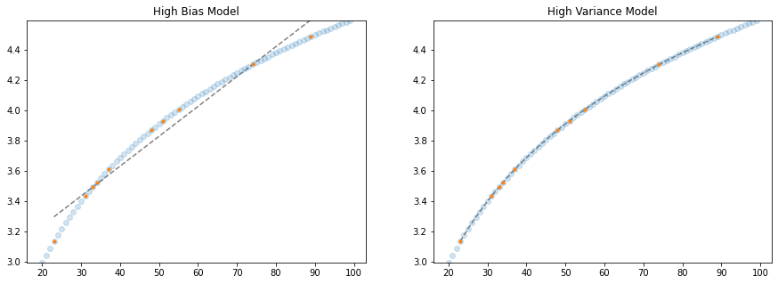

# Technology Innovation 510
## Introduction to Data Science Methods: Machine Learning

**Instructor**: Wesley Beckner

**Contact**: wesleybeckner@gmail.com

<br>


---

<br>

🎉 Today, we'll be working from this _digital_ notebook to complete exercises! If you don't have a computer, not to worry. Grab a notepad and pencil to write down your ideas and notes! 🎉

<br>

---

# Preparing Notebook for Demos

## Installing Packages

In colab, we have the ability to install specific packages into our coding environment. This means we can move beyond the standard packages that are already pre installed in the Colab environment


```python
# !pip install tensorflow==1.15.0
# !apt-get update
# !apt-get install -y cmake libopenmpi-dev python3-dev zlib1g-dev
# !pip install "stable-baselines[mpi]==2.9.0"

# we do not need to install any packages today!
```

## Importing Packages

Once we have our packages installed, we need to import them. We can also import packages that are pre-installed in the Colab environment.


```python
# import tensorflow as tf
# from gym import spaces
# import gym
# from stable_baselines.common.env_checker import check_env

import matplotlib.pyplot as plt
import numpy as np
import random
from sklearn.linear_model import LinearRegression
import random
import pandas as pd
```

## 🧠 What is Machine Learning?

In the previous exercise(s) we talked about _automata of the renaissance_. This accentuates an important deliniation between historical AI and modern machine learning. At some point in the past, we thought, predominantly, that we would have to program _a priori_ all the intelligence of any thinking machine. In other words, it would not necessarily learn on its own. It is like the _automata_ of the renaissance in that all the internal mechanisms and functions would need to be setup beforehand, and initialized.

Around the late 90s and into the 2000s, this way of thinking began to fade. It was replaced with the idea that computers would learn from examples. In a sentence, machine learning is just that:

> "learning from examples"

and that's it. Of course, there are many ins and outs and what-have-yous. But in the context of AI, this is the most important distinction of machine learning. With this shift in ML, the traditional way of thinking about AI was recapitulated as "symbolic AI" - translation of human logic into computer code.

### Everyday Machine Learning

#### 💭 1

Where do you use machine learning in your day to day activities? You will be surprised where machine learning is working behind the scenes. Let's take some time and jot down your top 5 places that you use machine learning.


My top 5 ML interactions in my day-to-day:

```
my_ml_tools = ['spotify discovery playlist', 
               'face recognition on my laptop',
               'google maps', 
               'spelling correction on my iPhone', 
               'gmail sentence autocompletion']
```

#### 💬 1

Can we assimilate our notes? What were some of the most common places folks found that they use machine learning? Use this [google sheet](https://docs.google.com/spreadsheets/d/1uHSI9-GP0d_kNtF59jlZcVDDJuOeDwNAamGi9ULk2YI/edit?usp=sharing) to fill out your answers

### The Algorithms of Machine Learning

Now that we have some real world examples of where machine learning is being used and where we interact with it, let's find out exactly what kinds of algorithms are operating under the hood.

 #### 💭 2

 For the application/product that influences you the most, find out what kind of algorithm(s) are being used by the application. Jot it down. It's okay if we don't understand what they mean yet.

#### 💬 2

I'll start by sharing what I've found out about the underlying algorithms of [Spotify Discover Weekly](https://hackernoon.com/spotifys-discover-weekly-how-machine-learning-finds-your-new-music-19a41ab76efe).

Spotify actually uses 3 different algorithms to make its discover weekly playlist. 

1. Collaborative Filtering: _similar users will like similar songs_
2. Natural Language Processing: _blogs, articles, and lyrics in the songs can be used to model the songs_
3. Audio Processing: _audio tracks themselves of the songs can be used to generate representations of the songs_

What algorithms did you all uncover?

### Different Kinds of Machine Learning

So we've recognized that machine learning is in a lot of different tools we use. We've noted the names to a few of those models. We've even defined machine learning in the context of AI. Now let's add some rigor to how we categorize the different kinds of ML models.

Currently we think of ML in 3 different contexts:

* Supervised learning
* Unsupervised learning
* Reinforcement learning

<p align=center>
</img>

#### Supervised learning

Perhaps the easiest of these to understand is supervised learning. In supervised learning we have _labeled data_, that is some kind of description about the data, that we usually denote as `X_train` and coinciding with a target value, `y_train`. We use the labeled dataset to train a model that then has the ability to predict new values of `y_test` for unlabeled, unseens data, `X_test`. Remember, `y_test` is not known, we are using the model to predict this!

<p align=center>
</img>

**Music Rating**

**Supervised Learning - Classification**

To continue with my music example, supervised learning in this context could consist of the following: you generate a bunch of labels or "features" that describe a song, e.g. `[Danceability, Valence, Energy, Tempo]` and the feature vector for each song would contain these series of numbers. So Coldplay's "Clocks" might be `clocks = [10.4, 40.5, 80, 120]` or Lil Nas X's "Montero" might be `montero = [15.4, 70.7, 90, 110]`. Then, you would label every song with a 1 or 0 indicating whether you liked it or not. You could then train a model on this labeled dataset that would predict whether or not you'd like a given song. Predicting 1 (you like it) or 0 (you don't like it), makes this a **_classification_** model. This is pretty close to what Pandora was actually doing early on in the music recommendation scene (they were creating the feature vectors by hand!). If you'd like to play with this idea yourself you can access _audio feature_ data with [Spotify's Developer's API](https://developer.spotify.com/console/get-audio-features-track/)

**Supervised Learning - Regression**

We can imagine a slightly different situation if, instead of labeling binary 1's and 0's for if we liked a song, we give it a score. If we attempt to map the song vectors to this _continuous_ value for _score_, we have ourselves a **_regression_** model. In practice, however, Spotify only knows whether or not we've _liked_ a song. So binary it is for now. 

**Housing Prices**

> Let's switch gears and think about housing price data from Zillow. Let's also borrow language we encountered earlier on in our Data Science discussion: Nominal, Ordinal, Interval, and Ratio data. 

Envision a **_mixed_** dataset of **_continuous_** and **_discrete_** variables. Some features could be continuous, floating point values like neihborhood score and housing condition. Others could be discrete like the number of rooms or bathrooms. We could take these features and use them to predict a house value. This would be a **_regression_** model. To flip back to the **_classification_** discussion, we could, instead of reporting a value, report a recommendation to buy or sell by combinging the valuation with the actual bid or sell price. What we see is that the two forms of supervised learning, classification and regression, are not too different from one another.

<p align=center>
</img>

#### Unsupervised learning

A little less intuitive, unsupervised learning does not require labeled datasets. Rather, it infers something about the data. 

**Unsupervised Learning - Clustering**

Again taking the music example, Spotify's Collaborative Filterning model is an example of unsupervised learning. The math is a bit complex, but the general idea is that we construct a giant matrix of every song and every user filled with 1's or 0's indicating whether a user has liked the song or not. In this matrix space then, every song and every user is represented by a vector. We can use some mathematical tricks to compute vector distances, and, using this, identify similar users, in other words, we **_cluster_** them. The similar users then can be recommended to like each others songs

* User 1 likes: 🍏, 🍐, 🍅, and 🍆
* User 2 likes: 🍊, 🍐, 🍅, and 🍆!

User 1 should try 🍊 and user 2 should try 🍏!

Or take this example:

* User 3 likes: 🥔, 🍓, 🍋, and 🍑
* User 4 likes: 🥭, 🍓, 🍋, and 🍈

What should user 3 try and what should user 4 try?

**Unsupervised Learning - Dimensionality Reduction**

There is another category of unsupervised learning called **_dimensionality reduction_** that has powerful applications in feature engineering, outlier removal, and data visualization. One of the most common forms of reduction is principal component analysis. We won't go into great detail here, but if you are curious we visited this discussion over the summer in this [notebook](https://render.githubusercontent.com/view/ipynb?color_mode=light&commit=6e91cf4bfd71b7215a75cdb09d2b25dee45943f4&enc_url=68747470733a2f2f7261772e67697468756275736572636f6e74656e742e636f6d2f7765736c65796265636b6e65722f746563686e6f6c6f67795f66756e64616d656e74616c732f366539316366346266643731623732313561373563646230396432623235646565343539343366342f43332532304d616368696e652532304c6561726e696e67253230492f546563685f46756e5f43335f45315f556e737570657276697365645f4c6561726e696e672e6970796e62&nwo=wesleybeckner%2Ftechnology_fundamentals&path=C3+Machine+Learning+I%2FTech_Fun_C3_E1_Unsupervised_Learning.ipynb&repository_id=384268836&repository_type=Repository#3.1-Principal-Component-Analysis). To extrapolate our spotify music data discusion, imagine that we take that huge table of users and songs. What a dimensionality reduction process will do, is attempt to consolidate that table into fewer rows and columns while minimizing data loss. For example, perhaps everyone that like's Coldplay's Clocks, also likes Little Nas X's Montero, in that case, there would be no loss of information if instead of representing both songs in the table explicitly, we represented each one implicitly with a single variable. 


#### Reinforcement learning

Reinforcement learning is a complex and blossoming field. The basic idea of reinforcement learning is that, instead of training a model on data, it trains within an _environment_. The environment of course, produces data; but it is different from supervised learning in that the learning algorithm must make a series of steps to get the "right answer". Because of this, reinforcement learning introduces concepts of _steps_ (the decision the algorithm makes at a point in time), _reward_ (the immediate benefit of that decision), _value estimation_ (the perceived overall value at the end of the simulation), and _policy_ (the mechanism by which we update the behavior of the model in subsequent expsoures to the environment). 

> The nuts and bolts of reinforcement learning is outside the scope of what we will discuss in our few sessions together, but it is good to define it alongside the other two topics: supervised and unsupervised learning!


#### 💬 3

Take a moment to try to categorize the models you found within supervised or unsupervised machine learning!

## 🦉 Tenets of Machine Learning

We'll take the simple linear regression as an example and discuss some of the core tenets of ML: Bias-variance trade-off, irreducible error, and regularization.

### 📈 Bias-Variance Trade-Off

#### (Over and Underfitting)

The basic premise here is that there's some optimum number of parmeters to include in my model, if I include too few, my model will be too simple (***high bias***) and if I include too many it will be too complex and fit to noise (***high variance***)

<p align=center>
</img>

We can explore this phenomenon more easily, making up some data ourselves:


```python
# we can throttle the error rate
err = .5
random.seed(42)

# our data has a known underlying functional form (log(x))
def func(x, err):
  return np.log(x) + err * random.randint(-1,1) * random.random()
x = np.arange(20,100)
y = [func(t, err) for t in x]
plt.plot(x,y, ls='', marker='.')
plt.xlabel('X')
plt.ylabel('Y')
```


    Text(0, 0.5, 'Y')


    

    


Now, let's pretend we've sampled from this ***population*** of data:


```python
random.seed(42)
X_train = random.sample(list(x), 10)

indices = [list(x).index(i) for i in X_train]
# we could also do it this way: np.argwhere([i in X_train for i in x])

y_train = [y[i] for i in indices]

plt.plot(X_train,y_train, ls='', marker='.')
```


    [<matplotlib.lines.Line2D at 0x7f8776d693d0>]


    

    


Now let's take two extreme scenarios, fitting a linear line and a high order polynomial, to these datapoints. Keeping in mind the larger dataset, as well as the error we introduced in our data generating function, this will really illustrate our point!


```python
# solving our training data with a n-degree polynomial
coefs = np.polyfit(X_train, y_train, 9)

# solve the slope and intercept of our 1-degree polynomial ;)
model = LinearRegression()
model.fit(np.array(X_train).reshape(-1,1), y_train)

# create some x data to plot our functions
X_seq = np.linspace(min(X_train),max(X_train),300).reshape(-1,1)

fig, ax = plt.subplots(1,2,figsize=(15,5))
ax[0].plot(X_seq, model.predict(X_seq), c='grey', ls='--')
ax[0].plot(X_train, y_train, ls='', marker='.')
ax[0].set_ylim(min(y_train), max(y_train))
ax[0].set_title("High Bias Model")


ax[1].plot(X_seq, np.polyval(coefs, X_seq), c='grey', ls='--')
ax[1].plot(X_train, y_train, ls='', marker='.')
ax[1].set_ylim(min(y_train), max(y_train))
ax[1].set_title("High Variance Model")
```


    Text(0.5, 1.0, 'High Variance Model')


    

    


We've demonstrated two extreme cases. On the left, we limit our regression to only two parameters, a slope and a y-intercept. We say that this model has *high bias* because we are forcing the functional form without much consideration to the underlying data &mdash; we are saying this data is generated by a linear function, and no matter what data I train on, my final model will still be a straight line that more or less appears the same. Put another way, it has *low variance* with respect to the underlying data. 

On the right, we've allowed our model just as many polynomials it needs to perfectly fit the training data! We say this model has *low bias* because we don't introduce many constraints on the final form of the model. it is *high variance* because depending on the underlying training data, the final outcome of the model can change quite drastically!

In reality, the best model lies somewhere between these two cases. In the next few paragraphs we'll explore this concept further:

1. what happens when we retrain these models on different samples of the data population
  * and let's use this to better understand what we mean by *bias* and *variance*
2. what happens when we tie this back in with the error we introduced to the data generator?
  * and let's use this to better understand irreducible error


```python
random.seed(42)
fig, ax = plt.subplots(1,2,figsize=(15,5))
for samples in range(5):
  X_train = random.sample(list(x), 10)
  indices = [list(x).index(i) for i in X_train]
  y_train = [y[i] for i in indices]

  # solving our training data with a n-degree polynomial
  coefs = np.polyfit(X_train, y_train, 9)

  # solve the slope and intercept of our 1-degree polynomial ;)
  model = LinearRegression()
  model.fit(np.array(X_train).reshape(-1,1), y_train)

  # create some x data to plot our functions
  X_seq = np.linspace(min(X_train),max(X_train),300).reshape(-1,1)

  
  ax[0].plot(X_seq, model.predict(X_seq), alpha=0.5, ls='--')
  ax[0].plot(X_train, y_train, ls='', marker='.')
  ax[0].set_ylim(min(y_train), max(y_train))
  ax[0].set_title("High Bias Model")


  ax[1].plot(X_seq, np.polyval(coefs, X_seq), alpha=0.5, ls='--')
  ax[1].plot(X_train, y_train, ls='', marker='.')
  ax[1].set_ylim(min(y_train), max(y_train))
  ax[1].set_title("High Variance Model")
```


    

    


As we can see, depending on what data we train our model on, the *high bias* model changes relatively slightly, while the *high variance* model changes a whole awful lot!

The *high variance* model is prone to something we call *overfitting*. It fits the training data very well, but at the expense of creating a good, generalizable model that does well on unseen data. Let's take our last models, and plot them along the rest of the unseen data, what we'll call the *population*


```python
# solving our training data with a n-degree polynomial
coefs = np.polyfit(X_train, y_train, 9)

# solve the slope and intercept of our 1-degree polynomial ;)
model = LinearRegression()
model.fit(np.array(X_train).reshape(-1,1), y_train)

# create some x data to plot our functions
X_seq = np.linspace(min(X_train),max(X_train),300).reshape(-1,1)

fig, ax = plt.subplots(1,2,figsize=(15,5))
ax[0].plot(X_seq, model.predict(X_seq), c='grey', ls='--')
ax[0].plot(x, y, ls='', marker='*', alpha=0.6)
ax[0].plot(X_train, y_train, ls='', marker='.')
ax[0].set_ylim(min(y), max(y))
ax[0].set_title("High Bias Model")


ax[1].plot(X_seq, np.polyval(coefs, X_seq), c='grey', ls='--')
ax[1].plot(x, y, ls='', marker='*', alpha=0.6)
ax[1].plot(X_train, y_train, ls='', marker='.')
ax[1].set_ylim(min(y), max(y))
ax[1].set_title("High Variance Model")
```


    Text(0.5, 1.0, 'High Variance Model')


    

    


In particular, we see that the high variance model is doing very wacky things, demonstrating behaviors in the model where the underlying population data really gives no indication of such behavior. We say that these high variance model are particuarly prone to the phenomenon of *over fitting* and this is generally due to the fact that there is irreducible error in the underlying data. Let's demonstrate this.

### ❕ Irreducible Error

Irreducible error is ***always*** present in our data. It is a part of life, welcome to it. That being said, let's look what happens when we *pretend* there isn't any irreducible error in our population data


```python
x = np.arange(20,100)
y = [func(t, err=0) for t in x]
plt.plot(x,y, ls='', marker='.')
```


    [<matplotlib.lines.Line2D at 0x7f87758cda90>]


    

    


```python
random.seed(42)
X_train = random.sample(list(x), 10)

indices = [list(x).index(i) for i in X_train]
# we could also do it this way: np.argwhere([i in X_train for i in x])

y_train = [y[i] for i in indices]

# solving our training data with a n-degree polynomial
coefs = np.polyfit(X_train, y_train, 9)

# solve the slope and intercept of our 1-degree polynomial ;)
model = LinearRegression()
model.fit(np.array(X_train).reshape(-1,1), y_train)

# create some x data to plot our functions
X_seq = np.linspace(min(X_train),max(X_train),300).reshape(-1,1)

fig, ax = plt.subplots(1,2,figsize=(15,5))
ax[0].plot(X_seq, model.predict(X_seq), c='grey', ls='--')
ax[0].plot(x, y, ls='', marker='o', alpha=0.2)
ax[0].plot(X_train, y_train, ls='', marker='.')
ax[0].set_ylim(min(y), max(y))
ax[0].set_title("High Bias Model")


ax[1].plot(X_seq, np.polyval(coefs, X_seq), c='grey', ls='--')
ax[1].plot(x, y, ls='', marker='o', alpha=0.2)
ax[1].plot(X_train, y_train, ls='', marker='.')
ax[1].set_ylim(min(y), max(y))
ax[1].set_title("High Variance Model")
```


    Text(0.5, 1.0, 'High Variance Model')


    

    


This time, our high variance model really *gets it*! And this is because the data we trained on actually *is* a good representation of the entire population. But this, in reality, almost never, ever happens. In the real world, we have irreducible error in our data samples, and we must account for this when choosing our model. 

I'm summary, we call this balance between error in our model functional form, and error from succumbing to irreducible error in our training data, the *bias variance tradeoff*

### 🕸️ Regularization

To talk about regularization, we're going to continue with our simple high bias model example, the much revered linear regression model. Linear regression takes on the form:

$$y(x)= m\cdot x + b$$ 

where $y$ is some target value and, $x$ is some feature; $m$ and $b$ are the slope and intercept, respectively.

To solve the problem, we need to find the values of $b$ and $m$ in equation 1 to best fit the data. 

In linear regression our goal is to minimize the error between computed values of positions $y^{\sf calc}(x_i)\equiv y^{\sf calc}_i$ and known values $y^{\sf exact}(x_i)\equiv y^{\sf exact}_i$, i.e. find $b$ and $m$ which lead to lowest value of

$$\epsilon (m,b) =SS_{\sf res}=\sum_{i=1}^{N}\left(y^{\sf exact}_i - y^{\sf calc}_i\right)^2 = \sum_{i=1}^{N}\left(y^{\sf exact}_i - m\cdot x_i - b \right)^2$$


**Now onto Regularization**

<p align=center>
</img>

There are many other regression algorithms, the two we want to highlight here are Ridge Regression and LASSO. They differ by an added term to the loss function. Let's review. The above equation expanded to multivariate form yields:

$$\sum_{i=1}^{N}(y_i - \sum_{j=1}^{P}x_{ij}\beta_{j})^2$$

for Ridge regression, we add a **_regularization_** term known as **_L2_** regularization:

$$\sum_{i=1}^{N}(y_i - \sum_{j=1}^{P}x_{ij}\beta_{j})^2 + \lambda \sum_{j=1}^{P}\beta_{j}^2$$

for **_LASSO_** (Least Absolute Shrinkage and Selection Operator) we add **_L1_** regularization:

$$\sum_{i=1}^{N}(y_i - \sum_{j=1}^{P}x_{ij}\beta_{j})^2 + \lambda \sum_{j=1}^{P}|\beta_{j}|$$

The difference between the two is that LASSO will allow coefficients to shrink to 0 while Ridge regression will not. **_Elastic Net_** is a combination of these two regularization methods. The key notion here is that ***regularization*** is a way of tempering our model, allowing it to pick for itself the most appropriate features. This crops up in many places other than simple linear regression in machine learning.

**Regularization appears in...**

***Ensemble learners*** (e.g. XGBoost and Random Forests) by combining the combinations of many weak algorithms 

***Neural networks*** with ***dropout*** and ***batch normalization***

Dropout is the Neural Network response to the wide success of ensemble learning. In a dropout layer, random neurons are dropped in each batch of training, i.e. their weighted updates are not sent to the next neural layer. Just as with random forests, the end result is that the neural network can be thought of as many _independent models_ that _vote_ on the final output. 

Put another way, when a network does not contain dropout layers, and has a capacity that exceeds that which would be suited for the true, underlying complexity level of the data, it can begin to fit to noise. This ability to fit to noise is based on very specific relationships between neurons, which fire uniquely given the particular training example. Adding dropout _breaks_ these specific neural connections, and so the neural network as a whole is forced to find weights that apply generally, as there is no guarantee they will be _turned on_ when their specific training example they would usually overfit for comes around again. 

<p align=center>
</img>
</p>
<small> Network with 50% dropout. Borrowed from Kaggle learn. </small>


