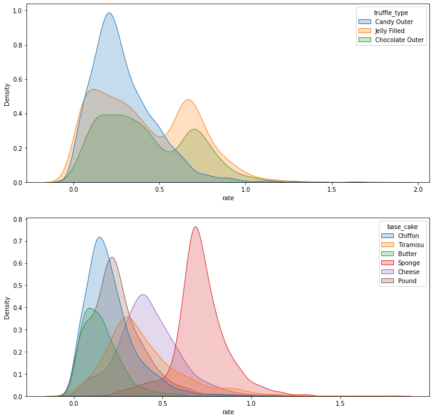
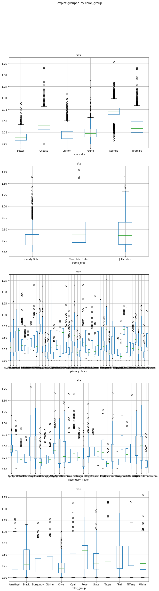
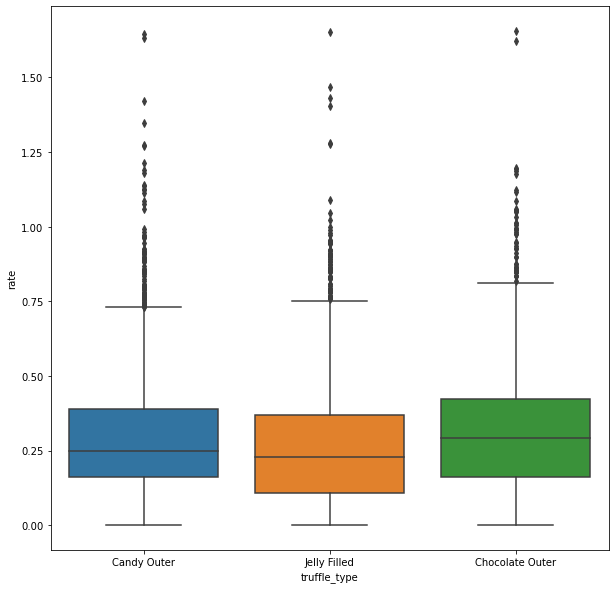

<a href="https://colab.research.google.com/github/wesleybeckner/data_science_foundations/blob/main/notebooks/exercises/E2_Inferential_Statistics_Data_Hunt.ipynb" target="_parent"></a>

# Data Science Foundations <br> Lab 2: Data Hunt II

**Instructor**: Wesley Beckner

**Contact**: wesleybeckner@gmail.com

---

<br>

<p align=center>
</img>
</p>

<p align=center>
That's right you heard correctly. It's the data hunt part TWO.
</p>


<a name='x.0'></a>

## Preparing Environment and Importing Data

### Import Packages


```python
!pip install -U plotly
```

    Requirement already satisfied: plotly in /usr/local/lib/python3.7/dist-packages (4.4.1)
    Collecting plotly
      Downloading plotly-5.1.0-py2.py3-none-any.whl (20.6 MB)
         |████████████████████████████████| 20.6 MB 1.3 MB/s 
    [?25hRequirement already satisfied: six in /usr/local/lib/python3.7/dist-packages (from plotly) (1.15.0)
    Collecting tenacity>=6.2.0
      Downloading tenacity-8.0.1-py3-none-any.whl (24 kB)
    Installing collected packages: tenacity, plotly
      Attempting uninstall: plotly
        Found existing installation: plotly 4.4.1
        Uninstalling plotly-4.4.1:
          Successfully uninstalled plotly-4.4.1
    Successfully installed plotly-5.1.0 tenacity-8.0.1


```python
# our standard libraries
import pandas as pd
import numpy as np
import matplotlib.pyplot as plt
import plotly.express as px
import seaborn as sns
from ipywidgets import interact

# our stats libraries
import random
import scipy.stats as stats
import statsmodels.api as sm
from statsmodels.formula.api import ols
import scipy

# our scikit-Learn library for the regression models
import sklearn         
from sklearn import linear_model
from sklearn.model_selection import train_test_split
from sklearn.metrics import mean_squared_error, r2_score
```

### Import and Clean Data


```python
df = pd.read_csv("https://raw.githubusercontent.com/wesleybeckner/"\
                 "technology_fundamentals/main/assets/truffle_rates.csv")
df = df.loc[df['rate'] > 0]
```


```python
df.head()
```


<div>
<style scoped>
    .dataframe tbody tr th:only-of-type {
        vertical-align: middle;
    }

    .dataframe tbody tr th {
        vertical-align: top;
    }

    .dataframe thead th {
        text-align: right;
    }
</style>
<table border="1" class="dataframe">
  <thead>
    <tr style="text-align: right;">
      <th></th>
      <th>base_cake</th>
      <th>truffle_type</th>
      <th>primary_flavor</th>
      <th>secondary_flavor</th>
      <th>color_group</th>
      <th>rate</th>
    </tr>
  </thead>
  <tbody>
    <tr>
      <th>0</th>
      <td>Chiffon</td>
      <td>Candy Outer</td>
      <td>Cherry Cream Spice</td>
      <td>Ginger Beer</td>
      <td>Tiffany</td>
      <td>0.167097</td>
    </tr>
    <tr>
      <th>1</th>
      <td>Chiffon</td>
      <td>Candy Outer</td>
      <td>Cherry Cream Spice</td>
      <td>Ginger Beer</td>
      <td>Tiffany</td>
      <td>0.153827</td>
    </tr>
    <tr>
      <th>2</th>
      <td>Chiffon</td>
      <td>Candy Outer</td>
      <td>Cherry Cream Spice</td>
      <td>Ginger Beer</td>
      <td>Tiffany</td>
      <td>0.100299</td>
    </tr>
    <tr>
      <th>3</th>
      <td>Chiffon</td>
      <td>Candy Outer</td>
      <td>Cherry Cream Spice</td>
      <td>Ginger Beer</td>
      <td>Tiffany</td>
      <td>0.333008</td>
    </tr>
    <tr>
      <th>4</th>
      <td>Chiffon</td>
      <td>Candy Outer</td>
      <td>Cherry Cream Spice</td>
      <td>Ginger Beer</td>
      <td>Tiffany</td>
      <td>0.078108</td>
    </tr>
  </tbody>
</table>
</div>


```python
df.shape
```


    (9210, 6)


## Exploratory Data Analysis

### Q1 Finding Influential Features

Which of the five features (base_cake, truffle_type, primary_flavor, secondary_flavor, color_group) of the truffles is most influential on production rate?

Back your answer with both a visualization of the distributions (boxplot, kernel denisty estimate, histogram, violin plot) and a statistical test (moods median, ANOVA, t-test)

* Be sure: 
    * everything is labeled (can you improve your labels with additional descriptive statistical information e.g. indicate mean, std, etc.)
    * you meet the assumptions of your statistical test

#### Q1.1 Visualization

Use any number of visualizations. Here is an example to get you started:


```python
# Example: a KDE of the truffle_type and base_cake columns

fig, ax = plt.subplots(2, 1, figsize=(12,12))
sns.kdeplot(x=df['rate'], hue=df['truffle_type'], fill=True, ax=ax[0])
sns.kdeplot(x=df['rate'], hue=df['base_cake'], fill=True, ax=ax[1])
```


    <AxesSubplot:xlabel='rate', ylabel='Density'>


    

    


```python
fig, ax = plt.subplots(5, 1, figsize=(10,40))
for idx, col in enumerate(df.columns[:-1]):
    df.boxplot(by=col, column='rate', ax=ax[idx])
```

    /home/wbeckner/anaconda3/envs/py39/lib/python3.9/site-packages/IPython/core/pylabtools.py:151: UserWarning: Glyph 9 (	) missing from current font.
      fig.canvas.print_figure(bytes_io, **kw)


    

    


#### Q1.2 Statistical Analysis

What statistical tests can you perform to evaluate your hypothesis from the visualizations (maybe you think one particular feature is significant). Here's an ANOVA on the `truffle_type` column to get you started:


```python
model = ols('rate ~ C({})'.format('truffle_type'), data=df).fit()
anova_table = sm.stats.anova_lm(model, typ=2)
display(anova_table)
```


<div>
<style scoped>
    .dataframe tbody tr th:only-of-type {
        vertical-align: middle;
    }

    .dataframe tbody tr th {
        vertical-align: top;
    }

    .dataframe thead th {
        text-align: right;
    }
</style>
<table border="1" class="dataframe">
  <thead>
    <tr style="text-align: right;">
      <th></th>
      <th>sum_sq</th>
      <th>df</th>
      <th>F</th>
      <th>PR(&gt;F)</th>
    </tr>
  </thead>
  <tbody>
    <tr>
      <th>C(truffle_type)</th>
      <td>36.383370</td>
      <td>2.0</td>
      <td>302.005</td>
      <td>9.199611e-128</td>
    </tr>
    <tr>
      <th>Residual</th>
      <td>554.596254</td>
      <td>9207.0</td>
      <td>NaN</td>
      <td>NaN</td>
    </tr>
  </tbody>
</table>
</div>


Is this P value significant? What is the null hypothesis? How do we check the assumptions of ANOVA? 

> Answer: All groups fail for normal distribution of residuals and homogeneity of variances. So we cannot use ANOVA with this data:


```python
confidence_level = 0.05
for idx, col in enumerate(df.columns[:-1]):
    model = ols('rate ~ C({})'.format(col), data=df).fit()
    anova_table = sm.stats.anova_lm(model, typ=2)
    display(anova_table)
    
    print("Shapiro-Wilk")
    print("\tstatistic={:.2f}, pvalue={:.2e}".format(*stats.shapiro(model.resid)))
    if stats.shapiro(model.resid).pvalue < confidence_level:
      shapiro_rej = True
    print(f"\treject: {shapiro_rej}")
    
    print("Bartlett")
    gb = df.groupby(col)['rate']
    w, pvalue = stats.bartlett(*[gb.get_group(x) for x in gb.groups])
    print("\tstatistic={:.2f}, pvalue={:.2e}".format(w, pvalue))
    if pvalue < confidence_level:
      shapiro_rej = True
    print(f"\treject: {shapiro_rej}")
```


<div>
<style scoped>
    .dataframe tbody tr th:only-of-type {
        vertical-align: middle;
    }

    .dataframe tbody tr th {
        vertical-align: top;
    }

    .dataframe thead th {
        text-align: right;
    }
</style>
<table border="1" class="dataframe">
  <thead>
    <tr style="text-align: right;">
      <th></th>
      <th>sum_sq</th>
      <th>df</th>
      <th>F</th>
      <th>PR(&gt;F)</th>
    </tr>
  </thead>
  <tbody>
    <tr>
      <th>C(base_cake)</th>
      <td>331.373550</td>
      <td>5.0</td>
      <td>2349.684756</td>
      <td>0.0</td>
    </tr>
    <tr>
      <th>Residual</th>
      <td>259.606073</td>
      <td>9204.0</td>
      <td>NaN</td>
      <td>NaN</td>
    </tr>
  </tbody>
</table>
</div>


    Shapiro-Wilk
    	statistic=0.93, pvalue=0.00e+00
    	reject: True
    Bartlett
    	statistic=619.37, pvalue=1.32e-131
    	reject: True


    /home/wbeckner/anaconda3/envs/py39/lib/python3.9/site-packages/scipy/stats/morestats.py:1760: UserWarning: p-value may not be accurate for N > 5000.
      warnings.warn("p-value may not be accurate for N > 5000.")


<div>
<style scoped>
    .dataframe tbody tr th:only-of-type {
        vertical-align: middle;
    }

    .dataframe tbody tr th {
        vertical-align: top;
    }

    .dataframe thead th {
        text-align: right;
    }
</style>
<table border="1" class="dataframe">
  <thead>
    <tr style="text-align: right;">
      <th></th>
      <th>sum_sq</th>
      <th>df</th>
      <th>F</th>
      <th>PR(&gt;F)</th>
    </tr>
  </thead>
  <tbody>
    <tr>
      <th>C(truffle_type)</th>
      <td>36.383370</td>
      <td>2.0</td>
      <td>302.005</td>
      <td>9.199611e-128</td>
    </tr>
    <tr>
      <th>Residual</th>
      <td>554.596254</td>
      <td>9207.0</td>
      <td>NaN</td>
      <td>NaN</td>
    </tr>
  </tbody>
</table>
</div>


    Shapiro-Wilk
    	statistic=0.96, pvalue=1.37e-42
    	reject: True
    Bartlett
    	statistic=533.02, pvalue=1.80e-116
    	reject: True


    /home/wbeckner/anaconda3/envs/py39/lib/python3.9/site-packages/scipy/stats/morestats.py:1760: UserWarning: p-value may not be accurate for N > 5000.
      warnings.warn("p-value may not be accurate for N > 5000.")


<div>
<style scoped>
    .dataframe tbody tr th:only-of-type {
        vertical-align: middle;
    }

    .dataframe tbody tr th {
        vertical-align: top;
    }

    .dataframe thead th {
        text-align: right;
    }
</style>
<table border="1" class="dataframe">
  <thead>
    <tr style="text-align: right;">
      <th></th>
      <th>sum_sq</th>
      <th>df</th>
      <th>F</th>
      <th>PR(&gt;F)</th>
    </tr>
  </thead>
  <tbody>
    <tr>
      <th>C(primary_flavor)</th>
      <td>159.105452</td>
      <td>47.0</td>
      <td>71.815842</td>
      <td>0.0</td>
    </tr>
    <tr>
      <th>Residual</th>
      <td>431.874171</td>
      <td>9162.0</td>
      <td>NaN</td>
      <td>NaN</td>
    </tr>
  </tbody>
</table>
</div>


    Shapiro-Wilk
    	statistic=0.97, pvalue=6.49e-38
    	reject: True
    Bartlett


    /home/wbeckner/anaconda3/envs/py39/lib/python3.9/site-packages/scipy/stats/morestats.py:1760: UserWarning: p-value may not be accurate for N > 5000.
      warnings.warn("p-value may not be accurate for N > 5000.")


    	statistic=1609.00, pvalue=1.85e-306
    	reject: True


<div>
<style scoped>
    .dataframe tbody tr th:only-of-type {
        vertical-align: middle;
    }

    .dataframe tbody tr th {
        vertical-align: top;
    }

    .dataframe thead th {
        text-align: right;
    }
</style>
<table border="1" class="dataframe">
  <thead>
    <tr style="text-align: right;">
      <th></th>
      <th>sum_sq</th>
      <th>df</th>
      <th>F</th>
      <th>PR(&gt;F)</th>
    </tr>
  </thead>
  <tbody>
    <tr>
      <th>C(secondary_flavor)</th>
      <td>115.773877</td>
      <td>28.0</td>
      <td>79.884192</td>
      <td>0.0</td>
    </tr>
    <tr>
      <th>Residual</th>
      <td>475.205747</td>
      <td>9181.0</td>
      <td>NaN</td>
      <td>NaN</td>
    </tr>
  </tbody>
</table>
</div>


    Shapiro-Wilk
    	statistic=0.97, pvalue=4.34e-39
    	reject: True
    Bartlett
    	statistic=1224.49, pvalue=3.55e-240
    	reject: True


    /home/wbeckner/anaconda3/envs/py39/lib/python3.9/site-packages/scipy/stats/morestats.py:1760: UserWarning: p-value may not be accurate for N > 5000.
      warnings.warn("p-value may not be accurate for N > 5000.")


<div>
<style scoped>
    .dataframe tbody tr th:only-of-type {
        vertical-align: middle;
    }

    .dataframe tbody tr th {
        vertical-align: top;
    }

    .dataframe thead th {
        text-align: right;
    }
</style>
<table border="1" class="dataframe">
  <thead>
    <tr style="text-align: right;">
      <th></th>
      <th>sum_sq</th>
      <th>df</th>
      <th>F</th>
      <th>PR(&gt;F)</th>
    </tr>
  </thead>
  <tbody>
    <tr>
      <th>C(color_group)</th>
      <td>33.878491</td>
      <td>11.0</td>
      <td>50.849974</td>
      <td>1.873235e-109</td>
    </tr>
    <tr>
      <th>Residual</th>
      <td>557.101132</td>
      <td>9198.0</td>
      <td>NaN</td>
      <td>NaN</td>
    </tr>
  </tbody>
</table>
</div>


    Shapiro-Wilk
    	statistic=0.96, pvalue=1.40e-44
    	reject: True
    Bartlett
    	statistic=298.64, pvalue=1.69e-57
    	reject: True


    /home/wbeckner/anaconda3/envs/py39/lib/python3.9/site-packages/scipy/stats/morestats.py:1760: UserWarning: p-value may not be accurate for N > 5000.
      warnings.warn("p-value may not be accurate for N > 5000.")


Instead we might use Moods Median

### Q2 Finding Best and Worst Groups


#### Q2.1 Compare Every Group to the Whole

Of the primary flavors (feature), what 5 flavors (groups) would you recommend Truffletopia discontinue?

Iterate through every level (i.e. pound, cheese, sponge cakes) of every category (i.e. base cake, primary flavor, secondary flavor) and use moods median testing to compare the group distribution to the grand median rate.


```python
moodsdf = pd.DataFrame()
target = 'rate'
for col in df.columns[:-1]:
  for truff in df[col].unique():
    group = df.loc[df[col] == truff][target]
    pop = df.loc[~(df[col] == truff)][target]
    stat, p, m, table = scipy.stats.median_test(group, pop)
    median = np.median(group)
    mean = np.mean(group)
    size = len(group)
    
    moodsdf = pd.concat([moodsdf, 
                              pd.DataFrame([col, truff, 
                                            stat, p, m, mean, median, size,
                                             table]).T])
moodsdf.columns = ['descriptor', 'group', 'pearsons_chi_square', 'p_value', 
                'grand_median', 'group_mean', 'group_median', 'size', 
                'table']
moodsdf['p_value'] = moodsdf['p_value'].astype(float)
print(moodsdf.shape)
```

    (98, 9)


After you've computed a moods median test on every group, filter any data above a significance level of 0.05


```python
moodsdf = moodsdf.loc[(moodsdf['p_value'] < confidence_level)].sort_values('group_median')

moodsdf = moodsdf.sort_values('group_median').reset_index(drop=True)
print(moodsdf.shape)
```

    (83, 9)


Return the groups with the lowest median performance (your table need not look exactly like the one I've created)


```python
moodsdf
```


<div>
<style scoped>
    .dataframe tbody tr th:only-of-type {
        vertical-align: middle;
    }

    .dataframe tbody tr th {
        vertical-align: top;
    }

    .dataframe thead th {
        text-align: right;
    }
</style>
<table border="1" class="dataframe">
  <thead>
    <tr style="text-align: right;">
      <th></th>
      <th>descriptor</th>
      <th>group</th>
      <th>pearsons_chi_square</th>
      <th>p_value</th>
      <th>grand_median</th>
      <th>group_mean</th>
      <th>group_median</th>
      <th>size</th>
      <th>table</th>
    </tr>
  </thead>
  <tbody>
    <tr>
      <th>0</th>
      <td>secondary_flavor</td>
      <td>Wild Cherry Cream</td>
      <td>56.867453</td>
      <td>4.661980e-14</td>
      <td>0.310345</td>
      <td>0.139998</td>
      <td>0.085628</td>
      <td>100</td>
      <td>[[12, 4593], [88, 4517]]</td>
    </tr>
    <tr>
      <th>1</th>
      <td>primary_flavor</td>
      <td>Coconut</td>
      <td>56.867453</td>
      <td>4.661980e-14</td>
      <td>0.310345</td>
      <td>0.139998</td>
      <td>0.085628</td>
      <td>100</td>
      <td>[[12, 4593], [88, 4517]]</td>
    </tr>
    <tr>
      <th>2</th>
      <td>primary_flavor</td>
      <td>Pink Lemonade</td>
      <td>61.556345</td>
      <td>4.302530e-15</td>
      <td>0.310345</td>
      <td>0.129178</td>
      <td>0.092878</td>
      <td>85</td>
      <td>[[6, 4599], [79, 4526]]</td>
    </tr>
    <tr>
      <th>3</th>
      <td>primary_flavor</td>
      <td>Chocolate</td>
      <td>51.32026</td>
      <td>7.846169e-13</td>
      <td>0.310345</td>
      <td>0.145727</td>
      <td>0.095758</td>
      <td>91</td>
      <td>[[11, 4594], [80, 4525]]</td>
    </tr>
    <tr>
      <th>4</th>
      <td>primary_flavor</td>
      <td>Wild Cherry Cream</td>
      <td>43.545249</td>
      <td>4.142688e-11</td>
      <td>0.310345</td>
      <td>0.148964</td>
      <td>0.10588</td>
      <td>70</td>
      <td>[[7, 4598], [63, 4542]]</td>
    </tr>
    <tr>
      <th>...</th>
      <td>...</td>
      <td>...</td>
      <td>...</td>
      <td>...</td>
      <td>...</td>
      <td>...</td>
      <td>...</td>
      <td>...</td>
      <td>...</td>
    </tr>
    <tr>
      <th>78</th>
      <td>secondary_flavor</td>
      <td>Vanilla</td>
      <td>40.484134</td>
      <td>1.982191e-10</td>
      <td>0.310345</td>
      <td>0.559808</td>
      <td>0.664252</td>
      <td>200</td>
      <td>[[145, 4460], [55, 4550]]</td>
    </tr>
    <tr>
      <th>79</th>
      <td>primary_flavor</td>
      <td>Orange</td>
      <td>60.723646</td>
      <td>6.567649e-15</td>
      <td>0.310345</td>
      <td>0.580579</td>
      <td>0.681157</td>
      <td>200</td>
      <td>[[155, 4450], [45, 4560]]</td>
    </tr>
    <tr>
      <th>80</th>
      <td>primary_flavor</td>
      <td>Plum</td>
      <td>308.037116</td>
      <td>5.845614e-69</td>
      <td>0.310345</td>
      <td>0.669126</td>
      <td>0.681309</td>
      <td>300</td>
      <td>[[300, 4305], [0, 4605]]</td>
    </tr>
    <tr>
      <th>81</th>
      <td>primary_flavor</td>
      <td>Cheesecake</td>
      <td>99.085851</td>
      <td>2.417896e-23</td>
      <td>0.310345</td>
      <td>0.745813</td>
      <td>0.689802</td>
      <td>100</td>
      <td>[[100, 4505], [0, 4605]]</td>
    </tr>
    <tr>
      <th>82</th>
      <td>base_cake</td>
      <td>Sponge</td>
      <td>2107.437614</td>
      <td>0.000000e+00</td>
      <td>0.310345</td>
      <td>0.711797</td>
      <td>0.699679</td>
      <td>1800</td>
      <td>[[1774, 2831], [26, 4579]]</td>
    </tr>
  </tbody>
</table>
<p>83 rows × 9 columns</p>
</div>


We would want to cut the following primary flavors. Check to see that you get a similar answer. rip wild cherry cream.

```
['Coconut', 'Pink Lemonade', 'Chocolate', 'Wild Cherry Cream', 'Gingersnap']
```


```python
moodsdf.loc[moodsdf['descriptor'] == 'primary_flavor'][:5]
```


<div>
<style scoped>
    .dataframe tbody tr th:only-of-type {
        vertical-align: middle;
    }

    .dataframe tbody tr th {
        vertical-align: top;
    }

    .dataframe thead th {
        text-align: right;
    }
</style>
<table border="1" class="dataframe">
  <thead>
    <tr style="text-align: right;">
      <th></th>
      <th>descriptor</th>
      <th>group</th>
      <th>pearsons_chi_square</th>
      <th>p_value</th>
      <th>grand_median</th>
      <th>group_mean</th>
      <th>group_median</th>
      <th>size</th>
      <th>table</th>
    </tr>
  </thead>
  <tbody>
    <tr>
      <th>1</th>
      <td>primary_flavor</td>
      <td>Coconut</td>
      <td>56.867453</td>
      <td>4.661980e-14</td>
      <td>0.310345</td>
      <td>0.139998</td>
      <td>0.085628</td>
      <td>100</td>
      <td>[[12, 4593], [88, 4517]]</td>
    </tr>
    <tr>
      <th>2</th>
      <td>primary_flavor</td>
      <td>Pink Lemonade</td>
      <td>61.556345</td>
      <td>4.302530e-15</td>
      <td>0.310345</td>
      <td>0.129178</td>
      <td>0.092878</td>
      <td>85</td>
      <td>[[6, 4599], [79, 4526]]</td>
    </tr>
    <tr>
      <th>3</th>
      <td>primary_flavor</td>
      <td>Chocolate</td>
      <td>51.32026</td>
      <td>7.846169e-13</td>
      <td>0.310345</td>
      <td>0.145727</td>
      <td>0.095758</td>
      <td>91</td>
      <td>[[11, 4594], [80, 4525]]</td>
    </tr>
    <tr>
      <th>4</th>
      <td>primary_flavor</td>
      <td>Wild Cherry Cream</td>
      <td>43.545249</td>
      <td>4.142688e-11</td>
      <td>0.310345</td>
      <td>0.148964</td>
      <td>0.10588</td>
      <td>70</td>
      <td>[[7, 4598], [63, 4542]]</td>
    </tr>
    <tr>
      <th>10</th>
      <td>primary_flavor</td>
      <td>Gingersnap</td>
      <td>131.113519</td>
      <td>2.338438e-30</td>
      <td>0.310345</td>
      <td>0.159268</td>
      <td>0.143347</td>
      <td>192</td>
      <td>[[17, 4588], [175, 4430]]</td>
    </tr>
  </tbody>
</table>
</div>


#### Q2.2 Beyond Statistical Testing: Using Reasoning

Let's look at the total profile of the products associated with the five worst primary flavors. Given the number of different products made with any of these flavors, would you alter your answer at all?

> Answer: We would opt to only discontinue the gingersnap, and wild cherry cream flavors. The other flavors, Pink Lemonade, Chocolate, and Coconut may be subject to [Simpson's Paradox](https://www.britannica.com/topic/Simpsons-paradox) since we do not have adequate sampling of them with other categories


```python
# 1. filter df for only bottom five flavors
# 2. groupby all columns besides rate
# 3. describe the rate column.

# by doing this we can evaluate just how much sampling variety we have for the
# worst performing flavors.

bottom_five = ['Coconut', 'Pink Lemonade', 'Chocolate', 'Wild Cherry Cream', 'Gingersnap']
df.loc[df['primary_flavor'].isin(bottom_five)].groupby(list(df.columns[:-1]))['rate'].describe()
```


<div>
<style scoped>
    .dataframe tbody tr th:only-of-type {
        vertical-align: middle;
    }

    .dataframe tbody tr th {
        vertical-align: top;
    }

    .dataframe thead th {
        text-align: right;
    }
</style>
<table border="1" class="dataframe">
  <thead>
    <tr style="text-align: right;">
      <th></th>
      <th></th>
      <th></th>
      <th></th>
      <th></th>
      <th>count</th>
      <th>mean</th>
      <th>std</th>
      <th>min</th>
      <th>25%</th>
      <th>50%</th>
      <th>75%</th>
      <th>max</th>
    </tr>
    <tr>
      <th>base_cake</th>
      <th>truffle_type</th>
      <th>primary_flavor</th>
      <th>secondary_flavor</th>
      <th>color_group</th>
      <th></th>
      <th></th>
      <th></th>
      <th></th>
      <th></th>
      <th></th>
      <th></th>
      <th></th>
    </tr>
  </thead>
  <tbody>
    <tr>
      <th>Butter</th>
      <th>Jelly Filled</th>
      <th>Pink Lemonade</th>
      <th>Butter Rum</th>
      <th>Rose</th>
      <td>85.0</td>
      <td>0.129178</td>
      <td>0.137326</td>
      <td>0.000061</td>
      <td>0.032887</td>
      <td>0.092878</td>
      <td>0.171350</td>
      <td>0.860045</td>
    </tr>
    <tr>
      <th rowspan="3" valign="top">Chiffon</th>
      <th>Candy Outer</th>
      <th>Wild Cherry Cream</th>
      <th>Rock and Rye</th>
      <th>Olive</th>
      <td>17.0</td>
      <td>0.094287</td>
      <td>0.059273</td>
      <td>0.010464</td>
      <td>0.053976</td>
      <td>0.077098</td>
      <td>0.120494</td>
      <td>0.229933</td>
    </tr>
    <tr>
      <th>Chocolate Outer</th>
      <th>Gingersnap</th>
      <th>Dill Pickle</th>
      <th>Burgundy</th>
      <td>59.0</td>
      <td>0.133272</td>
      <td>0.080414</td>
      <td>0.021099</td>
      <td>0.069133</td>
      <td>0.137972</td>
      <td>0.172066</td>
      <td>0.401387</td>
    </tr>
    <tr>
      <th>Jelly Filled</th>
      <th>Chocolate</th>
      <th>Tutti Frutti</th>
      <th>Burgundy</th>
      <td>91.0</td>
      <td>0.145727</td>
      <td>0.135230</td>
      <td>0.000033</td>
      <td>0.044847</td>
      <td>0.095758</td>
      <td>0.185891</td>
      <td>0.586570</td>
    </tr>
    <tr>
      <th rowspan="4" valign="top">Pound</th>
      <th>Candy Outer</th>
      <th>Coconut</th>
      <th>Wild Cherry Cream</th>
      <th>Taupe</th>
      <td>100.0</td>
      <td>0.139998</td>
      <td>0.147723</td>
      <td>0.000705</td>
      <td>0.036004</td>
      <td>0.085628</td>
      <td>0.187318</td>
      <td>0.775210</td>
    </tr>
    <tr>
      <th>Chocolate Outer</th>
      <th>Gingersnap</th>
      <th>Rock and Rye</th>
      <th>Black</th>
      <td>67.0</td>
      <td>0.156160</td>
      <td>0.110666</td>
      <td>0.002846</td>
      <td>0.074615</td>
      <td>0.139572</td>
      <td>0.241114</td>
      <td>0.551898</td>
    </tr>
    <tr>
      <th rowspan="2" valign="top">Jelly Filled</th>
      <th>Gingersnap</th>
      <th>Kiwi</th>
      <th>Taupe</th>
      <td>66.0</td>
      <td>0.185662</td>
      <td>0.132272</td>
      <td>0.000014</td>
      <td>0.086377</td>
      <td>0.166340</td>
      <td>0.247397</td>
      <td>0.593016</td>
    </tr>
    <tr>
      <th>Wild Cherry Cream</th>
      <th>Mango</th>
      <th>Taupe</th>
      <td>53.0</td>
      <td>0.166502</td>
      <td>0.160090</td>
      <td>0.001412</td>
      <td>0.056970</td>
      <td>0.108918</td>
      <td>0.207306</td>
      <td>0.787224</td>
    </tr>
  </tbody>
</table>
</div>


#### Q2.3 The Jelly Filled Conundrum

Your boss notices the Jelly filled truffles are being produced much faster than the candy outer truffles and suggests expanding into this product line. What is your response? Use the visualization tool below to help you think about this problem, then create any visualizations or analyses of your own.

[sunburst charts](https://plotly.com/python/sunburst-charts/)

> Answer: Another case of Simpson's Paradox. The real boost is due to the sponge cake base cake type. It is simply that we have been producing more of the sponge cakes that are jelly filled. In fact, jelly filled has a slightly worse performance than chocolate outer when paired with sponge cake. This can be visually verified by switching the menu item in `interact` to observe the effect of Jelly Filled on all its constituent products


```python
def sun(path=[['base_cake', 'truffle_type', 'primary_flavor', 'secondary_flavor', 'color_group'],
              ['truffle_type', 'base_cake', 'primary_flavor', 'secondary_flavor', 'color_group']]):
  fig = px.sunburst(df, path=path, 
                    color='rate', 
                    color_continuous_scale='viridis',
                    )

  fig.update_layout(
      margin=dict(l=20, r=20, t=20, b=20),
      height=650
  )
  fig.show()
```


```python
interact(sun)
```


    interactive(children=(Dropdown(description='path', options=(['base_cake', 'truffle_type', 'primary_flavor', 's…


    <function __main__.sun(path=[['base_cake', 'truffle_type', 'primary_flavor', 'secondary_flavor', 'color_group'], ['truffle_type', 'base_cake', 'primary_flavor', 'secondary_flavor', 'color_group']])>


This negative impact of Jelly filled is still obscured in the median analysis:


```python
moodsdf.loc[moodsdf['descriptor'] == 'truffle_type']
```


<div>
<style scoped>
    .dataframe tbody tr th:only-of-type {
        vertical-align: middle;
    }

    .dataframe tbody tr th {
        vertical-align: top;
    }

    .dataframe thead th {
        text-align: right;
    }
</style>
<table border="1" class="dataframe">
  <thead>
    <tr style="text-align: right;">
      <th></th>
      <th>descriptor</th>
      <th>group</th>
      <th>pearsons_chi_square</th>
      <th>p_value</th>
      <th>grand_median</th>
      <th>group_mean</th>
      <th>group_median</th>
      <th>size</th>
      <th>table</th>
    </tr>
  </thead>
  <tbody>
    <tr>
      <th>32</th>
      <td>truffle_type</td>
      <td>Candy Outer</td>
      <td>369.023049</td>
      <td>3.054270e-82</td>
      <td>0.310345</td>
      <td>0.289822</td>
      <td>0.249572</td>
      <td>3352</td>
      <td>[[1232, 3373], [2120, 2485]]</td>
    </tr>
    <tr>
      <th>52</th>
      <td>truffle_type</td>
      <td>Jelly Filled</td>
      <td>95.107432</td>
      <td>1.803284e-22</td>
      <td>0.310345</td>
      <td>0.414813</td>
      <td>0.365576</td>
      <td>3450</td>
      <td>[[1952, 2653], [1498, 3107]]</td>
    </tr>
    <tr>
      <th>55</th>
      <td>truffle_type</td>
      <td>Chocolate Outer</td>
      <td>105.424685</td>
      <td>9.857421e-25</td>
      <td>0.310345</td>
      <td>0.427535</td>
      <td>0.380527</td>
      <td>2408</td>
      <td>[[1421, 3184], [987, 3618]]</td>
    </tr>
  </tbody>
</table>
</div>


So we must account for the affect of the sponge cake:


```python
fig, ax = plt.subplots(figsize=(10,10))
sns.boxplot(x='truffle_type', y='rate', data=df.loc[~(df['base_cake'] == 'Sponge')])
print(df.loc[~(df['base_cake'] == 'Sponge')].groupby('truffle_type')[['rate']].mean())
```

                         rate
    truffle_type             
    Candy Outer      0.289822
    Chocolate Outer  0.320189
    Jelly Filled     0.266877


    

    


```python
fig, ax = plt.subplots(figsize=(10,10))
sns.boxplot(x='truffle_type', y='rate', data=df.loc[(df['base_cake'] == 'Sponge')])
print(df.loc[(df['base_cake'] == 'Sponge')].groupby('truffle_type')[['rate']].mean())
```

                         rate
    truffle_type             
    Chocolate Outer  0.751005
    Jelly Filled     0.692193


    

    

