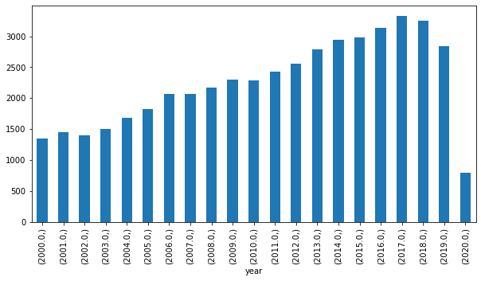

<a href="https://colab.research.google.com/github/wesleybeckner/data_science_foundations/blob/main/notebooks/solutions/SOLN_L1_Descriptive_Statistics_Data_Hunt.ipynb" target="_parent"></a>

# Data Science Foundations, Lab 1: Data Hunt I

**Instructor**: Wesley Beckner

**Contact**: wesleybeckner@gmail.com

---

<br>

That's right you heard correctly. It's a data hunt.

<br>

---


```python
import pandas as pd
import matplotlib.pyplot as plt
import seaborn as sns
from ipywidgets import interact
```


```python
df = pd.read_csv("https://raw.githubusercontent.com/wesleybeckner/"\
  "technology_explorers/main/assets/imdb_movies.csv")

# converting years to numbers for easy conditionals
df['year'] = pd.to_numeric(df['year'], errors='coerce')
df.shape
```

    /home/wbeckner/anaconda3/envs/py39/lib/python3.9/site-packages/IPython/core/interactiveshell.py:3251: DtypeWarning: Columns (3) have mixed types.Specify dtype option on import or set low_memory=False.
      exec(code_obj, self.user_global_ns, self.user_ns)


    (85855, 22)


```python
df.head(3)
```


<div>
<style scoped>
    .dataframe tbody tr th:only-of-type {
        vertical-align: middle;
    }

    .dataframe tbody tr th {
        vertical-align: top;
    }

    .dataframe thead th {
        text-align: right;
    }
</style>
<table border="1" class="dataframe">
  <thead>
    <tr style="text-align: right;">
      <th></th>
      <th>imdb_title_id</th>
      <th>title</th>
      <th>original_title</th>
      <th>year</th>
      <th>date_published</th>
      <th>genre</th>
      <th>duration</th>
      <th>country</th>
      <th>language</th>
      <th>director</th>
      <th>...</th>
      <th>actors</th>
      <th>description</th>
      <th>avg_vote</th>
      <th>votes</th>
      <th>budget</th>
      <th>usa_gross_income</th>
      <th>worlwide_gross_income</th>
      <th>metascore</th>
      <th>reviews_from_users</th>
      <th>reviews_from_critics</th>
    </tr>
  </thead>
  <tbody>
    <tr>
      <th>0</th>
      <td>tt0000009</td>
      <td>Miss Jerry</td>
      <td>Miss Jerry</td>
      <td>1894.0</td>
      <td>1894-10-09</td>
      <td>Romance</td>
      <td>45</td>
      <td>USA</td>
      <td>None</td>
      <td>Alexander Black</td>
      <td>...</td>
      <td>Blanche Bayliss, William Courtenay, Chauncey D...</td>
      <td>The adventures of a female reporter in the 1890s.</td>
      <td>5.9</td>
      <td>154</td>
      <td>NaN</td>
      <td>NaN</td>
      <td>NaN</td>
      <td>NaN</td>
      <td>1.0</td>
      <td>2.0</td>
    </tr>
    <tr>
      <th>1</th>
      <td>tt0000574</td>
      <td>The Story of the Kelly Gang</td>
      <td>The Story of the Kelly Gang</td>
      <td>1906.0</td>
      <td>1906-12-26</td>
      <td>Biography, Crime, Drama</td>
      <td>70</td>
      <td>Australia</td>
      <td>None</td>
      <td>Charles Tait</td>
      <td>...</td>
      <td>Elizabeth Tait, John Tait, Norman Campbell, Be...</td>
      <td>True story of notorious Australian outlaw Ned ...</td>
      <td>6.1</td>
      <td>589</td>
      <td>$ 2250</td>
      <td>NaN</td>
      <td>NaN</td>
      <td>NaN</td>
      <td>7.0</td>
      <td>7.0</td>
    </tr>
    <tr>
      <th>2</th>
      <td>tt0001892</td>
      <td>Den sorte drøm</td>
      <td>Den sorte drøm</td>
      <td>1911.0</td>
      <td>1911-08-19</td>
      <td>Drama</td>
      <td>53</td>
      <td>Germany, Denmark</td>
      <td>NaN</td>
      <td>Urban Gad</td>
      <td>...</td>
      <td>Asta Nielsen, Valdemar Psilander, Gunnar Helse...</td>
      <td>Two men of high rank are both wooing the beaut...</td>
      <td>5.8</td>
      <td>188</td>
      <td>NaN</td>
      <td>NaN</td>
      <td>NaN</td>
      <td>NaN</td>
      <td>5.0</td>
      <td>2.0</td>
    </tr>
  </tbody>
</table>
<p>3 rows × 22 columns</p>
</div>


# Q1 What american director has the highest mean  avg_vote?


```python
df.groupby('director')['avg_vote'].mean().sort_values(ascending=False)
```


    director
    Msn Surya            9.9
    Aalmist Subba        9.8
    Sampath Rudra        9.8
    Basheed S.K.         9.8
    Abner Official       9.8
                        ... 
    Ramana Reddy B.V.    1.0
    Tamás Gerencsér      1.0
    Tommy Yu             1.0
    Gökhan Gök           1.0
    Yasutake Torii       1.0
    Name: avg_vote, Length: 34733, dtype: float64


# Q2 What american director with more than 5 movies, has the highest mean avg_vote?


```python
df.groupby('director').filter(lambda x: x.shape[0] > 5).\
  groupby('director')['avg_vote'].mean().sort_values(ascending=False)
```


    director
    Christopher Nolan     8.218182
    Satyajit Ray          8.025000
    Andrei Tarkovsky      8.014286
    Hayao Miyazaki        8.008333
    Sergio Leone          7.928571
                            ...   
    Bill Zebub            2.483333
    Mark Polonia          2.433333
    Paul T.T. Easter      2.383333
    Christopher Forbes    2.000000
    Brett Kelly           1.533333
    Name: avg_vote, Length: 3047, dtype: float64


# Q3 What director has the largest variance in avg_vote?


```python
df.groupby('director')['avg_vote'].std().sort_values(ascending=False)
```


    director
    Deniz Denizciler              4.030509
    Rudi Lagemann                 3.747666
    Emilio Ruiz Barrachina        3.676955
    Krishna Ghattamaneni          3.676955
    Milos Avramovic               3.606245
                                    ...   
    Ümit Degirmenci                    NaN
    Ümit Elçi                          NaN
    Ümit Köreken                       NaN
    Þorsteinn Gunnar Bjarnason         NaN
    Þórhildur Þorleifsdóttir           NaN
    Name: avg_vote, Length: 34733, dtype: float64


# Q4 What director with more than 10 movies has the largest variance in avg_vote?


```python
df.groupby('director').filter(lambda x: x.shape[0] > 10).\
  groupby('director')['avg_vote'].std().sort_values(ascending=False)
```


    director
    Harry Baweja         1.869954
    Shaji Kailas         1.854502
    Zdenek Troska        1.775984
    Adam Rifkin          1.711251
    Ram Gopal Varma      1.687850
                           ...   
    Ford Beebe           0.224343
    Ray Nazarro          0.210311
    Jean Grémillon       0.196946
    Louis Feuillade      0.156428
    Tsutomu Shibayama    0.126121
    Name: avg_vote, Length: 1135, dtype: float64


# Q5 What american directors with more than 5 movies have the largest variance in avg_vote?


```python
df.groupby('director').filter(lambda x: x.shape[0] > 5).\
  groupby('director')['avg_vote'].std().sort_values(ascending=False)
```


    director
    Jorge Ameer          2.200606
    Tigran Keosayan      2.188150
    Nikos Zervos         2.093243
    Kundan Shah          2.060502
    Feroz Khan           2.036220
                           ...   
    Sang-il Lee          0.132916
    Nate Watt            0.129099
    Daisuke Nishio       0.127242
    Tsutomu Shibayama    0.126121
    Pierre Chenal        0.103280
    Name: avg_vote, Length: 3047, dtype: float64


# Q6 Where does M. Night Shyamalan fall on this rank scale?

(He's number 36/859)


```python
var_rank = df.loc[df['country'] == 'USA'].groupby('director').filter(lambda x: x.shape[0] > 5).\
  groupby('director')['avg_vote'].std().sort_values(ascending=False).reset_index()
display(var_rank.loc[var_rank['director'] == 'M. Night Shyamalan'])
print(var_rank.shape[0])
```


<div>
<style scoped>
    .dataframe tbody tr th:only-of-type {
        vertical-align: middle;
    }

    .dataframe tbody tr th {
        vertical-align: top;
    }

    .dataframe thead th {
        text-align: right;
    }
</style>
<table border="1" class="dataframe">
  <thead>
    <tr style="text-align: right;">
      <th></th>
      <th>director</th>
      <th>avg_vote</th>
    </tr>
  </thead>
  <tbody>
    <tr>
      <th>36</th>
      <td>M. Night Shyamalan</td>
      <td>1.258791</td>
    </tr>
  </tbody>
</table>
</div>


    859


what happens when you only include directors who, on average (based on mean), have made most their movies after 1990 and have produced 10 or more movies?

(Shyamalan rises to 3/83)


```python
var_rank = df.loc[df['country'] == 'USA']\
    .groupby('director').filter(lambda x: (x['year'].mean() > 1990) & (x.shape[0] > 9))\
    .groupby('director')[['avg_vote', 'votes']].describe().sort_values(by=('avg_vote', 'std'), ascending=False)

display(var_rank.iloc[:10])
print(var_rank.shape[0])
```


<div>
<style scoped>
    .dataframe tbody tr th:only-of-type {
        vertical-align: middle;
    }

    .dataframe tbody tr th {
        vertical-align: top;
    }

    .dataframe thead tr th {
        text-align: left;
    }

    .dataframe thead tr:last-of-type th {
        text-align: right;
    }
</style>
<table border="1" class="dataframe">
  <thead>
    <tr>
      <th></th>
      <th colspan="8" halign="left">avg_vote</th>
      <th colspan="8" halign="left">votes</th>
    </tr>
    <tr>
      <th></th>
      <th>count</th>
      <th>mean</th>
      <th>std</th>
      <th>min</th>
      <th>25%</th>
      <th>50%</th>
      <th>75%</th>
      <th>max</th>
      <th>count</th>
      <th>mean</th>
      <th>std</th>
      <th>min</th>
      <th>25%</th>
      <th>50%</th>
      <th>75%</th>
      <th>max</th>
    </tr>
    <tr>
      <th>director</th>
      <th></th>
      <th></th>
      <th></th>
      <th></th>
      <th></th>
      <th></th>
      <th></th>
      <th></th>
      <th></th>
      <th></th>
      <th></th>
      <th></th>
      <th></th>
      <th></th>
      <th></th>
      <th></th>
    </tr>
  </thead>
  <tbody>
    <tr>
      <th>Adam Rifkin</th>
      <td>15.0</td>
      <td>5.053333</td>
      <td>1.711251</td>
      <td>1.3</td>
      <td>4.200</td>
      <td>5.80</td>
      <td>6.100</td>
      <td>6.9</td>
      <td>15.0</td>
      <td>4417.400000</td>
      <td>9414.430237</td>
      <td>124.0</td>
      <td>525.50</td>
      <td>1084.0</td>
      <td>1782.50</td>
      <td>34958.0</td>
    </tr>
    <tr>
      <th>Mark L. Lester</th>
      <td>19.0</td>
      <td>4.768421</td>
      <td>1.262296</td>
      <td>2.3</td>
      <td>4.200</td>
      <td>4.70</td>
      <td>5.800</td>
      <td>6.7</td>
      <td>19.0</td>
      <td>11479.052632</td>
      <td>32768.240173</td>
      <td>298.0</td>
      <td>549.00</td>
      <td>1219.0</td>
      <td>4405.50</td>
      <td>143443.0</td>
    </tr>
    <tr>
      <th>M. Night Shyamalan</th>
      <td>10.0</td>
      <td>5.970000</td>
      <td>1.258791</td>
      <td>4.0</td>
      <td>4.975</td>
      <td>6.05</td>
      <td>6.650</td>
      <td>8.1</td>
      <td>10.0</td>
      <td>239264.500000</td>
      <td>262079.154005</td>
      <td>731.0</td>
      <td>97982.50</td>
      <td>169426.0</td>
      <td>308493.25</td>
      <td>894385.0</td>
    </tr>
    <tr>
      <th>Sean McNamara</th>
      <td>12.0</td>
      <td>5.216667</td>
      <td>1.252513</td>
      <td>2.9</td>
      <td>4.725</td>
      <td>5.60</td>
      <td>5.950</td>
      <td>7.0</td>
      <td>12.0</td>
      <td>9221.166667</td>
      <td>13933.853515</td>
      <td>365.0</td>
      <td>1085.25</td>
      <td>1416.0</td>
      <td>12191.50</td>
      <td>44808.0</td>
    </tr>
    <tr>
      <th>Sam Firstenberg</th>
      <td>10.0</td>
      <td>4.550000</td>
      <td>1.174970</td>
      <td>2.8</td>
      <td>3.475</td>
      <td>4.85</td>
      <td>5.325</td>
      <td>6.2</td>
      <td>10.0</td>
      <td>1890.400000</td>
      <td>1552.704107</td>
      <td>153.0</td>
      <td>713.50</td>
      <td>1282.0</td>
      <td>3317.25</td>
      <td>4330.0</td>
    </tr>
    <tr>
      <th>Gus Van Sant</th>
      <td>12.0</td>
      <td>6.583333</td>
      <td>1.169952</td>
      <td>4.4</td>
      <td>6.025</td>
      <td>6.95</td>
      <td>7.300</td>
      <td>8.3</td>
      <td>12.0</td>
      <td>112868.166667</td>
      <td>232569.906962</td>
      <td>3674.0</td>
      <td>16191.75</td>
      <td>38458.5</td>
      <td>82270.25</td>
      <td>837379.0</td>
    </tr>
    <tr>
      <th>John Lyde</th>
      <td>16.0</td>
      <td>4.937500</td>
      <td>1.159813</td>
      <td>3.6</td>
      <td>3.900</td>
      <td>4.80</td>
      <td>5.500</td>
      <td>7.0</td>
      <td>16.0</td>
      <td>1021.937500</td>
      <td>911.075516</td>
      <td>113.0</td>
      <td>409.50</td>
      <td>802.0</td>
      <td>1360.00</td>
      <td>3270.0</td>
    </tr>
    <tr>
      <th>Michael Polish</th>
      <td>12.0</td>
      <td>5.458333</td>
      <td>1.154011</td>
      <td>3.4</td>
      <td>4.700</td>
      <td>5.45</td>
      <td>6.300</td>
      <td>7.2</td>
      <td>12.0</td>
      <td>4396.833333</td>
      <td>5662.740034</td>
      <td>528.0</td>
      <td>1698.75</td>
      <td>3395.5</td>
      <td>3624.00</td>
      <td>21873.0</td>
    </tr>
    <tr>
      <th>Randal Kleiser</th>
      <td>12.0</td>
      <td>5.708333</td>
      <td>1.126102</td>
      <td>3.5</td>
      <td>5.050</td>
      <td>5.60</td>
      <td>6.750</td>
      <td>7.2</td>
      <td>12.0</td>
      <td>35908.916667</td>
      <td>65204.420315</td>
      <td>1030.0</td>
      <td>2458.75</td>
      <td>11245.5</td>
      <td>41162.50</td>
      <td>232940.0</td>
    </tr>
    <tr>
      <th>Brian Brough</th>
      <td>12.0</td>
      <td>5.575000</td>
      <td>1.096378</td>
      <td>3.5</td>
      <td>5.225</td>
      <td>5.80</td>
      <td>6.350</td>
      <td>7.0</td>
      <td>12.0</td>
      <td>675.500000</td>
      <td>590.071721</td>
      <td>104.0</td>
      <td>134.00</td>
      <td>606.5</td>
      <td>1048.75</td>
      <td>1842.0</td>
    </tr>
  </tbody>
</table>
</div>


    83


```python
var_rank = df.loc[df['country'] == 'USA']\
    .groupby('director').filter(lambda x: (x['avg_vote'].max() > 8) & (x['votes'].mean() > 1e3) & (x.shape[0] > 2))\
    .groupby('director')[['avg_vote', 'votes']].describe().sort_values(by=('avg_vote', 'std'), ascending=False)

display(var_rank.iloc[:10])
print(var_rank.shape[0])
```


<div>
<style scoped>
    .dataframe tbody tr th:only-of-type {
        vertical-align: middle;
    }

    .dataframe tbody tr th {
        vertical-align: top;
    }

    .dataframe thead tr th {
        text-align: left;
    }

    .dataframe thead tr:last-of-type th {
        text-align: right;
    }
</style>
<table border="1" class="dataframe">
  <thead>
    <tr>
      <th></th>
      <th colspan="8" halign="left">avg_vote</th>
      <th colspan="8" halign="left">votes</th>
    </tr>
    <tr>
      <th></th>
      <th>count</th>
      <th>mean</th>
      <th>std</th>
      <th>min</th>
      <th>25%</th>
      <th>50%</th>
      <th>75%</th>
      <th>max</th>
      <th>count</th>
      <th>mean</th>
      <th>std</th>
      <th>min</th>
      <th>25%</th>
      <th>50%</th>
      <th>75%</th>
      <th>max</th>
    </tr>
    <tr>
      <th>director</th>
      <th></th>
      <th></th>
      <th></th>
      <th></th>
      <th></th>
      <th></th>
      <th></th>
      <th></th>
      <th></th>
      <th></th>
      <th></th>
      <th></th>
      <th></th>
      <th></th>
      <th></th>
      <th></th>
    </tr>
  </thead>
  <tbody>
    <tr>
      <th>Peter Bogdanovich</th>
      <td>13.0</td>
      <td>6.446154</td>
      <td>1.564510</td>
      <td>2.9</td>
      <td>6.000</td>
      <td>7.00</td>
      <td>7.600</td>
      <td>8.1</td>
      <td>13.0</td>
      <td>12023.307692</td>
      <td>1.510756e+04</td>
      <td>870.0</td>
      <td>1262.00</td>
      <td>2426.0</td>
      <td>19253.00</td>
      <td>41283.0</td>
    </tr>
    <tr>
      <th>Francis Ford Coppola</th>
      <td>18.0</td>
      <td>6.777778</td>
      <td>1.444077</td>
      <td>3.1</td>
      <td>6.225</td>
      <td>6.65</td>
      <td>7.550</td>
      <td>9.2</td>
      <td>18.0</td>
      <td>226387.555556</td>
      <td>4.392702e+05</td>
      <td>199.0</td>
      <td>5078.25</td>
      <td>23681.5</td>
      <td>164311.25</td>
      <td>1572674.0</td>
    </tr>
    <tr>
      <th>Richard Marquand</th>
      <td>5.0</td>
      <td>6.320000</td>
      <td>1.375500</td>
      <td>4.5</td>
      <td>5.800</td>
      <td>6.50</td>
      <td>6.500</td>
      <td>8.3</td>
      <td>5.0</td>
      <td>188499.800000</td>
      <td>4.134480e+05</td>
      <td>411.0</td>
      <td>560.00</td>
      <td>598.0</td>
      <td>12894.00</td>
      <td>928036.0</td>
    </tr>
    <tr>
      <th>Curtis Hanson</th>
      <td>6.0</td>
      <td>6.150000</td>
      <td>1.361984</td>
      <td>4.3</td>
      <td>5.350</td>
      <td>6.40</td>
      <td>6.550</td>
      <td>8.2</td>
      <td>6.0</td>
      <td>100734.333333</td>
      <td>2.069594e+05</td>
      <td>209.0</td>
      <td>1345.00</td>
      <td>20931.0</td>
      <td>39724.25</td>
      <td>521530.0</td>
    </tr>
    <tr>
      <th>Sean Penn</th>
      <td>4.0</td>
      <td>6.525000</td>
      <td>1.322561</td>
      <td>4.9</td>
      <td>5.950</td>
      <td>6.55</td>
      <td>7.125</td>
      <td>8.1</td>
      <td>4.0</td>
      <td>157547.000000</td>
      <td>2.695851e+05</td>
      <td>4409.0</td>
      <td>10514.00</td>
      <td>32543.5</td>
      <td>179576.50</td>
      <td>560692.0</td>
    </tr>
    <tr>
      <th>Timothy A. Chey</th>
      <td>6.0</td>
      <td>6.250000</td>
      <td>1.291124</td>
      <td>4.4</td>
      <td>5.775</td>
      <td>6.05</td>
      <td>6.850</td>
      <td>8.2</td>
      <td>6.0</td>
      <td>1447.500000</td>
      <td>5.878295e+02</td>
      <td>788.0</td>
      <td>923.50</td>
      <td>1510.5</td>
      <td>1812.50</td>
      <td>2235.0</td>
    </tr>
    <tr>
      <th>M. Night Shyamalan</th>
      <td>10.0</td>
      <td>5.970000</td>
      <td>1.258791</td>
      <td>4.0</td>
      <td>4.975</td>
      <td>6.05</td>
      <td>6.650</td>
      <td>8.1</td>
      <td>10.0</td>
      <td>239264.500000</td>
      <td>2.620792e+05</td>
      <td>731.0</td>
      <td>97982.50</td>
      <td>169426.0</td>
      <td>308493.25</td>
      <td>894385.0</td>
    </tr>
    <tr>
      <th>Stanley Kubrick</th>
      <td>5.0</td>
      <td>7.280000</td>
      <td>1.202913</td>
      <td>5.5</td>
      <td>6.600</td>
      <td>7.90</td>
      <td>8.000</td>
      <td>8.4</td>
      <td>5.0</td>
      <td>80954.400000</td>
      <td>6.855686e+04</td>
      <td>9649.0</td>
      <td>20806.00</td>
      <td>79652.0</td>
      <td>121994.00</td>
      <td>172671.0</td>
    </tr>
    <tr>
      <th>Gus Van Sant</th>
      <td>12.0</td>
      <td>6.583333</td>
      <td>1.169952</td>
      <td>4.4</td>
      <td>6.025</td>
      <td>6.95</td>
      <td>7.300</td>
      <td>8.3</td>
      <td>12.0</td>
      <td>112868.166667</td>
      <td>2.325699e+05</td>
      <td>3674.0</td>
      <td>16191.75</td>
      <td>38458.5</td>
      <td>82270.25</td>
      <td>837379.0</td>
    </tr>
    <tr>
      <th>Frank Darabont</th>
      <td>4.0</td>
      <td>7.975000</td>
      <td>1.164403</td>
      <td>6.9</td>
      <td>7.050</td>
      <td>7.85</td>
      <td>8.775</td>
      <td>9.3</td>
      <td>4.0</td>
      <td>929718.000000</td>
      <td>1.008586e+06</td>
      <td>51763.0</td>
      <td>219886.75</td>
      <td>694132.0</td>
      <td>1403963.25</td>
      <td>2278845.0</td>
    </tr>
  </tbody>
</table>
</div>


    66


# Q7 How many movies were made each year in US from 2000-2020


```python
df.loc[(df['year'] >= 2000) & (df['year'] <= 2020)][['year']].value_counts(sort=False)
```


    year  
    2000.0    1345
    2001.0    1447
    2002.0    1405
    2003.0    1496
    2004.0    1681
    2005.0    1827
    2006.0    2063
    2007.0    2074
    2008.0    2175
    2009.0    2298
    2010.0    2281
    2011.0    2429
    2012.0    2560
    2013.0    2783
    2014.0    2942
    2015.0    2977
    2016.0    3138
    2017.0    3329
    2018.0    3257
    2019.0    2841
    2020.0     789
    dtype: int64


# Q8 Visualize The Results of Q7!


```python
fig, ax = plt.subplots(figsize=(10,5))
df.loc[(df['year'] >= 2000) & (df['year'] <= 2020)][['year']].value_counts(sort=False).plot(kind='bar', ax=ax)
```


    <AxesSubplot:xlabel='year'>


    

    


# Q9 For single country movies, how many movies were made each year in each country from 2000-2020, only include countries that made more than 1000 movies in that timeframe


```python
df.loc[(df['year'] >= 2000) & (df['year'] <= 2020) & (~df['country'].str.contains(',', na=False))]\
  .groupby('country').filter(lambda x: x.shape[0] > 1000)\
  .groupby(['country', 'year'])[['title']].count().reset_index()
```


<div>
<style scoped>
    .dataframe tbody tr th:only-of-type {
        vertical-align: middle;
    }

    .dataframe tbody tr th {
        vertical-align: top;
    }

    .dataframe thead th {
        text-align: right;
    }
</style>
<table border="1" class="dataframe">
  <thead>
    <tr style="text-align: right;">
      <th></th>
      <th>country</th>
      <th>year</th>
      <th>title</th>
    </tr>
  </thead>
  <tbody>
    <tr>
      <th>0</th>
      <td>Canada</td>
      <td>2000.0</td>
      <td>39</td>
    </tr>
    <tr>
      <th>1</th>
      <td>Canada</td>
      <td>2001.0</td>
      <td>51</td>
    </tr>
    <tr>
      <th>2</th>
      <td>Canada</td>
      <td>2002.0</td>
      <td>49</td>
    </tr>
    <tr>
      <th>3</th>
      <td>Canada</td>
      <td>2003.0</td>
      <td>38</td>
    </tr>
    <tr>
      <th>4</th>
      <td>Canada</td>
      <td>2004.0</td>
      <td>52</td>
    </tr>
    <tr>
      <th>...</th>
      <td>...</td>
      <td>...</td>
      <td>...</td>
    </tr>
    <tr>
      <th>163</th>
      <td>USA</td>
      <td>2016.0</td>
      <td>869</td>
    </tr>
    <tr>
      <th>164</th>
      <td>USA</td>
      <td>2017.0</td>
      <td>905</td>
    </tr>
    <tr>
      <th>165</th>
      <td>USA</td>
      <td>2018.0</td>
      <td>886</td>
    </tr>
    <tr>
      <th>166</th>
      <td>USA</td>
      <td>2019.0</td>
      <td>700</td>
    </tr>
    <tr>
      <th>167</th>
      <td>USA</td>
      <td>2020.0</td>
      <td>276</td>
    </tr>
  </tbody>
</table>
<p>168 rows × 3 columns</p>
</div>


# Q10 Visualize the results from Q9!


```python
fig, ax = plt.subplots(figsize=(10,10))
countries = df.loc[(df['year'] >= 2000) & (df['year'] <= 2020) & (~df['country'].str.contains(',', na=False))]\
  .groupby('country').filter(lambda x: x.shape[0] > 1000)\
  .groupby(['country', 'year'])[['title']].count().reset_index()

for country in countries.groupby('country'):
    country[1].plot(x='year', y='title', ax=ax, label=country[0])

```


    

    

