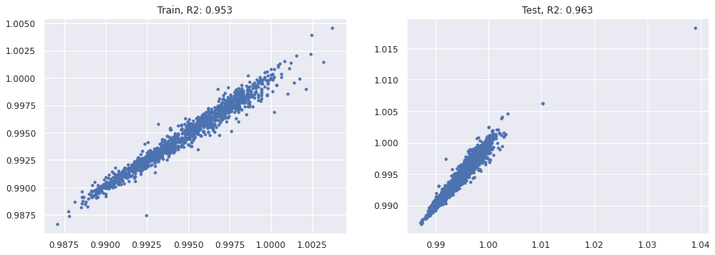

<a href="https://colab.research.google.com/github/wesleybeckner/data_science_foundations/blob/main/notebooks/solutions/SOLN_L3_Feature_Engineering.ipynb" target="_parent"></a>

# Data Science Foundations, Lab 3: Practice with Feature Engineering and Pipelines

**Instructor**: Wesley Beckner

**Contact**: wesleybeckner@gmail.com

---

<br>

In this lab we will continue to practice creation of pipelines and feature engineering. We will use the wine dataset.

<br>

---


```python
import pandas as pd
import numpy as np
import matplotlib.pyplot as plt
import plotly.express as px
import seaborn as sns; sns.set()

from sklearn.preprocessing import OneHotEncoder, StandardScaler
from sklearn.impute import SimpleImputer
from sklearn.metrics import mean_squared_error, r2_score, classification_report, confusion_matrix
from sklearn.linear_model import LogisticRegression, LinearRegression
from sklearn.model_selection import train_test_split
from statsmodels.stats.outliers_influence import variance_inflation_factor

wine = pd.read_csv("https://raw.githubusercontent.com/wesleybeckner/"\
      "ds_for_engineers/main/data/wine_quality/winequalityN.csv")
```

## On Wine Density

### L1 Q1: Feature Derivation

1. Fill in any missing data in your dataset using imputation and use this new data for Q2-Q3
2. One-Hot encode categorical variables in the wine dataset


```python
# Code Cell for L1 Q1
display(wine.head())
print(wine.shape)
str_cols = ['type']

enc = OneHotEncoder()
imp = SimpleImputer()

enc.fit_transform(wine[str_cols])
X_cat = enc.transform(wine[str_cols]).toarray()

X = wine.copy()
X.pop('type')
y = X.pop('density')
X = imp.fit_transform(X)

X = np.hstack([X_cat, X])
print(y.shape)
print(X.shape)
```


<div>
<style scoped>
    .dataframe tbody tr th:only-of-type {
        vertical-align: middle;
    }

    .dataframe tbody tr th {
        vertical-align: top;
    }

    .dataframe thead th {
        text-align: right;
    }
</style>
<table border="1" class="dataframe">
  <thead>
    <tr style="text-align: right;">
      <th></th>
      <th>type</th>
      <th>fixed acidity</th>
      <th>volatile acidity</th>
      <th>citric acid</th>
      <th>residual sugar</th>
      <th>chlorides</th>
      <th>free sulfur dioxide</th>
      <th>total sulfur dioxide</th>
      <th>density</th>
      <th>pH</th>
      <th>sulphates</th>
      <th>alcohol</th>
      <th>quality</th>
    </tr>
  </thead>
  <tbody>
    <tr>
      <th>0</th>
      <td>white</td>
      <td>7.0</td>
      <td>0.27</td>
      <td>0.36</td>
      <td>20.7</td>
      <td>0.045</td>
      <td>45.0</td>
      <td>170.0</td>
      <td>1.0010</td>
      <td>3.00</td>
      <td>0.45</td>
      <td>8.8</td>
      <td>6</td>
    </tr>
    <tr>
      <th>1</th>
      <td>white</td>
      <td>6.3</td>
      <td>0.30</td>
      <td>0.34</td>
      <td>1.6</td>
      <td>0.049</td>
      <td>14.0</td>
      <td>132.0</td>
      <td>0.9940</td>
      <td>3.30</td>
      <td>0.49</td>
      <td>9.5</td>
      <td>6</td>
    </tr>
    <tr>
      <th>2</th>
      <td>white</td>
      <td>8.1</td>
      <td>0.28</td>
      <td>0.40</td>
      <td>6.9</td>
      <td>0.050</td>
      <td>30.0</td>
      <td>97.0</td>
      <td>0.9951</td>
      <td>3.26</td>
      <td>0.44</td>
      <td>10.1</td>
      <td>6</td>
    </tr>
    <tr>
      <th>3</th>
      <td>white</td>
      <td>7.2</td>
      <td>0.23</td>
      <td>0.32</td>
      <td>8.5</td>
      <td>0.058</td>
      <td>47.0</td>
      <td>186.0</td>
      <td>0.9956</td>
      <td>3.19</td>
      <td>0.40</td>
      <td>9.9</td>
      <td>6</td>
    </tr>
    <tr>
      <th>4</th>
      <td>white</td>
      <td>7.2</td>
      <td>0.23</td>
      <td>0.32</td>
      <td>8.5</td>
      <td>0.058</td>
      <td>47.0</td>
      <td>186.0</td>
      <td>0.9956</td>
      <td>3.19</td>
      <td>0.40</td>
      <td>9.9</td>
      <td>6</td>
    </tr>
  </tbody>
</table>
</div>


    (6497, 13)
    (6497,)
    (6497, 13)


### L1 Q2: Feature Transformation

Use `StandardScaler` on the input data and evaluate how this affects VIF, kurtosis, and skew

You should ignore the one-hot encoded column(s) for this section


```python
# Non-one hot encoded columns
cols = list(wine.columns)
cols.remove('density')
cols.remove('type')
```


```python
# Code Cell for L1 Q2
kurt1 = pd.DataFrame(X[:,2:], columns=cols).kurt()
skew1 = pd.DataFrame(X[:,2:], columns=cols).skew()
vif = pd.DataFrame()
vif["VIF Factor"] = [variance_inflation_factor(X[:,2:], i) for i in 
                     range(X[:,2:].shape[1])]
vif.index = cols
vif["kurtosis"] = kurt1
vif["skew"] = skew1
vif
```


<div>
<style scoped>
    .dataframe tbody tr th:only-of-type {
        vertical-align: middle;
    }

    .dataframe tbody tr th {
        vertical-align: top;
    }

    .dataframe thead th {
        text-align: right;
    }
</style>
<table border="1" class="dataframe">
  <thead>
    <tr style="text-align: right;">
      <th></th>
      <th>VIF Factor</th>
      <th>kurtosis</th>
      <th>skew</th>
    </tr>
  </thead>
  <tbody>
    <tr>
      <th>fixed acidity</th>
      <td>41.790949</td>
      <td>5.070143</td>
      <td>1.724131</td>
    </tr>
    <tr>
      <th>volatile acidity</th>
      <td>9.482732</td>
      <td>2.834263</td>
      <td>1.496433</td>
    </tr>
    <tr>
      <th>citric acid</th>
      <td>9.344218</td>
      <td>2.404077</td>
      <td>0.473142</td>
    </tr>
    <tr>
      <th>residual sugar</th>
      <td>3.336944</td>
      <td>4.360399</td>
      <td>1.435221</td>
    </tr>
    <tr>
      <th>chlorides</th>
      <td>5.398369</td>
      <td>50.911457</td>
      <td>5.400680</td>
    </tr>
    <tr>
      <th>free sulfur dioxide</th>
      <td>8.529778</td>
      <td>7.906238</td>
      <td>1.220066</td>
    </tr>
    <tr>
      <th>total sulfur dioxide</th>
      <td>13.448130</td>
      <td>-0.371664</td>
      <td>-0.001177</td>
    </tr>
    <tr>
      <th>pH</th>
      <td>149.003349</td>
      <td>0.374743</td>
      <td>0.387234</td>
    </tr>
    <tr>
      <th>sulphates</th>
      <td>18.402953</td>
      <td>8.667071</td>
      <td>1.799021</td>
    </tr>
    <tr>
      <th>alcohol</th>
      <td>114.836088</td>
      <td>-0.531687</td>
      <td>0.565718</td>
    </tr>
    <tr>
      <th>quality</th>
      <td>63.455488</td>
      <td>0.232322</td>
      <td>0.189623</td>
    </tr>
  </tbody>
</table>
</div>


```python
scaler = StandardScaler()
X[:,2:] = scaler.fit_transform(X[:,2:])

kurt1 = pd.DataFrame(X[:,2:], columns=cols).kurt()
skew1 = pd.DataFrame(X[:,2:], columns=cols).skew()
vif = pd.DataFrame()
vif["VIF Factor"] = [variance_inflation_factor(X[:,2:], i) for i in 
                     range(X[:,2:].shape[1])]
vif.index = cols
vif["kurtosis"] = kurt1
vif["skew"] = skew1
vif
```


<div>
<style scoped>
    .dataframe tbody tr th:only-of-type {
        vertical-align: middle;
    }

    .dataframe tbody tr th {
        vertical-align: top;
    }

    .dataframe thead th {
        text-align: right;
    }
</style>
<table border="1" class="dataframe">
  <thead>
    <tr style="text-align: right;">
      <th></th>
      <th>VIF Factor</th>
      <th>kurtosis</th>
      <th>skew</th>
    </tr>
  </thead>
  <tbody>
    <tr>
      <th>fixed acidity</th>
      <td>1.781336</td>
      <td>5.070143</td>
      <td>1.724131</td>
    </tr>
    <tr>
      <th>volatile acidity</th>
      <td>1.808525</td>
      <td>2.834263</td>
      <td>1.496433</td>
    </tr>
    <tr>
      <th>citric acid</th>
      <td>1.606484</td>
      <td>2.404077</td>
      <td>0.473142</td>
    </tr>
    <tr>
      <th>residual sugar</th>
      <td>1.533403</td>
      <td>4.360399</td>
      <td>1.435221</td>
    </tr>
    <tr>
      <th>chlorides</th>
      <td>1.564413</td>
      <td>50.911457</td>
      <td>5.400680</td>
    </tr>
    <tr>
      <th>free sulfur dioxide</th>
      <td>2.156598</td>
      <td>7.906238</td>
      <td>1.220066</td>
    </tr>
    <tr>
      <th>total sulfur dioxide</th>
      <td>2.872586</td>
      <td>-0.371664</td>
      <td>-0.001177</td>
    </tr>
    <tr>
      <th>pH</th>
      <td>1.413100</td>
      <td>0.374743</td>
      <td>0.387234</td>
    </tr>
    <tr>
      <th>sulphates</th>
      <td>1.364157</td>
      <td>8.667071</td>
      <td>1.799021</td>
    </tr>
    <tr>
      <th>alcohol</th>
      <td>1.696986</td>
      <td>-0.531687</td>
      <td>0.565718</td>
    </tr>
    <tr>
      <th>quality</th>
      <td>1.408210</td>
      <td>0.232322</td>
      <td>0.189623</td>
    </tr>
  </tbody>
</table>
</div>


### L1 Q3: Modeling

Create a Pipeline using one of the scaling methods in sklearn and linear or logistic regression 

If you are using logistic regression:

* **_dependent variable:_** wine quality

If you are using linear regression:

* **_dependent variable:_** wine density


```python
# Code Cell for L1 Q3
model = LinearRegression()
X_train, X_test, y_train, y_test = train_test_split(X, y, train_size=0.8, random_state=42)

model.fit(X_train, y_train)
y_pred = model.predict(X_test)
```


```python
fig, (ax, ax_) = plt.subplots(1,2,figsize=(15,5))
ax.plot(y_test, model.predict(X_test), ls='', marker='.')
ax_.plot(y_train, model.predict(X_train), ls='', marker='.')
ax.set_title("Train, R2: {:.3f}".format(r2_score(y_train, model.predict(X_train))))
ax_.set_title("Test, R2: {:.3f}".format(r2_score(y_test, model.predict(X_test))))
```


    Text(0.5, 1.0, 'Test, R2: 0.963')


    

    


## On Wine Quality

### L1 Q1: Feature Derivation

1. Fill in any missing data in your dataset using imputation and use this new data for Q2-Q3
2. One-Hot encode categorical variables in the wine dataset


```python
# Code Cell for L1 Q1
display(wine.head())
print(wine.shape)
str_cols = ['type']

enc = OneHotEncoder()
imp = SimpleImputer()

enc.fit_transform(wine[str_cols])
X_cat = enc.transform(wine[str_cols]).toarray()

X = wine.copy()
X.pop('type')
y = X.pop('quality')
X = imp.fit_transform(X)

X = np.hstack([X_cat, X])
print(y.shape)
print(X.shape)
```


<div>
<style scoped>
    .dataframe tbody tr th:only-of-type {
        vertical-align: middle;
    }

    .dataframe tbody tr th {
        vertical-align: top;
    }

    .dataframe thead th {
        text-align: right;
    }
</style>
<table border="1" class="dataframe">
  <thead>
    <tr style="text-align: right;">
      <th></th>
      <th>type</th>
      <th>fixed acidity</th>
      <th>volatile acidity</th>
      <th>citric acid</th>
      <th>residual sugar</th>
      <th>chlorides</th>
      <th>free sulfur dioxide</th>
      <th>total sulfur dioxide</th>
      <th>density</th>
      <th>pH</th>
      <th>sulphates</th>
      <th>alcohol</th>
      <th>quality</th>
    </tr>
  </thead>
  <tbody>
    <tr>
      <th>0</th>
      <td>white</td>
      <td>7.0</td>
      <td>0.27</td>
      <td>0.36</td>
      <td>20.7</td>
      <td>0.045</td>
      <td>45.0</td>
      <td>170.0</td>
      <td>1.0010</td>
      <td>3.00</td>
      <td>0.45</td>
      <td>8.8</td>
      <td>6</td>
    </tr>
    <tr>
      <th>1</th>
      <td>white</td>
      <td>6.3</td>
      <td>0.30</td>
      <td>0.34</td>
      <td>1.6</td>
      <td>0.049</td>
      <td>14.0</td>
      <td>132.0</td>
      <td>0.9940</td>
      <td>3.30</td>
      <td>0.49</td>
      <td>9.5</td>
      <td>6</td>
    </tr>
    <tr>
      <th>2</th>
      <td>white</td>
      <td>8.1</td>
      <td>0.28</td>
      <td>0.40</td>
      <td>6.9</td>
      <td>0.050</td>
      <td>30.0</td>
      <td>97.0</td>
      <td>0.9951</td>
      <td>3.26</td>
      <td>0.44</td>
      <td>10.1</td>
      <td>6</td>
    </tr>
    <tr>
      <th>3</th>
      <td>white</td>
      <td>7.2</td>
      <td>0.23</td>
      <td>0.32</td>
      <td>8.5</td>
      <td>0.058</td>
      <td>47.0</td>
      <td>186.0</td>
      <td>0.9956</td>
      <td>3.19</td>
      <td>0.40</td>
      <td>9.9</td>
      <td>6</td>
    </tr>
    <tr>
      <th>4</th>
      <td>white</td>
      <td>7.2</td>
      <td>0.23</td>
      <td>0.32</td>
      <td>8.5</td>
      <td>0.058</td>
      <td>47.0</td>
      <td>186.0</td>
      <td>0.9956</td>
      <td>3.19</td>
      <td>0.40</td>
      <td>9.9</td>
      <td>6</td>
    </tr>
  </tbody>
</table>
</div>


    (6497, 13)
    (6497,)
    (6497, 13)


### L1 Q2: Feature Transformation

Use `StandardScaler` on the input data and evaluate how this affects VIF, kurtosis, and skew

You should ignore the one-hot encoded column(s) for this section


```python
scaler = StandardScaler()
X[:,2:] = scaler.fit_transform(X[:,2:])
```

### L1 Q3: Modeling

Create a Pipeline using one of the scaling methods in sklearn and linear or logistic regression 

If you are using logistic regression:

* **_dependent variable:_** wine quality

If you are using linear regression:

* **_dependent variable:_** wine density


```python
# Code Cell for L1 Q3
model = LogisticRegression(max_iter=1e4)
X_train, X_test, y_train, y_test = train_test_split(X, y, train_size=0.8, random_state=42)

model.fit(X_train, y_train)
y_pred = model.predict(X_test)
```


```python
print(classification_report(y_test, y_pred, zero_division=0))
```

                  precision    recall  f1-score   support
    
               3       0.00      0.00      0.00         2
               4       0.60      0.07      0.12        46
               5       0.58      0.61      0.59       420
               6       0.52      0.68      0.59       579
               7       0.44      0.19      0.26       221
               8       0.00      0.00      0.00        32
    
        accuracy                           0.54      1300
       macro avg       0.36      0.26      0.26      1300
    weighted avg       0.51      0.54      0.50      1300
    


```python
sns.heatmap(confusion_matrix(y_test,y_pred), annot=True)
```


    <AxesSubplot:>


    

    

