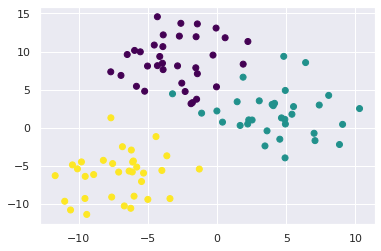
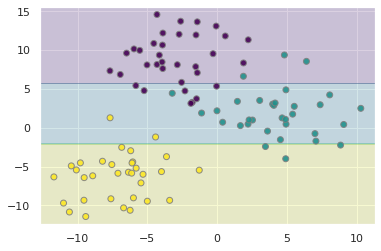
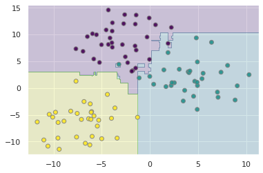
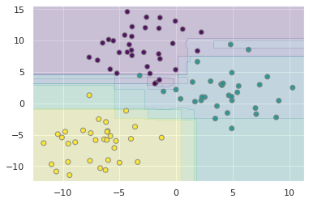
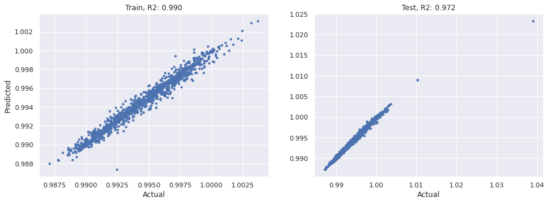
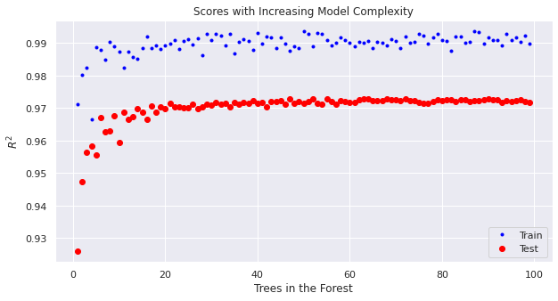

<a href="https://colab.research.google.com/github/wesleybeckner/data_science_foundations/blob/main/notebooks/solutions/SOLN_S6_Bagging.ipynb" target="_parent"></a>

# Data Science Foundations <br> Session 6: Bagging <br> _Decision Trees and Random Forests_

**Instructor**: Wesley Beckner

**Contact**: wesleybeckner@gmail.com

---

<br>

In this session, we're going back to the topic of supervised learning models. These models however, belong to a special class of methods called bagging, or bootstrap aggregation. 

Bagging is an ensemble learning method. In this method, many weak classifiers cast their votes in a general election for the final prediction. 

The weak learners that random forests are made of, are called decision trees. 
<p align="center">
</img>
</p>

<br>

---

<a name='top'></a>

<a name='x.0'></a>

## 6.0 Preparing Environment and Importing Data

[back to top](#top)

<a name='x.0.1'></a>

### 6.0.1 Import Packages

[back to top](#top)


```python
import pandas as pd
import numpy as np
import datetime
import matplotlib.pyplot as plt
import plotly.express as px
import random
import scipy.stats
from sklearn.preprocessing import OneHotEncoder, StandardScaler
from sklearn.impute import SimpleImputer
from statsmodels.stats.outliers_influence import variance_inflation_factor
from sklearn.ensemble import RandomForestClassifier
import seaborn as sns; sns.set()
import graphviz 
from sklearn.metrics import accuracy_score
from ipywidgets import interact, interactive, widgets
from sklearn.metrics import mean_squared_error, r2_score
from sklearn.model_selection import train_test_split
from sklearn import metrics
```

<a name='x.0.2'></a>

### 6.0.2 Load Dataset

[back to top](#top)


```python
margin = pd.read_csv('https://raw.githubusercontent.com/wesleybeckner/'\
                 'ds_for_engineers/main/data/truffle_margin/truffle_margin_customer.csv')
print(margin.shape, end='\n\n')
display(margin.head())
```

    (1668, 9)
    


<div>
<style scoped>
    .dataframe tbody tr th:only-of-type {
        vertical-align: middle;
    }

    .dataframe tbody tr th {
        vertical-align: top;
    }

    .dataframe thead th {
        text-align: right;
    }
</style>
<table border="1" class="dataframe">
  <thead>
    <tr style="text-align: right;">
      <th></th>
      <th>Base Cake</th>
      <th>Truffle Type</th>
      <th>Primary Flavor</th>
      <th>Secondary Flavor</th>
      <th>Color Group</th>
      <th>Customer</th>
      <th>Date</th>
      <th>KG</th>
      <th>EBITDA/KG</th>
    </tr>
  </thead>
  <tbody>
    <tr>
      <th>0</th>
      <td>Butter</td>
      <td>Candy Outer</td>
      <td>Butter Pecan</td>
      <td>Toffee</td>
      <td>Taupe</td>
      <td>Slugworth</td>
      <td>1/2020</td>
      <td>53770.342593</td>
      <td>0.500424</td>
    </tr>
    <tr>
      <th>1</th>
      <td>Butter</td>
      <td>Candy Outer</td>
      <td>Ginger Lime</td>
      <td>Banana</td>
      <td>Amethyst</td>
      <td>Slugworth</td>
      <td>1/2020</td>
      <td>466477.578125</td>
      <td>0.220395</td>
    </tr>
    <tr>
      <th>2</th>
      <td>Butter</td>
      <td>Candy Outer</td>
      <td>Ginger Lime</td>
      <td>Banana</td>
      <td>Burgundy</td>
      <td>Perk-a-Cola</td>
      <td>1/2020</td>
      <td>80801.728070</td>
      <td>0.171014</td>
    </tr>
    <tr>
      <th>3</th>
      <td>Butter</td>
      <td>Candy Outer</td>
      <td>Ginger Lime</td>
      <td>Banana</td>
      <td>White</td>
      <td>Fickelgruber</td>
      <td>1/2020</td>
      <td>18046.111111</td>
      <td>0.233025</td>
    </tr>
    <tr>
      <th>4</th>
      <td>Butter</td>
      <td>Candy Outer</td>
      <td>Ginger Lime</td>
      <td>Rum</td>
      <td>Amethyst</td>
      <td>Fickelgruber</td>
      <td>1/2020</td>
      <td>19147.454268</td>
      <td>0.480689</td>
    </tr>
  </tbody>
</table>
</div>


We're going to recreate the same operations we employed in Session 4, Feature Engineering:


```python
# identify categorical columns
cat_cols = margin.columns[:7]

# create the encoder object
enc = OneHotEncoder()

# grab the columns we want to convert from strings
X_cat = margin[cat_cols]

# fit our encoder to this data
enc.fit(X_cat)
onehotlabels = enc.transform(X_cat).toarray()
X_num = margin[['KG']]
X_truf = np.concatenate((onehotlabels, X_num.values),axis=1)

# grab our y data
y_truf = margin['EBITDA/KG'].values
```

Lastly, to create a classification task, we're going to identify high, med, and low value products:


```python
print('bad less than: {:.2f}'.format(margin[margin.columns[-1]].quantile(.25)), end='\n\n')
print('low less than: {:.2f}'.format(margin[margin.columns[-1]].quantile(.5)), end='\n\n')
print('med less than: {:.2f}'.format(margin[margin.columns[-1]].quantile(.75)), end='\n\n')
pd.DataFrame(margin[margin.columns[-2]]).boxplot(showfliers=False)
```

    bad less than: 0.12
    
    low less than: 0.22
    
    med less than: 0.35
    


    <AxesSubplot:>


    

    


```python
margin['profitability'] = margin[margin.columns[-1]].apply(
    lambda x: 'bad' if x <= margin[margin.columns[-1]].quantile(.25) else
              'low' if x <= margin[margin.columns[-1]].quantile(.50) else
              'med' if x <= margin[margin.columns[-1]].quantile(.75) else 'high')
```


```python
margin['profitability'].hist()
```


    <AxesSubplot:>


    

    


```python
class_profit = {'bad': 0, 'low': 1, 'med': 2, 'high': 3}
y_truf_class = margin['profitability'].map(class_profit).values
margin['profitability_encoding'] = y_truf_class
margin.head()
```


<div>
<style scoped>
    .dataframe tbody tr th:only-of-type {
        vertical-align: middle;
    }

    .dataframe tbody tr th {
        vertical-align: top;
    }

    .dataframe thead th {
        text-align: right;
    }
</style>
<table border="1" class="dataframe">
  <thead>
    <tr style="text-align: right;">
      <th></th>
      <th>Base Cake</th>
      <th>Truffle Type</th>
      <th>Primary Flavor</th>
      <th>Secondary Flavor</th>
      <th>Color Group</th>
      <th>Customer</th>
      <th>Date</th>
      <th>KG</th>
      <th>EBITDA/KG</th>
      <th>profitability</th>
      <th>profitability_encoding</th>
    </tr>
  </thead>
  <tbody>
    <tr>
      <th>0</th>
      <td>Butter</td>
      <td>Candy Outer</td>
      <td>Butter Pecan</td>
      <td>Toffee</td>
      <td>Taupe</td>
      <td>Slugworth</td>
      <td>1/2020</td>
      <td>53770.342593</td>
      <td>0.500424</td>
      <td>high</td>
      <td>3</td>
    </tr>
    <tr>
      <th>1</th>
      <td>Butter</td>
      <td>Candy Outer</td>
      <td>Ginger Lime</td>
      <td>Banana</td>
      <td>Amethyst</td>
      <td>Slugworth</td>
      <td>1/2020</td>
      <td>466477.578125</td>
      <td>0.220395</td>
      <td>med</td>
      <td>2</td>
    </tr>
    <tr>
      <th>2</th>
      <td>Butter</td>
      <td>Candy Outer</td>
      <td>Ginger Lime</td>
      <td>Banana</td>
      <td>Burgundy</td>
      <td>Perk-a-Cola</td>
      <td>1/2020</td>
      <td>80801.728070</td>
      <td>0.171014</td>
      <td>low</td>
      <td>1</td>
    </tr>
    <tr>
      <th>3</th>
      <td>Butter</td>
      <td>Candy Outer</td>
      <td>Ginger Lime</td>
      <td>Banana</td>
      <td>White</td>
      <td>Fickelgruber</td>
      <td>1/2020</td>
      <td>18046.111111</td>
      <td>0.233025</td>
      <td>med</td>
      <td>2</td>
    </tr>
    <tr>
      <th>4</th>
      <td>Butter</td>
      <td>Candy Outer</td>
      <td>Ginger Lime</td>
      <td>Rum</td>
      <td>Amethyst</td>
      <td>Fickelgruber</td>
      <td>1/2020</td>
      <td>19147.454268</td>
      <td>0.480689</td>
      <td>high</td>
      <td>3</td>
    </tr>
  </tbody>
</table>
</div>


<a name='x.1'></a>

## 6.1 Decision Trees

[back to top](#top)

In essence, a decision tree is a series of binary questions. 

</img>

Let's begin this discussion by talking about how we make decision trees in sklearn.

<a name='x.1.1'></a>

### 6.1.1 Creating a Decision Tree

[back to top](#top)


```python
from sklearn import tree
X = [[0, 0], [1, 1]]
y = [0, 1]
clf = tree.DecisionTreeClassifier()
clf = clf.fit(X, y)
```

After fitting the model we can use the predict method to show the output for a sample


```python
clf.predict([[2., 2.]])
```


    array([1])


Similar to what we saw with GMMs, we also have access to the probabilities of the outcomes:


```python
clf.predict_proba([[2., 2.]])
```


    array([[0., 1.]])


Let's now go on to using visual strategies to interpreting trees.

<a name='x.1.2'></a>

### 6.1.2 Interpreting a Decision Tree

[back to top](#top)

Throughout today, we will discuss many ways to view both a single tree and a random forest of trees.

<a name='x.1.2.1'></a>

#### 6.1.2.1 Node & Branch Diagram

[back to top](#top)

We can visualize the decision tree:


```python
tree.plot_tree(clf)
```


    [Text(0.5, 0.75, 'X[0] <= 0.5\ngini = 0.5\nsamples = 2\nvalue = [1, 1]'),
     Text(0.25, 0.25, 'gini = 0.0\nsamples = 1\nvalue = [1, 0]'),
     Text(0.75, 0.25, 'gini = 0.0\nsamples = 1\nvalue = [0, 1]')]


    

    


or, more prettily:


```python
import graphviz 
dot_data = tree.export_graphviz(clf, out_file=None) 
graph = graphviz.Source(dot_data) 
graph
```


    

    


The gini label, also known as **Gini impurity**, is a measure of how often a sample passing through the node would be incorrectly labeled if it was randomly assigned a label based on the proportion of all labels passing through the node. So it is a measure of the progress of our tree.

Let's take a more complex example


```python
from sklearn.datasets import make_classification as gen
X, y = gen(random_state=42)
```

Let's inspect our generated data:


```python
print(X.shape)
print(y.shape)
y[:5] # a binary classification
```

    (100, 20)
    (100,)


    array([0, 0, 1, 1, 0])


And now let's train our tree:


```python
clf = tree.DecisionTreeClassifier()
clf = clf.fit(X, y)
```

How do we interpret this graph?


```python
dot_data = tree.export_graphviz(clf, out_file=None) 
graph = graphviz.Source(dot_data) 
graph
```


    

    


> Can we confirm the observations in the tree by manually inspecting X and y?


```python
y[X[:,10] < .203]
```


    array([0, 0, 1, 0, 0, 0, 0, 0, 0, 0, 0, 0, 0, 0, 0, 0, 0, 0, 0, 0, 0, 0,
           0, 0, 0, 0, 0, 0, 0, 0, 0, 0, 0, 1, 0, 0, 0, 0, 0, 0, 0, 0, 0, 0,
           0, 1, 0, 0, 0, 0, 0, 0])


We can confirm the gini score of the top left node by hand...


```python
scr = []
for j in range(1000):
  y_pred = [0 if random.random() > ( 3/52 ) else 1 for i in range(52)]
  y_true = [0 if random.random() > ( 3/52 ) else 1 for i in range(52)]
  scr.append(mean_squared_error(y_pred,y_true))
np.mean(scr)
```


    0.10817307692307693


Let's take a look at this with our truffle dataset

> Vary the parameter `max_depth` what do you notice? Does the term _greedy_ mean anything to you? Do nodes higher in the tree change based on decisions lower in the tree?


```python
clf = tree.DecisionTreeClassifier(max_depth=1)
clf.fit(X_truf, y_truf_class)
```


    DecisionTreeClassifier(max_depth=1)


And now lets look at the graph:


```python
dot_data = tree.export_graphviz(clf, out_file=None) 
graph = graphviz.Source(dot_data) 
graph
```


    

    


What is `X[4]`???


```python
# It's those tasty sponge cake truffles!
enc.get_feature_names_out()[4]
```


    'Base Cake_Sponge'


This is one great aspect of decision trees, their *interpretability*.

We will perform this analysis again, for now, let's proceed with simpler datasets while exploring the features of decision trees.

<a name='x.1.2.2'></a>

#### 6.1.2.1 Decision Boundaries

[back to top](#top)

Let's make some random blobs


```python
from sklearn.datasets import make_blobs as gen
X, y = gen(random_state=42)
```


```python
plt.scatter(X[:,0], X[:,1], c=y, cmap='viridis')
```


    <matplotlib.collections.PathCollection at 0x7f1fefd8b130>


    

    


Let's call up our Classifier again, this time setting the `max_depth` to two


```python
clf = tree.DecisionTreeClassifier(max_depth=2, random_state=42)
clf = clf.fit(X, y)
```


```python
# Parameters
plot_step = 0.02

x_min, x_max = X[:, 0].min() - 1, X[:, 0].max() + 1
y_min, y_max = X[:, 1].min() - 1, X[:, 1].max() + 1
xx, yy = np.meshgrid(np.arange(x_min, x_max, plot_step),
                      np.arange(y_min, y_max, plot_step))
plt.tight_layout(h_pad=0.5, w_pad=0.5, pad=2.5)

Z = clf.predict(np.c_[xx.ravel(), yy.ravel()])
Z = Z.reshape(xx.shape)
cs = plt.contourf(xx, yy, Z, cmap='viridis', alpha=0.2)

plt.scatter(X[:,0], X[:,1], c=y, cmap='viridis', edgecolor='grey', alpha=0.9)
```


    <matplotlib.collections.PathCollection at 0x7f1feef32280>


    

    


```python
dot_data = tree.export_graphviz(clf, out_file=None) 
graph = graphviz.Source(dot_data) 
graph
```


    

    


We can see from the output of this graph, that the tree attempts to create the class boundaries as far from the cluster centers as possible. What happens when these clusters overlap?


```python
X, y = gen(random_state=42, cluster_std=3)
plt.scatter(X[:,0], X[:,1], c=y, cmap='viridis')
```


    <matplotlib.collections.PathCollection at 0x7f1feeea0e80>


    

    


Let's go ahead and write our plot into a function


```python
def plot_tree(X, clf):
  plot_step = 0.02
  x_min, x_max = X[:, 0].min() - 1, X[:, 0].max() + 1
  y_min, y_max = X[:, 1].min() - 1, X[:, 1].max() + 1
  xx, yy = np.meshgrid(np.arange(x_min, x_max, plot_step),
                        np.arange(y_min, y_max, plot_step))
  plt.tight_layout(h_pad=0.5, w_pad=0.5, pad=2.5)

  Z = clf.predict(np.c_[xx.ravel(), yy.ravel()])
  Z = Z.reshape(xx.shape)
  cs = plt.contourf(xx, yy, Z, cmap='viridis', alpha=0.2)

  plt.scatter(X[:,0], X[:,1], c=y, cmap='viridis', edgecolor='grey', alpha=0.9)
  return plt
```

We see that the boundaries mislabel some points


```python
fig = plot_tree(X, clf)
```


    

    


<a name='x.1.3'></a>

### 6.1.3 Overfitting a Decision Tree

[back to top](#top)

Let's increase the max_depth


```python
clf = tree.DecisionTreeClassifier(max_depth=5, random_state=42)
clf = clf.fit(X, y)
plot_tree(X, clf)
```


    <module 'matplotlib.pyplot' from '/home/wbeckner/anaconda3/envs/py39/lib/python3.9/site-packages/matplotlib/pyplot.py'>


    

    


What we notice is that while the model accurately predicts the training data, we see some spurious labels, noteably the trailing purple bar that extends into the otherwise green region of the data. 

This is a well known fact about decision trees, that they tend to overfit their training data. In fact, this is a major motivation for why decision trees, a weak classifier, are conveniently packaged into ensembles.

We combine the idea of bootstrapping, with decision trees, to come up with an overall better classifier.

#### 🏋️ Exercise 1: Minimize Overfitting

Repeat 6.1.3 with different max_depth settings, also read the docstring and play with any other hyperparameters available to you. What settings do you feel minimize overfitting? The documentation for [DecisionTreeClassifier](https://scikit-learn.org/stable/modules/generated/sklearn.tree.DecisionTreeClassifier.html) may be helpful


```python
# Code Cell for 1

################################################################################
##### CHANGE THE HYPERPARAMETERS IN THE CALL TO DECISIONTREECLASSIFIER #########
################################################################################

clf = tree.DecisionTreeClassifier(random_state=42,
                                    max_depth=None,
                                    min_samples_split=3,
                                    min_samples_leaf=1,
                                    min_weight_fraction_leaf=0.0,
                                    max_features=None,
                                    max_leaf_nodes=None,
                                    min_impurity_decrease=0.1,
                                    class_weight=None,
                                    ccp_alpha=0.0,)
clf = clf.fit(X, y)
plot_tree(X, clf)
```


    <module 'matplotlib.pyplot' from '/home/wbeckner/anaconda3/envs/py39/lib/python3.9/site-packages/matplotlib/pyplot.py'>


    

    


<a name='x.2'></a>

## 6.2 Random Forests and Bagging

[back to top](#top)

<a name='x.2.1'></a>

### 6.2.1 What is Bagging?

[back to top](#top)

**_Bagging_**, or Bootstrap AGGregation is the process of creating subsets of your data and training separate models on them, and using the aggregate votes of the models to make a final prediction.

**_Bootstrapping_** is a topic in and of itself that we will just touch on here. Without going through the statistical rigor of proof, bootstrapping, or sampling from your observations with replacement, simulates having drawn additional data from the true population. We use this method to create many new datasets that are then used to *train separate learners* in parallel. This overall approach is called **_Bagging_**.

<p align=center>
</img>
</p>

A **_Random Forest_** is an instance of bagging where the separate learners are decision trees. 

<a name='x.2.2'></a>

### 6.2.2 Random Forests for Classification

[back to top](#top)


```python
from sklearn.tree import DecisionTreeClassifier
from sklearn.ensemble import BaggingClassifier

tree = DecisionTreeClassifier()
bag = BaggingClassifier(tree, n_estimators=10, max_samples=0.8,
                        random_state=1)

bag.fit(X, y)
plot_tree(X, bag)
```


    <module 'matplotlib.pyplot' from '/home/wbeckner/anaconda3/envs/py39/lib/python3.9/site-packages/matplotlib/pyplot.py'>


    

    


In the above, we have bootstrapped by providing each individual tree with 80% of the population data. In practice, Random Forests can achieve even better results by randomizing how the individual classifiers are constructed. In fact there are many unique methods of training individual trees and you can learn more about them [here](https://scikit-learn.org/stable/modules/ensemble.html#forest). This randomness is done automatically in sklearn's `RandomForestClassifier`


```python
from sklearn.ensemble import RandomForestClassifier
clf = RandomForestClassifier(n_estimators=10, random_state=2)
clf = clf.fit(X, y)
```


```python
plot_tree(X, clf)
```


    <module 'matplotlib.pyplot' from '/home/wbeckner/anaconda3/envs/py39/lib/python3.9/site-packages/matplotlib/pyplot.py'>


    

    


<a name='x.2.2.1'></a>

#### 6.2.2.1 Interpreting a Random Forest

[back to top](#top)

Let's revisit our truffle dataset again, this time with random forests


```python
# fit the model
clf = RandomForestClassifier(n_estimators=100,
                             min_samples_leaf=6)
clf = clf.fit(X_truf, y_truf_class)
```

We get a fairly high accuracy when our `min_samples_leaf` is low and an accuracy that leaves room for improvement when `min_samples_leaf` is high. This indicates to us the model may be prown to overfitting if we are not careful:


```python
accuracy_score(clf.predict(X_truf), y_truf_class)
```


    0.6133093525179856


We can grab the original feature names with `get_feature_names_out()`:


```python
feats = enc.get_feature_names_out()
```

The feature importances are stored in `clf.feature_importances_`. These are calculated from the **_Mean Decrease in Impurity_** or MDI also called the **_Gini Importance_**. It is the sum of the number of nodes across all trees that include the feature, weighted by the number of samples passing through the node. 

One downside of estimating feature importance in this way is that it doesn't play well with highly cardinal features _(features with many unique values such as mailing addresses, are highly cardinal features)_


```python
len(feats)
```


    118


```python
# grab feature importances
imp = clf.feature_importances_

# their std
std = np.std([tree.feature_importances_ for tree in clf.estimators_], axis=0)

# create new dataframe
feat = pd.DataFrame([feats, imp, std]).T
feat.columns = ['feature', 'importance', 'std']
feat = feat.sort_values('importance', ascending=False)
feat = feat.reset_index(drop=True)
feat.dropna(inplace=True)
feat.head()
```


<div>
<style scoped>
    .dataframe tbody tr th:only-of-type {
        vertical-align: middle;
    }

    .dataframe tbody tr th {
        vertical-align: top;
    }

    .dataframe thead th {
        text-align: right;
    }
</style>
<table border="1" class="dataframe">
  <thead>
    <tr style="text-align: right;">
      <th></th>
      <th>feature</th>
      <th>importance</th>
      <th>std</th>
    </tr>
  </thead>
  <tbody>
    <tr>
      <th>0</th>
      <td>Base Cake_Sponge</td>
      <td>0.098864</td>
      <td>0.090298</td>
    </tr>
    <tr>
      <th>2</th>
      <td>Base Cake_Chiffon</td>
      <td>0.058403</td>
      <td>0.049159</td>
    </tr>
    <tr>
      <th>3</th>
      <td>Base Cake_Butter</td>
      <td>0.049615</td>
      <td>0.046537</td>
    </tr>
    <tr>
      <th>4</th>
      <td>Base Cake_Pound</td>
      <td>0.047093</td>
      <td>0.043291</td>
    </tr>
    <tr>
      <th>5</th>
      <td>Primary Flavor_Butter Toffee</td>
      <td>0.03565</td>
      <td>0.038741</td>
    </tr>
  </tbody>
</table>
</div>


I'm going to use `plotly` to create this chart:


```python
px.bar(feat[:20], x='feature', y='importance', error_y='std', title='Feature Importance')
```


<div>                            <div id="2b50d292-b065-42c3-9980-738d478ac8b2" class="plotly-graph-div" style="height:525px; width:100%;"></div>            <script type="text/javascript">                require(["plotly"], function(Plotly) {                    window.PLOTLYENV=window.PLOTLYENV || {};                                    if (document.getElementById("2b50d292-b065-42c3-9980-738d478ac8b2")) {                    Plotly.newPlot(                        "2b50d292-b065-42c3-9980-738d478ac8b2",                        [{"alignmentgroup":"True","error_y":{"array":[0.09029809907413336,0.0491594926001353,0.04653692392065348,0.04329103819043059,0.03874140277043045,0.0349780684180197,0.030094493632483902,0.03311853070594179,0.03369534638488077,0.023175605457143568,0.02003645368097637,0.02649675589259294,0.011595438604605596,0.02247515253748258,0.01375825943123077,0.019922394040156593,0.011655486749852109,0.01266580704339592,0.015074673768077048,0.015049527462185765]},"hovertemplate":"feature=%{x}<br>importance=%{y}<extra></extra>","legendgroup":"","marker":{"color":"#636efa","pattern":{"shape":""}},"name":"","offsetgroup":"","orientation":"v","showlegend":false,"textposition":"auto","x":["Base Cake_Sponge","Base Cake_Chiffon","Base Cake_Butter","Base Cake_Pound","Primary Flavor_Butter Toffee","Base Cake_Cheese","Primary Flavor_Doughnut","Secondary Flavor_Egg Nog","Color Group_Olive","Truffle Type_Candy Outer","Color Group_White","Secondary Flavor_Black Cherry","Customer_Zebrabar","Base Cake_Tiramisu","Customer_Slugworth","Truffle Type_Chocolate Outer","Customer_Perk-a-Cola","Customer_Dandy's Candies","Color Group_Opal","Secondary Flavor_Apricot"],"xaxis":"x","y":[0.0988642579163017,0.0584025133239696,0.049615450872702874,0.04709340666985859,0.03565014121102607,0.02844217305880782,0.027599939763576282,0.02585556386092948,0.02204011487187889,0.020269190892063724,0.019095262999859298,0.018956174795772437,0.016652674359145594,0.016599891454384605,0.0163798681859097,0.014287195738793366,0.013875453357030356,0.013555160346052895,0.013433004919153784,0.012081891079920398],"yaxis":"y","type":"bar"}],                        {"template":{"data":{"bar":[{"error_x":{"color":"#2a3f5f"},"error_y":{"color":"#2a3f5f"},"marker":{"line":{"color":"#E5ECF6","width":0.5},"pattern":{"fillmode":"overlay","size":10,"solidity":0.2}},"type":"bar"}],"barpolar":[{"marker":{"line":{"color":"#E5ECF6","width":0.5},"pattern":{"fillmode":"overlay","size":10,"solidity":0.2}},"type":"barpolar"}],"carpet":[{"aaxis":{"endlinecolor":"#2a3f5f","gridcolor":"white","linecolor":"white","minorgridcolor":"white","startlinecolor":"#2a3f5f"},"baxis":{"endlinecolor":"#2a3f5f","gridcolor":"white","linecolor":"white","minorgridcolor":"white","startlinecolor":"#2a3f5f"},"type":"carpet"}],"choropleth":[{"colorbar":{"outlinewidth":0,"ticks":""},"type":"choropleth"}],"contour":[{"colorbar":{"outlinewidth":0,"ticks":""},"colorscale":[[0.0,"#0d0887"],[0.1111111111111111,"#46039f"],[0.2222222222222222,"#7201a8"],[0.3333333333333333,"#9c179e"],[0.4444444444444444,"#bd3786"],[0.5555555555555556,"#d8576b"],[0.6666666666666666,"#ed7953"],[0.7777777777777778,"#fb9f3a"],[0.8888888888888888,"#fdca26"],[1.0,"#f0f921"]],"type":"contour"}],"contourcarpet":[{"colorbar":{"outlinewidth":0,"ticks":""},"type":"contourcarpet"}],"heatmap":[{"colorbar":{"outlinewidth":0,"ticks":""},"colorscale":[[0.0,"#0d0887"],[0.1111111111111111,"#46039f"],[0.2222222222222222,"#7201a8"],[0.3333333333333333,"#9c179e"],[0.4444444444444444,"#bd3786"],[0.5555555555555556,"#d8576b"],[0.6666666666666666,"#ed7953"],[0.7777777777777778,"#fb9f3a"],[0.8888888888888888,"#fdca26"],[1.0,"#f0f921"]],"type":"heatmap"}],"heatmapgl":[{"colorbar":{"outlinewidth":0,"ticks":""},"colorscale":[[0.0,"#0d0887"],[0.1111111111111111,"#46039f"],[0.2222222222222222,"#7201a8"],[0.3333333333333333,"#9c179e"],[0.4444444444444444,"#bd3786"],[0.5555555555555556,"#d8576b"],[0.6666666666666666,"#ed7953"],[0.7777777777777778,"#fb9f3a"],[0.8888888888888888,"#fdca26"],[1.0,"#f0f921"]],"type":"heatmapgl"}],"histogram":[{"marker":{"pattern":{"fillmode":"overlay","size":10,"solidity":0.2}},"type":"histogram"}],"histogram2d":[{"colorbar":{"outlinewidth":0,"ticks":""},"colorscale":[[0.0,"#0d0887"],[0.1111111111111111,"#46039f"],[0.2222222222222222,"#7201a8"],[0.3333333333333333,"#9c179e"],[0.4444444444444444,"#bd3786"],[0.5555555555555556,"#d8576b"],[0.6666666666666666,"#ed7953"],[0.7777777777777778,"#fb9f3a"],[0.8888888888888888,"#fdca26"],[1.0,"#f0f921"]],"type":"histogram2d"}],"histogram2dcontour":[{"colorbar":{"outlinewidth":0,"ticks":""},"colorscale":[[0.0,"#0d0887"],[0.1111111111111111,"#46039f"],[0.2222222222222222,"#7201a8"],[0.3333333333333333,"#9c179e"],[0.4444444444444444,"#bd3786"],[0.5555555555555556,"#d8576b"],[0.6666666666666666,"#ed7953"],[0.7777777777777778,"#fb9f3a"],[0.8888888888888888,"#fdca26"],[1.0,"#f0f921"]],"type":"histogram2dcontour"}],"mesh3d":[{"colorbar":{"outlinewidth":0,"ticks":""},"type":"mesh3d"}],"parcoords":[{"line":{"colorbar":{"outlinewidth":0,"ticks":""}},"type":"parcoords"}],"pie":[{"automargin":true,"type":"pie"}],"scatter":[{"marker":{"colorbar":{"outlinewidth":0,"ticks":""}},"type":"scatter"}],"scatter3d":[{"line":{"colorbar":{"outlinewidth":0,"ticks":""}},"marker":{"colorbar":{"outlinewidth":0,"ticks":""}},"type":"scatter3d"}],"scattercarpet":[{"marker":{"colorbar":{"outlinewidth":0,"ticks":""}},"type":"scattercarpet"}],"scattergeo":[{"marker":{"colorbar":{"outlinewidth":0,"ticks":""}},"type":"scattergeo"}],"scattergl":[{"marker":{"colorbar":{"outlinewidth":0,"ticks":""}},"type":"scattergl"}],"scattermapbox":[{"marker":{"colorbar":{"outlinewidth":0,"ticks":""}},"type":"scattermapbox"}],"scatterpolar":[{"marker":{"colorbar":{"outlinewidth":0,"ticks":""}},"type":"scatterpolar"}],"scatterpolargl":[{"marker":{"colorbar":{"outlinewidth":0,"ticks":""}},"type":"scatterpolargl"}],"scatterternary":[{"marker":{"colorbar":{"outlinewidth":0,"ticks":""}},"type":"scatterternary"}],"surface":[{"colorbar":{"outlinewidth":0,"ticks":""},"colorscale":[[0.0,"#0d0887"],[0.1111111111111111,"#46039f"],[0.2222222222222222,"#7201a8"],[0.3333333333333333,"#9c179e"],[0.4444444444444444,"#bd3786"],[0.5555555555555556,"#d8576b"],[0.6666666666666666,"#ed7953"],[0.7777777777777778,"#fb9f3a"],[0.8888888888888888,"#fdca26"],[1.0,"#f0f921"]],"type":"surface"}],"table":[{"cells":{"fill":{"color":"#EBF0F8"},"line":{"color":"white"}},"header":{"fill":{"color":"#C8D4E3"},"line":{"color":"white"}},"type":"table"}]},"layout":{"annotationdefaults":{"arrowcolor":"#2a3f5f","arrowhead":0,"arrowwidth":1},"autotypenumbers":"strict","coloraxis":{"colorbar":{"outlinewidth":0,"ticks":""}},"colorscale":{"diverging":[[0,"#8e0152"],[0.1,"#c51b7d"],[0.2,"#de77ae"],[0.3,"#f1b6da"],[0.4,"#fde0ef"],[0.5,"#f7f7f7"],[0.6,"#e6f5d0"],[0.7,"#b8e186"],[0.8,"#7fbc41"],[0.9,"#4d9221"],[1,"#276419"]],"sequential":[[0.0,"#0d0887"],[0.1111111111111111,"#46039f"],[0.2222222222222222,"#7201a8"],[0.3333333333333333,"#9c179e"],[0.4444444444444444,"#bd3786"],[0.5555555555555556,"#d8576b"],[0.6666666666666666,"#ed7953"],[0.7777777777777778,"#fb9f3a"],[0.8888888888888888,"#fdca26"],[1.0,"#f0f921"]],"sequentialminus":[[0.0,"#0d0887"],[0.1111111111111111,"#46039f"],[0.2222222222222222,"#7201a8"],[0.3333333333333333,"#9c179e"],[0.4444444444444444,"#bd3786"],[0.5555555555555556,"#d8576b"],[0.6666666666666666,"#ed7953"],[0.7777777777777778,"#fb9f3a"],[0.8888888888888888,"#fdca26"],[1.0,"#f0f921"]]},"colorway":["#636efa","#EF553B","#00cc96","#ab63fa","#FFA15A","#19d3f3","#FF6692","#B6E880","#FF97FF","#FECB52"],"font":{"color":"#2a3f5f"},"geo":{"bgcolor":"white","lakecolor":"white","landcolor":"#E5ECF6","showlakes":true,"showland":true,"subunitcolor":"white"},"hoverlabel":{"align":"left"},"hovermode":"closest","mapbox":{"style":"light"},"paper_bgcolor":"white","plot_bgcolor":"#E5ECF6","polar":{"angularaxis":{"gridcolor":"white","linecolor":"white","ticks":""},"bgcolor":"#E5ECF6","radialaxis":{"gridcolor":"white","linecolor":"white","ticks":""}},"scene":{"xaxis":{"backgroundcolor":"#E5ECF6","gridcolor":"white","gridwidth":2,"linecolor":"white","showbackground":true,"ticks":"","zerolinecolor":"white"},"yaxis":{"backgroundcolor":"#E5ECF6","gridcolor":"white","gridwidth":2,"linecolor":"white","showbackground":true,"ticks":"","zerolinecolor":"white"},"zaxis":{"backgroundcolor":"#E5ECF6","gridcolor":"white","gridwidth":2,"linecolor":"white","showbackground":true,"ticks":"","zerolinecolor":"white"}},"shapedefaults":{"line":{"color":"#2a3f5f"}},"ternary":{"aaxis":{"gridcolor":"white","linecolor":"white","ticks":""},"baxis":{"gridcolor":"white","linecolor":"white","ticks":""},"bgcolor":"#E5ECF6","caxis":{"gridcolor":"white","linecolor":"white","ticks":""}},"title":{"x":0.05},"xaxis":{"automargin":true,"gridcolor":"white","linecolor":"white","ticks":"","title":{"standoff":15},"zerolinecolor":"white","zerolinewidth":2},"yaxis":{"automargin":true,"gridcolor":"white","linecolor":"white","ticks":"","title":{"standoff":15},"zerolinecolor":"white","zerolinewidth":2}}},"xaxis":{"anchor":"y","domain":[0.0,1.0],"title":{"text":"feature"}},"yaxis":{"anchor":"x","domain":[0.0,1.0],"title":{"text":"importance"}},"legend":{"tracegroupgap":0},"title":{"text":"Feature Importance"},"barmode":"relative"},                        {"responsive": true}                    ).then(function(){

var gd = document.getElementById('2b50d292-b065-42c3-9980-738d478ac8b2');
var x = new MutationObserver(function (mutations, observer) {{
        var display = window.getComputedStyle(gd).display;
        if (!display || display === 'none') {{
            console.log([gd, 'removed!']);
            Plotly.purge(gd);
            observer.disconnect();
        }}
}});

// Listen for the removal of the full notebook cells
var notebookContainer = gd.closest('#notebook-container');
if (notebookContainer) {{
    x.observe(notebookContainer, {childList: true});
}}

// Listen for the clearing of the current output cell
var outputEl = gd.closest('.output');
if (outputEl) {{
    x.observe(outputEl, {childList: true});
}}

                        })                };                });            </script>        </div>


#### 🙋‍♀️ Question 1: Feature Importance and Cardinality

How does feature importance change in the above plot when we change the minimum leaf size from 6 to 1?

#### 🙋‍ Question 2: Compare to Moods Median

We can then go and look at the different EBITDAs when selecting for each of these features. What do you notice as the primary difference between these results and those from [Session 2: Inferential Statistics Exercise 1, Part C](https://github.com/wesleybeckner/data_science_foundations/blob/fdf84755a7ed6ed54d3f036a7fc2d9dafa79afd9/notebooks/solutions/SOLN_S2_Inferential_Statistics.ipynb) when we ran Mood's Median test on this same data?


```python
feat.iloc[:5]
```


<div>
<style scoped>
    .dataframe tbody tr th:only-of-type {
        vertical-align: middle;
    }

    .dataframe tbody tr th {
        vertical-align: top;
    }

    .dataframe thead th {
        text-align: right;
    }
</style>
<table border="1" class="dataframe">
  <thead>
    <tr style="text-align: right;">
      <th></th>
      <th>feature</th>
      <th>importance</th>
      <th>std</th>
    </tr>
  </thead>
  <tbody>
    <tr>
      <th>0</th>
      <td>Base Cake_Sponge</td>
      <td>0.098864</td>
      <td>0.090298</td>
    </tr>
    <tr>
      <th>2</th>
      <td>Base Cake_Chiffon</td>
      <td>0.058403</td>
      <td>0.049159</td>
    </tr>
    <tr>
      <th>3</th>
      <td>Base Cake_Butter</td>
      <td>0.049615</td>
      <td>0.046537</td>
    </tr>
    <tr>
      <th>4</th>
      <td>Base Cake_Pound</td>
      <td>0.047093</td>
      <td>0.043291</td>
    </tr>
    <tr>
      <th>5</th>
      <td>Primary Flavor_Butter Toffee</td>
      <td>0.03565</td>
      <td>0.038741</td>
    </tr>
  </tbody>
</table>
</div>


```python
for feature in feat.iloc[:10,0]:
    group = feature.split('_')[0]
    sel = " ".join(feature.split('_')[1:])
    pos = margin.loc[(margin[group] == sel)]['EBITDA/KG'].median()
    neg = margin.loc[~(margin[group] == sel)]['EBITDA/KG'].median()
    print(group + ": " + sel)
    print("\twith:    {:.2f}".format(pos))
    print("\twithout: {:.2f}".format(neg))
```

    Base Cake: Sponge
    	with:    0.70
    	without: 0.20
    Base Cake: Chiffon
    	with:    0.13
    	without: 0.24
    Base Cake: Butter
    	with:    0.14
    	without: 0.26
    Base Cake: Pound
    	with:    0.24
    	without: 0.20
    Primary Flavor: Butter Toffee
    	with:    0.46
    	without: 0.21
    Base Cake: Cheese
    	with:    0.44
    	without: 0.21
    Primary Flavor: Doughnut
    	with:    0.38
    	without: 0.20
    Secondary Flavor: Egg Nog
    	with:    0.23
    	without: 0.21
    Color Group: Olive
    	with:    0.67
    	without: 0.21
    Truffle Type: Candy Outer
    	with:    0.20
    	without: 0.22


<a name='x.2.3'></a>

### 6.2.3 Random Forests for Regression

[back to top](#top)


```python
from sklearn.ensemble import RandomForestRegressor

clf = RandomForestRegressor(n_estimators=10)
```

Because our labels on our blob data were numerical, we can apply and view the estimator in the same way:


```python
clf = clf.fit(X, y)
plot_tree(X, clf)
```


    <module 'matplotlib.pyplot' from '/home/wbeckner/anaconda3/envs/py39/lib/python3.9/site-packages/matplotlib/pyplot.py'>


    

    


I want to revisit a dataset we brought up in Session 2 on feature engineering:


```python
t = np.linspace(0,5,200)
w = 5
h = 4
s = 4 * h / np.pi * (np.sin(w*t) + np.sin(3*w*t)/3 + np.sin(5*w*t)/5)

F = np.fft.fft(s)
freq = np.fft.fftfreq(t.shape[-1])

fig, ax = plt.subplots(1,2,figsize=(10,5))

ax[0].plot(t,s)
ax[0].plot(t,np.sin(w*t), ls='--')
ax[0].plot(t,np.sin(w*t*3)/3, ls='--')
ax[0].plot(t,np.sin(w*t*5)/5, ls='--')
ax[0].set_title('Time Domain')

# tells us about the amplitude of the component at the
# corresponding frequency
magnitude = np.sqrt(F.real**2 + F.imag**2)

ax[1].plot(freq, magnitude)
ax[1].set_xlim(0,.15)
ax[1].set_title('Frequency Domain')
```


    Text(0.5, 1.0, 'Frequency Domain')


    

    


Let's see if a random forest regression model can capture the wave behavior of the time-series data


```python
clf = RandomForestRegressor(n_estimators=10)
clf.fit(t.reshape(-1,1),s)
```


    RandomForestRegressor(n_estimators=10)


```python
t2 = np.linspace(0,10,400)
```


```python
fig, ax = plt.subplots(1,1,figsize=(10,5))

ax.plot(t,s)
ax.plot(t2,clf.predict(t2.reshape(-1,1)))
```


    [<matplotlib.lines.Line2D at 0x7f1fe536df10>]


    

    


Nice! without specifying any perdiodicity, the random forest does a good job of embedding this periodicity in the final output.

### 🏋️ Exercise 2: Practice with Random Forests

With the wine dataset:

* predict: density
* create a learning curve of train/test score vs model complexity for your random forest model(s)

I have provided the _cleaned_ dataset as well as starter code for training the model and making parity plots

Do not change the following 3 cells:


```python
wine = pd.read_csv("https://raw.githubusercontent.com/wesleybeckner/"\
      "ds_for_engineers/main/data/wine_quality/winequalityN.csv")
# infer str cols
str_cols = list(wine.select_dtypes(include='object').columns)

#set target col
target = 'density'

enc = OneHotEncoder()
imp = SimpleImputer()

enc.fit_transform(wine[str_cols])
X_cat = enc.transform(wine[str_cols]).toarray()
X = wine.copy()
[X.pop(i) for i in str_cols]
y = X.pop(target)
X = imp.fit_transform(X)
X = np.hstack([X_cat, X])

cols = [i.split("_")[1] for i in enc.get_feature_names_out()]
cols += list(wine.columns)
cols.remove(target)
[cols.remove(i) for i in str_cols]

scaler = StandardScaler()
X[:,2:] = scaler.fit_transform(X[:,2:])

wine = pd.DataFrame(X, columns=cols)
wine['density'] = y
```


```python
model = RandomForestRegressor(n_estimators=65,
                            criterion='squared_error',
                            max_depth=None,
                            min_samples_split=2,
                            min_samples_leaf=1,
                            min_weight_fraction_leaf=0.0,
                            max_features='auto',
                            max_leaf_nodes=None,
                            min_impurity_decrease=0.0,
                            bootstrap=True,
                            oob_score=False,
                            n_jobs=None,
                            random_state=None,
                            verbose=0,
                            warm_start=False,
                            ccp_alpha=0.0,
                            max_samples=None,)
X_train, X_test, y_train, y_test = train_test_split(X, y, train_size=0.8, random_state=42)

model.fit(X_train, y_train)
y_pred = model.predict(X_test)
```


```python
fig, (ax, ax_) = plt.subplots(1,2,figsize=(15,5))
ax.plot(y_test, model.predict(X_test), ls='', marker='.')
ax_.plot(y_train, model.predict(X_train), ls='', marker='.')
ax.set_title("Train, R2: {:.3f}".format(r2_score(y_train, model.predict(X_train))))
ax.set_ylabel('Predicted')
ax.set_xlabel('Actual')
ax_.set_xlabel('Actual')
ax_.set_title("Test, R2: {:.3f}".format(r2_score(y_test, model.predict(X_test))))
```


    Text(0.5, 1.0, 'Test, R2: 0.972')


    

    


Compare these results with our [linear model](https://github.com/wesleybeckner/data_science_foundations/blob/fdf84755a7ed6ed54d3f036a7fc2d9dafa79afd9/notebooks/solutions/SOLN_E3_Feature_Engineering.ipynb) from Lab 3.

Recall that we can quickly grab the names of the paramters in our sklearn model:


```python
RandomForestRegressor().get_params()
```


    {'bootstrap': True,
     'ccp_alpha': 0.0,
     'criterion': 'squared_error',
     'max_depth': None,
     'max_features': 'auto',
     'max_leaf_nodes': None,
     'max_samples': None,
     'min_impurity_decrease': 0.0,
     'min_samples_leaf': 1,
     'min_samples_split': 2,
     'min_weight_fraction_leaf': 0.0,
     'n_estimators': 100,
     'n_jobs': None,
     'oob_score': False,
     'random_state': None,
     'verbose': 0,
     'warm_start': False}


```python
# Cell for Exercise 2
X_train, X_test, y_train, y_test = train_test_split(X, y, train_size=0.8, random_state=42)
r2 = []
for n_estimators in range(1,100):
    model = RandomForestRegressor(n_estimators=n_estimators)
    model.fit(X_train, y_train)
    y_pred = model.predict(X_test)
    r2.append([r2_score(y_train, model.predict(X_train)),
    r2_score(y_test, model.predict(X_test))])
```


```python
score = np.array(r2)
score1 = score[:,0]
score2 = score[:,1]
fig, ax = plt.subplots(figsize=(10,5))
ax.plot(range(1,100), score1, ls='', marker='.', color='blue', label='Train')
ax.plot(range(1,100), score2, ls='', marker='o', color='red', label='Test')
ax.set_title("Scores with Increasing Model Complexity")
ax.set_xlabel("Trees in the Forest")
ax.set_ylabel("$R^2$")
ax.legend()
```


    <matplotlib.legend.Legend at 0x7f1fe5063f40>


    

    

