<a href="https://colab.research.google.com/github/wesleybeckner/data_science_foundations/blob/main/notebooks/solutions/SOLN_X1_Thinking_Data.ipynb" target="_parent"></a>

# Data Science Foundations <br> Extras 1: Thinking Data

**Instructor**: Wesley Beckner

**Contact**: wesleybeckner@gmail.com

---

<br>

Today we are going to take our newfound knowledge from the course, and practice how we can leverage data to build predictive models. We'll start with a feature engineering problem on some dummy data. This will get us thinking creatively about problem solving. We will then pivot over to an [Airbnb dataset](https://www.kaggle.com/dgomonov/new-york-city-airbnb-open-data/code). After performing some general, exploratory data analysis, we will solve the following business case: Airbnb is interested in using historical list prices from their airbnb hosts, to make pricing suggestions to new hosts. How can we use this existing datset to assist with this price listing suggestion?

<br>

---

<br>

<a name='x.0'></a>

## Prepare Environment and Import Data

[back to top](#top)


```python
# basic packages
import pandas as pd
import numpy as np
import random
import copy

# visualization packages
import matplotlib.pyplot as plt
import plotly.express as px
import seaborn as sns; sns.set()
import graphviz 

# stats packages
import scipy.stats as stats
from scipy.spatial.distance import cdist
import statsmodels.api as sm
from statsmodels.formula.api import ols
from statsmodels.stats.outliers_influence import variance_inflation_factor

# sklearn preprocessing
from sklearn.preprocessing import OneHotEncoder, StandardScaler, PolynomialFeatures
from sklearn.decomposition import PCA
from sklearn.impute import SimpleImputer
from sklearn.model_selection import train_test_split
from sklearn.pipeline import make_pipeline

# sklearn modeling
from sklearn.neighbors import KNeighborsRegressor
from sklearn.ensemble import RandomForestClassifier, RandomForestRegressor, AdaBoostClassifier, GradientBoostingClassifier
from sklearn.linear_model import LinearRegression, LogisticRegression
from sklearn.mixture import GaussianMixture
from sklearn.cluster import KMeans

# sklearn evaluation
from sklearn.metrics import mean_squared_error, r2_score, accuracy_score, silhouette_score, calinski_harabasz_score, classification_report, confusion_matrix
from sklearn.model_selection import GridSearchCV, cross_val_score
```

## Warm Up

Add aditional feature(s) to X to predict y with a model limited to a linear classification boundary


```python
from sklearn.datasets import make_circles
X, y = make_circles(random_state=42, noise=.01)
relabel = dict(zip([0,1,2,3],[0,1,0,1]))
y = np.vectorize(relabel.get)(y)
plt.scatter(X[:,0], X[:,1], c=y, cmap='viridis')
```


    <matplotlib.collections.PathCollection at 0x7f211fc48550>


    

    


```python
X2 = (X**2).sum(axis=1)
X_ = np.hstack((X,X2.reshape(-1,1)))
```

We can separate:


```python
px.scatter_3d(x=X_[:,0], y=X_[:,1], z=X_[:,2], color=y)
```

and now predict


```python
model = LogisticRegression()
model.fit(X_, y)
y_pred = model.predict(X_)
r2_score(y, y_pred)
```


    1.0


## Build a Baseline

### Exploratory Data Analysis

which columns are numerical, string; which contain nans/nulls; what is the VIF between features


```python
airbnb = pd.read_csv("https://raw.githubusercontent.com/wesleybeckner/datasets/main/datasets/airbnb/AB_NYC_2019.csv")
```


```python
airbnb.shape
```


    (48895, 16)


```python
airbnb.head()
```


<div>
<style scoped>
    .dataframe tbody tr th:only-of-type {
        vertical-align: middle;
    }

    .dataframe tbody tr th {
        vertical-align: top;
    }

    .dataframe thead th {
        text-align: right;
    }
</style>
<table border="1" class="dataframe">
  <thead>
    <tr style="text-align: right;">
      <th></th>
      <th>id</th>
      <th>name</th>
      <th>host_id</th>
      <th>host_name</th>
      <th>neighbourhood_group</th>
      <th>neighbourhood</th>
      <th>latitude</th>
      <th>longitude</th>
      <th>room_type</th>
      <th>price</th>
      <th>minimum_nights</th>
      <th>number_of_reviews</th>
      <th>last_review</th>
      <th>reviews_per_month</th>
      <th>calculated_host_listings_count</th>
      <th>availability_365</th>
    </tr>
  </thead>
  <tbody>
    <tr>
      <th>0</th>
      <td>2539</td>
      <td>Clean &amp; quiet apt home by the park</td>
      <td>2787</td>
      <td>John</td>
      <td>Brooklyn</td>
      <td>Kensington</td>
      <td>40.64749</td>
      <td>-73.97237</td>
      <td>Private room</td>
      <td>149</td>
      <td>1</td>
      <td>9</td>
      <td>2018-10-19</td>
      <td>0.21</td>
      <td>6</td>
      <td>365</td>
    </tr>
    <tr>
      <th>1</th>
      <td>2595</td>
      <td>Skylit Midtown Castle</td>
      <td>2845</td>
      <td>Jennifer</td>
      <td>Manhattan</td>
      <td>Midtown</td>
      <td>40.75362</td>
      <td>-73.98377</td>
      <td>Entire home/apt</td>
      <td>225</td>
      <td>1</td>
      <td>45</td>
      <td>2019-05-21</td>
      <td>0.38</td>
      <td>2</td>
      <td>355</td>
    </tr>
    <tr>
      <th>2</th>
      <td>3647</td>
      <td>THE VILLAGE OF HARLEM....NEW YORK !</td>
      <td>4632</td>
      <td>Elisabeth</td>
      <td>Manhattan</td>
      <td>Harlem</td>
      <td>40.80902</td>
      <td>-73.94190</td>
      <td>Private room</td>
      <td>150</td>
      <td>3</td>
      <td>0</td>
      <td>NaN</td>
      <td>NaN</td>
      <td>1</td>
      <td>365</td>
    </tr>
    <tr>
      <th>3</th>
      <td>3831</td>
      <td>Cozy Entire Floor of Brownstone</td>
      <td>4869</td>
      <td>LisaRoxanne</td>
      <td>Brooklyn</td>
      <td>Clinton Hill</td>
      <td>40.68514</td>
      <td>-73.95976</td>
      <td>Entire home/apt</td>
      <td>89</td>
      <td>1</td>
      <td>270</td>
      <td>2019-07-05</td>
      <td>4.64</td>
      <td>1</td>
      <td>194</td>
    </tr>
    <tr>
      <th>4</th>
      <td>5022</td>
      <td>Entire Apt: Spacious Studio/Loft by central park</td>
      <td>7192</td>
      <td>Laura</td>
      <td>Manhattan</td>
      <td>East Harlem</td>
      <td>40.79851</td>
      <td>-73.94399</td>
      <td>Entire home/apt</td>
      <td>80</td>
      <td>10</td>
      <td>9</td>
      <td>2018-11-19</td>
      <td>0.10</td>
      <td>1</td>
      <td>0</td>
    </tr>
  </tbody>
</table>
</div>


```python
airbnb.dtypes
```


    id                                  int64
    name                               object
    host_id                             int64
    host_name                          object
    neighbourhood_group                object
    neighbourhood                      object
    latitude                          float64
    longitude                         float64
    room_type                          object
    price                               int64
    minimum_nights                      int64
    number_of_reviews                   int64
    last_review                        object
    reviews_per_month                 float64
    calculated_host_listings_count      int64
    availability_365                    int64
    dtype: object


```python
airbnb.isnull().sum(axis=0)
```


    id                                    0
    name                                 16
    host_id                               0
    host_name                            21
    neighbourhood_group                   0
    neighbourhood                         0
    latitude                              0
    longitude                             0
    room_type                             0
    price                                 0
    minimum_nights                        0
    number_of_reviews                     0
    last_review                       10052
    reviews_per_month                 10052
    calculated_host_listings_count        0
    availability_365                      0
    dtype: int64


```python
airbnb.nunique()
```


    id                                48895
    name                              47905
    host_id                           37457
    host_name                         11452
    neighbourhood_group                   5
    neighbourhood                       221
    latitude                          19048
    longitude                         14718
    room_type                             3
    price                               674
    minimum_nights                      109
    number_of_reviews                   394
    last_review                        1764
    reviews_per_month                   937
    calculated_host_listings_count       47
    availability_365                    366
    dtype: int64


```python
plt.figure(figsize=(10,6))
sns.scatterplot(x=airbnb.longitude,y=airbnb.latitude,hue=airbnb.neighbourhood_group)
plt.ioff()
```


    <matplotlib.pyplot._IoffContext at 0x7f211d15bb20>


    
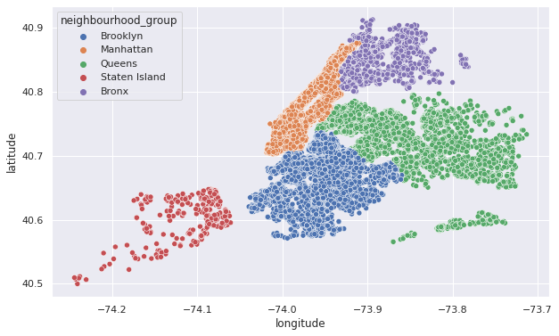
    


```python
X = airbnb.copy()
```

reviews_per_month has some 'nans'


```python
X_num = X.select_dtypes(exclude='object')
X_num.tail()
```


<div>
<style scoped>
    .dataframe tbody tr th:only-of-type {
        vertical-align: middle;
    }

    .dataframe tbody tr th {
        vertical-align: top;
    }

    .dataframe thead th {
        text-align: right;
    }
</style>
<table border="1" class="dataframe">
  <thead>
    <tr style="text-align: right;">
      <th></th>
      <th>id</th>
      <th>host_id</th>
      <th>latitude</th>
      <th>longitude</th>
      <th>price</th>
      <th>minimum_nights</th>
      <th>number_of_reviews</th>
      <th>reviews_per_month</th>
      <th>calculated_host_listings_count</th>
      <th>availability_365</th>
    </tr>
  </thead>
  <tbody>
    <tr>
      <th>48890</th>
      <td>36484665</td>
      <td>8232441</td>
      <td>40.67853</td>
      <td>-73.94995</td>
      <td>70</td>
      <td>2</td>
      <td>0</td>
      <td>NaN</td>
      <td>2</td>
      <td>9</td>
    </tr>
    <tr>
      <th>48891</th>
      <td>36485057</td>
      <td>6570630</td>
      <td>40.70184</td>
      <td>-73.93317</td>
      <td>40</td>
      <td>4</td>
      <td>0</td>
      <td>NaN</td>
      <td>2</td>
      <td>36</td>
    </tr>
    <tr>
      <th>48892</th>
      <td>36485431</td>
      <td>23492952</td>
      <td>40.81475</td>
      <td>-73.94867</td>
      <td>115</td>
      <td>10</td>
      <td>0</td>
      <td>NaN</td>
      <td>1</td>
      <td>27</td>
    </tr>
    <tr>
      <th>48893</th>
      <td>36485609</td>
      <td>30985759</td>
      <td>40.75751</td>
      <td>-73.99112</td>
      <td>55</td>
      <td>1</td>
      <td>0</td>
      <td>NaN</td>
      <td>6</td>
      <td>2</td>
    </tr>
    <tr>
      <th>48894</th>
      <td>36487245</td>
      <td>68119814</td>
      <td>40.76404</td>
      <td>-73.98933</td>
      <td>90</td>
      <td>7</td>
      <td>0</td>
      <td>NaN</td>
      <td>1</td>
      <td>23</td>
    </tr>
  </tbody>
</table>
</div>


```python
X_num.head()
```


<div>
<style scoped>
    .dataframe tbody tr th:only-of-type {
        vertical-align: middle;
    }

    .dataframe tbody tr th {
        vertical-align: top;
    }

    .dataframe thead th {
        text-align: right;
    }
</style>
<table border="1" class="dataframe">
  <thead>
    <tr style="text-align: right;">
      <th></th>
      <th>id</th>
      <th>host_id</th>
      <th>latitude</th>
      <th>longitude</th>
      <th>price</th>
      <th>minimum_nights</th>
      <th>number_of_reviews</th>
      <th>reviews_per_month</th>
      <th>calculated_host_listings_count</th>
      <th>availability_365</th>
    </tr>
  </thead>
  <tbody>
    <tr>
      <th>0</th>
      <td>2539</td>
      <td>2787</td>
      <td>40.64749</td>
      <td>-73.97237</td>
      <td>149</td>
      <td>1</td>
      <td>9</td>
      <td>0.21</td>
      <td>6</td>
      <td>365</td>
    </tr>
    <tr>
      <th>1</th>
      <td>2595</td>
      <td>2845</td>
      <td>40.75362</td>
      <td>-73.98377</td>
      <td>225</td>
      <td>1</td>
      <td>45</td>
      <td>0.38</td>
      <td>2</td>
      <td>355</td>
    </tr>
    <tr>
      <th>2</th>
      <td>3647</td>
      <td>4632</td>
      <td>40.80902</td>
      <td>-73.94190</td>
      <td>150</td>
      <td>3</td>
      <td>0</td>
      <td>NaN</td>
      <td>1</td>
      <td>365</td>
    </tr>
    <tr>
      <th>3</th>
      <td>3831</td>
      <td>4869</td>
      <td>40.68514</td>
      <td>-73.95976</td>
      <td>89</td>
      <td>1</td>
      <td>270</td>
      <td>4.64</td>
      <td>1</td>
      <td>194</td>
    </tr>
    <tr>
      <th>4</th>
      <td>5022</td>
      <td>7192</td>
      <td>40.79851</td>
      <td>-73.94399</td>
      <td>80</td>
      <td>10</td>
      <td>9</td>
      <td>0.10</td>
      <td>1</td>
      <td>0</td>
    </tr>
  </tbody>
</table>
</div>


```python
X_num.describe()
```


<div>
<style scoped>
    .dataframe tbody tr th:only-of-type {
        vertical-align: middle;
    }

    .dataframe tbody tr th {
        vertical-align: top;
    }

    .dataframe thead th {
        text-align: right;
    }
</style>
<table border="1" class="dataframe">
  <thead>
    <tr style="text-align: right;">
      <th></th>
      <th>id</th>
      <th>host_id</th>
      <th>latitude</th>
      <th>longitude</th>
      <th>price</th>
      <th>minimum_nights</th>
      <th>number_of_reviews</th>
      <th>reviews_per_month</th>
      <th>calculated_host_listings_count</th>
      <th>availability_365</th>
    </tr>
  </thead>
  <tbody>
    <tr>
      <th>count</th>
      <td>4.889500e+04</td>
      <td>4.889500e+04</td>
      <td>48895.000000</td>
      <td>48895.000000</td>
      <td>48895.000000</td>
      <td>48895.000000</td>
      <td>48895.000000</td>
      <td>38843.000000</td>
      <td>48895.000000</td>
      <td>48895.000000</td>
    </tr>
    <tr>
      <th>mean</th>
      <td>1.901714e+07</td>
      <td>6.762001e+07</td>
      <td>40.728949</td>
      <td>-73.952170</td>
      <td>152.720687</td>
      <td>7.029962</td>
      <td>23.274466</td>
      <td>1.373221</td>
      <td>7.143982</td>
      <td>112.781327</td>
    </tr>
    <tr>
      <th>std</th>
      <td>1.098311e+07</td>
      <td>7.861097e+07</td>
      <td>0.054530</td>
      <td>0.046157</td>
      <td>240.154170</td>
      <td>20.510550</td>
      <td>44.550582</td>
      <td>1.680442</td>
      <td>32.952519</td>
      <td>131.622289</td>
    </tr>
    <tr>
      <th>min</th>
      <td>2.539000e+03</td>
      <td>2.438000e+03</td>
      <td>40.499790</td>
      <td>-74.244420</td>
      <td>0.000000</td>
      <td>1.000000</td>
      <td>0.000000</td>
      <td>0.010000</td>
      <td>1.000000</td>
      <td>0.000000</td>
    </tr>
    <tr>
      <th>25%</th>
      <td>9.471945e+06</td>
      <td>7.822033e+06</td>
      <td>40.690100</td>
      <td>-73.983070</td>
      <td>69.000000</td>
      <td>1.000000</td>
      <td>1.000000</td>
      <td>0.190000</td>
      <td>1.000000</td>
      <td>0.000000</td>
    </tr>
    <tr>
      <th>50%</th>
      <td>1.967728e+07</td>
      <td>3.079382e+07</td>
      <td>40.723070</td>
      <td>-73.955680</td>
      <td>106.000000</td>
      <td>3.000000</td>
      <td>5.000000</td>
      <td>0.720000</td>
      <td>1.000000</td>
      <td>45.000000</td>
    </tr>
    <tr>
      <th>75%</th>
      <td>2.915218e+07</td>
      <td>1.074344e+08</td>
      <td>40.763115</td>
      <td>-73.936275</td>
      <td>175.000000</td>
      <td>5.000000</td>
      <td>24.000000</td>
      <td>2.020000</td>
      <td>2.000000</td>
      <td>227.000000</td>
    </tr>
    <tr>
      <th>max</th>
      <td>3.648724e+07</td>
      <td>2.743213e+08</td>
      <td>40.913060</td>
      <td>-73.712990</td>
      <td>10000.000000</td>
      <td>1250.000000</td>
      <td>629.000000</td>
      <td>58.500000</td>
      <td>327.000000</td>
      <td>365.000000</td>
    </tr>
  </tbody>
</table>
</div>


```python
X.dropna(inplace=True)
X_num = X.select_dtypes(exclude='object')
```


```python
vif = [variance_inflation_factor(X_num.values, i) for i in range(X_num.shape[1])]
pd.DataFrame(vif, index=X_num.columns)
```


<div>
<style scoped>
    .dataframe tbody tr th:only-of-type {
        vertical-align: middle;
    }

    .dataframe tbody tr th {
        vertical-align: top;
    }

    .dataframe thead th {
        text-align: right;
    }
</style>
<table border="1" class="dataframe">
  <thead>
    <tr style="text-align: right;">
      <th></th>
      <th>0</th>
    </tr>
  </thead>
  <tbody>
    <tr>
      <th>id</th>
      <td>2.180074</td>
    </tr>
    <tr>
      <th>host_id</th>
      <td>2.836905</td>
    </tr>
    <tr>
      <th>latitude</th>
      <td>0.775769</td>
    </tr>
    <tr>
      <th>longitude</th>
      <td>425502.981678</td>
    </tr>
    <tr>
      <th>price</th>
      <td>1.012423</td>
    </tr>
    <tr>
      <th>minimum_nights</th>
      <td>1.039144</td>
    </tr>
    <tr>
      <th>number_of_reviews</th>
      <td>2.348200</td>
    </tr>
    <tr>
      <th>reviews_per_month</th>
      <td>2.314318</td>
    </tr>
    <tr>
      <th>calculated_host_listings_count</th>
      <td>1.067389</td>
    </tr>
    <tr>
      <th>availability_365</th>
      <td>1.139558</td>
    </tr>
  </tbody>
</table>
</div>


```python
X_num.drop('longitude', axis=1, inplace=True)
```

    /home/wbeckner/anaconda3/envs/py39/lib/python3.9/site-packages/pandas/core/frame.py:4906: SettingWithCopyWarning:
    
    
    A value is trying to be set on a copy of a slice from a DataFrame
    
    See the caveats in the documentation: https://pandas.pydata.org/pandas-docs/stable/user_guide/indexing.html#returning-a-view-versus-a-copy
    


```python
X_num
```


<div>
<style scoped>
    .dataframe tbody tr th:only-of-type {
        vertical-align: middle;
    }

    .dataframe tbody tr th {
        vertical-align: top;
    }

    .dataframe thead th {
        text-align: right;
    }
</style>
<table border="1" class="dataframe">
  <thead>
    <tr style="text-align: right;">
      <th></th>
      <th>id</th>
      <th>host_id</th>
      <th>latitude</th>
      <th>price</th>
      <th>minimum_nights</th>
      <th>number_of_reviews</th>
      <th>reviews_per_month</th>
      <th>calculated_host_listings_count</th>
      <th>availability_365</th>
    </tr>
  </thead>
  <tbody>
    <tr>
      <th>0</th>
      <td>2539</td>
      <td>2787</td>
      <td>40.64749</td>
      <td>149</td>
      <td>1</td>
      <td>9</td>
      <td>0.21</td>
      <td>6</td>
      <td>365</td>
    </tr>
    <tr>
      <th>1</th>
      <td>2595</td>
      <td>2845</td>
      <td>40.75362</td>
      <td>225</td>
      <td>1</td>
      <td>45</td>
      <td>0.38</td>
      <td>2</td>
      <td>355</td>
    </tr>
    <tr>
      <th>3</th>
      <td>3831</td>
      <td>4869</td>
      <td>40.68514</td>
      <td>89</td>
      <td>1</td>
      <td>270</td>
      <td>4.64</td>
      <td>1</td>
      <td>194</td>
    </tr>
    <tr>
      <th>4</th>
      <td>5022</td>
      <td>7192</td>
      <td>40.79851</td>
      <td>80</td>
      <td>10</td>
      <td>9</td>
      <td>0.10</td>
      <td>1</td>
      <td>0</td>
    </tr>
    <tr>
      <th>5</th>
      <td>5099</td>
      <td>7322</td>
      <td>40.74767</td>
      <td>200</td>
      <td>3</td>
      <td>74</td>
      <td>0.59</td>
      <td>1</td>
      <td>129</td>
    </tr>
    <tr>
      <th>...</th>
      <td>...</td>
      <td>...</td>
      <td>...</td>
      <td>...</td>
      <td>...</td>
      <td>...</td>
      <td>...</td>
      <td>...</td>
      <td>...</td>
    </tr>
    <tr>
      <th>48782</th>
      <td>36425863</td>
      <td>83554966</td>
      <td>40.78099</td>
      <td>129</td>
      <td>1</td>
      <td>1</td>
      <td>1.00</td>
      <td>1</td>
      <td>147</td>
    </tr>
    <tr>
      <th>48790</th>
      <td>36427429</td>
      <td>257683179</td>
      <td>40.75104</td>
      <td>45</td>
      <td>1</td>
      <td>1</td>
      <td>1.00</td>
      <td>6</td>
      <td>339</td>
    </tr>
    <tr>
      <th>48799</th>
      <td>36438336</td>
      <td>211644523</td>
      <td>40.54179</td>
      <td>235</td>
      <td>1</td>
      <td>1</td>
      <td>1.00</td>
      <td>1</td>
      <td>87</td>
    </tr>
    <tr>
      <th>48805</th>
      <td>36442252</td>
      <td>273841667</td>
      <td>40.80787</td>
      <td>100</td>
      <td>1</td>
      <td>2</td>
      <td>2.00</td>
      <td>1</td>
      <td>40</td>
    </tr>
    <tr>
      <th>48852</th>
      <td>36455809</td>
      <td>74162901</td>
      <td>40.69805</td>
      <td>30</td>
      <td>1</td>
      <td>1</td>
      <td>1.00</td>
      <td>1</td>
      <td>1</td>
    </tr>
  </tbody>
</table>
<p>38821 rows × 9 columns</p>
</div>


```python
vif = [variance_inflation_factor(X_num.values, i) for i in range(X_num.shape[1])]
pd.DataFrame(vif, index=X_num.columns)
```


<div>
<style scoped>
    .dataframe tbody tr th:only-of-type {
        vertical-align: middle;
    }

    .dataframe tbody tr th {
        vertical-align: top;
    }

    .dataframe thead th {
        text-align: right;
    }
</style>
<table border="1" class="dataframe">
  <thead>
    <tr style="text-align: right;">
      <th></th>
      <th>0</th>
    </tr>
  </thead>
  <tbody>
    <tr>
      <th>id</th>
      <td>8.424770</td>
    </tr>
    <tr>
      <th>host_id</th>
      <td>2.827543</td>
    </tr>
    <tr>
      <th>latitude</th>
      <td>7.297302</td>
    </tr>
    <tr>
      <th>price</th>
      <td>1.538975</td>
    </tr>
    <tr>
      <th>minimum_nights</th>
      <td>1.157468</td>
    </tr>
    <tr>
      <th>number_of_reviews</th>
      <td>3.215893</td>
    </tr>
    <tr>
      <th>reviews_per_month</th>
      <td>3.858006</td>
    </tr>
    <tr>
      <th>calculated_host_listings_count</th>
      <td>1.106414</td>
    </tr>
    <tr>
      <th>availability_365</th>
      <td>2.035592</td>
    </tr>
  </tbody>
</table>
</div>


### Feature Engineering

Say we want to predict pricing, using an ML model. How would you build your features?

Based on the number of null values, what would you do with the `last_review` and `reviews_per_month` column?


```python
X = airbnb.copy()
y = X.pop('price')
```


```python
X_cat = X.select_dtypes(include='object')
X_cat.head()
```


<div>
<style scoped>
    .dataframe tbody tr th:only-of-type {
        vertical-align: middle;
    }

    .dataframe tbody tr th {
        vertical-align: top;
    }

    .dataframe thead th {
        text-align: right;
    }
</style>
<table border="1" class="dataframe">
  <thead>
    <tr style="text-align: right;">
      <th></th>
      <th>name</th>
      <th>host_name</th>
      <th>neighbourhood_group</th>
      <th>neighbourhood</th>
      <th>room_type</th>
      <th>last_review</th>
    </tr>
  </thead>
  <tbody>
    <tr>
      <th>0</th>
      <td>Clean &amp; quiet apt home by the park</td>
      <td>John</td>
      <td>Brooklyn</td>
      <td>Kensington</td>
      <td>Private room</td>
      <td>2018-10-19</td>
    </tr>
    <tr>
      <th>1</th>
      <td>Skylit Midtown Castle</td>
      <td>Jennifer</td>
      <td>Manhattan</td>
      <td>Midtown</td>
      <td>Entire home/apt</td>
      <td>2019-05-21</td>
    </tr>
    <tr>
      <th>2</th>
      <td>THE VILLAGE OF HARLEM....NEW YORK !</td>
      <td>Elisabeth</td>
      <td>Manhattan</td>
      <td>Harlem</td>
      <td>Private room</td>
      <td>NaN</td>
    </tr>
    <tr>
      <th>3</th>
      <td>Cozy Entire Floor of Brownstone</td>
      <td>LisaRoxanne</td>
      <td>Brooklyn</td>
      <td>Clinton Hill</td>
      <td>Entire home/apt</td>
      <td>2019-07-05</td>
    </tr>
    <tr>
      <th>4</th>
      <td>Entire Apt: Spacious Studio/Loft by central park</td>
      <td>Laura</td>
      <td>Manhattan</td>
      <td>East Harlem</td>
      <td>Entire home/apt</td>
      <td>2018-11-19</td>
    </tr>
  </tbody>
</table>
</div>


based on the number of unique columns, we may want to remove `name`, `host_name`, and `last_review`


```python
X_cat.nunique()
```


    name                   47905
    host_name              11452
    neighbourhood_group        5
    neighbourhood            221
    room_type                  3
    last_review             1764
    dtype: int64


```python
X_cat = X_cat.drop(['name', 'host_name', 'last_review'], axis=1)
enc = OneHotEncoder()
X_enc = enc.fit_transform(X_cat).toarray()
```

And now we deal with the numerical columns


```python
X_num = X.select_dtypes(exclude='object')
X_num.head()
```


<div>
<style scoped>
    .dataframe tbody tr th:only-of-type {
        vertical-align: middle;
    }

    .dataframe tbody tr th {
        vertical-align: top;
    }

    .dataframe thead th {
        text-align: right;
    }
</style>
<table border="1" class="dataframe">
  <thead>
    <tr style="text-align: right;">
      <th></th>
      <th>id</th>
      <th>host_id</th>
      <th>latitude</th>
      <th>longitude</th>
      <th>minimum_nights</th>
      <th>number_of_reviews</th>
      <th>reviews_per_month</th>
      <th>calculated_host_listings_count</th>
      <th>availability_365</th>
    </tr>
  </thead>
  <tbody>
    <tr>
      <th>0</th>
      <td>2539</td>
      <td>2787</td>
      <td>40.64749</td>
      <td>-73.97237</td>
      <td>1</td>
      <td>9</td>
      <td>0.21</td>
      <td>6</td>
      <td>365</td>
    </tr>
    <tr>
      <th>1</th>
      <td>2595</td>
      <td>2845</td>
      <td>40.75362</td>
      <td>-73.98377</td>
      <td>1</td>
      <td>45</td>
      <td>0.38</td>
      <td>2</td>
      <td>355</td>
    </tr>
    <tr>
      <th>2</th>
      <td>3647</td>
      <td>4632</td>
      <td>40.80902</td>
      <td>-73.94190</td>
      <td>3</td>
      <td>0</td>
      <td>NaN</td>
      <td>1</td>
      <td>365</td>
    </tr>
    <tr>
      <th>3</th>
      <td>3831</td>
      <td>4869</td>
      <td>40.68514</td>
      <td>-73.95976</td>
      <td>1</td>
      <td>270</td>
      <td>4.64</td>
      <td>1</td>
      <td>194</td>
    </tr>
    <tr>
      <th>4</th>
      <td>5022</td>
      <td>7192</td>
      <td>40.79851</td>
      <td>-73.94399</td>
      <td>10</td>
      <td>9</td>
      <td>0.10</td>
      <td>1</td>
      <td>0</td>
    </tr>
  </tbody>
</table>
</div>


both `id` and `host_id` will be highly cardinal without telling us much about the behavior of unseen data. We should remove them. We'll also drop the columns with `nans` for now


```python
X_num = X_num.drop(['id', 'host_id'], axis=1)
X_num = X_num.dropna(axis=1)
```


```python
X_enc_df = pd.DataFrame(X_enc, columns=enc.get_feature_names_out())
X_feat = pd.concat((X_enc_df, X_num), axis=1)
X_feat.head()
```


<div>
<style scoped>
    .dataframe tbody tr th:only-of-type {
        vertical-align: middle;
    }

    .dataframe tbody tr th {
        vertical-align: top;
    }

    .dataframe thead th {
        text-align: right;
    }
</style>
<table border="1" class="dataframe">
  <thead>
    <tr style="text-align: right;">
      <th></th>
      <th>neighbourhood_group_Bronx</th>
      <th>neighbourhood_group_Brooklyn</th>
      <th>neighbourhood_group_Manhattan</th>
      <th>neighbourhood_group_Queens</th>
      <th>neighbourhood_group_Staten Island</th>
      <th>neighbourhood_Allerton</th>
      <th>neighbourhood_Arden Heights</th>
      <th>neighbourhood_Arrochar</th>
      <th>neighbourhood_Arverne</th>
      <th>neighbourhood_Astoria</th>
      <th>...</th>
      <th>neighbourhood_Woodside</th>
      <th>room_type_Entire home/apt</th>
      <th>room_type_Private room</th>
      <th>room_type_Shared room</th>
      <th>latitude</th>
      <th>longitude</th>
      <th>minimum_nights</th>
      <th>number_of_reviews</th>
      <th>calculated_host_listings_count</th>
      <th>availability_365</th>
    </tr>
  </thead>
  <tbody>
    <tr>
      <th>0</th>
      <td>0.0</td>
      <td>1.0</td>
      <td>0.0</td>
      <td>0.0</td>
      <td>0.0</td>
      <td>0.0</td>
      <td>0.0</td>
      <td>0.0</td>
      <td>0.0</td>
      <td>0.0</td>
      <td>...</td>
      <td>0.0</td>
      <td>0.0</td>
      <td>1.0</td>
      <td>0.0</td>
      <td>40.64749</td>
      <td>-73.97237</td>
      <td>1</td>
      <td>9</td>
      <td>6</td>
      <td>365</td>
    </tr>
    <tr>
      <th>1</th>
      <td>0.0</td>
      <td>0.0</td>
      <td>1.0</td>
      <td>0.0</td>
      <td>0.0</td>
      <td>0.0</td>
      <td>0.0</td>
      <td>0.0</td>
      <td>0.0</td>
      <td>0.0</td>
      <td>...</td>
      <td>0.0</td>
      <td>1.0</td>
      <td>0.0</td>
      <td>0.0</td>
      <td>40.75362</td>
      <td>-73.98377</td>
      <td>1</td>
      <td>45</td>
      <td>2</td>
      <td>355</td>
    </tr>
    <tr>
      <th>2</th>
      <td>0.0</td>
      <td>0.0</td>
      <td>1.0</td>
      <td>0.0</td>
      <td>0.0</td>
      <td>0.0</td>
      <td>0.0</td>
      <td>0.0</td>
      <td>0.0</td>
      <td>0.0</td>
      <td>...</td>
      <td>0.0</td>
      <td>0.0</td>
      <td>1.0</td>
      <td>0.0</td>
      <td>40.80902</td>
      <td>-73.94190</td>
      <td>3</td>
      <td>0</td>
      <td>1</td>
      <td>365</td>
    </tr>
    <tr>
      <th>3</th>
      <td>0.0</td>
      <td>1.0</td>
      <td>0.0</td>
      <td>0.0</td>
      <td>0.0</td>
      <td>0.0</td>
      <td>0.0</td>
      <td>0.0</td>
      <td>0.0</td>
      <td>0.0</td>
      <td>...</td>
      <td>0.0</td>
      <td>1.0</td>
      <td>0.0</td>
      <td>0.0</td>
      <td>40.68514</td>
      <td>-73.95976</td>
      <td>1</td>
      <td>270</td>
      <td>1</td>
      <td>194</td>
    </tr>
    <tr>
      <th>4</th>
      <td>0.0</td>
      <td>0.0</td>
      <td>1.0</td>
      <td>0.0</td>
      <td>0.0</td>
      <td>0.0</td>
      <td>0.0</td>
      <td>0.0</td>
      <td>0.0</td>
      <td>0.0</td>
      <td>...</td>
      <td>0.0</td>
      <td>1.0</td>
      <td>0.0</td>
      <td>0.0</td>
      <td>40.79851</td>
      <td>-73.94399</td>
      <td>10</td>
      <td>9</td>
      <td>1</td>
      <td>0</td>
    </tr>
  </tbody>
</table>
<p>5 rows × 235 columns</p>
</div>


### Feature Transformation

What features do you think will cause the most problems if untransformed? 

Scale and Center all but the target variable, price


```python
scaler = StandardScaler()
X_std_num = scaler.fit_transform(X_num)

X_std = np.hstack((X_enc, X_std_num))
print(X_std.shape)
print(y.shape)
```

    (48895, 235)
    (48895,)


### Model Baseline


```python
X_train, X_test, y_train, y_test = train_test_split(X_std, y, train_size=0.8, random_state=42)
```


```python
model = LinearRegression()
model.fit(X_train, y_train)
y_pred = model.predict(X_test)
```


```python
r2_score(y_train, model.predict(X_train))
```


    0.11264603204210533


```python
r2_score(y_test, y_pred)
```


    -1.563294115330747e+17


```python
model = RandomForestRegressor()
model.fit(X_train, y_train)
r2_score(y_train, model.predict(X_train))
```


    0.8597830223730762


```python
r2_score(y_test, model.predict(X_test))
```


    0.10233675407266163


both of these results from the `LinearRegression` and `RandomForest` models indicate overfitting

## Back to Feature Engineering

* 🌟 - keep this feature
* 💡 - interesting behavior discovered
* 👎 - don't keep this feature
* 🔮 - try for next time

To try:

* drop nan rows not columns
* remove outliers (filter by group)
* PCA of one hot encoded vectors (will help with linear model)
* transform 'last review date' (str) into 'days since last review' (number)

### 🌟 NaNs - Drop Row-wise


```python
X = airbnb.copy()
X = X.dropna(axis=0)
y = X.pop('price')
```


```python
X_num = X.select_dtypes(exclude='object')
X_num = X_num.drop(['id', 'host_id'], axis=1)
X_num.head()
```


<div>
<style scoped>
    .dataframe tbody tr th:only-of-type {
        vertical-align: middle;
    }

    .dataframe tbody tr th {
        vertical-align: top;
    }

    .dataframe thead th {
        text-align: right;
    }
</style>
<table border="1" class="dataframe">
  <thead>
    <tr style="text-align: right;">
      <th></th>
      <th>latitude</th>
      <th>longitude</th>
      <th>minimum_nights</th>
      <th>number_of_reviews</th>
      <th>reviews_per_month</th>
      <th>calculated_host_listings_count</th>
      <th>availability_365</th>
    </tr>
  </thead>
  <tbody>
    <tr>
      <th>0</th>
      <td>40.64749</td>
      <td>-73.97237</td>
      <td>1</td>
      <td>9</td>
      <td>0.21</td>
      <td>6</td>
      <td>365</td>
    </tr>
    <tr>
      <th>1</th>
      <td>40.75362</td>
      <td>-73.98377</td>
      <td>1</td>
      <td>45</td>
      <td>0.38</td>
      <td>2</td>
      <td>355</td>
    </tr>
    <tr>
      <th>3</th>
      <td>40.68514</td>
      <td>-73.95976</td>
      <td>1</td>
      <td>270</td>
      <td>4.64</td>
      <td>1</td>
      <td>194</td>
    </tr>
    <tr>
      <th>4</th>
      <td>40.79851</td>
      <td>-73.94399</td>
      <td>10</td>
      <td>9</td>
      <td>0.10</td>
      <td>1</td>
      <td>0</td>
    </tr>
    <tr>
      <th>5</th>
      <td>40.74767</td>
      <td>-73.97500</td>
      <td>3</td>
      <td>74</td>
      <td>0.59</td>
      <td>1</td>
      <td>129</td>
    </tr>
  </tbody>
</table>
</div>


```python
X_cat = X.select_dtypes(include='object')
X_cat = X_cat.drop(['name', 'host_name', 'last_review'], axis=1)
enc = OneHotEncoder()
X_enc = enc.fit_transform(X_cat).toarray()
```


```python
scaler = StandardScaler()
X_std_num = scaler.fit_transform(X_num)

X_std = np.hstack((X_enc, X_std_num))
print(X_std.shape)
print(y.shape)
```

    (38821, 233)
    (38821,)


#### Train/Eval


```python
X_train, X_test, y_train, y_test = train_test_split(X_std, y, train_size=0.8, random_state=42)

model = RandomForestRegressor(n_jobs=-1)
model.fit(X_train, y_train)
print(f"Train R2: {r2_score(y_train, model.predict(X_train)):.2f}")
print(f"Test R2: {r2_score(y_test, model.predict(X_test)):.2f}")
```

    Train R2: 0.88
    Test R2: 0.23


### 💡 Outliers - by Borough


```python
X = airbnb.copy()
X = X.dropna(axis=0)
```


```python
fig, ax = plt.subplots(figsize=(10,10))
sns.boxplot(x=X['neighbourhood_group'], y=X['price'], ax=ax)
# ax.set_ylim(0, 1500)
```


    <AxesSubplot:xlabel='neighbourhood_group', ylabel='price'>


    

    


```python
fig, ax = plt.subplots(figsize=(15,10))
sns.kdeplot(hue=X['neighbourhood_group'], x=X['price'], ax=ax)
```


    <AxesSubplot:xlabel='price', ylabel='Density'>


    
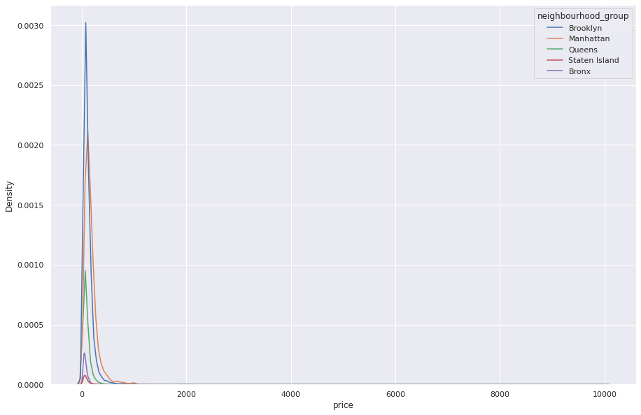
    


```python
X = X.loc[X.groupby('neighbourhood_group').apply(lambda x: x['price'] < (x['price'].std()*3)).unstack(level=0).any(axis=1)]
```


```python
fig, (ax, ax_) = plt.subplots(1, 2, figsize=(20,10))
sns.boxplot(x=X['neighbourhood_group'], y=X['price'], ax=ax)
sns.kdeplot(hue=X['neighbourhood_group'], x=X['price'], ax=ax_)
```


    <AxesSubplot:xlabel='price', ylabel='Density'>


    
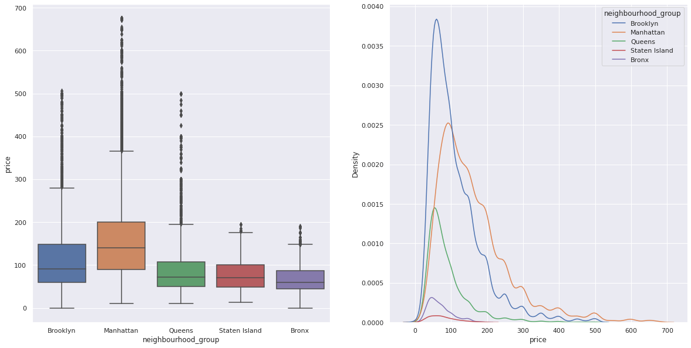
    


```python
y = X.pop('price')

X_num = X.select_dtypes(exclude='object')
X_num = X_num.drop(['id', 'host_id'], axis=1)

X_cat = X.select_dtypes(include='object')
X_cat = X_cat.drop(['name', 'host_name', 'last_review'], axis=1)
enc = OneHotEncoder()
X_enc = enc.fit_transform(X_cat).toarray()

scaler = StandardScaler()
X_std_num = scaler.fit_transform(X_num)

X_std = np.hstack((X_enc, X_std_num))
print(X_std.shape)
print(y.shape)
```

    (38309, 232)
    (38309,)


#### Train/Eval


```python
X_train, X_test, y_train, y_test = train_test_split(X_std, y, train_size=0.8, random_state=42)

model = RandomForestRegressor(n_jobs=-1)
model.fit(X_train, y_train)
print(f"Train R2: {r2_score(y_train, model.predict(X_train)):.2f}")
print(f"Test R2: {r2_score(y_test, model.predict(X_test)):.2f}")
```

    Train R2: 0.93
    Test R2: 0.52


```python
fig, (ax, ax_) = plt.subplots(1, 2, figsize=(10,5))
ax.plot(y_train, model.predict(X_train), ls='', marker=',')
ax_.plot(y_test, model.predict(X_test), ls='', marker=',')
```


    [<matplotlib.lines.Line2D at 0x7f211ce29c40>]


    
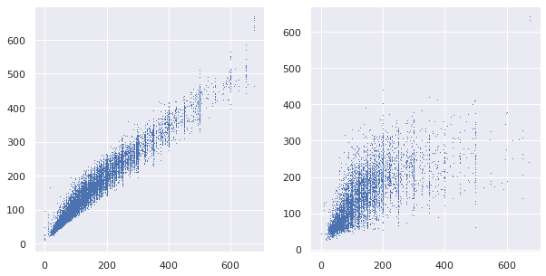
    


### 🌟 Bin Prices, Classifier Model


```python
X = airbnb.copy()
X = X.dropna(axis=0)
y = X.pop('price').values
Y = y.reshape(-1,1)
```


```python
labels = y.copy()
labels[labels <= np.quantile(y, .25)] = 1
labels[(labels > np.quantile(y, .25)) & (labels <= np.quantile(y, .5))] = 2
labels[(labels > np.quantile(y, .5)) & (labels <= np.quantile(y, .75))] = 3
labels[(labels > np.quantile(y, .75))] = 4
```


```python
y = labels

X_num = X.select_dtypes(exclude='object')
X_num = X_num.drop(['id', 'host_id'], axis=1)

X_cat = X.select_dtypes(include='object')
X_cat = X_cat.drop(['name', 'host_name', 'last_review'], axis=1)
enc = OneHotEncoder()
X_enc = enc.fit_transform(X_cat).toarray()

scaler = StandardScaler()
X_std_num = scaler.fit_transform(X_num)

X_std = np.hstack((X_enc, X_std_num))
print(X_std.shape)
print(y.shape)
```

    (38821, 233)
    (38821,)


#### Train/Eval


```python
X_train, X_test, y_train, y_test = train_test_split(X_std, y, train_size=0.8, random_state=42)

model = RandomForestClassifier(n_jobs=-1)
model.fit(X_train, y_train)
print(f"Train Acc: {accuracy_score(y_train, model.predict(X_train)):.2f}")
print(f"Test Acc: {accuracy_score(y_test, model.predict(X_test)):.2f}")
```

    Train Acc: 1.00
    Test Acc: 0.60


```python
y_pred = model.predict(X_train)
print(classification_report(y_train, y_pred, zero_division=0))
fig, ax = plt.subplots(1, 1, figsize = (8,7))
sns.heatmap(confusion_matrix(y_train,y_pred), annot=True, ax=ax)
```

                  precision    recall  f1-score   support
    
               1       1.00      1.00      1.00      7986
               2       1.00      1.00      1.00      7594
               3       1.00      1.00      1.00      7878
               4       1.00      1.00      1.00      7598
    
        accuracy                           1.00     31056
       macro avg       1.00      1.00      1.00     31056
    weighted avg       1.00      1.00      1.00     31056
    


    <AxesSubplot:>


    
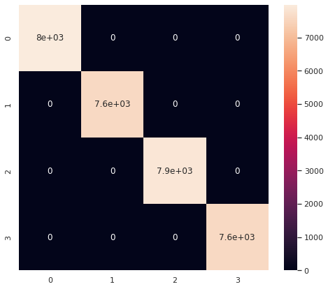
    


```python
y_pred = model.predict(X_test)
print(classification_report(y_test, y_pred, zero_division=0))
fig, ax = plt.subplots(1, 1, figsize = (8,7))
sns.heatmap(confusion_matrix(y_test,y_pred), annot=True, ax=ax)
```

                  precision    recall  f1-score   support
    
               1       0.70      0.80      0.74      1998
               2       0.49      0.44      0.46      1846
               3       0.50      0.47      0.48      1986
               4       0.66      0.67      0.66      1935
    
        accuracy                           0.60      7765
       macro avg       0.59      0.59      0.59      7765
    weighted avg       0.59      0.60      0.59      7765
    


    <AxesSubplot:>


    
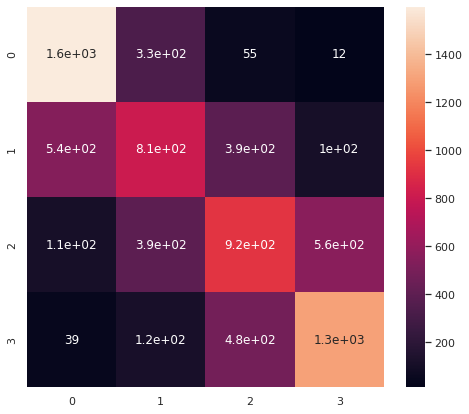
    


### 👎 Cluster Prices, Classifier Model


```python
X = airbnb.copy()
X = X.dropna(axis=0)
y = X.pop('price').values
Y = y.reshape(-1,1)
```


```python
distortions = []
inertias = []
silhouette = []
variance = []
krange = 20
for k in range(1,krange):

    kmeans = KMeans(n_clusters=k)
    kmeans.fit(Y)
    y_kmeans = kmeans.predict(Y)
    labels = kmeans.labels_

    distortions.append(sum(np.min(cdist(Y, kmeans.cluster_centers_,
                                        'euclidean'), axis=1)) / Y.shape[0])
    inertias.append(kmeans.inertia_)

    if k > 1:
        silhouette.append(silhouette_score(Y, labels, metric = 'euclidean'))
        variance.append(calinski_harabasz_score(Y, labels))
```


```python
fig, [[ax1, ax2], [ax3, ax4]] = plt.subplots(2, 2, figsize=(10,10))
ax1.plot(range(1,krange), distortions)
ax2.plot(range(1,krange), inertias)
ax3.plot(range(2,krange), silhouette)
ax4.plot(range(2,krange), variance)
```


    [<matplotlib.lines.Line2D at 0x7f211ca89100>]


    
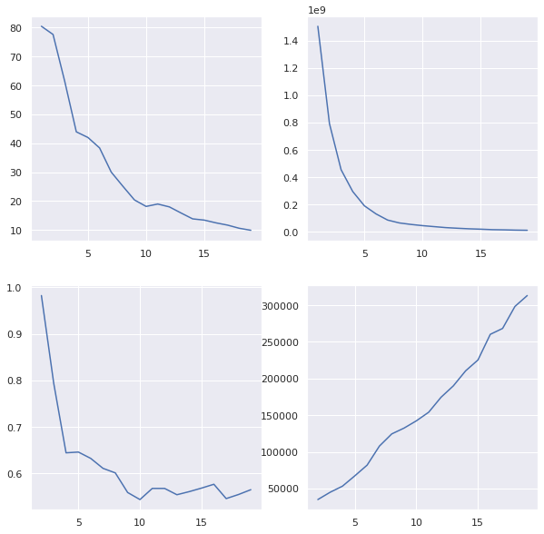
    


```python
kmeans = KMeans(n_clusters=5)
kmeans.fit(Y)
y_kmeans = kmeans.predict(Y)
labels = kmeans.labels_
```


```python
ks = kmeans.cluster_centers_
ks = ks.flatten()
ks = np.sort(ks)
ks
```


    array([  87.29374822,  230.74992332,  647.13125   , 2728.375     ,
           8749.75      ])


```python
edges = (np.diff(ks)/2 + ks[:-1]).astype(int) 
bins = []
for idx, edge in enumerate(edges):
    if idx == 0:
        bins.append(f"0-{edge}")
    elif idx < len(edges):
        bins.append(f"{edges[idx-1]}-{edge}")
bins.append(f"{edge}+")
bins  
```


    ['0-159', '159-438', '438-1687', '1687-5739', '5739+']


```python
pd.DataFrame(labels).value_counts(sort=False)
```


    0     9651
    1        8
    2      961
    3    28153
    4       48
    dtype: int64


```python
y = labels

X_num = X.select_dtypes(exclude='object')
X_num = X_num.drop(['id', 'host_id'], axis=1)

X_cat = X.select_dtypes(include='object')
X_cat = X_cat.drop(['name', 'host_name', 'last_review'], axis=1)
enc = OneHotEncoder()
X_enc = enc.fit_transform(X_cat).toarray()

scaler = StandardScaler()
X_std_num = scaler.fit_transform(X_num)

X_std = np.hstack((X_enc, X_std_num))
print(X_std.shape)
print(y.shape)
```

    (38821, 233)
    (38821,)


#### Train/Eval


```python
X_train, X_test, y_train, y_test = train_test_split(X_std, y, train_size=0.8, random_state=42)

model = RandomForestClassifier(n_jobs=-1)
model.fit(X_train, y_train)
print(f"Train Acc: {accuracy_score(y_train, model.predict(X_train)):.2f}")
print(f"Test Acc: {accuracy_score(y_test, model.predict(X_test)):.2f}")
```

    Train Acc: 1.00
    Test Acc: 0.81


```python
y_pred = model.predict(X_train)
print(classification_report(y_train, y_pred, zero_division=0))
fig, ax = plt.subplots(1, 1, figsize = (8,7))
sns.heatmap(confusion_matrix(y_train,y_pred), annot=True, ax=ax)
```

                  precision    recall  f1-score   support
    
               0       1.00      1.00      1.00      7687
               1       1.00      1.00      1.00         7
               2       1.00      1.00      1.00       762
               3       1.00      1.00      1.00     22561
               4       1.00      1.00      1.00        39
    
        accuracy                           1.00     31056
       macro avg       1.00      1.00      1.00     31056
    weighted avg       1.00      1.00      1.00     31056
    


    <AxesSubplot:>


    
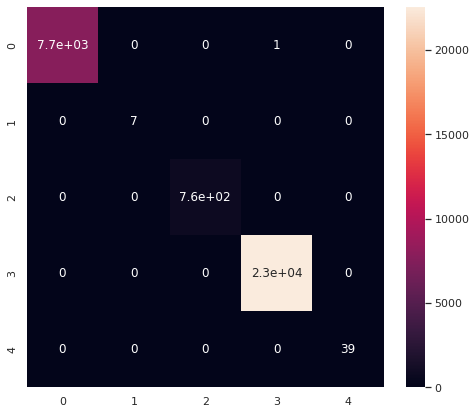
    


```python
y_pred = model.predict(X_test)
print(classification_report(y_test, y_pred, zero_division=0))
fig, ax = plt.subplots(1, 1, figsize = (8,7))
sns.heatmap(confusion_matrix(y_test,y_pred), annot=True, ax=ax)
```

                  precision    recall  f1-score   support
    
               0       0.64      0.60      0.62      1964
               1       0.00      0.00      0.00         1
               2       0.71      0.14      0.23       199
               3       0.86      0.91      0.88      5592
               4       0.67      0.22      0.33         9
    
        accuracy                           0.81      7765
       macro avg       0.58      0.37      0.41      7765
    weighted avg       0.80      0.81      0.80      7765
    


    <AxesSubplot:>


    
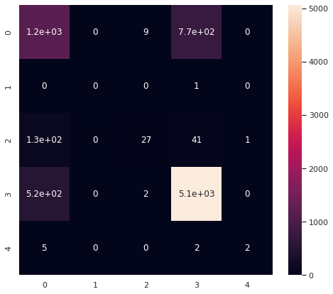
    


### 🌟 PCA, Feature Reduction

The results in Bin Price, Classifier Model indicate overfitting. Let's see if we can reduce the cardinality of our One Hot features


```python
X = airbnb.copy()
X = X.dropna(axis=0)
y = X.pop('price').values
Y = y.reshape(-1,1)

bins = 10
quantiles = bins + 1
labels = y.copy()
for idx, quant in enumerate(np.linspace(0,1,quantiles)):
    if idx == 0:
        prev_quant = quant
        continue
    if idx == 1:
        labels[labels <= np.quantile(y, quant)] = 1
    elif quant < 1:
        labels[(labels > np.quantile(y, prev_quant)) & (labels <= np.quantile(y, quant))] = idx
    else:
        labels[(labels > np.quantile(y, prev_quant))] = idx
    prev_quant = quant
print([np.quantile(y, quant) for quant in np.linspace(0,1,quantiles)])
y = labels

X_num = X.select_dtypes(exclude='object')
X_num = X_num.drop(['id', 'host_id'], axis=1)

X_cat = X.select_dtypes(include='object')
X_cat = X_cat.drop(['name', 'host_name', 'last_review'], axis=1)
enc = OneHotEncoder()
X_enc = enc.fit_transform(X_cat).toarray()
pca = PCA(n_components=3)
X_pca = pca.fit_transform(X_enc)
print(pca.explained_variance_)

scaler = StandardScaler()
X_std_num = scaler.fit_transform(X_num)

X_std = np.hstack((X_pca, X_std_num))
print(X_std.shape)
print(y.shape)
```

    [0.0, 49.0, 60.0, 75.0, 90.0, 101.0, 125.0, 150.0, 190.0, 250.0, 10000.0]
    [0.52595687 0.42901998 0.16673031]
    (38821, 10)
    (38821,)


#### Train/Eval


```python
X_train, X_test, y_train, y_test = train_test_split(X_std, y, train_size=0.8, random_state=42)

model = RandomForestClassifier(n_jobs=-1)
model.fit(X_train, y_train)
print(f"Train Acc: {accuracy_score(y_train, model.predict(X_train)):.2f}")
print(f"Test Acc: {accuracy_score(y_test, model.predict(X_test)):.2f}")

y_pred = model.predict(X_train)
print("Training Confusion Matrix")
print(classification_report(y_train, y_pred, zero_division=0))
fig, ax = plt.subplots(1, 1, figsize = (8,7))
sns.heatmap(confusion_matrix(y_train,y_pred), annot=True, ax=ax)
plt.show()

y_pred = model.predict(X_test)
print("Testing Confusion Matrix")
print(classification_report(y_test, y_pred, zero_division=0))
fig, ax = plt.subplots(1, 1, figsize = (8,7))
sns.heatmap(confusion_matrix(y_test,y_pred), annot=True, ax=ax)
```

    Train Acc: 1.00
    Test Acc: 0.32
    Training Confusion Matrix
                  precision    recall  f1-score   support
    
               1       1.00      1.00      1.00      3148
               2       1.00      1.00      1.00      3241
               3       1.00      1.00      1.00      3458
               4       1.00      1.00      1.00      3075
               5       1.00      1.00      1.00      2658
               6       1.00      1.00      1.00      3198
               7       1.00      1.00      1.00      3426
               8       1.00      1.00      1.00      2759
               9       1.00      1.00      1.00      3274
              10       1.00      1.00      1.00      2819
    
        accuracy                           1.00     31056
       macro avg       1.00      1.00      1.00     31056
    weighted avg       1.00      1.00      1.00     31056
    


    
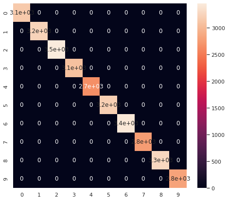
    


    Testing Confusion Matrix
                  precision    recall  f1-score   support
    
               1       0.51      0.56      0.54       840
               2       0.36      0.41      0.39       794
               3       0.30      0.31      0.30       824
               4       0.26      0.23      0.25       782
               5       0.17      0.15      0.16       604
               6       0.24      0.23      0.24       813
               7       0.25      0.26      0.25       842
               8       0.25      0.19      0.22       736
               9       0.32      0.35      0.33       818
              10       0.46      0.48      0.47       712
    
        accuracy                           0.32      7765
       macro avg       0.31      0.32      0.31      7765
    weighted avg       0.32      0.32      0.32      7765
    


    <AxesSubplot:>


    
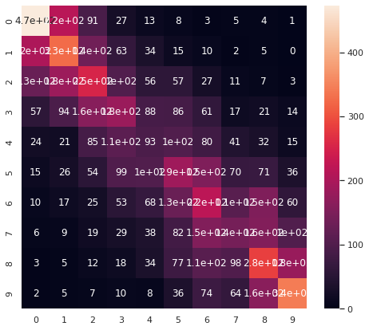
    


### 🔮 Last Review Date, PCA for Outlier Removal, Impute

If I wanted to spend more time on this:

1. remove outliers with PCA
    * the issue with our outlier removal previously, is that we are conditioning on `y`. As we can't _know_ `y` in a production setting, this makes our model suspetible to underdetecting true, high-y value signal
    * removing outliers based on the input, `X` is prefered, and we might try this with PCA
2. turn `last_review_date` into a number (counts of days)
    * this would change a string (to be one hot encoded) column to a number column (avoids curse of dimensionality)
3. impute missing values
    * we're currently omitting about 20% of our data points, it may give us a boost to impute or otherwise estimate these missing values

## Hyperparameter Optimization

### Round 1

We'll start with a broad, shallow search (few trees)


```python
param_grid = {'bootstrap': [True, False],
              'criterion': ['gini', 'entropy'],
              'min_samples_split': [2, 4, 6],
              'min_samples_leaf': [1, 3, 5],
              'max_features': ['auto', 'sqrt', 'log2'],
              'class_weight': ['balanced', 'balanced_subsample', None],
              'n_estimators': [1, 5]}

grid = GridSearchCV(RandomForestClassifier(), param_grid, cv=5, n_jobs=-1, verbose=3)
```


```python
grid.fit(X_train, y_train)
print(grid.best_params_)
```


```python
print(grid.best_params_)
```

    {'bootstrap': False, 'class_weight': 'balanced', 'criterion': 'gini', 'max_features': 'sqrt', 'min_samples_leaf': 5, 'min_samples_split': 2, 'n_estimators': 5}


```python
model = grid.best_estimator_
model.fit(X_train, y_train)
print(f"Train Acc: {accuracy_score(y_train, model.predict(X_train)):.2f}")
print(f"Test Acc: {accuracy_score(y_test, model.predict(X_test)):.2f}")

y_pred = model.predict(X_train)
print("Training Confusion Matrix")
print(classification_report(y_train, y_pred, zero_division=0))
fig, ax = plt.subplots(1, 1, figsize = (8,7))
sns.heatmap(confusion_matrix(y_train,y_pred), annot=True, ax=ax)
plt.show()

y_pred = model.predict(X_test)
print("Testing Confusion Matrix")
print(classification_report(y_test, y_pred, zero_division=0))
fig, ax = plt.subplots(1, 1, figsize = (8,7))
sns.heatmap(confusion_matrix(y_test,y_pred), annot=True, ax=ax)
```

    Train Acc: 0.79
    Test Acc: 0.30
    Training Confusion Matrix
                  precision    recall  f1-score   support
    
               1       0.80      0.89      0.84      3148
               2       0.79      0.83      0.81      3241
               3       0.82      0.74      0.78      3458
               4       0.77      0.76      0.77      3075
               5       0.74      0.79      0.77      2658
               6       0.79      0.74      0.76      3198
               7       0.81      0.71      0.76      3426
               8       0.77      0.83      0.80      2759
               9       0.81      0.77      0.79      3274
              10       0.80      0.86      0.83      2819
    
        accuracy                           0.79     31056
       macro avg       0.79      0.79      0.79     31056
    weighted avg       0.79      0.79      0.79     31056
    


    
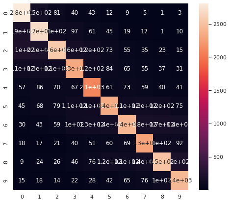
    


    Testing Confusion Matrix
                  precision    recall  f1-score   support
    
               1       0.49      0.58      0.53       840
               2       0.33      0.37      0.35       794
               3       0.28      0.24      0.26       824
               4       0.23      0.21      0.22       782
               5       0.17      0.21      0.18       604
               6       0.24      0.20      0.22       813
               7       0.23      0.20      0.21       842
               8       0.23      0.22      0.22       736
               9       0.29      0.27      0.28       818
              10       0.41      0.47      0.44       712
    
        accuracy                           0.30      7765
       macro avg       0.29      0.30      0.29      7765
    weighted avg       0.29      0.30      0.29      7765
    


    <AxesSubplot:>


    
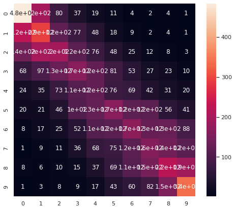
    


```python
gs_results = pd.DataFrame(grid.cv_results_)
params = list(gs_results.columns[gs_results.columns.str.contains('param')].values)
params.pop(-1)
display(gs_results.head())
print(params)
```


<div>
<style scoped>
    .dataframe tbody tr th:only-of-type {
        vertical-align: middle;
    }

    .dataframe tbody tr th {
        vertical-align: top;
    }

    .dataframe thead th {
        text-align: right;
    }
</style>
<table border="1" class="dataframe">
  <thead>
    <tr style="text-align: right;">
      <th></th>
      <th>mean_fit_time</th>
      <th>std_fit_time</th>
      <th>mean_score_time</th>
      <th>std_score_time</th>
      <th>param_bootstrap</th>
      <th>param_class_weight</th>
      <th>param_criterion</th>
      <th>param_max_features</th>
      <th>param_min_samples_leaf</th>
      <th>param_min_samples_split</th>
      <th>...</th>
      <th>split0_test_score</th>
      <th>split1_test_score</th>
      <th>split2_test_score</th>
      <th>split3_test_score</th>
      <th>split4_test_score</th>
      <th>split5_test_score</th>
      <th>split6_test_score</th>
      <th>mean_test_score</th>
      <th>std_test_score</th>
      <th>rank_test_score</th>
    </tr>
  </thead>
  <tbody>
    <tr>
      <th>0</th>
      <td>0.118039</td>
      <td>0.002019</td>
      <td>0.004001</td>
      <td>0.000212</td>
      <td>True</td>
      <td>balanced</td>
      <td>gini</td>
      <td>auto</td>
      <td>1</td>
      <td>2</td>
      <td>...</td>
      <td>0.230787</td>
      <td>0.235745</td>
      <td>0.239351</td>
      <td>0.232139</td>
      <td>0.247520</td>
      <td>0.238278</td>
      <td>0.222272</td>
      <td>0.235156</td>
      <td>0.007317</td>
      <td>610</td>
    </tr>
    <tr>
      <th>1</th>
      <td>0.518118</td>
      <td>0.006517</td>
      <td>0.012629</td>
      <td>0.000356</td>
      <td>True</td>
      <td>balanced</td>
      <td>gini</td>
      <td>auto</td>
      <td>1</td>
      <td>2</td>
      <td>...</td>
      <td>0.262114</td>
      <td>0.268425</td>
      <td>0.253324</td>
      <td>0.281271</td>
      <td>0.273670</td>
      <td>0.272543</td>
      <td>0.259693</td>
      <td>0.267291</td>
      <td>0.008820</td>
      <td>309</td>
    </tr>
    <tr>
      <th>2</th>
      <td>0.113497</td>
      <td>0.004069</td>
      <td>0.003702</td>
      <td>0.000130</td>
      <td>True</td>
      <td>balanced</td>
      <td>gini</td>
      <td>auto</td>
      <td>1</td>
      <td>4</td>
      <td>...</td>
      <td>0.231463</td>
      <td>0.231012</td>
      <td>0.236196</td>
      <td>0.249268</td>
      <td>0.243012</td>
      <td>0.240532</td>
      <td>0.229937</td>
      <td>0.237345</td>
      <td>0.006712</td>
      <td>567</td>
    </tr>
    <tr>
      <th>3</th>
      <td>0.482682</td>
      <td>0.004648</td>
      <td>0.012108</td>
      <td>0.000515</td>
      <td>True</td>
      <td>balanced</td>
      <td>gini</td>
      <td>auto</td>
      <td>1</td>
      <td>4</td>
      <td>...</td>
      <td>0.268875</td>
      <td>0.277890</td>
      <td>0.272481</td>
      <td>0.275186</td>
      <td>0.275248</td>
      <td>0.274121</td>
      <td>0.272543</td>
      <td>0.273764</td>
      <td>0.002630</td>
      <td>269</td>
    </tr>
    <tr>
      <th>4</th>
      <td>0.104504</td>
      <td>0.004581</td>
      <td>0.003597</td>
      <td>0.000109</td>
      <td>True</td>
      <td>balanced</td>
      <td>gini</td>
      <td>auto</td>
      <td>1</td>
      <td>6</td>
      <td>...</td>
      <td>0.232590</td>
      <td>0.227406</td>
      <td>0.237773</td>
      <td>0.246338</td>
      <td>0.249549</td>
      <td>0.232191</td>
      <td>0.238954</td>
      <td>0.237829</td>
      <td>0.007357</td>
      <td>559</td>
    </tr>
  </tbody>
</table>
<p>5 rows × 22 columns</p>
</div>


    ['param_bootstrap', 'param_class_weight', 'param_criterion', 'param_max_features', 'param_min_samples_leaf', 'param_min_samples_split', 'param_n_estimators']


```python
target = 'mean_test_score'
moodsdf = pd.DataFrame()

for col in params:
  for truff in gs_results[col].unique():
    try:
        group = gs_results.loc[gs_results[col] == truff][target]
        pop = gs_results.loc[~(gs_results[col] == truff)][target]
        stat, p, m, table = stats.median_test(group, pop)
        median = np.median(group)
        mean = np.mean(group)
        size = len(group)

        moodsdf = pd.concat([moodsdf, 
                                  pd.DataFrame([col, truff, 
                                                stat, p, m, mean, median, size,
                                                 table]).T])
    except:
        print(col, truff)
moodsdf.columns = ['descriptor', 'group', 'pearsons_chi_square', 'p_value', 
                'grand_median', 'group_mean', 'group_median', 'size', 
                'table']
moodsdf['p_value'] = moodsdf['p_value'].astype(float)
print(moodsdf.shape)

confidence_level = 0.05
moodsdf = moodsdf.loc[(moodsdf['p_value'] < confidence_level)].sort_values('group_median')

moodsdf = moodsdf.sort_values('group_median').reset_index(drop=True)
print("Clearing high p-value...")
print(moodsdf.shape)
```

    param_class_weight None
    (17, 9)
    Clearing high p-value...
    (2, 9)


```python
moodsdf
```


<div>
<style scoped>
    .dataframe tbody tr th:only-of-type {
        vertical-align: middle;
    }

    .dataframe tbody tr th {
        vertical-align: top;
    }

    .dataframe thead th {
        text-align: right;
    }
</style>
<table border="1" class="dataframe">
  <thead>
    <tr style="text-align: right;">
      <th></th>
      <th>descriptor</th>
      <th>group</th>
      <th>pearsons_chi_square</th>
      <th>p_value</th>
      <th>grand_median</th>
      <th>group_mean</th>
      <th>group_median</th>
      <th>size</th>
      <th>table</th>
    </tr>
  </thead>
  <tbody>
    <tr>
      <th>0</th>
      <td>param_n_estimators</td>
      <td>1</td>
      <td>644.006173</td>
      <td>4.494276e-142</td>
      <td>0.260964</td>
      <td>0.243444</td>
      <td>0.243093</td>
      <td>324</td>
      <td>[[0, 324], [324, 0]]</td>
    </tr>
    <tr>
      <th>1</th>
      <td>param_n_estimators</td>
      <td>5</td>
      <td>644.006173</td>
      <td>4.494276e-142</td>
      <td>0.260964</td>
      <td>0.280889</td>
      <td>0.281234</td>
      <td>324</td>
      <td>[[324, 0], [0, 324]]</td>
    </tr>
  </tbody>
</table>
</div>


```python
for param in params:
    sns.boxplot(x=gs_results[param], y=gs_results[target])
    plt.show()
```


    

    


    
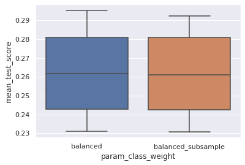
    


    

    


    
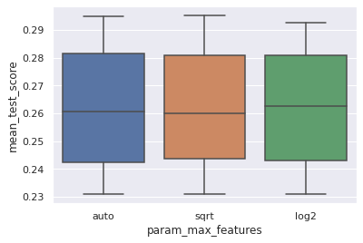
    


    
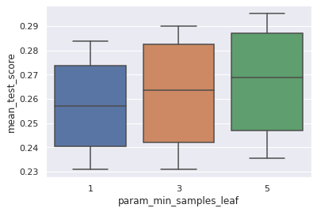
    


    
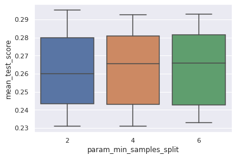
    


    
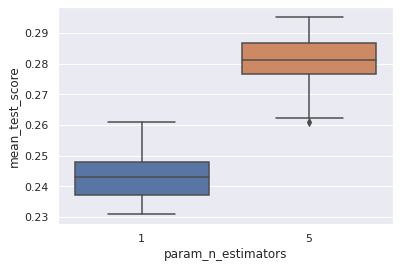
    


### Round 2

Let's take those best parameters and dig a little deaper


```python
print(grid.best_params_)
```

    {'bootstrap': False, 'class_weight': 'balanced', 'criterion': 'gini', 'max_features': 'sqrt', 'min_samples_leaf': 5, 'min_samples_split': 2, 'n_estimators': 5}


```python
param_grid = {'bootstrap': [True, False],
              'criterion': ['gini', 'entropy']}

grid = GridSearchCV(RandomForestClassifier(min_samples_leaf=5,
                                           min_samples_split=2,
                                           max_features='sqrt',
                                           class_weight='balanced',
                                           n_estimators=100), param_grid, cv=5, n_jobs=-1, verbose=2)
```


```python
grid.fit(X_train, y_train)
print(grid.best_params_)
```

    Fitting 5 folds for each of 4 candidates, totalling 20 fits
    {'bootstrap': False, 'criterion': 'entropy'}


```python
gs_results2 = pd.DataFrame(grid.cv_results_)
params = list(gs_results2.columns[gs_results2.columns.str.contains('param')].values)
params.pop(-1)
display(gs_results2.head())
print(params)
```


<div>
<style scoped>
    .dataframe tbody tr th:only-of-type {
        vertical-align: middle;
    }

    .dataframe tbody tr th {
        vertical-align: top;
    }

    .dataframe thead th {
        text-align: right;
    }
</style>
<table border="1" class="dataframe">
  <thead>
    <tr style="text-align: right;">
      <th></th>
      <th>mean_fit_time</th>
      <th>std_fit_time</th>
      <th>mean_score_time</th>
      <th>std_score_time</th>
      <th>param_bootstrap</th>
      <th>param_criterion</th>
      <th>params</th>
      <th>split0_test_score</th>
      <th>split1_test_score</th>
      <th>split2_test_score</th>
      <th>split3_test_score</th>
      <th>split4_test_score</th>
      <th>mean_test_score</th>
      <th>std_test_score</th>
      <th>rank_test_score</th>
    </tr>
  </thead>
  <tbody>
    <tr>
      <th>0</th>
      <td>20.133523</td>
      <td>0.372951</td>
      <td>0.581618</td>
      <td>0.020547</td>
      <td>True</td>
      <td>gini</td>
      <td>{'bootstrap': True, 'criterion': 'gini'}</td>
      <td>0.306825</td>
      <td>0.305909</td>
      <td>0.309612</td>
      <td>0.314281</td>
      <td>0.307036</td>
      <td>0.308733</td>
      <td>0.003035</td>
      <td>2</td>
    </tr>
    <tr>
      <th>1</th>
      <td>52.458941</td>
      <td>0.532249</td>
      <td>0.603756</td>
      <td>0.138301</td>
      <td>True</td>
      <td>entropy</td>
      <td>{'bootstrap': True, 'criterion': 'entropy'}</td>
      <td>0.311494</td>
      <td>0.297859</td>
      <td>0.314925</td>
      <td>0.312188</td>
      <td>0.304460</td>
      <td>0.308185</td>
      <td>0.006211</td>
      <td>4</td>
    </tr>
    <tr>
      <th>2</th>
      <td>31.101482</td>
      <td>0.656385</td>
      <td>0.763153</td>
      <td>0.090014</td>
      <td>False</td>
      <td>gini</td>
      <td>{'bootstrap': False, 'criterion': 'gini'}</td>
      <td>0.306665</td>
      <td>0.303494</td>
      <td>0.314603</td>
      <td>0.313798</td>
      <td>0.302689</td>
      <td>0.308250</td>
      <td>0.005044</td>
      <td>3</td>
    </tr>
    <tr>
      <th>3</th>
      <td>53.006182</td>
      <td>7.189164</td>
      <td>0.337193</td>
      <td>0.088254</td>
      <td>False</td>
      <td>entropy</td>
      <td>{'bootstrap': False, 'criterion': 'entropy'}</td>
      <td>0.307147</td>
      <td>0.303333</td>
      <td>0.317501</td>
      <td>0.313476</td>
      <td>0.307841</td>
      <td>0.309860</td>
      <td>0.005010</td>
      <td>1</td>
    </tr>
  </tbody>
</table>
</div>


    ['param_bootstrap', 'param_criterion']


```python
for param in params:
    sns.boxplot(x=gs_results[param], y=gs_results[target])
    plt.show()
```


    
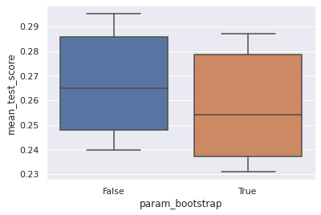
    


    
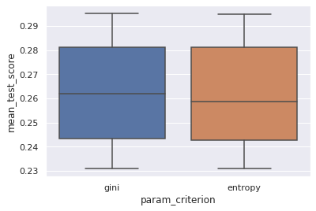
    


### Round 3

And now tune model complexity


```python
# Cell for Exercise 2
r2 = []
for n_estimators in range(10,100,10):
    model = RandomForestClassifier(n_estimators=n_estimators,
                                  bootstrap=False,
                                  criterion='entropy',
                                  min_samples_leaf=5,
                                   min_samples_split=2,
                                   max_features='sqrt',
                                   class_weight='balanced')
    model.fit(X_train, y_train)
    y_pred = model.predict(X_test)
    r2.append([r2_score(y_train, model.predict(X_train)),
    r2_score(y_test, model.predict(X_test))])
```


```python
score = np.array(r2)
score1 = score[:,0]
score2 = score[:,1]
fig, ax = plt.subplots(figsize=(10,5))
ax.plot(range(10,100,10), score1, ls='', marker='.', color='blue', label='Train')
ax.plot(range(10,100,10), score2, ls='', marker='o', color='red', label='Test')
ax.set_title("Scores with Increasing Model Complexity")
ax.set_xlabel("Trees in the Forest")
ax.set_ylabel("$R^2$")
ax.legend()
```


    <matplotlib.legend.Legend at 0x7f20e6d99a00>


    
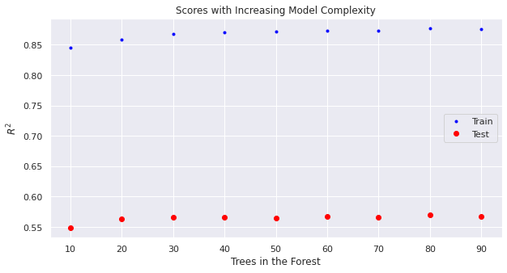
    


```python
model = grid.best_estimator_
model.n_estimators = 80
model.fit(X_train, y_train)
print(f"Train Acc: {accuracy_score(y_train, model.predict(X_train)):.2f}")
print(f"Test Acc: {accuracy_score(y_test, model.predict(X_test)):.2f}")

y_pred = model.predict(X_train)
print("Training Confusion Matrix")
print(classification_report(y_train, y_pred, zero_division=0))
fig, ax = plt.subplots(1, 1, figsize = (8,7))
sns.heatmap(confusion_matrix(y_train,y_pred), annot=True, ax=ax)
plt.show()

y_pred = model.predict(X_test)
print("Testing Confusion Matrix")
print(classification_report(y_test, y_pred, zero_division=0))
fig, ax = plt.subplots(1, 1, figsize = (8,7))
sns.heatmap(confusion_matrix(y_test,y_pred), annot=True, ax=ax)
```

    Train Acc: 0.90
    Test Acc: 0.32
    Training Confusion Matrix
                  precision    recall  f1-score   support
    
               1       0.86      0.95      0.90      3148
               2       0.88      0.91      0.90      3241
               3       0.92      0.86      0.89      3458
               4       0.90      0.88      0.89      3075
               5       0.87      0.91      0.89      2658
               6       0.91      0.86      0.89      3198
               7       0.93      0.85      0.89      3426
               8       0.90      0.93      0.91      2759
               9       0.91      0.89      0.90      3274
              10       0.88      0.94      0.91      2819
    
        accuracy                           0.90     31056
       macro avg       0.90      0.90      0.90     31056
    weighted avg       0.90      0.90      0.90     31056
    


    
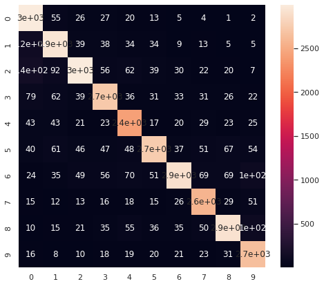
    


    Testing Confusion Matrix
                  precision    recall  f1-score   support
    
               1       0.51      0.60      0.55       840
               2       0.34      0.38      0.36       794
               3       0.30      0.26      0.28       824
               4       0.27      0.24      0.26       782
               5       0.17      0.21      0.19       604
               6       0.25      0.22      0.23       813
               7       0.25      0.21      0.23       842
               8       0.25      0.24      0.24       736
               9       0.33      0.30      0.31       818
              10       0.44      0.54      0.48       712
    
        accuracy                           0.32      7765
       macro avg       0.31      0.32      0.31      7765
    weighted avg       0.31      0.32      0.32      7765
    


    <AxesSubplot:>


    
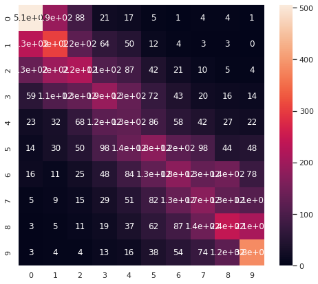
    


After all that work we don't get much lift from the random forest with default hyperparameters

## Conclusion

### The Final Classification Model

Final model had an F1 score ranging from 19-55% depending on class and a total accuracy of 32%

This model could be used to suggest a price band for would-be airbnb hosts in NYC; or a price estimator to assess how changes in listing attributes wil affect price. A potential pitfall could be that new airbnb hosts will not have many total reviews or high variance in the reviews per month.

We can currate price signal from the available feature inputs:

* `neighbourhood_group`
* `neighbourhood`
* `longitude`/`latitude`
* `room_type`
* `price`
* `minimum_nights`
* `number_of_reviews`
* `reviews_per_month`
* `calculated_host_listings_count`
* `availability_365`

What worked:

* dropping nans row-wise allowed us to keep the `reviews_per_month` column, which gave us an \\(R^2\\) boost of 10%
* converting from a regression problem to a classification problem allowed us to deal with the long, high-price tail
* converting one hot encoded vectors to the first principal components kept us from overfitting (although this was not important for the random forrest model)

More to try:

* change `last_review_date` from `datetime` or `str` to `int`
* use PCA for outlier removal based on the input data `X`
* imput missing values for `reviews_per_month` to capture an additional 10,000 datapoints

### Additional Strategies

Removing outliers based on the target variable, `price`, could also be a valid strategy. If we were to employ the model, we would have to be transparent that it should be used to predict prices in the sub $700 range, which is most of the Airbnb business in NYC anyway. At the end of the day, our decisions about model creation need to serve the business need. 
